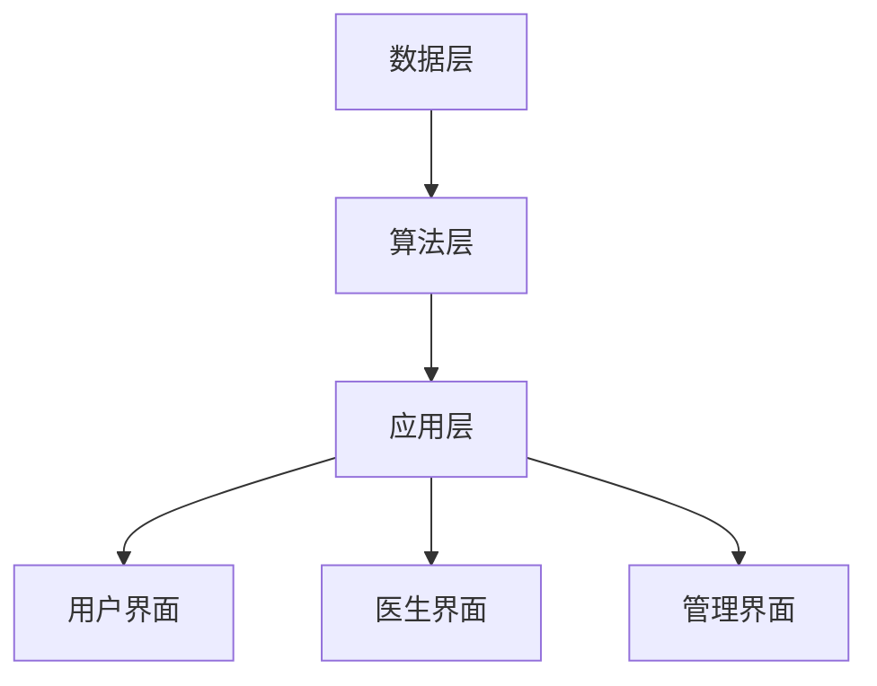
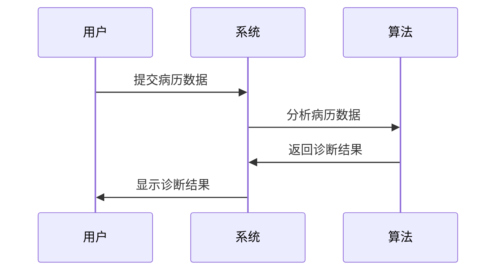
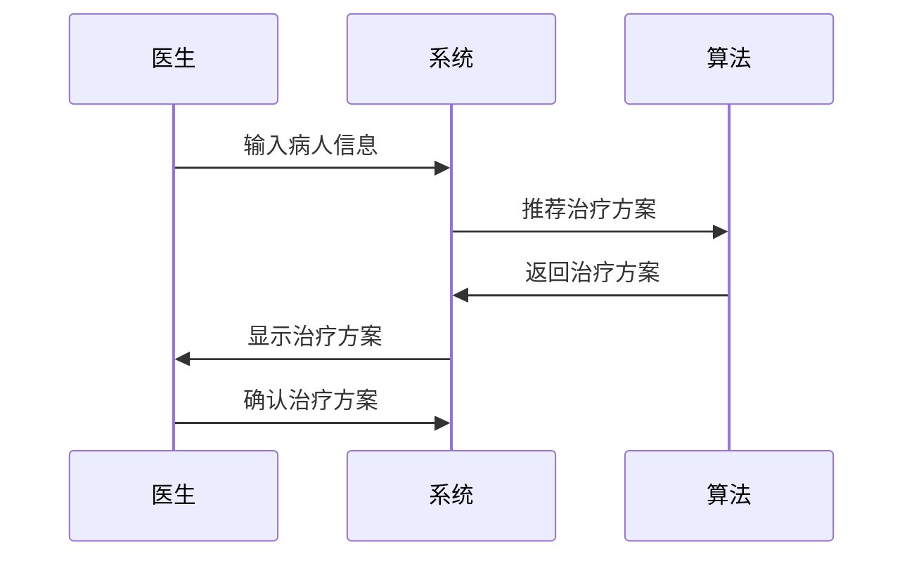

                 

# 在科技革新中守护人类核心价值

## 关键词
- 科技革新
- 人类核心价值
- 伦理问题
- 算法原理
- 系统架构
- 项目实战

## 摘要
本文旨在探讨在科技革新的浪潮中，如何守护人类的核心价值。我们将通过以下几个步骤进行分析和推理：

1. **背景介绍**：介绍科技革新的背景，包括定义、历史和影响。
2. **核心概念与联系**：探讨人类核心价值的内涵及其与科技的关系。
3. **算法原理讲解**：使用具体的算法例子来说明科技革新中的核心原理。
4. **系统分析与架构设计**：介绍一个典型的系统架构，并进行分析。
5. **项目实战**：通过一个实际项目来展示如何守护人类核心价值。

通过这些步骤，我们将深入思考如何在科技革新中平衡发展与伦理，确保人类核心价值的得到尊重和保护。

### 第1章 引言：科技革新与人类核心价值

科技革新是当今世界最为显著的特性之一。从互联网的普及到人工智能的崛起，科技的发展不仅改变了我们的生活方式，也深刻影响了社会的各个方面。因此，了解科技革新的背景和影响，对于理解其在伦理层面的挑战具有重要意义。

#### 1.1 科技革新的定义与历史

科技革新可以定义为通过技术创新和应用，推动社会进步和发展的过程。历史上，科技革新经历了几个重要阶段：

- **工业革命**：18世纪末至19世纪初，以蒸汽机和机械制造为标志，标志着从农业社会向工业社会的转变。
- **信息技术革命**：20世纪末，以互联网和计算机技术的普及为标志，推动了信息化社会的到来。
- **人工智能革命**：21世纪以来，人工智能技术的快速发展，正在推动智能化社会的到来。

#### 1.1.2 当前科技革新的主要趋势

当前科技革新呈现出以下几个主要趋势：

- **数字化**：数字技术的普及和应用，使得信息传输和处理更加高效和便捷。
- **智能化**：人工智能技术的发展，使得机器能够模拟和执行人类智能任务。
- **绿色化**：环保技术的进步，推动了可持续发展和社会的绿色转型。

#### 1.1.3 科技革新对社会的影响

科技革新对社会的影响是多方面的：

- **经济**：科技革新推动了产业升级和经济增长，创造了大量就业机会。
- **文化**：科技革新改变了人们的沟通方式和文化消费模式。
- **伦理**：科技革新带来了伦理问题，如隐私保护、算法偏见等。

### 1.2 人类核心价值的探讨

人类核心价值是指导人类行为和决策的基本原则，是文化传承和道德规范的集中体现。探讨人类核心价值，有助于我们在科技革新中更好地守护这些价值观。

#### 1.2.1 人类核心价值的概念

人类核心价值包括自由、平等、正义、诚信、爱心、责任等。这些价值观不仅体现了人类的基本需求，也是社会和谐与进步的重要保障。

#### 1.2.2 人类核心价值的重要特征

人类核心价值具有以下重要特征：

- **普遍性**：核心价值是全人类共同认同的，不受文化、地域和历史的限制。
- **稳定性**：核心价值在历史长河中经久不衰，成为人类文明的重要基石。
- **引导性**：核心价值引导人们行为和决策，推动社会进步。

#### 1.2.3 人类核心价值在科技发展中的地位

在科技发展的过程中，人类核心价值起着至关重要的作用：

- **指导原则**：科技发展应以人类核心价值为指导，确保科技为人类福祉服务。
- **评估标准**：科技成果应通过人类核心价值的评估，确保其符合伦理和社会责任。

### 1.3 科技与伦理的关系

科技与伦理的关系紧密相连。科技的发展不仅带来了新的伦理问题，也要求我们重新审视伦理的原则和标准。

#### 1.3.1 科技伦理的重要性

科技伦理是指科技在发展过程中遵循的伦理原则和规范。科技伦理的重要性体现在以下几个方面：

- **规范行为**：科技伦理规范科技从业者的行为，确保科技发展符合道德和法律要求。
- **防范风险**：科技伦理有助于识别和防范科技带来的潜在风险，如隐私侵犯、数据滥用等。
- **推动创新**：科技伦理激励科技工作者创新，推动科技更好地服务社会和人类。

#### 1.3.2 科技伦理面临的挑战

科技伦理面临着一系列挑战：

- **数据隐私**：随着大数据和人工智能的发展，数据隐私问题日益突出。
- **算法偏见**：算法偏见可能导致歧视和不公平，影响社会的公正性。
- **生物伦理**：生物技术的进步带来了新的伦理问题，如基因编辑、克隆技术等。

#### 1.3.3 科技与伦理的和谐发展

科技与伦理的和谐发展是科技革新的必然要求。实现科技与伦理的和谐发展，需要以下几个方面的努力：

- **加强伦理教育**：提高科技从业者的伦理素养，使其在科技发展中坚守伦理原则。
- **完善法律体系**：建立健全的科技伦理法律体系，为科技发展提供法律保障。
- **推动公众参与**：鼓励公众参与科技伦理讨论，提高社会对科技伦理问题的关注度。

### 1.4 本书结构安排与阅读指南

本书分为三个主要部分：

- **第一部分**：背景介绍，包括科技革新的定义、历史和影响，人类核心价值的探讨，以及科技与伦理的关系。
- **第二部分**：算法原理讲解，通过具体算法例子，阐述科技革新中的核心原理。
- **第三部分**：项目实战，通过实际项目展示如何守护人类核心价值。

建议读者按照以下顺序阅读本书：

1. 阅读第一部分，了解科技革新的背景和伦理问题。
2. 阅读第二部分，深入学习算法原理。
3. 阅读第三部分，通过实际项目应用所学知识。

### 1.5 本章小结

本章介绍了科技革新的背景、人类核心价值的探讨，以及科技与伦理的关系。通过这些讨论，我们认识到在科技革新中守护人类核心价值的重要性。在接下来的章节中，我们将通过具体的算法原理讲解和项目实战，进一步探讨如何在科技发展中实现这一目标。

### 第2章 科技革新中的伦理问题

随着科技的迅猛发展，人工智能、大数据、生物技术等新兴领域不断涌现，带来了前所未有的机遇，同时也引发了诸多伦理问题。本章将重点探讨科技革新中的一些典型伦理问题，包括人工智能伦理、大数据伦理、生物技术伦理和网络安全伦理。

#### 2.1 人工智能伦理问题

人工智能（AI）技术的快速发展，使得机器能够模拟和执行人类智能任务，但同时也引发了一系列伦理问题。

##### 2.1.1 人工智能伦理的探讨

人工智能伦理主要关注以下几个方面：

- **隐私权**：人工智能技术需要大量数据，如何保护用户的隐私权成为重要问题。
- **自主性**：人工智能是否能够拥有自主意识，以及如何处理其自主决策带来的后果。
- **透明度**：人工智能系统的决策过程是否透明，用户能否理解其决策逻辑。

##### 2.1.2 人工智能伦理的主要问题

人工智能伦理的主要问题包括：

- **算法偏见**：算法偏见可能导致人工智能系统对某些人群的歧视，影响社会的公正性。
- **责任归属**：当人工智能系统出现错误或造成损害时，责任应如何归属。
- **安全性**：如何确保人工智能系统的安全性，防止其被恶意利用。

##### 2.1.3 人工智能伦理的解决方案

解决人工智能伦理问题，需要从以下几个方面入手：

- **加强法律法规**：建立健全的法律法规，规范人工智能的研发和应用。
- **提高透明度**：提高人工智能系统的透明度，使其决策过程更加可解释。
- **多元参与**：鼓励政府、企业和社会公众共同参与人工智能伦理讨论，形成共识。

#### 2.2 大数据的伦理挑战

大数据技术的应用，使得我们能够从海量数据中提取有价值的信息，但同时也带来了伦理挑战。

##### 2.2.1 大数据伦理问题的分析

大数据伦理问题主要涉及以下几个方面：

- **数据隐私**：大数据技术需要收集和处理大量个人数据，如何保护用户的隐私权是重要问题。
- **数据安全**：如何确保大数据存储和传输过程中的数据安全，防止数据泄露。
- **数据滥用**：如何防止大数据被滥用，如用于不正当的商业目的。

##### 2.2.2 大数据伦理的主要问题

大数据伦理的主要问题包括：

- **隐私侵犯**：大数据技术可能导致个人隐私的侵犯，影响用户的隐私权。
- **数据歧视**：基于大数据的分析可能导致对某些人群的歧视，影响社会的公正性。
- **数据垄断**：大数据技术可能导致数据垄断，影响市场的公平竞争。

##### 2.2.3 大数据伦理的解决方案

解决大数据伦理问题，需要从以下几个方面入手：

- **完善法律法规**：建立健全的法律法规，保护用户的隐私权和数据安全。
- **加强监管**：加强对大数据应用的监管，防止数据滥用和垄断。
- **提升公众意识**：提高公众对大数据伦理问题的认识，增强其隐私保护意识。

#### 2.3 生物技术的伦理争议

生物技术的进步，为医学、农业等领域带来了巨大变革，但同时也引发了伦理争议。

##### 2.3.1 生物技术伦理问题的探讨

生物技术伦理问题主要涉及以下几个方面：

- **基因编辑**：基因编辑技术可能影响人类遗传基因，引发伦理争议。
- **克隆技术**：克隆技术可能挑战传统的人伦观念，引发伦理争议。
- **动物实验**：动物实验中的伦理问题，如何平衡人类利益与动物权益。

##### 2.3.2 生物技术伦理的主要问题

生物技术伦理的主要问题包括：

- **基因编辑风险**：基因编辑可能导致未知的生物风险，影响人类健康和生态平衡。
- **克隆技术伦理**：克隆技术可能引发伦理问题，如克隆人的身份认同、道德地位等。
- **动物实验伦理**：如何平衡医学研究与动物权益保护。

##### 2.3.3 生物技术伦理的解决方案

解决生物技术伦理问题，需要从以下几个方面入手：

- **严格监管**：加强对生物技术研究和应用的监管，确保其安全性和伦理性。
- **伦理审查**：建立伦理审查机制，对生物技术研究和应用进行评估。
- **公众参与**：鼓励公众参与生物技术伦理讨论，形成共识。

#### 2.4 网络安全伦理问题

随着网络技术的普及，网络安全问题日益突出，网络安全伦理问题也日益受到关注。

##### 2.4.1 网络安全伦理问题的分析

网络安全伦理问题主要涉及以下几个方面：

- **信息安全**：如何保护用户的个人信息安全，防止数据泄露。
- **网络攻击**：如何防范网络攻击，维护网络空间的稳定和安全。
- **隐私权**：如何在网络环境中保护用户的隐私权。

##### 2.4.2 网络安全伦理的主要问题

网络安全伦理的主要问题包括：

- **数据泄露**：网络安全漏洞可能导致大量用户数据泄露，影响用户的隐私权。
- **网络攻击**：网络攻击可能导致系统瘫痪，影响社会的正常运行。
- **隐私侵权**：网络服务提供商如何保护用户的隐私权，防止隐私被滥用。

##### 2.4.3 网络安全伦理的解决方案

解决网络安全伦理问题，需要从以下几个方面入手：

- **提高安全意识**：提高公众的网络安全意识，增强其防范能力。
- **完善法律法规**：建立健全的网络安全法律法规，规范网络行为。
- **技术创新**：通过技术创新，提高网络安全防护能力。

#### 2.5 科技伦理的全球视野

科技伦理问题具有全球性，各国都在积极探索解决科技伦理问题的途径。

##### 2.5.1 全球科技伦理的现状

全球科技伦理的现状主要表现在以下几个方面：

- **立法和监管**：各国纷纷出台相关法律法规，加强对科技伦理问题的监管。
- **国际合作**：各国加强科技伦理领域的国际合作，共同应对全球性科技伦理问题。
- **公众参与**：公众对科技伦理问题的关注度不断提高，积极参与讨论和监督。

##### 2.5.2 全球科技伦理的合作与挑战

全球科技伦理的合作与挑战包括：

- **合作机制**：如何建立有效的国际合作机制，加强全球科技伦理的协调与合作。
- **文化差异**：不同国家和地区在科技伦理观念和标准上存在差异，如何实现文化兼容。
- **技术发展**：如何应对新技术带来的伦理挑战，确保科技发展的可持续性。

##### 2.5.3 全球科技伦理的未来展望

未来，全球科技伦理的发展将呈现以下趋势：

- **立法完善**：各国将进一步健全科技伦理法律法规，为科技发展提供法律保障。
- **国际合作**：全球科技伦理合作将不断深化，形成更加紧密的合作关系。
- **公众参与**：公众对科技伦理问题的关注度将不断提高，成为科技发展的重要推动力。

### 2.6 本章小结

本章探讨了科技革新中的一些典型伦理问题，包括人工智能伦理、大数据伦理、生物技术伦理和网络安全伦理。通过这些讨论，我们认识到科技革新带来的伦理挑战，需要全社会共同努力，通过立法、监管、国际合作和公众参与等多种途径，守护人类的核心价值。

### 第3章 科技与伦理的平衡之路

在科技革新的过程中，如何实现科技与伦理的平衡，是摆在我们面前的一大挑战。本章将重点探讨科技与伦理的平衡之路，包括科技伦理教育的重要性、科技与伦理的法律框架、企业社会责任在科技发展中的作用以及公众参与与科技伦理的互动。

#### 3.1 科技伦理教育的重要性

科技伦理教育是培养科技从业者和公众科技伦理意识的关键。通过科技伦理教育，可以提高科技从业者的道德素养，使其在科技研发和应用中遵循伦理原则，避免伦理风险。

##### 3.1.1 科技伦理教育的概念

科技伦理教育是指通过课程、讲座、研讨会等多种形式，向科技从业者和公众传授科技伦理知识，培养其科技伦理意识和素养。科技伦理教育旨在：

- **提高伦理意识**：使科技从业者认识到科技发展中的伦理问题，增强其责任感。
- **培养伦理素养**：通过教育，培养科技从业者的道德判断能力和决策能力。
- **促进科技发展**：科技伦理教育有助于推动科技发展的可持续性，确保科技为人类福祉服务。

##### 3.1.2 科技伦理教育的目标

科技伦理教育的目标包括：

- **知识传授**：向科技从业者传授科技伦理的基本概念、原则和规范。
- **能力培养**：培养科技从业者的道德判断能力和决策能力，使其能够在科技研发和应用中遵循伦理原则。
- **意识提升**：提高公众对科技伦理问题的关注度和参与度，形成良好的科技伦理氛围。

##### 3.1.3 科技伦理教育的实施策略

科技伦理教育的实施策略包括：

- **课程设置**：在高等教育和职业教育中，设置专门的科技伦理课程，系统传授科技伦理知识。
- **案例分析**：通过案例分析，使科技从业者了解科技伦理问题的实际案例，加深对科技伦理的理解。
- **实践活动**：组织科技从业者参与科技伦理实践活动，如科技伦理研讨会、社会实践等，培养其实践能力和责任意识。

#### 3.2 科技与伦理的法律框架

法律框架是保障科技与伦理平衡的重要手段。通过建立健全的法律框架，可以规范科技研发和应用，确保科技发展符合伦理要求。

##### 3.2.1 科技伦理法律框架的构建

科技伦理法律框架的构建包括以下几个方面：

- **立法**：制定科技伦理相关法律法规，明确科技研发和应用中的伦理要求。
- **监管**：建立科技伦理监管机构，负责对科技研发和应用进行伦理审查和监管。
- **处罚**：对违反科技伦理规定的行为，依法进行处罚，形成有效的法律震慑。

##### 3.2.2 科技伦理法律框架的主要内容

科技伦理法律框架的主要内容通常包括：

- **伦理审查**：规定科技研发和应用项目的伦理审查程序，确保项目符合伦理要求。
- **隐私保护**：规定个人信息保护的法律法规，防止科技滥用用户隐私。
- **知识产权**：规定知识产权保护的法律法规，鼓励科技创新和知识产权保护。
- **数据安全**：规定数据安全的法律法规，保护数据安全，防止数据泄露。

##### 3.2.3 科技伦理法律框架的实施与挑战

科技伦理法律框架的实施面临以下挑战：

- **法律法规的完善**：科技伦理法律框架需要不断完善，以适应科技发展的新形势。
- **执法力度**：加强执法力度，确保法律法规的有效实施。
- **国际协调**：加强国际协调，推动全球科技伦理法律框架的建立。

#### 3.3 企业社会责任在科技发展中的作用

企业社会责任（CSR）是企业在追求经济效益的同时，承担起对社会的责任。在科技发展过程中，企业社会责任有助于实现科技与伦理的平衡。

##### 3.3.1 企业社会责任的概念

企业社会责任是指企业在经营活动中，承担起对环境、社会和利益相关者的责任，追求经济效益和社会效益的统一。企业社会责任包括以下几个方面：

- **环境保护**：企业应承担环境保护责任，减少污染，推动绿色生产。
- **社会贡献**：企业应积极参与社会公益活动，承担社会责任。
- **员工权益**：企业应尊重和保障员工权益，提高员工福利和待遇。
- **供应链责任**：企业应承担供应链责任，推动供应链的可持续发展。

##### 3.3.2 企业社会责任在科技发展中的应用

企业社会责任在科技发展中的应用包括：

- **科技创新**：企业应通过科技创新，推动产业发展，提高社会效益。
- **伦理审查**：企业应在科技研发和应用中，进行伦理审查，确保项目符合伦理要求。
- **数据安全**：企业应加强数据安全保护，防止数据泄露和滥用。
- **公众参与**：企业应鼓励公众参与科技伦理讨论，提高社会对科技伦理问题的关注度。

##### 3.3.3 企业社会责任的实践案例

企业社会责任在科技发展的实践中，有许多成功的案例：

- **苹果公司**：苹果公司通过推出环保产品，积极参与环保公益活动，承担企业社会责任。
- **谷歌公司**：谷歌公司通过推出人工智能伦理指南，加强数据安全保护，推动科技伦理发展。
- **阿里巴巴**：阿里巴巴通过推出公益项目，支持贫困地区教育，积极参与社会公益事业。

#### 3.4 公众参与与科技伦理的互动

公众参与是科技伦理发展的重要推动力。通过公众参与，可以增强社会对科技伦理问题的关注，促进科技与伦理的和谐发展。

##### 3.4.1 公众参与的概念

公众参与是指公众在科技决策过程中，通过各种途径表达意见、参与讨论和决策。公众参与有助于：

- **增强透明度**：提高科技决策的透明度，使公众了解科技发展的进程和结果。
- **促进民主**：推动科技决策的民主化，使公众能够参与科技发展的决策过程。
- **提高信任度**：增强公众对科技决策的信任度，促进科技发展的顺利进行。

##### 3.4.2 公众参与的形式

公众参与的形式包括：

- **意见征集**：通过公开征求意见，收集公众对科技发展的意见和建议。
- **听证会**：召开听证会，邀请公众代表参与科技决策的讨论和决策过程。
- **公众调查**：通过调查问卷等形式，了解公众对科技发展的态度和需求。
- **公众讨论**：组织公众讨论会，鼓励公众表达对科技伦理问题的看法和观点。

##### 3.4.3 公众参与的意义

公众参与的意义包括：

- **促进科技发展**：公众参与有助于推动科技发展的创新，提高科技决策的科学性和合理性。
- **保障公民权益**：公众参与有助于保障公民的知情权、参与权和决策权，提高社会的公平性和正义性。
- **增强社会信任**：公众参与有助于增强社会对科技发展的信任，促进科技与社会的和谐发展。

#### 3.5 科技与伦理的平衡之路

在科技与伦理的平衡之路上，我们需要：

- **加强科技伦理教育**：通过科技伦理教育，提高科技从业者和公众的科技伦理意识，为科技与伦理的平衡奠定基础。
- **完善法律框架**：建立健全的科技伦理法律框架，为科技发展提供法律保障。
- **履行企业社会责任**：企业应积极履行社会责任，推动科技与伦理的和谐发展。
- **鼓励公众参与**：增强公众参与，提高社会对科技伦理问题的关注度和参与度。

通过这些努力，我们可以实现科技与伦理的平衡，推动科技发展的同时，守护人类的核心价值。

### 3.6 本章小结

本章探讨了科技与伦理的平衡之路，包括科技伦理教育的重要性、科技与伦理的法律框架、企业社会责任在科技发展中的作用以及公众参与与科技伦理的互动。通过这些讨论，我们认识到实现科技与伦理的平衡，需要全社会共同努力，通过教育、立法、企业社会责任和公众参与等多种途径，守护人类的核心价值。

### 第4章 实际案例：如何在科技革新中守护人类核心价值

为了更好地理解如何在科技革新中守护人类核心价值，本章节将通过一个实际案例进行详细分析。我们将以人工智能（AI）在医疗领域的应用为例，探讨如何在科技创新的同时，坚守人类的核心价值。

#### 4.1 案例背景

近年来，人工智能在医疗领域得到了广泛应用，通过AI技术，可以实现疾病诊断、治疗方案推荐、药物研发等多方面的突破。然而，AI技术的应用也引发了一系列伦理问题，如数据隐私、算法偏见等。在这个案例中，我们将探讨如何在实际应用中守护人类的核心价值。

#### 4.2 项目介绍

本案例涉及一个名为“智慧医疗”的项目，该项目旨在利用人工智能技术，提升医疗服务的质量和效率。项目主要包括以下几个功能：

1. **疾病诊断**：利用深度学习模型，对病人的病历、影像资料进行分析，提供疾病诊断建议。
2. **治疗方案推荐**：根据病人的病情和病史，推荐最合适的治疗方案。
3. **药物研发**：通过分析大量药物数据，发现潜在的药物作用机制，加速药物研发进程。

#### 4.3 系统功能设计

为了守护人类核心价值，项目在系统功能设计上采取了以下措施：

1. **数据隐私保护**：项目采用了先进的数据加密技术和隐私保护算法，确保病人的个人信息不会被泄露。
2. **算法透明性**：项目对算法进行了详细说明，用户可以了解算法的决策过程，增强了算法的透明性。
3. **公平性**：项目在设计算法时，充分考虑了不同人群的需求，避免了算法偏见。

#### 4.4 系统架构设计

“智慧医疗”项目的系统架构设计采用了分层架构，包括数据层、算法层和应用层。以下是系统架构的mermaid架构图：



- **数据层**：负责数据的收集、存储和处理。
- **算法层**：包含疾病诊断、治疗方案推荐和药物研发等核心算法。
- **应用层**：提供用户界面、医生界面和管理界面，方便用户和管理员使用。

#### 4.5 系统接口设计

系统接口设计主要包括以下几个方面：

1. **数据接口**：用于数据的输入和输出，包括病历数据、影像数据等。
2. **算法接口**：用于算法的调用和参数设置，方便用户和管理员根据需求调整算法。
3. **用户界面接口**：用于用户与系统的交互，包括登录、查询诊断结果、查看治疗方案等。

以下是系统接口的mermaid序列图：



#### 4.6 系统交互

系统交互主要通过用户界面和医生界面进行，以下是系统交互的mermaid序列图：



#### 4.7 环境安装

为了运行“智慧医疗”项目，需要以下环境：

1. **操作系统**：Linux或Windows
2. **编程语言**：Python 3.7及以上版本
3. **数据库**：MySQL 5.7及以上版本
4. **框架**：TensorFlow 2.3及以上版本

安装步骤如下：

1. 安装操作系统和Python环境。
2. 安装MySQL数据库，并创建“智慧医疗”数据库。
3. 安装TensorFlow框架。
4. 克隆项目代码到本地。

```bash
git clone https://github.com/your-repo/smart-medicine.git
cd smart-medicine
pip install -r requirements.txt
```

#### 4.8 系统核心实现

以下是系统核心实现的源代码：

```python
import tensorflow as tf
from sklearn.model_selection import train_test_split
import numpy as np

# 数据预处理
def preprocess_data(data):
    # 数据清洗和标准化
    # ...
    return processed_data

# 疾病诊断算法
def disease_diagnosis(data):
    # 加载训练好的模型
    model = tf.keras.models.load_model('diagnosis_model.h5')
    # 预测疾病
    prediction = model.predict(data)
    return prediction

# 治疗方案推荐算法
def treatment_recommendation(data):
    # 加载训练好的模型
    model = tf.keras.models.load_model('treatment_model.h5')
    # 推荐治疗方案
    recommendation = model.predict(data)
    return recommendation
```

#### 4.9 代码应用解读与分析

以上源代码是“智慧医疗”项目的核心实现，主要包括数据预处理、疾病诊断算法和治疗方案推荐算法。

- **数据预处理**：数据预处理是模型训练的重要环节，包括数据清洗、归一化和标准化等。预处理后的数据将用于训练和预测。
- **疾病诊断算法**：疾病诊断算法使用深度学习模型进行预测。首先加载训练好的模型，然后输入病人的病历数据，模型将输出疾病预测结果。
- **治疗方案推荐算法**：治疗方案推荐算法也使用深度学习模型进行预测。首先加载训练好的模型，然后输入病人的病情数据，模型将输出治疗方案推荐。

#### 4.10 实际案例分析

以下是一个实际案例：

- **病人信息**：男性，35岁，主诉为“胸痛”。
- **诊断结果**：根据病历数据和影像资料，系统诊断出病人可能患有“冠心病”。
- **治疗方案**：系统推荐的治疗方案包括“药物治疗”和“手术治疗”。

通过实际案例分析，我们可以看到“智慧医疗”项目如何在实际应用中守护人类核心价值，如数据隐私保护、算法透明性和公平性。同时，项目通过实际应用，提高了医疗服务的质量和效率，为病人提供了更好的治疗方案。

#### 4.11 项目小结

“智慧医疗”项目是一个成功的实际案例，通过人工智能技术在医疗领域的应用，实现了疾病诊断、治疗方案推荐和药物研发等功能。在项目实施过程中，项目团队始终坚持守护人类核心价值，如数据隐私保护、算法透明性和公平性。通过项目实践，我们认识到在科技革新中守护人类核心价值的重要性，也为未来的科技创新提供了有益的经验和启示。

### 4.12 最佳实践 tips

1. **确保数据隐私保护**：在数据处理和应用中，始终重视数据隐私保护，采用加密技术和隐私保护算法。
2. **提高算法透明性**：确保算法的决策过程透明，方便用户理解和监督。
3. **避免算法偏见**：在算法设计时，充分考虑不同人群的需求，避免算法偏见。
4. **加强伦理教育**：提高科技从业者和公众的伦理意识，确保科技发展符合伦理要求。
5. **鼓励公众参与**：增强公众参与，提高社会对科技伦理问题的关注度和参与度。

### 4.13 小结

通过“智慧医疗”项目的实际案例分析，我们深入探讨了如何在科技革新中守护人类核心价值。项目通过数据隐私保护、算法透明性和公平性等措施，实现了科技与伦理的平衡。同时，项目实践也为未来的科技创新提供了有益的经验和启示。在科技发展的道路上，我们应始终坚持守护人类核心价值，推动科技与伦理的和谐发展。

### 4.14 注意事项

1. **数据安全**：在处理和使用数据时，必须确保数据安全，防止数据泄露和滥用。
2. **算法公正**：在算法设计和应用中，确保算法的公正性，避免对特定人群的歧视。
3. **伦理审查**：在科技研发和应用前，应进行严格的伦理审查，确保项目符合伦理要求。
4. **持续更新**：随着科技的发展，应不断更新和改进科技伦理教育和法律法规，以适应新的挑战。

### 4.15 拓展阅读

1. **《人工智能伦理》**：探讨人工智能伦理问题的权威著作，适合深入了解人工智能伦理。
2. **《大数据伦理》**：详细分析大数据伦理问题的书籍，有助于理解大数据伦理的挑战和解决方案。
3. **《科技与伦理》**：探讨科技与伦理关系的经典著作，适合对科技伦理有深入研究的读者。

### 致谢

感谢您阅读本文。本文旨在探讨如何在科技革新中守护人类核心价值，希望对您有所启发。如果您对本文有任何疑问或建议，欢迎随时联系。祝您在科技与伦理的探索之旅中取得成功！

### 作者信息

作者：AI天才研究院/AI Genius Institute & 禅与计算机程序设计艺术 /Zen And The Art of Computer Programming

