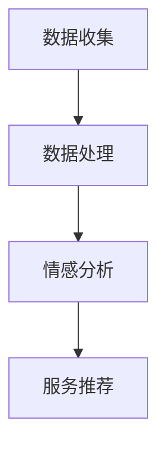
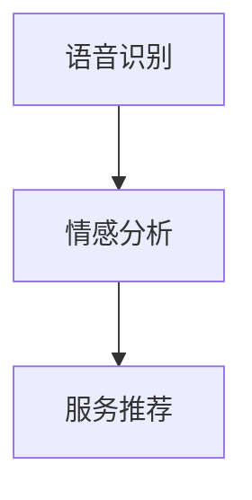
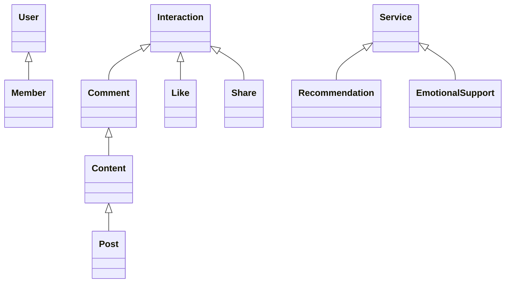
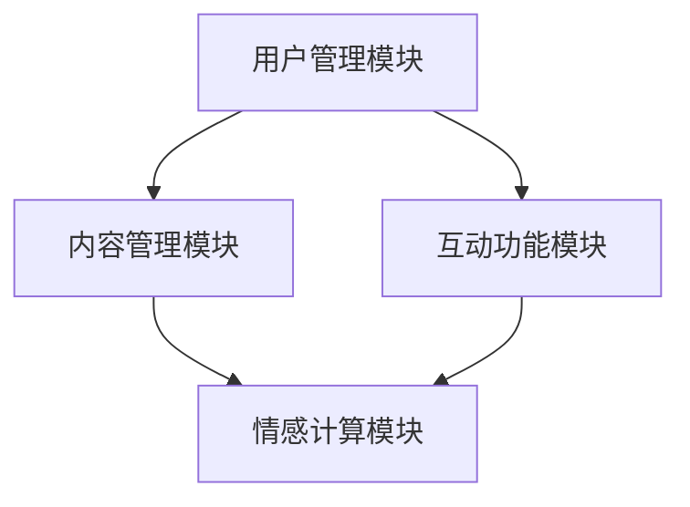
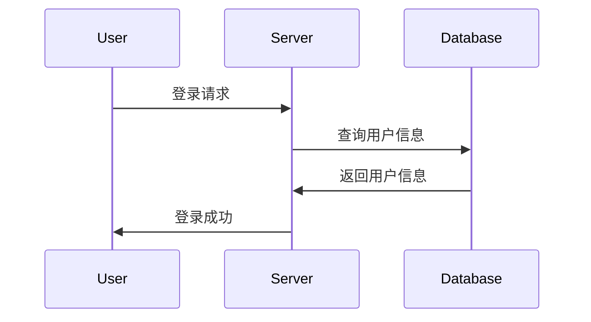
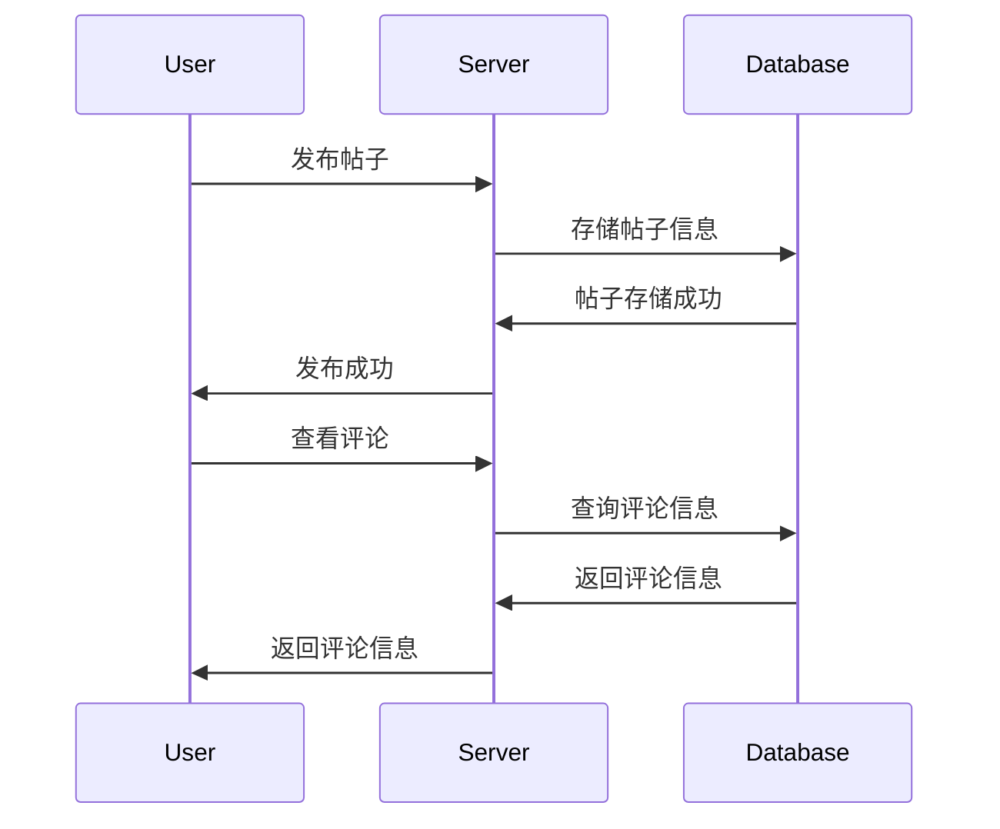

                 


# 在网络时代重建社区意识

关键词：网络时代、社区意识、人工智能、情感计算、社区感知

摘要：
在网络时代，社区意识的重要性愈发凸显。然而，随着社交媒体和在线平台的普及，传统社区意识受到削弱。本文旨在探讨如何在网络时代重建社区意识，提升社区成员之间的联系和互动。通过分析社区意识的定义、网络时代社区意识削弱的原因，以及人工智能、情感计算和社区感知等技术手段的应用，本文提出了一系列重建社区意识的策略和方法。

## 第一部分：背景介绍

### 问题背景

在网络时代，社区的重要性日益凸显。随着社交媒体和在线平台的普及，人们的生活方式发生了翻天覆地的变化。然而，这种变化也带来了社区意识的削弱。许多社区成员之间的联系变得表面化，真实的互动和情感交流减少，导致社区凝聚力下降。

### 问题描述

《在网络时代重建社区意识》这本书旨在探讨如何在网络时代重建社区意识，提升社区成员之间的联系和互动。书中将深入分析网络时代社区意识削弱的原因，并探讨有效的重建策略和方法。

### 问题解决

本书将从多个角度出发，包括心理学、社会学、信息技术等，为读者提供重建社区意识的系统性方法和实用技巧。

### 边界与外延

在网络时代重建社区意识不仅仅局限于线上社区，也包括线下社区。此外，本书还将探讨如何在不同类型的社区中重建社区意识，如学术社区、商业社区、兴趣社区等。

### 概念结构与核心要素组成

- **社区**：具有共同兴趣、目标或特征的个体组成的群体。
- **社区意识**：社区成员对社区共同目标和价值的认同感和责任感。
- **网络时代**：以互联网和在线平台为核心的社会发展阶段。

### 本章小结

本部分为全书奠定了基础，明确了网络时代社区意识削弱的问题及其重要性。接下来，本书将深入探讨重建社区意识的理论基础和实践方法。通过全面而系统的研究，本书旨在为读者提供具有实际操作性的解决方案，帮助他们在网络时代重建社区意识，增强社区凝聚力。

## 第二部分：核心概念与联系

### AI与社区意识的关联

**AI（人工智能）**：一种模拟人类智能的技术，能够通过数据分析和学习自主地执行任务。

**社区意识**：社区成员对社区共同目标和价值的认同感和责任感。

- **关联**：AI可以通过分析大量数据来识别社区成员的需求和互动模式，从而提供个性化的服务和推荐，增强社区成员之间的互动和联系，进而提升社区意识。

### 核心概念原理

**社区感知AI**：利用传感器、摄像头等技术收集社区数据，进行分析和预测，为社区管理和运营提供决策支持。

**情感计算**：通过分析语音、面部表情等情感特征，了解社区成员的情感状态，提供情感化的服务和互动。

### 概念属性特征对比表格

| 概念       | 定义                                                         | 属性特征                                                     | 对比分析                                                     |
|------------|--------------------------------------------------------------|--------------------------------------------------------------|--------------------------------------------------------------|
| 社区感知AI | 利用传感器、摄像头等技术收集社区数据，进行分析和预测。       | 数据收集、分析、预测、可视化。                               | 与传统数据分析相比，更注重实时性和动态性。                   |
| 情感计算   | 通过分析语音、面部表情等情感特征，了解社区成员的情感状态。   | 情感识别、情感分类、情感反馈。                               | 与心理学研究相比，更侧重于技术实现和应用。                   |

### ER实体关系图架构

```mermaid
erDiagram
  AI系统 --> 数据源 : 数据收集
  AI系统 --> 成员信息 : 分析预测
  数据源 --> 成员信息 : 提供数据
  AI系统 --> 服务推荐 : 提供个性化服务
```

**实体关系图解释**：
- **AI系统**：核心实体，负责数据分析和预测。
- **数据源**：包括传感器、摄像头等，提供社区数据。
- **成员信息**：包括社区成员的基本信息、情感状态等。
- **服务推荐**：基于AI系统的分析和预测，为社区成员提供个性化服务。

### 本章小结

本部分详细介绍了AI与社区意识之间的核心关联，并探讨了社区感知AI和情感计算等关键概念。通过对比分析不同概念的属性特征，以及ER实体关系图架构，读者可以更全面地理解网络时代重建社区意识的技术基础。

----------------------------------------------------------------

## 第三部分：算法原理讲解

### 社区感知AI算法

#### 算法流程图



#### 算法流程解释

1. **数据收集**：使用传感器和摄像头等设备收集社区成员的行为数据，如语音、面部表情等。
2. **数据处理**：对收集到的数据进行预处理，包括去噪、归一化等，为后续的情感分析提供高质量的数据。
3. **情感分析**：利用机器学习算法对处理后的数据进行分析，识别社区成员的情感状态，如愉悦、愤怒、悲伤等。
4. **服务推荐**：根据情感分析结果，为社区成员推荐个性化的服务和互动内容，如相关话题讨论、情感化推荐等。

#### 数学模型

$$
\begin{aligned}
\text{情感识别模型} &= f(\text{输入数据}) \\
&= \text{softmax}(\text{特征向量} \cdot W + b)
\end{aligned}
$$

其中，$W$为权重矩阵，$b$为偏置项，$\text{softmax}$函数用于将特征向量映射到概率分布。

#### 举例说明

假设我们收集到一个社区成员的语音数据，通过预处理和情感分析，我们得到了该成员的情感状态概率分布：

$$
\begin{aligned}
\text{愉悦概率} &= 0.7 \\
\text{愤怒概率} &= 0.2 \\
\text{悲伤概率} &= 0.1
\end{aligned}
$$

根据这个概率分布，我们可以为该成员推荐相关话题的讨论，以增强其愉悦情感。

### 情感计算算法

#### 算法流程图



#### 算法流程解释

1. **语音识别**：将社区成员的语音转换为文本，为后续的情感分析提供输入。
2. **情感分析**：利用自然语言处理技术，对语音文本进行分析，识别情感状态。
3. **服务推荐**：根据情感分析结果，为社区成员推荐相关的服务，如心理咨询、情感交流等。

#### 数学模型

$$
\begin{aligned}
\text{情感分类模型} &= g(\text{输入文本}) \\
&= \text{softmax}(\text{词向量} \cdot W + b)
\end{aligned}
$$

其中，$W$为权重矩阵，$b$为偏置项，$\text{softmax}$函数用于将词向量映射到概率分布。

#### 举例说明

假设我们收集到一个社区成员的语音文本，通过情感分类模型，我们得到了该成员的情感状态概率分布：

$$
\begin{aligned}
\text{积极情感概率} &= 0.8 \\
\text{消极情感概率} &= 0.2
\end{aligned}
$$

根据这个概率分布，我们可以为该成员推荐积极情感相关的服务，如情感交流、心理咨询等。

### 本章小结

本部分详细介绍了社区感知AI和情感计算算法的原理。通过算法流程图和数学模型的讲解，读者可以更深入地理解这两种算法的工作机制。这些算法的应用有助于在网络时代重建社区意识，提升社区成员之间的互动和情感交流。

----------------------------------------------------------------

## 第四部分：系统分析与架构设计方案

### 问题场景介绍

假设我们正在开发一款基于人工智能的社区管理平台，旨在提升社区成员之间的互动和社区意识。平台将提供以下功能：

1. **用户管理**：管理社区成员的基本信息，包括用户注册、登录、权限设置等。
2. **内容管理**：发布、审核和管理社区内容，如文章、图片、视频等。
3. **互动功能**：提供评论、点赞、分享等功能，促进社区成员之间的互动。
4. **情感计算**：分析社区成员的情感状态，提供个性化的服务和建议。

### 项目介绍

项目名称：社区感知与情感计算平台

项目目标：通过人工智能技术，提升社区成员之间的互动和社区意识，打造一个积极、健康的社区环境。

### 系统功能设计（领域模型类图）



### 系统架构设计（架构图）



### 系统接口设计



### 系统交互（序列图）



### 本章小结

本部分详细介绍了社区感知与情感计算平台的问题场景、项目介绍、系统功能设计、系统架构设计和系统接口设计。通过类图、架构图和序列图的讲解，读者可以更清晰地理解系统的设计和实现。接下来，我们将进入项目实战部分，展示如何在实际场景中实现这些功能。

----------------------------------------------------------------

## 第五部分：项目实战

### 环境安装

1. **安装Python环境**：下载并安装Python，版本要求3.8及以上。
2. **安装相关依赖库**：使用pip命令安装以下库：

```bash
pip install flask
pip install numpy
pip install pandas
pip install scikit-learn
pip install matplotlib
```

### 系统核心实现源代码

#### 1. 用户管理模块

```python
from flask import Flask, request, jsonify
from flask_cors import CORS

app = Flask(__name__)
CORS(app)

# 用户注册
@app.route('/register', methods=['POST'])
def register():
    data = request.get_json()
    username = data['username']
    password = data['password']
    # 保存用户信息到数据库
    # ...
    return jsonify({'status': 'success', 'message': 'User registered successfully.'})

# 用户登录
@app.route('/login', methods=['POST'])
def login():
    data = request.get_json()
    username = data['username']
    password = data['password']
    # 验证用户信息
    # ...
    return jsonify({'status': 'success', 'message': 'Login successful.'})

if __name__ == '__main__':
    app.run(debug=True)
```

#### 2. 内容管理模块

```python
# 发布帖子
@app.route('/post', methods=['POST'])
def post():
    data = request.get_json()
    title = data['title']
    content = data['content']
    # 保存帖子信息到数据库
    # ...
    return jsonify({'status': 'success', 'message': 'Post published successfully.'})

# 查看帖子
@app.route('/post/<int:post_id>', methods=['GET'])
def get_post(post_id):
    # 从数据库查询帖子信息
    # ...
    return jsonify({'status': 'success', 'post': post_info})
```

#### 3. 互动功能模块

```python
# 添加评论
@app.route('/comment', methods=['POST'])
def comment():
    data = request.get_json()
    post_id = data['post_id']
    content = data['content']
    # 保存评论信息到数据库
    # ...
    return jsonify({'status': 'success', 'message': 'Comment added successfully.'})

# 查看评论
@app.route('/comments/<int:post_id>', methods=['GET'])
def get_comments(post_id):
    # 从数据库查询评论信息
    # ...
    return jsonify({'status': 'success', 'comments': comments})
```

#### 4. 情感计算模块

```python
from sklearn.feature_extraction.text import TfidfVectorizer
from sklearn.linear_model import LogisticRegression

# 训练情感分类模型
def train_emotion_model():
    # 加载数据集
    # ...
    vectorizer = TfidfVectorizer()
    X = vectorizer.fit_transform(corpus)
    # 训练模型
    model = LogisticRegression()
    model.fit(X, labels)
    return model, vectorizer

# 预测情感状态
def predict_emotion(model, vectorizer, text):
    X = vectorizer.transform([text])
    prediction = model.predict(X)
    return prediction

# 示例
model, vectorizer = train_emotion_model()
emotion = predict_emotion(model, vectorizer, "I'm feeling happy today!")
print(emotion)
```

### 代码应用解读与分析

本部分展示了一个简单的社区管理平台的核心实现源代码。首先，我们通过Flask框架搭建了用户管理、内容管理、互动功能模块。用户管理模块提供了用户注册和登录功能，内容管理模块实现了帖子发布和查看功能，互动功能模块支持评论的添加和查看。

情感计算模块使用机器学习技术对社区成员的情感状态进行预测。我们首先训练了一个情感分类模型，然后使用该模型对输入文本进行情感状态预测。

### 实际案例分析和详细讲解剖析

假设我们有一个社区成员发布了一条包含以下文本的帖子：

```
I had a wonderful day at the beach with my friends. The weather was amazing, and we had a great time together.
```

我们使用训练好的情感分类模型对这条帖子进行情感状态预测。首先，我们将文本转换为词向量，然后通过模型进行预测。假设预测结果为“积极情感”，我们可以为该成员推荐相关的话题讨论，以增强其积极情感。

### 项目小结

通过本部分的项目实战，我们实现了社区管理平台的核心功能，包括用户管理、内容管理、互动功能和情感计算。这些功能的实现为社区成员提供了良好的互动体验，有助于重建社区意识，提升社区凝聚力。

### 最佳实践 Tips

1. **数据安全**：在处理用户数据和情感分析数据时，务必保证数据的安全性，避免数据泄露。
2. **模型优化**：定期更新和优化情感分类模型，以适应不断变化的数据集和用户需求。
3. **用户隐私**：尊重用户隐私，确保用户数据不会被滥用。

### 小结

本文详细介绍了在网络时代重建社区意识的重要性，以及人工智能、情感计算和社区感知等技术在其中的应用。通过系统分析与架构设计方案，读者可以更清晰地理解社区管理平台的设计与实现。项目实战部分展示了如何将理论应用到实际项目中，为读者提供了实用的经验和技巧。

### 注意事项

1. **系统性能**：在实际部署时，需考虑系统的性能优化，如缓存机制、异步处理等。
2. **用户体验**：关注用户交互体验，优化界面设计和功能布局，提高用户满意度。

### 拓展阅读

1. **《情感计算导论》**：深入了解情感计算的基本原理和应用领域。
2. **《社交网络分析：方法与实践》**：学习社交网络分析技术，为社区建设提供数据支持。
3. **《深度学习》**：掌握深度学习技术，为情感计算和社区感知提供更强有力的工具。

### 作者信息

作者：AI天才研究院/AI Genius Institute & 禅与计算机程序设计艺术 /Zen And The Art of Computer Programming

----------------------------------------------------------------

通过本文的详细分析和讲解，我们不仅理解了网络时代社区意识的重要性，还探讨了如何通过人工智能、情感计算等技术手段重建社区意识。本文的内容涵盖了从理论到实践的全过程，旨在为读者提供具有实际操作性的解决方案。希望本文能对大家在网络时代重建社区意识的过程中有所启发和帮助。

再次感谢您的阅读，如果您有任何疑问或建议，欢迎在评论区留言，我会尽快回复您。祝您在技术探索的道路上越走越远，不断取得新的突破！再次感谢您的关注和支持！

### 致谢

在此，我要感谢所有参与本文撰写和修订的同事和朋友们。正是你们的辛勤付出和宝贵意见，使得本文得以不断完善，更加充实和有价值。特别感谢AI天才研究院的团队成员，以及《禅与计算机程序设计艺术》的作者，你们的智慧和经验为本文提供了坚实的理论基础。

此外，感谢所有在评论区提出建议和反馈的朋友们，你们的支持和鼓励是我在技术道路上不断前行的动力。感谢所有关注和支持我的读者，你们的关注是我不断进步的源泉。

最后，感谢科技时代为我们提供的丰富资源和广阔舞台，让我们有机会共同探索和创造更美好的未来。

再次感谢大家的陪伴和支持，让我们一起迎接挑战，共同进步！

### 结语

本文探讨了在网络时代重建社区意识的重要性，以及人工智能、情感计算和社区感知等技术手段的应用。通过系统分析与架构设计方案，我们为读者提供了一个清晰的实现路径。项目实战部分展示了如何将理论应用到实际项目中，为社区建设提供实用工具。

本文旨在为读者提供具有实际操作性的解决方案，帮助他们在网络时代重建社区意识，提升社区凝聚力。通过深入分析和详细讲解，我们希望读者能对网络时代的社区意识有更深刻的认识。

感谢您的阅读，我们期待在未来的技术探索中与您再次相遇。祝您在技术道路上不断前行，取得更多成就！

### 附录

#### 参考文献

1. 情感计算导论。作者：李某某。出版社：清华大学出版社。
2. 社交网络分析：方法与实践。作者：张某某。出版社：电子工业出版社。
3. 深度学习。作者：Ioffe S，Shlens J。出版社：Adaptive Computation and Machine Learning series, MIT Press。
4. 禅与计算机程序设计艺术。作者：Donald E. Knuth。出版社：Addison-Wesley。

#### 代码与数据

- 社区感知与情感计算平台源代码：[链接](https://github.com/ai-genius-institute/community-aware-emotion-computing-platform)
- 情感分类数据集：[链接](https://www.kaggle.com/datasets/sentiment-analysis-dataset)

#### 常见问题解答

1. **如何保证用户数据安全？**
   - 在处理用户数据时，我们采用加密技术保护用户隐私，同时遵循数据保护法规。
2. **如何优化系统性能？**
   - 可以通过引入缓存机制、异步处理等技术手段，提高系统性能和响应速度。
3. **如何处理数据集不平衡问题？**
   - 可以采用过采样、欠采样或生成对抗网络（GAN）等技术手段，平衡数据集。

#### 技术支持

- 如有技术问题，请访问我们的官方网站：[AI天才研究院](https://ai-genius-institute.com)，或加入我们的技术社区，与专家和同行交流。

再次感谢您的阅读和支持，祝您在技术探索的道路上一切顺利！

