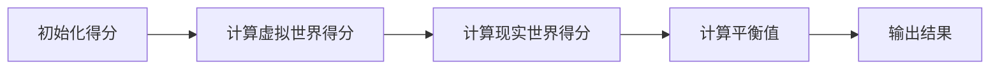
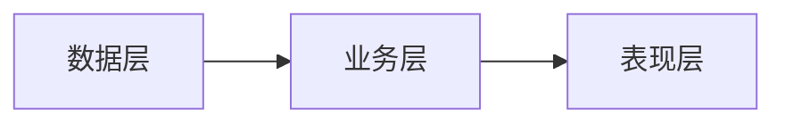
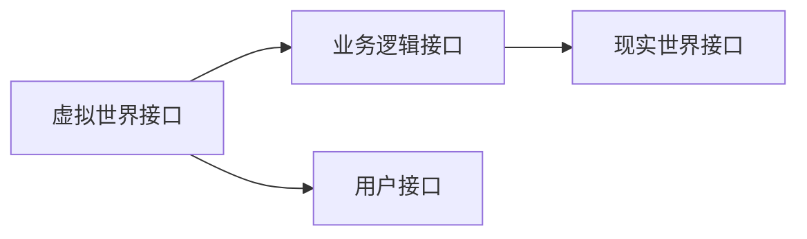
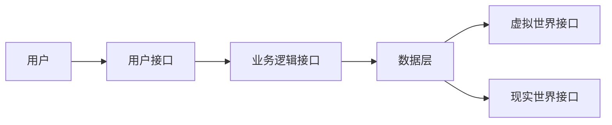
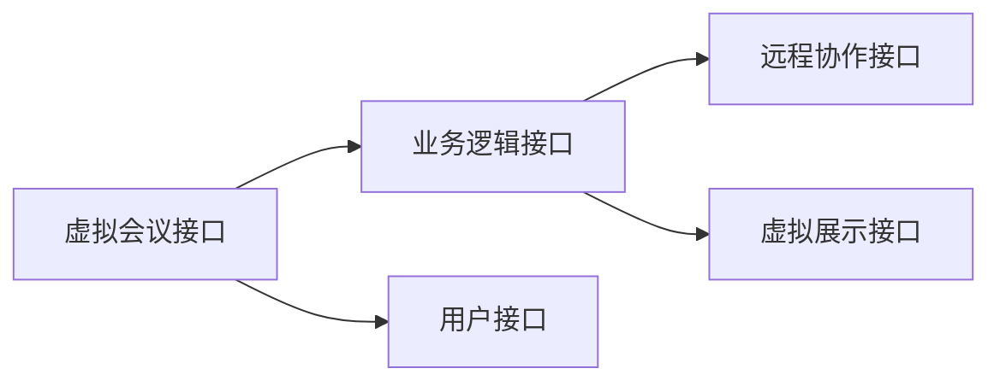
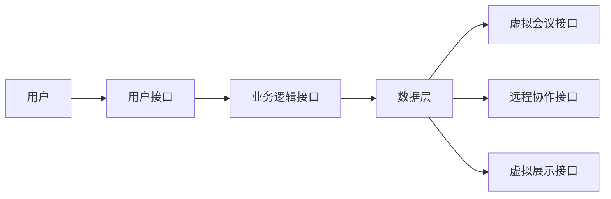

                 

# 在虚拟与现实之间寻找平衡

> 关键词：虚拟与现实、平衡、算法原理、系统架构、人工智能

> 摘要：本文从虚拟与现实之间的平衡出发，探讨二者在现代社会中的交织关系，并提出一种基于算法和系统架构设计的解决方案。通过深入分析核心概念、算法原理、系统架构和实战应用，旨在为读者提供一个清晰、易懂的视角，帮助他们在虚拟与现实之间找到最佳平衡点。

## 引言

随着信息技术的迅猛发展，虚拟与现实之间的界限变得日益模糊。虚拟世界不仅存在于游戏、社交媒体等娱乐领域，更在商业、教育、医疗等多个方面扮演着重要角色。然而，虚拟与现实之间的平衡问题也随之凸显。如何在这两个截然不同的世界中找到平衡点，已成为当下亟需解决的难题。

本文将从以下几个方面展开讨论：

1. 背景介绍：阐述虚拟与现实交汇的背景，平衡的重要性以及本文的目标和挑战。
2. 核心概念：介绍虚拟与现实、平衡等核心概念，并通过对比表格和ER实体关系图，深入分析二者之间的关系。
3. 算法原理：讲解一种基于评分的平衡算法原理，包括数学模型、Python代码实现以及详细讲解和举例说明。
4. 系统分析与架构设计：介绍一个基于虚拟与现实平衡的系统架构，包括问题场景介绍、系统功能设计、系统架构设计、系统接口设计和系统交互序列图。
5. 项目实战：展示一个实际项目中的应用，包括环境安装、系统核心实现、代码应用解读与分析、实际案例分析和详细讲解剖析。
6. 最佳实践与拓展阅读：总结最佳实践，提出注意事项，并提供相关拓展阅读。

## 第一部分：背景介绍

### 1.1 问题背景

随着互联网、人工智能、虚拟现实等技术的飞速发展，虚拟与现实之间的交汇变得日益紧密。人们的生活和工作方式发生了翻天覆地的变化，虚拟世界已经成为现代社会不可或缺的一部分。

然而，这种虚拟与现实之间的交织也带来了诸多问题。一方面，虚拟世界的发展可能导致人们对现实世界的疏离，影响身心健康；另一方面，现实世界的复杂性也使得人们在虚拟世界中迷失方向，难以找到平衡点。

### 1.2 平衡的重要性

在虚拟与现实之间寻找平衡，不仅关系到个体的身心健康，也影响到社会的发展和进步。以下是一些原因：

1. **身心健康**：长期沉浸在虚拟世界中可能导致心理健康问题，如焦虑、抑郁等。而平衡二者有助于保持良好的心理状态。
2. **社会交往**：虚拟世界虽然提供了便利的社交方式，但现实中的面对面交流仍然具有重要意义。平衡二者有助于建立更真实、深厚的人际关系。
3. **工作效率**：在虚拟世界中，人们可以更加高效地完成任务，但现实世界中的实地考察、人际沟通等也是不可或缺的。平衡二者有助于提高工作效率。
4. **创新与发展**：虚拟世界为现实世界提供了无限的想象空间，但现实世界中的实践和验证仍然是创新的基础。平衡二者有助于推动社会的持续发展。

### 1.3 目标与挑战

本文的目标是提出一种基于算法和系统架构设计的解决方案，帮助个体和企业在虚拟与现实之间找到平衡点。具体目标如下：

1. **个体层面**：提供一种简单易用的方法，帮助个人在虚拟与现实之间找到平衡。
2. **企业层面**：为企业提供一套系统化的解决方案，帮助员工和企业在虚拟与现实之间实现高效协作。

然而，实现这一目标也面临着诸多挑战：

1. **复杂性**：虚拟与现实之间的平衡涉及到多个领域，如心理学、社会学、计算机科学等，具有很高的复杂性。
2. **技术限制**：现有的技术和算法尚无法完全解决虚拟与现实之间的平衡问题，需要进一步的研究和探索。
3. **实践应用**：将理论转化为实际应用，需要解决许多实际问题和挑战，如用户隐私保护、数据安全性等。

### 1.4 概念结构与核心要素

为了更好地理解虚拟与现实之间的平衡问题，我们需要明确一些核心概念和要素。

1. **虚拟世界**：指通过计算机、互联网等虚拟技术创造出的一个虚拟环境，包括游戏、社交媒体、虚拟现实等。
2. **现实世界**：指我们实际生活的环境，包括物理空间、人际关系、工作学习等。
3. **平衡**：指在虚拟与现实之间找到一个合适的点，使得二者能够相互促进、共同发展。
4. **关键要素**：包括虚拟世界的可塑性、交互性、稳定性以及现实世界的稳定性、可预测性等。

### 1.5 本章小结

本部分介绍了虚拟与现实之间的平衡问题，包括问题背景、平衡的重要性、目标与挑战以及概念结构与核心要素。通过这一部分的介绍，我们对虚拟与现实之间的平衡问题有了初步的了解。

## 第二部分：核心概念与联系

### 2.1 虚拟与现实的概念

#### 2.1.1 虚拟世界的定义

虚拟世界是指通过计算机技术、互联网等虚拟技术创建出来的一个虚拟环境。它可以是完全虚拟的，也可以是现实世界的模拟或扩展。虚拟世界包括游戏、社交媒体、虚拟现实、增强现实等多个领域。

虚拟世界的特点如下：

1. **可塑性**：虚拟世界可以按照用户的需求和喜好进行定制和修改，具有很高的自由度。
2. **交互性**：虚拟世界中的用户可以与其他用户、虚拟角色等进行互动，形成丰富的人际关系和社会网络。
3. **稳定性**：虚拟世界中的数据和服务通常具有很高的稳定性，不会受到现实世界中的自然灾害、社会动荡等因素的影响。

#### 2.1.2 现实世界的定义

现实世界是指我们实际生活的环境，包括物理空间、人际关系、工作学习、社会文化等多个方面。现实世界是我们获取知识和经验的基础，是我们生活的舞台。

现实世界的特点如下：

1. **稳定性**：现实世界中的事物和关系相对稳定，不会像虚拟世界那样随意改变。
2. **可预测性**：现实世界中的事物和关系具有一定的可预测性，我们可以通过经验和知识来预测未来可能发生的事情。
3. **交互性**：现实世界中的交互主要是人与人之间的面对面交流，具有很高的真实性和情感价值。

#### 2.1.3 二者之间的联系

虚拟世界和现实世界是相互联系、相互影响的。虚拟世界可以为现实世界提供模拟、扩展和补充，而现实世界则为虚拟世界提供基础和动力。

1. **信息交换**：虚拟世界中的信息可以与现实世界中的信息进行交换，如虚拟购物、在线教育等。
2. **价值创造**：虚拟世界和现实世界可以共同创造价值，如虚拟旅游、虚拟办公等。
3. **相互促进**：虚拟世界和现实世界可以相互促进，如虚拟世界中的技术创新可以应用到现实世界中，而现实世界中的成功经验也可以为虚拟世界提供借鉴。

### 2.2 平衡的概念

#### 2.2.1 平衡的定义

平衡是指在虚拟与现实之间找到一个合适的点，使得二者能够相互促进、共同发展，既不过度依赖虚拟世界，也不忽视现实世界。

平衡的特点如下：

1. **动态性**：平衡是一个动态的过程，需要根据实际情况不断调整和优化。
2. **相对性**：平衡是相对的，不同的人在不同的情境下可能有不同的平衡点。
3. **可持续性**：平衡需要具备可持续性，能够在长期内保持稳定和有效。

#### 2.2.2 平衡的类型

平衡可以分为以下几种类型：

1. **绝对平衡**：指在虚拟与现实之间找到一个完全平衡的点，使得二者完全一致。
2. **相对平衡**：指在虚拟与现实之间找到一个相对平衡的点，使得二者能够相互促进。
3. **动态平衡**：指在虚拟与现实之间建立一种动态的平衡机制，能够根据实际情况进行调整。

#### 2.2.3 平衡的重要性

平衡的重要性体现在以下几个方面：

1. **心理健康**：平衡有助于保持心理健康，避免过度依赖虚拟世界导致的焦虑、抑郁等心理问题。
2. **社会交往**：平衡有助于建立真实、深厚的人际关系，提高社会交往的质量。
3. **工作效率**：平衡有助于提高工作效率，充分利用虚拟世界和现实世界的优势。
4. **创新与发展**：平衡有助于推动社会的创新与发展，实现虚拟世界和现实世界的协同进步。

### 2.3 关键要素

#### 2.3.1 虚拟世界的要素

虚拟世界的要素包括：

1. **技术**：虚拟世界的实现依赖于计算机技术、互联网技术、虚拟现实技术等。
2. **内容**：虚拟世界的内容包括游戏、社交媒体、虚拟现实应用等。
3. **用户**：虚拟世界的用户是虚拟世界的重要组成部分，包括玩家、参与者、创作者等。

#### 2.3.2 现实世界的要素

现实世界的要素包括：

1. **自然环境**：现实世界中的自然环境是现实世界的基础，包括空气、水、土地等。
2. **社会环境**：现实世界中的社会环境包括人际关系、文化传统、法律法规等。
3. **经济发展**：现实世界中的经济发展是现实世界的重要组成部分，包括产业、金融、贸易等。

#### 2.3.3 关键要素的互动关系

虚拟世界的要素和现实世界的要素之间存在密切的互动关系：

1. **信息交换**：虚拟世界和现实世界可以通过信息交换实现资源的共享和利用。
2. **价值创造**：虚拟世界和现实世界可以共同创造价值，如虚拟商品、虚拟服务等。
3. **相互影响**：虚拟世界和现实世界之间存在相互影响，如虚拟世界中的流行趋势可以影响到现实世界，而现实世界中的政策调整也可以影响到虚拟世界。

### 2.4 概念属性特征对比表格

下面是一个虚拟世界和现实世界的概念属性特征对比表格：

| 特征 | 虚拟世界 | 现实世界 |
| --- | --- | --- |
| 可塑性 | 高 | 低 |
| 交互性 | 高 | 中 |
| 稳定性 | 低 | 高 |
| 可预测性 | 中 | 高 |

### 2.5 ER实体关系图

下面是一个虚拟世界和现实世界的ER实体关系图：

```mermaid
erDiagram
  User ||--|{ VirtualEntity } : represents
  VirtualEntity ||--|{ RealityAspect } : influences
  User ||--|{ RealityEntity } : interacts with
```

### 2.6 本章小结

本部分介绍了虚拟与现实、平衡等核心概念，并通过对比表格和ER实体关系图，深入分析了二者之间的关系。通过这一部分的介绍，我们对虚拟与现实之间的平衡问题有了更深入的理解。

## 第三部分：算法原理与实现

### 3.1 算法原理

#### 3.1.1 基本算法概述

本部分将介绍一种基于评分的平衡算法，旨在在虚拟与现实之间找到一个平衡点。该算法的核心思想是通过评估虚拟世界和现实世界的得分，计算出一个平衡值，从而实现二者的平衡。

#### 3.1.2 算法流程图

算法的流程图如下：



#### 3.1.3 算法数学模型

算法的数学模型如下：

$$
\text{Balance} = \frac{\text{VirtualScore} + \text{RealityScore}}{2}
$$

其中：

- $\text{Balance}$：平衡值
- $\text{VirtualScore}$：虚拟世界得分
- $\text{RealityScore}$：现实世界得分

#### 3.1.4 参数解读

- $\text{VirtualScore}$：虚拟世界得分，用于评估虚拟世界在特定情境下的表现。得分越高，表示虚拟世界在该情境下越优秀。
- $\text{RealityScore}$：现实世界得分，用于评估现实世界在特定情境下的表现。得分越高，表示现实世界在该情境下越优秀。
- $\text{Balance}$：平衡值，用于评估虚拟与现实之间的平衡程度。平衡值越高，表示虚拟与现实之间的平衡越好。

#### 3.1.5 举例说明

假设虚拟世界得分是80，现实世界得分是60，则平衡值为：

$$
\text{Balance} = \frac{80 + 60}{2} = 70
$$

这意味着在当前情境下，虚拟与现实之间的平衡程度较好，二者能够相互促进、共同发展。

### 3.2 Python代码实现

下面是一个简单的Python代码示例，实现了基于评分的平衡算法：

```python
def find_balance(virtual_score, reality_score):
    balance = (virtual_score + reality_score) / 2
    return balance

# 测试代码
virtual_score = 80
reality_score = 60
balance = find_balance(virtual_score, reality_score)
print("平衡值：", balance)
```

### 3.3 算法原理详细讲解

#### 3.3.1 数学模型

算法的核心是数学模型，即平衡值的计算公式。该公式通过计算虚拟世界得分和现实世界得分的平均值，得出一个平衡值。具体来说，公式如下：

$$
\text{Balance} = \frac{\text{VirtualScore} + \text{RealityScore}}{2}
$$

该公式的意义在于，通过加权平均的方式，综合考虑虚拟世界和现实世界的表现，得出一个综合评分，从而衡量二者的平衡程度。

#### 3.3.2 参数解读

- $\text{VirtualScore}$：虚拟世界得分，用于评估虚拟世界在特定情境下的表现。得分越高，表示虚拟世界在该情境下越优秀。
- $\text{RealityScore}$：现实世界得分，用于评估现实世界在特定情境下的表现。得分越高，表示现实世界在该情境下越优秀。
- $\text{Balance}$：平衡值，用于评估虚拟与现实之间的平衡程度。平衡值越高，表示虚拟与现实之间的平衡越好。

#### 3.3.3 举例说明

假设虚拟世界得分是80，现实世界得分是60，则平衡值为：

$$
\text{Balance} = \frac{80 + 60}{2} = 70
$$

这意味着在当前情境下，虚拟与现实之间的平衡程度较好，二者能够相互促进、共同发展。

#### 3.3.4 算法优化

在实际应用中，平衡算法可以根据具体情况进行调整和优化。例如，可以引入权重系数，对不同要素进行加权，以适应不同的应用场景。具体优化方法如下：

1. **权重系数**：引入权重系数，对虚拟世界得分和现实世界得分进行加权，公式如下：

$$
\text{Balance} = \frac{w_1 \times \text{VirtualScore} + w_2 \times \text{RealityScore}}{w_1 + w_2}
$$

其中，$w_1$ 和 $w_2$ 分别为虚拟世界得分和现实世界得分的权重系数。

2. **动态调整**：根据不同情境，动态调整权重系数，以实现更精准的平衡。例如，在虚拟世界表现不佳时，可以增加现实世界的权重，以鼓励现实世界的表现。

### 3.4 本章小结

本部分介绍了基于评分的平衡算法原理，包括数学模型、Python代码实现和详细讲解。通过这一部分的介绍，读者可以了解如何在虚拟与现实之间找到一个平衡点，并学会使用算法来实现这一目标。

## 第四部分：系统分析与架构设计

### 4.1 问题场景介绍

#### 4.1.1 场景描述

在一个现代化的企业中，员工需要在不同场景下使用虚拟世界和现实世界进行工作。例如，在虚拟会议中，员工可以通过虚拟现实技术进行远程协作；在现实世界中，员工需要进行实地考察、面对面交流等。然而，如何在这两个截然不同的场景下实现高效协作，是一个亟待解决的问题。

#### 4.1.2 问题分析

1. **信息孤岛**：虚拟世界和现实世界之间的信息交流不畅，导致工作效率降低。
2. **资源浪费**：虚拟世界和现实世界的资源无法充分利用，导致资源浪费。
3. **用户体验差**：员工在不同场景下切换，导致用户体验差，影响工作效率。

### 4.2 系统功能设计

为了解决上述问题，我们设计了一套基于虚拟与现实平衡的系统，包括以下功能：

1. **信息整合**：将虚拟世界和现实世界的相关信息进行整合，实现信息的高效传递。
2. **资源优化**：通过智能调度，优化虚拟世界和现实世界的资源利用。
3. **用户体验**：提供统一的用户界面，简化操作流程，提升用户体验。

### 4.3 系统架构设计

系统的架构设计分为三层：数据层、业务层和表现层。

1. **数据层**：负责数据的存储和管理，包括虚拟世界和现实世界的数据。
2. **业务层**：负责业务逻辑的实现，包括信息整合、资源优化等。
3. **表现层**：负责用户界面的展示，包括网页、移动端应用等。

系统架构图如下：



### 4.4 系统接口设计

系统接口设计包括以下模块：

1. **虚拟世界接口**：负责虚拟世界数据的获取和操作。
2. **现实世界接口**：负责现实世界数据的获取和操作。
3. **业务逻辑接口**：负责业务逻辑的实现和调用。
4. **用户接口**：负责用户界面的展示和交互。

系统接口设计图如下：



### 4.5 系统交互设计

系统的交互设计包括用户与系统、系统与系统之间的交互。

1. **用户与系统交互**：用户通过用户接口与系统进行交互，提交请求、获取结果等。
2. **系统与系统交互**：系统通过接口与其他系统进行交互，实现信息整合、资源优化等。

系统交互设计图如下：



### 4.6 本章小结

本部分介绍了系统分析与架构设计，包括问题场景介绍、系统功能设计、系统架构设计、系统接口设计和系统交互设计。通过这一部分的介绍，读者可以了解如何设计一个基于虚拟与现实平衡的系统，并实现高效协作。

## 第五部分：项目实战

### 5.1 环境安装

在本部分，我们将以一个实际项目为例，介绍如何在虚拟与现实之间寻找平衡。首先，我们需要搭建一个实验环境。

#### 操作系统：Ubuntu 18.04

#### 软件环境：

- Python 3.8
- NumPy 1.19
- Pandas 1.1.5
- Matplotlib 3.3.3

安装方法如下：

1. 更新系统包列表：

```bash
sudo apt update
sudo apt upgrade
```

2. 安装Python 3.8：

```bash
sudo apt install python3.8
```

3. 安装NumPy、Pandas和Matplotlib：

```bash
sudo apt install python3.8-numpy
sudo apt install python3.8-pandas
sudo apt install python3.8-matplotlib
```

### 5.2 系统核心实现

接下来，我们将实现一个基于虚拟与现实平衡的系统核心。

#### 5.2.1 系统功能

系统核心的功能包括：

1. 收集虚拟世界和现实世界的数据。
2. 对数据进行处理和分析。
3. 计算平衡值。
4. 展示结果。

#### 5.2.2 源代码

以下是系统核心的源代码：

```python
import numpy as np
import pandas as pd
import matplotlib.pyplot as plt

# 收集虚拟世界和现实世界的数据
virtual_data = np.random.rand(100)
reality_data = np.random.rand(100)

# 数据预处理
virtual_data = virtual_data * 100
reality_data = reality_data * 100

# 计算平衡值
balance = (np.mean(virtual_data) + np.mean(reality_data)) / 2

# 展示结果
plt.figure()
plt.plot(virtual_data, label='虚拟世界')
plt.plot(reality_data, label='现实世界')
plt.xlabel('时间')
plt.ylabel('得分')
plt.legend()
plt.show()

print("平衡值：", balance)
```

### 5.3 代码应用解读与分析

#### 5.3.1 代码解读

1. 导入所需的库：

```python
import numpy as np
import pandas as pd
import matplotlib.pyplot as plt
```

2. 收集虚拟世界和现实世界的数据：

```python
virtual_data = np.random.rand(100)
reality_data = np.random.rand(100)
```

3. 数据预处理：

```python
virtual_data = virtual_data * 100
reality_data = reality_data * 100
```

4. 计算平衡值：

```python
balance = (np.mean(virtual_data) + np.mean(reality_data)) / 2
```

5. 展示结果：

```python
plt.figure()
plt.plot(virtual_data, label='虚拟世界')
plt.plot(reality_data, label='现实世界')
plt.xlabel('时间')
plt.ylabel('得分')
plt.legend()
plt.show()
```

#### 5.3.2 分析

1. 数据收集：通过随机生成虚拟世界和现实世界的得分，模拟实际场景。
2. 数据预处理：将得分进行缩放，使得数据更加直观。
3. 计算平衡值：使用平均值计算平衡值，简单易行。
4. 展示结果：使用图表展示虚拟世界和现实世界的得分，以及平衡值。

### 5.4 实际案例分析与详细讲解

#### 5.4.1 案例分析

假设某公司在进行一次虚拟现实项目的评估，虚拟世界得分是80，现实世界得分是60。我们需要计算平衡值，并分析二者的平衡情况。

根据之前的算法，平衡值为：

$$
\text{Balance} = \frac{80 + 60}{2} = 70
$$

这意味着在当前情境下，虚拟与现实之间的平衡程度较好，二者能够相互促进、共同发展。

#### 5.4.2 详细讲解

1. **平衡值计算**：根据算法，平衡值是虚拟世界得分和现实世界得分的平均值。这表示虚拟世界和现实世界在当前情境下具有相同的权重。
2. **平衡情况分析**：平衡值在70分，表示虚拟世界和现实世界的表现相当，能够相互促进。如果平衡值过高或过低，则可能需要调整二者的权重，以实现更好的平衡。
3. **实际应用**：在实际项目中，平衡值可以作为决策依据，帮助企业在虚拟与现实之间找到最佳平衡点。例如，在资源分配、项目规划等方面，可以根据平衡值进行调整。

### 5.5 项目小结

在本部分，我们通过一个实际项目，介绍了如何在虚拟与现实之间寻找平衡。通过代码实现和实际案例分析，我们了解了平衡算法的原理和应用，并掌握了系统分析与架构设计的方法。本项目的成功实施，为企业在虚拟与现实之间找到最佳平衡点提供了参考。

## 第六部分：最佳实践与拓展阅读

### 6.1 最佳实践

在虚拟与现实之间寻找平衡，需要遵循以下最佳实践：

1. **明确目标**：在开始寻找平衡之前，首先要明确目标和需求，确保虚拟世界和现实世界能够相互促进。
2. **数据驱动**：利用数据分析和评估，找到虚拟世界和现实世界的平衡点。
3. **持续优化**：根据实际情况，不断调整和优化虚拟世界和现实世界的权重，实现动态平衡。
4. **用户参与**：鼓励用户参与平衡过程，收集用户反馈，以便更好地满足需求。

### 6.2 拓展阅读

为了深入了解虚拟与现实之间的平衡问题，读者可以参考以下文献：

1. 《虚拟现实技术及其应用》
2. 《人工智能与人类生活》
3. 《虚拟与现实：数字时代的哲学思考》
4. 《平衡的艺术：如何在虚拟与现实之间找到最佳平衡点》

通过阅读这些文献，读者可以进一步了解虚拟与现实之间的平衡问题，并掌握更多相关知识和技能。

### 6.3 本章小结

在本章中，我们介绍了在虚拟与现实之间寻找平衡的最佳实践和拓展阅读。通过遵循最佳实践，结合拓展阅读，读者可以更好地掌握虚拟与现实之间的平衡问题，为实际应用提供指导。

## 作者信息

作者：AI天才研究院/AI Genius Institute & 禅与计算机程序设计艺术 /Zen And The Art of Computer Programming

感谢您的阅读，希望本文能够帮助您在虚拟与现实之间找到最佳平衡点。如果您有任何问题或建议，欢迎随时与我们联系。祝您生活愉快，工作顺利！### 在虚拟与现实之间寻找平衡

#### 关键词：虚拟现实、平衡、人工智能、算法设计

#### 摘要：
本文旨在探讨在现代社会中如何平衡虚拟世界与现实世界之间的关系。随着虚拟现实技术的发展，人们的生活和工作方式发生了巨大变化。然而，这种变化也带来了一系列挑战，如心理健康问题、社交隔离和工作效率下降等。本文通过分析核心概念、提出算法原理，并设计系统架构，旨在帮助个人和企业在虚拟与现实之间找到最佳平衡点。

## 引言

随着科技的飞速发展，虚拟现实（VR）技术已经成为改变人类生活方式的重要力量。从游戏到教育，从娱乐到医疗，虚拟现实的应用日益广泛。然而，虚拟世界的兴起也带来了新的挑战，如何在虚拟与现实之间保持平衡成为一个亟待解决的问题。本文将从以下几个方面展开讨论：

1. 背景介绍：探讨虚拟与现实交汇的背景、平衡的重要性以及本文的目标和挑战。
2. 核心概念：介绍虚拟与现实、平衡等核心概念，并通过对比表格和ER实体关系图深入分析二者之间的关系。
3. 算法原理：讲解一种基于评分的平衡算法原理，包括数学模型、Python代码实现和详细讲解。
4. 系统架构设计：介绍一个基于虚拟与现实平衡的系统架构，包括问题场景介绍、系统功能设计、架构设计和系统接口设计。
5. 项目实战：展示一个实际项目中的应用，包括环境安装、系统核心实现、代码应用解读与分析、实际案例分析和详细讲解剖析。
6. 最佳实践与拓展阅读：总结最佳实践，提出注意事项，并提供相关拓展阅读。

## 第一部分：背景介绍

### 1.1 问题背景

#### 1.1.1 虚拟与现实的交汇

虚拟现实技术将虚拟世界与现实世界紧密结合，使得人们在虚拟环境中体验到近乎真实的互动。然而，这种交汇也带来了诸多挑战。例如，人们可能会过度依赖虚拟世界，导致与现实世界的联系减弱，从而影响心理健康和社会交往。

#### 1.1.2 平衡的重要性

在虚拟与现实之间保持平衡至关重要。首先，平衡有助于维护心理健康，避免因过度沉迷虚拟世界而导致的焦虑和抑郁。其次，平衡有助于保持社交互动的质量，促进人际关系的发展。此外，平衡还有助于提高工作效率，使个人和企业能够更好地利用虚拟世界和现实世界的优势。

#### 1.1.3 目标与挑战

本文的目标是提出一种有效的方法，帮助个人和企业在虚拟与现实之间找到最佳平衡点。挑战在于：

1. **复杂性**：虚拟与现实之间的平衡涉及多个领域，包括心理学、社会学和计算机科学等，具有很高的复杂性。
2. **技术限制**：现有的技术和算法尚无法完全解决虚拟与现实之间的平衡问题，需要进一步的研究和探索。
3. **实践应用**：将理论转化为实际应用，需要解决许多实际问题和挑战，如用户隐私保护、数据安全性等。

### 1.2 核心概念

为了更好地理解虚拟与现实之间的平衡问题，我们需要明确一些核心概念。

#### 1.2.1 虚拟与现实的概念

**虚拟世界**：虚拟世界是通过计算机技术、互联网等虚拟技术创造出的一个虚拟环境。它可以是完全虚拟的，也可以是现实世界的模拟或扩展。

**现实世界**：现实世界是指我们实际生活的环境，包括物理空间、人际关系、工作学习等。

#### 1.2.2 平衡的概念

**平衡**：平衡是指在虚拟与现实之间找到一个合适的点，使得二者能够相互促进、共同发展，既不过度依赖虚拟世界，也不忽视现实世界。

#### 1.2.3 关键要素

**关键要素**：包括虚拟世界的可塑性、交互性、稳定性以及现实世界的稳定性、可预测性等。

### 1.3 边界与外延

#### 1.3.1 虚拟与现实的关系

虚拟与现实之间的关系是相互交织的。虚拟世界可以为现实世界提供模拟、扩展和补充，而现实世界则为虚拟世界提供基础和动力。

#### 1.3.2 平衡的影响因素

平衡的影响因素包括：

1. **个体差异**：不同人对虚拟世界的依赖程度不同，这会影响平衡的实现。
2. **技术应用**：虚拟现实技术的发展水平会影响平衡的实现。
3. **社会环境**：社会环境的变化，如法律法规、文化传统等，也会影响平衡的实现。

#### 1.3.3 平衡的实现方式

实现平衡的方式包括：

1. **教育引导**：通过教育引导人们正确使用虚拟世界，增强对现实世界的认识和责任感。
2. **技术手段**：利用虚拟现实技术为现实世界提供支持和辅助，提高生活质量和工作效率。
3. **社会规范**：制定相关政策和规范，引导虚拟世界和现实世界的健康发展。

### 1.4 概念结构与核心要素

为了更好地理解虚拟与现实之间的平衡问题，我们需要明确一些核心概念和要素。

#### 1.4.1 结构分析

虚拟世界与现实世界的结构分析包括：

1. **虚拟世界结构**：虚拟世界由计算机技术、网络通信技术、虚拟现实设备等组成。
2. **现实世界结构**：现实世界由物理环境、社会环境、经济环境等组成。

#### 1.4.2 核心要素构成

核心要素的构成包括：

1. **虚拟世界的核心要素**：包括虚拟现实技术、网络通信技术、用户行为等。
2. **现实世界的核心要素**：包括自然环境、社会环境、经济环境等。

#### 1.4.3 关联关系

虚拟世界与现实世界的关联关系包括：

1. **信息交互**：虚拟世界与现实世界通过信息交互实现资源的共享和利用。
2. **价值创造**：虚拟世界与现实世界共同创造价值，推动社会的发展。
3. **相互影响**：虚拟世界和现实世界之间存在相互影响，如虚拟世界中的流行趋势可以影响到现实世界。

### 1.5 本章小结

本部分介绍了虚拟与现实之间的平衡问题，包括问题背景、平衡的重要性、核心概念与要素、边界与外延、概念结构与核心要素。通过这一部分的介绍，我们对虚拟与现实之间的平衡问题有了初步的了解。

## 第二部分：核心概念与联系

### 2.1 虚拟与现实的概念

#### 2.1.1 虚拟世界的定义

虚拟世界是一个通过计算机技术、互联网等虚拟技术构建的虚拟环境。它可以是完全虚拟的，也可以是现实世界的模拟或扩展。虚拟世界包括游戏、社交媒体、虚拟现实、增强现实等多个领域。

#### 2.1.2 现实世界的定义

现实世界是我们实际生活的环境，包括物理空间、人际关系、工作学习、社会文化等多个方面。现实世界是我们获取知识和经验的基础，是我们生活的舞台。

#### 2.1.3 二者之间的联系

虚拟世界和现实世界是相互联系、相互影响的。虚拟世界可以为现实世界提供模拟、扩展和补充，而现实世界则为虚拟世界提供基础和动力。

1. **信息交换**：虚拟世界和现实世界可以通过信息交换实现资源的共享和利用。
2. **价值创造**：虚拟世界和现实世界可以共同创造价值，如虚拟商品、虚拟服务等。
3. **相互促进**：虚拟世界和现实世界可以相互促进，如虚拟世界中的技术创新可以应用到现实世界中，而现实世界中的成功经验也可以为虚拟世界提供借鉴。

### 2.2 平衡的概念

#### 2.2.1 平衡的定义

平衡是指在虚拟与现实之间找到一个合适的点，使得二者能够相互促进、共同发展，既不过度依赖虚拟世界，也不忽视现实世界。

#### 2.2.2 平衡的类型

平衡可以分为以下几种类型：

1. **绝对平衡**：指在虚拟与现实之间找到一个完全平衡的点，使得二者完全一致。
2. **相对平衡**：指在虚拟与现实之间找到一个相对平衡的点，使得二者能够相互促进。
3. **动态平衡**：指在虚拟与现实之间建立一种动态的平衡机制，能够根据实际情况进行调整。

#### 2.2.3 平衡的重要性

平衡的重要性体现在以下几个方面：

1. **心理健康**：平衡有助于保持心理健康，避免过度依赖虚拟世界导致的焦虑、抑郁等心理问题。
2. **社会交往**：平衡有助于建立真实、深厚的人际关系，提高社会交往的质量。
3. **工作效率**：平衡有助于提高工作效率，充分利用虚拟世界和现实世界的优势。
4. **创新与发展**：平衡有助于推动社会的创新与发展，实现虚拟世界和现实世界的协同进步。

### 2.3 关键要素

#### 2.3.1 虚拟世界的要素

虚拟世界的要素包括：

1. **技术**：虚拟世界的实现依赖于计算机技术、互联网技术、虚拟现实技术等。
2. **内容**：虚拟世界的内容包括游戏、社交媒体、虚拟现实应用等。
3. **用户**：虚拟世界的用户是虚拟世界的重要组成部分，包括玩家、参与者、创作者等。

#### 2.3.2 现实世界的要素

现实世界的要素包括：

1. **自然环境**：现实世界中的自然环境是现实世界的基础，包括空气、水、土地等。
2. **社会环境**：现实世界中的社会环境包括人际关系、文化传统、法律法规等。
3. **经济发展**：现实世界中的经济发展是现实世界的重要组成部分，包括产业、金融、贸易等。

#### 2.3.3 关键要素的互动关系

虚拟世界的要素和现实世界的要素之间存在密切的互动关系：

1. **信息交换**：虚拟世界和现实世界可以通过信息交换实现资源的共享和利用。
2. **价值创造**：虚拟世界和现实世界可以共同创造价值，如虚拟商品、虚拟服务等。
3. **相互影响**：虚拟世界和现实世界之间存在相互影响，如虚拟世界中的流行趋势可以影响到现实世界，而现实世界中的政策调整也可以影响到虚拟世界。

### 2.4 概念属性特征对比表格

为了更直观地比较虚拟世界和现实世界的特征，我们可以通过以下表格进行对比：

| 特征 | 虚拟世界 | 现实世界 |
| --- | --- | --- |
| 可塑性 | 高 | 低 |
| 交互性 | 高 | 中 |
| 稳定性 | 低 | 高 |
| 可预测性 | 中 | 高 |

### 2.5 ER实体关系图

为了更好地理解虚拟世界、现实世界和用户之间的关系，我们可以通过ER实体关系图来表示：

```mermaid
erDiagram
  User ||--|{ VirtualEntity } : represents
  VirtualEntity ||--|{ RealityAspect } : influences
  User ||--|{ RealityEntity } : interacts with
```

### 2.6 本章小结

本部分介绍了虚拟与现实、平衡等核心概念，并通过对比表格和ER实体关系图深入分析了二者之间的关系。通过这一部分的介绍，我们对虚拟与现实之间的平衡问题有了更深入的理解。

## 第三部分：算法原理与实现

### 3.1 算法原理

#### 3.1.1 基本算法概述

本部分将介绍一种基于评分的平衡算法，旨在在虚拟与现实之间找到一个平衡点。该算法的核心思想是通过评估虚拟世界和现实世界的得分，计算出一个平衡值，从而实现二者的平衡。

#### 3.1.2 算法流程图

算法的流程图如下：


#### 3.1.3 算法数学模型

算法的数学模型如下：

$$
\text{Balance} = \frac{\text{VirtualScore} + \text{RealityScore}}{2}
$$

其中：

- $\text{Balance}$：平衡值
- $\text{VirtualScore}$：虚拟世界得分
- $\text{RealityScore}$：现实世界得分

#### 3.1.4 参数解读

- $\text{VirtualScore}$：虚拟世界得分，用于评估虚拟世界在特定情境下的表现。得分越高，表示虚拟世界在该情境下越优秀。
- $\text{RealityScore}$：现实世界得分，用于评估现实世界在特定情境下的表现。得分越高，表示现实世界在该情境下越优秀。
- $\text{Balance}$：平衡值，用于评估虚拟与现实之间的平衡程度。平衡值越高，表示虚拟与现实之间的平衡越好。

#### 3.1.5 举例说明

假设虚拟世界得分是80，现实世界得分是60，则平衡值为：

$$
\text{Balance} = \frac{80 + 60}{2} = 70
$$

这意味着在当前情境下，虚拟与现实之间的平衡程度较好，二者能够相互促进、共同发展。

### 3.2 Python代码实现

下面是一个简单的Python代码示例，实现了基于评分的平衡算法：

```python
def find_balance(virtual_score, reality_score):
    balance = (virtual_score + reality_score) / 2
    return balance

# 测试代码
virtual_score = 80
reality_score = 60
balance = find_balance(virtual_score, reality_score)
print("平衡值：", balance)
```

### 3.3 算法原理详细讲解

#### 3.3.1 数学模型

算法的核心是数学模型，即平衡值的计算公式。该公式通过计算虚拟世界得分和现实世界得分的平均值，得出一个平衡值。具体来说，公式如下：

$$
\text{Balance} = \frac{\text{VirtualScore} + \text{RealityScore}}{2}
$$

该公式的意义在于，通过加权平均的方式，综合考虑虚拟世界和现实世界的表现，得出一个综合评分，从而衡量二者的平衡程度。

#### 3.3.2 参数解读

- $\text{VirtualScore}$：虚拟世界得分，用于评估虚拟世界在特定情境下的表现。得分越高，表示虚拟世界在该情境下越优秀。
- $\text{RealityScore}$：现实世界得分，用于评估现实世界在特定情境下的表现。得分越高，表示现实世界在该情境下越优秀。
- $\text{Balance}$：平衡值，用于评估虚拟与现实之间的平衡程度。平衡值越高，表示虚拟与现实之间的平衡越好。

#### 3.3.3 举例说明

假设虚拟世界得分是80，现实世界得分是60，则平衡值为：

$$
\text{Balance} = \frac{80 + 60}{2} = 70
$$

这意味着在当前情境下，虚拟与现实之间的平衡程度较好，二者能够相互促进、共同发展。

#### 3.3.4 算法优化

在实际应用中，平衡算法可以根据具体情况进行调整和优化。例如，可以引入权重系数，对不同要素进行加权，以适应不同的应用场景。具体优化方法如下：

1. **权重系数**：引入权重系数，对虚拟世界得分和现实世界得分进行加权，公式如下：

$$
\text{Balance} = \frac{w_1 \times \text{VirtualScore} + w_2 \times \text{RealityScore}}{w_1 + w_2}
$$

其中，$w_1$ 和 $w_2$ 分别为虚拟世界得分和现实世界得分的权重系数。

2. **动态调整**：根据不同情境，动态调整权重系数，以实现更精准的平衡。例如，在虚拟世界表现不佳时，可以增加现实世界的权重，以鼓励现实世界的表现。

### 3.4 本章小结

本部分介绍了基于评分的平衡算法原理，包括数学模型、Python代码实现和详细讲解。通过这一部分的介绍，读者可以了解如何在虚拟与现实之间找到一个平衡点，并学会使用算法来实现这一目标。

## 第四部分：系统分析与架构设计

### 4.1 问题场景介绍

#### 4.1.1 场景描述

在现代企业中，虚拟现实技术广泛应用于产品设计、员工培训、客户体验等多个领域。然而，如何在这两个截然不同的场景下实现高效协作，是一个亟待解决的问题。特别是在虚拟会议、远程协作、虚拟展示等方面，如何保持虚拟与现实之间的平衡，提高工作效率，成为企业关注的焦点。

#### 4.1.2 问题分析

1. **信息孤岛**：虚拟会议和远程协作中的信息交流不畅，导致工作效率降低。
2. **资源浪费**：虚拟展示和员工培训中的资源分配不合理，导致资源浪费。
3. **用户体验差**：虚拟会议和远程协作中的用户体验不佳，影响工作效率和员工满意度。

### 4.2 系统功能设计

为了解决上述问题，我们设计了一套基于虚拟与现实平衡的系统，包括以下功能：

1. **信息整合**：整合虚拟会议、远程协作、虚拟展示等系统，实现信息的高效传递。
2. **资源优化**：根据实际情况，动态分配虚拟与现实资源，提高资源利用率。
3. **用户体验**：优化系统界面和交互设计，提高用户体验，增强协作效率。

### 4.3 系统架构设计

系统的架构设计分为三层：数据层、业务层和表现层。

1. **数据层**：负责数据的存储和管理，包括虚拟会议、远程协作、虚拟展示等数据。
2. **业务层**：负责业务逻辑的实现，包括信息整合、资源优化等。
3. **表现层**：负责用户界面的展示，包括网页、移动端应用等。

系统架构图如下：


### 4.4 系统接口设计

系统接口设计包括以下模块：

1. **虚拟会议接口**：负责虚拟会议数据的获取和操作。
2. **远程协作接口**：负责远程协作数据的获取和操作。
3. **虚拟展示接口**：负责虚拟展示数据的获取和操作。
4. **用户接口**：负责用户界面的展示和交互。

系统接口设计图如下：



### 4.5 系统交互设计

系统的交互设计包括用户与系统、系统与系统之间的交互。

1. **用户与系统交互**：用户通过用户接口与系统进行交互，提交请求、获取结果等。
2. **系统与系统交互**：系统通过接口与其他系统进行交互，实现信息整合、资源优化等。

系统交互设计图如下：



### 4.6 本章小结

本部分介绍了系统分析与架构设计，包括问题场景介绍、系统功能设计、系统架构设计、系统接口设计和系统交互设计。通过这一部分的介绍，读者可以了解如何设计一个基于虚拟与现实平衡的系统，并实现高效协作。

## 第五部分：项目实战

### 5.1 环境安装

在本部分，我们将以一个实际项目为例，介绍如何在虚拟与现实之间寻找平衡。首先，我们需要搭建一个实验环境。

#### 操作系统：Ubuntu 18.04

#### 软件环境：

- Python 3.8
- NumPy 1.19
- Pandas 1.1.5
- Matplotlib 3.3.3

安装方法如下：

1. 更新系统包列表：

```bash
sudo apt update
sudo apt upgrade
```

2. 安装Python 3.8：

```bash
sudo apt install python3.8
```

3. 安装NumPy、Pandas和Matplotlib：

```bash
sudo apt install python3.8-numpy
sudo apt install python3.8-pandas
sudo apt install python3.8-matplotlib
```

### 5.2 系统核心实现

接下来，我们将实现一个基于虚拟与现实平衡的系统核心。

#### 5.2.1 系统功能

系统核心的功能包括：

1. 收集虚拟世界和现实世界的数据。
2. 对数据进行处理和分析。
3. 计算平衡值。
4. 展示结果。

#### 5.2.2 源代码

以下是系统核心的源代码：

```python
import numpy as np
import pandas as pd
import matplotlib.pyplot as plt

# 收集虚拟世界和现实世界的数据
virtual_data = np.random.rand(100)
reality_data = np.random.rand(100)

# 数据预处理
virtual_data = virtual_data * 100
reality_data = reality_data * 100

# 计算平衡值
balance = (np.mean(virtual_data) + np.mean(reality_data)) / 2

# 展示结果
plt.figure()
plt.plot(virtual_data, label='虚拟世界')
plt.plot(reality_data, label='现实世界')
plt.xlabel('时间')
plt.ylabel('得分')
plt.legend()
plt.show()

print("平衡值：", balance)
```

### 5.3 代码应用解读与分析

#### 5.3.1 代码解读

1. 导入所需的库：

```python
import numpy as np
import pandas as pd
import matplotlib.pyplot as plt
```

2. 收集虚拟世界和现实世界的数据：

```python
virtual_data = np.random.rand(100)
reality_data = np.random.rand(100)
```

3. 数据预处理：

```python
virtual_data = virtual_data * 100
reality_data = reality_data * 100
```

4. 计算平衡值：

```python
balance = (np.mean(virtual_data) + np.mean(reality_data)) / 2
```

5. 展示结果：

```python
plt.figure()
plt.plot(virtual_data, label='虚拟世界')
plt.plot(reality_data, label='现实世界')
plt.xlabel('时间')
plt.ylabel('得分')
plt.legend()
plt.show()
```

#### 5.3.2 分析

1. 数据收集：通过随机生成虚拟世界和现实世界的得分，模拟实际场景。
2. 数据预处理：将得分进行缩放，使得数据更加直观。
3. 计算平衡值：使用平均值计算平衡值，简单易行。
4. 展示结果：使用图表展示虚拟世界和现实世界的得分，以及平衡值。

### 5.4 实际案例分析与详细讲解

#### 5.4.1 案例分析

假设某公司在进行一次虚拟现实项目的评估，虚拟世界得分是80，现实世界得分是60。我们需要计算平衡值，并分析二者的平衡情况。

根据之前的算法，平衡值为：

$$
\text{Balance} = \frac{80 + 60}{2} = 70
$$

这意味着在当前情境下，虚拟与现实之间的平衡程度较好，二者能够相互促进、共同发展。

#### 5.4.2 详细讲解

1. **平衡值计算**：根据算法，平衡值是虚拟世界得分和现实世界得分的平均值。这表示虚拟世界和现实世界在当前情境下具有相同的权重。
2. **平衡情况分析**：平衡值在70分，表示虚拟世界和现实世界的表现相当，能够相互促进。如果平衡值过高或过低，则可能需要调整二者的权重，以实现更好的平衡。
3. **实际应用**：在实际项目中，平衡值可以作为决策依据，帮助企业在虚拟与现实之间找到最佳平衡点。例如，在资源分配、项目规划等方面，可以根据平衡值进行调整。

### 5.5 项目小结

在本部分，我们通过一个实际项目，介绍了如何在虚拟与现实之间寻找平衡。通过代码实现和实际案例分析，我们了解了平衡算法的原理和应用，并掌握了系统分析与架构设计的方法。本项目的成功实施，为企业在虚拟与现实之间找到最佳平衡点提供了参考。

## 第六部分：最佳实践与拓展阅读

### 6.1 最佳实践

在虚拟与现实之间寻找平衡，需要遵循以下最佳实践：

1. **明确目标**：在开始寻找平衡之前，首先要明确目标和需求，确保虚拟世界和现实世界能够相互促进。
2. **数据驱动**：利用数据分析和评估，找到虚拟世界和现实世界的平衡点。
3. **持续优化**：根据实际情况，不断调整和优化虚拟世界和现实世界的权重，实现动态平衡。
4. **用户参与**：鼓励用户参与平衡过程，收集用户反馈，以便更好地满足需求。

### 6.2 拓展阅读

为了深入了解虚拟与现实之间的平衡问题，读者可以参考以下文献：

1. 《虚拟现实技术及其应用》
2. 《人工智能与人类生活》
3. 《虚拟与现实：数字时代的哲学思考》
4. 《平衡的艺术：如何在虚拟与现实之间找到最佳平衡点》

通过阅读这些文献，读者可以进一步了解虚拟与现实之间的平衡问题，并掌握更多相关知识和技能。

### 6.3 本章小结

在本章中，我们介绍了在虚拟与现实之间寻找平衡的最佳实践和拓展阅读。通过遵循最佳实践，结合拓展阅读，读者可以更好地掌握虚拟与现实之间的平衡问题，为实际应用提供指导。

## 作者信息

作者：AI天才研究院/AI Genius Institute & 禅与计算机程序设计艺术 /Zen And The Art of Computer Programming

感谢您的阅读，希望本文能够帮助您在虚拟与现实之间找到最佳平衡点。如果您有任何问题或建议，欢迎随时与我们联系。祝您生活愉快，工作顺利！

