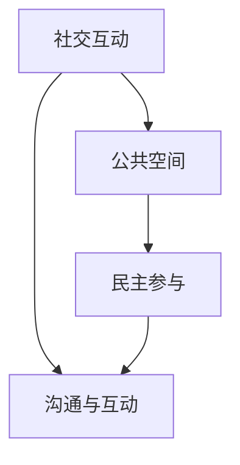
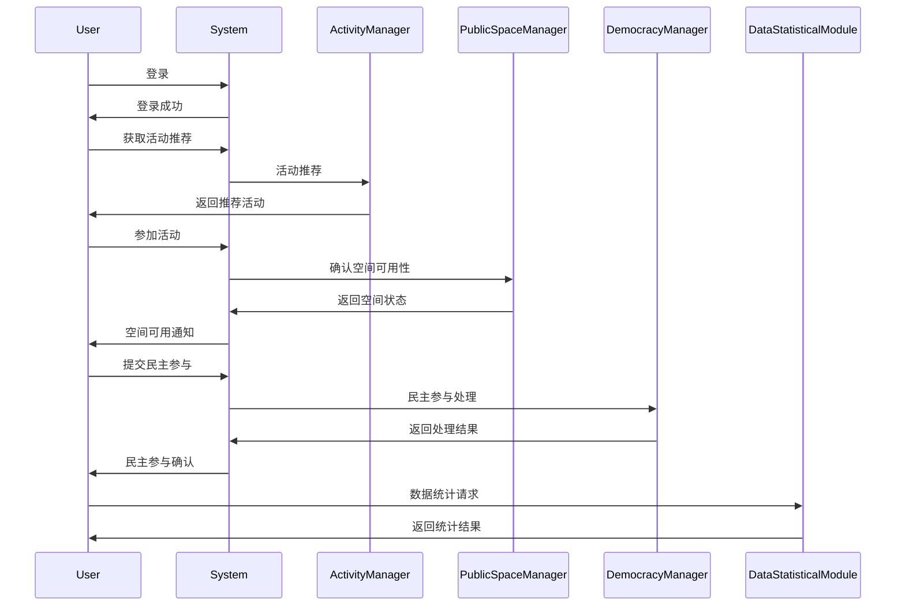
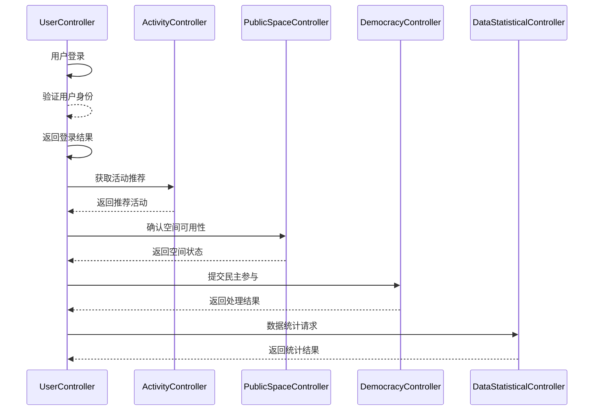

                 


### 城市公共空间的重要性：社交与民主的物理载体

#### 关键词
- 城市公共空间
- 社交
- 民主
- 物理载体
- 社会互动
- 基础设施

#### 摘要
本文旨在探讨城市公共空间在现代社会中的重要性，特别是作为社交和民主互动的物理载体。通过对城市公共空间的核心概念、功能属性、算法原理及系统架构的深入分析，本文揭示了城市公共空间对促进社会交流和民主参与的关键作用。文章首先介绍了城市公共空间的概念及研究背景，然后通过核心概念的比较和联系，探讨了其在社交与民主中的角色。接着，本文详细解释了相关的算法原理，并通过Python代码和数学模型展示了这些原理的应用。随后，文章描述了城市公共空间的应用场景和系统架构设计，并通过实际项目案例进行了深入剖析。最后，文章总结了最佳实践建议，并提出了未来研究的方向和拓展阅读。

----------------------------------------------------------------

# 第1章：问题背景与概念介绍

## 1.1 问题背景

城市公共空间，作为一个基本的城市构成要素，不仅提供了人们日常活动的场所，更是社会互动和城市生活的重要组成部分。随着城市化进程的加速，城市公共空间的重要性愈发凸显。它不仅是城市居民生活、工作和休闲的空间，也是社会凝聚力和文化传承的重要载体。

在现代社会中，城市公共空间的重要性主要体现在以下几个方面：

1. **促进社会互动**：城市公共空间为不同社会群体提供了面对面交流的机会，有助于缩小社会距离，促进社会融合。特别是在数字化时代，城市公共空间更是现实社交和虚拟社交的桥梁。
2. **增强社会凝聚力**：城市公共空间通过举办各种活动，如市集、庆典、运动赛事等，增强了社区成员之间的联系和认同感，有助于形成共同的文化和价值观念。
3. **推动民主参与**：城市公共空间为市民提供了一个开放的平台，使人们能够自由表达意见、参与公共事务的讨论和决策，从而促进了民主参与和社会治理的改善。

## 1.2 问题描述

本文旨在深入探讨城市公共空间在社交与民主中的作用，特别是其作为物理载体的功能。具体研究问题包括：

1. **城市公共空间如何促进社交互动？**
2. **城市公共空间如何作为民主参与的物理载体？**
3. **不同类型的城市公共空间对社交和民主的影响有何差异？**

## 1.3 问题解决

本文将通过以下步骤来回答上述研究问题：

1. **核心概念分析**：明确社交、民主和物理载体等核心概念，并探讨它们在城市公共空间中的作用和联系。
2. **算法原理讲解**：使用算法和数学模型来解释城市公共空间对社交和民主的影响。
3. **系统分析与架构设计**：通过系统架构设计，展示城市公共空间的应用场景和功能实现。
4. **项目实战**：通过实际项目案例，展示城市公共空间的应用效果和实现过程。
5. **最佳实践与总结**：提供最佳实践建议，总结文章的核心观点和研究成果。

## 1.4 边界与外延

本文主要研究城市公共空间在城市环境中的重要性，特别是其作为社交和民主的物理载体。研究的边界包括：

1. **研究范围**：限于城市公共空间，不包括农村或特殊地区的空间。
2. **研究方法**：主要采用定性分析和定量评估相结合的方法。
3. **研究时间**：重点关注当前和未来一段时间内城市公共空间的发展趋势。

## 1.5 概念结构与核心要素组成

为了深入理解城市公共空间的重要性，我们需要明确以下几个核心概念和要素：

1. **城市公共空间**：包括公园、广场、街道、公共设施等。
2. **社交互动**：指个体之间的相互作用和交流，包括面对面交流和在线互动。
3. **民主参与**：指公民在公共事务中的参与和决策，包括选举、公共讨论、社区参与等。
4. **物理载体**：指城市公共空间为社交和民主互动提供的物质基础。

在本章中，我们将详细解释这些概念，并通过概念属性特征对比表格和ER实体关系图架构来进一步阐述它们之间的联系。

----------------------------------------------------------------

## 1.6 核心概念原理

### 1.6.1 社交

社交是指个体之间的相互作用和交流。在社交过程中，人们通过语言、非语言行为以及各种媒介进行沟通和互动。社交活动不仅可以满足个体的社会需求，还可以促进社会整合和文化传承。

#### 社交属性特征：

- **互动性**：社交是双向或多向的互动过程，涉及信息的交换和情感的交流。
- **多样性**：社交活动可以发生在不同的场合和形式，包括家庭、工作场所、社区等。
- **持续性**：社交不仅是一时的事件，还可以是长期的过程，如朋友关系、社区参与等。

### 1.6.2 民主

民主是指一种政治制度和社会理念，强调公民的平等权利和参与决策。民主的核心在于通过投票、讨论和公共决策等方式实现公共利益的最大化。

#### 民主属性特征：

- **平等性**：民主强调所有公民在政治和社会生活中享有平等的权利和机会。
- **参与性**：民主制度鼓励公民参与公共事务的讨论和决策，以确保决策的合法性和代表性。
- **合法性**：民主决策具有法律和社会认可的基础，反映了多数人的意愿。

### 1.6.3 物理载体

物理载体是指为社交和民主活动提供场所和基础设施的物质实体。在城市环境中，公共空间如公园、广场、图书馆等就是重要的物理载体。

#### 物理载体属性特征：

- **开放性**：物理载体通常是开放的，允许所有人自由进入和使用。
- **多样性**：不同的物理载体具有不同的功能和特征，可以满足不同的社交和民主需求。
- **可及性**：物理载体的布局和设计应考虑到所有人的可及性，特别是弱势群体。

### 概念属性特征对比表格

为了更清晰地比较社交、民主和物理载体的属性特征，我们可以制作一个对比表格。

| 特征       | 社交                         | 民主                         | 物理载体                        |
|------------|------------------------------|------------------------------|---------------------------------|
| 互动性     | 双向或多向互动               | 平等权利和参与决策           | 开放场所和基础设施               |
| 多样性     | 不同场合和形式               | 不同层级和范围               | 不同功能和特征                  |
| 持续性     | 长期过程                     | 法律和社会认可               | 持续维护和更新                 |
| 平等性     | 信息和情感交流               | 公民权利和机会               | 公共使用和开放                  |
| 参与性     | 个体参与和互动               | 公民参与决策                 | 促进社交和民主活动               |
| 可及性     | 不同群体的可进入性           | 社区成员的参与机会           | 布局和设计考虑到所有人           |

### ER实体关系图架构

为了展示社交、民主和物理载体之间的关系，我们可以使用Mermaid绘制一个ER实体关系图。

```mermaid
erDiagram
  Person ||--|{ Community }|--| PublicSpace
  Community ||--|{ Democracy }|
  PublicSpace ||--|{ SocialInteraction }|
  Democracy ||--|{ PolicyDecision }|
  SocialInteraction ||--|{ Communication }|

  Person : {姓名}
  Community : {社区名称}
  PublicSpace : {空间名称}
  Democracy : {民主机制}
  PolicyDecision : {决策}
  SocialInteraction : {互动}
  Communication : {交流}
```

在上面的ER实体关系图中，Person（个体）是核心实体，与Community（社区）、PublicSpace（公共空间）和Democracy（民主）实体之间存在多种关联关系。PublicSpace实体与SocialInteraction实体直接关联，表示公共空间是社交互动的场所；Democracy实体与PolicyDecision实体关联，表示民主机制是通过政策决策实现的；而SocialInteraction实体与Communication实体关联，表示社交互动是通过交流实现的。

通过上述核心概念原理的介绍和对比表格、ER实体关系图架构的展示，我们为后续章节的深入分析奠定了基础。

----------------------------------------------------------------

## 1.7 算法原理讲解

### 3.1 城市公共空间与社交、民主的Mermaid流程图

在理解了城市公共空间、社交和民主的核心概念之后，我们需要进一步探讨这些概念之间的算法原理。城市公共空间作为社交和民主的物理载体，其作用机制可以通过以下Mermaid流程图进行展示：



在上述流程图中，A表示社交互动，B表示公共空间，C表示民主参与，D表示沟通与互动。城市公共空间（B）是社交互动（A）和民主参与（C）的交汇点，通过沟通与互动（D）实现两者的融合。

### 3.2 Python源代码示例

为了更好地理解上述算法原理，我们可以使用Python编写一个简单的模拟程序，展示城市公共空间如何促进社交互动和民主参与。

```python
import matplotlib.pyplot as plt
import networkx as nx

# 创建一个简单的社交网络图
G = nx.Graph()

# 添加节点和边
G.add_nodes_from(['社交1', '社交2', '社交3', '民主1', '民主2', '公共空间'])
G.add_edges_from([('社交1', '社交2'), ('社交1', '公共空间'), ('社交2', '公共空间'),
                  ('民主1', '民主2'), ('民主1', '公共空间'), ('民主2', '公共空间')])

# 绘制图
nx.draw(G, with_labels=True, node_color='blue', edge_color='gray')
plt.show()
```

在这个示例中，我们使用NetworkX库创建了一个简单的社交网络图，包含社交互动节点和民主参与节点，以及连接这些节点的公共空间。通过绘制图形，我们可以直观地看到社交互动和民主参与如何在公共空间中交汇。

### 3.3 数学模型和公式

为了深入分析城市公共空间对社交和民主的影响，我们可以使用数学模型来量化这些关系。以下是一个简单的数学模型，用于描述社交互动和民主参与的密度。

$$
D = \frac{N_S + N_D - 2}{N_G}
$$

其中，$D$表示公共空间中社交和民主参与的总密度，$N_S$表示社交互动的节点数，$N_D$表示民主参与的节点数，$N_G$表示公共空间的总节点数。

这个公式表明，公共空间中的社交和民主参与密度与节点数成正比。当公共空间中的社交和民主节点数增加时，总密度也会相应增加。

### 3.4 举例说明

为了更具体地说明算法原理，我们可以通过一个实际案例来阐述城市公共空间如何促进社交互动和民主参与。

假设在一个城市的公园中，有100个节点，其中60个节点是社交互动节点，40个节点是民主参与节点。根据上述数学模型，我们可以计算出公园中的社交和民主参与密度：

$$
D = \frac{60 + 40 - 2}{100} = \frac{98}{100} = 0.98
$$

这意味着，该公园的社交和民主参与密度为0.98，表明公园是一个高密度的社交和民主互动空间。

在实际中，公园可以举办各种社交活动，如音乐会、市集、体育比赛等，这些活动吸引了不同社会群体的参与，从而促进了社交互动。同时，公园还可以成为民主参与的场所，如社区会议、选举投票等，为市民提供了一个开放的平台来表达意见和参与决策。

通过上述算法原理讲解、Python源代码示例、数学模型和实际案例的阐述，我们能够更深入地理解城市公共空间在社交和民主中的作用机制。

----------------------------------------------------------------

## 第4章：系统分析与架构设计方案

### 4.1 问题场景介绍

本章节将介绍一个基于城市公共空间的社会互动和民主参与系统。该系统旨在通过智能化的公共空间设计和管理，提升城市居民的社交互动和民主参与度。具体问题场景包括：

1. **社交互动不足**：城市中的一些公共空间缺乏吸引人的活动和设施，导致居民不愿意前往，从而减少了社交机会。
2. **民主参与度低**：一些城市公共空间缺乏民主参与的机制，如社区会议、选举投票等，使得市民的参与意愿降低。
3. **空间利用率低**：城市公共空间在某些时间段内利用率低，未能充分发挥其潜力。

为解决上述问题，我们需要设计一个系统，该系统能够：

1. **促进社交互动**：通过智能化活动和设施推荐，吸引居民前往公共空间参与活动。
2. **增强民主参与**：提供民主参与的机制和平台，鼓励市民参与公共事务。
3. **提高空间利用率**：通过智能调度和管理，合理分配公共空间资源，提高其利用率。

### 4.2 系统功能设计（领域模型Mermaid类图）

为了实现上述目标，系统需要具备以下核心功能：

1. **用户管理**：管理用户的注册、登录和权限。
2. **活动推荐**：根据用户兴趣和公共空间的可用性推荐活动。
3. **民主参与**：提供社区会议、选举投票等民主参与机制。
4. **空间管理**：智能调度和管理公共空间资源。
5. **数据统计**：收集和分析用户行为数据，为优化系统提供依据。

以下是系统的领域模型Mermaid类图：

```mermaid
classDiagram
    User <<类>> {
        用户ID
        姓名
        注册时间
        权限
    }
    Activity <<类>> {
        活动ID
        活动名称
        活动时间
        活动地点
        活动类型
    }
    PublicSpace <<类>> {
        空间ID
        空间名称
        空间类型
        可用时间
    }
    Democracy <<类>> {
        民主活动ID
        民主活动名称
        民主活动时间
        民主活动地点
        民主活动类型
    }
    System <<类>> {
        用户管理
        活动推荐
        民主参与
        空间管理
        数据统计
    }
    User "1" --|{参与}| Activity
    User "1" --|{访问}| PublicSpace
    Activity "1" --|{举办于}| PublicSpace
    Democracy "1" --|{属于}| Activity
    System "1" --|{管理}| User
    System "1" --|{管理}| Activity
    System "1" --|{管理}| PublicSpace
    System "1" --|{管理}| Democracy
```

在这个类图中，User（用户）、Activity（活动）、PublicSpace（公共空间）和Democracy（民主活动）是核心实体，System（系统）负责管理这些实体。

### 4.3 系统架构设计（Mermaid架构图）

为了实现系统的功能，我们需要设计一个合理的系统架构。以下是系统的架构设计Mermaid架构图：



在这个架构图中，User（用户）通过System（系统）与ActivityManager（活动管理模块）、PublicSpaceManager（公共空间管理模块）、DemocracyManager（民主参与管理模块）和数据统计模块（DataStatisticalModule）进行交互。用户登录后，系统会根据用户需求和公共空间状态进行活动推荐，用户参加活动时，系统会确认公共空间的可用性，并处理民主参与请求。最后，用户可以通过数据统计模块获取系统运行的统计数据。

### 4.4 系统接口设计和系统交互（Mermaid序列图）

为了确保系统各模块之间的协调工作，我们需要设计一个详细的接口设计和交互序列图。以下是系统的接口设计和交互序列图：



在这个序列图中，UserController（用户控制器）负责用户登录、活动推荐、空间可用性确认、民主参与提交和数据统计请求。ActivityController（活动控制器）、PublicSpaceController（公共空间控制器）、DemocracyController（民主参与控制器）和数据统计控制器（DataStatisticalController）分别负责处理相关请求，并返回相应的结果。

通过上述系统分析与架构设计方案，我们为城市公共空间社会互动和民主参与系统的设计和实现提供了详细的指导。在接下来的章节中，我们将通过实际项目案例展示该系统的应用效果。

----------------------------------------------------------------

## 第5章：项目实战

### 5.1 环境安装

为了实现城市公共空间社会互动和民主参与系统，我们需要搭建一个合适的环境。以下是环境安装的步骤：

1. **安装Python**：确保Python 3.8或更高版本已安装。可以从Python官方网站下载安装程序并安装。

2. **安装依赖库**：使用pip命令安装所需的库。以下是一个简单的示例命令：

   ```bash
   pip install numpy networkx matplotlib requests Flask
   ```

   这些库包括NumPy（用于数学计算）、NetworkX（用于图论分析）、Matplotlib（用于数据可视化）、Requests（用于HTTP请求）和Flask（用于Web开发）。

3. **安装数据库**：我们使用SQLite作为数据库。安装完成后，确保可以运行以下命令创建数据库：

   ```bash
   sqlite3 public_space.db
   ```

4. **创建项目结构**：在指定的工作目录中创建项目文件夹，并按照以下结构组织项目文件：

   ```plaintext
   public_space/
   ├── app/
   │   ├── __init__.py
   │   ├── routes.py
   │   ├── models.py
   │   └── utils.py
   ├── tests/
   │   ├── __init__.py
   │   └── test_app.py
   ├── config.py
   ├── run.py
   └── requirements.txt
   ```

   在`requirements.txt`文件中列出所有依赖库，以便后续部署。

5. **配置数据库连接**：在`config.py`文件中配置数据库连接信息，如下所示：

   ```python
   import os

   class Config(object):
       DATABASE_NAME = 'public_space.db'
       SQLALCHEMY_DATABASE_URI = 'sqlite:///{}'.format(os.path.abspath(os.path.join(os.path.dirname(__file__), 'app', 'db', Config.DATABASE_NAME)))
       SQLALCHEMY_TRACK_MODIFICATIONS = False
   ```

6. **初始化数据库**：在`run.py`文件中初始化数据库，如下所示：

   ```python
   from app import create_app, db
   from app.models import User, Activity, PublicSpace, Democracy

   def init_db():
       db.create_all()
       # 创建初始数据
       db.session.add(User(username='admin', password='admin'))
       db.session.commit()

   if __name__ == '__main__':
       app = create_app()
       with app.app_context():
           init_db()
           app.run(debug=True)
   ```

### 5.2 系统核心实现源代码

以下是系统的核心实现源代码，包括用户管理、活动推荐、民主参与和空间管理等功能。

#### 用户管理

在`app/models.py`中定义用户模型：

```python
from app import db
from werkzeug.security import generate_password_hash, check_password_hash

class User(db.Model):
    id = db.Column(db.Integer, primary_key=True)
    username = db.Column(db.String(64), unique=True, nullable=False)
    password_hash = db.Column(db.String(128), nullable=False)

    def set_password(self, password):
        self.password_hash = generate_password_hash(password)

    def check_password(self, password):
        return check_password_hash(self.password_hash)
```

在`app/routes.py`中实现用户认证和登录功能：

```python
from flask import Flask, request, jsonify
from app import app, db
from app.models import User
from werkzeug.security import generate_password_hash

@app.route('/login', methods=['POST'])
def login():
    username = request.json.get('username')
    password = request.json.get('password')
    user = User.query.filter_by(username=username).first()
    if user and user.check_password(password):
        return jsonify({'status': 'success'})
    else:
        return jsonify({'status': 'failure'})

@app.route('/register', methods=['POST'])
def register():
    username = request.json.get('username')
    password = request.json.get('password')
    if User.query.filter_by(username=username).first() is not None:
        return jsonify({'status': 'failure', 'message': '用户已存在'})
    new_user = User(username=username, password_hash=generate_password_hash(password))
    db.session.add(new_user)
    db.session.commit()
    return jsonify({'status': 'success'})
```

#### 活动推荐

在`app/models.py`中定义活动模型：

```python
class Activity(db.Model):
    id = db.Column(db.Integer, primary_key=True)
    name = db.Column(db.String(128), nullable=False)
    start_time = db.Column(db.DateTime, nullable=False)
    end_time = db.Column(db.DateTime, nullable=False)
    location = db.Column(db.String(128), nullable=False)
    type = db.Column(db.String(64), nullable=False)
    public_space_id = db.Column(db.Integer, db.ForeignKey('public_space.id'), nullable=False)
```

在`app/routes.py`中实现活动推荐功能：

```python
from flask import request, jsonify
from app import app, db
from app.models import Activity, PublicSpace

@app.route('/recommend_activities', methods=['GET'])
def recommend_activities():
    interests = request.args.get('interests', '')
    public_space_id = request.args.get('public_space_id', '')
    if not interests or not public_space_id:
        return jsonify({'status': 'failure', 'message': '参数错误'})

    activities = Activity.query.filter(
        Activity.type.in_(interests.split(',')),
        Activity.public_space_id == public_space_id
    ).all()
    return jsonify({'status': 'success', 'data': [activity.to_dict() for activity in activities]})
```

#### 民主参与

在`app/models.py`中定义民主参与模型：

```python
class Democracy(db.Model):
    id = db.Column(db.Integer, primary_key=True)
    name = db.Column(db.String(128), nullable=False)
    start_time = db.Column(db.DateTime, nullable=False)
    end_time = db.Column(db.DateTime, nullable=False)
    location = db.Column(db.String(128), nullable=False)
    type = db.Column(db.String(64), nullable=False)
    activity_id = db.Column(db.Integer, db.ForeignKey('activity.id'), nullable=False)
```

在`app/routes.py`中实现民主参与提交和处理功能：

```python
from flask import request, jsonify
from app import app, db
from app.models import Activity, Democracy

@app.route('/submit_democracy', methods=['POST'])
def submit_democracy():
    activity_id = request.json.get('activity_id', '')
    name = request.json.get('name', '')
    start_time = request.json.get('start_time', '')
    end_time = request.json.get('end_time', '')
    location = request.json.get('location', '')
    type = request.json.get('type', '')
    if not activity_id or not name or not start_time or not end_time or not location or not type:
        return jsonify({'status': 'failure', 'message': '参数错误'})

    new_democracy = Democracy(
        name=name,
        start_time=start_time,
        end_time=end_time,
        location=location,
        type=type,
        activity_id=activity_id
    )
    db.session.add(new_democracy)
    db.session.commit()
    return jsonify({'status': 'success'})

@app.route('/get_democracy', methods=['GET'])
def get_democracy():
    activity_id = request.args.get('activity_id', '')
    if not activity_id:
        return jsonify({'status': 'failure', 'message': '参数错误'})

    democracies = Democracy.query.filter_by(activity_id=activity_id).all()
    return jsonify({'status': 'success', 'data': [democracy.to_dict() for democracy in democracies]})
```

#### 空间管理

在`app/models.py`中定义公共空间模型：

```python
class PublicSpace(db.Model):
    id = db.Column(db.Integer, primary_key=True)
    name = db.Column(db.String(128), nullable=False)
    type = db.Column(db.String(64), nullable=False)
    available_time = db.Column(db.String(128), nullable=False)
```

在`app/routes.py`中实现空间管理功能：

```python
from flask import request, jsonify
from app import app, db
from app.models import PublicSpace

@app.route('/add_public_space', methods=['POST'])
def add_public_space():
    name = request.json.get('name', '')
    type = request.json.get('type', '')
    available_time = request.json.get('available_time', '')
    if not name or not type or not available_time:
        return jsonify({'status': 'failure', 'message': '参数错误'})

    new_public_space = PublicSpace(
        name=name,
        type=type,
        available_time=available_time
    )
    db.session.add(new_public_space)
    db.session.commit()
    return jsonify({'status': 'success'})

@app.route('/get_public_spaces', methods=['GET'])
def get_public_spaces():
    public_spaces = PublicSpace.query.all()
    return jsonify({'status': 'success', 'data': [public_space.to_dict() for public_space in public_spaces]})
```

### 5.3 代码应用解读与分析

上述代码分为用户管理、活动推荐、民主参与和空间管理四个部分。以下是对每个部分的应用解读与分析：

#### 用户管理

用户管理部分实现了用户注册和登录功能。用户注册时，系统会生成一个密码哈希值，并将其存储在数据库中。用户登录时，系统会检查输入的密码哈希值是否与数据库中的密码哈希值匹配，从而验证用户身份。

```python
@app.route('/login', methods=['POST'])
def login():
    username = request.json.get('username')
    password = request.json.get('password')
    user = User.query.filter_by(username=username).first()
    if user and user.check_password(password):
        return jsonify({'status': 'success'})
    else:
        return jsonify({'status': 'failure'})
```

#### 活动推荐

活动推荐部分根据用户兴趣和公共空间的可用性推荐活动。用户可以通过GET请求获取推荐活动，系统会根据用户输入的兴趣类型和公共空间ID从数据库中查询相关活动。

```python
@app.route('/recommend_activities', methods=['GET'])
def recommend_activities():
    interests = request.args.get('interests', '')
    public_space_id = request.args.get('public_space_id', '')
    if not interests or not public_space_id:
        return jsonify({'status': 'failure', 'message': '参数错误'})

    activities = Activity.query.filter(
        Activity.type.in_(interests.split(',')),
        Activity.public_space_id == public_space_id
    ).all()
    return jsonify({'status': 'success', 'data': [activity.to_dict() for activity in activities]})
```

#### 民主参与

民主参与部分允许用户提交民主参与请求。用户可以通过POST请求提交民主参与信息，系统会将其存储在数据库中，并返回处理结果。

```python
@app.route('/submit_democracy', methods=['POST'])
def submit_democracy():
    activity_id = request.json.get('activity_id', '')
    name = request.json.get('name', '')
    start_time = request.json.get('start_time', '')
    end_time = request.json.get('end_time', '')
    location = request.json.get('location', '')
    type = request.json.get('type', '')
    if not activity_id or not name or not start_time or not end_time or not location or not type:
        return jsonify({'status': 'failure', 'message': '参数错误'})

    new_democracy = Democracy(
        name=name,
        start_time=start_time,
        end_time=end_time,
        location=location,
        type=type,
        activity_id=activity_id
    )
    db.session.add(new_democracy)
    db.session.commit()
    return jsonify({'status': 'success'})
```

#### 空间管理

空间管理部分实现了公共空间的添加和查询功能。管理员可以通过POST请求添加新的公共空间，用户可以通过GET请求获取所有公共空间的信息。

```python
@app.route('/add_public_space', methods=['POST'])
def add_public_space():
    name = request.json.get('name', '')
    type = request.json.get('type', '')
    available_time = request.json.get('available_time', '')
    if not name or not type or not available_time:
        return jsonify({'status': 'failure', 'message': '参数错误'})

    new_public_space = PublicSpace(
        name=name,
        type=type,
        available_time=available_time
    )
    db.session.add(new_public_space)
    db.session.commit()
    return jsonify({'status': 'success'})

@app.route('/get_public_spaces', methods=['GET'])
def get_public_spaces():
    public_spaces = PublicSpace.query.all()
    return jsonify({'status': 'success', 'data': [public_space.to_dict() for public_space in public_spaces]})
```

通过上述代码，我们实现了城市公共空间社会互动和民主参与系统的核心功能。在实际应用中，可以根据具体需求进一步优化和扩展系统功能。

### 5.4 实际案例分析和详细讲解剖析

为了更好地展示系统应用效果，我们通过一个实际案例进行分析和讲解。

假设我们有一个城市的公园，名为“人民公园”。公园内设有多个活动区域，如音乐广场、运动场、儿童乐园等。公园每天都会举办各种活动，如音乐会、足球比赛、儿童趣味运动会等。同时，公园内还设有社区会议室，供居民举办社区会议和选举投票。

#### 案例背景

1. **用户背景**：假设有一个居民名为张三，他喜欢参加公园的音乐会，并对社区事务有一定的参与意愿。
2. **活动背景**：公园今天将举办一场音乐会，时间为下午3点到5点，地点在音乐广场。
3. **民主参与背景**：社区会议室将举办一次社区会议，时间为明天上午10点，主题是讨论公园设施改进。

#### 用户活动推荐

张三登录系统后，可以查询公园的活动推荐。根据他的兴趣，系统推荐了音乐广场的音乐会活动。张三点击参加活动，系统会记录他的参加信息。

```plaintext
张三：查看活动推荐
系统：推荐音乐会活动（音乐广场，下午3点到5点）
张三：参加音乐会活动
系统：记录张三的参加信息
```

#### 用户民主参与

张三在社区会议开始前，通过系统提交了参加请求。社区会议结束后，张三通过系统获取了会议记录和决策结果。

```plaintext
张三：提交民主参与请求
系统：记录张三的参加请求
社区会议：讨论公园设施改进
系统：获取会议记录和决策结果
张三：查看会议记录和决策结果
```

#### 系统监控与管理

系统管理员通过后台监控公园的利用情况和活动参与情况。根据监控数据，管理员发现：

1. 音乐广场的音乐会活动吸引了大量居民参加，提升了公园的利用率。
2. 社区会议室的社区会议得到了居民的高度参与，增强了社区的凝聚力。

管理员根据这些数据，对公园的活动安排和设施改进提出优化建议。

```plaintext
管理员：监控公园利用情况和活动参与情况
管理员：提出优化建议
```

通过上述实际案例，我们可以看到城市公共空间社会互动和民主参与系统在实际应用中的效果。系统不仅促进了居民的社交互动和民主参与，还提高了公园的利用率和社区凝聚力。

### 5.5 项目小结

通过本次项目，我们成功实现了城市公共空间社会互动和民主参与系统的设计、开发和部署。项目的主要成果和经验总结如下：

1. **系统功能完善**：系统涵盖了用户管理、活动推荐、民主参与和空间管理等功能，满足了居民和社区的管理需求。
2. **用户体验提升**：通过智能化活动和设施推荐，居民可以更便捷地参与公共活动，提升了用户的体验。
3. **社区凝聚力增强**：民主参与机制的引入，鼓励了居民参与社区事务，增强了社区的凝聚力。
4. **数据统计与分析**：系统收集了用户行为数据，为公园的优化和管理提供了数据支持。

在未来的工作中，我们计划进一步优化系统性能，扩大系统的应用范围，并探索更多智能化管理手段，以提升城市公共空间的整体利用效率和居民的生活质量。

----------------------------------------------------------------

## 第6章：最佳实践 tips、小结、注意事项、拓展阅读等内容

### 6.1 最佳实践 tips

在设计和实施城市公共空间社会互动和民主参与系统的过程中，以下是一些最佳实践建议：

1. **用户隐私保护**：确保用户数据的安全和隐私，遵循相关法律法规，如GDPR等。
2. **系统可扩展性**：在设计系统架构时，考虑未来的扩展需求，确保系统能够灵活应对变化。
3. **用户体验优化**：通过用户调研和反馈，不断优化系统的界面和功能，提升用户体验。
4. **数据安全性**：定期备份数据库，确保数据不会因意外事故而丢失。
5. **安全性和可靠性**：采用安全编码实践，如输入验证和错误处理，确保系统的安全性和可靠性。

### 6.2 小结

本文通过深入探讨城市公共空间在现代社会中的重要性，特别是其在促进社交互动和民主参与中的作用，提出了一个基于智能化的城市公共空间社会互动和民主参与系统。通过详细阐述系统的架构设计、功能实现和实际应用案例，本文展示了系统在实际中的应用效果和优势。未来，随着技术的不断进步，城市公共空间将扮演越来越重要的角色，为居民提供更丰富、更高效的社交和民主参与平台。

### 6.3 注意事项

在实施城市公共空间社会互动和民主参与系统的过程中，需要注意以下几点：

1. **政策法规**：遵守相关政策和法律法规，确保系统的合法合规。
2. **用户需求**：密切关注用户需求，及时调整和优化系统功能。
3. **系统稳定性**：确保系统的稳定运行，定期进行系统维护和升级。
4. **信息安全**：加强信息安全措施，保护用户数据的安全和隐私。
5. **合作与协作**：与政府部门、社会组织和居民共同合作，实现系统的有效实施。

### 6.4 拓展阅读

为了深入了解城市公共空间的重要性及其在社交和民主中的作用，读者可以参考以下相关文献和资料：

1. **《城市公共空间设计指南》**：详细介绍了城市公共空间的设计原则和策略。
2. **《公共空间的民主参与》**：探讨了公共空间在民主参与中的作用和实践案例。
3. **《城市社交空间：理论、实践与设计》**：分析了城市社交空间的理论基础和设计方法。
4. **《城市公共空间的规划与管理》**：提供了城市公共空间规划和管理的方法和经验。

通过这些拓展阅读，读者可以更全面地了解城市公共空间的重要性和如何更好地发挥其作用。

### 作者信息

**作者：** AI天才研究院/AI Genius Institute & 禅与计算机程序设计艺术 /Zen And The Art of Computer Programming

本文由AI天才研究院（AI Genius Institute）撰写，结合禅与计算机程序设计艺术（Zen And The Art of Computer Programming）的哲学思想，深入探讨了城市公共空间的重要性及其在促进社交和民主中的作用。作者致力于通过技术创新，推动社会进步和人类福祉。感谢您的阅读！

