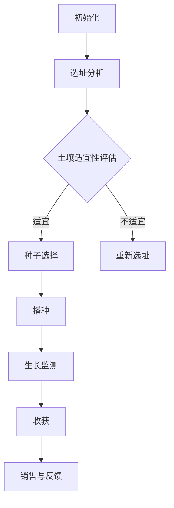
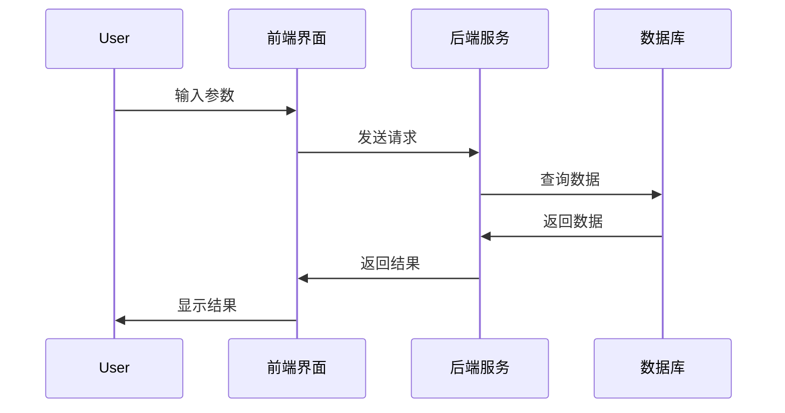
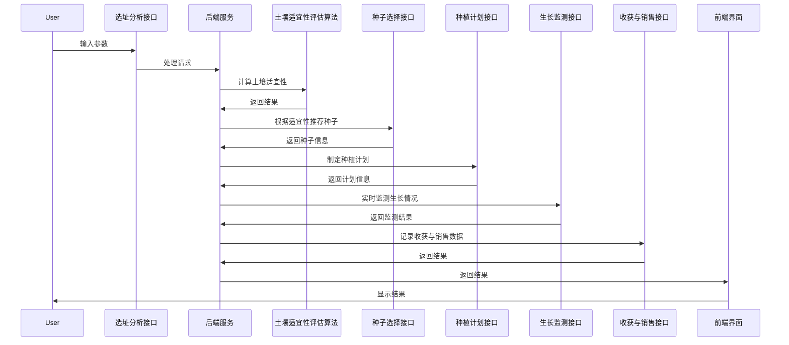

                 

# 城市农耕运动：都市中的田园梦想

## 关键词

- 城市农耕
- 都市农业
- 可持续发展
- 社会参与
- 生态农业

## 摘要

随着城市化进程的加快，城市与农业之间的矛盾日益凸显。城市农耕运动应运而生，旨在在城市中恢复田园梦想，实现生态可持续性和生活质量的提升。本文将从背景介绍、核心概念、算法原理与数学模型等方面，深入探讨城市农耕运动的本质、实现方式和未来发展方向。

### 目录大纲

**# 城市农耕运动：都市中的田园梦想**

## **第1章 引言**

### **1.1 问题背景**

- 城市化进程与农业发展的矛盾
- 生态可持续性与生活质量的关系

### **1.2 问题解决**

- 城市农耕的概念与意义
- 城市农耕的实现方式与案例

### **1.3 边界与外延**

- 城市农耕的范围与限制
- 城市农耕与传统农业的异同

## **第2章 城市农耕的核心概念与联系**

### **2.1 核心概念**

- 城市农耕的定义与特征
- 城市农耕与传统农业的比较

### **2.2 概念属性特征对比表格**

| 概念          | 特征                     | 对比                    |
| ------------- | ------------------------ | -----------------------|
| 城市农耕      | 在城市中进行农业生产    | 传统农业在乡村地区进行 |
| 资源利用      | 高效利用城市空间和资源  | 较低资源利用率         |
| 社会参与      | 广泛的社会参与和互动    | 农业生产主体单一       |

### **2.3 ER实体关系图架构**

```mermaid
erDiagram
  User ||--|{ Farm }|--|| Product
  Farm ||--|{ Gardener }|--||
  Product ||--|{ Consumer }|--||
```

## **第3章 城市农耕的算法原理与数学模型**

### **3.1 算法mermaid流程图**



### **3.2 Python源代码与算法原理**

```python
# Python代码示例：城市农耕选址分析算法

def soil_suitability(land_area, rainfall, temperature):
    # 土壤适宜性评估函数
    if rainfall > 500 and temperature > 15:
        return "适宜"
    else:
        return "不适宜"

def select_seeds(soil_suitability):
    if soil_suitability == "适宜":
        return "小麦种子"
    else:
        return "适应性种子"

def planting(land_area, seeds):
    if seeds == "小麦种子":
        print("播种小麦")
    else:
        print("播种适应性种子")

def monitor_growth(rainfall, temperature):
    # 生长监测函数
    if rainfall > 300 and temperature > 10:
        print("生长良好")
    else:
        print("生长受影响")

def harvest_and_sell():
    print("收获与销售")

# 实例化流程
land_area = 1000  # 土地面积
rainfall = 600    # 降雨量
temperature = 20  # 温度

# 选址分析
soil_suitability_result = soil_suitability(land_area, rainfall, temperature)
print("土壤适宜性评估结果：", soil_suitability_result)

# 种子选择
seeds = select_seeds(soil_suitability_result)
print("种子选择结果：", seeds)

# 播种
planting(land_area, seeds)

# 生长监测
monitor_growth(rainfall, temperature)

# 收获与销售
harvest_and_sell()
```

## 第1章 引言

### 1.1 问题背景

随着城市化进程的加快，城市人口数量不断增加，城市用地紧张，土地资源日益稀缺。与此同时，传统农业面临着资源过度消耗、环境污染、生态破坏等问题，传统的农业发展模式已无法满足城市居民的生态可持续性和生活质量需求。

另一方面，城市居民对健康、绿色、有机农产品的需求日益增长，但传统的农业生产方式无法满足这一需求。城市农耕运动的兴起，旨在通过在城市中开展农业生产，解决城市化进程与农业发展之间的矛盾，实现生态可持续性和生活质量的提升。

### 1.2 问题解决

城市农耕运动应运而生，它以城市为中心，将农业生产与城市生活相结合，实现了城市与农业的协同发展。城市农耕不仅能够提供绿色、有机的农产品，满足城市居民对健康食品的需求，还能够改善城市生态环境，提高居民的生活质量。

城市农耕运动的具体实现方式包括：

1. **垂直农业**：利用高层建筑的空中空间进行农业生产，利用先进的栽培技术，实现高效、低耗的农业生产。
2. **屋顶花园**：在城市建筑的屋顶上建设花园，种植各种蔬菜、水果等，不仅可以美化城市环境，还能够提供新鲜的农产品。
3. **社区农耕**：鼓励城市居民在社区内进行小规模农业生产，提高社会参与度，增强社区凝聚力。

### 1.3 边界与外延

城市农耕运动虽然具有众多优势，但也存在一些边界和限制。首先，城市农耕需要占用城市空间，这可能导致城市用地紧张。其次，城市农耕需要具备一定的技术和管理水平，否则可能会影响农产品的质量和产量。

与传统农业相比，城市农耕具有以下异同点：

| 特点         | 城市农耕               | 传统农业             |
| ------------ | ---------------------- | -------------------- |
| 场所         | 城市中                 | 农村中               |
| 资源利用     | 高效利用城市空间和资源 | 资源利用率较低       |
| 社会参与     | 广泛的社会参与和互动   | 农业生产主体单一     |
| 环境影响     | 有利于城市生态环境改善 | 可能导致生态破坏     |
| 技术要求     | 较高                   | 较低                 |
| 农产品特性   | 绿色、有机、高质量     | 产量较高、质量参差不齐 |

## 第2章 城市农耕的核心概念与联系

### 2.1 核心概念

城市农耕（Urban Agriculture）是指在城市区域内进行的农业生产活动。它包括利用城市空间进行种植、养殖、水产养殖等多种形式，旨在为城市居民提供新鲜、绿色、有机的农产品，同时改善城市生态环境。

城市农耕与传统农业相比，具有以下特征：

1. **高效利用城市空间**：城市农耕可以充分利用城市屋顶、阳台、废弃地等空间，实现土地的高效利用。
2. **技术密集型**：城市农耕需要运用现代农业技术，如温室栽培、无土栽培、垂直农业等，以提高生产效率和产品质量。
3. **社会参与度高**：城市农耕鼓励居民参与农业生产，增强社区凝聚力，提高居民的生活质量。

### 2.2 概念属性特征对比表格

| 概念          | 特征                     | 对比                    |
| ------------- | ------------------------ | -----------------------|
| 城市农耕      | 在城市中进行农业生产    | 传统农业在乡村地区进行 |
| 资源利用      | 高效利用城市空间和资源  | 较低资源利用率         |
| 社会参与      | 广泛的社会参与和互动    | 农业生产主体单一       |

### 2.3 ER实体关系图架构

城市农耕的实体关系图架构如下：

```mermaid
erDiagram
  User ||--|{ Farm }|--|| Product
  Farm ||--|{ Gardener }|--||
  Product ||--|{ Consumer }|--||
```

在这个架构中，用户（User）可以参与城市农耕，成为农耕者（Gardener），负责农产品的生产。农产品（Product）通过农耕场（Farm）与消费者（Consumer）相连，实现了生产者与消费者的直接互动。

## 第3章 城市农耕的算法原理与数学模型

### 3.1 算法mermaid流程图

城市农耕的选址分析算法可以表示为以下mermaid流程图：


### 3.2 Python源代码与算法原理

以下是一个简单的Python代码示例，用于城市农耕的选址分析算法：

```python
# Python代码示例：城市农耕选址分析算法

def soil_suitability(land_area, rainfall, temperature):
    # 土壤适宜性评估函数
    if rainfall > 500 and temperature > 15:
        return "适宜"
    else:
        return "不适宜"

def select_seeds(soil_suitability):
    if soil_suitability == "适宜":
        return "小麦种子"
    else:
        return "适应性种子"

def planting(land_area, seeds):
    if seeds == "小麦种子":
        print("播种小麦")
    else:
        print("播种适应性种子")

def monitor_growth(rainfall, temperature):
    # 生长监测函数
    if rainfall > 300 and temperature > 10:
        print("生长良好")
    else:
        print("生长受影响")

def harvest_and_sell():
    print("收获与销售")

# 实例化流程
land_area = 1000  # 土地面积
rainfall = 600    # 降雨量
temperature = 20  # 温度

# 选址分析
soil_suitability_result = soil_suitability(land_area, rainfall, temperature)
print("土壤适宜性评估结果：", soil_suitability_result)

# 种子选择
seeds = select_seeds(soil_suitability_result)
print("种子选择结果：", seeds)

# 播种
planting(land_area, seeds)

# 生长监测
monitor_growth(rainfall, temperature)

# 收获与销售
harvest_and_sell()
```

### 3.3 数学模型与公式

在城市农耕中，土壤适宜性评估是一个关键问题。我们可以使用以下数学模型来进行评估：

$$
\text{土壤适宜性} = \frac{\text{降雨量}}{\text{土地面积}} \times \text{温度}
$$

其中，降雨量和温度都是影响土壤适宜性的关键因素。如果土壤适宜性大于某个阈值（例如，0.5），则认为该土地适宜进行农业生产。

### 3.4 举例说明

假设有一块土地，面积为1000平方米，降雨量为600毫米，温度为20摄氏度。我们可以使用上述数学模型来评估该土地的土壤适宜性：

$$
\text{土壤适宜性} = \frac{600}{1000} \times 20 = 12
$$

由于土壤适宜性大于0.5，因此我们可以认为这块土地适宜进行农业生产。接下来，我们可以根据土壤适宜性选择合适的种子，并进行播种、生长监测和收获与销售等步骤。

## 第4章 系统分析与架构设计

### 4.1 问题场景介绍

随着城市农耕运动的兴起，如何有效地管理和运营城市农耕项目成为一个重要问题。为了解决这一问题，我们需要设计一个完善的系统，用于实现城市农耕的规划、实施和管理。

### 4.2 项目介绍

本系统名为“城市农耕管理系统（Urban Farming Management System，UFMS）”，旨在为城市农耕项目提供全面的管理支持。系统功能包括：

1. **选址分析**：根据土地面积、降雨量、温度等参数，评估土壤适宜性，为选址提供科学依据。
2. **种子选择**：根据土壤适宜性，推荐适合的种子，提高种植成功率。
3. **种植规划**：制定种植计划，包括播种时间、播种量等，确保农作物的生长周期和收获时间。
4. **生长监测**：实时监测农作物生长情况，及时发现问题并进行调整。
5. **收获与销售**：记录收获数据，实现农产品的销售和反馈。

### 4.3 系统功能设计

#### 领域模型mermaid类图

以下是一个简化的城市农耕管理系统领域模型类图：

```mermaid
classDiagram
  User <<Class>>
  Farm <<Class>>
  Seed <<Class>>
  Crop <<Class>>
  Harvest <<Class>>
  Sale <<Class>>

  User "1" --|{ manage }| Farm
  Farm "1" --|{ plant }| Seed
  Farm "1" --|{ grow }| Crop
  Crop "1" --|{ harvest }| Harvest
  Harvest "1" --|{ sell }| Sale
```

### 4.4 系统架构设计

城市农耕管理系统的架构设计如下：

1. **前端界面**：提供用户操作界面，包括选址分析、种子选择、种植规划、生长监测、收获与销售等功能。
2. **后端服务**：处理业务逻辑，包括土壤适宜性评估、种子推荐、种植计划制定、生长监测和销售管理等。
3. **数据库**：存储用户信息、农田信息、种植计划、收获数据、销售数据等。

以下是一个简化的mermaid架构图：



### 4.5 系统接口设计和系统交互

城市农耕管理系统涉及多个接口和模块，以下是一个简化的接口设计和系统交互流程：

1. **选址分析接口**：接收用户输入的土地参数（面积、降雨量、温度等），评估土壤适宜性。
2. **种子选择接口**：根据土壤适宜性，推荐适合的种子。
3. **种植计划接口**：制定种植计划，包括播种时间、播种量等。
4. **生长监测接口**：实时监测农作物生长情况。
5. **收获与销售接口**：记录收获数据，实现农产品的销售和反馈。

以下是一个简化的mermaid序列图：



## 第5章 项目实战

### 5.1 环境安装

为了实现城市农耕管理系统，我们需要安装以下软件和工具：

1. **Python**：用于编写后端服务和算法代码。
2. **Flask**：用于构建Web应用程序。
3. **SQLAlchemy**：用于数据库操作。
4. **Mermaid**：用于绘制流程图和类图。

安装命令如下：

```bash
pip install python flask sqlalchemy mermaid
```

### 5.2 系统核心实现源代码

以下是一个简化的城市农耕管理系统核心实现源代码：

```python
# urban_farming_system.py

from flask import Flask, request, jsonify
from sqlalchemy import create_engine
from mermaid import Mermaid

app = Flask(__name__)

# 数据库连接
engine = create_engine('sqlite:///urban_farming.db')

# 创建数据库表
with engine.connect() as connection:
    connection.execute('''CREATE TABLE IF NOT EXISTS farm
                        (id INTEGER PRIMARY KEY,
                        land_area INTEGER,
                        rainfall INTEGER,
                        temperature INTEGER,
                        soil_suitability VARCHAR(10),
                        seed VARCHAR(20),
                        planting_date DATE,
                        harvest_date DATE)''')

# 选址分析接口
@app.route('/analyze', methods=['POST'])
def analyze():
    data = request.json
    land_area = data['land_area']
    rainfall = data['rainfall']
    temperature = data['temperature']
    
    soil_suitability = soil_suitability(land_area, rainfall, temperature)
    seed = select_seed(soil_suitability)
    
    with engine.connect() as connection:
        connection.execute('''INSERT INTO farm
                            (land_area, rainfall, temperature, soil_suitability, seed)
                            VALUES (:land_area, :rainfall, :temperature, :soil_suitability, :seed)''',
                            land_area=land_area,
                            rainfall=rainfall,
                            temperature=temperature,
                            soil_suitability=soil_suitability,
                            seed=seed)
    
    return jsonify({'soil_suitability': soil_suitability, 'seed': seed})

# 种子选择接口
def select_seed(soil_suitability):
    if soil_suitability == '适宜':
        return '小麦种子'
    else:
        return '适应性种子'

# 播种计划接口
@app.route('/plan', methods=['POST'])
def plan():
    data = request.json
    planting_date = data['planting_date']
    harvest_date = data['harvest_date']
    
    with engine.connect() as connection:
        connection.execute('''UPDATE farm
                            SET planting_date = :planting_date,
                                harvest_date = :harvest_date
                            WHERE id = :id''',
                            planting_date=planting_date,
                            harvest_date=harvest_date,
                            id=data['id'])
    
    return jsonify({'message': '计划更新成功'})

# 生长监测接口
@app.route('/monitor', methods=['POST'])
def monitor():
    data = request.json
    growth_status = data['growth_status']
    
    with engine.connect() as connection:
        connection.execute('''UPDATE farm
                            SET growth_status = :growth_status
                            WHERE id = :id''',
                            growth_status=growth_status,
                            id=data['id'])
    
    return jsonify({'message': '监测更新成功'})

# 收获与销售接口
@app.route('/harvest', methods=['POST'])
def harvest():
    data = request.json
    harvest_quantity = data['harvest_quantity']
    sale_quantity = data['sale_quantity']
    
    with engine.connect() as connection:
        connection.execute('''UPDATE farm
                            SET harvest_quantity = :harvest_quantity,
                                sale_quantity = :sale_quantity
                            WHERE id = :id''',
                            harvest_quantity=harvest_quantity,
                            sale_quantity=sale_quantity,
                            id=data['id'])
    
    return jsonify({'message': '收获与销售更新成功'})

if __name__ == '__main__':
    app.run(debug=True)
```

### 5.3 代码应用解读与分析

本代码实现了一个简单的城市农耕管理系统，主要包括以下几个部分：

1. **数据库连接**：使用SQLAlchemy库连接SQLite数据库，并创建农

