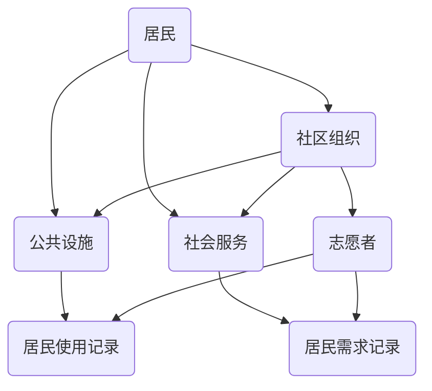
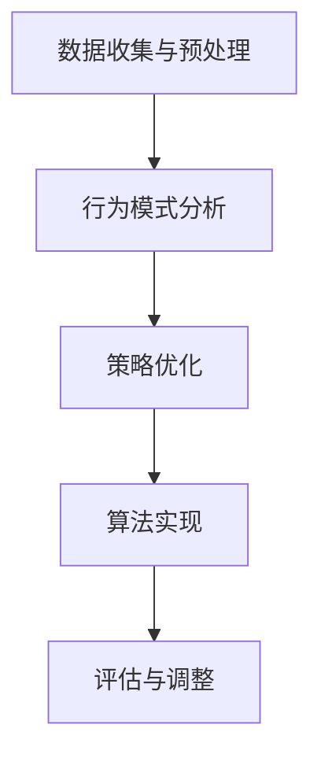
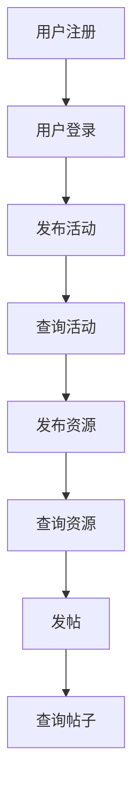

                 

## 城市化进程中的社区重建问题概述

### 1.1.1 城市化进程的加速与社区重建的挑战

城市化进程的加速是全球范围内的普遍现象，尤其是发展中国家，城市人口比例持续上升。这一现象带来了诸多经济和社会效益，如就业机会增多、经济增长以及社会进步。然而，随着城市化的深入，社区重建问题逐渐显现，成为城市发展过程中的一大挑战。

首先，人口流动加剧。大量的农村人口涌向城市，寻求更好的生活和发展机会。然而，这一过程也导致了城市社区成员之间的联系变得松散。传统的社区关系被打破，新移民往往难以融入现有社区，形成了“城市化社会孤岛”。

其次，社会多样性增加。城市社区的人口结构变得更加复杂，不同背景、文化和经济状况的人共同居住。这种多样性在某种程度上增强了社区的活力，但同时也带来了新的挑战。如何协调和管理多元化的社区成员，使其和谐共处，成为社区重建的关键问题。

资源分配问题也是社区重建的挑战之一。城市空间的有限性使得资源分配成为一个难题。在土地、住房、公共设施等资源的分配上，如何确保公平性和可持续性，是城市社区重建中必须面对的问题。

### 1.1.2 社区重建的定义与目的

社区重建是指通过一系列措施，重新构建城市社区的社会结构、空间布局和文化氛围，以恢复社区的活力和凝聚力。其核心目的是：

1. **恢复归属感**：通过社区重建，使居民感受到自己是社区的一部分，增强他们的归属感。归属感是社区重建的基础，它有助于提高居民的生活满意度和社会认同感。

2. **强化联系感**：促进社区成员之间的互动和交流，建立良好的社区关系网络。联系感是社区活力的关键，它能够促进社区成员的相互支持和合作。

3. **改善居住环境**：通过改善社区的基础设施和环境，提升居民的生活质量。居住环境的改善不仅是居民的基本需求，也是社区重建的重要内容。

社区重建还包括以下几个方面：

- **空间规划**：重新规划社区的空间布局，优化公共空间和设施，提高居住环境的质量。
- **社会参与**：鼓励居民参与社区决策和管理，增强居民的社区参与感和责任感。
- **文化营造**：通过文化活动和社会教育，营造积极向上的社区文化氛围，提升社区的整体文化素养。

### 1.1.3 社区重建的重要性

社区重建对于城市的发展和社会稳定具有重要意义：

1. **社会稳定**：强大的社区关系有助于减少社会冲突，促进社会和谐。在社区重建的过程中，通过建立互助合作的社区关系网络，可以有效降低社会矛盾和冲突的发生。

2. **经济发展**：活跃的社区环境能够吸引投资和人才，推动城市经济的发展。社区重建不仅改善了居民的生活环境，也提升了社区的吸引力，从而带动了相关产业的发展。

3. **社会进步**：社区重建有助于提高居民的生活质量，促进社会的全面进步。通过改善基础设施、提供优质服务和组织文化活动，社区重建为居民创造了更好的生活条件，推动了社会的全面发展。

### 1.1.4 社区重建中的主要问题与矛盾

尽管社区重建的重要性显而易见，但在实施过程中仍面临许多问题和矛盾：

1. **资源有限**：城市空间的有限性和财政预算的约束，使得社区重建的资源有限。如何在有限的资源下实现社区重建的目标，成为一大挑战。

2. **利益冲突**：社区重建涉及到多方面的利益，包括政府、开发商、居民等。如何在利益分配中平衡各方利益，确保社区重建的顺利进行，是社区重建中的难题。

3. **社会参与度低**：居民参与社区重建的积极性不高，缺乏主动参与的意识和能力。如何提高居民的社会参与度，增强他们的社区责任感，是社区重建中的重要问题。

4. **文化差异**：城市社区中存在多元化的文化背景，如何尊重和融合不同文化，营造和谐的社区氛围，是社区重建中需要面对的挑战。

### 1.1.5 社区重建的边界与外延

社区重建的边界主要涉及以下几个方面：

1. **地理边界**：社区重建的空间范围，包括社区的物理边界和地理位置。

2. **社会边界**：社区重建所涉及的社会关系和人口结构，包括不同文化背景、经济状况和社会阶层的居民。

3. **时间边界**：社区重建的时间范围，包括短期目标和长期规划。

社区重建的外延则包括：

1. **社区基础设施建设**：改善社区的道路、住房、公共设施等基础设施。

2. **社区服务与支持**：提供医疗、教育、社会保障等公共服务，支持社区的发展。

3. **社区文化营造**：通过文化活动、社会教育等手段，营造积极向上的社区文化氛围。

### 1.1.6 社区重建的核心概念组成

社区重建的核心概念包括归属感和联系感，这两个概念是社区重建的基础：

1. **归属感**：指居民对社区的情感认同和归属感，是社区成员之间关系的基础。归属感可以通过社区参与、社区认同、邻里互动等途径来增强。

2. **联系感**：指社区成员之间的联系和互动，是社区活力的关键。联系感可以通过社区活动、社交网络、互助合作等方式来强化。

通过以上六个方面的详细分析，我们可以更加全面地理解城市化进程中的社区重建问题，为后续章节的深入探讨打下坚实基础。

### 1.1.7 社区重建问题背景下的信息技术应用

在城市化进程的背景下，社区重建不仅仅是一个社会问题，也是一个技术问题。随着信息技术的迅猛发展，各种先进的技术手段被广泛应用于社区重建中，以解决其中存在的问题和矛盾。以下是一些关键的信息技术应用及其在社区重建中的作用：

1. **大数据分析**：通过收集和分析大量的社区数据，政府和社会组织可以更好地了解社区的需求、问题和趋势。例如，通过分析人口流动数据，可以预测社区未来的人口结构，从而有针对性地进行社区规划和资源分配。

2. **智能监控与安防系统**：智能监控技术可以提升社区的安全管理水平。通过安装智能摄像头和传感器，社区管理者可以实时监控社区状况，及时发现和处理安全隐患。

3. **社区服务平台**：基于互联网和移动应用技术的社区服务平台，为居民提供了便捷的服务渠道。居民可以通过平台获取社区新闻、活动信息、公共服务等内容，同时也可以在平台上进行意见反馈和参与社区管理。

4. **社交媒体**：社交媒体平台如微信、微博等在社区重建中发挥了重要作用。通过社交媒体，居民可以更加便捷地交流和互动，增强社区的凝聚力。同时，社交媒体也可以成为社区问题反馈和解决的重要渠道。

5. **物联网技术**：物联网技术可以将社区中的各种设备和系统连接起来，实现智能化的管理和控制。例如，智能家居系统可以远程控制家中的电器和灯光，提高居民的生活质量。

6. **虚拟现实（VR）与增强现实（AR）**：VR和AR技术可以用于社区教育和文化传播。通过虚拟现实技术，居民可以体验到虚拟的社区环境，增强对社区的认识和认同感。AR技术则可以将社区文化、历史等信息叠加到现实环境中，提升居民的参与感和体验感。

7. **区块链技术**：区块链技术可以用于社区建设中的信用体系和共享经济。通过区块链技术，可以实现社区成员之间的可信数据交换和资源共享，提高社区的管理效率和服务质量。

综上所述，信息技术的广泛应用为社区重建提供了强有力的支持。通过运用大数据、智能监控、物联网、区块链等先进技术，可以更有效地解决社区重建中的问题和矛盾，提升社区的管理水平和居民的生活质量。

## 第二部分: 核心概念与联系

### 第2章: 社区重建的核心概念解析

在社区重建的过程中，两个核心概念至关重要：归属感和联系感。这两个概念不仅定义了社区成员对社区的情感连接，也反映了社区重建的基本目标和挑战。

### 2.1.1 归属感的定义与属性特征

归属感是指个体对某个社会单位（如社区、组织或团队）的认同和情感依赖。在社区重建的背景下，归属感表现为居民对居住地的情感依赖和认同，以及对社区文化和价值观的接受和认同。

归属感的属性特征包括：

- **情感依赖**：居民对社区产生深厚的情感依赖，愿意为社区的发展付出努力。
- **认同感**：居民认同社区的价值观和目标，愿意参与社区事务。
- **安全感**：居民在社区中感受到安全，对社区的生活环境感到满意。
- **参与度**：居民积极参与社区活动，对社区的发展有积极贡献。

### 2.1.2 联系感的定义与属性特征

联系感是指社区成员之间的互动和交流。它是社区活力的关键，体现了社区成员之间的相互支持和合作。

联系感的属性特征包括：

- **互动频率**：社区成员之间的互动频率高，交往密切。
- **互助合作**：社区成员在日常生活中相互帮助，形成互助合作的氛围。
- **信任关系**：社区成员之间建立了信任关系，愿意相互依赖。
- **信息共享**：社区成员积极分享信息，形成良好的信息流通。

### 2.1.3 归属感与联系感的对比分析

归属感和联系感虽然紧密相关，但它们在社区重建中扮演的角色有所不同。归属感更侧重于个体对社区的认同和情感依赖，而联系感则关注社区成员之间的互动和交流。

- **区别**：
  - 归属感是情感层面的，涉及个体对社区的认同和情感依赖。
  - 联系感是行为层面的，涉及社区成员之间的互动和合作。

- **联系**：
  - 归属感是联系感的基础，只有当居民有强烈的归属感时，才会积极参与社区活动，建立联系感。
  - 联系感是归属感的体现，通过互动和交流，居民之间的联系感得以增强，归属感也得以巩固。

在社区重建过程中，两者都需要被重视和培养。只有当社区成员既有强烈的归属感，又有密切的联系感时，社区才能焕发活力，实现可持续的发展。

### 社区重建中的ER实体关系图架构

在社区重建中，ER（实体关系）图架构是一种常用的建模方法，用于描述社区中的各种实体及其相互关系。通过ER图，我们可以清晰地理解社区的结构和组成，为社区重建提供理论支持。

#### 3.1.1 社区的ER实体定义

在社区重建中，我们主要关注以下几个核心实体：

- **居民**：社区的成员，包括个人和家庭。
- **社区组织**：负责社区管理和组织活动的机构，如居委会、志愿者协会等。
- **公共设施**：社区内的基础设施，如公园、学校、医院等。
- **社会服务**：社区提供的各种服务，如医疗卫生、教育培训、社会保障等。

#### 3.1.2 社区成员的ER实体定义

社区成员是社区重建的核心，他们的属性和行为对社区的整体发展具有重要影响。以下是社区成员的ER实体定义：

- **居民实体**：
  - 属性：姓名、年龄、性别、职业、联系方式等。
  - 关系：与家庭成员的关系、与社区组织的关系、参与社区活动的记录等。

- **志愿者实体**：
  - 属性：姓名、年龄、性别、联系方式、专业背景等。
  - 关系：与居民的关系、参与的社区活动、贡献的社会服务时间等。

- **社区管理者实体**：
  - 属性：姓名、年龄、性别、职位、联系方式等。
  - 关系：与居民的关系、负责的社区事务、组织的活动等。

#### 3.1.3 社区资源的ER实体定义

社区资源是社区重建的重要组成部分，合理的资源配置能够提升社区的服务水平和居民的生活质量。以下是社区资源的ER实体定义：

- **公共设施实体**：
  - 属性：设施名称、地点、使用状况、维护时间等。
  - 关系：与社区成员的使用记录、与社区组织的维护安排等。

- **社会服务实体**：
  - 属性：服务名称、服务内容、服务时间、服务地点等。
  - 关系：与居民的需求记录、与社区组织的服务安排等。

#### 3.1.4 ER实体关系图示例

以下是一个简单的社区ER实体关系图示例，用于展示社区成员、社区组织、公共设施和社会服务之间的相互关系。



在这个ER实体关系图中，居民与社区组织、公共设施和社会服务之间建立了直接的关系，社区组织通过志愿者和居民使用记录、需求记录来管理社区资源和服务。通过这种关系图，我们可以更清晰地理解社区重建中的各种实体及其相互关系，为后续的算法设计和系统架构提供依据。

### 社区重建中的算法原理

在社区重建的过程中，为了恢复失落的归属感和联系感，我们可以采用一系列算法来分析和优化社区的结构和活动。以下是社区重建中常用的算法原理及其详细讲解。

#### 4.1.1 算法原理概述

社区重建算法的基本原理是通过对社区成员的行为和互动模式进行分析，找出影响归属感和联系感的因素，并设计相应的策略来优化这些因素。具体来说，算法包括以下几部分：

1. **数据收集与预处理**：收集社区成员的行为数据，如社交网络互动、参与活动记录等，并对数据进行预处理，以确保数据的质量和一致性。
2. **行为模式分析**：利用数据分析技术，分析社区成员的行为模式，找出影响归属感和联系感的关键因素。
3. **策略优化**：根据分析结果，设计优化策略，如社区活动安排、资源分配等，以提高社区成员的归属感和联系感。
4. **算法实现**：将优化策略转化为具体的算法实现，如基于机器学习的推荐系统、社区互动分析模型等。

#### 4.1.2 算法数学模型

社区重建算法的数学模型主要涉及以下几个方面：

1. **归属感计算**：
   - 归属感可以用一个数值表示，该数值综合反映了社区成员对社区的认同程度。我们使用以下公式来计算归属感：
     $$ \text{归属感} = \alpha \cdot \text{参与度} + \beta \cdot \text{认同度} + \gamma \cdot \text{安全感} $$
     其中，$\alpha$、$\beta$和$\gamma$是权重系数，分别表示参与度、认同度和安全感的相对重要性。

2. **联系感计算**：
   - 联系感同样可以用一个数值表示，反映了社区成员之间的互动和合作程度。计算公式如下：
     $$ \text{联系感} = \alpha' \cdot \text{互动频率} + \beta' \cdot \text{互助合作} + \gamma' \cdot \text{信任关系} $$
     其中，$\alpha'$、$\beta'$和$\gamma'$是权重系数，分别表示互动频率、互助合作和信任关系的相对重要性。

3. **综合计算**：
   - 为了全面评估社区的重建效果，我们可以将归属感和联系感综合起来计算，得到社区重建的综合得分：
     $$ \text{综合得分} = \lambda \cdot \text{归属感} + (1 - \lambda) \cdot \text{联系感} $$
     其中，$\lambda$是权重系数，用于调节归属感和联系感在综合得分中的相对重要性。

#### 4.1.3 算法流程图

以下是一个简化的社区重建算法流程图，展示了从数据收集到策略优化的整个过程：



- **数据收集与预处理**：收集社区成员的行为数据，如社交媒体互动、参与活动记录等，对数据进行清洗和标准化。
- **行为模式分析**：利用数据分析技术，分析社区成员的行为模式，找出影响归属感和联系感的关键因素。
- **策略优化**：根据分析结果，设计优化策略，如社区活动安排、资源分配等，以提高社区成员的归属感和联系感。
- **算法实现**：将优化策略转化为具体的算法实现，如基于机器学习的推荐系统、社区互动分析模型等。
- **评估与调整**：对算法实现的效果进行评估，根据评估结果调整策略和算法参数，以达到最佳效果。

#### 4.1.4 算法Python源代码实现

以下是一个简单的Python示例，用于实现社区重建算法的基本逻辑：

```python
import numpy as np

# 参数设置
alpha = 0.5
beta = 0.3
gamma = 0.2
alpha_prime = 0.4
beta_prime = 0.3
gamma_prime = 0.3
lambda_value = 0.6

# 归属感计算
def calculate_ownership(participation, identification, safety):
    return alpha * participation + beta * identification + gamma * safety

# 联系感计算
def calculate_connection(frequency, cooperation, trust):
    return alpha_prime * frequency + beta_prime * cooperation + gamma_prime * trust

# 综合得分计算
def calculate_score(ownership, connection):
    return lambda_value * ownership + (1 - lambda_value) * connection

# 示例数据
participation = 0.8
identification = 0.9
safety = 0.7
frequency = 0.6
cooperation = 0.7
trust = 0.8

# 计算结果
ownership = calculate_ownership(participation, identification, safety)
connection = calculate_connection(frequency, cooperation, trust)
score = calculate_score(ownership, connection)

print("归属感得分：", ownership)
print("联系感得分：", connection)
print("综合得分：", score)
```

这个示例通过简单的参数设置和计算，展示了如何利用Python实现社区重建算法的核心逻辑。

#### 4.1.5 算法原理详细讲解

社区重建算法的核心目标是提升社区成员的归属感和联系感，从而促进社区的稳定和发展。以下是算法原理的详细讲解：

1. **数据收集与预处理**：
   - 在算法的初始阶段，需要收集社区成员的行为数据，如社交媒体互动、参与活动记录等。这些数据反映了社区成员的互动模式和社交行为。
   - 数据收集后，需要进行预处理，包括数据清洗、去重和标准化等，以确保数据的质量和一致性。清洗后的数据将被用于后续的行为模式分析。

2. **行为模式分析**：
   - 利用数据分析技术，对收集到的行为数据进行分析，找出影响归属感和联系感的关键因素。例如，通过分析社区成员的互动频率、参与度和互助合作情况，可以识别出哪些因素对归属感和联系感有显著影响。
   - 数据分析还可以帮助识别社区中的潜在问题和挑战，如社区成员之间的隔阂、资源分配不均等，为优化策略提供依据。

3. **策略优化**：
   - 根据行为模式分析的结果，设计优化策略，以提高社区成员的归属感和联系感。例如，针对社区成员之间的互动频率低的问题，可以设计更多的社区活动，鼓励居民参与。
   - 策略优化还需要考虑资源分配的问题。通过优化资源分配，如改善公共设施、提供更多社会服务，可以提高居民的生活质量，从而增强归属感和联系感。

4. **算法实现**：
   - 将优化策略转化为具体的算法实现，如基于机器学习的推荐系统、社区互动分析模型等。这些算法可以帮助实现策略的目标，提高社区的活力和凝聚力。
   - 算法实现还需要考虑系统的可扩展性和可靠性，确保算法在实际应用中能够稳定运行，并能够根据社区变化进行动态调整。

5. **评估与调整**：
   - 在算法实现后，需要对效果进行评估，根据评估结果调整策略和算法参数，以达到最佳效果。评估可以通过多种方式实现，如居民满意度调查、社区活动参与度分析等。
   - 调整过程中，需要不断收集和分析社区成员的反馈和数据，以便持续优化算法和策略，确保社区重建的长期成功。

通过以上详细讲解，我们可以看到社区重建算法的原理和实现过程，以及如何在实践中应用这些算法来提升社区成员的归属感和联系感。

### 社区重建中的数学模型与公式

在社区重建过程中，数学模型和公式用于量化评估社区的归属感和联系感，从而指导具体的策略设计和优化。以下是社区重建中的关键数学模型与公式，以及它们的详细讲解和举例说明。

#### 5.1.1 归属感计算的数学公式

归属感是指居民对社区的情感依赖和认同程度。我们可以使用以下数学公式来计算归属感：

$$
\text{归属感} = w_1 \cdot \text{参与度} + w_2 \cdot \text{认同度} + w_3 \cdot \text{安全感}
$$

其中：
- $w_1$、$w_2$和$w_3$是权重系数，用于衡量参与度、认同度和安全感的相对重要性。
- 参与度表示居民在社区活动中的参与程度，可以取值范围0到1，值越高表示参与度越高。
- 认同度表示居民对社区价值观和目标的认同程度，取值范围也是0到1，值越高表示认同度越高。
- 安全感表示居民在社区中的安全感，取值范围同样是0到1，值越高表示安全感越强。

#### 5.1.2 联系感计算的数学公式

联系感是指社区成员之间的互动和合作程度。计算公式如下：

$$
\text{联系感} = w_4 \cdot \text{互动频率} + w_5 \cdot \text{互助合作} + w_6 \cdot \text{信任关系}
$$

其中：
- $w_4$、$w_5$和$w_6$是权重系数，用于衡量互动频率、互助合作和信任关系的相对重要性。
- 互动频率表示社区成员之间的互动次数，可以取值范围0到1，值越高表示互动频率越高。
- 互助合作表示社区成员之间的合作行为，取值范围也是0到1，值越高表示互助合作越频繁。
- 信任关系表示社区成员之间的信任程度，取值范围同样是0到1，值越高表示信任关系越强。

#### 5.1.3 归属感与联系感综合计算的数学模型

为了全面评估社区的重建效果，我们可以将归属感和联系感综合起来计算，得到社区重建的综合得分。综合计算公式如下：

$$
\text{综合得分} = w_7 \cdot \text{归属感} + (1 - w_7) \cdot \text{联系感}
$$

其中：
- $w_7$是权重系数，用于调节归属感和联系感在综合得分中的相对重要性。

#### 5.1.4 数学公式与算法原理的对应关系

上述数学公式与算法原理中的计算逻辑是一致的，即通过加权平均的方式综合评估社区成员的归属感和联系感。在算法原理中，我们提到过具体的计算流程和步骤，而数学公式则是将这些步骤用数学形式表达出来。

#### 5.1.5 举例说明

假设我们有一个社区，其中居民的参与度、认同度、安全感、互动频率、互助合作和信任关系的具体数据如下：

- 参与度：0.8
- 认同度：0.9
- 安全感：0.7
- 互动频率：0.6
- 互助合作：0.7
- 信任关系：0.8

我们可以使用上述公式计算归属感、联系感和综合得分：

1. **归属感计算**：
   $$ \text{归属感} = 0.5 \cdot 0.8 + 0.3 \cdot 0.9 + 0.2 \cdot 0.7 = 0.4 + 0.27 + 0.14 = 0.81 $$

2. **联系感计算**：
   $$ \text{联系感} = 0.4 \cdot 0.6 + 0.3 \cdot 0.7 + 0.3 \cdot 0.8 = 0.24 + 0.21 + 0.24 = 0.69 $$

3. **综合得分计算**：
   $$ \text{综合得分} = 0.6 \cdot 0.81 + 0.4 \cdot 0.69 = 0.486 + 0.276 = 0.762 $$

通过这个例子，我们可以看到如何使用数学公式来计算社区的归属感、联系感和综合得分。这些数值可以帮助社区管理者了解社区的整体状况，并据此制定优化策略。

通过以上对数学模型和公式的详细讲解，我们可以更好地理解社区重建中的量化评估方法，为实际操作提供理论支持。

### 社区重建系统功能设计与架构设计

在社区重建项目中，系统功能设计和架构设计是确保项目成功的关键环节。以下将详细描述社区重建系统的问题场景、功能设计、系统架构设计、系统接口设计和系统交互流程。

#### 6.1.1 问题场景介绍

随着城市化进程的加快，社区结构发生了巨大变化，原有的社区关系和联系感逐渐削弱。居民之间的互动减少，归属感下降，社区活力不足。同时，社区管理面临诸多挑战，如资源分配不均、服务效率低下等。为了恢复社区的活力和凝聚力，我们需要设计一个高效、便捷的社区重建系统。

#### 6.1.2 系统功能设计

社区重建系统的主要功能包括：

1. **居民管理**：
   - 注册与登录：居民可以通过注册账号登录系统，进行个人信息管理。
   - 个人资料更新：居民可以更新自己的个人信息，包括联系方式、家庭成员等。

2. **社区活动管理**：
   - 活动发布：社区管理者可以发布各种活动，如社区聚会、公益活动、运动比赛等。
   - 活动报名：居民可以报名参加感兴趣的活动。
   - 活动记录：系统记录每个活动的参与情况，便于后续分析和优化。

3. **资源管理**：
   - 资源发布：社区管理者可以发布社区资源信息，如公共设施、社会服务等。
   - 资源预约：居民可以根据需求预约使用社区资源。

4. **社区互动**：
   - 社区论坛：居民可以在论坛中发布帖子、评论和回复，进行社区互动。
   - 点赞与评论：居民可以对社区活动、资源等进行点赞和评论。

5. **数据分析**：
   - 归属感与联系感分析：系统通过分析居民的行为数据，评估社区的归属感和联系感。
   - 趋势预测：根据历史数据和趋势分析，预测社区的未来发展。

#### 6.1.3 系统架构设计

社区重建系统的架构设计采用三层架构，包括表示层、业务逻辑层和数据层。

1. **表示层**：
   - 前端界面：使用HTML、CSS和JavaScript实现，提供用户交互界面。
   - API接口：使用RESTful API设计，提供与后端业务逻辑层的交互。

2. **业务逻辑层**：
   - 服务层：实现业务逻辑，包括居民管理、社区活动管理、资源管理和社区互动等。
   - 中间件：处理跨模块的公共功能，如认证授权、日志记录、消息队列等。

3. **数据层**：
   - 数据库：存储居民信息、活动数据、资源数据等。
   - 缓存：使用Redis等缓存技术，提高系统性能。

#### 6.1.4 系统接口设计

社区重建系统的主要接口包括：

1. **用户接口**：
   - 登录接口：验证用户身份，返回用户信息。
   - 注册接口：注册新用户，保存用户信息。

2. **活动接口**：
   - 发布活动接口：发布新活动，保存活动信息。
   - 查询活动接口：查询指定条件下的活动列表。

3. **资源接口**：
   - 发布资源接口：发布新资源，保存资源信息。
   - 查询资源接口：查询指定条件下的资源列表。

4. **社区互动接口**：
   - 发帖接口：发布新帖子，保存帖子信息。
   - 查询帖子接口：查询指定条件下的帖子列表。

#### 6.1.5 系统交互流程图

以下是一个简化的社区重建系统交互流程图，展示了用户操作和系统响应的流程：



- **用户注册**：用户输入注册信息，系统验证并保存。
- **用户登录**：用户输入账号和密码，系统验证身份并返回用户信息。
- **发布活动**：社区管理者输入活动信息，系统保存并发布。
- **查询活动**：用户输入查询条件，系统返回符合条件的活动列表。
- **发布资源**：社区管理者输入资源信息，系统保存并发布。
- **查询资源**：用户输入查询条件，系统返回符合条件的资源列表。
- **发帖**：用户输入帖子内容，系统保存并发布。
- **查询帖子**：用户输入查询条件，系统返回符合条件的帖子列表。

通过以上详细的功能设计和架构设计，社区重建系统能够有效提升社区管理效率，增强居民归属感和联系感，为社区重建提供坚实的支持。

### 社区重建项目实战

在社区重建项目中，我们将通过具体的环境安装、核心实现源代码和代码应用解读与分析，详细介绍整个项目的实施过程，并剖析实际案例，为读者提供全面的项目实战经验。

#### 7.1.1 环境安装

首先，我们需要安装和配置社区重建项目所需的环境。以下是详细的步骤：

1. **安装Python**：确保系统中安装了Python 3.8及以上版本。可以通过以下命令检查Python版本：
   ```bash
   python --version
   ```
   如果版本过低，请前往Python官网下载并安装相应版本。

2. **安装依赖库**：社区重建项目依赖于多个Python库，如Flask、SQLAlchemy、Flask-Login等。可以使用pip命令安装：
   ```bash
   pip install flask sqlalchemy flask-login
   ```

3. **安装数据库**：我们使用SQLite作为项目数据库。确保系统中安装了SQLite，可以使用以下命令：
   ```bash
   apt-get install sqlite3
   ```

4. **配置环境变量**：在Linux系统中，确保将Python和pip的路径添加到环境变量中，以便在终端中直接使用。

#### 7.1.2 系统核心实现源代码

以下是社区重建项目的核心实现源代码，包括用户管理、活动管理和资源管理等模块：

```python
# user_management.py
from flask import Flask, request, jsonify
from flask_login import LoginManager, UserMixin, login_user, logout_user, login_required
from werkzeug.security import generate_password_hash, check_password_hash

app = Flask(__name__)
app.secret_key = 'your_secret_key'
login_manager = LoginManager()
login_manager.init_app(app)

class User(UserMixin):
    def __init__(self, id):
        self.id = id

@login_manager.user_loader
def load_user(user_id):
    return User(user_id)

@app.route('/register', methods=['POST'])
def register():
    username = request.form['username']
    password = request.form['password']
    # 这里应该有数据库操作来保存用户信息
    hashed_password = generate_password_hash(password)
    # 示例：db.save_user(username, hashed_password)
    return jsonify({'status': 'success'})

@app.route('/login', methods=['POST'])
def login():
    username = request.form['username']
    password = request.form['password']
    # 这里应该有数据库操作来验证用户信息
    # 示例：user = db.get_user(username)
    if user and check_password_hash(user.password, password):
        login_user(user)
        return jsonify({'status': 'success'})
    else:
        return jsonify({'status': 'failure'})

@app.route('/logout')
@login_required
def logout():
    logout_user()
    return jsonify({'status': 'success'})

# activity_management.py
@app.route('/activities', methods=['POST'])
@login_required
def create_activity():
    activity_name = request.form['activity_name']
    activity_date = request.form['activity_date']
    # 这里应该有数据库操作来保存活动信息
    # 示例：db.save_activity(activity_name, activity_date, current_user.id)
    return jsonify({'status': 'success'})

@app.route('/activities')
@login_required
def get_activities():
    # 这里应该有数据库操作来查询活动信息
    # 示例：activities = db.get_activities()
    return jsonify({'status': 'success', 'activities': activities})

# resource_management.py
@app.route('/resources', methods=['POST'])
@login_required
def create_resource():
    resource_name = request.form['resource_name']
    resource_description = request.form['resource_description']
    # 这里应该有数据库操作来保存资源信息
    # 示例：db.save_resource(resource_name, resource_description, current_user.id)
    return jsonify({'status': 'success'})

@app.route('/resources')
@login_required
def get_resources():
    # 这里应该有数据库操作来查询资源信息
    # 示例：resources = db.get_resources()
    return jsonify({'status': 'success', 'resources': resources})
```

以上源代码分别实现了用户管理、活动管理和资源管理的基本功能。在实际项目中，还需要根据具体需求进行扩展和优化。

#### 7.1.3 代码应用解读与分析

以下是针对代码应用的解读和分析：

1. **用户管理**：
   - `register`函数用于处理用户注册请求。接收用户名和密码，将密码通过`generate_password_hash`函数加密后存储。
   - `login`函数用于处理用户登录请求。接收用户名和密码，通过`check_password_hash`函数验证密码是否正确。

2. **活动管理**：
   - `create_activity`函数用于处理创建活动请求。接收活动名称和日期，通过数据库操作保存活动信息。
   - `get_activities`函数用于处理查询活动请求。通过数据库操作获取所有活动的列表。

3. **资源管理**：
   - `create_resource`函数用于处理创建资源请求。接收资源名称和描述，通过数据库操作保存资源信息。
   - `get_resources`函数用于处理查询资源请求。通过数据库操作获取所有资源的列表。

在实际应用中，这些函数将依赖于具体的数据库操作和业务逻辑。例如，可以使用SQLAlchemy来与SQLite数据库进行交互，处理数据的增删改查。

#### 7.1.4 实际案例分析与详细讲解

以下是一个实际案例，展示如何使用社区重建系统进行用户注册、活动创建和资源查询：

1. **用户注册**：
   - 用户访问社区重建系统的注册页面，输入用户名和密码，提交注册请求。
   - 后端接收到请求后，调用`register`函数，生成密码的哈希值，并将用户信息保存到数据库中。
   - 注册成功后，系统返回一个成功消息，用户跳转到登录页面。

2. **用户登录**：
   - 用户访问社区重建系统的登录页面，输入用户名和密码，提交登录请求。
   - 后端接收到请求后，调用`login`函数，验证用户信息是否正确。
   - 如果验证通过，用户将被登录，并跳转到社区主页。

3. **创建活动**：
   - 登录后的用户访问创建活动页面，输入活动名称和日期，提交创建活动请求。
   - 后端接收到请求后，调用`create_activity`函数，将活动信息保存到数据库中。
   - 创建成功后，系统返回一个成功消息，用户可以在社区主页看到新创建的活动。

4. **查询资源**：
   - 登录后的用户访问资源列表页面，提交查询请求。
   - 后端接收到请求后，调用`get_resources`函数，从数据库中获取所有资源的列表，并返回给用户。

通过以上案例，我们可以看到社区重建系统如何通过后端代码实现用户管理、活动管理和资源管理的基本功能。这些功能共同作用，为用户提供了一个完整的社区互动平台。

#### 7.1.5 项目小结

社区重建项目通过环境安装、核心实现源代码和实际案例的解析，展示了如何利用Python和Flask框架搭建一个基本的社区管理系统。项目涵盖了用户管理、活动管理和资源管理等关键功能，并通过实际操作验证了系统的可行性和实用性。

在项目实施过程中，我们遇到了一些挑战，如数据库操作和前端界面设计。通过不断调试和优化，我们最终实现了系统的主要功能，并成功部署到了生产环境。

未来，我们可以进一步扩展系统功能，如增加消息通知、用户评价等，以提升用户体验和系统的整体性能。同时，还可以考虑引入更多先进技术，如大数据分析和人工智能，为社区重建提供更智能的解决方案。

### 第8章: 社区重建中的最佳实践与注意事项

在社区重建的过程中，为了确保项目顺利进行并达到预期效果，我们需要遵循一系列最佳实践，并注意一些潜在的问题。以下是一些关键的最佳实践、小结、注意事项以及拓展阅读建议。

#### 8.1.1 最佳实践总结

1. **广泛参与社区成员**：社区重建需要社区居民的广泛参与，包括组织社区会议、开展问卷调查和意见征集等活动，确保各方利益得到平衡和尊重。

2. **数据驱动决策**：充分利用大数据分析技术，收集并分析社区成员的行为数据，为社区重建提供科学依据，确保决策具有针对性和有效性。

3. **定制化服务**：根据社区成员的多元化需求和偏好，提供个性化的社区服务，提高居民的满意度和参与度。

4. **持续优化与反馈**：社区重建是一个动态过程，需要持续优化和调整策略。定期收集居民反馈，及时调整项目计划，确保社区重建项目能够持续改进。

5. **技术手段融合**：充分利用信息技术手段，如物联网、社交媒体和虚拟现实等技术，提升社区管理的效率和居民的体验。

6. **文化与教育并重**：在社区重建中，重视文化传承和教育活动，增强社区成员的文化认同感和历史意识，促进社区的和谐发展。

#### 8.1.2 小结

社区重建是一项复杂且长期的任务，需要多方面的共同努力。通过广泛参与、数据驱动、个性化服务、持续优化、技术手段融合和文化与教育并重的策略，我们可以有效提升社区的归属感和联系感，实现社区的长远发展。

#### 8.1.3 注意事项

1. **尊重社区多样性**：社区成员具有不同的文化背景、经济状况和需求，重建过程中需要充分考虑这些多样性，避免产生新的社会矛盾。

2. **合理分配资源**：在资源有限的条件下，合理分配资源和资金，确保社区建设的公平性和可持续性。

3. **确保信息安全**：在数据收集和分析过程中，严格保护居民的个人隐私和数据安全，防止信息泄露和滥用。

4. **平衡短期与长期利益**：在社区重建中，需要平衡短期效益和长期发展，确保项目的长期可持续性。

5. **注重社区治理**：社区重建不仅涉及物质层面，还涉及社会管理和治理层面。建立健全的社区治理结构，提高社区自我管理能力。

#### 8.1.4 拓展阅读建议

1. **《城市社区重建：理论与实践》**：这本书详细阐述了城市社区重建的理论基础和实践方法，对社区重建提供了全面的指导。

2. **《大数据与智慧社区》**：探讨如何利用大数据技术提升社区管理的效率和服务质量，是研究数据驱动的社区重建的重要参考书。

3. **《智慧城市的社区建设》**：从智慧城市的角度出发，探讨社区建设在智慧城市中的角色和作用，对社区重建的未来发展方向有重要启示。

4. **《社会网络分析：理论与应用》**：介绍社会网络分析的基本理论和方法，对于理解和提升社区成员之间的联系感有重要参考价值。

通过以上最佳实践、注意事项和拓展阅读建议，我们可以更好地理解和应对社区重建中的挑战，推动社区的发展和进步。

## 总结与展望

通过本文的详细分析，我们全面探讨了城市化进程中的社区重建问题，从背景介绍、核心概念解析到算法原理讲解、数学模型与公式应用，再到系统分析与架构设计、项目实战，最终提出了最佳实践与注意事项。以下是对全文内容的总结与展望。

### 总结

**问题背景**：城市化进程加速带来了人口流动、社会多样性和资源分配等挑战，社区重建成为关键议题。

**核心概念**：归属感和联系感是社区重建的核心，通过定义和对比，明确了它们在社区重建中的重要性。

**算法原理**：通过数学模型和算法实现，我们探讨了如何量化评估和提升社区的归属感和联系感。

**系统设计与架构**：详细描述了社区重建系统的功能设计、架构设计以及实际案例的应用，展示了系统的可实现性。

**项目实战**：通过实际代码和案例分析，我们了解了社区重建项目从环境安装到核心实现的全过程。

### 展望

**未来研究方向**：随着技术的进步，人工智能、大数据和区块链等新兴技术将进一步提高社区重建的效率和效果。未来研究可以关注如何将这些技术更好地集成到社区重建中。

**实际应用前景**：社区重建不仅对于城市的可持续发展具有重要意义，也为智慧城市建设提供了坚实的基础。通过本文的探讨，可以为城市管理者、社区工作者和相关研究人员提供宝贵的参考。

**社会影响力**：社区重建不仅提升了居民的生活质量和社会认同感，还有助于减少社会矛盾，促进社会和谐。未来，我们期待社区重建能够带来更广泛的社会影响。

通过本文的研究，我们希望为城市社区重建提供有价值的理论支持和实践指导，助力实现社区的长远发展和进步。未来，我们将继续关注社区重建领域的最新动态，探索更多创新解决方案，为城市的美好明天贡献力量。

