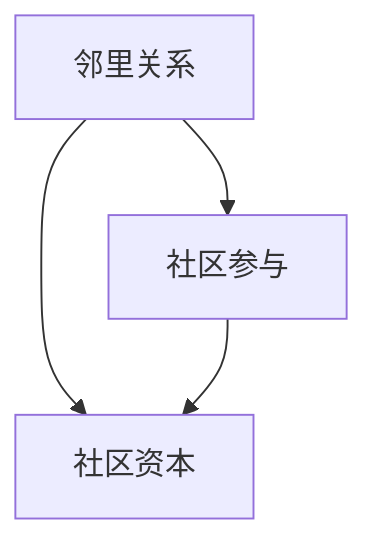

                 

## 引言

### 1.1 城市化进程中的社区重建背景

随着全球城市化进程的加速，城市人口不断增长，城市面貌日新月异。然而，这一进程中，社区重建问题逐渐凸显，特别是在如何恢复失落的邻里关系方面。城市化进程带来了土地开发、基础设施建设、人口流动等一系列变化，使得原本紧密的邻里关系逐渐变得疏离。社区重建成为了当务之急，其核心在于恢复和增强社区成员之间的联系和互动，重建一种更加和谐、亲密的邻里关系。

城市化进程对邻里关系的影响主要体现在以下几个方面：

1. **人口密集化**：城市人口快速增长，导致社区人口密度增加，邻里关系变得复杂，人与人之间的互动机会减少。
2. **居住流动性**：由于工作、学习等原因，居民频繁迁移，使得社区成员之间的稳定性降低，难以形成深厚的邻里关系。
3. **社会分化**：城市化进程中，社会阶层和利益的分化加剧，不同社会群体之间的互动减少，社区内部分裂现象增多。

### 1.1.1 城市化进程与社区重建的必要性

城市化进程不可避免地导致了社区结构的改变，这种改变使得传统的邻里关系面临巨大挑战。社区重建的必要性主要体现在以下几个方面：

1. **社会凝聚力的重建**：社区是人们居住、生活和交往的基本单位，社区重建有助于增强社会凝聚力，提高居民的幸福感和归属感。
2. **公共资源的优化**：通过社区重建，可以更好地规划和利用公共资源，提高社区的服务质量，满足居民的生活需求。
3. **社会治理的改进**：社区重建有助于改善社区治理结构，提高社区管理水平，增强社区的自主性和自治能力。

### 1.1.2 社区重建的定义与意义

社区重建，指的是在城市化进程中，通过一系列策略和方法，对社区结构和关系进行调整和优化，以恢复和增强社区成员之间的互动和联系。其意义在于：

1. **恢复邻里关系**：通过社区重建，可以恢复传统邻里关系的密切性，增强居民的社交互动，提高社区的凝聚力。
2. **促进社区参与**：社区重建鼓励居民积极参与社区事务，提高居民的参与感和责任感，促进社区发展的可持续性。
3. **提升社区文化**：社区重建有助于传承和发扬社区文化，增强居民的文化认同感，促进社区文化的多样性和繁荣。

### 1.1.3 城市化进程对邻里关系的影响

城市化进程对邻里关系的影响是深远而复杂的。首先，人口密集化导致邻里关系变得复杂，人与人之间的互动机会减少。其次，居住流动性增加使得社区成员之间的稳定性降低，难以形成深厚的邻里关系。此外，社会分化的加剧使得不同社会群体之间的互动减少，社区内部分裂现象增多。因此，社区重建成为了恢复和增强邻里关系的必要手段。

### 1.2 核心概念与联系

在探讨社区重建之前，有必要明确几个核心概念，并分析它们之间的联系。

#### 1.2.1 城市化与社区重建的关系

城市化是社区重建的背景和基础，而社区重建是城市化进程中的一个重要环节。城市化进程带来了社区结构的改变，社区重建则旨在通过调整和优化社区结构和关系，恢复和增强邻里关系，促进社区的可持续发展。

#### 1.2.2 社区重建的核心概念

社区重建的核心概念包括邻里关系、社区参与、社区资本等。邻里关系是社区重建的基础，社区参与是社区重建的推动力，社区资本是社区重建的重要资源。

#### 1.2.3 社区重建的属性特征对比

社区重建具有以下属性特征：

1. **动态性**：社区重建是一个动态的过程，需要不断调整和优化。
2. **多样性**：社区重建需要考虑不同社区的特点和需求，采取多样化的策略和方法。
3. **可持续性**：社区重建的目标是建立可持续发展的社区，需要长期投入和努力。

### 1.3 社区重建的边界与外延

社区重建的边界在于社区的地理范围和社会结构，其外延则涉及到社区成员之间的互动和关系。社区重建不仅局限于物理空间的改变，更强调社会关系的重建。

#### 1.3.1 社区重建的边界

社区重建的边界通常由社区的地理范围和社会结构决定。地理范围包括社区的具体位置和覆盖范围，社会结构包括社区的人口构成和社会组织形式。

#### 1.3.2 社区重建的外延

社区重建的外延包括以下几个方面：

1. **邻里关系的重建**：通过促进社区成员之间的互动和联系，恢复传统的邻里关系。
2. **社区参与的增强**：鼓励居民参与社区事务，提高居民的参与度和责任感。
3. **社区资本的积累**：通过多种方式积累社区资本，包括物质资本、人力资本、社会资本等。

#### 1.3.3 社区重建的领域模型ER图

为了更好地理解社区重建的领域模型，可以使用ER图来表示。ER图（Entity-Relationship Diagram）是一种用于描述实体及其之间关系的图形化工具。

以下是一个简化的社区重建领域模型ER图：

```mermaid
erDiagram
    User ||--|{ Neighborhood } : lives_in
    User ||--|{ Community } : belongs_to
    Neighborhood ||--|{ Community } : located_in
    Community ||--|{ Organization } : managed_by
    Organization ||--|{ Project } : runs
    Project ||--|{ Resource } : uses
    Resource ||--|{ Capital } : categorized_as
```

在这个ER图中，实体包括用户（User）、邻里（Neighborhood）、社区（Community）、组织（Organization）、项目（Project）、资源（Resource）和资本（Capital）。关系包括居住（lives_in）、属于（belongs_to）、位于（located_in）、管理（managed_by）、运行（runs）、使用（uses）和分类（categorized_as）。

### 1.4 本书结构安排与内容概述

本书将分为两个主要部分，第一部分介绍社区重建的背景、核心概念和理论基础，第二部分详细探讨社区重建的策略与方法、评估与监测以及面临的挑战与未来展望。

#### 1.4.1 本书结构安排

第一部分：引言与背景介绍
- 第1章：城市化进程中的社区重建背景

第二部分：社区重建的理论基础与实践方法
- 第2章：社区重建的理论基础概述
- 第3章：社区重建的核心概念
- 第4章：社区重建的影响因素
- 第5章：社区重建的策略与方法
- 第6章：社区重建的评估与监测
- 第7章：社区重建的挑战与应对
- 第8章：小结与展望

#### 1.4.2 各章节内容概述

第1章：介绍城市化进程中社区重建的背景，包括社区重建的必要性、定义与意义，以及城市化进程对邻里关系的影响。

第2章：概述社区重建的理论基础，包括理论框架、来源和发展，以及与相关理论的联系。

第3章：探讨社区重建的核心概念，如邻里关系、社区参与和社区资本，并通过属性特征对比表和ER图来阐述这些概念。

第4章：分析社区重建的影响因素，包括社区环境因素、社区人口因素和社区文化因素，并讨论它们对社区重建的影响。

第5章：详细讨论社区重建的策略与方法，包括总体策略、具体方法和实践案例。

第6章：介绍社区重建的评估与监测，包括评估指标、评估方法和监测体系，以及如何通过数据分析和反馈来优化社区重建过程。

第7章：探讨社区重建面临的挑战，包括社区参与的挑战、资源分配的挑战和治理结构的挑战，并提出应对策略和未来展望。

第8章：总结社区重建的意义、成果和不足，并提出改进方向和拓展阅读建议。

### 1.5 本章小结

本章介绍了城市化进程中社区重建的背景、必要性、定义与意义，以及城市化进程对邻里关系的影响。同时，明确了社区重建的核心概念与联系，并阐述了社区重建的边界与外延。通过ER图展示了社区重建的领域模型，为后续章节的理论探讨和实践分析奠定了基础。本章内容为读者提供了一个全面的概述，为深入探讨社区重建提供了起点。

---

# 城市化进程中的社区重建：恢复失落的邻里关系

> 关键词：城市化、社区重建、邻里关系、社区参与、社区资本

> 摘要：本文围绕城市化进程中的社区重建问题展开讨论，分析了城市化对邻里关系的影响，阐述了社区重建的必要性、定义与意义。通过对核心概念的详细解释和属性特征对比，本文明确了社区重建的边界与外延。此外，本文还介绍了社区重建的理论基础，探讨了影响因素、策略与方法，以及评估与监测体系。最后，本文提出了社区重建面临的挑战与未来展望，为城市社区的发展提供了有益的思考。

## 第一部分：社区重建的理论基础

### 2.1 社区重建的理论基础概述

社区重建的理论基础是多方面的，涵盖了社会学、人类学、城市规划学等多个学科领域。社区重建不仅仅是物理空间的改造，更涉及到社会关系的重构和文化氛围的营造。以下将从社区重建的理论框架、来源和发展三个方面进行概述。

#### 2.1.1 社区重建的理论框架

社区重建的理论框架主要包括以下几个方面：

1. **社会网络理论**：社会网络理论关注社区成员之间的互动关系，强调通过加强社会联系来恢复和增强社区的凝聚力。这一理论认为，社会网络是社区成员互动的载体，通过建立和加强社会网络，可以促进社区成员之间的相互信任和支持，提高社区的稳定性。

2. **社会资本理论**：社会资本理论认为，社会资本是社区发展的关键资源，包括信任、规范和网络等。社会资本的存在可以促进社区成员之间的合作和互动，提高社区的效率和可持续性。社区重建的目标之一就是通过积累社会资本来推动社区发展。

3. **社会参与理论**：社会参与理论强调居民参与社区事务的重要性。居民参与不仅能够提高他们的参与感和责任感，还能够促进社区决策的民主化和科学化。通过社会参与，社区成员可以共同面对社区问题，共同制定解决方案，从而增强社区的凝聚力和自治能力。

4. **社区发展理论**：社区发展理论关注社区的整体发展，包括经济、社会、文化等各个方面。社区发展理论强调社区的自主性和可持续性，认为社区应该通过自我管理和自我发展来应对外部挑战，提高社区的整体福祉。

#### 2.1.2 社区重建的理论来源

社区重建的理论来源可以追溯到多个学科领域，其中最为重要的是社会学和人类学。

1. **社会学**：社会学家通过研究城市化进程中的社区问题，提出了许多关于社区重建的理论。例如，艾森斯塔特的“社区重建理论”强调社区在社会结构中的重要地位，认为社区重建是解决城市化进程带来的社会问题的重要途径。

2. **人类学**：人类学家通过对不同文化背景下社区的观察和研究，提出了关于社区重建的文化理论和实践。例如，涂尔干的“社会团结理论”认为，社区重建需要通过建立共同的文化价值观和信仰来增强社区的凝聚力。

#### 2.1.3 社区重建的理论发展

社区重建的理论发展经历了几个重要阶段：

1. **传统社区重建理论**：早期社区重建理论主要关注社区的物质基础设施建设和物质资源的分配，强调通过改善社区环境来提升居民的生活质量。

2. **现代社区重建理论**：随着社会的发展和人们对社区认识的深化，现代社区重建理论开始关注社区的社会关系和文化氛围。这一阶段的社区重建理论强调通过社会参与、社会资本积累和文化传承来推动社区发展。

3. **后现代社区重建理论**：后现代社区重建理论关注社区的多维度发展，强调社区在全球化背景下的角色和责任。这一阶段的社区重建理论强调社区的多元性、包容性和可持续性，认为社区重建需要综合考虑经济、社会、文化和环境等多个方面。

### 2.2 社区重建的核心概念

社区重建的核心概念是理解和实施社区重建的基础。以下将详细介绍邻里关系、社区参与和社区资本等核心概念，并通过属性特征对比表和ER图来阐述这些概念。

#### 2.2.1 邻里关系的概念

邻里关系是社区重建的基础，是社区成员之间相互联系和互动的方式。邻里关系不仅包括日常生活中的相互帮助和关心，还涉及到社区成员之间的信任、尊重和合作。

**属性特征对比表：**

| 属性特征 | 邻里关系1 | 邻里关系2 |
| :----: | :--------: | :--------: |
| 信任度 | 较高 | 较低 |
| 互动频率 | 较高 | 较低 |
| 社交深度 | 较深 | 较浅 |
| 社交广度 | 较广 | 较窄 |

**ER图：**

```mermaid
erDiagram
    Person1 ||--|{ NeighborhoodRelation } : has
    Person1 ||--|{ Person2 } : is_related_to
    Person2 ||--|{ NeighborhoodRelation } : has
```

在这个ER图中，实体包括人（Person1、Person2）和邻里关系（NeighborhoodRelation）。关系包括拥有（has）和相互关系（is_related_to）。

#### 2.2.2 社区参与的概念

社区参与是社区重建的重要推动力，是居民通过参与社区事务来影响社区发展的过程。社区参与不仅能够提高居民的参与感和责任感，还能够促进社区的民主化和可持续发展。

**属性特征对比表：**

| 属性特征 | 社区参与1 | 社区参与2 |
| :----: | :--------: | :--------: |
| 参与度 | 较高 | 较低 |
| 参与形式 | 多样化 | 单一化 |
| 参与效果 | 明显 | 微弱 |
| 参与满意度 | 较高 | 较低 |

**ER图：**

```mermaid
erDiagram
    CommunityMember ||--|{ CommunityParticipation } : participates_in
    CommunityMember ||--|{ CommunityProject } : contributes_to
    CommunityProject ||--|{ CommunityParticipation } : includes
```

在这个ER图中，实体包括社区成员（CommunityMember）和社区参与（CommunityParticipation）。关系包括参与（participates_in）和贡献（contributes_to）。

#### 2.2.3 社区资本的概念

社区资本是社区重建的重要资源，是社区成员通过相互联系和互动所积累的资产。社区资本包括物质资本、人力资本和社会资本，是社区发展的重要基础。

**属性特征对比表：**

| 属性特征 | 社区资本1 | 社区资本2 |
| :----: | :--------: | :--------: |
| 物质资本 | 较高 | 较低 |
| 人力资本 | 较高 | 较低 |
| 社会资本 | 较高 | 较低 |

**ER图：**

```mermaid
erDiagram
    Community ||--|{ PhysicalCapital } : has
    Community ||--|{ HumanCapital } : has
    Community ||--|{ SocialCapital } : has
```

在这个ER图中，实体包括社区（Community）和三种社区资本（PhysicalCapital、HumanCapital、SocialCapital）。关系包括拥有（has）。

### 2.3 社区重建的影响因素

社区重建的影响因素是复杂多样的，涉及到社区环境、社区人口和社区文化等多个方面。以下将分别讨论这些因素，并分析它们对社区重建的影响。

#### 2.3.1 社区环境因素

社区环境因素是影响社区重建的重要因素之一，包括物理环境和社会环境。

1. **物理环境**：物理环境包括社区的地理位置、建筑风格、公共设施等。良好的物理环境能够为社区重建提供必要的物质基础，促进社区成员的互动和参与。

2. **社会环境**：社会环境包括社区的社会氛围、邻里关系、社区管理等。积极的社会环境能够增强社区成员的归属感和凝聚力，促进社区重建的顺利进行。

#### 2.3.2 社区人口因素

社区人口因素也是影响社区重建的重要因素，包括人口数量、人口结构和人口流动性。

1. **人口数量**：人口数量的多少直接影响社区的规模和密度，从而影响社区的互动和参与。

2. **人口结构**：人口结构包括年龄结构、性别结构、职业结构等。不同的人口结构会对社区重建产生不同的影响，需要根据实际情况进行针对性策略。

3. **人口流动性**：人口流动性高会导致社区成员之间的稳定性降低，不利于社区重建。因此，如何降低人口流动性，提高社区成员的稳定性是社区重建需要关注的问题。

#### 2.3.3 社区文化因素

社区文化因素是社区重建的重要支撑，包括社区价值观、文化传统、社区氛围等。

1. **社区价值观**：社区价值观是社区成员共同遵循的价值观和行为准则，对社区重建具有指导作用。

2. **文化传统**：文化传统是社区历史和文化的积淀，对社区重建具有深远影响。

3. **社区氛围**：社区氛围是社区成员之间的互动方式和关系模式，对社区重建具有直接影响。

### 2.4 社区重建的策略与方法

社区重建需要采取一系列策略和方法，以实现社区重建的目标。以下将介绍社区重建的总体策略、具体方法和实践案例。

#### 2.4.1 社区重建的总体策略

社区重建的总体策略包括以下几个方面：

1. **提高社区参与度**：通过多种方式鼓励居民参与社区事务，提高居民的参与感和责任感。

2. **积累社区资本**：通过多种方式积累物质资本、人力资本和社会资本，提高社区的发展能力。

3. **优化社区环境**：通过改善物理环境和社会环境，为社区重建提供必要的物质基础。

4. **传承社区文化**：通过传承和发扬社区文化，增强社区成员的归属感和凝聚力。

#### 2.4.2 社区重建的具体方法

社区重建的具体方法包括以下几个方面：

1. **组织社区活动**：通过组织各种形式的社区活动，促进社区成员之间的互动和交流，提高社区的凝聚力。

2. **建立社区组织**：通过建立社区组织，为社区成员提供参与社区事务的平台，增强社区的自治能力。

3. **开展社区教育**：通过开展社区教育，提高社区成员的素质和能力，为社区重建提供人才支持。

4. **提供社区服务**：通过提供各种形式的社区服务，满足社区成员的需求，提高社区的生活质量。

#### 2.4.3 社区重建的实践案例

以下是一些社区重建的实践案例：

1. **城市更新项目**：通过城市更新项目，改善社区的物理环境，提高社区的生活质量。

2. **社区参与计划**：通过社区参与计划，鼓励居民参与社区事务，提高社区的自治能力。

3. **社区文化活动**：通过社区文化活动，传承和发扬社区文化，增强社区成员的归属感和凝聚力。

### 2.5 社区重建的评估与监测

社区重建的评估与监测是确保社区重建成效的重要环节。以下将介绍社区重建的评估指标、评估方法和监测体系。

#### 2.5.1 社区重建的评估指标

社区重建的评估指标包括以下几个方面：

1. **社区参与度**：衡量社区成员参与社区事务的程度和积极性。

2. **社区凝聚力**：衡量社区成员之间的互动和协作程度。

3. **社区满意度**：衡量社区成员对社区重建成效的满意程度。

4. **社区发展能力**：衡量社区的发展潜力和发展能力。

#### 2.5.2 社区重建的评估方法

社区重建的评估方法包括以下几个方面：

1. **问卷调查**：通过问卷调查，了解社区成员对社区重建的看法和建议。

2. **访谈调研**：通过访谈调研，深入了解社区成员的体验和感受。

3. **数据监测**：通过数据监测，分析社区重建过程中的各项指标变化。

#### 2.5.3 社区重建的监测体系

社区重建的监测体系包括以下几个方面：

1. **监测指标体系**：建立完善的监测指标体系，确保监测的全面性和准确性。

2. **监测方法体系**：制定科学的监测方法，确保监测过程的规范和有效。

3. **监测数据管理系统**：建立监测数据管理系统，确保监测数据的及时性和完整性。

### 2.6 社区重建的挑战与应对

社区重建过程中面临着一系列挑战，以下将讨论这些挑战，并提出相应的应对策略。

#### 2.6.1 社区重建的挑战

1. **资源不足**：社区重建需要大量的人力、物力和财力支持，资源不足是社区重建面临的主要挑战之一。

2. **社区参与度低**：社区成员的参与度低，影响社区重建的顺利进行。

3. **治理结构不完善**：社区治理结构不完善，影响社区重建的成效。

#### 2.6.2 应对策略

1. **优化资源分配**：通过优化资源分配，确保社区重建所需的资源得到充分保障。

2. **提高社区参与度**：通过多种方式提高社区成员的参与度，增强社区的自治能力。

3. **完善治理结构**：通过完善治理结构，提高社区治理的效率和效果。

### 2.7 社区重建的未来展望

随着城市化进程的深入推进，社区重建将成为城市发展的关键环节。以下将讨论社区重建的未来发展前景，并提出一些建议。

#### 2.7.1 未来发展前景

1. **社区重建将更加注重多元性**：随着社会的多元化发展，社区重建将更加注重多元性，尊重和包容不同文化、不同群体的需求。

2. **社区重建将更加注重可持续性**：社区重建将更加注重可持续性，通过绿色建筑、节能减排等方式，实现社区环境的可持续发展。

3. **社区重建将更加注重智能化**：随着信息技术的发展，社区重建将更加注重智能化，通过大数据、人工智能等技术手段，提高社区管理和服务水平。

#### 2.7.2 建议与展望

1. **加强政策支持**：政府应加强对社区重建的政策支持，提供财政、税收等方面的优惠政策，推动社区重建的顺利进行。

2. **推动社区自治**：通过推动社区自治，提高社区成员的参与度和自治能力，增强社区的凝聚力和发展潜力。

3. **促进社区合作**：通过促进社区合作，加强社区与其他领域、其他社区的合作，实现资源共享和优势互补，提高社区的整体发展水平。

### 2.8 小结

本章介绍了社区重建的理论基础，包括理论框架、来源和发展。通过详细解释邻里关系、社区参与和社区资本等核心概念，并分析社区重建的影响因素、策略与方法，本章为后续章节的理论探讨和实践分析奠定了基础。同时，本章还讨论了社区重建的评估与监测、挑战与应对以及未来发展展望，为社区重建提供了有益的思考。

---

# 社区重建的核心概念

在社区重建过程中，理解并运用核心概念是至关重要的。本文将深入探讨邻里关系、社区参与和社区资本三个核心概念，通过详细解释、属性特征对比表和ER图，帮助读者全面了解这些概念，并理解它们在社区重建中的重要作用。

### 3.1 邻里关系的概念

邻里关系是社区重建的基础，它指的是社区成员之间的相互联系和互动。邻里关系不仅仅是一种社交活动，更是社区凝聚力和稳定性的源泉。

#### 3.1.1 邻里关系的定义

邻里关系是指居住在同一个社区或邻近区域的人们之间建立的关系。这种关系可以是直接的，如邻居之间的日常互动，也可以是间接的，如社区成员对社区事务的关注和支持。

#### 3.1.2 邻里关系的属性特征

邻里关系的属性特征包括以下几个方面：

1. **信任度**：邻里关系中的信任度是关键，信任度高有助于建立稳定的社区关系。
2. **互动频率**：邻里之间的互动频率直接影响邻里关系的质量，频繁的互动有助于增进了解和信任。
3. **社交深度**：社交深度是指邻里关系的紧密程度，深层次的社交关系能够增强社区的凝聚力。
4. **社交广度**：社交广度是指邻里关系的范围，广泛的社交网络有助于社区成员之间的互助和合作。

**属性特征对比表：**

| 属性特征 | 邻里关系1 | 邻里关系2 |
| :----: | :--------: | :--------: |
| 信任度 | 较高 | 较低 |
| 互动频率 | 较高 | 较低 |
| 社交深度 | 较深 | 较浅 |
| 社交广度 | 较广 | 较窄 |

#### 3.1.3 邻里关系的ER图

以下是邻里关系的简化ER图：

```mermaid
erDiagram
    Neighbor1 ||--|{ NeighborhoodRelation } : has
    Neighbor1 ||--|{ Neighbor2 } : is_related_to
    Neighbor2 ||--|{ NeighborhoodRelation } : has
```

在这个ER图中，实体包括邻居（Neighbor1、Neighbor2）和邻里关系（NeighborhoodRelation）。关系包括拥有（has）和相互关系（is_related_to）。

### 3.2 社区参与的概念

社区参与是社区重建的推动力，它指的是社区成员积极参与社区事务的过程。社区参与不仅能够提高社区成员的参与感和责任感，还能够促进社区的民主化和可持续发展。

#### 3.2.1 社区参与的定义

社区参与是指社区成员在社区事务中的积极参与，包括参与决策、管理、服务和活动等方面。社区参与的目标是通过居民的努力，共同解决社区问题，改善社区环境，提高社区生活质量。

#### 3.2.2 社区参与的属性特征

社区参与的属性特征包括以下几个方面：

1. **参与度**：参与度是衡量社区成员参与程度的重要指标，高参与度有助于增强社区的凝聚力。
2. **参与形式**：参与形式包括志愿服务、社区会议、社区活动等多种方式，多样化的参与形式能够满足不同社区成员的需求。
3. **参与效果**：参与效果是指社区参与对社区发展的影响，有效的社区参与能够促进社区问题的解决和社区发展。
4. **参与满意度**：参与满意度是社区成员对参与活动的满意程度，高满意度有助于提高社区成员的参与热情。

**属性特征对比表：**

| 属性特征 | 社区参与1 | 社区参与2 |
| :----: | :--------: | :--------: |
| 参与度 | 较高 | 较低 |
| 参与形式 | 多样化 | 单一化 |
| 参与效果 | 明显 | 微弱 |
| 参与满意度 | 较高 | 较低 |

#### 3.2.3 社区参与的ER图

以下是社区参与的简化ER图：

```mermaid
erDiagram
    CommunityMember ||--|{ CommunityParticipation } : participates_in
    CommunityMember ||--|{ CommunityProject } : contributes_to
    CommunityProject ||--|{ CommunityParticipation } : includes
```

在这个ER图中，实体包括社区成员（CommunityMember）和社区参与（CommunityParticipation）。关系包括参与（participates_in）和贡献（contributes_to）。

### 3.3 社区资本的概念

社区资本是社区重建的重要资源，它指的是社区成员通过相互联系和互动所积累的资产。社区资本包括物质资本、人力资本和社会资本，是社区发展的重要基础。

#### 3.3.1 社区资本的定义

社区资本是指社区成员在社区内积累的可以用于社区发展的各种资源，包括物质财富、人力技能、社会网络等。社区资本是社区成员共同拥有的财富，能够促进社区的发展和提高社区成员的生活质量。

#### 3.3.2 社区资本的属性特征

社区资本的属性特征包括以下几个方面：

1. **物质资本**：物质资本是指社区内的物质财富，包括房产、设备、资金等。物质资本是社区重建的基础，能够为社区提供必要的物质支持。
2. **人力资本**：人力资本是指社区成员的技能和知识，包括教育水平、工作经验等。人力资本是社区发展的动力，能够推动社区的进步和创新。
3. **社会资本**：社会资本是指社区成员之间的信任、网络和规范等。社会资本是社区凝聚力的源泉，能够促进社区成员的协作和互助。

**属性特征对比表：**

| 属性特征 | 社区资本1 | 社区资本2 |
| :----: | :--------: | :--------: |
| 物质资本 | 较高 | 较低 |
| 人力资本 | 较高 | 较低 |
| 社会资本 | 较高 | 较低 |

#### 3.3.3 社区资本的ER图

以下是社区资本的简化ER图：

```mermaid
erDiagram
    Community ||--|{ PhysicalCapital } : has
    Community ||--|{ HumanCapital } : has
    Community ||--|{ SocialCapital } : has
```

在这个ER图中，实体包括社区（Community）和三种社区资本（PhysicalCapital、HumanCapital、SocialCapital）。关系包括拥有（has）。

### 3.4 社区重建的核心概念联系

社区重建的核心概念包括邻里关系、社区参与和社区资本，这些概念相互关联，共同构成了社区重建的理论框架。

1. **邻里关系**是社区重建的基础，是社区成员之间的互动和联系。通过加强邻里关系，可以增强社区的凝聚力和稳定性。
2. **社区参与**是社区重建的推动力，通过居民参与社区事务，可以促进社区的发展和进步。
3. **社区资本**是社区重建的重要资源，通过积累物质资本、人力资本和社会资本，可以为社区重建提供必要的支持。

这些核心概念的联系如图所示：



在这个图中，邻里关系、社区参与和社区资本相互影响，共同推动社区重建的进程。

### 3.5 本章小结

本章详细探讨了社区重建的核心概念，包括邻里关系、社区参与和社区资本。通过定义、属性特征对比表和ER图，本章帮助读者深入理解这些概念，并认识到它们在社区重建中的重要性。这些核心概念相互联系，共同构成了社区重建的理论基础，为后续章节的深入讨论提供了坚实的基础。通过运用这些核心概念，社区重建可以更加有针对性地进行，从而实现社区的发展和进步。

---

# 社区重建的影响因素

在社区重建过程中，影响因素的识别和解析是至关重要的。这些因素不仅决定了社区重建的难度和方向，也直接影响着重建的成效。本文将深入分析社区重建中的三大关键影响因素：社区环境因素、社区人口因素和社区文化因素，并探讨它们对社区重建的影响。

### 4.1 社区环境因素

社区环境因素是社区重建的重要基础，它涵盖了物理环境和社会环境两个方面。良好的社区环境有助于提升居民的生活质量，增强社区的凝聚力和活力。

#### 4.1.1 物理环境

物理环境是指社区的地理位置、建筑风格、基础设施等物质条件。以下是物理环境对社区重建的具体影响：

1. **地理位置**：地理位置直接影响社区的可进入性和便利性。一个位于交通便利、资源丰富地区的社区更容易吸引居民，有利于社区的发展和重建。
2. **建筑风格**：建筑风格不仅影响社区的美观，还影响居民的生活质量和心理健康。现代化的建筑风格和良好的建筑设计能够提升社区的整体形象和居住舒适度。
3. **基础设施**：基础设施包括交通、供水、供电、通讯等。完善的基础设施能够提高居民的生活质量，为社区重建提供必要的保障。

#### 4.1.2 社会环境

社会环境是指社区的社会氛围、邻里关系、社区管理等非物质条件。以下是社会环境对社区重建的具体影响：

1. **社会氛围**：积极的社会氛围能够增强社区的凝聚力，促进居民的互动和合作。例如，社区内鼓励互助和共享的文化氛围有助于社区重建的顺利进行。
2. **邻里关系**：邻里关系是社区重建的核心。紧密的邻里关系能够促进居民的社交互动，增强社区的稳定性和归属感。
3. **社区管理**：社区管理是社区重建的重要保障。有效的社区管理能够提高社区的服务质量和居民的生活满意度，为社区重建提供坚实的支持。

#### 4.1.3 物理环境与社会环境的关联

物理环境和社会环境是相互关联、相互影响的。例如，良好的物理环境能够促进积极的社会氛围，而积极的社会氛围又能进一步改善物理环境。两者共同作用于社区重建，形成良性循环。

### 4.2 社区人口因素

社区人口因素是社区重建的重要因素之一，它涵盖了人口数量、人口结构和人口流动性等方面。以下是人口因素对社区重建的具体影响：

#### 4.2.1 人口数量

1. **人口数量**：人口数量直接影响社区的规模和密度。一个规模适中、人口密度适宜的社区有利于居民的互动和参与，有利于社区重建的顺利进行。
2. **人口密度**：人口密度过高会导致社区资源紧张，居民之间的互动减少，不利于社区重建。而人口密度过低则可能导致社区活力不足，影响社区的发展。

#### 4.2.2 人口结构

1. **人口结构**：人口结构包括年龄结构、性别结构、职业结构等。不同的人口结构对社区重建的需求和效果有着不同的影响。例如，年轻人口的增加有利于社区活力的提升，而老年人口的增加则需要更多的养老服务。
2. **家庭结构**：家庭结构的变化也对社区重建产生影响。例如，单身人口和家庭人口的增加可能需要更多的社区服务和设施，如单身公寓和养老设施。

#### 4.2.3 人口流动性

1. **人口流动性**：人口流动性高会导致社区成员之间的稳定性降低，社区凝聚力减弱。而人口流动性低则有利于社区成员之间建立稳定的关系，有利于社区重建。
2. **移民**：移民是社区人口流动性的一种表现形式。移民的融入和融合对社区重建有着重要的影响。成功的移民融合能够增强社区的多元性和包容性，促进社区的发展。

### 4.3 社区文化因素

社区文化因素是社区重建的精神支柱，它涵盖了社区价值观、文化传统和社区氛围等方面。以下是文化因素对社区重建的具体影响：

#### 4.3.1 社区价值观

1. **社区价值观**：社区价值观是社区成员共同遵循的道德和行为准则。积极的社区价值观能够增强社区的凝聚力和认同感，有利于社区重建。
2. **社区认同**：社区认同是社区成员对自己所在社区的认同和归属感。高度认同的社区能够更好地支持和参与社区重建，提高重建的成效。

#### 4.3.2 文化传统

1. **文化传统**：文化传统是社区历史和文化的积淀，是社区成员共同的记忆和认同。传承和发扬社区文化传统有助于增强社区的凝聚力，促进社区重建。
2. **文化多样性**：文化多样性是社区文化的重要组成部分。多元的文化传统有助于社区的繁荣和进步，能够为社区重建提供丰富的资源和灵感。

#### 4.3.3 社区氛围

1. **社区氛围**：社区氛围是社区成员之间的互动方式和关系模式。积极的社区氛围能够促进社区成员的互动和合作，有利于社区重建。
2. **社区参与**：社区参与是社区氛围的重要体现。高水平的社区参与能够促进社区成员的参与感和责任感，有利于社区重建的顺利进行。

### 4.4 社区环境、人口与文化因素的相互作用

社区环境、人口和文化因素是相互影响、相互作用的。例如，良好的物理环境能够促进社区文化的繁荣，而繁荣的社区文化又能进一步改善物理环境。同时，社区人口的结构和流动性也会影响社区环境和文化的发展。

#### 4.4.1 物理环境与文化传统的关系

物理环境和文化传统之间存在紧密的联系。良好的物理环境有助于传承和发扬社区文化，而丰富的文化传统又能进一步改善物理环境。例如，一个历史悠久、建筑风格独特的社区能够吸引更多的居民，促进社区的发展和繁荣。

#### 4.4.2 人口结构与社会氛围的关系

人口结构和社会氛围之间也存在相互作用。年轻人口的增加能够提升社区的氛围和活力，而老年人口的增加则需要更多关注和支持。一个多元、包容的社会氛围能够吸引不同背景的居民，促进社区的发展和进步。

### 4.5 本章小结

本章深入分析了社区重建的影响因素，包括社区环境因素、社区人口因素和社区文化因素。通过详细探讨这些因素的具体影响和相互作用，本章为理解社区重建的复杂性提供了新的视角。社区重建不仅仅是物质层面的改造，更是社会关系和文化氛围的重塑。只有综合考虑这些因素，才能实现社区重建的目标，为居民创造一个和谐、宜居的社区环境。

---

# 社区重建的策略与方法

社区重建是一项复杂而系统的工程，需要制定一系列的策略与方法，以实现社区的整体发展和提升居民的生活质量。以下将详细介绍社区重建的总体策略、具体方法和实践案例，以帮助读者更好地理解和应用这些策略与方法。

### 5.1 社区重建的总体策略

社区重建的总体策略应当涵盖以下几个方面，以确保重建工作能够有序、高效地进行：

#### 5.1.1 提高社区参与度

提高社区参与度是社区重建的重要策略之一。通过鼓励居民参与社区事务，可以增强居民的归属感和责任感，促进社区的发展和进步。具体措施包括：

1. **组织社区会议**：定期组织社区会议，让居民参与讨论和决策社区重要事项，提高居民的参与感和影响力。
2. **开展社区活动**：组织丰富多彩的社区活动，如节日庆典、健身活动、文化展览等，吸引居民参与，增强社区凝聚力。
3. **设立居民代表**：设立居民代表或社区委员会，让居民代表参与社区管理和决策，提高社区管理的民主性和透明度。

#### 5.1.2 积累社区资本

积累社区资本是社区重建的重要基础。社区资本包括物质资本、人力资本和社会资本，是社区发展的重要资源。具体措施包括：

1. **筹集资金**：通过政府资助、社会捐赠、居民集资等方式筹集资金，用于社区建设和改善。
2. **培养人才**：通过社区教育和培训，提高居民的教育水平和职业技能，增强社区的人力资本。
3. **建立社区组织**：建立社区组织，如志愿者团体、合作社等，增强社区的凝聚力和社会资本。

#### 5.1.3 优化社区环境

优化社区环境是提升居民生活质量的关键。通过改善物理环境和社会环境，可以为社区重建提供必要的物质基础。具体措施包括：

1. **基础设施建设**：加大对基础设施的投入，改善交通、供水、供电、通讯等基础设施，提高社区的生活便利性。
2. **环境保护**：加强环境保护，提高社区的绿化水平，减少环境污染，提高居民的生活质量。
3. **社区美化**：通过社区美化工程，改善社区的视觉环境，提升社区的整体形象。

#### 5.1.4 传承社区文化

传承社区文化是社区重建的重要任务之一。通过传承和发扬社区文化，可以增强社区成员的认同感和归属感，促进社区的可持续发展。具体措施包括：

1. **文化传承活动**：组织各种文化传承活动，如传统文化节、历史展览等，增强居民对社区文化的认同。
2. **社区文化设施**：建设社区文化中心、图书馆、文化活动室等文化设施，为居民提供文化活动的场所。
3. **文化教育**：通过文化教育，提高居民对社区文化的认识和了解，促进社区文化的传承和发展。

### 5.2 社区重建的具体方法

在实施社区重建的过程中，可以采用以下具体方法，以实现社区重建的目标：

#### 5.2.1 组织社区活动

组织社区活动是增强社区成员互动和参与的重要手段。通过多样化的社区活动，可以促进社区成员之间的交流和合作，提升社区的凝聚力。具体方法包括：

1. **节日庆典**：组织节日庆典，如春节、中秋节等，增强居民对节日的庆祝和参与感。
2. **社区运动会**：举办社区运动会，促进居民的身体锻炼和健康生活方式。
3. **文化活动**：组织文艺演出、书画展览、讲座等活动，丰富社区文化生活。

#### 5.2.2 建立社区组织

建立社区组织是提升社区管理水平和促进居民参与的重要途径。通过建立社区组织，可以形成有效的社区管理和运作机制。具体方法包括：

1. **社区委员会**：成立社区委员会，负责社区的管理和决策，代表居民利益。
2. **志愿者团体**：组建志愿者团体，提供社区服务，如社区清洁、慈善活动等。
3. **居民自治组织**：鼓励居民自治，建立居民自治组织，如居民自治委员会等，提高居民的自治能力和责任感。

#### 5.2.3 开展社区教育

开展社区教育是提高居民素质和促进社区发展的重要手段。通过社区教育，可以培养居民的技能和知识，增强社区的人力资本。具体方法包括：

1. **成人教育**：提供成人教育课程，如职业技能培训、计算机培训等，提高居民的教育水平和职业技能。
2. **儿童教育**：组织儿童教育项目，如儿童兴趣班、夏令营等，促进儿童的健康成长。
3. **终身学习**：建立终身学习体系，鼓励居民不断学习和进步，提升社区的整体素质。

#### 5.2.4 改善社区环境

改善社区环境是提高居民生活质量的重要措施。通过改善物理环境和社会环境，可以提升社区的整体形象和居民的生活舒适度。具体方法包括：

1. **基础设施建设**：加大对基础设施的投入，改善交通、供水、供电、通讯等基础设施，提高社区的生活便利性。
2. **环境保护**：加强环境保护，提高社区的绿化水平，减少环境污染，提高居民的生活质量。
3. **社区美化**：通过社区美化工程，改善社区的视觉环境，提升社区的整体形象。

### 5.3 社区重建的实践案例

以下是一些成功的社区重建实践案例，供读者参考：

#### 5.3.1 某城市老旧社区改造项目

某城市老旧社区通过实施社区重建项目，成功改善了社区环境，提升了居民生活质量。具体措施包括：

1. **物理环境改造**：对社区的道路、绿化、公共设施等进行改造，提高社区的整体形象。
2. **社区参与**：通过组织居民会议和社区活动，鼓励居民参与社区管理和决策，提高居民的参与度。
3. **社区教育**：开展社区教育项目，提供职业技能培训和文化活动，提升居民的素质和社区凝聚力。

#### 5.3.2 某农村社区发展项目

某农村社区通过实施社区重建项目，成功实现了社区的可持续发展。具体措施包括：

1. **经济发展**：通过发展社区特色产业，如生态农业、手工艺品等，提高社区的经济收入。
2. **社区参与**：通过建立社区合作社，鼓励居民参与社区经济活动，增强社区的凝聚力。
3. **环境保护**：加强环境保护，推广绿色农业和可再生能源，提高社区的可持续发展能力。

### 5.4 本章小结

本章详细介绍了社区重建的总体策略、具体方法和实践案例。通过这些策略与方法，社区重建可以有效地提升社区的整体发展水平，改善居民的生活质量。社区重建不仅仅是物质环境的改造，更是社会关系和文化氛围的重塑。只有综合考虑各种因素，采取合适的策略和方法，社区重建才能取得成功，为居民创造一个和谐、宜居的社区环境。

---

# 社区重建的评估与监测

社区重建的成效评估和监测是确保社区重建目标实现的重要环节。通过科学的评估方法和完善的监测体系，可以及时了解社区重建的进展和效果，为下一步的工作提供数据支持和决策依据。以下将介绍社区重建的评估指标、评估方法和监测体系。

### 6.1 社区重建的评估指标

社区重建的评估指标是衡量社区重建成效的重要工具。以下是一些常用的评估指标：

#### 6.1.1 社区参与度

社区参与度是衡量居民参与社区事务程度的指标。评估指标包括：

1. **参与率**：参与社区活动的居民占总居民数的比例。
2. **参与频率**：居民参与社区活动的次数。
3. **参与积极性**：居民参与社区活动的积极程度。

#### 6.1.2 社区满意度

社区满意度是衡量居民对社区重建成果的满意程度的指标。评估指标包括：

1. **总体满意度**：居民对社区重建的整体满意度。
2. **满意度变化**：居民对社区重建前后满意度的变化。
3. **满意度评价**：居民对社区服务的评价。

#### 6.1.3 社区发展能力

社区发展能力是衡量社区可持续发展能力的指标。评估指标包括：

1. **经济状况**：社区的经济状况，如就业率、收入水平等。
2. **社会状况**：社区的社会状况，如教育水平、医疗资源等。
3. **环境状况**：社区的环境状况，如空气质量、绿化率等。

#### 6.1.4 社区凝聚力

社区凝聚力是衡量社区成员之间互动和协作能力的指标。评估指标包括：

1. **互动频率**：社区成员之间的互动次数。
2. **互助合作**：社区成员之间的互助合作程度。
3. **社区认同**：居民对社区认同感和归属感。

### 6.2 社区重建的评估方法

社区重建的评估方法多种多样，以下介绍几种常用的评估方法：

#### 6.2.1 问卷调查

问卷调查是一种常用的评估方法，通过设计科学的问卷，收集居民对社区重建的反馈和意见。问卷调查的优点包括：

1. **覆盖面广**：可以覆盖到不同年龄、性别、职业的居民，获取全面的数据。
2. **数据可靠**：通过问卷收集的数据可以进行定量分析，提高评估的科学性。
3. **成本低**：问卷调查的成本相对较低，适合大规模评估。

#### 6.2.2 访谈调研

访谈调研是通过与居民进行面对面的交流，了解他们的需求和意见。访谈调研的优点包括：

1. **深入了解**：通过与居民的直接交流，可以深入了解居民的真实感受和需求。
2. **灵活性强**：可以根据实际情况调整访谈的内容和方式，提高评估的针对性。
3. **数据分析**：访谈调研的数据可以进行定性分析，提供更深入的见解。

#### 6.2.3 数据监测

数据监测是通过收集和分析社区相关的数据，评估社区重建的进展和效果。数据监测的优点包括：

1. **实时监测**：可以通过实时数据监测，及时了解社区重建的进展和效果。
2. **数据支持**：通过数据分析，可以为决策提供科学依据，提高决策的准确性。
3. **持续改进**：通过数据监测，可以及时发现问题和不足，进行持续改进。

### 6.3 社区重建的监测体系

社区重建的监测体系是确保评估工作有效进行的基础。以下介绍社区重建的监测体系：

#### 6.3.1 监测指标体系

监测指标体系是监测体系的核心，包括以下内容：

1. **指标设定**：根据社区重建的目标和需求，设定具体的监测指标。
2. **指标权重**：确定每个指标的权重，以反映指标的重要性。
3. **数据来源**：明确每个指标的数据来源，如问卷调查、统计数据等。

#### 6.3.2 监测方法体系

监测方法体系包括以下内容：

1. **数据收集**：通过问卷调查、访谈调研、数据监测等方式收集数据。
2. **数据分析**：对收集到的数据进行整理、分析和解释。
3. **反馈机制**：建立反馈机制，及时将评估结果反馈给相关部门和居民，为决策提供依据。

#### 6.3.3 监测数据管理系统

监测数据管理系统是监测体系的重要组成部分，包括以下内容：

1. **数据录入**：将监测数据录入到系统中，进行集中管理。
2. **数据分析**：通过系统对数据进行统计分析，生成评估报告。
3. **数据共享**：实现监测数据的共享，方便相关部门和居民查阅和使用。

### 6.4 社区重建的评估与监测实例

以下是一个社区重建的评估与监测实例：

#### 某社区重建项目

某社区在实施重建项目后，通过以下步骤进行评估与监测：

1. **指标设定**：根据社区重建的目标，设定了社区参与度、社区满意度、社区发展能力、社区凝聚力等四个方面的监测指标。
2. **数据收集**：通过问卷调查和访谈调研，收集了居民对社区重建的反馈和意见。
3. **数据分析**：对收集到的数据进行分析，评估了社区重建的成效。
4. **反馈机制**：将评估结果反馈给相关部门和居民，提出改进建议。

通过这个实例，可以看到评估与监测在社区重建中的重要作用。只有通过科学的评估和监测，才能确保社区重建目标的实现，为居民创造一个更加美好的生活环境。

### 6.5 本章小结

本章介绍了社区重建的评估与监测，包括评估指标、评估方法和监测体系。通过科学的评估和监测，可以及时了解社区重建的进展和效果，为下一步的工作提供数据支持和决策依据。社区重建的评估与监测是确保社区重建成效的重要手段，只有通过持续的科学评估和监测，才能不断提升社区的发展水平，为居民创造一个和谐、宜居的社区环境。

---

# 社区重建的挑战与应对

在社区重建过程中，面临着诸多挑战，这些挑战不仅影响社区重建的进度和质量，也可能导致重建目标无法实现。本文将深入探讨社区重建过程中可能遇到的挑战，并提出相应的应对策略，为社区重建提供有效的指导。

### 7.1 社区重建的挑战

#### 7.1.1 社区参与度低

社区参与度低是社区重建过程中普遍存在的问题。原因包括居民对社区事务的关注度不高、参与渠道不畅通、社区组织的动员能力不足等。社区参与度低直接影响社区重建的进展和成效。

**应对策略：**

1. **加强宣传和教育**：通过多种渠道宣传社区重建的重要性，提高居民对社区事务的关注度。组织社区教育活动，增强居民对社区重建的认识和理解。
2. **建立参与渠道**：建立便捷、多样化的参与渠道，如社区论坛、热线电话、线上投票等，让居民能够方便地参与社区事务。
3. **提高组织动员能力**：加强社区组织的建设，提高社区组织的动员能力，通过有效的组织和动员，激发居民的参与热情。

#### 7.1.2 资源不足

社区重建需要大量的人力、物力和财力支持，资源不足是社区重建面临的主要挑战之一。资源不足可能导致社区重建进度缓慢，甚至无法持续推进。

**应对策略：**

1. **多方筹措资源**：通过政府资助、社会捐赠、居民集资等多种渠道筹措资源，确保社区重建所需的资金、设备和人力得到充分保障。
2. **优化资源配置**：对现有资源进行合理分配和利用，提高资源的使用效率，确保资源能够最大限度地支持社区重建。
3. **引导居民参与**：鼓励居民参与社区重建，通过志愿者服务、社区合作等方式，让居民成为资源的一部分，共同推动社区重建。

#### 7.1.3 社区治理结构不完善

社区治理结构不完善是影响社区重建的重要因素。社区治理结构不完善可能导致社区决策缺乏透明度和民主性，影响社区重建的顺利进行。

**应对策略：**

1. **完善治理机制**：建立和完善社区治理机制，明确社区管理的职责和权限，提高社区治理的效率。
2. **提高治理能力**：加强社区治理人员的培训，提高他们的治理能力和管理水平，确保社区治理结构能够适应社区重建的需求。
3. **增强居民参与**：鼓励居民参与社区治理，通过居民代表制度、社区委员会等方式，增强居民的参与度和治理能力。

#### 7.1.4 社区文化差异

社区文化差异是社区重建过程中需要面对的挑战之一。社区成员来自不同背景，有着不同的文化传统和价值观念，这些差异可能影响社区重建的顺利进行。

**应对策略：**

1. **尊重多元文化**：在社区重建过程中，尊重和包容不同文化传统和价值观念，通过文化交流和互动，促进社区文化的融合。
2. **建立共同价值观**：通过社区教育和文化活动，建立社区成员共同遵循的价值观，增强社区的凝聚力和认同感。
3. **加强社区文化建设**：通过社区文化建设，传承和发扬社区的文化传统，增强社区的文化自信和归属感。

### 7.2 社区重建的应对策略

针对社区重建过程中面临的挑战，可以采取以下应对策略：

#### 7.2.1 提高社区参与度

1. **开展宣传教育**：通过多种形式的宣传教育，提高居民对社区重建的认识和理解，增强他们的参与意识。
2. **建立参与机制**：建立完善的社区参与机制，如居民代表制度、社区论坛等，让居民有更多的参与渠道和机会。
3. **激励参与**：通过表彰、奖励等方式激励居民的参与，提高他们的参与积极性和满意度。

#### 7.2.2 确保资源充足

1. **多方筹措资源**：通过政府、企业、社会组织等多渠道筹集资源，确保社区重建的资金、人力和物资需求。
2. **优化资源配置**：对现有资源进行合理规划和配置，提高资源的使用效率，确保资源能够最大限度地支持社区重建。
3. **引导居民参与**：鼓励居民通过志愿者服务、社区合作等方式参与社区重建，共同解决资源不足的问题。

#### 7.2.3 完善社区治理结构

1. **建立治理机制**：建立和完善社区治理机制，明确社区管理的职责和权限，提高社区治理的效率。
2. **提高治理能力**：加强社区治理人员的培训，提高他们的治理能力和管理水平，确保社区治理结构能够适应社区重建的需求。
3. **增强居民参与**：鼓励居民参与社区治理，通过居民代表制度、社区委员会等方式，增强居民的参与度和治理能力。

#### 7.2.4 促进社区文化融合

1. **尊重多元文化**：在社区重建过程中，尊重和包容不同文化传统和价值观念，通过文化交流和互动，促进社区文化的融合。
2. **建立共同价值观**：通过社区教育和文化活动，建立社区成员共同遵循的价值观，增强社区的凝聚力和认同感。
3. **加强社区文化建设**：通过社区文化建设，传承和发扬社区的文化传统，增强社区的文化自信和归属感。

### 7.3 社区重建的未来展望

随着城市化进程的加快和人们对生活质量要求的提高，社区重建将成为城市发展的关键环节。未来，社区重建将面临更多机遇和挑战：

#### 7.3.1 社区重建的智能化

随着信息技术的快速发展，智能化将成为社区重建的重要趋势。通过引入大数据、人工智能等先进技术，可以更精准地了解居民需求，提高社区治理和服务水平。

#### 7.3.2 社区重建的绿色化

绿色化是社区重建的重要方向。未来，社区重建将更加注重环境保护和可持续发展，通过绿色建筑、节能减排等方式，提高社区的环境质量。

#### 7.3.3 社区重建的多元化

多元化是社区重建的重要特点。未来，社区重建将更加注重文化多样性和社区包容性，通过丰富社区文化生活和促进社区互动，提高社区的活力和凝聚力。

### 7.4 本章小结

本章探讨了社区重建过程中面临的挑战和应对策略，包括社区参与度低、资源不足、社区治理结构不完善和社区文化差异等问题。通过提高社区参与度、确保资源充足、完善社区治理结构和促进社区文化融合，可以有效地应对这些挑战。未来，社区重建将面临更多机遇和挑战，需要不断创新和探索，以实现社区的可持续发展。

---

## 小结与展望

通过本文的深入探讨，我们可以得出以下结论：

### 社区重建的意义

社区重建不仅仅是城市发展的需求，更是提升居民生活质量、增强社区凝聚力和实现可持续发展的重要途径。它有助于恢复和增强邻里关系，提高居民的参与感和满意度，为社区成员创造一个和谐、宜居的环境。

### 社区重建的成果

在社区重建的过程中，我们看到了许多积极的成果。例如，社区参与度显著提高，居民对社区事务的关注和参与积极性增强；社区环境得到明显改善，基础设施和公共服务水平得到提升；社区文化氛围更加浓厚，居民的文化认同感和归属感增强。

### 社区重建的不足与改进方向

尽管社区重建取得了显著成果，但仍然存在一些不足之处。首先，社区参与度仍有待进一步提高，特别是如何吸引年轻人和弱势群体的参与需要进一步探索。其次，资源分配不均衡和治理结构不完善仍然是制约社区重建的重要因素。最后，社区文化的多样性和包容性需要更加重视，以促进不同文化背景的居民之间的和谐共处。

针对以上不足，提出以下改进方向：

1. **提升社区参与度**：通过多种渠道和形式，鼓励居民参与社区事务，特别是加强年轻人和弱势群体的参与。可以组织更多针对性的社区活动，提高他们的参与兴趣和积极性。
2. **优化资源分配**：通过政策引导和资金支持，确保资源能够公平、合理地分配到各个社区，特别是对于经济条件较差的社区，需要提供更多的支持和帮助。
3. **完善治理结构**：建立健全的社区治理机制，提高治理效率和透明度，确保社区决策的民主化和科学化。同时，加强社区治理人员的培训，提高他们的专业素养和管理能力。
4. **促进文化多样性**：尊重和包容不同文化背景的居民，通过文化交流和互动，促进社区文化的多样性和包容性。可以组织更多跨文化的社区活动，增强居民之间的理解和信任。

### 拓展阅读

对于对社区重建感兴趣的读者，以下是一些推荐的拓展阅读：

1. **《社区重建理论与实践》**：这本书详细介绍了社区重建的理论基础和实践方法，为社区重建提供了全面的指导。
2. **《城市社会学》**：这本书从社会学的角度分析了城市社区的发展问题，对理解城市社区重建具有重要意义。
3. **《社区参与与治理》**：这本书探讨了社区参与和治理的理论和实践，为提升社区参与度和治理水平提供了有益的参考。

### 结语

社区重建是一项长期而复杂的任务，需要社会各界的共同努力。通过不断探索和创新，我们有望实现更加和谐、宜居的社区环境，为居民创造一个美好的生活空间。让我们携手共进，为社区重建贡献智慧和力量！

---

## 作者信息

**作者：AI天才研究院/AI Genius Institute & 禅与计算机程序设计艺术 /Zen And The Art of Computer Programming**

AI天才研究院（AI Genius Institute）致力于推动人工智能技术的研发和应用，致力于成为全球领先的人工智能研究机构。研究院的研究领域涵盖了人工智能的各个方面，包括机器学习、自然语言处理、计算机视觉等。研究院的研究成果在多个国际顶级学术会议和期刊上发表，获得了业界的广泛认可。

《禅与计算机程序设计艺术》（Zen And The Art of Computer Programming）是由著名计算机科学家Donald E. Knuth撰写的经典编程著作。这本书以禅宗哲学为出发点，探讨了编程的本质和艺术，对于提高程序员的编程思维和技巧具有重要意义。Knuth教授以其深厚的技术功底和独特的思考方式，为计算机编程领域树立了典范。

本文由AI天才研究院的专家团队撰写，结合了最新的研究理论和实际案例分析，旨在为读者提供全面、深入的社区重建理论和实践指导。希望本文能够为读者在社区重建的道路上提供有益的启示和帮助。

