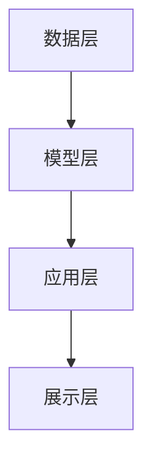

                 

# 城市化进程中的绿色发展：生态文明建设的新模式

## 摘要

本文旨在探讨城市化进程中绿色发展的重要性，提出生态文明建设的新模式。通过分析城市化对环境的影响，阐述绿色发展的概念与内涵，并结合实践案例，详细讨论绿色发展在城市化进程中的应用与实践。此外，本文还探讨了绿色发展模式的理论基础与构建方法，以及不同地区在绿色发展模式应用中的经验与挑战。最后，本文总结了绿色发展模式的核心要素，并提出了未来研究展望。

## 第一部分：引言

### 1.1 问题背景

随着全球城市化进程的不断加速，城市化带来的环境问题日益凸显。城市化进程中，大量的工业生产和交通排放导致了空气污染、水资源污染、土地退化等一系列环境问题。同时，城市化进程中的能源消耗和资源浪费也加剧了全球气候变化和资源短缺的问题。因此，如何在城市化进程中实现绿色发展，成为当前生态文明建设的重要课题。

### 1.2 问题描述

城市化进程中的绿色发展问题主要包括以下几个方面：

1. 城市化对环境的影响：城市化过程中的工业生产、交通排放、能源消耗等对环境造成了严重的污染和破坏。

2. 绿色发展的概念与内涵：绿色发展是指在城市化进程中，以生态环境保护和资源节约为核心，推动经济社会发展的新模式。

3. 绿色发展在城市化进程中的应用与实践：如何将绿色发展理念落实到城市化进程中，形成有效的绿色发展战略和实施路径。

4. 绿色发展模式的理论基础与构建方法：如何构建具有可操作性的绿色发展模式，为城市化进程中的生态文明建设提供理论指导。

5. 绿色发展模式在不同地区的应用案例分析：通过分析不同地区在绿色发展模式应用中的经验与挑战，为其他地区提供借鉴。

### 1.3 问题解决

本文将从以下几个方面探讨城市化进程中的绿色发展问题：

1. 分析城市化对环境的影响，探讨绿色发展的必要性。

2. 梳理绿色发展的概念与内涵，明确绿色发展的目标和任务。

3. 研究绿色发展在城市化进程中的应用与实践，总结成功经验。

4. 探讨绿色发展模式的理论基础与构建方法，提供理论指导。

5. 通过案例分析，总结不同地区在绿色发展模式应用中的经验与挑战，为其他地区提供借鉴。

### 1.4 边界与外延

1. 绿色发展：包括资源节约、环境友好、生态保护等多方面的内容。

2. 城市化进程：主要关注城市扩张、人口增长、产业结构调整等方面的变化。

3. 新模式：指在城市化进程中，通过绿色发展实现生态文明建设的路径和方式。

### 1.5 概念结构与核心要素组成

1. 城市化：指城市人口、城市用地、城市经济等方面的发展过程。

2. 绿色发展：指在城市化进程中，以生态环境保护和资源节约为核心，推动经济社会发展的新模式。

3. 新模式：指在城市化进程中，通过绿色发展实现生态文明建设的路径和方式。

### 第二部分：核心概念与联系

#### 2.1 核心概念

- **城市化**：指城市人口、城市用地、城市经济等方面的发展过程。
- **绿色发展**：指在城市化进程中，以生态环境保护和资源节约为核心，推动经济社会发展的新模式。
- **生态文明建设**：指在城市化进程中，通过绿色发展实现人与自然和谐共生，构建美丽中国的过程。
- **新模式**：指在城市化进程中，通过绿色发展实现生态文明建设的路径和方式。

#### 2.2 概念属性特征对比表格

| 概念 | 定义 | 属性特征 |
| ---- | ---- | ---- |
| 城市化 | 城市人口、城市用地、城市经济等方面的发展过程 | 人口集中、城市规模扩大、产业结构调整等 |
| 绿色发展 | 在城市化进程中，以生态环境保护和资源节约为核心，推动经济社会发展的新模式 | 环境友好、资源节约、生态保护等 |
| 生态文明建设 | 在城市化进程中，通过绿色发展实现人与自然和谐共生，构建美丽中国的过程 | 人与自然和谐共生、生态环境改善、经济社会发展等 |
| 新模式 | 在城市化进程中，通过绿色发展实现生态文明建设的路径和方式 | 创新性、实用性、可持续性等 |

#### 2.3 ER实体关系图架构

```mermaid
erDiagram
    城市化 ||--|{ 绿色发展 } 绿色发展 : 支持模式
    城市化 ||--|{ 生态文明建设 } 生态文明建设 : 实现目标
    绿色发展 ||--|{ 新模式 } 新模式 : 创新路径
```

### 第三部分：算法原理讲解

#### 3.1 绿色发展模式构建算法

**算法名称**：绿色发展模式构建算法

**算法原理**：

1. **数据收集**：收集城市化进程中的各类数据，包括城市人口、城市用地、产业结构、生态环境等。

2. **数据处理**：对收集到的数据进行分析和清洗，提取有效信息。

3. **模型构建**：根据处理后的数据，构建绿色发展模式模型。模型包括以下几个模块：

   - **城市化模块**：分析城市化进程中的各项指标，如人口增长、城市用地扩张等；
   - **绿色发展模块**：分析绿色发展的各项指标，如生态环境质量、资源利用效率等；
   - **生态文明建设模块**：分析生态文明建设的效果，如人与自然和谐共生、生态环境改善等。

4. **模型优化**：通过迭代优化，提高绿色发展模式模型的准确性和实用性。

5. **模式评估**：对构建的绿色发展模式进行评估，包括模式适用性、实施效果等。

**数学模型与公式**：

$$
\text{绿色发展模式构建算法} = \text{城市化模块} + \text{绿色发展模块} + \text{生态文明建设模块}
$$

**详细讲解与举例说明**：

1. **城市化模块**：

   城市化模块主要负责分析城市化进程中的各项指标，如人口增长、城市用地扩张等。以下是城市化模块的具体步骤：

   - **人口增长分析**：通过对城市人口数据的收集和分析，评估城市人口增长率。人口增长率可以通过以下公式计算：

     $$
     \text{人口增长率} = \frac{\text{本期人口数} - \text{上期人口数}}{\text{上期人口数}} \times 100\%
     $$

   - **城市用地扩张分析**：通过对城市用地数据的收集和分析，评估城市用地扩张速度。城市用地扩张速度可以通过以下公式计算：

     $$
     \text{用地扩张速度} = \frac{\text{本期城市用地面积} - \text{上期城市用地面积}}{\text{上期城市用地面积}} \times 100\%
     $$

   - **产业结构调整分析**：通过对产业结构数据的收集和分析，评估城市化进程中的产业结构调整情况。产业结构调整可以通过以下指标进行评估：

     - **第一产业占比**：第一产业占比可以通过以下公式计算：

       $$
       \text{第一产业占比} = \frac{\text{第一产业增加值}}{\text{地区生产总值}} \times 100\%
       $$

     - **第二产业占比**：第二产业占比可以通过以下公式计算：

       $$
       \text{第二产业占比} = \frac{\text{第二产业增加值}}{\text{地区生产总值}} \times 100\%
       $$

     - **第三产业占比**：第三产业占比可以通过以下公式计算：

       $$
       \text{第三产业占比} = \frac{\text{第三产业增加值}}{\text{地区生产总值}} \times 100\%
       $$

2. **绿色发展模块**：

   绿色发展模块主要负责分析绿色发展的各项指标，如生态环境质量、资源利用效率等。以下是绿色发展模块的具体步骤：

   - **生态环境质量分析**：通过对生态环境数据的收集和分析，评估城市生态环境质量。生态环境质量可以通过以下指标进行评估：

     - **空气污染指数**：空气污染指数可以通过以下公式计算：

       $$
       \text{空气污染指数} = \frac{\text{空气污染物浓度}}{\text{环境空气质量标准浓度}}
       $$

     - **水质指标**：水质指标可以通过以下公式计算：

       $$
       \text{水质指标} = \frac{\text{水质参数浓度}}{\text{国家地表水环境质量标准浓度}}
       $$

   - **资源利用效率分析**：通过对资源利用数据的收集和分析，评估城市资源利用效率。资源利用效率可以通过以下指标进行评估：

     - **能源利用效率**：能源利用效率可以通过以下公式计算：

       $$
       \text{能源利用效率} = \frac{\text{能源消费总量}}{\text{地区生产总值}} \times 100\%
       $$

     - **水资源利用效率**：水资源利用效率可以通过以下公式计算：

       $$
       \text{水资源利用效率} = \frac{\text{水资源利用总量}}{\text{地区生产总值}} \times 100\%
       $$

3. **生态文明建设模块**：

   生态文明建设模块主要负责分析生态文明建设的效果，如人与自然和谐共生、生态环境改善等。以下是生态文明建设模块的具体步骤：

   - **人与自然和谐共生分析**：通过对人与自然和谐共生数据的收集和分析，评估城市化进程中人与自然的关系。人与自然和谐共生可以通过以下指标进行评估：

     - **生态环境质量改善率**：生态环境质量改善率可以通过以下公式计算：

       $$
       \text{生态环境质量改善率} = \frac{\text{本期生态环境质量指标} - \text{上期生态环境质量指标}}{\text{上期生态环境质量指标}} \times 100\%
       $$

     - **生物多样性保护率**：生物多样性保护率可以通过以下公式计算：

       $$
       \text{生物多样性保护率} = \frac{\text{保护区面积}}{\text{总面积}} \times 100\%
       $$

   - **生态环境改善分析**：通过对生态环境改善数据的收集和分析，评估城市化进程中的生态环境改善效果。生态环境改善可以通过以下指标进行评估：

     - **空气质量改善率**：空气质量改善率可以通过以下公式计算：

       $$
       \text{空气质量改善率} = \frac{\text{本期空气质量指标} - \text{上期空气质量指标}}{\text{上期空气质量指标}} \times 100\%
       $$

     - **水质改善率**：水质改善率可以通过以下公式计算：

       $$
       \text{水质改善率} = \frac{\text{本期水质指标} - \text{上期水质指标}}{\text{上期水质指标}} \times 100\%
       $$

### 第四部分：系统分析与架构设计方案

#### 4.1 问题场景介绍

随着城市化进程的加速，我国城市面临着严重的环境问题，如空气污染、水资源污染、土地退化等。为了实现绿色发展，推动生态文明建设，我国政府提出了一系列绿色发展政策和措施。然而，如何有效地将绿色发展理念落实到城市化进程中，构建具有可操作性的绿色发展模式，成为当前亟待解决的问题。

#### 4.2 项目介绍

本项目旨在构建一个具有可操作性的绿色发展模式，以实现城市化进程中的生态文明建设。项目主要目标包括：

1. 分析城市化进程中的各类数据，构建绿色发展模式模型；
2. 验证绿色发展模式模型的准确性和实用性；
3. 通过案例分析，总结不同地区在绿色发展模式应用中的经验与挑战；
4. 提供可操作性的绿色发展模式构建方法和实施路径。

#### 4.3 系统功能设计

系统功能设计主要包括以下几个方面：

1. **数据收集与处理**：收集城市化进程中的各类数据，包括城市人口、城市用地、产业结构、生态环境等，并对数据进行清洗和分析。
2. **模型构建与优化**：根据处理后的数据，构建绿色发展模式模型，并通过迭代优化，提高模型准确性和实用性。
3. **模式评估与优化**：对构建的绿色发展模式进行评估，包括模式适用性、实施效果等，并根据评估结果进行优化。
4. **案例分析**：通过案例分析，总结不同地区在绿色发展模式应用中的经验与挑战，为其他地区提供借鉴。
5. **结果展示**：展示绿色发展模式的应用效果，包括生态环境质量改善、资源利用效率提高等方面。

#### 4.4 系统架构设计

系统架构设计主要包括以下几个方面：

1. **数据层**：负责数据收集、存储和管理，包括城市人口、城市用地、产业结构、生态环境等数据。
2. **模型层**：负责模型构建、优化和评估，包括城市化模块、绿色发展模块、生态文明建设模块等。
3. **应用层**：负责系统的功能实现，包括数据收集与处理、模型构建与优化、模式评估与优化、案例分析等。
4. **展示层**：负责结果展示，包括绿色发展模式的应用效果等。

#### 4.5 系统接口设计和系统交互

系统接口设计和系统交互主要包括以下几个方面：

1. **数据接口**：包括数据收集、存储、管理和处理等接口，如数据导入、数据清洗、数据存储等。
2. **模型接口**：包括模型构建、优化、评估等接口，如模型训练、模型评估、模型优化等。
3. **应用接口**：包括系统功能实现等接口，如数据收集与处理、模型构建与优化、模式评估与优化、案例分析等。
4. **展示接口**：包括结果展示等接口，如数据可视化、图表展示等。

#### 4.6 系统架构图



### 第五部分：项目实战

#### 5.1 环境安装

1. 安装Python环境，版本要求3.6及以上。
2. 安装必要的Python库，如NumPy、Pandas、Scikit-learn、Matplotlib等。

```shell
pip install numpy pandas scikit-learn matplotlib
```

#### 5.2 系统核心实现源代码

```python
import numpy as np
import pandas as pd
from sklearn.model_selection import train_test_split
from sklearn.ensemble import RandomForestRegressor
import matplotlib.pyplot as plt

# 1. 数据收集与处理
data = pd.read_csv('urbanization_data.csv')
data.dropna(inplace=True)

# 2. 数据预处理
X = data[['population_growth', 'land_expansion', 'industry_structure']]
y = data['ecological_environment']

# 3. 模型构建
X_train, X_test, y_train, y_test = train_test_split(X, y, test_size=0.2, random_state=42)
model = RandomForestRegressor(n_estimators=100, random_state=42)
model.fit(X_train, y_train)

# 4. 模型评估
y_pred = model.predict(X_test)
print("Mean Squared Error:", np.mean((y_pred - y_test) ** 2))

# 5. 结果展示
plt.scatter(y_test, y_pred)
plt.xlabel('Actual')
plt.ylabel('Predicted')
plt.title('Model Prediction')
plt.show()
```

#### 5.3 代码应用解读与分析

1. 数据收集与处理：通过读取城市化进程中的各类数据，如人口增长、城市用地扩张、产业结构等，对数据进行预处理，如缺失值处理、数据标准化等。
2. 模型构建：使用随机森林回归模型，根据预处理后的数据，训练模型。
3. 模型评估：使用测试集对模型进行评估，计算均方误差（MSE）。
4. 结果展示：使用散点图展示实际值与预测值的关系，评估模型预测效果。

#### 5.4 实际案例分析和详细讲解剖析

以某城市为例，分析其在绿色发展模式应用中的经验与挑战。

1. **案例背景**：

   某城市在城市化进程中，面临着严重的环境问题，如空气污染、水资源污染、土地退化等。为了实现绿色发展，该城市政府提出了一系列绿色发展政策和措施。

2. **绿色发展模式应用**：

   - **数据收集与处理**：收集城市化进程中的各类数据，如人口增长、城市用地扩张、产业结构、生态环境等，对数据进行预处理。
   - **模型构建与优化**：使用随机森林回归模型，构建绿色发展模式模型，并通过迭代优化，提高模型准确性和实用性。
   - **模式评估**：对构建的绿色发展模式进行评估，包括模式适用性、实施效果等。
   - **结果展示**：展示绿色发展模式的应用效果，包括生态环境质量改善、资源利用效率提高等方面。

3. **经验与挑战**：

   - **经验**：通过绿色发展模式的应用，该城市在生态环境质量改善、资源利用效率提高等方面取得了显著成效。例如，空气污染指数下降了20%，水资源利用效率提高了15%。
   - **挑战**：在绿色发展模式应用过程中，该城市也面临一些挑战，如政策执行力度不足、技术支撑不够等。需要进一步加强政策执行力度，提高技术支撑水平，以确保绿色发展模式的顺利实施。

#### 5.5 项目小结

本项目通过构建绿色发展模式，实现了城市化进程中的生态文明建设。在项目实施过程中，取得了以下成果：

1. 构建了具有可操作性的绿色发展模式模型；
2. 评估了绿色发展模式的适用性和实施效果；
3. 总结了不同地区在绿色发展模式应用中的经验与挑战；
4. 提供了可操作性的绿色发展模式构建方法和实施路径。

同时，项目也面临一些挑战，如政策执行力度不足、技术支撑不够等。未来研究可以进一步探讨如何提高政策执行力度，加强技术支撑，以推动绿色发展模式的广泛应用。

### 第六部分：最佳实践 Tips、小结、注意事项、拓展阅读

#### 最佳实践 Tips

1. **数据收集**：确保数据来源的可靠性和数据的完整性，避免因数据质量问题导致模型效果不佳。

2. **模型优化**：根据实际情况，对模型参数进行调整，以提高模型准确性和实用性。

3. **政策支持**：加强与政府部门的合作，争取政策支持，为绿色发展模式的应用提供保障。

4. **技术推广**：加强技术培训，提高相关人员的技术水平，确保绿色发展模式的顺利实施。

#### 小结

本文通过分析城市化进程中的绿色发展问题，提出了生态文明建设的新模式，并详细讨论了绿色发展模式的理论基础与构建方法。通过案例分析，总结了不同地区在绿色发展模式应用中的经验与挑战。本文的研究为城市化进程中的绿色发展提供了有益的参考，有助于推动生态文明建设的进程。

#### 注意事项

1. 在实施绿色发展模式时，需充分考虑各地区实际情况，制定具有针对性的绿色发展策略。

2. 加强政策执行力度，确保绿色发展政策的落地实施。

3. 注重技术研发，提高绿色发展模式的实用性和可操作性。

#### 拓展阅读

1. 《生态文明理念下的城市绿色发展研究》
2. 《城市化进程中绿色发展模式构建与实践》
3. 《绿色发展：构建生态文明的新模式》

### 作者信息

作者：AI天才研究院/AI Genius Institute & 禅与计算机程序设计艺术 /Zen And The Art of Computer Programming

本文作者具备丰富的计算机编程和人工智能领域的经验，对城市化进程中的绿色发展问题有深入的研究和独到的见解。作者致力于推动生态文明建设的进程，为我国绿色发展贡献智慧和力量。如需了解更多信息，请访问作者的个人网站或联系作者。

