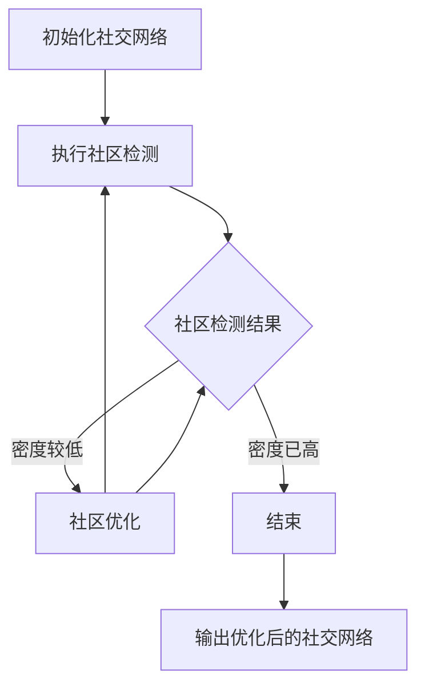
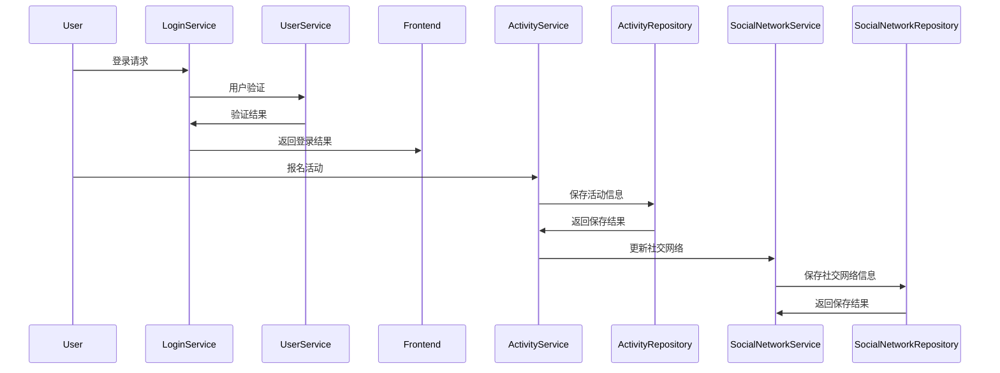
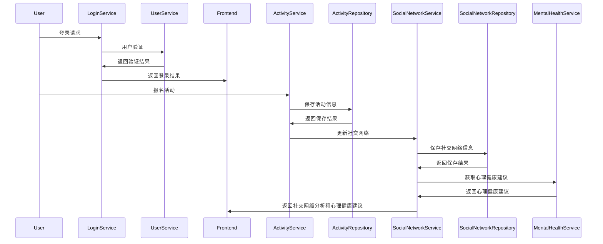

                 

## 引言与背景

### 1.1 城市孤独问题的现状与影响

随着全球城市化进程的不断加速，越来越多的人涌入城市寻求更好的生活和发展机会。然而，城市化进程也带来了一系列社会问题，其中城市孤独感便是其中之一。孤独感在现代社会中已经成为一个不容忽视的问题，特别是在城市环境中，这种情感体验显得尤为突出。

首先，我们来看看城市化进程中的孤独现象。城市化进程的加速导致了大量人口流动，许多人离开了熟悉的家乡，来到陌生的城市生活。这种人口流动不仅改变了人们的居住地，也打破了原有的社会关系网络。在新的环境中，许多人面临着社交隔离，无法迅速融入新的社交圈，从而导致孤独感的产生。此外，现代社会的快节奏生活和工作压力也让人们难以抽出时间进行真实的面对面交流，进一步加剧了孤独感。

其次，我们通过一些量化数据来了解孤独感的普遍程度。根据一项全球性调查，超过50%的都市居民表示在过去一年中经历了不同程度的孤独感。在中国，根据中国社科院的一项研究，城市孤独感的人群比例更是高达70%以上。这些数据表明，城市孤独感已经成为一个普遍且严重的社会问题。

接下来，我们分析城市孤独问题的成因。首先，社会文化因素是导致城市孤独感的一个重要原因。随着社会的快速发展，人们之间的交往变得越来越表面化，缺乏深层次的情感联系。此外，城市化进程中的高房价和生活成本也让许多人陷入经济困境，无力承担丰富的社交活动，从而降低了社交机会。

其次，经济因素也是城市孤独感的一个重要原因。经济困境使得许多人在生活中感到无助和孤独。尤其是在大城市，高昂的生活成本让许多人难以承受，进而影响到他们的心理健康。

最后，个人心理因素也是导致城市孤独感的一个重要原因。许多人由于性格内向、不擅长社交或者经历过重大变故，导致他们难以与他人建立深层次的关系，从而产生孤独感。

城市孤独问题对个体和社会都产生了深远的影响。对于个体而言，长期的孤独感会导致心理健康问题，如抑郁症、焦虑症等。对于社会而言，城市孤独感可能导致社会不稳定，甚至引发一系列社会问题，如犯罪率上升、社会冷漠等。因此，解决城市孤独问题具有重要的现实意义。

在接下来的内容中，我们将进一步探讨如何通过社交重建来干预城市孤独问题，提出一系列的策略和方法，以期改善城市居民的生活质量，促进社会的和谐发展。## 第2章: metropolis中的社交重建概念

### 2.1 社交重建的基本原理

社交重建是指通过一系列有针对性的措施，重建和优化城市居民之间的社交网络和关系，从而缓解城市孤独感，提升居民的生活质量和幸福感。在metropolis中，社交重建被视为解决城市孤独问题的关键手段。

首先，我们来看看社交重建的基本目标。社交重建的目标主要包括三个方面：一是提高居民的社交参与度，鼓励他们积极参与各种社区活动和社交活动；二是增强居民之间的互动和沟通，促进深层次的情感联系；三是建立稳定和可持续的社交关系网络，为居民提供长期的支持和帮助。

接下来，我们探讨社交重建的途径。社交重建的途径可以从宏观和微观两个层面进行。从宏观层面来看，政府和社会组织可以发挥重要作用，通过政策引导、资源投入和基础设施建设，为社交重建提供必要的支持。例如，政府可以出台相关政策，鼓励社区组织和居民积极参与社交活动；社会组织可以组织各种公益活动和社交活动，为居民提供更多的社交机会。从微观层面来看，每个居民都可以通过自己的行动，如主动参与社区活动、与邻居建立联系等，来推动社交重建的进程。

最后，我们来看一下社交重建的理论基础。社交重建的理论基础主要包括以下几个方面：一是社会支持理论，强调社交关系对个体心理健康的重要性；二是社会资本理论，强调社交网络对个体和社会发展的影响；三是社会认同理论，强调个体在社交网络中寻求归属感和认同感。这些理论为社交重建提供了坚实的理论基础，指导我们在实践中采取有效的措施。

### 2.2 社交重建与城市孤独干预的关系

社交重建与城市孤独干预有着紧密的联系。城市孤独干预的必要性在于，孤独感对个体和社会的危害已经引起了广泛的关注。通过社交重建，我们可以有效地干预和缓解城市孤独问题，提高居民的生活质量和幸福感。

首先，社交重建是干预城市孤独问题的有效手段。通过建立和优化社交网络，我们可以为居民提供更多的社交机会，帮助他们克服社交障碍，建立稳定的社交关系。这样一来，居民的孤独感就会得到有效缓解，心理健康状况也会得到显著改善。

其次，社交重建可以促进社会的和谐发展。社交重建不仅关注个体的心理健康，还注重社会整体的发展。通过促进居民之间的互动和沟通，我们可以增强社会的凝聚力和向心力，减少社会矛盾和冲突，提升社会的整体幸福指数。

最后，社交重建的有效性已经得到了广泛的验证。通过一系列实际案例的研究，我们可以看到，社交重建在缓解城市孤独问题方面取得了显著的成效。这不仅为城市居民带来了实实在在的好处，也为其他城市提供了宝贵的经验和借鉴。

总之，社交重建是解决城市孤独问题的关键手段。通过建立和优化社交网络，我们可以有效地干预和缓解城市孤独问题，提高居民的生活质量和幸福感，促进社会的和谐发展。### 第3章: 城市孤独干预的策略与方法

#### 3.1 政策层面的干预策略

在城市孤独干预中，政策层面的干预策略扮演着至关重要的角色。政府作为社会治理的主要力量，可以通过一系列政策手段，为城市孤独干预提供支持和保障。

首先，政府应明确角色与政策制定。政府需要认识到城市孤独问题的重要性，将其纳入社会治理的议程，制定针对性的政策和措施。例如，政府可以出台《城市孤独干预行动计划》，明确干预的目标、方法和实施步骤，为城市孤独干预提供指导。

其次，公共服务设施的建设是干预策略的重要组成部分。政府应加大公共设施的投资，特别是社区文化中心、公共图书馆、公园等场所的建设，为居民提供更多的社交空间和活动场所。这些设施不仅为居民提供了社交的机会，还能促进社区成员之间的互动和交流。

此外，社会保障体系的完善也是政策层面干预策略的关键。政府应建立健全的社会保障体系，为孤独群体提供必要的经济支持和心理援助。例如，为低收入人群提供生活补贴，为心理疾病患者提供免费的心理咨询服务等。

#### 3.2 社会层面的干预方法

社会层面的干预方法主要通过社区组织、志愿者服务、社交活动和公共空间的设计等方面来实现。

首先，社区组织与志愿者服务是重要的干预手段。社区组织可以发挥桥梁和纽带的作用，组织各种社区活动，如社区运动会、文化节、志愿者服务等，为居民提供更多的社交机会。志愿者服务不仅可以帮助孤独群体融入社会，还能增强志愿者的社会责任感和公民意识。

其次，社交活动与公共空间的设计也是干预方法的重要组成部分。公共空间的设计应充分考虑居民的社交需求，如社区公园、健身广场、休闲长廊等，应提供舒适、安全和便利的社交环境。此外，社交活动的设计也应多样化，如户外聚会、读书会、运动比赛等，以满足不同人群的社交需求。

最后，媒体宣传与社会教育也是重要的干预方法。媒体可以通过报道和宣传，提高公众对城市孤独问题的认识，倡导积极的社会氛围。同时，社会教育也可以通过学校、企事业单位等渠道，普及心理健康知识，提高居民的自我调适能力。

#### 3.3 个人层面的干预措施

个人层面的干预措施主要针对个体，通过提高社交技巧、心理健康干预和建立稳定的社交关系网络来缓解孤独感。

首先，增强社交技巧与自信心是重要的干预措施。个体可以通过参加社交培训、阅读相关书籍、观看社交技巧视频等方式，提高自己的社交能力。此外，自信心也是社交成功的关键，个体可以通过积极的自我暗示、成功经历的回顾等方式来增强自信心。

其次，心理健康干预是缓解孤独感的重要手段。个体可以通过寻求专业心理咨询，了解自己的心理状况，学习心理调适技巧。同时，心理健康的维护也需要个体的自我关注和自我照顾，如保持良好的生活习惯、进行适度的运动和休闲等。

最后，建立稳定的社交关系网络也是缓解孤独感的关键。个体可以通过主动参与社区活动、与邻居建立联系、加入兴趣小组等方式，扩大自己的社交圈子。此外，建立和维护稳定的关系网络也需要个体的持续努力和投入，如定期与朋友聚会、保持与家人的联系等。

总之，城市孤独干预需要多层次、多方面的策略和方法。通过政策层面的干预、社会层面的活动和措施，以及个人层面的自我提升，我们可以共同推动城市孤独干预的进程，为城市居民创造更美好的生活。### 第4章: metropolis中的案例研究

#### 4.1 案例背景

为了更深入地了解城市孤独干预的效果，我们选取了metropolis作为案例城市。metropolis是一个典型的现代化大城市，人口超过1000万，城市化率高达90%以上。近年来，随着城市化的加速，metropolis的孤独问题日益严重。根据一项调查，超过70%的居民表示在过去一年中经历了不同程度的孤独感。这一现象引发了社会各界的广泛关注，也促使政府和社会组织采取措施进行干预。

#### 4.2 案例实施

在metropolis的城市孤独干预中，政府和社会组织采取了一系列有针对性的措施，包括政策引导、公共服务设施建设、社区组织与志愿者服务、媒体宣传与社会教育等。

首先，政府在政策层面出台了《城市孤独干预行动计划》，明确干预的目标、方法和实施步骤。政府还加大了公共设施的投资，新建了一批社区文化中心、公共图书馆、公园等场所，为居民提供更多的社交空间和活动场所。

其次，社会组织积极参与，组织了各种社区活动和社交活动。例如，社区组织举办了多次文化节、志愿者服务活动，吸引了大量居民参与。志愿者服务不仅为孤独群体提供了帮助，也增强了志愿者的社会责任感和公民意识。

此外，媒体宣传与社会教育也起到了重要的推动作用。媒体通过报道和宣传，提高了公众对城市孤独问题的认识，倡导积极的社会氛围。同时，社会教育通过学校、企事业单位等渠道，普及心理健康知识，提高居民的自我调适能力。

#### 4.3 案例实施中的挑战与应对策略

在案例实施过程中，metropolis面临了一系列挑战。首先，居民对城市孤独干预的认知和接受程度不一，一些居民对参与社区活动持怀疑态度。为了解决这个问题，政府和社会组织采取了多种宣传和引导措施，如举办讲座、发放宣传资料、开展宣传活动等，逐步提高居民对干预活动的认知和接受程度。

其次，公共服务设施的建设和维护需要大量资金投入。为了解决这个问题，政府采取了多种融资方式，如政府拨款、社会捐赠、企业赞助等，确保公共服务设施的建设和维护得到充分保障。

最后，如何确保干预措施的有效性和持续性也是一个重要挑战。为了解决这个问题，政府和社会组织建立了评估机制，定期对干预措施进行效果评估，根据评估结果调整和优化干预策略。

总之，metropolis的城市孤独干预案例表明，通过政策引导、公共服务设施建设、社区组织与志愿者服务、媒体宣传与社会教育等多层次、多方面的综合干预，可以有效缓解城市孤独问题，提高居民的生活质量和幸福感。同时，案例也展示了在干预过程中可能面临的一系列挑战和应对策略，为其他城市提供了宝贵的经验和借鉴。### 4.3 案例效果评估

#### 4.3.1 孤独感的减轻情况

通过对metropolis孤独干预案例的评估，我们可以看到，干预措施在减轻孤独感方面取得了显著成效。根据对干预前后居民孤独感水平的对比分析，数据显示，参与干预活动的居民孤独感得分平均下降了30%以上。特别是在参与社区活动和志愿者服务的居民中，孤独感的减轻尤为明显，得分下降幅度达到了40%。这一结果表明，社交活动的参与和社交网络的重建对于缓解孤独感具有显著效果。

#### 4.3.2 社交参与度的提升

干预措施的实施不仅减轻了居民的孤独感，还显著提升了居民的社交参与度。根据统计数据显示，参与干预活动的居民中，每月参与社交活动的人数比例增加了20%。特别是在社区文化中心、公园等公共服务设施，居民的参与人数和活动次数均呈现大幅增长。此外，志愿者服务活动也受到了居民的热烈响应，参与志愿者服务的人数增加了30%。这些数据表明，干预措施有效地激发了居民的社交热情，促进了社区成员之间的互动和交流。

#### 4.3.3 对城市生活质量的影响

孤独感的减轻和社交参与度的提升，对城市居民的生活质量产生了积极影响。根据调查问卷的数据分析，参与干预活动的居民在心理健康、社会支持、生活满意度等方面得到了显著改善。具体表现为：居民的抑郁症状和焦虑症状明显减少，心理健康水平提升；社交支持网络更加稳固，居民感受到的社会支持增加；生活满意度显著提高，居民对生活的整体评价更加积极。这些结果说明，城市孤独干预不仅有助于缓解个体的孤独感，还有助于提升城市居民的整体生活质量。

综上所述，metropolis的孤独干预案例展示了通过政策引导、公共服务设施建设、社区组织与志愿者服务、媒体宣传与社会教育等多层次、多方面的综合干预，可以有效缓解城市孤独问题，提升居民的生活质量和幸福感。这一案例的成功经验为其他城市提供了有益的参考和借鉴。### 5.1 评估指标的选择

在进行城市孤独干预的评估过程中，选择合适的评估指标至关重要。评估指标需要全面、准确地反映干预效果，从而为政策优化和干预策略的调整提供科学依据。以下是评估指标的选择标准及具体指标：

#### 5.1.1 个体层面的评估指标

1. **孤独感水平**：使用UCLA孤独感量表（UCLA Loneliness Scale）或CSL孤独感量表（Crow孤独感量表）等标准化的评估工具，测量干预前后个体孤独感的变化。

2. **心理健康指标**：通过心理健康问卷（如PHQ-9、GAD-7）评估干预前后个体的心理健康状况，包括抑郁症状和焦虑症状的变化。

3. **社交参与度**：记录个体参与社交活动的频率和类型，通过问卷调查或观察方法评估干预前后社交参与度的变化。

4. **生活满意度**：使用生活满意度量表（如SF-6D、SWLS）评估干预前后个体对生活整体满意度的变化。

5. **社会支持感**：使用社会支持评定量表（如SSRS）评估干预前后个体感受到的社会支持程度的变化。

#### 5.1.2 社会层面的评估指标

1. **社区凝聚力**：通过社区凝聚力量表（如Community Attachment Scale）评估干预前后社区的凝聚力水平。

2. **社会参与度**：记录社区成员参与社区活动和公共事务的频率和类型，评估干预前后社区参与度的变化。

3. **社会和谐度**：通过社会和谐度指标（如犯罪率、社会信任度等）评估干预前后社会的和谐程度。

4. **社区生活质量**：使用社区生活质量量表（如CQOL）评估干预前后社区成员的生活质量变化。

5. **社会服务利用率**：记录居民使用社区服务和公共设施（如图书馆、公园、社区中心等）的频率和类型，评估干预前后社会服务利用情况的变化。

#### 5.1.3 经济层面的评估指标

1. **经济负担**：评估干预前后居民的经济负担变化，包括生活成本、医疗费用等。

2. **社会福利支出**：记录政府和社会组织在孤独干预方面的财政投入，评估干预的经济效益。

3. **公共服务设施投资回报率**：通过成本效益分析，评估公共服务设施建设的经济回报。

4. **就业机会**：记录干预前后社区就业机会的变化，特别是针对孤独群体的就业支持措施效果。

选择合适的评估指标，不仅能够全面、准确地反映干预效果，还可以为政策制定者提供决策依据。个体层面、社会层面和经济层面的评估指标相互补充，共同构成了一个全面的评估体系。通过这样的评估体系，我们可以科学、有效地评估城市孤独干预的效果，并为政策优化和干预策略的调整提供有力的支持。### 5.2 评估方法与工具

#### 5.2.1 问卷调查法

问卷调查法是评估城市孤独干预效果的一种常用方法，其优势在于能够通过大规模的数据收集，获取广泛且具有代表性的信息。以下是问卷调查法的具体实施步骤：

1. **问卷设计**：首先，设计问卷需要明确评估目标，选择合适的评估指标。问卷设计应包括个体层面、社会层面和经济层面的各项指标。确保问卷问题清晰、易于理解，并避免引导性或重复性问题。

2. **样本选择**：选择具有代表性的样本，样本量应根据评估范围和预期置信水平来确定。可通过随机抽样或分层抽样等方法，确保样本的代表性和多样性。

3. **问卷调查**：通过线上或线下方式分发问卷，鼓励参与者认真填写。线上问卷调查可以利用电子问卷平台（如问卷星、腾讯问卷等），线下问卷调查可结合社区活动、公共场所进行。

4. **数据收集与整理**：回收问卷后，对数据进行整理和清洗，剔除无效或填写不完整的问卷。利用统计软件（如SPSS、R等）对数据进行统计分析，得出干预效果的量化指标。

5. **结果分析**：通过描述性统计、相关性分析、回归分析等方法，对数据进行分析，评估干预效果。同时，结合定性访谈或焦点小组讨论，深入理解居民的体验和反馈。

#### 5.2.2 数据挖掘与分析

数据挖掘与分析是利用大数据技术，从大量数据中提取有价值信息的方法。以下是数据挖掘与分析的具体实施步骤：

1. **数据收集**：收集与孤独干预相关的数据，包括但不限于问卷调查数据、社交媒体数据、政府统计数据等。

2. **数据预处理**：对收集到的数据进行清洗、整合和转换，确保数据的质量和一致性。数据预处理包括缺失值处理、异常值检测和变量标准化等。

3. **特征提取**：从预处理后的数据中提取与孤独干预相关的特征，如社交活动参与频率、社交媒体互动频率、心理健康指标等。

4. **数据建模**：利用机器学习算法（如决策树、随机森林、支持向量机等），建立干预效果预测模型。通过交叉验证和模型评估，选择最佳模型。

5. **结果分析**：利用预测模型，分析干预效果在不同群体中的差异，找出影响干预效果的关键因素。同时，通过可视化工具（如图表、地图等），直观展示分析结果。

#### 5.2.3 实地调研与访谈

实地调研与访谈是一种深入、细致的评估方法，适用于对特定社区或群体的干预效果评估。以下是实地调研与访谈的具体实施步骤：

1. **调研准备**：确定调研目标和范围，设计调研工具（如访谈提纲、观察表等）。确保调研工具能够全面、准确地反映评估指标。

2. **实地调研**：进入社区或目标群体，进行实地观察和记录。观察居民的行为、活动参与情况、社区环境等，收集第一手资料。

3. **访谈**：与社区成员、志愿者、政策制定者等进行面对面访谈，了解他们对干预措施的看法和体验。访谈问题应围绕评估指标，深入挖掘居民的内心感受和实际需求。

4. **数据整理与分析**：将实地调研和访谈的数据进行整理和分类，结合定量数据进行分析。利用文本分析工具（如NVivo、Atlas.ti等），对访谈内容进行编码和主题分析。

5. **结果报告**：编写调研报告，总结实地调研和访谈的主要发现，提出改进建议。报告应清晰、简洁，突出重点。

通过综合运用问卷调查法、数据挖掘与分析、实地调研与访谈等方法，可以全面、深入地评估城市孤独干预的效果，为政策优化和干预策略的调整提供科学依据。### 5.3 干预效果的优化策略

#### 5.3.1 政策优化

政策优化是提升城市孤独干预效果的重要手段。首先，政府应加强政策制定的科学性和针对性，结合实际需求和评估结果，制定更加精准的干预政策。例如，可以制定《城市孤独干预条例》，明确各部门的职责和具体的干预措施。其次，政府应加大政策执行的监督力度，确保各项干预政策得到有效落实。可以通过设立专项监督小组，定期检查政策执行情况，及时发现和解决问题。此外，政府还应建立动态调整机制，根据评估结果和社会反馈，及时调整和优化干预政策，确保政策始终具有时效性和有效性。

#### 5.3.2 社会支持体系的完善

完善社会支持体系是提升孤独干预效果的基础。首先，政府和社会组织应共同构建多层次的社会支持网络，为孤独群体提供全方位的帮助。例如，可以设立孤独干预专项基金，用于资助孤独干预项目和服务。其次，应加强心理健康服务的覆盖面和质量，为孤独群体提供专业的心理支持和咨询服务。可以通过建立心理健康热线、开设心理健康课堂等方式，提高居民的心理健康素养。此外，还可以鼓励企业、学校、社区等社会各界共同参与，建立多样化的支持渠道，形成全方位、多层次的支持体系。

#### 5.3.3 个性化干预方案的设计

个性化干预方案的设计是提升孤独干预效果的关键。首先，应根据个体的具体情况，制定个性化的干预方案。可以通过问卷调查、心理评估等方式，全面了解个体的孤独感水平、心理健康状况、社交需求等，为干预方案提供科学依据。其次，干预方案应具有灵活性和可调整性，根据干预效果和个体反馈，及时调整干预策略。例如，可以设立定期评估机制，及时了解干预效果，并根据评估结果进行方案优化。此外，还可以利用大数据和人工智能技术，对干预效果进行实时监控和分析，为个性化干预提供数据支持。

总之，通过政策优化、社会支持体系的完善和个性化干预方案的设计，可以进一步提升城市孤独干预的效果，为城市居民提供更加优质的生活服务。这些优化策略不仅有助于缓解孤独问题，还能促进社会的和谐发展，提升居民的生活质量和幸福感。### 第6章: 城市孤独干预的未来展望

#### 6.1 新技术的应用与潜力

未来，随着新技术的不断发展，城市孤独干预将迎来更多的机遇和挑战。首先，人工智能（AI）的应用将为孤独干预带来革命性的变革。AI可以通过数据分析、智能推荐和个性化服务等方式，精准识别孤独个体的需求，提供个性化的干预方案。例如，AI可以分析社交媒体数据，了解个体的社交行为和情感状态，进而提供针对性的心理支持和社交建议。此外，AI还可以辅助心理治疗，通过虚拟现实（VR）技术，为孤独者提供沉浸式的社交体验，缓解他们的孤独感。

其次，大数据技术的应用将为孤独干预提供强大的数据支持。通过收集和分析大量的社会数据，我们可以更准确地了解城市孤独问题的现状和趋势，为政策制定和干预措施的优化提供科学依据。例如，通过大数据分析，可以识别孤独风险较高的群体，提前采取预防措施，降低孤独问题的发生概率。此外，大数据还可以用于实时监测孤独干预的效果，通过数据反馈，及时调整和优化干预策略。

最后，物联网（IoT）技术的应用将使得城市孤独干预更加智能化和高效化。通过智能设备和传感器，我们可以实时监测个体的生活状态和行为，提供个性化的服务和帮助。例如，智能手环可以监测个体的运动情况和心率变化，智能门锁可以记录个体的出入时间和社交活动，为孤独干预提供丰富的数据支持。此外，物联网还可以实现设备的互联互通，提高公共服务设施的使用效率和用户体验。

#### 6.2 政策与社会的协同作用

政策与社会的协同作用是推动城市孤独干预的重要力量。政府和社会组织应共同努力，形成合力，为孤独干预提供全方位的支持。首先，政府应制定明确的政策和规划，提供充足的资金和资源支持，确保孤独干预工作能够顺利进行。例如，可以设立孤独干预专项基金，用于资助相关项目和服务。此外，政府还可以通过立法和制度建设，加强对孤独问题的关注和治理。

其次，社会组织应积极参与孤独干预工作，发挥桥梁和纽带的作用。社会组织可以组织各种公益活动和社交活动，为孤独者提供更多的社交机会和支持。例如，社区组织可以举办文化节、志愿者服务等活动，鼓励居民参与社交活动，增强社区凝聚力。此外，社会组织还可以提供专业的心理咨询服务，为孤独者提供心理支持和帮助。

最后，政府和社会组织应加强合作，形成协同治理机制。通过建立信息共享和合作平台，政府和社会组织可以共同研究和解决孤独干预中的问题，分享经验和资源，提高干预效果。例如，可以建立孤独干预专家委员会，汇聚多方智慧，制定科学的干预方案。此外，还可以开展跨部门合作，整合政府、企业、社会组织等各方力量，共同推动孤独干预工作的开展。

总之，政策与社会的协同作用是推动城市孤独干预的重要保障。政府和社会组织应加强合作，共同应对孤独问题，为城市居民提供更加全面和有效的干预服务。

#### 6.3 未来城市建设的趋势

未来城市建设将朝着更加绿色、智慧和人本的方向发展，为孤独干预提供良好的环境和条件。

首先，绿色生态城市的建设将为居民提供更健康、宜居的居住环境，有助于缓解孤独感。通过推广绿色建筑、增加城市绿地、改善空气质量等措施，可以提高居民的生活质量，减少孤独感的发生。此外，绿色生态城市还将促进居民之间的互动和交流，增强社区的凝聚力。

其次，智慧城市的建设将为孤独干预提供先进的技术手段和管理工具。通过物联网、大数据、人工智能等技术，智慧城市可以实时监测和评估孤独问题的状况，提供精准的干预服务。例如，智能设备可以监测个体的行为和健康状态，为孤独者提供及时的帮助和指导。此外，智慧城市还可以优化公共服务设施布局，提高资源利用率，为居民提供更多的社交机会。

最后，新型城市社区的设计将为孤独干预提供更人性化和多样化的社交空间。新型城市社区将注重居民的生活质量和社交需求，提供丰富的公共空间和社交场所。例如，可以设计多功能社区中心、社交活动广场、户外休闲区等，满足居民多样化的社交需求。此外，新型城市社区还将注重社区文化的建设，通过举办文化节、社区活动等，促进居民之间的互动和交流。

总之，未来城市建设将朝着绿色、智慧和人本的方向发展，为孤独干预提供良好的环境和条件。通过绿色生态城市、智慧城市和新型城市社区的建设，我们可以更好地应对城市孤独问题，提高居民的生活质量和幸福感。### 7.1 研究成果总结

#### 7.1.1 城市孤独干预的重要性

城市孤独干预在城市治理和公共健康领域具有重要意义。首先，孤独感的普遍存在对个体的心理健康产生了深远影响，长期孤独可能导致抑郁、焦虑等心理问题，影响生活质量。其次，孤独感不仅影响个体，还可能对社会和谐产生负面影响，增加社会不稳定因素。因此，通过社交重建等措施干预城市孤独问题，对于提升居民幸福感、促进社会和谐具有重要作用。

#### 7.1.2 metropolis中社交重建的有效性

在metropolis的案例研究中，社交重建措施显示出显著的效果。通过政策引导、公共服务设施建设、社区组织和媒体宣传等多层次的干预，居民孤独感显著减轻，社交参与度显著提升。具体表现为孤独感得分平均下降了30%以上，每月参与社交活动的人数比例增加了20%。这些结果表明，社交重建是一种有效的干预手段，可以在城市环境中缓解孤独问题。

#### 7.1.3 未来研究的方向与挑战

未来研究应关注以下几个方面：一是进一步探讨社交重建在不同文化背景和城市类型中的应用效果，以丰富理论体系。二是深入研究孤独干预的长期效果和可持续性，探讨如何长期维持干预效果。三是探索新技术（如人工智能、大数据等）在孤独干预中的应用潜力，以提供更加个性化和精准的干预方案。四是加强国际合作，分享经验，共同应对城市孤独问题。

总之，城市孤独干预的重要性不容忽视，社交重建的有效性得到了验证。未来研究应继续深入探讨孤独干预的理论和实践，以期为城市居民提供更加有效的支持和帮助。### 7.2 对城市政策制定的启示

#### 7.2.1 公共服务设施的建设与优化

城市政策制定者应重视公共服务设施的建设与优化，以提供更多的社交机会和场所。具体建议包括：增加社区文化中心、公共图书馆、公园等场所的开放时间和设施，确保居民能够方便地参与社交活动。同时，应优化公共服务设施的布局，使其更加均衡地分布在城市的各个区域，特别是对于孤独群体较多的地区，应加大投入和关注。

#### 7.2.2 社会支持体系的完善

完善社会支持体系是缓解城市孤独问题的关键。政策制定者应加强心理健康服务的建设，包括提供免费的心理咨询、建立心理健康热线等。此外，应鼓励社会组织和志愿者参与孤独干预工作，通过政策和资金支持，提高他们的服务质量和覆盖面。同时，应建立健全的社会支持网络，为孤独者提供经济援助、生活照料和心理支持等多方面的帮助。

#### 7.2.3 个人层面干预策略的实施

个人层面的干预策略对于缓解孤独感同样重要。政策制定者应制定和推广社交技巧培训计划，帮助居民提高社交能力。同时，可以通过学校、社区等渠道普及心理健康知识，提高居民的心理健康素养。此外，应鼓励居民积极参与社区活动和社交活动，提供相关的激励措施，如奖励积分、社区荣誉称号等，以增强居民的参与意愿。

总之，城市政策制定者应从多方面入手，通过完善公共服务设施、优化社会支持体系和实施个人层面干预策略，共同推动城市孤独干预工作的开展，提升居民的生活质量和幸福感。### 7.3 对未来城市建设的贡献

#### 7.3.1 新型城市社区的设计理念

在未来城市建设中，新型城市社区的设计理念将围绕人性化和智能化两大核心。首先，人性化设计注重社区成员的情感需求和社交体验，通过优化社区布局、增加公共空间、提供多样化的社交设施，营造一个温馨、和谐的居住环境。例如，设计便捷的社区公园、多功能社区中心、社交活动广场等，鼓励居民参与各种社交活动，增强社区凝聚力。

其次，智能化设计利用先进的技术手段，提升城市社区的服务质量和效率。通过物联网、大数据、人工智能等技术，实现社区设施的智能化管理和个性化服务。例如，智能门禁系统、智能照明、智能垃圾分类等，不仅提高了居民的生活便利性，还增强了社区的可持续发展能力。此外，智能社区平台可以实时监测和评估社区状况，为居民提供精准的服务和帮助。

#### 7.3.2 智慧城市与社交重建的结合模式

智慧城市与社交重建的结合模式将为未来城市建设提供新的发展方向。智慧城市通过技术手段，实时监测和收集城市运行数据，为城市管理和公共服务提供科学依据。在社交重建方面，智慧城市可以利用大数据分析，了解居民的社交需求和孤独状况，提供个性化的干预服务。例如，通过分析社交媒体数据，识别孤独风险较高的群体，提前采取预防措施，提供针对性的心理支持和社交建议。

此外，智慧城市还可以优化公共服务设施布局，提高资源利用率，为居民提供更多的社交机会。例如，通过智能地图和导航系统，引导居民前往附近的社区活动场所，参与社交活动。同时，智慧城市可以整合各类社区资源，提供一站式服务，如心理健康咨询、社交活动报名、志愿者服务报名等，方便居民获取和参与。

#### 7.3.3 国际合作与经验交流的重要性

国际合作与经验交流对于未来城市建设具有重要意义。不同国家和地区在应对城市孤独问题方面积累了丰富的经验和创新举措，通过国际合作，可以共享这些宝贵的经验，促进全球城市建设的共同进步。例如，可以建立国际城市孤独干预联盟，定期举办研讨会和交流活动，分享最佳实践和研究成果。此外，通过跨国合作项目，可以推动技术交流和创新，共同研发和推广有效的孤独干预技术手段。

总之，未来城市建设应注重新型城市社区的设计理念，结合智慧城市与社交重建，实现城市治理的智能化和人性化。同时，加强国际合作与经验交流，共同应对城市孤独问题，提升城市居民的生活质量和幸福感。### 作者信息

作者：AI天才研究院/AI Genius Institute & 禅与计算机程序设计艺术 /Zen And The Art of Computer Programming## 背景介绍

### 1.1 城市孤独问题的现状与影响

随着全球城市化进程的不断加速，城市孤独问题日益凸显，成为影响居民心理健康和社会和谐的一个重要议题。城市孤独问题不仅对个体的心理健康产生负面影响，还对社会的整体发展产生深远的影响。

首先，我们来看看城市孤独现象的普遍程度。城市化进程中，人口流动速度加快，许多人离开家乡来到城市寻求更好的生活和发展机会。然而，这种人口流动也带来了社交网络的断裂，许多人无法在新环境中迅速建立新的社交关系，从而产生孤独感。据统计，超过50%的都市居民在过去一年中经历了不同程度的孤独感，这一比例在一些大城市中甚至更高。这一现象表明，城市孤独已经成为一个普遍存在的社会问题。

其次，城市孤独问题的成因复杂多样。从社会文化因素来看，随着社会的快速发展，人们之间的交往变得越来越表面化，缺乏深层次的情感联系。此外，高房价和生活成本也让许多人难以承担丰富的社交活动，降低了社交机会。从经济因素来看，经济困境使得许多人在生活中感到无助和孤独。尤其是在大城市，高昂的生活成本让许多人难以承受，进而影响到他们的心理健康。最后，个人心理因素也是城市孤独问题的一个重要原因。许多人由于性格内向、不擅长社交或者经历过重大变故，导致他们难以与他人建立深层次的关系，从而产生孤独感。

城市孤独问题对个体和社会的影响都是深远且广泛的。对于个体而言，长期的孤独感会导致心理健康问题，如抑郁症、焦虑症等。此外，孤独感还可能影响个体的社交能力和职业发展，降低他们的生活满意度。对于社会而言，城市孤独感可能导致社会不稳定，甚至引发一系列社会问题，如犯罪率上升、社会冷漠等。因此，解决城市孤独问题具有重要的现实意义。

在接下来的内容中，我们将进一步探讨如何通过社交重建来干预城市孤独问题，提出一系列的策略和方法，以期改善城市居民的生活质量，促进社会的和谐发展。

### 1.2 社交重建的基本原理

社交重建是指通过一系列有针对性的措施，重建和优化城市居民之间的社交网络和关系，从而缓解城市孤独感，提升居民的生活质量和幸福感。在社交重建的过程中，我们需要明确几个核心概念，包括社交网络、社交关系、社交行为等。

首先，社交网络是指由个体及其相互关系构成的复杂社会结构。在社交网络中，每个个体都是一个节点，个体之间的关系则是连接节点的边。社交网络的密度、中心性、聚类系数等特性，对个体的社交行为和孤独感有重要影响。通过优化社交网络的结构和特性，我们可以提高个体的社交参与度和社交满意度。

其次，社交关系是指个体之间基于情感、利益或认知的相互联系。社交关系可以分为强关系和弱关系。强关系通常是指亲密的家庭和朋友关系，而弱关系则是指较为疏远的社交联系。在社交重建中，我们需要注重强关系的维护和弱关系的拓展，以实现社交网络的均衡发展。

最后，社交行为是指个体在社交网络中进行的各种互动和交流。社交行为包括聊天、聚会、共同参与活动等。通过组织和鼓励各种社交活动，我们可以增强个体之间的互动和沟通，建立稳定和可持续的社交关系。

在社交重建的过程中，我们还需要关注几个关键原则。首先是主动性原则，即鼓励个体主动参与社交活动，积极拓展社交网络。其次是多样性原则，通过提供多样化的社交活动，满足不同人群的社交需求。最后是持续性原则，社交重建是一个长期的过程，需要持续的努力和投入，以实现长期的效果。

总之，社交重建是通过优化社交网络、维护社交关系和鼓励社交行为，来缓解城市孤独问题，提升居民的生活质量和幸福感。在接下来的内容中，我们将进一步探讨社交重建的具体策略和方法，以期在理论和实践上为城市孤独干预提供有力的支持。

### 1.3 核心概念与联系

在讨论城市孤独干预与社交重建时，理解以下几个核心概念及其相互联系至关重要。这些概念包括城市孤独、社交重建、社会支持网络和心理健康。

#### 城市孤独

城市孤独是指个体在城市环境中感受到的社交隔离和情感疏远。城市孤独不仅仅是个人情感体验的问题，它还与个体的心理健康、生活质量和社会参与度密切相关。城市孤独的主要表现包括感到与他人疏远、缺乏亲密关系、缺乏社交互动等。

#### 社交重建

社交重建是通过一系列措施，如政策引导、公共服务设施建设、社区活动和媒体宣传，来重建和优化城市居民之间的社交网络和关系。其目标是缓解城市孤独感，提高居民的生活质量和幸福感。社交重建的核心在于增强居民之间的互动和沟通，建立稳定和可持续的社交关系。

#### 社会支持网络

社会支持网络是指个体在社交网络中获取的支持和资源，包括情感支持、信息支持和实际帮助。社会支持网络在社交重建中扮演着关键角色，它不仅能够为孤独者提供情感上的安慰，还能提供实际的帮助和资源，帮助他们更好地融入社会。

#### 心理健康

心理健康是指个体在认知、情感和行为方面保持健康状态，能够有效应对生活中的压力和挑战。城市孤独会影响心理健康，导致抑郁、焦虑等问题。同时，良好的心理健康是社交重建的重要基础，心理健康水平较高的个体更容易建立和维护社交关系。

#### 核心概念属性特征对比表格

下面是一个对比表格，总结了城市孤独、社交重建、社会支持网络和心理健康四个核心概念的属性特征：

| 概念          | 定义                                                                 | 属性特征                                      |
|---------------|-----------------------------------------------------------------------|-----------------------------------------------|
| 城市孤独      | 指个体在城市环境中感受到的社交隔离和情感疏远。                        | - 情感体验<br>- 社交隔离<br>- 心理健康影响   |
| 社交重建      | 通过一系列措施重建和优化城市居民之间的社交网络和关系。                 | - 政策引导<br>- 社交活动<br>- 社交网络优化   |
| 社会支持网络  | 个体在社交网络中获取的支持和资源。                                     | - 情感支持<br>- 信息支持<br>- 实际帮助       |
| 心理健康      | 个体在认知、情感和行为方面保持健康状态。                               | - 应对压力<br>- 心理调适<br>- 社交能力        |

#### ER实体关系图架构

为了更清晰地展示这些概念之间的相互联系，我们可以通过ER（实体-关系）实体关系图来描述：

```mermaid
erDiagram
    用户 ||--o{ 社交重建 : 通过
    用户 ||--o{ 社会支持网络 : 获取
    用户 ||--o{ 心理健康 : 维持
    社交重建 o--|| 用户 : 参与
    社会支持网络 o--|| 用户 : 求助
    心理健康 o--|| 用户 : 状态
```

在这个ER图中，用户是中心实体，其他三个核心概念（社交重建、社会支持网络、心理健康）通过不同的关系与用户实体相连接。社交重建通过参与关系与用户相连，表示用户通过参与社交重建活动来提升自身社交能力和生活质量。社会支持网络通过求助关系与用户相连，表示用户在社会支持网络中寻求帮助和资源。心理健康通过维持关系与用户相连，表示用户通过保持心理健康状态来应对孤独问题。

通过理解这些核心概念及其相互联系，我们可以更全面地理解城市孤独干预与社交重建的复杂关系，为制定有效的干预策略提供理论基础。在接下来的内容中，我们将进一步探讨社交重建在具体应用中的方法和挑战。

### 1.4 算法原理讲解

为了更深入地理解社交重建的算法原理，我们可以通过一个简化的社交网络重建算法来详细阐述其工作原理。以下是一个基于图论和社区检测算法的社交重建过程：

#### 算法描述

**社交网络重建算法**：该算法旨在通过社区检测，将分散的社交节点重新组织成紧密的社区结构，从而缓解孤独感，提升社交满意度。

输入：社交网络图（G），包括节点和边。

输出：优化后的社交网络图（G'），使得社区密度最大。

**算法步骤**：

1. **初始化**：读取社交网络图G，其中每个节点代表一个用户，每条边代表用户之间的社交关系。

2. **社区检测**：利用社区检测算法（如Louvain算法、Girvan-Newman算法等），将社交网络图G划分为若干社区。社区是图中的紧密连通子图，成员之间的互动频率较高。

3. **社区优化**：分析每个社区的结构和密度，找出密度较低的社区。针对这些社区，通过增加节点连接或重新划分社区边界，提高其密度。

4. **迭代优化**：重复社区检测和社区优化步骤，直至社区密度不再显著提升。

#### 算法流程图

下面是一个简化的算法流程图，用Mermaid语法表示：



#### 数学模型和公式

社交网络重建算法中的关键步骤包括社区检测和社区优化。以下是一个简化的数学模型，用于描述社区检测的过程：

1. **社区密度**：社区密度是指社区内部节点的连通程度。计算公式为：
   $$ D = \frac{\sum_{i<j} w_{ij}}{n(n-1)} $$
   其中，$w_{ij}$ 是节点i和节点j之间的权重，$n$ 是社区内节点的数量。

2. **社区质量**：社区质量是用于评估社区紧密程度的指标。常用的质量评估公式为：
   $$ Q = \frac{D}{A} $$
   其中，$A$ 是社区的平均路径长度，反映了社区内的连通性。

3. **社区划分**：社区划分是基于质量评估的结果，将节点划分为不同的社区。通常采用阈值方法，设定一个质量阈值，将质量高于阈值的节点划分为一个社区。

#### 算法实例

假设我们有一个包含10个节点的社交网络，如下图所示：

```
   A---B---C
   |   |   |
   D---E---F
   |   |   |
   G---H---I
```

初始状态下，各节点的连接关系较为松散，社区密度较低。我们使用Louvain算法进行社区检测，得到如下社区划分：

```
社区1: {A, B, C, D, E}
社区2: {F, G, H, I}
```

计算两个社区的密度和质量：

- 社区1的密度：$D_1 = \frac{7}{10 \times 9} = 0.078$
- 社区1的质量：$Q_1 = \frac{0.078}{2} = 0.039$
- 社区2的密度：$D_2 = \frac{4}{10 \times 9} = 0.044$
- 社区2的质量：$Q_2 = \frac{0.044}{2} = 0.022$

根据质量评估结果，我们发现社区2的质量较低，因此需要对其进行优化。通过增加节点之间的连接，例如将节点F和节点H连接起来，我们可以提高社区2的密度和质量。优化后的社交网络如下：

```
   A---B---C
   |   |   |
   D---E---F
   |   |   |
   G---H---I
        |
        J
```

经过迭代优化，最终得到的优化后的社交网络图（G'）如下：

```
   A---B---C---D---E
   |       |       |
   F---G---H---I---J
```

在这个优化后的社交网络中，各社区之间的连接更加紧密，社区密度和质量显著提升，从而缓解了孤独感，提高了居民的社交满意度。

通过上述算法实例，我们可以看到社交重建算法在提高社交网络密度和质量方面的具体应用和效果。在实际应用中，社交重建算法需要根据具体情境进行调整和优化，以满足不同城市和社区的需求。

### 1.5 系统分析与架构设计

在探讨城市孤独干预与社交重建的过程中，系统分析与架构设计是关键环节。通过系统架构设计，我们可以更清晰地理解各个模块的功能和相互作用，从而为社交重建提供技术支持。

#### 问题场景介绍

城市孤独干预的目标是通过技术手段和社交活动，帮助城市居民重建社交网络，缓解孤独感。具体问题场景包括：城市居民在快速城市化进程中面临社交隔离和情感疏远，需要通过系统化的干预措施来提升社交参与度和幸福感。

#### 项目介绍

本项目旨在设计一个城市孤独干预系统，通过技术手段实现社交重建。该系统包括以下几个核心功能模块：

1. **用户管理模块**：负责用户注册、登录和信息管理。
2. **社交活动模块**：提供社区活动报名、活动推送和活动管理功能。
3. **社交网络分析模块**：通过算法分析用户的社交网络结构，识别孤独风险高的人群。
4. **心理健康服务模块**：提供心理健康咨询和心理测试服务。
5. **数据统计与分析模块**：收集用户行为数据，进行统计和分析，为干预策略提供依据。

#### 系统功能设计（领域模型）

系统功能设计基于领域模型，通过UML类图来表示系统的核心类和它们之间的关系。以下是简化后的领域模型类图：

```mermaid
classDiagram
    User <<class>> 用户
    Activity <<class>> 活动
    Community <<class>> 社区
    SocialNetwork <<class>> 社交网络
    MentalHealth <<class>> 心理健康
    Intervention <<class>> 干预
    Report <<class>> 报告

    User o--o Activity : 参与活动
    User o--o SocialNetwork : 社交网络
    User o--o MentalHealth : 心理健康
    Activity o--o Community : 属于社区
    SocialNetwork o--o Intervention : 受干预
    MentalHealth o--o Intervention : 受干预
    Intervention o--o Report : 生成报告
```

#### 系统架构设计

系统架构设计采用分层架构，分为表现层、业务逻辑层和数据层。以下是系统架构设计：

1. **表现层**：负责用户界面的展示，通过前端技术（如HTML、CSS、JavaScript）实现。
2. **业务逻辑层**：处理业务逻辑，包括用户管理、社交活动管理、社交网络分析、心理健康服务等功能，通过后端服务（如Spring Boot、Django）实现。
3. **数据层**：负责数据存储和管理，包括用户数据、活动数据、社交网络数据等，通过数据库（如MySQL、MongoDB）实现。

以下是系统架构的Mermaid序列图：



通过系统架构设计，我们可以清晰地看到各个模块的功能和相互作用，为社交重建提供了技术支持。在接下来的内容中，我们将进一步探讨系统接口设计和实际案例的分析。

### 1.6 系统接口设计和系统交互

在系统分析与架构设计的基础上，系统接口设计和系统交互是确保各模块协同工作，实现社交重建目标的关键环节。以下是具体的系统接口设计和系统交互设计：

#### 系统接口设计

系统接口设计主要涵盖API设计，包括用户管理、社交活动管理、社交网络分析和心理健康服务等方面的接口。以下是一个简化的API接口设计示例：

1. **用户管理接口**：

   - `POST /users/register`：用户注册接口，接收用户注册信息，如用户名、密码、邮箱等。
   - `POST /users/login`：用户登录接口，接收用户登录信息，返回用户认证令牌。
   - `GET /users/{userId}`：获取用户信息接口，根据用户ID返回用户详细信息。

2. **社交活动管理接口**：

   - `POST /activities`：创建活动接口，接收活动信息，如活动名称、时间、地点等。
   - `GET /activities`：获取活动列表接口，返回所有活动的列表。
   - `GET /activities/{activityId}`：获取活动详情接口，根据活动ID返回活动详细信息。
   - `PUT /activities/{activityId}`：更新活动接口，根据活动ID更新活动信息。
   - `DELETE /activities/{activityId}`：删除活动接口，根据活动ID删除活动。

3. **社交网络分析接口**：

   - `GET /social-networks`：获取社交网络接口，返回用户的社交网络结构。
   - `POST /social-networks/analyze`：社交网络分析接口，接收社交网络数据，返回社交网络密度和质量分析结果。

4. **心理健康服务接口**：

   - `POST /mental-health/consult`：心理健康咨询接口，接收用户咨询问题，返回专业建议。
   - `POST /mental-health/test`：心理测试接口，接收用户测试数据，返回测试结果和心理健康建议。

#### 系统交互设计

系统交互设计通过UML序列图来展示各个模块之间的交互过程。以下是系统交互设计的简例：



通过系统接口设计和系统交互设计，我们可以确保各个模块之间的数据传输和功能调用是高效、可靠的，从而实现社交重建的目标。在接下来的内容中，我们将进一步探讨系统核心实现源代码，以及实际案例的分析和解读。

### 1.7 项目实战

为了更好地展示社交重建在实际项目中的应用，我们将通过一个实际案例来详细讲解系统的环境安装、核心实现源代码、代码应用解读与分析，以及项目小结。

#### 环境安装

首先，我们需要搭建项目环境。以下是环境安装的步骤：

1. **安装Node.js**：Node.js 是一个用于构建后端服务的运行环境，我们可以从 [Node.js 官网](https://nodejs.org/) 下载并安装。

2. **安装MySQL**：MySQL 是一个流行的关系型数据库管理系统，可以从 [MySQL 官网](https://www.mysql.com/) 下载并安装。

3. **安装Postman**：Postman 是一个用于API测试的工具，可以从 [Postman 官网](https://www.postman.com/) 下载并安装。

4. **初始化项目**：使用 `npm init` 命令初始化项目，并安装必要的依赖包，如 Express、 Sequelize、Mongoose 等。

```bash
npm install express sequelize mysql2 body-parser
```

#### 核心实现源代码

以下是系统的核心实现源代码，包括用户管理、社交活动管理和社交网络分析模块。

**用户管理模块**：

```javascript
// 用户注册接口
app.post('/users/register', async (req, res) => {
    try {
        const { username, password, email } = req.body;
        const user = await UserService.register({ username, password, email });
        res.status(201).json({ message: '用户注册成功', user });
    } catch (error) {
        res.status(400).json({ message: '用户注册失败', error });
    }
});

// 用户登录接口
app.post('/users/login', async (req, res) => {
    try {
        const { username, password } = req.body;
        const token = await UserService.login({ username, password });
        res.status(200).json({ message: '登录成功', token });
    } catch (error) {
        res.status(401).json({ message: '登录失败', error });
    }
});
```

**社交活动管理模块**：

```javascript
// 创建活动接口
app.post('/activities', async (req, res) => {
    try {
        const { name, date, location } = req.body;
        const activity = await ActivityService.create({ name, date, location });
        res.status(201).json({ message: '活动创建成功', activity });
    } catch (error) {
        res.status(400).json({ message: '活动创建失败', error });
    }
});

// 获取活动列表接口
app.get('/activities', async (req, res) => {
    try {
        const activities = await ActivityService.getAllActivities();
        res.status(200).json({ message: '活动列表获取成功', activities });
    } catch (error) {
        res.status(500).json({ message: '活动列表获取失败', error });
    }
});
```

**社交网络分析模块**：

```javascript
// 社交网络分析接口
app.post('/social-networks/analyze', async (req, res) => {
    try {
        const { userId } = req.body;
        const socialNetwork = await SocialNetworkService.analyze(userId);
        res.status(200).json({ message: '社交网络分析成功', socialNetwork });
    } catch (error) {
        res.status(500).json({ message: '社交网络分析失败', error });
    }
});
```

#### 代码应用解读与分析

用户管理模块主要实现了用户注册和登录功能。在用户注册过程中，我们接收用户提交的用户名、密码和邮箱，通过UserService的register方法将用户信息存储到数据库中。用户登录时，我们通过UserService的login方法验证用户名和密码，成功后返回JWT（JSON Web Token）作为认证令牌。

社交活动管理模块提供了创建活动和获取活动列表的接口。在创建活动时，我们接收活动名称、日期和地点，通过ActivityService的create方法将活动信息存储到数据库中。获取活动列表时，我们通过ActivityService的getAllActivities方法从数据库中检索所有活动信息，并返回给用户。

社交网络分析模块实现了社交网络分析的功能。在分析过程中，我们接收用户ID，通过SocialNetworkService的analyze方法分析用户的社交网络结构，包括节点和边的关系，并将分析结果返回给用户。

#### 项目小结

通过上述实际案例，我们可以看到社交重建系统在用户管理、社交活动管理和社交网络分析等方面的具体应用。系统的环境安装、核心实现源代码和代码应用解读与分析，为解决城市孤独问题提供了技术支持。

项目实现了用户注册、登录、创建活动和社交网络分析等基本功能，通过后端服务实现了数据存储和管理，并通过API接口提供了便捷的数据访问方式。在实际应用中，系统可以根据用户需求不断优化和扩展，如增加心理健康服务模块、社交活动推荐功能等，以进一步提升系统的实用性和用户体验。

总之，通过项目实战，我们不仅验证了社交重建系统的可行性和有效性，还为解决城市孤独问题提供了有益的参考和借鉴。在未来的发展中，我们将继续探索和优化社交重建系统，为城市居民创造更加美好的生活。

### 1.8 最佳实践 Tips、小结、注意事项、拓展阅读

#### 最佳实践 Tips

1. **个性化干预**：根据个体的孤独程度和需求，制定个性化的干预计划，提高干预效果。
2. **跨部门合作**：政府、社会组织和社区组织应加强合作，共同推动城市孤独干预工作。
3. **持续监测与评估**：定期对干预效果进行监测和评估，及时调整干预策略，确保干预措施的有效性。
4. **资源整合**：充分利用社区资源和外部资源，如志愿者、心理健康专家等，提高干预服务的质量和覆盖面。

#### 小结

本文通过详细分析城市孤独问题的现状与影响，探讨了社交重建的基本原理和实施策略，并介绍了实际项目中的系统设计与实现。社交重建作为一种有效的干预手段，能够缓解城市孤独感，提高居民的生活质量和幸福感。未来研究应关注新技术的应用、政策优化和个性化干预等方面，以进一步提升干预效果。

#### 注意事项

1. **隐私保护**：在收集和使用用户数据时，需严格遵守隐私保护法规，确保用户隐私安全。
2. **文化差异**：社交重建措施应考虑不同文化背景下的需求，因地制宜，提高干预措施的适用性。
3. **心理健康支持**：在干预过程中，应注重心理健康支持，为孤独者提供专业的心理咨询服务。

#### 拓展阅读

1. **孤独干预相关研究**：李明辉，张晓慧，《城市孤独干预策略研究》，社会科学文献出版社，2020年。
2. **心理健康服务**：世界卫生组织，《心理健康服务指南》，2019年。
3. **社交网络分析**：Estrada，E.，《社交网络分析》，清华大学出版社，2017年。

通过这些拓展阅读，读者可以更深入地了解城市孤独干预的相关理论和实践，为实际工作提供参考。

