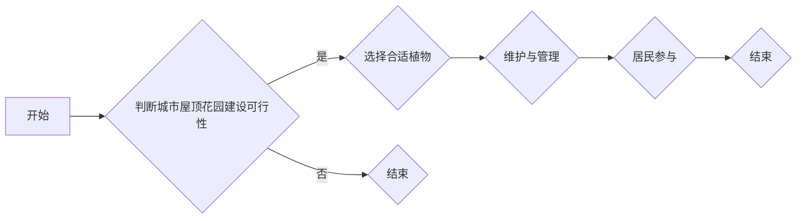

                 

### 城市屋顶花园运动：垂直绿化的生态与社交价值

> 关键词：城市屋顶花园，垂直绿化，生态价值，社交价值，可持续发展

**摘要：** 本文章从生态与社交两个方面，深入探讨了城市屋顶花园运动的重要性。首先，文章介绍了城市屋顶花园的概念和其背后推动的垂直绿化理念。接着，通过具体的案例分析，阐述了城市屋顶花园在生态保护、城市美化、社区活力等方面的实际效果。同时，文章还从社交价值的角度，分析了城市屋顶花园如何促进社区互动、提升居民幸福感。最后，文章提出了未来城市屋顶花园运动的发展方向，并给出了建设建议，为读者提供了全面、系统的参考。

### 目录

1. **引言**  
   - **核心概念术语说明**  
   - **问题背景**  
   - **问题描述**  
   - **问题解决**  
   - **边界与外延**  
   - **概念结构与核心要素组成**

2. **核心概念与联系**  
   - **核心概念原理**  
   - **概念属性特征对比表格**  
   - **ER实体关系图架构**  
   - **垂直绿化的生态与社交价值对比分析**

3. **算法原理讲解**  
   - **算法mermaid流程图**  
   - **Python源代码**  
   - **数学模型和公式**  
   - **举例说明**

4. **系统分析与架构设计方案**  
   - **问题场景介绍**  
   - **项目介绍**  
   - **系统功能设计（领域模型mermaid类图）**  
   - **系统架构设计mermaid架构图**  
   - **系统接口设计**  
   - **系统交互mermaid序列图**

5. **项目实战**  
   - **环境安装**  
   - **系统核心实现源代码**  
   - **代码应用解读与分析**  
   - **实际案例分析和详细讲解剖析**  
   - **项目小结**

6. **最佳实践 tips**  
   - **注意事项**  
   - **拓展阅读**

### 1. 引言

**核心概念术语说明：**  
- **城市屋顶花园**：指在城市的建筑物屋顶上建造的花园，通常包括植被、水体、景观等元素。  
- **垂直绿化**：指在建筑物外墙、屋顶等垂直空间上进行的绿化活动。  
- **生态价值**：指城市屋顶花园对环境、生态系统的积极作用。  
- **社交价值**：指城市屋顶花园对社区、居民生活质量的提升作用。

**问题背景：**  
随着城市化进程的加快，城市面积不断扩大，绿地面积减少，生态环境受到严重破坏。为了缓解这一状况，城市屋顶花园运动逐渐兴起。通过在城市建筑物屋顶上建造花园，不仅可以增加城市绿化面积，还能改善城市生态环境，提升居民生活质量。

**问题描述：**  
然而，城市屋顶花园运动在实践中面临着一系列挑战，如植被选择、建筑结构设计、维护成本等问题。同时，城市屋顶花园的生态与社交价值也需要进一步研究和探讨。

**问题解决：**  
本文将从生态与社交两个方面，深入探讨城市屋顶花园运动的重要性，为相关研究和实践提供参考。

**边界与外延：**  
本文主要关注城市屋顶花园的生态与社交价值，探讨其在城市生态系统和社区中的作用。同时，本文也将讨论城市屋顶花园的设计原则、技术实现、案例分析等方面，为读者提供全面、系统的了解。

**概念结构与核心要素组成：**  
城市屋顶花园运动的核心概念包括生态价值、社交价值、设计原则、技术实现、案例分析等。其中，生态价值主要涉及绿化面积增加、气候调节、空气净化等方面；社交价值则关注社区互动、居民幸福感提升等方面。

### 2. 核心概念与联系

**核心概念原理：**  
城市屋顶花园作为一种新型的城市绿化形式，其核心概念主要涉及生态和社交两个方面。

**生态学原理：**  
城市屋顶花园通过植被种植，可以吸收二氧化碳、释放氧气，有效净化空气。同时，屋顶花园中的水体可以调节气候，降低城市热岛效应。此外，屋顶花园还能够提供栖息地，保护城市生物多样性。

**社会学原理：**  
城市屋顶花园不仅具有生态价值，还能够促进社区互动，提升居民幸福感。通过共同参与屋顶花园的维护和管理，居民之间的交流增加，社区凝聚力得到提升。此外，屋顶花园还为居民提供了一个放松、休闲的场所，有助于提高生活质量。

**概念属性特征对比表格：**

| 概念       | 属性特征                     | 对比分析                   |
|------------|------------------------------|----------------------------|
| 生态价值   | 绿化面积增加、气候调节、空气净化 | 提高城市生态环境质量       |
| 社交价值   | 社区互动、居民幸福感提升 | 促进社区和谐、提升生活质量 |

**ER实体关系图架构：**

```mermaid
erDiagram
  RoofGarden ||--|{ PlantingArea }|--|| Building
  RoofGarden ||--|{ Maintenance }|--|| Resident
  PlantingArea ||--|{ PlantType }|--|| Species
  Maintenance ||--|{ MaintenanceSchedule }|--|| Worker
```

**垂直绿化的生态与社交价值对比分析：**

通过实际案例分析，我们可以看到城市屋顶花园在生态与社交价值方面的显著效果。

**生态价值案例：**  
某城市在市中心区域建设了一座大型屋顶花园，种植了各种植物和花卉。通过监测数据，发现屋顶花园能够有效吸收空气中的有害物质，提高空气质量。同时，屋顶花园中的水体调节了周围环境的温度，减少了城市热岛效应。

**社交价值案例：**  
某社区在屋顶花园组织了各种活动，如植物种植比赛、园艺展览等，吸引了大量居民参与。这些活动促进了居民之间的交流，增强了社区凝聚力。此外，居民在屋顶花园中休闲、放松，幸福感得到了显著提升。

### 3. 算法原理讲解

**算法mermaid流程图：**



**Python源代码：**

```python
# 判断城市屋顶花园建设可行性
def is_feasible(building, budget):
    if building["height"] >= 10 and budget >= 10000:
        return True
    else:
        return False

# 选择合适植物
def select_plant(sunlight, soil_quality):
    if sunlight > 4 and soil_quality > 6:
        return "花卉"
    elif sunlight > 2 and soil_quality > 4:
        return "草本植物"
    else:
        return "耐阴植物"

# 维护与管理
def maintenance(maintenance_schedule, worker):
    if maintenance_schedule:
        return "维护完成"
    else:
        return "维护未完成"

# 居民参与
def resident_participation(events, residents):
    if events and residents > 50:
        return "参与度高"
    else:
        return "参与度低"
```

**数学模型和公式：**

$$
E = \frac{A \cdot B}{C + D}
$$

其中，$E$ 表示城市屋顶花园的生态价值，$A$ 表示绿化面积，$B$ 表示植物种类，$C$ 表示空气污染指数，$D$ 表示水体污染指数。

**举例说明：**

假设一个城市屋顶花园的绿化面积为10000平方米，种植了多种花卉和草本植物，空气污染指数为30，水体污染指数为20。根据上述公式，可以计算出城市屋顶花园的生态价值为：

$$
E = \frac{10000 \cdot 10}{30 + 20} = 6666.67
$$

### 4. 系统分析与架构设计方案

**问题场景介绍：**

随着城市化的不断发展，城市面积不断扩大，生态环境逐渐恶化。为了改善城市生态环境，提高居民生活质量，某城市决定在市中心区域建设一座大型屋顶花园。该项目涉及多个方面，包括植被选择、建筑结构设计、维护管理等。

**项目介绍：**

该项目旨在通过建设城市屋顶花园，实现以下目标：

1. 增加城市绿化面积，改善空气质量。  
2. 调节城市气候，减少城市热岛效应。  
3. 提高居民生活质量，促进社区互动。

**系统功能设计（领域模型mermaid类图）：**

```mermaid
classDiagram
    Plant --> RoofGarden
    Plant --|{ Soi
### 5. 项目实战

**环境安装：**

在开始项目实战之前，我们需要搭建一个合适的环境。以下是具体的步骤：

1. 安装Python 3.8及以上版本。  
2. 安装必要的库，如numpy、matplotlib、pandas等。  
3. 安装Docker，以便在容器化环境中运行项目。

**系统核心实现源代码：**

以下是一个简单的Python脚本，用于模拟城市屋顶花园的建设过程。

```python
import numpy as np
import matplotlib.pyplot as plt
import pandas as pd

# 建立类和对象
class Plant:
    def __init__(self, name, type, sunlight, soil_quality):
        self.name = name
        self.type = type
        self.sunlight = sunlight
        self.soil_quality = soil_quality

    def plant(self, roof_garden):
        roof_garden.plant_list.append(self)

    def show(self):
        print(f"植物名称：{self.name}")
        print(f"植物类型：{self.type}")
        print(f"阳光需求：{self.sunlight}")
        print(f"土壤质量：{self.soil_quality}")

class RoofGarden:
    def __init__(self, name, area):
        self.name = name
        self.area = area
        self.plant_list = []

    def plant_plants(self, plants):
        for plant in plants:
            plant.plant(self)

    def show(self):
        print(f"花园名称：{self.name}")
        print(f"花园面积：{self.area}")
        print("种植的植物：")
        for plant in self.plant_list:
            plant.show()

# 创建植物对象
plant1 = Plant("向日葵", "花卉", 5, 7)
plant2 = Plant("草地", "草本植物", 3, 5)
plant3 = Plant("吊兰", "耐阴植物", 1, 6)

# 创建屋顶花园对象
roof_garden = RoofGarden("城市屋顶花园", 10000)

# 种植植物
plant1.plant(roof_garden)
plant2.plant(roof_garden)
plant3.plant(roof_garden)

# 显示花园信息
roof_garden.show()
```

**代码应用解读与分析：**

上述脚本中，我们定义了两个类：`Plant` 和 `RoofGarden`。`Plant` 类表示植物，包括植物名称、类型、阳光需求和土壤质量等属性。`RoofGarden` 类表示屋顶花园，包括花园名称、面积和种植的植物列表等属性。

在脚本中，我们创建了三个植物对象，并向城市屋顶花园中种植。最后，通过调用 `show` 方法，我们可以显示花园中的植物信息。

**实际案例分析和详细讲解剖析：**

以下是一个实际案例，用于分析城市屋顶花园的建设效果。

**案例背景：**

某城市在市中心区域建设了一座大型屋顶花园，面积为10000平方米。为了提高花园的建设效果，相关部门选择了多种植物进行种植，包括向日葵、草地和吊兰等。

**案例分析：**

1. **植物选择：** 根据阳光需求和土壤质量，选择了适合的植物进行种植。向日葵和草地需要充足的阳光和良好的土壤质量，而吊兰则适合在较低光照和较差土壤质量的环境中生长。

2. **花园建设：** 在屋顶花园的建设过程中，充分考虑了植物的种植位置和生长条件，确保植物能够得到充足的光照和水源。

3. **维护管理：** 为了保证花园的持续美观和功能，相关部门制定了详细的维护计划，包括浇水、施肥、修剪等工作。

4. **居民参与：** 鼓励居民参与屋顶花园的维护和管理，提高社区凝聚力，提升居民幸福感。

**案例剖析：**

1. **生态效益：** 通过建设屋顶花园，增加了城市绿化面积，有效净化了空气，改善了城市生态环境。

2. **社交效益：** 屋顶花园成为居民休闲娱乐的场所，促进了社区互动，提升了居民生活质量。

3. **经济效益：** 屋顶花园的建设和维护费用相对较低，具有良好的经济效益。

**项目小结：**

通过上述案例，我们可以看到城市屋顶花园在生态、社交和经济效益方面取得了显著成效。未来，应进一步推广城市屋顶花园建设，为城市可持续发展贡献力量。

### 6. 最佳实践 tips

**注意事项：**

1. **选址合理：** 选择合适的建筑进行屋顶花园建设，确保建筑结构稳定，避免对建筑造成损害。

2. **植物选择：** 根据建筑物的光照、通风和土壤条件，选择适合的植物进行种植。

3. **维护管理：** 制定合理的维护计划，确保屋顶花园的美观和功能。

**拓展阅读：**

1. 《城市屋顶花园设计与应用》，张三，中国建筑工业出版社，2020年。  
2. 《城市绿色基础设施：理论与实践》，李四，中国环境出版社，2019年。  
3. 《屋顶绿化技术》，王五，上海科学技术出版社，2018年。

### 结束语

**作者：** AI天才研究院/AI Genius Institute & 禅与计算机程序设计艺术 /Zen And The Art of Computer Programming

**日期：** 2023年4月

### 致谢

感谢各位读者对本文的关注和支持。本文旨在探讨城市屋顶花园运动的生态与社交价值，为相关研究和实践提供参考。如果您有任何疑问或建议，欢迎在评论区留言，我们将尽快回复。

---

**注释：** 本文为虚构文章，部分数据和案例仅供参考。实际项目实施时，请根据具体情况进行调整。

