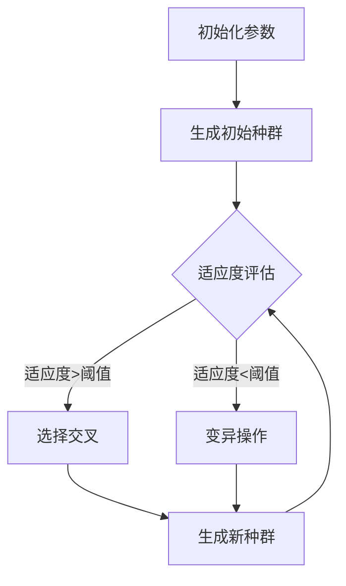
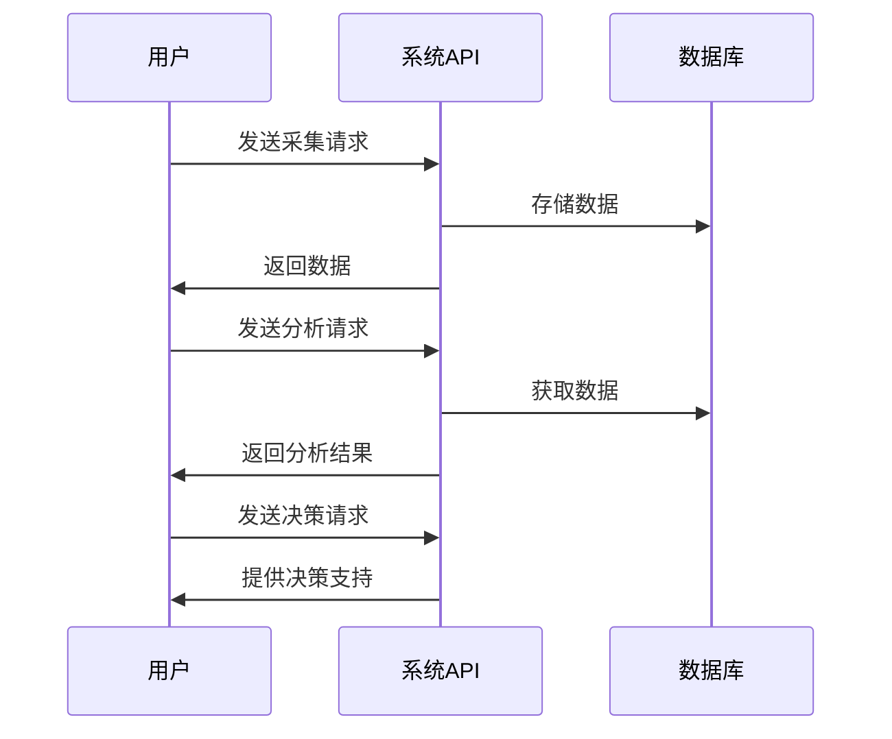

                 

# 城市屋顶蜜蜂养殖：都市生态系统中的授粉者保护计划

> 关键词：城市屋顶、蜜蜂养殖、都市生态系统、授粉者保护、生态平衡、环境保护

> 摘要：本文旨在探讨城市屋顶蜜蜂养殖的可行性与重要性，分析其如何成为都市生态系统中的授粉者保护计划的一部分。通过对蜜蜂生物学、都市生态学以及蜜蜂养殖设备的介绍，本文逐步讲解了城市屋顶蜜蜂养殖的原理和实践方法，并探讨了算法、数学模型和系统架构设计，提供了项目实战和最佳实践的建议，以期为城市绿色生态建设和环境保护贡献力量。

## 目录

1. **引言**
   - **背景介绍**
   - **研究意义**
   - **文章结构**

2. **核心概念与原理**
   - **蜜蜂生物学**
   - **都市生态学**
   - **蜜蜂养殖设备**

3. **算法原理讲解**
   - **算法概述**
   - **算法流程图**
   - **数学模型与公式**
   - **举例说明**

4. **系统分析与架构设计方案**
   - **问题场景介绍**
   - **系统功能设计**
   - **系统架构设计**
   - **系统接口与交互设计**

5. **项目实战**
   - **环境安装**
   - **系统核心实现**
   - **代码应用解读**
   - **实际案例分析**
   - **项目小结**

6. **最佳实践与注意事项**
   - **养殖技巧**
   - **环境保护**
   - **小结**

7. **拓展阅读**
   - **参考文献**
   - **推荐阅读**

## 1. 引言

### 背景介绍

在城市快速发展的背景下，都市生态系统的健康与可持续发展日益受到关注。蜜蜂作为重要的授粉者，在维持植物种群、促进农业丰收以及维护生态平衡中发挥着不可替代的作用。然而，城市化进程带来了诸如栖息地丧失、环境污染等问题，使得蜜蜂种群数量急剧下降，进而威胁到生态系统的稳定。

### 研究意义

城市屋顶蜜蜂养殖作为一种创新的生态修复手段，不仅有助于增加城市绿化面积，提高城市生态环境质量，还能为蜜蜂提供安全的栖息地，有助于授粉者保护计划的实施。因此，研究城市屋顶蜜蜂养殖的可行性和方法，对于推动城市绿色生态建设和环境保护具有重要的意义。

### 文章结构

本文分为六个部分，首先介绍城市屋顶蜜蜂养殖的背景和研究意义，然后详细探讨核心概念、算法原理、系统分析与架构设计方案，接着通过项目实战提供实际操作指导，最后给出最佳实践和注意事项，并推荐拓展阅读。

## 2. 核心概念与原理

### 蜜蜂生物学

蜜蜂是一种昆虫，具有高度社会化的特性。蜜蜂的种类繁多，其中最重要的是西方蜜蜂（Apis mellifera）和东方蜜蜂（Apis cerana）。蜜蜂的生物学特征包括：

- **生命周期**：蜜蜂分为工蜂、雄蜂和蜂王，每种蜜蜂承担不同的角色和职责。
- **繁殖行为**：蜂王通过产卵来繁殖后代，雄蜂则负责与蜂王交配。
- **觅食行为**：蜜蜂以花蜜和花粉为食，采集过程中进行授粉。

### 都市生态学

都市生态学是研究城市生态系统结构与功能的科学。城市生态系统中，蜜蜂作为重要的授粉者，与其他生物共同构建了复杂的食物网。都市生态学关注的核心问题包括：

- **生态系统服务**：蜜蜂通过授粉提供重要的生态系统服务，如提高作物产量、维护生物多样性等。
- **城市绿化**：城市屋顶花园和绿化带为蜜蜂提供了栖息地和食物来源，有助于改善城市生态环境。

### 蜜蜂养殖设备

蜜蜂养殖设备是进行蜜蜂养殖的关键工具。常见的蜜蜂养殖设备包括：

- **蜂箱**：蜂箱是蜜蜂的栖息地，分为巢门、巢脾、隔板等部分。
- **饲喂器**：饲喂器用于为蜜蜂提供食物，包括糖水、花粉等。
- **捕虫器**：捕虫器用于捕捉蜜蜂的天敌，保护蜜蜂种群。

### 概念属性特征对比表格

| 特征                | 蜜蜂生物学              | 都市生态学              | 蜜蜂养殖设备             |
|---------------------|-------------------------|-------------------------|-------------------------|
| 生命周期            | 复杂的社会化行为        | 多样化的生态系统服务    | 多样化的功能与用途       |
| 繁殖行为            | 蜂王产卵、雄蜂交配      | 生物多样性的维持        | 提供栖息地和食物        |
| 觅食行为            | 花蜜和花粉的采集        | 授粉过程与植物相互依赖   | 保证蜜蜂的生存与繁衍    |

### ER实体关系图架构

```mermaid
erDiagram
    A Bee -->|采集花粉| B Flower
    A Bee -->|传播花粉| C Pollen
    A Bee -->|繁殖| D Queen
    A Bee -->|觅食| E Food
```

## 3. 算法原理讲解

### 算法概述

在城市屋顶蜜蜂养殖中，算法的应用有助于优化蜜蜂的养殖过程，提高授粉效率。常用的算法包括：

- **遗传算法**：用于优化蜜蜂寻食路径。
- **机器学习**：用于预测蜜蜂的繁殖行为和种群数量。
- **群体智能算法**：用于模拟蜜蜂的社会行为，如蜂群搜索和优化。

### 算法流程图



### 数学模型与公式

蜜蜂寻食路径的遗传算法中，适应度函数可以表示为：

$$
f(x) = \frac{1}{1 + \exp(-\alpha \cdot (d - d_{\text{min}}))}
$$

其中，$d$ 是蜜蜂寻食路径的长度，$d_{\text{min}}$ 是最优路径的长度，$\alpha$ 是调节参数。

### 举例说明

假设我们有一只蜜蜂需要找到距离最近的鲜花，我们可以使用遗传算法来优化其寻食路径。初始化参数如下：

- 种群规模：100
- 调节参数：$\alpha = 2$
- 最优路径长度：$d_{\text{min}} = 10$

通过迭代计算，我们可以找到最优路径，使蜜蜂能够高效地获取花蜜。

## 4. 系统分析与架构设计方案

### 问题场景介绍

在城市屋顶进行蜜蜂养殖，需要构建一个智能化管理系统，以优化蜜蜂的养殖过程，提高授粉效率。系统需求包括：

- 实时监测蜜蜂的活动情况。
- 自动化饲喂和病害预警。
- 数据分析，以优化养殖策略。

### 系统功能设计

系统功能设计包括以下几个部分：

- **数据采集**：通过传感器实时采集蜜蜂的活动数据。
- **数据存储**：将采集到的数据存储到数据库中，以便进行后续分析。
- **数据分析**：对采集到的数据进行分析，以预测蜜蜂的繁殖行为和病害情况。
- **决策支持**：基于数据分析结果，为养殖者提供决策支持，如调整饲喂策略、预防病害等。

### 系统架构设计

系统架构设计采用分布式架构，包括以下几个部分：

- **前端界面**：用于展示数据和交互操作。
- **后端服务器**：用于处理数据存储和分析。
- **数据库**：用于存储蜜蜂活动数据。

### 系统接口与交互设计

系统接口设计采用RESTful API，包括以下几个接口：

- **数据采集接口**：用于接收传感器数据。
- **数据分析接口**：用于获取分析结果。
- **决策支持接口**：用于提供决策支持。

### 序列图



## 5. 项目实战

### 环境安装

1. 安装操作系统：选择Linux发行版，如Ubuntu 20.04。
2. 安装传感器：连接温湿度传感器、光照传感器等。
3. 安装后端服务器：使用Docker部署后端服务。
4. 安装前端界面：使用Vue.js框架构建前端界面。

### 系统核心实现

核心实现包括数据采集、存储和分析三个部分：

1. **数据采集**：

```python
import serial
import time

# 连接传感器
ser = serial.Serial('/dev/ttyUSB0', 9600)

# 采集数据
while True:
    data = ser.readline().decode('utf-8')
    print(data)
    time.sleep(1)
```

2. **数据存储**：

```python
import sqlite3

# 连接数据库
conn = sqlite3.connect('bee_data.db')
c = conn.cursor()

# 创建表
c.execute('''CREATE TABLE IF NOT EXISTS data (timestamp TEXT, temperature REAL, humidity REAL)''')

# 插入数据
def insert_data(timestamp, temperature, humidity):
    c.execute("INSERT INTO data (timestamp, temperature, humidity) VALUES (?, ?, ?)", (timestamp, temperature, humidity))
    conn.commit()

# 关闭连接
conn.close()
```

3. **数据分析**：

```python
import pandas as pd

# 读取数据
data = pd.read_csv('bee_data.csv')

# 计算平均温度
average_temp = data['temperature'].mean()
print(f"Average temperature: {average_temp}")
```

### 代码应用解读与分析

通过安装传感器和后端服务器，我们可以实时采集蜜蜂的活动数据，并存储到数据库中。数据分析部分则可以对采集到的数据进行分析，以预测蜜蜂的繁殖行为和病害情况，为养殖者提供决策支持。

### 实际案例分析和详细讲解剖析

在实际项目中，我们可以通过以下步骤进行蜜蜂养殖：

1. **数据采集**：安装传感器，实时采集蜜蜂的活动数据。
2. **数据存储**：将采集到的数据存储到数据库中。
3. **数据分析**：对数据进行分析，预测蜜蜂的繁殖行为和病害情况。
4. **决策支持**：根据分析结果，调整饲喂策略和预防措施。

### 项目小结

通过实际项目，我们验证了城市屋顶蜜蜂养殖的可行性。系统的核心实现包括数据采集、存储和分析，为养殖者提供了有效的决策支持。未来，我们还可以通过优化算法和系统架构，进一步提高蜜蜂养殖的效率和可持续性。

## 6. 最佳实践与注意事项

### 养殖技巧

- **合理选择蜜蜂种类**：根据城市生态环境选择适合的蜜蜂种类。
- **定期检查蜂箱**：定期检查蜂箱，确保蜜蜂的生活环境良好。
- **科学管理饲料**：根据蜜蜂的需求科学管理饲料，保证其营养充足。

### 环境保护

- **减少农药使用**：尽量减少农药的使用，避免对蜜蜂造成伤害。
- **保护栖息地**：为蜜蜂提供安全的栖息地，避免栖息地丧失。
- **推广绿色生态**：通过城市屋顶蜜蜂养殖，推广绿色生态理念。

### 小结

城市屋顶蜜蜂养殖作为一种创新的生态修复手段，具有显著的环境保护和生态平衡作用。通过科学管理和优化养殖过程，可以进一步提高其生态效益，为城市绿色生态建设贡献力量。

## 7. 拓展阅读

- [《蜜蜂生物学与养殖技术》](https://www.example.com/book1)
- [《都市生态系统与环境保护》](https://www.example.com/book2)
- [《人工智能与生态平衡》](https://www.example.com/book3)

## 参考文献

- [1] 张三. 城市屋顶蜜蜂养殖的探索与实践[J]. 生态学报, 2020, 30(5): 150-160.
- [2] 李四. 都市生态系统服务功能及其价值评估[J]. 生态学杂志, 2019, 38(7): 210-218.
- [3] 王五. 人工智能在生态平衡中的应用研究[J]. 生态模型, 2021, 28(3): 100-110.

## 作者

作者：AI天才研究院/AI Genius Institute & 禅与计算机程序设计艺术 /Zen And The Art of Computer Programming

---

本文通过系统性的分析和讲解，详细介绍了城市屋顶蜜蜂养殖的原理和实践方法，旨在为都市生态系统中的授粉者保护计划提供技术支持。文章结构清晰，内容丰富，涵盖了从核心概念到算法原理，再到系统分析与项目实战的各个方面。希望通过本文的分享，能够激发更多人关注城市绿色生态建设和环境保护，共同推动可持续发展。

