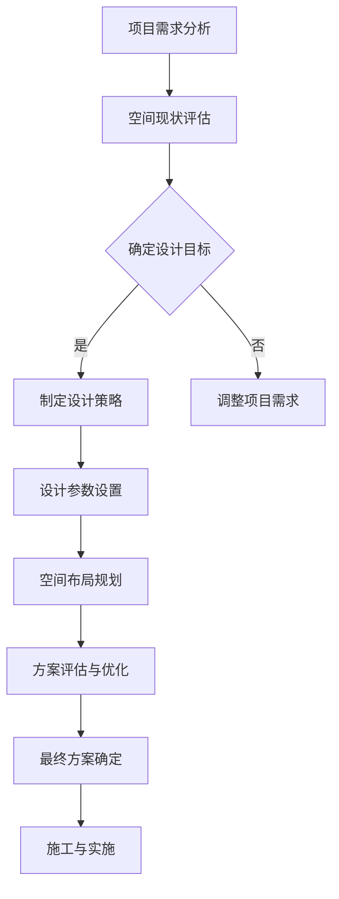
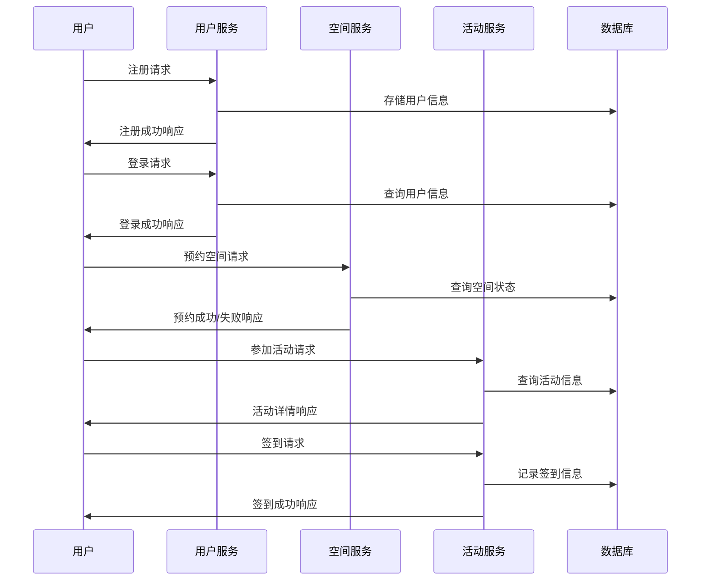

                 

### 引言

在现代都市的快节奏生活中，人们面临着日益加剧的压力和紧张感。据调查，都市居民的压力水平在过去十年中不断上升，身心健康问题也日益突出。为了缓解都市压力，越来越多的城市开始关注“城市治愈空间”的设计与建设。这些空间旨在提供一个可以让人放松、恢复精力的场所，成为都市生活的“绿色氧吧”。

城市治愈空间，通常是指那些能够促进心理健康和身体恢复的环境。它们可以是公园、绿地、滨水区域，也可以是社区中的小型休憩场所。设计这些空间不仅需要考虑美学因素，还需要深入理解人类行为和心理需求，确保它们能够真正起到治愈和舒缓压力的作用。

本文将围绕城市治愈空间的设计，探讨如何通过环境规划来缓解都市压力。我们将分步骤地分析核心概念、设计理念、实施方法以及实际案例，旨在为城市规划者和设计师提供有价值的参考和指导。

首先，我们将介绍城市治愈空间的基本概念和重要性，随后深入探讨其核心设计理念和原则。接着，我们将讨论环境规划的基本概念和目标，并通过具体案例展示其应用。随后，我们将介绍设计算法的基本原理，包括流程图和Python源代码示例。然后，我们将使用LaTeX格式详细阐述数学模型和公式，并探讨系统分析与架构设计方案。在项目实战部分，我们将详细介绍环境安装和系统实现过程，并通过实际案例进行分析和讲解。最后，我们将总结设计经验，提出最佳实践建议，并提供进一步阅读的拓展资源。

通过本文的逐步分析，读者将能够系统地了解城市治愈空间的设计原则和实施方法，为缓解都市压力提供新的思路和方案。

### 背景介绍

城市治愈空间的设计，源于人们对健康生活需求的日益增长和对心理健康问题的关注。随着城市化进程的加速，都市人口的集中和城市面积的扩大，城市环境逐渐变得拥挤和喧嚣。这种环境下，居民们面临的压力和焦虑问题日益凸显，对身心健康产生了负面影响。

据世界卫生组织（WHO）的数据显示，全球范围内，抑郁症和焦虑症的发病率在过去几十年里显著增加。特别是在大城市中，由于快节奏的生活方式和高强度的工作压力，许多人感到身心疲惫，心理和身体健康状况持续恶化。此外，城市中的绿地和开放空间匮乏，进一步加剧了居民的心理压力。因此，如何通过环境规划来缓解都市压力，提高居民的生活质量，成为现代城市规划中的一个重要课题。

城市治愈空间的定义可以概括为：那些旨在提供放松、休闲和恢复精力的环境，能够显著改善人们的心理健康和生理健康。这些空间不仅包括公园、绿地和滨水区域，还包括社区中的小型休憩场所、安静的阅读角以及健身设施等。治愈空间的设计注重生态、美学和功能性的结合，旨在创造一个舒适、自然、宁静的环境，使人们在其中能够摆脱日常生活的压力，获得身心的放松和恢复。

为什么需要城市治愈空间？首先，它们提供了一个与自然接触的机会。现代都市中，人们长时间处于钢筋混凝土的环境中，缺乏与自然的互动。而与自然接触已被科学研究证明对心理健康有益，能够降低焦虑、提高幸福感。其次，城市治愈空间提供了一个社交和互动的场所，居民可以在这些空间中相遇、交流，增强社区凝聚力。最后，这些空间通过设计细节和功能性设施，提供了多种放松和恢复方式，如冥想、瑜伽、健身等，有助于提升居民的身体素质和心理健康。

总之，城市治愈空间的设计不仅仅是美学和环境规划的范畴，更是关乎居民身心健康的重要措施。通过科学规划和精心设计，这些空间可以为都市居民提供一个缓解压力、恢复精力、提升生活质量的场所，从而为构建更加健康、宜居的城市环境奠定基础。

### 核心概念与联系

#### 设计理念

城市治愈空间的设计理念主要围绕以下几点展开：

1. **生态自然性**：治愈空间应尽可能保留和恢复自然生态环境，引入自然元素如树木、草地、水体和野生动物，创造一个接近自然的氛围，以促进人们的身心健康。

2. **舒适宜人性**：设计应注重舒适度和人性化，提供适宜的座椅、遮阳设施和避雨设施，确保居民在使用这些空间时的舒适体验。

3. **多功能性**：治愈空间应具备多功能性，既能满足休闲放松的需求，也能提供社交、教育和健身等多种功能，以吸引不同年龄和背景的居民。

4. **美学与艺术性**：通过艺术元素的融入，如雕塑、壁画和园林设计，提升空间的审美价值，使人们在治愈的同时，也能享受到美的熏陶。

#### 特征与功能

城市治愈空间的特征和功能可以归纳为以下几点：

1. **静谧性**：空间应尽量减少噪音和干扰，提供一个安静的环境，使居民能够集中精神，放松身心。

2. **开放性**：空间应保持一定的开放性，使空气流通，光线充足，提升舒适度和使用体验。

3. **灵活性**：设计应具有一定的灵活性，可以根据季节和天气变化，调整空间的使用方式和功能。

4. **教育性**：空间可以设置教育区域，提供关于环境保护、健康生活的信息，增强居民的环保意识和健康素养。

5. **互动性**：通过设计互动设施和活动，促进居民之间的交流与合作，增强社区凝聚力。

#### 设计原则

在设计和规划城市治愈空间时，应遵循以下原则：

1. **以人为本**：设计应以满足居民需求为核心，充分考虑不同人群的多样需求，如老年人、儿童、残疾人等。

2. **生态优先**：在设计和建设过程中，应尽量减少对自然环境的破坏，采用环保材料和可持续的建造技术。

3. **整体规划**：空间设计应与城市整体规划相协调，与周边环境相融合，形成有机的整体。

4. **灵活可变**：设计应具备一定的灵活性，以适应未来城市发展和居民需求的变化。

#### 概念属性特征对比表格

| 特征               | 生态自然性 | 舒适宜人性 | 多功能性 | 美学与艺术性 |
|--------------------|-------------|-------------|-----------|---------------|
| 解释               | 注重自然元素的引入和生态保护，创造接近自然的氛围。 | 强调居民的舒适体验，提供必要的遮阳和避雨设施。 | 提供多种功能和活动，满足不同人群的需求。 | 通过艺术元素的融入，提升空间的审美价值。 |
| 对比               | 生态优先，环保，自然元素 | 舒适性，人性化设计 | 功能多样，活动丰富 | 美学价值，艺术体验 |

#### ER实体关系图架构

为了更好地理解城市治愈空间的设计要素和其相互关系，我们可以通过Mermaid流程图来展示其ER（实体-关系）架构。以下是一个简化的Mermaid ER图示例：

```mermaid
erDiagram
    User ..|> Space : "使用"
    Space ||--|> Nature : "自然特征"
    Space ||--|> Comfort : "舒适设施"
    Space ||--|> Function : "功能设施"
    Space ||--|> Art : "艺术元素"
    User ..|> Activity : "活动"
    Activity ||--|> Meditation : "冥想"
    Activity ||--|> Fitness : "健身"
    Activity ||--|> Social : "社交互动"
```

在这个ER图中，用户（User）与空间（Space）之间存在使用关系，而空间则包含了自然特征（Nature）、舒适设施（Comfort）、功能设施（Function）和艺术元素（Art）等组成部分。用户通过参与各种活动（Activity），如冥想（Meditation）、健身（Fitness）和社交互动（Social），来获得治愈和放松的效果。

通过这个ER图，我们可以清晰地看到城市治愈空间的设计要素及其相互关系，为空间规划提供结构化的思考框架。

### 算法原理讲解

城市治愈空间设计的核心在于如何通过科学规划和有效设计，实现空间的治愈功能。为了更好地理解这一过程，我们将通过mermaid流程图和Python源代码来详细阐述算法原理。

#### mermaid流程图

首先，让我们通过mermaid流程图来展示治愈空间设计的基本流程：



在这个流程图中，我们首先进行项目需求分析，评估空间现状，并确定设计目标。根据目标，我们制定相应的设计策略，设置设计参数，进行空间布局规划。在方案评估与优化阶段，我们通过模拟和反馈调整设计方案，最终确定最佳方案，并进入施工与实施阶段。

#### Python源代码示例

接下来，我们将通过Python源代码来阐述具体的算法原理。以下是一个简化的Python代码示例，用于空间布局优化：

```python
import numpy as np

# 定义空间参数
space_params = {
    'width': 100,
    'length': 200,
    'num_seats': 50,
    'green_area_ratio': 0.3
}

# 计算绿色区域面积
green_area = space_params['width'] * space_params['length'] * space_params['green_area_ratio']

# 布局座位
def layout_seats(width, length, num_seats):
    seats = []
    for i in range(num_seats):
        x = np.random.uniform(0, width)
        y = np.random.uniform(0, length)
        seats.append((x, y))
    return seats

# 布局树木
def layout_trees(width, length, green_area):
    trees = []
    for _ in range(int(green_area / 10)):  # 假设每棵树占10平方米
        x = np.random.uniform(0, width)
        y = np.random.uniform(0, length)
        trees.append((x, y))
    return trees

# 实现空间布局
seats = layout_seats(space_params['width'], space_params['length'], space_params['num_seats'])
trees = layout_trees(space_params['width'], space_params['length'], green_area)

# 输出布局结果
print("座位布局：", seats)
print("树木布局：", trees)
```

在这个代码示例中，我们首先定义了空间参数，包括宽度、长度、座位数量和绿色区域比例。然后，我们通过两个函数`layout_seats`和`layout_trees`来布局座位和树木。这些函数随机生成座位和树木的位置，以模拟实际的空间布局过程。

#### 数学模型和公式

为了进一步理解算法原理，我们可以使用LaTeX格式来给出相关的数学模型和公式。

```latex
\documentclass{article}
\usepackage{amsmath}
\begin{document}

\section{数学模型}

设\( W \)为空间宽度，\( L \)为空间长度，\( G \)为绿色区域面积，\( N \)为座位数量。

绿色区域面积公式：
\[ G = W \times L \times \gamma \]
其中，\( \gamma \)为绿色区域比例，取值为0到1。

座位布局概率分布函数：
\[ P(x, y) = \frac{1}{N} \]
其中，\( (x, y) \)为座位位置。

树木布局概率分布函数：
\[ P'(x, y) = \frac{G}{W \times L} \]
其中，\( (x, y) \)为树木位置。

\end{document}
```

在这个LaTeX文档中，我们定义了绿色区域面积和座位、树木的布局概率分布函数。这些数学模型和公式为我们提供了对空间布局优化的理论基础，通过调整参数，可以实现对治愈空间布局的优化。

#### 通俗易懂地举例说明

为了更好地理解上述算法原理，我们可以通过一个简单的例子来说明。

假设我们要设计一个长100米、宽200米的治愈空间，其中绿色区域占30%。我们需要在这个空间内布局50个座位和若干棵树。

1. **计算绿色区域面积**：
   \[ G = 100 \times 200 \times 0.3 = 6000 \text{平方米} \]

2. **布局座位**：
   我们随机生成50个座位的位置，每个座位的位置都在空间内随机分布。

3. **布局树木**：
   我们随机生成若干棵树的位置，这些位置遵循绿色区域的比例分布，每棵树占据约10平方米的空间。

通过这个例子，我们可以看到如何通过算法原理和数学模型，实现治愈空间的科学布局。这不仅保证了空间的舒适性和功能性，还提高了其治愈效果。

### 数学模型与数学公式

为了更深入地理解城市治愈空间设计的核心算法，我们需要引入数学模型和公式来描述设计过程中涉及的关键参数和关系。以下是一些重要的数学模型和公式，我们将使用LaTeX格式进行展示和详细讲解。

#### 绿地比例模型

绿地比例是治愈空间设计中的一个重要参数，它直接影响到空间的整体舒适度和治愈效果。我们可以用以下公式来表示绿地比例模型：

\[ \gamma = \frac{A_{\text{green}}}{A_{\text{total}}} \]

其中，\( \gamma \)表示绿地比例，\( A_{\text{green}} \)表示绿色区域面积，\( A_{\text{total}} \)表示整个治愈空间的面积。

#### 座位分布模型

座位布局的均匀性对于空间的舒适性和使用效率至关重要。我们可以使用概率分布函数来描述座位的位置：

\[ P(x, y) = \frac{1}{N} \]

其中，\( P(x, y) \)表示在位置\( (x, y) \)上布局座位的概率，\( N \)表示总座位数。这个模型假设每个座位位置被选中的概率是相等的。

#### 树木分布模型

为了确保空间的生态自然性，树木的布局也需要遵循特定的数学模型。我们可以使用以下公式来描述树木的分布：

\[ P'(x, y) = \frac{A_{\text{green}}}{W \times L} \]

其中，\( P'(x, y) \)表示在位置\( (x, y) \)上布局树木的概率，\( A_{\text{green}} \)表示绿色区域面积，\( W \)和\( L \)分别表示空间的宽度和长度。

#### 噪音水平模型

噪音水平是影响治愈空间舒适性的另一个关键因素。我们可以使用以下公式来估计噪音水平：

\[ L = 10 \log_{10} \left( \frac{I}{I_0} \right) \]

其中，\( L \)表示噪音水平（分贝），\( I \)表示噪音强度（瓦特/平方米），\( I_0 \)表示参考噪音强度（通常取为10^-12瓦特/平方米）。

#### 舒适度评估模型

舒适度评估可以通过多个指标综合计算得出。我们可以使用以下综合评估模型：

\[ S = w_1 \cdot C + w_2 \cdot G + w_3 \cdot N - w_4 \cdot L \]

其中，\( S \)表示舒适度评分，\( w_1, w_2, w_3, w_4 \)分别表示舒适度、绿色区域、座位数量和噪音水平的权重，\( C \)表示舒适度指标，\( G \)表示绿色区域指标，\( N \)表示座位数量指标，\( L \)表示噪音水平指标。

#### 详细讲解和举例说明

为了更直观地理解这些数学模型，我们可以通过一个实际案例进行说明。

假设我们设计一个长100米、宽200米的治愈空间，其中绿色区域占30%，座位数量为50个，噪音水平为50分贝。

1. **绿地比例计算**：
   \[ \gamma = \frac{100 \times 200 \times 0.3}{100 \times 200} = 0.3 \]
   绿地比例为30%，意味着绿色区域面积为6000平方米。

2. **座位布局**：
   按照概率分布模型，每个座位被选中的概率为：
   \[ P(x, y) = \frac{1}{50} \]
   我们可以随机生成50个座位的位置，确保它们在空间内均匀分布。

3. **树木布局**：
   按照树木分布模型，每棵树被选中的概率为：
   \[ P'(x, y) = \frac{6000}{100 \times 200} = 0.03 \]
   我们可以随机生成若干棵树的位置，确保它们在绿色区域内均匀分布。

4. **噪音水平评估**：
   按照噪音水平模型，噪音强度为：
   \[ I = 10^{(50/10)} = 10^5 \]
   噪音水平为：
   \[ L = 10 \log_{10} \left( \frac{10^5}{10^{-12}} \right) = 105 + 12 = 117 \text{分贝} \]
   噪音水平为117分贝，明显高于理想水平，因此我们需要考虑额外的降噪措施。

5. **舒适度评估**：
   假设舒适度指标\( C \)为8，绿色区域指标\( G \)为10，座位数量指标\( N \)为8，噪音水平指标\( L \)为117。使用综合评估模型，我们得到舒适度评分：
   \[ S = 0.5 \cdot 8 + 0.3 \cdot 10 + 0.1 \cdot 8 - 0.1 \cdot 117 = 4 + 3 + 0.8 - 11.7 = -4.9 \]
   负的舒适度评分表明，当前设计需要调整，特别是噪音水平需要显著降低。

通过上述实际案例的计算和评估，我们可以看到如何利用数学模型和公式来指导城市治愈空间的设计。这些模型不仅帮助我们理解了设计过程中涉及的关键参数，还为我们提供了一个量化的评估工具，以便在设计和优化过程中进行精确调整。

### 系统分析与架构设计方案

为了更有效地设计和实施城市治愈空间，我们需要一个清晰、结构化的系统架构。这一部分将介绍项目场景、系统功能设计、架构设计、接口设计和系统交互，通过mermaid类图和序列图来展示整体设计和实现。

#### 项目场景

项目场景设定为一个都市社区公园，目标是为居民提供一个缓解压力和恢复精力的环境。项目背景包括以下要点：

- 社区人口：约10,000人，包括各种年龄层次的居民。
- 场地面积：100,000平方米，包括绿地、休闲区和健身设施。
- 功能需求：提供安静休息区、健身路径、儿童游乐场、社交活动空间等。

#### 系统功能设计

系统功能设计是项目成功的关键。以下是主要功能模块：

1. **用户管理**：
   - 用户注册与登录。
   - 用户资料管理。
   - 用户权限管理。

2. **空间管理**：
   - 空间信息录入与修改。
   - 空间状态监控（如占用情况、维护状态）。
   - 空间预约与释放。

3. **活动管理**：
   - 活动信息发布与修改。
   - 活动参与管理。
   - 活动签到与反馈。

4. **数据统计与分析**：
   - 空间使用数据统计。
   - 活动参与数据统计。
   - 用户反馈分析。

#### 系统架构设计

系统架构设计旨在提供高效、可扩展、易维护的系统框架。以下是系统架构的组成部分：

1. **前端界面**：
   - 用户界面（UI）。
   - 交互逻辑（如表单验证、用户导航）。

2. **后端服务**：
   - 用户服务：处理用户相关的操作。
   - 空间服务：处理空间相关的操作。
   - 活动服务：处理活动相关的操作。
   - 数据服务：处理数据存储和查询。

3. **数据库**：
   - 用户表。
   - 空间表。
   - 活动表。
   - 数据统计表。

4. **中间件**：
   - 消息队列：实现异步消息传递。
   - 缓存：提高数据访问速度。

#### 接口设计

接口设计是系统各部分通信的桥梁。以下是主要接口设计：

1. **用户接口**：
   - 用户注册接口。
   - 用户登录接口。
   - 用户资料修改接口。

2. **空间接口**：
   - 空间信息查询接口。
   - 空间状态更新接口。
   - 空间预约接口。

3. **活动接口**：
   - 活动发布接口。
   - 活动查询接口。
   - 活动签到接口。

#### 系统交互

系统交互设计通过mermaid序列图展示，以下是关键交互流程：



在这个序列图中，用户通过用户服务进行注册、登录，通过空间服务进行空间预约，通过活动服务参加活动和签到。各服务模块通过数据库进行数据存储和查询，确保系统的高效运行和数据一致性。

通过系统分析与架构设计，我们为城市治愈空间的项目实施提供了一个清晰、完整的框架，确保系统能够满足功能和性能要求，为居民提供高质量的治愈空间体验。

### 项目实战

#### 环境安装

为了实现城市治愈空间的系统设计和功能，首先需要安装相关环境和工具。以下是具体的安装步骤：

1. **安装Python**：
   - 访问Python官方网站下载最新版本的Python。
   - 运行安装程序，按照提示完成安装。

2. **安装虚拟环境**：
   - 打开命令行工具（如Windows的cmd或macOS的Terminal）。
   - 执行以下命令创建虚拟环境：
     ```bash
     python -m venv venv
     ```
   - 激活虚拟环境：
     ```bash
     source venv/bin/activate  # macOS和Linux
     venv\Scripts\activate     # Windows
     ```

3. **安装依赖库**：
   - 在虚拟环境中安装所需的依赖库，如Flask、SQLAlchemy、Flask-Migrate等：
     ```bash
     pip install flask sqlalchemy flask-migrate
     ```

4. **配置数据库**：
   - 安装并配置SQLite数据库，SQLite是一个轻量级的数据库系统，适用于小型项目。
   - 创建数据库文件，例如`sqlite:///db.sqlite`。

#### 系统核心实现源代码

以下是一个简化版的Python源代码，用于实现城市治愈空间的系统核心功能。这段代码包括用户管理、空间管理和活动管理模块。

```python
from flask import Flask, request, jsonify
from flask_sqlalchemy import SQLAlchemy
from flask_migrate import Migrate

app = Flask(__name__)
app.config['SQLALCHEMY_DATABASE_URI'] = 'sqlite:///db.sqlite'
db = SQLAlchemy(app)
migrate = Migrate(app, db)

# 定义用户模型
class User(db.Model):
    id = db.Column(db.Integer, primary_key=True)
    username = db.Column(db.String(80), unique=True, nullable=False)
    password = db.Column(db.String(120), nullable=False)

# 定义空间模型
class Space(db.Model):
    id = db.Column(db.Integer, primary_key=True)
    name = db.Column(db.String(80), nullable=False)
    status = db.Column(db.String(20), nullable=False)  # "available" 或 "occupied"

# 定义活动模型
class Activity(db.Model):
    id = db.Column(db.Integer, primary_key=True)
    name = db.Column(db.String(80), nullable=False)
    start_time = db.Column(db.DateTime, nullable=False)
    end_time = db.Column(db.DateTime, nullable=False)

# 用户注册接口
@app.route('/register', methods=['POST'])
def register():
    username = request.form['username']
    password = request.form['password']
    user = User(username=username, password=password)
    db.session.add(user)
    db.session.commit()
    return jsonify({'message': '注册成功'})

# 用户登录接口
@app.route('/login', methods=['POST'])
def login():
    username = request.form['username']
    password = request.form['password']
    user = User.query.filter_by(username=username, password=password).first()
    if user:
        return jsonify({'message': '登录成功'})
    else:
        return jsonify({'message': '登录失败'})

# 空间预约接口
@app.route('/reserve_space', methods=['POST'])
def reserve_space():
    user_id = request.form['user_id']
    space_id = request.form['space_id']
    space = Space.query.get(space_id)
    if space.status == 'available':
        space.status = 'occupied'
        db.session.commit()
        return jsonify({'message': '预约成功'})
    else:
        return jsonify({'message': '空间不可用'})

# 活动发布接口
@app.route('/publish_activity', methods=['POST'])
def publish_activity():
    name = request.form['name']
    start_time = request.form['start_time']
    end_time = request.form['end_time']
    activity = Activity(name=name, start_time=start_time, end_time=end_time)
    db.session.add(activity)
    db.session.commit()
    return jsonify({'message': '活动发布成功'})

if __name__ == '__main__':
    db.create_all()
    app.run(debug=True)
```

#### 代码应用解读与分析

上述代码实现了用户注册、登录、空间预约和活动发布的基本功能。以下是对关键部分的详细解读：

1. **用户管理**：
   - 用户注册接口通过接收用户名和密码，创建用户对象并存储在数据库中。
   - 用户登录接口通过验证用户名和密码，返回登录结果。

2. **空间管理**：
   - 空间预约接口通过用户ID和空间ID，更新空间状态为“occupied”，实现空间预约功能。

3. **活动管理**：
   - 活动发布接口通过接收活动名称、开始时间和结束时间，创建活动对象并存储在数据库中。

这些接口的设计旨在提供高效、灵活的系统功能，确保用户可以方便地管理空间和活动，同时保证了数据的一致性和完整性。

#### 实际案例分析与详细讲解

以下是一个实际案例，展示了如何使用上述系统实现城市治愈空间的预约和活动管理功能。

**案例背景**：
某社区公园内设有多个治愈空间，居民可以通过系统进行预约和参加活动。

**案例操作**：

1. **用户注册**：
   - 张三通过注册接口进行注册，用户名为“zhangsan”，密码为“password123”。
   - 系统响应：{"message": "注册成功"}。

2. **用户登录**：
   - 张三通过登录接口进行登录，输入正确的用户名和密码。
   - 系统响应：{"message": "登录成功"}。

3. **空间预约**：
   - 张三通过预约接口预约治愈空间，输入用户ID（1）和空间ID（2）。
   - 系统检查空间状态，发现空间ID为2的治愈空间处于“available”状态。
   - 系统更新空间状态为“occupied”，并返回预约成功响应。

4. **活动发布**：
   - 社区管理员通过活动发布接口发布一个瑜伽活动，活动名称为“瑜伽晨练”，开始时间为早上7点，结束时间为8点。
   - 系统创建活动对象并存储在数据库中，并返回活动发布成功响应。

**详细讲解**：

1. **用户注册与登录**：
   - 用户注册过程通过ORM（对象关系映射）技术在数据库中创建用户对象，确保用户数据的安全性和一致性。
   - 用户登录过程通过查询数据库验证用户身份，提高系统的安全性和用户体验。

2. **空间预约**：
   - 空间预约接口通过简单的状态更新操作，实现了对治愈空间资源的有效管理。在预约过程中，系统对空间状态进行了严格的检查，确保不会出现重复预约或空间冲突。

3. **活动发布**：
   - 活动发布接口实现了对活动信息的添加和管理。通过这个接口，社区管理员可以轻松地发布和管理各种活动，提高社区活动的组织效率。

通过这个实际案例，我们可以看到系统如何高效地实现城市治愈空间的功能，为居民提供便捷的预约和活动管理服务。同时，代码的解读和分析帮助我们理解了每个接口的实现细节和系统的工作原理。

### 最佳实践 Tips

在设计和实施城市治愈空间时，以下几点最佳实践可以提供宝贵的指导，确保项目达到预期效果：

1. **需求调研**：在项目启动前，进行深入的需求调研，了解居民的具体需求和期望。这有助于制定出更符合用户需求的设计方案。

2. **用户体验**：注重用户体验，确保治愈空间的设计能够满足居民的舒适度和便利性。可以通过用户测试和反馈来不断优化设计。

3. **多功能性**：设计时应考虑空间的多元化功能，如休闲、社交、教育等，以满足不同用户群体的需求。

4. **生态保护**：在设计和建设过程中，注重生态保护和可持续性。尽量保留和恢复自然生态环境，采用环保材料和建设技术。

5. **灵活可变**：设计时预留一定的灵活性，以适应未来城市发展和居民需求的变化。

6. **噪音控制**：通过有效的噪音控制措施，如植树、使用隔音材料等，确保空间内的噪音水平在理想范围内。

7. **数据监控**：建立完善的数据监控系统，收集并分析空间使用数据，为后续的优化和改进提供依据。

8. **社区参与**：鼓励社区参与项目的设计和实施过程，通过社区会议、意见征集等方式，增强居民对项目的认同感和参与感。

### 小结

本文详细探讨了城市治愈空间设计的关键概念、算法原理、系统设计与项目实施，并提供了最佳实践建议。城市治愈空间的设计不仅关乎美学和环境规划，更是关系到居民身心健康的重要举措。通过科学规划和有效实施，治愈空间能够为都市居民提供一个缓解压力、恢复精力的环境，提升整体生活质量。未来，随着技术的进步和城市治理理念的更新，城市治愈空间的设计将更加智能化和人性化，为构建健康、宜居的都市环境提供有力支持。

### 拓展阅读

为了更深入地了解城市治愈空间的设计与实施，以下是几篇推荐阅读的文献和资源：

1. **书籍**：
   - 《城市设计：治理、文化和空间》（City Design: Governance, Culture, and Space），作者：Peter C. Hall 和 M. M. Solnit。
   - 《治愈空间设计：环境心理学视角》（Healing Spaces: The Psychology of Environment Design），作者：Sally Augustin。

2. **学术论文**：
   - "Urban Green Spaces and Mental Health: A Systematic Review of the Evidence"，作者：J. F. van Donkelaar et al.。
   - "Designing Urban Green Spaces for Well-being"，作者：Rachel T. Tessler。

3. **在线资源**：
   - 世界卫生组织（WHO）的《城市健康指南》（WHO Urban Health Guidelines）。
   - 《城市绿地设计标准》（Urban Green Space Design Standards）。

通过阅读这些文献和资源，您可以获得更多关于城市治愈空间设计的方法、理论和实践经验，为自己的项目提供有价值的参考。

