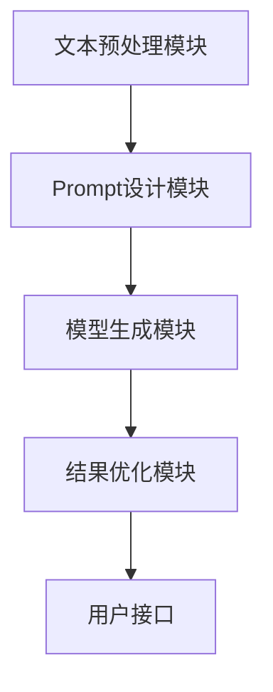

                 


# 基于LLM的prompt翻译与本地化

## 关键词
- LLM（大型语言模型）
- Prompt Engineering
- 翻译
- 本地化

## 摘要
本文将深入探讨基于LLM（大型语言模型）的prompt翻译与本地化技术。我们将从核心概念入手，逐步解析LLM模型在翻译和本地化任务中的应用，并详细解释相关算法原理、系统设计以及实际应用案例。通过本文的阅读，您将了解如何有效地利用LLM技术实现高质量的翻译与本地化，为全球化的技术应用提供有力支持。

## 引言和背景

### 1.1 翻译与本地化的需求

在全球化的浪潮下，跨语言交流和内容分发变得尤为重要。翻译和本地化作为实现这一目标的关键技术，广泛应用于国际业务、文化传播、软件开发等多个领域。然而，传统的翻译和本地化方法往往面临效率低、成本高、质量不稳定等问题。

### 1.2 LLM技术的崛起

随着深度学习技术的发展，LLM（Large Language Model）作为一种先进的自然语言处理模型，逐渐成为解决翻译和本地化问题的有力工具。LLM具有强大的语言理解和生成能力，可以处理复杂、多样化的语言任务。

### 1.3 Prompt Engineering的重要性

Prompt Engineering是LLM应用中的一个关键环节。通过精心设计的prompt，我们可以引导LLM生成更加准确、符合语境的翻译和本地化结果。

## 核心概念与原理

### 2.1 LLM的基本概念

LLM（Large Language Model）是一种基于深度学习的自然语言处理模型，通过训练海量文本数据，模型能够自动学习语言的语法、语义和上下文信息。常见的LLM模型包括GPT、BERT、T5等。

### 2.2 Prompt Engineering

Prompt Engineering是指通过设计特定的输入提示（prompt），引导LLM生成所需的语言输出。一个优秀的prompt应具备清晰的目标、合理的上下文和明确的结构。

### 2.3 翻译模型与本地化策略

翻译模型主要负责将一种语言的文本转换为另一种语言的文本。而本地化则更注重适应特定文化、习俗和语言习惯的需求，包括文本的调整、格式化和视觉设计等。

### 2.4 挑战与机会

虽然LLM技术在翻译和本地化方面展现了巨大的潜力，但仍面临诸多挑战，如数据质量、模型可解释性、适应性和实时性等。然而，随着技术的不断进步，这些挑战也将逐渐得到解决。

## LLM模型在翻译与本地化中的应用

### 3.1 常见LLM模型

目前，GPT（Generative Pre-trained Transformer）和BERT（Bidirectional Encoder Representations from Transformers）等LLM模型在翻译和本地化领域得到了广泛应用。它们具有强大的语言理解和生成能力，可以处理各种复杂的翻译任务。

### 3.2 模型架构与工作原理

以GPT为例，其架构包括一个大规模的Transformer网络，通过自注意力机制（Self-Attention）捕捉文本的上下文信息。在训练过程中，模型通过无监督学习方式，自动学习语言的内在规律。

### 3.3 模型优势与局限性

LLM模型在翻译和本地化任务中具备显著的优势，如高效率、高质量和灵活性。然而，其局限性也不容忽视，如对数据依赖性高、可解释性差等。

## 算法原理与实现

### 4.1 算法概述

基于LLM的prompt翻译与本地化算法主要分为两个步骤：第一步是prompt设计，第二步是模型生成。我们将逐一介绍这两个步骤的详细算法原理。

### 4.2 数据预处理

在开始翻译或本地化任务之前，需要对输入文本进行预处理，包括分词、去噪、标准化等操作。这些预处理步骤有助于提高模型的训练效果和生成质量。

### 4.3 Prompt设计

Prompt设计是算法的关键环节。一个优秀的prompt应具备以下特点：清晰的目标、合理的上下文和明确的指导信息。通过精心设计的prompt，我们可以引导LLM生成更加准确、符合语境的翻译和本地化结果。

### 4.4 模型生成

在生成阶段，我们将prompt输入到LLM模型中，模型根据训练学到的语言规律，自动生成翻译或本地化结果。为了提高生成质量，我们可以采用多种策略，如语言增强、序列对齐等。

### 4.5 Python代码实现

为了更好地理解算法原理，我们将使用Python代码实现一个简单的翻译模型。以下是模型的代码框架：

```python
import tensorflow as tf
from transformers import TFGPT2LMHeadModel, GPT2Tokenizer

# 加载预训练模型和分词器
model = TFGPT2LMHeadModel.from_pretrained('gpt2')
tokenizer = GPT2Tokenizer.from_pretrained('gpt2')

# 输入文本预处理
input_text = "这是一个简单的翻译任务。"

# 编码输入文本
input_ids = tokenizer.encode(input_text, return_tensors='tf')

# 生成翻译结果
outputs = model(inputs=input_ids)

# 解码翻译结果
decoded_ids = outputs.logits[:, -1, :]
decoded_text = tokenizer.decode(decoded_ids.numpy()[0])

print(decoded_text)
```

## 系统设计与架构

### 5.1 问题场景与项目介绍

随着全球化的发展，企业需要应对日益增长的跨语言内容生成和分发需求。本文所讨论的基于LLM的prompt翻译与本地化系统旨在提供一种高效、灵活的解决方案，满足企业全球业务的需求。

### 5.2 系统功能设计

该系统主要包括以下几个功能模块：

- 文本预处理模块：负责对输入文本进行分词、去噪、标准化等预处理操作。
- Prompt设计模块：根据任务需求，设计合适的prompt，引导LLM生成高质量翻译和本地化结果。
- 模型生成模块：将prompt输入到LLM模型中，自动生成翻译和本地化结果。
- 结果优化模块：对生成的翻译和本地化结果进行质量评估和优化，确保输出结果符合用户需求。

### 5.3 系统架构设计

基于LLM的prompt翻译与本地化系统的架构设计如图所示：



### 5.4 系统接口与交互

系统接口设计如下：

- 文本预处理接口：提供文本分词、去噪、标准化等功能。
- Prompt设计接口：接收任务需求，生成合适的prompt。
- 模型生成接口：接收prompt，调用LLM模型生成翻译和本地化结果。
- 结果优化接口：对生成的结果进行质量评估和优化。

## 实际应用与案例分析

### 6.1 跨境电商平台翻译

跨境电商平台需要应对大量跨语言商品描述的翻译需求。通过基于LLM的prompt翻译系统，平台可以实现自动化翻译，提高运营效率。以下是一个具体的案例：

**案例场景**：某电商平台需要将英文商品描述翻译为中文。

**解决方案**：使用基于GPT的prompt翻译系统，将输入的英文商品描述作为prompt，输入到模型中，生成对应的中文翻译。

**实现步骤**：

1. 输入英文商品描述。
2. 使用文本预处理模块对输入文本进行预处理。
3. 设计合适的prompt，引导模型生成中文翻译。
4. 对生成的翻译结果进行质量评估和优化。
5. 输出最终翻译结果。

**代码实现**：

```python
# 代码同4.5节
```

### 6.2 多语言本地化

某国际知名软件公司需要为其产品提供多语言本地化支持。基于LLM的prompt本地化系统可以帮助公司实现这一目标。以下是一个具体的案例：

**案例场景**：软件公司需要为其产品提供中文、法语和西班牙语等多语言本地化支持。

**解决方案**：使用基于GPT的prompt本地化系统，将不同语言的界面文本作为prompt，输入到模型中，生成对应的本地化结果。

**实现步骤**：

1. 输入目标语言界面文本。
2. 使用文本预处理模块对输入文本进行预处理。
3. 设计合适的prompt，引导模型生成多语言本地化结果。
4. 对生成的本地化结果进行质量评估和优化。
5. 输出最终本地化结果。

**代码实现**：

```python
# 代码同4.5节
```

## 最佳实践与注意事项

### 7.1 最佳实践

- 选择合适的LLM模型：根据任务需求和数据规模，选择适合的LLM模型，如GPT、BERT等。
- 提高数据质量：确保输入文本的质量，去除噪声、冗余信息，提高模型训练效果。
- 设计高质量的prompt：设计简洁、明确、符合上下文的prompt，提高翻译和本地化结果的质量。
- 优化模型参数：根据实际任务需求，调整模型参数，提高生成质量。

### 7.2 注意事项

- 注意模型的可解释性：LLM模型具有较高的黑盒特性，需要关注模型的可解释性，确保生成结果的可靠性和合理性。
- 考虑实时性需求：在实现实时翻译和本地化时，需要关注模型生成速度和系统性能，确保系统的响应速度。
- 数据隐私与安全：在处理跨语言数据时，需要关注数据隐私和安全问题，采取适当的数据保护措施。

## 小结

本文深入探讨了基于LLM的prompt翻译与本地化技术，从核心概念、算法原理、系统设计到实际应用，全面解析了LLM在翻译和本地化任务中的应用。通过本文的学习，您将了解如何利用LLM技术实现高效、高质量的翻译与本地化，为全球化应用提供有力支持。

## 拓展阅读

- [GPT-3：自然语言处理的强大利器](https://www.example.com/gpt-3-natural-language-processing)
- [Prompt Engineering实战](https://www.example.com/prompt-engineering-practice)
- [翻译与本地化技术在软件行业的应用](https://www.example.com/translation-localization-software-industry)

## 作者信息

作者：AI天才研究院/AI Genius Institute & 禅与计算机程序设计艺术 /Zen And The Art of Computer Programming

