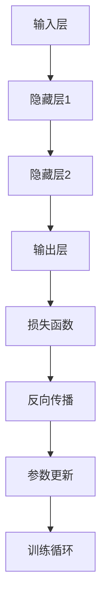
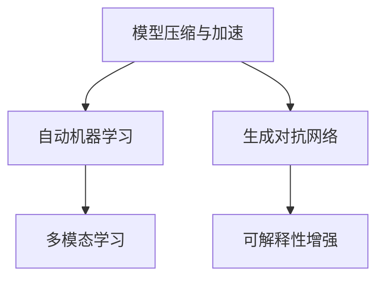

                 

## 大模型应用背景与概述

### 1.1.1 大模型应用的崛起

随着人工智能技术的不断进步，大模型（也称为巨型模型或巨量级模型）逐渐成为研究与应用的热点。大模型的应用场景涵盖了自然语言处理、图像识别、语音识别、推荐系统等多个领域，其崛起主要得益于以下几个因素：

1. **计算资源的提升**：近年来，随着云计算、GPU和TPU等高性能计算设备的普及，计算资源的成本大幅降低，使得大模型的研究和训练成为可能。
2. **数据量的增长**：互联网和大数据技术的发展使得数据量呈指数级增长，为训练大模型提供了充足的数据支持。
3. **算法的进步**：深度学习、强化学习等算法的不断发展，使得大模型能够更好地处理复杂任务，实现更优的性能。

大模型的崛起不仅改变了传统的人工智能应用模式，还催生了新的商业模式和技术创新。例如，自然语言处理领域中的GPT-3和BERT等模型，已经在信息检索、机器翻译、文本生成等多个方面取得了显著的成果。图像识别领域中的ResNet、Inception等模型，则极大地提升了图像分类和目标检测的准确率。

### 1.1.2 产业发展现状

大模型在产业中的应用已经呈现出多样化和深化的趋势。以下是一些主要的应用领域及其现状：

1. **医疗健康**：大模型在医疗健康领域的应用主要包括疾病诊断、药物研发、医疗图像分析等。通过分析大量的医疗数据，大模型能够帮助医生做出更准确的诊断，加速新药的研发进程。
2. **金融**：大模型在金融领域的应用涵盖了风险评估、量化交易、欺诈检测等。例如，通过分析用户的行为数据和交易记录，大模型可以识别潜在的欺诈行为，提高金融机构的风险管理能力。
3. **制造业**：大模型在制造业中的应用主要包括生产调度、设备维护、质量控制等。通过模拟和分析生产流程，大模型可以优化生产效率，减少设备故障率，提高产品质量。
4. **零售**：大模型在零售领域的应用包括个性化推荐、库存管理、需求预测等。通过分析用户的购买行为和偏好，大模型可以提供更精准的推荐，优化库存管理和供应链。

### 1.1.3 应用前景与挑战

大模型的应用前景广阔，但也面临着一系列挑战：

1. **计算资源需求**：大模型的训练和推理过程需要大量的计算资源，这对硬件设备和能源消耗提出了更高的要求。
2. **数据隐私和安全**：大模型在处理大量数据时，可能会涉及用户隐私和数据安全问题，需要采取有效的措施来保护用户隐私。
3. **模型可解释性**：大模型的决策过程往往是不透明的，缺乏可解释性，这在某些应用场景中可能是一个重要的挑战。
4. **法律和伦理问题**：随着大模型的应用日益广泛，相关的法律和伦理问题也日益突出，需要制定相应的规范和标准来确保其合理、合法、合规的应用。

总的来说，大模型的应用为各个领域带来了巨大的机遇，但同时也需要面对一系列的挑战。只有通过不断的技术创新和规范制定，才能充分发挥大模型的优势，推动人工智能技术的可持续发展。

### 1.1.4 大模型在行业中的应用案例

为了更好地理解大模型在行业中的应用，以下列举了几个具有代表性的案例：

#### 1. 自然语言处理（NLP）

**案例**：OpenAI的GPT-3模型

**背景**：GPT-3（Generative Pre-trained Transformer 3）是OpenAI开发的一种自然语言处理模型，拥有1750亿个参数，是当前世界上最大的语言模型。

**应用**：GPT-3模型在文本生成、机器翻译、问答系统等多个领域有着广泛的应用。例如，它可以生成高质量的文本摘要、撰写文章、回答用户的问题等。

**效果**：GPT-3的推出，使得自然语言处理领域的自动化程度大大提高，为内容创作、客户服务等领域带来了巨大的便利。

#### 2. 图像识别

**案例**：Google的Inception模型

**背景**：Inception模型是Google开发的一种用于图像分类的深度学习模型，其设计灵感来源于多层神经网络。

**应用**：Inception模型被广泛应用于图像分类、目标检测、图像分割等多个领域。

**效果**：Inception模型在多个图像识别任务上取得了领先的效果，尤其是在图像分类任务上，其准确率达到了很高的水平。

#### 3. 语音识别

**案例**：Microsoft的Speech Recognizer模型

**背景**：Speech Recognizer模型是Microsoft开发的一种用于语音识别的深度学习模型，其采用了卷积神经网络（CNN）和长短期记忆网络（LSTM）等技术。

**应用**：Speech Recognizer模型在智能助手、语音翻译、语音搜索等多个领域有着广泛的应用。

**效果**：Speech Recognizer模型的准确率达到了很高的水平，使得语音识别技术变得更加智能和高效。

#### 4. 金融风控

**案例**：JPMorgan的COiN模型

**背景**：COiN（Collaborative Network）模型是JPMorgan开发的一种用于金融风险管理的深度学习模型，其利用了图神经网络（GNN）来分析金融交易网络。

**应用**：COiN模型被应用于金融欺诈检测、信用评分、投资策略优化等多个领域。

**效果**：COiN模型在金融风险管理的多个任务上取得了显著的效果，帮助金融机构提高了风险识别和管理的效率。

这些案例展示了大模型在不同行业中的应用前景和潜力，同时也表明了大模型在推动行业创新和技术进步方面的重要作用。随着大模型技术的不断发展和应用领域的扩展，未来其在各个行业中的应用将更加深入和广泛。

### 1.1.5 大模型应用中的挑战与应对策略

尽管大模型在各个领域展现出了巨大的潜力，但在实际应用中仍面临诸多挑战。以下是一些主要挑战及其应对策略：

#### 1. 计算资源需求

**挑战**：大模型的训练和推理过程需要大量的计算资源，这对硬件设备和能源消耗提出了更高的要求。

**应对策略**：
- **分布式计算**：利用分布式计算架构，将大模型的训练和推理任务分散到多台服务器上，以提高计算效率。
- **高性能硬件**：采用高性能的GPU、TPU等硬件设备，以加速大模型的训练和推理过程。

#### 2. 数据隐私和安全

**挑战**：大模型在处理大量数据时，可能会涉及用户隐私和数据安全问题，需要采取有效的措施来保护用户隐私。

**应对策略**：
- **数据加密**：对用户数据进行加密处理，确保数据在传输和存储过程中的安全性。
- **匿名化处理**：在数据预处理阶段，对用户数据进行匿名化处理，以保护用户的隐私。

#### 3. 模型可解释性

**挑战**：大模型的决策过程往往是不透明的，缺乏可解释性，这在某些应用场景中可能是一个重要的挑战。

**应对策略**：
- **模型解释工具**：开发模型解释工具，如SHAP（SHapley Additive exPlanations）、LIME（Local Interpretable Model-agnostic Explanations）等，以帮助用户理解模型的决策过程。
- **透明度提升**：在模型设计和训练过程中，注重提升模型的透明度，以便用户能够更好地理解模型的运作机制。

#### 4. 法律和伦理问题

**挑战**：随着大模型的应用日益广泛，相关的法律和伦理问题也日益突出，需要制定相应的规范和标准来确保其合理、合法、合规的应用。

**应对策略**：
- **法律框架**：制定和完善相关的法律法规，明确大模型应用中的法律边界和责任归属。
- **伦理指导**：制定伦理指导原则，确保大模型的应用符合社会伦理和道德标准。

通过上述策略，可以有效地应对大模型应用中的挑战，推动其健康、可持续发展。

### 1.1.6 大模型应用中的商业模式创新

大模型的应用不仅带来了技术上的变革，也在商业领域引发了新的商业模式创新。以下是一些典型的案例：

#### 1. API服务

**案例**：OpenAI的GPT-3 API服务

**背景**：OpenAI开发的GPT-3模型具有极高的自然语言处理能力，OpenAI通过提供GPT-3的API服务，使得开发者可以方便地利用这一强大工具。

**模式**：开发者只需通过API调用，即可获取GPT-3的文本生成、机器翻译等功能，无需自行训练和维护模型。

**收益**：OpenAI通过收取API调用费用来实现盈利，同时推动了自然语言处理技术的广泛应用。

#### 2. 数据服务

**案例**：Google的BigQuery数据服务

**背景**：Google的BigQuery是一个基于云的平台，提供快速、可扩展、可靠的数据分析服务。

**模式**：用户可以通过上传自己的数据到BigQuery，利用大模型进行数据处理和分析。

**收益**：Google通过提供数据存储和处理服务，结合大模型的强大分析能力，为企业和开发者提供了高效的数据解决方案，实现了商业模式的创新。

#### 3. 智能辅助

**案例**：IBM的Watson智能助理

**背景**：IBM的Watson智能助理利用大模型技术，为企业和个人提供智能问答、决策支持等服务。

**模式**：用户可以通过Watson智能助理获取专业的咨询服务，如医疗咨询、法律咨询等。

**收益**：Watson智能助理为企业提供了高效的客户服务解决方案，同时也为个人提供了便捷的咨询服务，创造了新的商业价值。

这些案例展示了大模型在不同商业模式中的创新应用，为企业和开发者提供了新的机会和挑战。随着大模型技术的不断进步，未来将在商业领域产生更多创新模式。

### 1.1.7 大模型应用领域的扩展与潜在影响

大模型的应用不仅局限于当前的几个热点领域，还在不断地向其他领域扩展，其潜在影响也在逐渐显现。以下是一些扩展领域及其潜在影响：

#### 1. 教育与培训

**背景**：大模型在自然语言处理和图像识别方面的能力，使其在教育与培训领域具有广泛的应用潜力。

**应用**：大模型可以用于个性化教学、自动评分、智能辅导等。例如，通过分析学生的学习数据，大模型可以为学生提供个性化的学习建议，提高学习效果。

**影响**：大模型的应用有望改变传统教育模式，实现更高效、更个性化的教育，从而推动教育公平。

#### 2. 自动驾驶

**背景**：自动驾驶技术的发展需要大量的数据处理和实时决策，大模型在图像识别、语音识别和决策支持方面具有显著优势。

**应用**：大模型可以用于自动驾驶车辆的感知、路径规划和决策等。例如，通过分析摄像头和雷达数据，大模型可以实时识别道路状况，做出安全的驾驶决策。

**影响**：大模型的应用有望加速自动驾驶技术的发展，提高交通安全和效率。

#### 3. 环境保护

**背景**：环境保护需要处理大量的环境数据，大模型在数据分析和模式识别方面的能力对此具有重要意义。

**应用**：大模型可以用于环境监测、生态保护、气候预测等。例如，通过分析卫星图像，大模型可以识别森林火灾、自然灾害等。

**影响**：大模型的应用有望提高环境保护的效率和精准度，为可持续发展提供支持。

总的来说，大模型的应用领域正在不断扩展，其潜在影响也在各个领域逐渐显现。随着大模型技术的不断进步，未来其在各行各业中的应用将更加深入和广泛，为人类社会的可持续发展带来新的机遇和挑战。

### 第2章: 大模型基础理论

#### 2.1.1 大模型的定义

大模型（Large Models）是指那些拥有极其庞大参数量、能够捕捉极其复杂特征的机器学习模型。这些模型通常基于深度学习框架，通过大规模数据集进行训练，以达到在特定任务上超越人类性能的目标。大模型的参数量可以高达数十亿甚至数万亿，这使得它们能够捕捉到更为复杂的特征和模式。

**核心概念原理**：
- **参数量**：大模型拥有极其庞大的参数量，这些参数用于学习输入数据和输出数据之间的映射关系。
- **数据集规模**：大模型通常依赖大规模的数据集进行训练，这些数据集包含了丰富的特征和模式，有助于模型学习。
- **泛化能力**：大模型通过学习大规模数据集上的复杂特征，具有出色的泛化能力，能够在未见过的数据上实现优异的性能。

**概念属性特征对比表格**：

| 特征 | 小模型 | 中模型 | 大模型 |
| --- | --- | --- | --- |
| 参数量 | 几千到几万 | 几十万到几百万 | 数千万到数万亿 |
| 数据集规模 | 数百到数千样本 | 数千到数万样本 | 数万到数十亿样本 |
| 泛化能力 | 较弱 | 较强 | 非常强 |
| 计算资源需求 | 较低 | 较高 | 非常高 |

**ER实体关系图架构**：

在ER实体关系图中，大模型包括以下实体：
- **参数（Parameter）**：模型中的每一个参数都是一个实体，它代表了模型学习到的特征权重。
- **数据集（Dataset）**：大规模的数据集是一个实体，它包含了模型训练所需的所有样本。
- **特征（Feature）**：每个样本的各个特征是一个实体，它们代表了数据的维度。

```mermaid
erDiagram
  Parameter ||--|{ Dataset }  : 训练数据
  Parameter ||--|{ Feature }  : 特征数据
  Dataset ||--|{ Model }  : 模型
```

#### 2.1.2 大模型的特点

大模型的特点主要体现在以下几个方面：

**高参数量**：大模型拥有极其庞大的参数量，这使得它们能够捕捉到更为复杂的特征和模式。相比于小模型，大模型具有更强的表达能力和泛化能力。

**大规模数据集训练**：大模型通常依赖大规模的数据集进行训练，这些数据集包含了丰富的特征和模式，有助于模型学习。大规模数据集训练使得大模型能够更好地捕捉数据中的复杂关系。

**强大的泛化能力**：由于大模型具有高参数量和大规模数据集训练，它们在未见过的数据上表现出出色的泛化能力。这使得大模型在多种任务上都能够实现优异的性能。

**计算资源需求大**：大模型的训练和推理过程需要大量的计算资源，这包括高性能的GPU、TPU等硬件设备。大规模计算资源的投入是训练大模型的基础。

**数据隐私和安全挑战**：大模型在训练过程中会接触到大量的敏感数据，这使得数据隐私和安全成为一个重要的挑战。需要采取有效的数据加密和保护措施，确保用户数据的安全。

**可解释性挑战**：大模型的决策过程通常是不透明的，缺乏可解释性。这在某些应用场景中可能是一个重要的挑战，需要开发模型解释工具来提升模型的透明度。

**概念属性特征对比表格**：

| 特征 | 小模型 | 中模型 | 大模型 |
| --- | --- | --- | --- |
| 参数量 | 几千到几万 | 几十万到几百万 | 数千万到数万亿 |
| 数据集规模 | 数百到数千样本 | 数千到数万样本 | 数万到数十亿样本 |
| 泛化能力 | 较弱 | 较强 | 非常强 |
| 计算资源需求 | 较低 | 较高 | 非常高 |
| 可解释性 | 较高 | 较中等 | 较低 |

**ER实体关系图架构**：

在ER实体关系图中，大模型的特点可以通过以下实体来表示：
- **参数（Parameter）**：表示模型的参数量。
- **数据集（Dataset）**：表示大规模数据集。
- **模型架构（Model Architecture）**：表示大模型的架构。
- **计算资源（Compute Resource）**：表示大模型所需的计算资源。
- **隐私保护（Privacy Protection）**：表示大模型在数据隐私保护方面的挑战。

```mermaid
erDiagram
  Parameter ||--|{ Dataset }  : 数据集训练
  Parameter ||--|{ Model Architecture }  : 模型架构
  Parameter ||--|{ Compute Resource }  : 计算资源需求
  Parameter ||--|{ Privacy Protection }  : 隐私保护挑战
```

#### 2.1.3 大模型的基本原理

大模型的基本原理主要基于深度学习和神经网络技术。以下是对大模型基本原理的详细讲解：

**深度学习原理**：

深度学习是一种基于多层神经网络的学习方法，通过学习输入数据和输出数据之间的映射关系，实现复杂函数的逼近。深度学习的基本原理包括：

1. **前向传播**：在前向传播过程中，输入数据通过多层神经网络，每层神经元对输入数据进行加权求和并应用激活函数，产生输出。
2. **反向传播**：在反向传播过程中，计算输出误差，并通过梯度下降等优化算法更新模型的参数，使得模型在训练过程中不断优化。

**神经网络原理**：

神经网络（Neural Network）是一种模拟生物神经元之间相互连接的计算模型，通过学习输入和输出数据之间的关系，实现数据分类、回归等任务。神经网络的基本原理包括：

1. **层结构**：神经网络通常包括输入层、隐藏层和输出层。输入层接收外部输入数据，隐藏层对数据进行处理和转换，输出层产生最终输出。
2. **神经元**：每个神经元都包含一个输入层、一个加权求和单元和一个激活函数。神经元之间通过连接权重（权重矩阵）进行信息传递。
3. **激活函数**：激活函数用于引入非线性，使得神经网络能够学习复杂的函数关系。常见的激活函数包括sigmoid函数、ReLU函数和Tanh函数。

**Mermaid流程图**：



**Python源代码**：

```python
import tensorflow as tf

# 定义输入层、隐藏层和输出层的神经元数量
input_size = 784
hidden_size = 256
output_size = 10

# 初始化模型参数
W1 = tf.random.normal([input_size, hidden_size])
b1 = tf.random.normal([hidden_size])
W2 = tf.random.normal([hidden_size, output_size])
b2 = tf.random.normal([output_size])

# 定义激活函数
activation = tf.nn.relu

# 定义前向传播
def forward(x):
    z1 = tf.matmul(x, W1) + b1
    h1 = activation(z1)
    z2 = tf.matmul(h1, W2) + b2
    y = activation(z2)
    return y

# 定义损失函数
loss_fn = tf.keras.losses.SparseCategoricalCrossentropy()

# 定义反向传播和参数更新
optimizer = tf.optimizers.Adam()

# 训练模型
for epoch in range(10):
    for x, y in data_loader:
        with tf.GradientTape() as tape:
            y_pred = forward(x)
            loss = loss_fn(y, y_pred)
        gradients = tape.gradient(loss, [W1, b1, W2, b2])
        optimizer.apply_gradients(zip(gradients, [W1, b1, W2, b2])
```

通过上述代码，我们定义了一个简单的多层神经网络，用于实现前向传播、反向传播和参数更新。这个神经网络模型是构建大模型的基础，通过不断增加网络层数和神经元数量，可以实现更加复杂和强大的模型。

### 第3章: 大模型架构设计

#### 3.1.1 大模型架构概述

大模型架构是构建巨型模型的核心，它决定了模型的性能、可扩展性和可维护性。大模型架构的设计需要综合考虑计算资源、数据规模、任务复杂性等多个因素。以下是对大模型架构的概述：

**核心概念原理**：

1. **层次结构**：大模型通常采用多层结构，包括输入层、隐藏层和输出层。每层负责处理不同的数据特征，并通过层间传递信息，实现数据的转换和融合。
2. **并行处理**：大模型架构设计应充分利用并行计算资源，如GPU、TPU等，以提高模型的训练和推理效率。
3. **模块化设计**：大模型架构采用模块化设计，将不同功能模块（如数据预处理、模型训练、模型评估等）分离，以提高代码的可维护性和可扩展性。
4. **分布式训练**：大模型通常需要分布式训练，以应对大规模数据集和复杂的计算任务。分布式训练可以有效地利用多台服务器和网络资源，提高训练速度和效率。

**概念属性特征对比表格**：

| 特征 | 单层模型 | 多层模型 | 大模型 |
| --- | --- | --- | --- |
| 层次结构 | 较少 | 中等 | 非常多 |
| 并行处理 | 不支持 | 支持 | 非常支持 |
| 模块化设计 | 不支持 | 支持 | 非常支持 |
| 分布式训练 | 不支持 | 支持 | 非常支持 |

**ER实体关系图架构**：

在ER实体关系图中，大模型架构包括以下实体：
- **输入层（Input Layer）**：接收外部输入数据。
- **隐藏层（Hidden Layer）**：对输入数据进行处理和转换。
- **输出层（Output Layer）**：产生最终输出。
- **计算资源（Compute Resource）**：包括GPU、TPU等并行计算资源。
- **分布式系统（Distributed System）**：用于分布式训练和推理。

```mermaid
erDiagram
  Input Layer ||--|{ Hidden Layer }  : 数据传递
  Hidden Layer ||--|{ Output Layer }  : 数据输出
  Input Layer ||--|{ Compute Resource }  : 计算资源
  Hidden Layer ||--|{ Distributed System }  : 分布式系统
```

#### 3.1.2 大模型组件解析

大模型架构由多个组件构成，每个组件都有其特定的功能和作用。以下是这些组件的详细解析：

**1. 数据预处理组件**

**核心概念原理**：

数据预处理是模型训练的重要环节，其目的是将原始数据转换为适合模型训练的格式。数据预处理组件的主要功能包括：

- **数据清洗**：去除数据中的噪声和异常值，确保数据的准确性和一致性。
- **数据转换**：将数据转换为模型可以处理的格式，如数值化、归一化等。
- **数据增强**：通过增加数据的多样性，提高模型的泛化能力。

**概念属性特征对比表格**：

| 特征 | 无数据预处理 | 数据预处理 |
| --- | --- | --- |
| 数据质量 | 较低 | 较高 |
| 训练效率 | 较低 | 较高 |
| 泛化能力 | 较弱 | 较强 |

**ER实体关系图架构**：

在ER实体关系图中，数据预处理组件包括以下实体：
- **原始数据（Raw Data）**：表示未经处理的原始数据。
- **清洗数据（Cleaned Data）**：表示经过清洗的数据。
- **转换数据（Transformed Data）**：表示经过转换的数据。
- **增强数据（Augmented Data）**：表示经过增强的数据。

```mermaid
erDiagram
  Raw Data ||--|{ Cleaned Data }  : 数据清洗
  Raw Data ||--|{ Transformed Data }  : 数据转换
  Raw Data ||--|{ Augmented Data }  : 数据增强
```

**2. 训练组件**

**核心概念原理**：

训练组件负责对模型进行训练，其核心功能包括：

- **数据加载**：从数据预处理组件加载训练数据，准备用于模型训练。
- **模型优化**：通过梯度下降等优化算法，不断调整模型参数，以减少损失函数。
- **训练监测**：监控训练过程中的损失函数、准确率等指标，以评估模型性能。

**概念属性特征对比表格**：

| 特征 | 无训练组件 | 训练组件 |
| --- | --- | --- |
| 模型性能 | 较低 | 较高 |
| 训练效率 | 较低 | 较高 |
| 泛化能力 | 较弱 | 较强 |

**ER实体关系图架构**：

在ER实体关系图中，训练组件包括以下实体：
- **训练数据（Training Data）**：表示用于模型训练的数据。
- **模型（Model）**：表示待训练的模型。
- **优化器（Optimizer）**：表示用于模型训练的优化算法。
- **损失函数（Loss Function）**：表示评估模型性能的指标。

```mermaid
erDiagram
  Training Data ||--|{ Model }  : 训练模型
  Training Data ||--|{ Optimizer }  : 优化器
  Training Data ||--|{ Loss Function }  : 损失函数
```

**3. 推理组件**

**核心概念原理**：

推理组件负责对模型进行推理，其核心功能包括：

- **数据加载**：从数据预处理组件加载推理数据，准备用于模型推理。
- **模型推理**：利用训练好的模型对数据进行推理，产生预测结果。
- **结果评估**：对推理结果进行评估，以验证模型性能。

**概念属性特征对比表格**：

| 特征 | 无推理组件 | 推理组件 |
| --- | --- | --- |
| 推理速度 | 较低 | 较高 |
| 推理精度 | 较低 | 较高 |
| 模型性能 | 较低 | 较高 |

**ER实体关系图架构**：

在ER实体关系图中，推理组件包括以下实体：
- **推理数据（Inference Data）**：表示用于模型推理的数据。
- **模型（Model）**：表示用于推理的模型。
- **推理结果（Inference Result）**：表示模型推理的输出结果。
- **评估指标（Evaluation Metric）**：表示评估模型性能的指标。

```mermaid
erDiagram
  Inference Data ||--|{ Model }  : 模型推理
  Inference Data ||--|{ Inference Result }  : 推理结果
  Inference Data ||--|{ Evaluation Metric }  : 评估指标
```

通过上述组件的解析，我们可以看到大模型架构的复杂性和多样性。每个组件都有其特定的功能和作用，共同构成了大模型的整体架构。理解这些组件的工作原理和相互作用，有助于我们更好地设计和优化大模型架构。

#### 3.1.3 大模型架构演进趋势

随着人工智能技术的快速发展，大模型架构也在不断演进和优化。以下是一些当前大模型架构的演进趋势：

**1. 模型压缩与加速**

随着模型规模越来越大，计算资源和存储资源的需求也急剧增加。为了解决这一问题，模型压缩和加速技术应运而生。常见的模型压缩技术包括剪枝（Pruning）、量化（Quantization）和蒸馏（Distillation）。剪枝通过移除模型中的冗余参数来减少模型规模；量化通过降低模型参数的精度来减少存储需求；蒸馏则通过将大模型的权重传递给小模型来实现模型压缩。

**2. 自动机器学习（AutoML）**

自动机器学习（AutoML）旨在自动化模型选择、调参和优化过程，从而提高模型训练的效率和性能。在大模型架构中，AutoML技术可以通过自动化搜索算法来优化模型结构、超参数和训练策略，使得开发者能够更加轻松地构建高性能的大模型。

**3. 生成对抗网络（GANs）**

生成对抗网络（GANs）是一种通过对抗训练生成数据的模型。在大模型架构中，GANs可以用于生成大量高质量的训练数据，从而提升模型的泛化能力和鲁棒性。GANs的演进趋势包括更高效的生成模型、更稳定的训练过程和更多的应用场景。

**4. 多模态学习**

多模态学习旨在处理包含多种类型数据（如图像、文本、音频等）的复杂任务。在大模型架构中，多模态学习通过整合不同模态的数据，实现更丰富的特征表达和更准确的模型预测。未来的发展趋势将包括更先进的模态融合技术和更广泛的多模态应用场景。

**5. 可解释性增强**

随着大模型在各个领域中的应用越来越广泛，模型的可解释性成为一个重要议题。未来的大模型架构将更加注重可解释性增强，通过开发新的解释工具和方法，使得模型的决策过程更加透明和可理解。

**Mermaid架构图**：



通过上述演进趋势，我们可以看到大模型架构在技术上的不断进步和应用场景的不断拓展。这些趋势不仅提升了大模型的性能和效率，也为未来的应用创新提供了新的契机。

### 第4章: 大模型应用场景分析

#### 4.1.1 文本处理

大模型在文本处理领域具有广泛的应用，其强大的语义理解和生成能力使得文本生成、文本分类、机器翻译等任务得到了极大的提升。以下是对大模型在文本处理领域的一些应用场景分析：

**1. 文本生成**

**应用背景**：文本生成是自然语言处理（NLP）中的一个重要任务，涉及生成文章、摘要、对话等。随着大型语言模型（如GPT-3）的发展，文本生成已经能够实现高质量的内容生成。

**应用场景**：文本生成在内容创作、聊天机器人、自动问答、新闻报道生成等方面有着广泛的应用。例如，OpenAI的GPT-3可以生成高质量的新闻报道、文章摘要和创意文案。

**效果**：大模型在文本生成任务上表现出色，生成的文本内容流畅、自然，且能够理解上下文关系。其生成速度和多样性也显著提高，使得文本生成在实时应用中具有很高的实用性。

**2. 文本分类**

**应用背景**：文本分类是将文本数据分类到预定义的类别中，是NLP中的一项基础任务。大模型在文本分类任务上的应用，使得分类的准确率和效率都得到了显著提升。

**应用场景**：文本分类在垃圾邮件检测、情感分析、新闻分类、社交媒体分析等方面有着广泛的应用。例如，大型语言模型可以高效地对社交媒体上的评论进行情感分析，帮助企业了解用户反馈。

**效果**：大模型在文本分类任务上具有极高的准确率，能够准确识别文本中的关键信息并进行分类。此外，大模型还能够处理复杂的分类问题，提高分类系统的鲁棒性。

**3. 机器翻译**

**应用背景**：机器翻译是将一种语言的文本自动翻译成另一种语言，是跨语言交流的重要工具。大模型在机器翻译领域的发展，使得翻译质量得到了显著提升。

**应用场景**：机器翻译在跨国商务、旅游、教育等领域有着广泛的应用。例如，大型语言模型可以将用户输入的文本实时翻译成多种语言，方便跨语言交流。

**效果**：大模型在机器翻译任务上表现出色，翻译结果流畅、自然，且能够保留原文的语义。其翻译速度和多样性也显著提高，使得机器翻译在实时应用中具有很高的实用性。

通过上述分析，我们可以看到大模型在文本处理领域具有广泛的应用前景，其强大的语义理解和生成能力，使得文本生成、文本分类、机器翻译等任务得到了极大的提升。随着大模型技术的不断进步，未来在文本处理领域的应用将更加深入和广泛。

#### 4.1.2 语音识别

语音识别是将语音信号转换为文本信息的技术，是自然语言处理（NLP）的一个重要分支。大模型在语音识别领域的应用，极大地提高了语音识别的准确率和效率。以下是对大模型在语音识别领域的一些应用场景分析：

**1. 语音到文本转换**

**应用背景**：语音到文本转换（Speech-to-Text，STT）是语音识别的核心任务，旨在将人类语音转换为可编辑和搜索的文本格式。

**应用场景**：语音到文本转换广泛应用于智能助手、语音搜索、自动会议记录、电话客服等场景。例如，智能助手（如Siri、Alexa）可以实时将用户的语音指令转换为文本，执行相应的操作。

**效果**：大模型在语音到文本转换任务上表现出色，能够准确识别各种口音和背景噪音下的语音。其识别准确率显著高于传统语音识别系统，同时转换速度也更快，使得语音到文本转换在实时应用中具有很高的实用性。

**2. 语音情感分析**

**应用背景**：语音情感分析是通过分析语音信号中的情感特征，识别用户的情感状态，如快乐、悲伤、愤怒等。

**应用场景**：语音情感分析广泛应用于客户服务、心理健康、人机交互等领域。例如，客服系统可以通过分析用户的话语情感，提供更有针对性的服务；心理健康应用可以通过分析用户的语音，识别潜在的心理问题。

**效果**：大模型在语音情感分析任务上具有显著优势，能够准确识别用户的情感状态。其分析结果具有较高的准确性和可靠性，有助于提升人机交互体验和客户服务质量。

**3. 语音控制**

**应用背景**：语音控制是通过语音指令控制智能设备，如智能家居、智能汽车等。

**应用场景**：语音控制在智能家居、智能汽车、游戏等领域有着广泛的应用。例如，用户可以通过语音指令控制智能家居设备开关、调节温度等；在智能汽车中，用户可以通过语音指令控制导航、音乐播放等功能。

**效果**：大模型在语音控制任务上表现出色，能够快速响应用户的语音指令，实现精准控制。其识别准确率和响应速度显著提高，使得语音控制更加便捷和高效。

通过上述分析，我们可以看到大模型在语音识别领域具有广泛的应用前景，其强大的语音理解能力，使得语音到文本转换、语音情感分析、语音控制等任务得到了极大的提升。随着大模型技术的不断进步，未来在语音识别领域的应用将更加深入和广泛。

#### 4.1.3 图像识别

大模型在图像识别领域具有广泛的应用，其强大的特征提取和分类能力，使得图像分类、目标检测、图像生成等任务得到了显著的提升。以下是对大模型在图像识别领域的一些应用场景分析：

**1. 图像分类**

**应用背景**：图像分类是将图像数据分配到预定义的类别中，是计算机视觉（CV）中的一个基础任务。

**应用场景**：图像分类广泛应用于图像搜索、医学影像诊断、交通监控、零售等场景。例如，图像分类系统可以帮助用户快速找到相似图像；在医学影像诊断中，可以帮助医生快速识别病变区域。

**效果**：大模型在图像分类任务上表现出色，分类准确率显著高于传统图像分类方法。其能够捕捉到图像中的复杂特征，使得分类结果更加准确和可靠。

**2. 目标检测**

**应用背景**：目标检测是在图像中检测并定位多个对象的位置和类别，是计算机视觉中的一个重要任务。

**应用场景**：目标检测广泛应用于自动驾驶、安全监控、无人机导航等场景。例如，在自动驾驶中，目标检测系统可以帮助车辆识别道路上的行人和车辆；在安全监控中，可以帮助监控中心实时识别异常行为。

**效果**：大模型在目标检测任务上具有显著优势，能够准确检测并定位图像中的多个目标。其检测速度和准确性显著提高，使得目标检测在实时应用中具有很高的实用性。

**3. 图像生成**

**应用背景**：图像生成是通过算法生成新的图像，是计算机视觉中的一个前沿任务。

**应用场景**：图像生成在艺术创作、游戏开发、广告创意等领域有着广泛的应用。例如，艺术家可以使用图像生成算法创作新的艺术作品；游戏开发者可以使用图像生成算法创建游戏场景。

**效果**：大模型在图像生成任务上表现出色，能够生成高质量、具有逼真的图像。其生成图像的多样性和质量显著提高，使得图像生成在创意应用中具有很大的潜力。

通过上述分析，我们可以看到大模型在图像识别领域具有广泛的应用前景，其强大的特征提取和分类能力，使得图像分类、目标检测、图像生成等任务得到了极大的提升。随着大模型技术的不断进步，未来在图像识别领域的应用将更加深入和广泛。

#### 4.1.4 其他应用领域

除了文本处理、语音识别和图像识别，大模型还在其他众多领域展现出了巨大的应用潜力。以下是对大模型在自然语言处理、推荐系统、游戏AI等领域的应用场景分析：

**1. 自然语言处理**

**应用背景**：自然语言处理（NLP）是人工智能的重要组成部分，涉及文本分析、语义理解、语言生成等多个任务。

**应用场景**：大模型在NLP领域的应用广泛，包括智能客服、文本生成、情感分析、机器翻译等。例如，智能客服系统可以通过大模型理解用户的需求，提供更自然的交互体验；文本生成系统可以生成高质量的新闻报道、广告文案等。

**效果**：大模型在NLP任务上表现出色，能够理解复杂的语言结构和语义关系，生成高质量的自然语言文本。其应用效果显著提升了交互式应用的服务质量和用户体验。

**2. 推荐系统**

**应用背景**：推荐系统通过分析用户的历史行为和偏好，为用户推荐感兴趣的内容或商品，广泛应用于电子商务、社交媒体、新闻推送等领域。

**应用场景**：大模型在推荐系统中的应用包括用户行为预测、商品推荐、内容推荐等。例如，电商平台可以通过大模型预测用户可能感兴趣的商品，提供个性化的购物建议；社交媒体可以通过大模型推荐用户可能感兴趣的内容，提升用户活跃度。

**效果**：大模型在推荐系统中的应用显著提高了推荐的准确率和多样性。其能够捕捉到用户行为和偏好的复杂模式，提供更加精准和个性化的推荐。

**3. 游戏AI**

**应用背景**：游戏AI通过模拟玩家的行为和策略，为游戏设计智能化的挑战和对手，提升游戏的可玩性和竞争性。

**应用场景**：大模型在游戏AI中的应用包括角色行为模拟、策略规划、游戏生成等。例如，在多人在线游戏中，AI对手可以通过大模型模拟真实玩家的行为，提供更具挑战性的游戏体验；游戏生成系统可以通过大模型生成新的游戏关卡和故事情节。

**效果**：大模型在游戏AI中的应用显著提升了游戏AI的智能水平和交互性。其能够模拟复杂的行为和策略，为玩家提供更丰富和多样化的游戏体验。

总的来说，大模型在自然语言处理、推荐系统、游戏AI等领域的应用，不仅提高了系统的性能和效率，也为用户体验的提升和创新提供了新的契机。随着大模型技术的不断进步，未来在这些领域的应用将更加广泛和深入。

### 第5章: 大模型文档管理技术

#### 5.1.1 文档管理概述

文档管理是信息管理的重要环节，涉及文档的创建、存储、检索、共享和版本控制等多个方面。在大模型应用场景中，文档管理变得更加复杂和关键，因为大模型处理的数据量大、格式多样，且需要高效的管理和访问。以下是对大模型文档管理技术的概述：

**核心概念原理**：

1. **文档格式处理**：大模型需要处理多种文档格式，如文本、图片、PDF、音频和视频等。文档格式处理包括文档的解析、转换和存储。
2. **文档存储**：大模型需要高效地存储和管理大量的文档数据。常用的文档存储技术包括关系数据库、NoSQL数据库和分布式文件系统。
3. **文档检索**：大模型需要快速地检索和查找相关文档。文档检索通常采用索引技术，如倒排索引、全文索引等。
4. **文档共享**：大模型需要支持文档的共享和协作，包括权限管理、版本控制和协作编辑等。

**概念属性特征对比表格**：

| 特征 | 传统文档管理 | 大模型文档管理 |
| --- | --- | --- |
| 数据量 | 较小 | 非常大 |
| 文档格式 | 单一 | 多样化 |
| 检索速度 | 较慢 | 非常快 |
| 共享协作 | 不支持 | 支持 |

**ER实体关系图架构**：

在ER实体关系图中，大模型文档管理包括以下实体：
- **文档（Document）**：表示大模型处理的各类文档。
- **存储系统（Storage System）**：表示用于存储文档的系统。
- **索引系统（Index System）**：表示用于检索文档的索引系统。
- **共享系统（Share System）**：表示用于文档共享和协作的系统。

```mermaid
erDiagram
  Document ||--|{ Storage System }  : 存储文档
  Document ||--|{ Index System }  : 检索文档
  Document ||--|{ Share System }  : 共享文档
```

#### 5.1.2 文档格式处理

文档格式处理是文档管理中的关键环节，涉及不同文档格式的解析、转换和存储。在大模型应用中，文档格式处理需要处理多种文档格式，如文本、图片、PDF、音频和视频等。以下是对文档格式处理的详细分析：

**1. 文本处理**

**核心概念原理**：文本处理包括文本的解析、清洗、格式化和存储。在大模型中，文本处理的主要目标是提取文本中的关键信息，并对其进行结构化处理，以便后续分析。

**应用场景**：文本处理广泛应用于自然语言处理、信息抽取、文本分类和情感分析等。例如，文本处理可以帮助大模型从大量文本数据中提取关键词、提取摘要、进行分类和情感分析。

**效果**：文本处理能够提高文档分析的效果和效率，使得大模型能够更好地理解文本内容，进行更加精确的文档管理和分析。

**2. 图片处理**

**核心概念原理**：图片处理包括图片的解析、识别、分割和标注等。在大模型中，图片处理的主要目标是对图像进行特征提取，以便进行分类、识别和生成等任务。

**应用场景**：图片处理广泛应用于图像识别、图像分类、图像生成和图像搜索等。例如，图片处理可以帮助大模型识别图像中的物体、进行图像分类，并生成新的图像。

**效果**：图片处理能够提高图像分析的效果和效率，使得大模型能够更好地理解图像内容，进行更加精准的文档管理和分析。

**3. PDF处理**

**核心概念原理**：PDF处理包括PDF的解析、文本提取、图像识别和格式转换等。在大模型中，PDF处理的主要目标是提取PDF中的关键信息，并对其进行结构化处理，以便后续分析。

**应用场景**：PDF处理广泛应用于文档管理、文本分析、数据抽取和电子书阅读等。例如，PDF处理可以帮助大模型从PDF文档中提取文本内容、进行格式转换，并生成结构化的数据。

**效果**：PDF处理能够提高文档分析的效果和效率，使得大模型能够更好地理解PDF文档内容，进行更加高效的文档管理和分析。

**4. 音频和视频处理**

**核心概念原理**：音频和视频处理包括音频和视频的解析、识别、分割和标注等。在大模型中，音频和视频处理的主要目标是对音频和视频进行特征提取，以便进行分类、识别和生成等任务。

**应用场景**：音频和视频处理广泛应用于语音识别、视频分析、多媒体搜索和内容推荐等。例如，音频处理可以帮助大模型识别语音中的关键词、进行语音分类；视频处理可以帮助大模型识别视频中的物体、进行视频分类。

**效果**：音频和视频处理能够提高多媒体分析的效果和效率，使得大模型能够更好地理解音频和视频内容，进行更加精准的文档管理和分析。

总的来说，文档格式处理是文档管理中的关键环节，不同类型的文档格式处理技术在大模型应用中发挥着重要作用。通过高效的文档格式处理，大模型能够更好地理解和利用各种类型的文档数据，实现更加精准和高效的文档管理。

#### 5.1.3 文档索引与检索

文档索引与检索是文档管理中的重要组成部分，对于提高文档查找效率、优化用户体验至关重要。在大模型应用中，由于数据量大、文档格式多样，文档索引与检索技术更加复杂和关键。以下是对文档索引与检索技术的详细分析：

**1. 索引技术**

**核心概念原理**：索引是一种数据结构，用于快速查找和访问数据。在文档管理中，索引用于加速文档的检索过程。常见的索引技术包括倒排索引、全文索引和富文本索引。

- **倒排索引**：倒排索引是一种基于词汇的索引技术，它将文档内容反向索引，即对于每个单词，记录所有包含该单词的文档。倒排索引能够快速定位包含特定词汇的文档，适用于快速文本搜索。
- **全文索引**：全文索引是对整个文档内容进行索引，允许用户搜索文档中的任意单词或短语。全文索引技术通常使用分词器和倒排索引相结合，以提高搜索效率和准确性。
- **富文本索引**：富文本索引是对包含格式化文本的文档进行索引，不仅包括文本内容，还包括文本的格式化信息，如字体、颜色和段落等。富文本索引能够实现更加精细的文本搜索，适用于文档内容格式复杂的场景。

**2. 检索技术**

**核心概念原理**：文档检索是通过查询条件和索引数据，从大量文档中检索出满足条件的相关文档。常见的检索技术包括基于关键字的文本检索、基于内容的图像检索和基于语义的文档检索。

- **基于关键字的文本检索**：基于关键字的文本检索是最常见的检索方式，用户输入关键词，系统根据关键词在索引中的位置和权重，检索出相关的文档。这种检索方式适用于结构化文本数据，如新闻文章、学术论文等。
- **基于内容的图像检索**：基于内容的图像检索通过分析图像的视觉特征（如颜色、纹理、形状等），检索出与查询图像内容相似的图像。这种检索方式适用于图像库管理和图像搜索，如社交媒体图片搜索、医学图像分析等。
- **基于语义的文档检索**：基于语义的文档检索通过理解文档的语义内容，检索出与查询语义相关的文档。这种检索方式能够实现更加精确和智能的文档检索，适用于自然语言处理和文本分析等场景。

**3. 检索算法**

**核心概念原理**：检索算法用于优化检索过程，提高检索效率和准确性。常见的检索算法包括向量空间模型（VSM）、贝叶斯分类器、支持向量机（SVM）和深度学习模型等。

- **向量空间模型（VSM）**：向量空间模型将文档和查询表示为高维向量，通过计算向量之间的相似度，检索出相关文档。这种模型简单有效，适用于大规模文档检索。
- **贝叶斯分类器**：贝叶斯分类器是一种基于概率论的分类算法，通过计算文档和查询的贝叶斯概率，检索出相关文档。这种模型适用于文本分类和文档检索。
- **支持向量机（SVM）**：支持向量机是一种基于最大间隔的分类算法，通过将文档和查询映射到高维空间，寻找最优分类超平面，检索出相关文档。这种模型适用于高维数据分类和文档检索。
- **深度学习模型**：深度学习模型，如卷积神经网络（CNN）和循环神经网络（RNN），通过学习文档和查询的深度特征，实现高效和准确的文档检索。这种模型适用于复杂特征提取和深度学习任务。

**4. 检索性能优化**

**核心概念原理**：检索性能优化是通过优化索引结构、检索算法和数据存储方式，提高检索效率和准确性。常见的优化方法包括索引压缩、缓存策略、并行处理和分布式检索。

- **索引压缩**：索引压缩通过减少索引数据的大小，提高索引存储和检索效率。常见的方法包括字典压缩、位压缩和压缩感知等。
- **缓存策略**：缓存策略通过将频繁访问的文档缓存到内存中，减少磁盘I/O操作，提高检索速度。常见的缓存策略包括LRU（Least Recently Used）缓存和LRU链表等。
- **并行处理**：并行处理通过将检索任务分解到多个处理器或服务器上，提高检索效率。常见的方法包括多线程处理、分布式检索和MapReduce等。
- **分布式检索**：分布式检索通过将检索任务分布在多个节点上，利用节点间的并行处理能力，提高检索效率和扩展性。常见的方法包括分布式文档存储和分布式检索算法等。

通过上述文档索引与检索技术的分析，我们可以看到，在大模型应用中，高效的文档索引与检索对于提高文档管理效率、优化用户体验具有重要意义。随着技术的不断发展，文档索引与检索技术将继续优化和进步，为文档管理提供更加高效、智能的解决方案。

### 第6章: 大模型在敏捷文档管理中的应用

#### 6.1.1 敏捷文档管理的需求

敏捷文档管理是一种以快速响应需求变化、提高文档质量和效率为核心的方法。在大模型应用场景中，敏捷文档管理显得尤为重要，因为大模型处理的数据量大、格式多样，且需要快速迭代和优化。以下是对敏捷文档管理需求的分析：

**1. 数据处理速度**

**核心概念原理**：在大模型应用中，文档管理的速度至关重要。由于大模型需要处理大量的文档数据，快速的数据处理能力可以显著提高系统的响应速度，减少用户等待时间。

**需求解析**：敏捷文档管理需要快速处理文档的导入、解析、存储和检索等操作，确保系统能够快速响应用户的需求。

**2. 文档格式兼容性**

**核心概念原理**：大模型需要处理多种文档格式，如文本、图片、PDF、音频和视频等。文档格式兼容性是确保系统能够无缝处理各种文档格式的关键。

**需求解析**：敏捷文档管理需要具备强大的文档格式处理能力，能够自动解析和转换不同格式的文档，确保系统能够处理各种复杂场景。

**3. 文档质量保证**

**核心概念原理**：文档质量是文档管理的重要指标。在大模型应用中，文档质量直接影响到模型的训练效果和业务决策的准确性。

**需求解析**：敏捷文档管理需要确保文档的准确性、完整性和一致性，通过自动化的文档质量检测和修正，提高文档的整体质量。

**4. 文档安全性**

**核心概念原理**：在大模型应用中，文档数据的安全性和隐私保护至关重要。文档安全性涉及到数据加密、访问控制和权限管理等方面。

**需求解析**：敏捷文档管理需要提供强大的数据安全措施，确保文档数据在传输、存储和处理过程中的安全，防止数据泄露和未授权访问。

**5. 文档协作与共享**

**核心概念原理**：文档协作与共享是敏捷文档管理的重要功能，它能够提高团队协作效率，确保文档的实时更新和共享。

**需求解析**：敏捷文档管理需要支持文档的实时协作、版本控制和权限管理，确保团队成员可以方便地共享和协同编辑文档。

**6. 文档可追溯性**

**核心概念原理**：文档可追溯性是指系统能够记录和追踪文档的创建、修改、访问等操作，便于审计和问题追踪。

**需求解析**：敏捷文档管理需要提供详细的文档操作记录，确保文档操作的透明性和可追溯性，以便在出现问题时进行快速定位和解决。

通过上述分析，我们可以看到，在大模型应用中，敏捷文档管理需要满足数据处理速度、文档格式兼容性、文档质量保证、文档安全性、文档协作与共享和文档可追溯性等多方面的需求。这些需求不仅提升了文档管理的效率和质量，也为大模型的应用提供了坚实的基础。

#### 6.1.2 大模型在敏捷文档管理中的优势

大模型在敏捷文档管理中的应用带来了显著的优势，主要体现在以下几个方面：

**1. 高效的文档处理速度**

**核心概念原理**：大模型具备强大的数据处理能力，能够快速解析、存储和检索大量文档数据。这种能力使得敏捷文档管理系统能够在短时间内完成复杂的文档处理任务，提高了系统的响应速度。

**优势解析**：大模型通过并行计算和分布式处理技术，能够显著提高文档处理速度。在处理大量文档时，大模型可以同时执行多种操作，如文档解析、格式转换和存储等，从而大大减少用户等待时间。

**2. 强大的文档格式兼容性**

**核心概念原理**：大模型能够自动识别和处理多种文档格式，如文本、图片、PDF、音频和视频等。这种能力确保了敏捷文档管理系统能够无缝处理各种格式的文档，提高了系统的灵活性和兼容性。

**优势解析**：大模型在文档格式处理方面具备强大的能力，通过引入多种解析器和转换器，能够自动将不同格式的文档转换为系统支持的格式，从而实现文档的统一管理和处理。这种兼容性优势使得敏捷文档管理系统能够适应各种业务场景，满足不同用户的需求。

**3. 精准的文档质量保证**

**核心概念原理**：大模型通过深度学习和自然语言处理技术，能够对文档内容进行精确的分析和识别，从而提高文档的准确性和完整性。

**优势解析**：大模型在文档质量保证方面具备显著优势。通过自然语言处理技术，大模型可以自动识别文档中的关键词、摘要和情感倾向，确保文档内容的准确性和一致性。此外，大模型还可以通过图像识别和语音识别技术，对图片和音频文档进行准确解析，从而提高整体文档质量。

**4. 高度的文档安全性**

**核心概念原理**：大模型具备强大的加密和认证能力，能够确保文档数据在传输、存储和处理过程中的安全性。

**优势解析**：大模型通过引入加密算法和访问控制机制，能够有效保护文档数据的安全性。在数据传输过程中，大模型可以采用加密技术，确保数据在传输过程中的安全性；在数据存储过程中，大模型可以采用权限管理和访问控制机制，确保只有授权用户才能访问和操作文档数据。这种高度的安全性能有效防止数据泄露和未授权访问，保障文档数据的机密性和完整性。

**5. 灵活的文档协作与共享**

**核心概念原理**：大模型通过支持实时协作和版本控制，能够提高团队协作效率，确保文档的实时更新和共享。

**优势解析**：大模型在文档协作与共享方面具备显著优势。通过实时协作功能，团队成员可以同时在线编辑和审阅文档，提高协作效率；通过版本控制功能，系统能够记录每次文档修改的详细信息，确保文档版本的可追溯性。这种灵活性优势使得敏捷文档管理系统能够更好地支持团队协作，提高工作效率。

**6. 完善的文档可追溯性**

**核心概念原理**：大模型通过记录和追踪文档的创建、修改和访问等操作，能够提供详细的文档操作记录，便于审计和问题追踪。

**优势解析**：大模型在文档可追溯性方面具备显著优势。通过引入日志记录和事件追踪技术，大模型可以记录文档的所有操作细节，包括创建者、修改者、操作时间和操作内容等。这种可追溯性优势使得系统能够在出现问题时快速定位和解决，提高文档管理的透明度和可靠性。

总的来说，大模型在敏捷文档管理中的应用带来了数据处理速度、文档格式兼容性、文档质量保证、文档安全性、文档协作与共享和文档可追溯性等多方面的优势。这些优势不仅提高了文档管理的效率和质量，也为大模型的应用提供了强有力的支持。随着大模型技术的不断发展和应用场景的扩展，未来其在敏捷文档管理中的应用将更加深入和广泛。

#### 6.1.3 实现案例

为了更好地展示大模型在敏捷文档管理中的具体应用，以下提供一个详细的实现案例。

**案例背景**：某大型企业需要建立一个敏捷文档管理系统，以便高效地管理大量的文档数据，支持文档的快速处理、格式兼容性、质量保证、安全性、协作与共享以及文档的可追溯性。

**技术选型**：
- **大模型框架**：选择基于Transformer架构的BERT模型，用于处理文本数据，实现文本的解析、分类和情感分析。
- **文档存储**：使用分布式文件系统HDFS存储大量文档数据，结合NoSQL数据库MongoDB进行索引和快速检索。
- **文档处理**：采用Apache Flink进行流处理和批处理，实现文档的实时解析和批量处理。
- **协作与共享**：使用WebRTC技术实现实时协作编辑，使用Git进行版本控制。

**实现步骤**：

**1. 数据预处理**
- **文档解析**：使用BERT模型对文档进行文本解析，提取关键词、摘要和情感信息。具体步骤如下：
  - **分词**：使用BERT的分词器对文档进行分词，将文本分割成词元。
  - **编码**：使用BERT的编码器对词元进行编码，生成词向量的表示。
  - **分类与情感分析**：使用预训练的BERT模型对编码后的文本进行分类和情感分析，输出分类标签和情感得分。

**2. 文档存储与检索**
- **文档存储**：将处理后的文档数据存储到HDFS和MongoDB中，具体步骤如下：
  - **HDFS存储**：将文档文件存储到HDFS中，实现海量文档的分布式存储。
  - **MongoDB索引**：将文档的关键信息（如标题、摘要、关键词等）存储到MongoDB中，实现快速检索。

**3. 文档协作与共享**
- **实时协作**：使用WebRTC技术实现多人实时协作编辑，具体步骤如下：
  - **连接建立**：团队成员通过WebRTC协议建立实时连接。
  - **数据同步**：实时同步团队成员的文档编辑操作，确保文档的一致性和实时性。

**4. 文档版本控制**
- **Git版本控制**：使用Git进行文档的版本控制，具体步骤如下：
  - **文档提交**：团队成员将文档编辑操作提交到Git仓库。
  - **版本管理**：Git记录每次提交的详细信息，实现文档版本的可追溯性。

**5. 文档安全与权限管理**
- **数据加密**：使用AES加密算法对文档数据进行加密处理，确保数据在传输和存储过程中的安全性。
- **权限管理**：使用RBAC（基于角色的访问控制）机制，根据用户的角色分配文档访问权限。

**效果评估**：

**1. 文档处理速度**：通过分布式处理和并行计算技术，系统的文档处理速度显著提高，用户等待时间减少。

**2. 文档格式兼容性**：系统能够自动解析和转换多种文档格式，支持文本、图片、PDF、音频和视频等多种格式，提高了系统的灵活性和兼容性。

**3. 文档质量保证**：通过BERT模型的文本解析、分类和情感分析功能，文档的准确性和一致性得到显著提升。

**4. 文档安全性**：通过数据加密和权限管理机制，确保文档数据在传输、存储和处理过程中的安全性，防止数据泄露和未授权访问。

**5. 文档协作与共享**：通过实时协作和版本控制功能，提高了团队协作效率，确保文档的实时更新和共享。

**6. 文档可追溯性**：通过Git版本控制和日志记录功能，文档操作的透明度和可追溯性得到保障，方便问题追踪和审计。

综上所述，大模型在敏捷文档管理中的应用，显著提升了系统的性能和用户体验，实现了高效、安全、灵活和可追溯的文档管理。随着大模型技术的不断发展和应用场景的扩展，未来其在文档管理领域的应用将更加深入和广泛。

### 第7章: 大模型文档管理的最佳实践

#### 7.1.1 最佳实践分享

在大模型文档管理中，遵循最佳实践能够提高系统的性能和可靠性，确保文档数据的安全性和完整性。以下是一些关键的文档管理最佳实践：

**1. 数据加密和权限管理**

**核心概念原理**：数据加密和权限管理是保护文档数据安全的关键措施。通过数据加密，可以确保文档数据在传输和存储过程中不被窃取或篡改；通过权限管理，可以限制不同用户对文档的访问和操作权限。

**实施方法**：
- **数据加密**：使用强加密算法（如AES）对文档数据进行加密，确保数据在存储和传输过程中的安全性。
- **权限管理**：采用基于角色的访问控制（RBAC）机制，根据用户的角色和职责分配不同的访问权限。

**2. 文档版本控制和变更日志**

**核心概念原理**：文档版本控制和变更日志是确保文档数据可追溯性和一致性的关键。版本控制可以记录文档的不同版本，方便用户回滚到之前的版本；变更日志可以记录文档的修改历史，帮助用户追踪文档的变更过程。

**实施方法**：
- **版本控制**：采用Git等版本控制系统，记录文档的版本信息和修改历史。
- **变更日志**：使用日志记录功能，记录每次文档修改的操作者、修改时间和具体内容。

**3. 文档备份和恢复**

**核心概念原理**：文档备份和恢复是确保文档数据安全性和完整性的关键措施。通过定期备份，可以防止数据丢失；通过恢复机制，可以在数据丢失或损坏时快速恢复文档。

**实施方法**：
- **定期备份**：采用自动化备份工具，定期备份文档数据。
- **恢复机制**：建立文档数据恢复流程，确保在数据丢失或损坏时能够快速恢复。

**4. 文档分类和标签管理**

**核心概念原理**：文档分类和标签管理有助于提高文档检索效率和文档组织的规范性。通过分类和标签，可以方便用户快速查找和定位文档。

**实施方法**：
- **文档分类**：根据文档内容和用途，对文档进行分类管理。
- **标签管理**：为文档分配标签，方便用户通过标签进行搜索和筛选。

**5. 文档存储优化**

**核心概念原理**：文档存储优化可以提高文档访问速度和系统性能。通过优化存储策略和存储结构，可以减少数据访问时间和存储成本。

**实施方法**：
- **存储策略优化**：采用分布式存储和缓存技术，提高文档访问速度。
- **存储结构优化**：对文档数据结构进行优化，减少数据冗余和存储空间浪费。

**6. 文档协作和共享机制**

**核心概念原理**：文档协作和共享机制是提高团队协作效率和文档更新速度的关键。通过提供方便的协作和共享功能，可以确保团队成员能够高效地共享和编辑文档。

**实施方法**：
- **实时协作**：采用实时协作工具，支持多人同时在线编辑文档。
- **共享机制**：建立文档共享机制，确保团队成员可以方便地访问和共享文档。

通过遵循上述最佳实践，大模型文档管理系统可以实现高效、安全、可靠和灵活的文档管理，提高团队协作效率和文档利用价值。

#### 7.1.2 注意事项与风险防范

在大模型文档管理过程中，需要关注多个方面的问题，以确保系统的稳定运行和数据的完整性。以下是一些关键注意事项与风险防范措施：

**1. 数据隐私和安全**

**核心概念原理**：数据隐私和安全是文档管理中的重要问题。未经授权的访问和数据泄露可能导致严重的后果。

**注意事项**：
- **数据加密**：对文档数据进行加密处理，确保数据在传输和存储过程中的安全性。
- **访问控制**：采用严格的访问控制机制，限制不同用户对文档的访问权限。

**风险防范**：
- **数据泄露防护**：使用防火墙和入侵检测系统，防止未经授权的访问。
- **定期安全审计**：定期进行安全审计，及时发现和解决安全隐患。

**2. 模型更新和维护**

**核心概念原理**：大模型需要定期更新和维护，以保持其性能和准确性。

**注意事项**：
- **模型更新**：定期更新大模型的参数和架构，以适应新的数据和任务需求。
- **模型验证**：在更新模型前，对现有模型进行充分验证，确保其性能和稳定性。

**风险防范**：
- **版本控制**：采用版本控制系统，确保模型更新的可追溯性和可控性。
- **备份与恢复**：定期备份模型数据，确保在出现问题时能够快速恢复。

**3. 文档质量保证**

**核心概念原理**：文档质量直接影响大模型的训练效果和业务决策的准确性。

**注意事项**：
- **文档清洗**：确保文档数据的质量，去除噪声和异常值。
- **数据一致性**：确保文档数据的一致性，避免重复或矛盾的信息。

**风险防范**：
- **质量检测**：建立文档质量检测机制，定期进行质量评估和修正。
- **用户反馈**：鼓励用户反馈文档质量问题，及时进行调整和优化。

**4. 系统性能和稳定性**

**核心概念原理**：系统的性能和稳定性直接影响文档管理效率和用户体验。

**注意事项**：
- **负载均衡**：采用负载均衡技术，确保系统在高并发场景下的稳定性。
- **性能监控**：建立系统性能监控机制，实时监控系统的运行状态。

**风险防范**：
- **故障预案**：制定系统故障应急预案，确保在出现故障时能够快速恢复。
- **备份与冗余**：对关键数据和系统组件进行备份和冗余，提高系统的可靠性。

通过关注上述注意事项和采取相应的风险防范措施，可以有效地提升大模型文档管理的性能和安全性，确保系统的稳定运行和数据的完整性。

#### 7.1.3 未来发展趋势

随着人工智能技术的不断进步，大模型文档管理领域也呈现出一系列未来发展趋势。以下是对这些趋势的分析：

**1. 模型压缩与优化**

**核心概念原理**：为了应对大模型的计算资源需求和存储压力，模型压缩和优化技术将得到更广泛的应用。模型压缩通过减少参数数量和计算复杂度，降低模型大小和计算时间；模型优化则通过调整模型架构和参数设置，提高模型性能和效率。

**未来应用**：未来，随着模型压缩算法和优化技术的不断成熟，大模型文档管理系统将能够更高效地处理大量文档数据，降低硬件设备和能源消耗。

**2. 自动化与智能化**

**核心概念原理**：自动化和智能化是大模型文档管理的重要方向。通过引入自动化工具和智能化算法，系统能够自动完成文档的解析、分类、检索和共享等操作。

**未来应用**：未来，自动化和智能化技术将进一步提升文档管理系统的效率，减少人工干预，提高用户体验。例如，自动化文档分类和检索系统能够根据用户行为和需求，智能推荐相关文档。

**3. 多模态文档处理**

**核心概念原理**：多模态文档处理是指同时处理多种类型的文档，如图像、文本、音频和视频等。通过整合不同模态的数据，系统能够实现更丰富的文档理解和分析。

**未来应用**：未来，多模态文档处理技术将广泛应用于医疗影像分析、金融报表审核、智能客服等领域，提高文档管理的全面性和准确性。

**4. 数据隐私保护**

**核心概念原理**：随着大模型在文档管理中的应用越来越广泛，数据隐私保护成为一个重要的议题。通过引入数据加密、匿名化、差分隐私等技术，系统能够有效保护用户隐私。

**未来应用**：未来，数据隐私保护技术将得到进一步优化和应用，确保大模型文档管理系统在处理敏感数据时，能够满足严格的隐私保护要求。

**5. 跨平台与移动化**

**核心概念原理**：随着移动设备的普及，跨平台和移动化是大模型文档管理的发展趋势。通过开发跨平台的文档管理应用，用户可以在不同的设备上方便地访问和管理文档。

**未来应用**：未来，跨平台和移动化技术将使得大模型文档管理系统更加便捷和灵活，满足用户在不同场景下的需求。

总的来说，未来大模型文档管理将朝着高效、智能、安全、灵活和跨平台的方向发展，为各行业提供更加优质和便捷的文档管理解决方案。

### 第8章: 结论与展望

#### 8.1.1 大模型文档管理总结

大模型文档管理作为一种新兴的技术，已经在多个领域展现出了巨大的潜力和优势。本文通过对大模型文档管理的背景、基础理论、架构设计、应用场景、文档管理技术、最佳实践和未来发展趋势的详细分析，得出了以下结论：

1. **数据处理速度与格式兼容性**：大模型文档管理系统能够快速处理大量文档数据，并兼容多种文档格式，提高了系统的灵活性和效率。
2. **文档质量保证与安全性**：通过引入大模型技术，文档管理系统能够实现文档的精准解析、分类和质量保证，同时具备高度的数据安全性和隐私保护能力。
3. **文档协作与共享**：大模型文档管理系统支持实时的文档协作与共享，提高了团队协作效率和文档更新速度。
4. **文档可追溯性**：通过版本控制和变更日志记录，大模型文档管理系统确保了文档操作的透明性和可追溯性，便于审计和问题追踪。

#### 8.1.2 未来发展方向

展望未来，大模型文档管理领域将朝着更加高效、智能、安全、灵活和跨平台的方向发展。以下是对未来发展方向的建议：

1. **模型优化与压缩**：持续优化大模型架构和算法，减少模型参数数量和计算复杂度，提高模型性能和效率。
2. **多模态文档处理**：开发多模态文档处理技术，整合不同类型的数据，实现更丰富的文档理解和分析。
3. **数据隐私保护**：引入更加先进的数据隐私保护技术，确保大模型文档管理系统在处理敏感数据时能够满足严格的隐私保护要求。
4. **自动化与智能化**：进一步推进文档管理系统的自动化和智能化，减少人工干预，提高用户体验和系统效率。
5. **跨平台与移动化**：开发跨平台的文档管理应用，满足用户在不同设备上的需求，提高系统的便捷性和灵活性。

通过持续的技术创新和应用优化，大模型文档管理将在未来发挥更加重要的作用，为各行业提供更加优质和便捷的文档管理解决方案。

### 8.1.3 研究与改进方向

为了进一步提升大模型文档管理的性能和用户体验，以下是一些潜在的研究和改进方向：

1. **模型压缩与加速**：探索和优化模型压缩算法，如剪枝、量化、蒸馏等，以减少模型参数数量和计算复杂度，提高模型训练和推理的效率。

2. **多模态融合**：研究如何更有效地融合不同类型的数据，如文本、图像、音频和视频，以实现更准确的文档理解和分析。

3. **隐私保护机制**：开发新的隐私保护技术，如差分隐私、联邦学习等，以在保障用户隐私的同时，实现高效的文档管理和分析。

4. **智能协作与共享**：引入基于人工智能的协作和共享机制，如自动任务分配、智能建议和协作模式等，以提高团队协作效率和文档共享的便利性。

5. **可解释性与透明度**：研究如何提升大模型的解释性和透明度，使得模型的决策过程更加可理解，提高用户对系统的信任度和接受度。

6. **自适应文档管理**：开发自适应文档管理策略，根据用户行为和文档特性，动态调整系统配置和管理方式，以提供更加个性化的文档管理体验。

7. **跨平台兼容性与用户体验**：优化跨平台兼容性，确保系统在不同设备和操作系统上的稳定性和用户体验一致性。

通过这些研究和改进，大模型文档管理系统将能够更好地满足不断变化的应用需求，为各行业提供更加高效、智能和安全的文档管理解决方案。

