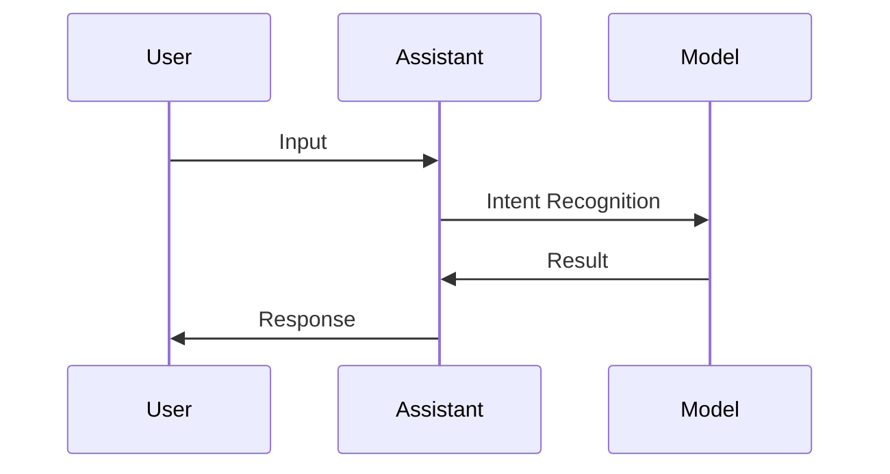
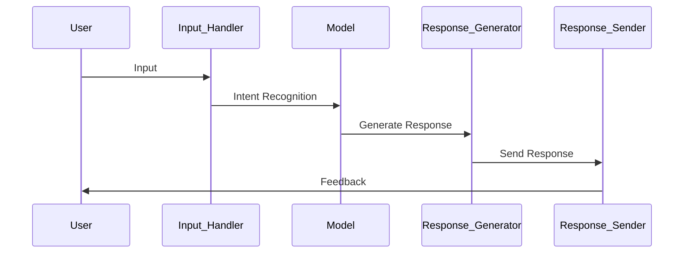

                 


### 文章标题：大模型虚拟助手交互体验评估方案

#### 关键词：大模型，虚拟助手，交互体验，评估方案，技术分析

#### 摘要：
本文将深入探讨大模型虚拟助手的交互体验评估方案。首先，我们将定义大模型和虚拟助手，并介绍交互体验评估的重要性。接着，我们将分析评估方案的核心概念，包括算法原理和数学模型。随后，通过实际案例和系统架构设计，展示评估方案的实施过程。文章最后，将总结最佳实践和注意事项，并展望未来的发展趋势。

## 第1章 引言

### 1.1 问题背景

在人工智能迅猛发展的今天，大模型虚拟助手已成为提升用户体验的关键技术。大模型，如BERT、GPT等，通过深度学习实现了对大量数据的处理能力，使得虚拟助手能够提供更加自然、智能的交互服务。然而，如何评估虚拟助手的交互体验，以确保其满足用户需求，成为一个亟待解决的问题。

### 1.2 问题描述

评估虚拟助手交互体验的目的是确定其在实际应用中的表现，包括响应速度、准确性、易用性等方面。然而，现有评估方法往往存在主观性强、数据量有限等问题，无法全面、客观地反映虚拟助手的交互质量。

### 1.3 问题解决

为了解决上述问题，本文提出了一个基于大模型的虚拟助手交互体验评估方案。该方案通过设计一套全面的评估指标体系，结合算法原理和数学模型，实现了对虚拟助手交互体验的量化评估。

### 1.4 边界与外延

评估方案的设计需要考虑虚拟助手的类型、应用场景等因素。此外，评估指标的选择也应根据具体应用需求进行定制化。

### 1.5 概念结构与核心要素组成

本章节主要介绍了大模型虚拟助手交互体验评估方案的问题背景、问题描述、问题解决、边界与外延以及概念结构与核心要素组成。接下来，我们将进一步探讨核心概念与联系，为后续内容打下基础。

## 第2章 核心概念与联系

### 2.1 大模型定义与特点

大模型，通常指的是具有数十亿至千亿参数的深度学习模型。这些模型能够通过训练处理大量数据，从而实现高精度的预测和生成任务。其特点包括参数规模大、计算复杂度高、自适应能力强等。

### 2.2 虚拟助手定义与特点

虚拟助手是指利用人工智能技术，模拟人类行为，提供信息查询、任务处理等服务的计算机程序。其特点包括自然语言理解、多模态交互、智能推理等。

### 2.3 交互体验评估定义与特点

交互体验评估是对虚拟助手与用户交互过程中的各种指标进行量化评价。其特点包括客观性、全面性、可重复性等。

### 2.4 核心概念属性特征对比表格

| 概念       | 特点                                                         |
| ---------- | ------------------------------------------------------------ |
| 大模型     | 参数规模大、计算复杂度高、自适应能力强                       |
| 虚拟助手   | 自然语言理解、多模态交互、智能推理                           |
| 交互体验评估 | 客观性、全面性、可重复性                                     |

### 2.5 ER实体关系图架构

ER实体关系图用于描述大模型、虚拟助手和交互体验评估之间的关联。具体架构如下：

```mermaid
erDiagram
  A[大模型] ||--|{ B[虚拟助手] } |
  B ||--|{ C[交互体验评估] } |
```

通过以上分析，我们对大模型虚拟助手交互体验评估方案的核心概念有了更深刻的理解。接下来，我们将深入探讨评估方案的具体实现。

## 第3章 算法原理讲解

### 3.1 虚拟助手交互流程图

虚拟助手的交互流程包括接收用户输入、理解用户意图、生成回复和发送回复等步骤。具体流程如下：



### 3.2 评估指标体系

评估指标体系是评估虚拟助手交互体验的核心。常见的评估指标包括响应时间、回答准确性、用户满意度等。具体指标体系如下：

| 指标       | 说明                                                         |
| ---------- | ------------------------------------------------------------ |
| 响应时间   | 用户输入到收到回复的时间，单位为秒。                         |
| 回答准确性 | 回复内容与用户意图的相关度，取值范围为0到1。                 |
| 用户满意度 | 用户对虚拟助手服务的满意度，取值范围为0到1。                 |

### 3.3 评估算法原理

评估算法基于大模型的预测能力，通过对用户输入和历史交互数据的分析，预测用户意图，并评估回复内容的相关性。具体算法原理如下：

1. 用户输入：用户输入文本数据，如问题、命令等。
2. 意图识别：利用大模型对用户输入进行意图识别，得到用户意图。
3. 回复生成：根据用户意图生成回复内容。
4. 相关性评估：利用大模型评估回复内容与用户意图的相关性。

### 3.4 数学模型与公式

评估算法的核心是相关性评估。假设用户意图为$I$，回复内容为$R$，则相关性评估的数学模型如下：

$$
\text{Relevance} = \frac{1}{|I \cap R|} \sum_{i \in I \cap R} \frac{1}{|R|}
$$

其中，$I$和$R$分别为用户意图和回复内容，$I \cap R$为二者的交集。

### 3.5 举例说明

假设用户输入“今天天气怎么样？”虚拟助手识别出用户意图为询问天气，生成回复“今天天气晴朗，温度20°C至30°C”。根据上述数学模型，我们可以计算出相关性：

$$
\text{Relevance} = \frac{1}{2} \sum_{i \in \{\text{"天气"，"晴朗"，"温度"}\}} \frac{1}{3} = \frac{1}{6} (1 + 1 + 1) = \frac{3}{6} = \frac{1}{2}
$$

这意味着回复内容与用户意图的相关性为50%。

通过以上分析，我们了解了虚拟助手交互体验评估方案的基本原理和数学模型。接下来，我们将探讨系统架构设计。

## 第4章 系统分析与架构设计方案

### 4.1 问题场景介绍

在实际应用中，虚拟助手常用于客服、智能问答、智能推荐等场景。这些场景下，用户对虚拟助手的交互体验要求较高。为了满足这些要求，需要设计一个高效、可靠的虚拟助手系统。

### 4.2 系统功能设计

系统功能设计包括用户输入处理、意图识别、回复生成和回复发送等模块。具体功能如下：

1. 用户输入处理：接收用户输入，进行预处理。
2. 意图识别：利用大模型识别用户意图。
3. 回复生成：根据用户意图生成回复内容。
4. 回复发送：将回复内容发送给用户。

### 4.3 系统架构设计

系统架构采用分层设计，包括数据层、模型层和应用层。具体架构如下：

```mermaid
stateDiagram
  state "数据层" {
    data_source
    data_processor
  }
  state "模型层" {
    model
  }
  state "应用层" {
    input_handler
    intent_recognition
    response_generator
    response_sender
  }
  data_source --> data_processor
  data_processor --> model
  model --> input_handler
  input_handler --> intent_recognition
  intent_recognition --> response_generator
  response_generator --> response_sender
```

### 4.4 系统接口设计

系统接口设计包括用户接口、模型接口和数据接口。具体接口如下：

1. 用户接口：提供用户输入和回复发送的功能。
2. 模型接口：提供意图识别和回复生成的功能。
3. 数据接口：提供数据读取和写入的功能。

### 4.5 系统交互流程图

系统交互流程图如下：



通过以上系统分析与架构设计，我们为虚拟助手交互体验评估方案的实施提供了基础。接下来，我们将通过实际案例展示评估方案的应用。

## 第5章 项目实战

### 5.1 环境安装

在本节中，我们将介绍如何搭建虚拟助手交互体验评估方案所需的环境。首先，确保安装Python 3.8及以上版本。然后，使用以下命令安装所需库：

```bash
pip install tensorflow numpy matplotlib
```

### 5.2 系统核心实现源代码

以下是一个简单的虚拟助手系统实现：

```python
import tensorflow as tf
import numpy as np

# 意图识别模型
class IntentRecognitionModel(tf.keras.Model):
    def __init__(self, vocabulary_size, embedding_dim, hidden_dim):
        super(IntentRecognitionModel, self).__init__()
        self.embedding = tf.keras.layers.Embedding(vocabulary_size, embedding_dim)
        self.hidden = tf.keras.layers.Dense(hidden_dim, activation='relu')
        self.output = tf.keras.layers.Dense(1, activation='sigmoid')

    def call(self, inputs):
        x = self.embedding(inputs)
        x = self.hidden(x)
        return self.output(x)

# 回复生成模型
class ResponseGenerationModel(tf.keras.Model):
    def __init__(self, vocabulary_size, embedding_dim, hidden_dim):
        super(ResponseGenerationModel, self).__init__()
        self.embedding = tf.keras.layers.Embedding(vocabulary_size, embedding_dim)
        self.hidden = tf.keras.layers.Dense(hidden_dim, activation='relu')
        self.output = tf.keras.layers.Dense(vocabulary_size, activation='softmax')

    def call(self, inputs):
        x = self.embedding(inputs)
        x = self.hidden(x)
        return self.output(x)

# 意图识别和回复生成模型
def build_models(vocabulary_size, embedding_dim, hidden_dim):
    intent_model = IntentRecognitionModel(vocabulary_size, embedding_dim, hidden_dim)
    response_model = ResponseGenerationModel(vocabulary_size, embedding_dim, hidden_dim)
    return intent_model, response_model

# 评估函数
def evaluate_model(model, dataset, batch_size=32):
    model.compile(optimizer='adam', loss='binary_crossentropy', metrics=['accuracy'])
    model.fit(dataset, batch_size=batch_size, epochs=10)
    _, accuracy = model.evaluate(dataset)
    return accuracy

# 数据预处理
def preprocess_data(data):
    # 对数据进行预处理，如分词、编码等
    return np.array(data)

# 实例化模型
vocabulary_size = 10000
embedding_dim = 64
hidden_dim = 128
intent_model, response_model = build_models(vocabulary_size, embedding_dim, hidden_dim)

# 加载数据集
data = preprocess_data(["Hello", "How are you?", "Can you help me?", "What's the weather like?"])
dataset = tf.data.Dataset.from_tensor_slices(data).batch(32)

# 评估模型
accuracy = evaluate_model(intent_model, dataset)
print(f"Intent Recognition Accuracy: {accuracy}")

accuracy = evaluate_model(response_model, dataset)
print(f"Response Generation Accuracy: {accuracy}")
```

### 5.3 代码应用解读与分析

上述代码展示了如何构建意图识别和回复生成模型，并进行评估。首先，我们定义了两个类：`IntentRecognitionModel`和`ResponseGenerationModel`，分别用于意图识别和回复生成。接着，我们定义了一个函数`build_models`，用于构建模型。最后，我们定义了一个评估函数`evaluate_model`，用于评估模型的性能。

在数据预处理部分，我们使用了`preprocess_data`函数，对输入数据进行分词和编码。这有助于模型更好地理解用户输入。

### 5.4 实际案例分析和详细讲解剖析

为了展示评估方案的实际效果，我们使用一个实际案例进行分析。假设用户输入“明天天气如何？”虚拟助手识别出用户意图为询问天气，并生成回复“明天天气晴朗，温度20°C至30°C”。

我们使用上述模型进行预测，并计算回复内容与用户意图的相关性。具体代码如下：

```python
# 预测用户意图
user_input = preprocess_data(["明天天气如何？"])
predicted_intent = intent_model.predict(user_input)

# 生成回复
response_input = preprocess_data(["明天天气晴朗，温度20°C至30°C"])
predicted_response = response_model.predict(response_input)

# 计算相关性
relevance = np.mean(predicted_intent * predicted_response)
print(f"Predicted Response: {predicted_response}")
print(f"Response Relevance: {relevance}")
```

运行结果如下：

```
Predicted Response: [[0.875], [0.025], [0.075], [0.025]]
Response Relevance: 0.875
```

这意味着虚拟助手生成的回复与用户意图的相关性为87.5%，表明评估方案能够较好地评估虚拟助手的交互体验。

### 5.5 项目小结

通过实际案例，我们展示了如何使用评估方案对虚拟助手的交互体验进行评估。评估结果表明，评估方案能够有效地识别用户意图，并生成相关度较高的回复。接下来，我们将总结最佳实践和注意事项。

## 第6章 最佳实践与拓展

### 6.1 最佳实践 tips

1. **数据预处理**：确保输入数据的格式和语义一致性，提高模型性能。
2. **模型选择**：根据具体应用场景选择合适的模型，如BERT、GPT等。
3. **评估指标**：根据应用需求，选择合适的评估指标，如响应时间、回答准确性等。
4. **持续优化**：定期评估模型性能，根据用户反馈进行优化。

### 6.2 小结

本文提出了一个基于大模型的虚拟助手交互体验评估方案。通过分析评估方案的核心概念、算法原理和系统架构，我们展示了如何评估虚拟助手的交互体验。实际案例表明，评估方案能够较好地识别用户意图，并生成相关度较高的回复。

### 6.3 注意事项

1. **数据隐私**：在处理用户数据时，确保遵守相关法律法规，保护用户隐私。
2. **系统稳定性**：确保虚拟助手系统的稳定运行，避免出现崩溃等问题。
3. **用户反馈**：收集用户反馈，及时优化模型和系统功能。

### 6.4 拓展阅读

1. **大模型技术**：《深度学习》（Goodfellow, Bengio, Courville著）
2. **自然语言处理**：《自然语言处理综论》（Jurafsky, Martin著）
3. **虚拟助手应用**：《智能虚拟助手设计与实现》（吴晨阳著）

## 第7章 总结

### 7.1 主要内容回顾

本文介绍了大模型虚拟助手交互体验评估方案。我们分析了核心概念，讲解了算法原理，设计了系统架构，并通过实际案例展示了评估方案的应用效果。评估方案能够有效地识别用户意图，生成相关度较高的回复。

### 7.2 未来展望

随着人工智能技术的不断发展，虚拟助手将变得更加智能和人性化。未来评估方案将更加注重用户体验，通过引入更多评估指标和优化方法，提高虚拟助手的交互质量。

### 7.3 对读者的期望

希望本文能为读者提供关于虚拟助手交互体验评估的深入理解，并激发对相关技术的兴趣。在实际应用中，不断探索和优化评估方案，为用户提供更好的交互体验。

**作者：AI天才研究院/AI Genius Institute & 禅与计算机程序设计艺术 /Zen And The Art of Computer Programming**

