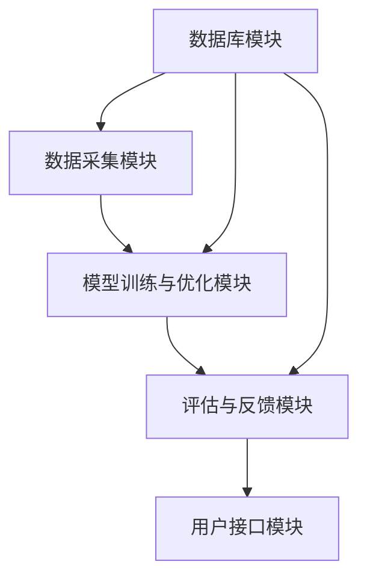
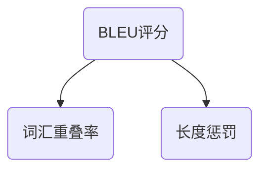
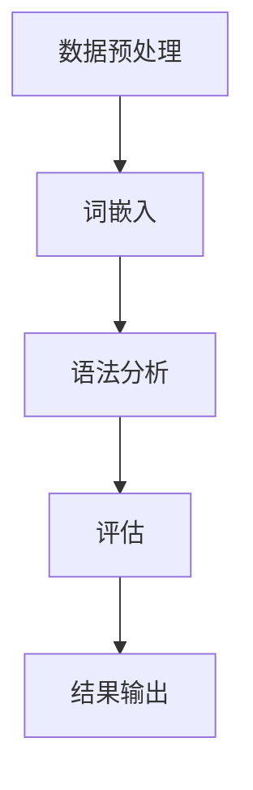
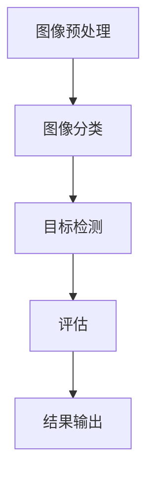
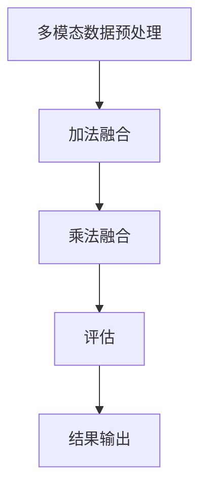

                 

## 大模型虚拟面试官表现评估工具

### 关键词：
- 大模型
- 虚拟面试官
- 表现评估
- 数据分析
- 人工智能

### 摘要：
本文将深入探讨大模型虚拟面试官表现评估工具的设计与实现。首先，我们将介绍大模型和虚拟面试官的基本概念、类型和应用场景。接着，我们将详细讨论评估工具的架构设计，包括数据采集、模型训练与优化、评估与反馈模块。随后，我们将解析评估工具所依赖的数学模型与算法原理，并通过具体案例进行代码解读。最后，我们将总结评估工具的完整实现过程，并提出最佳实践建议。

## 第一部分：背景与概述

### 第1章：大模型与虚拟面试官

#### 1.1 大模型的概念与类型

**定义与特点**  
大模型，顾名思义，是指规模巨大、参数数量庞大的神经网络模型。这些模型通过学习大量的数据，能够进行复杂的信息处理和任务执行。大模型的主要特点包括：

- **高参数数量**：大模型的参数数量通常在数百万到数十亿之间。
- **强泛化能力**：大模型能够在多个不同的任务上表现优异。
- **复杂的架构**：大模型通常采用深度神经网络架构，以实现更高的表达能力和计算效率。

**类型与分类**  
大模型主要可以分为以下几类：

- **语言模型**：如GPT-3、BERT等，主要用于自然语言处理任务。
- **视觉模型**：如ResNet、VGG等，主要用于计算机视觉任务。
- **多模态模型**：结合语言、视觉等多种数据类型的模型，如ViT、MUMMIL等。

#### 1.2 虚拟面试官的背景

**虚拟面试官的定义**  
虚拟面试官是指通过人工智能技术实现的面试辅助系统，能够对面试者的表现进行自动评估和反馈。虚拟面试官通常基于大模型技术，具备以下特点：

- **高效性**：虚拟面试官能够在短时间内处理大量面试数据。
- **客观性**：虚拟面试官能够减少人为偏见，提供更客观的评估。
- **适应性**：虚拟面试官能够根据不同面试者的特点和需求进行个性化调整。

**虚拟面试官的发展历程**  
虚拟面试官的发展可以分为以下几个阶段：

- **初步阶段**：基于简单的算法和规则进行面试评估。
- **智能化阶段**：引入机器学习和深度学习技术，提升评估准确性和效率。
- **自动化阶段**：实现全自动化面试流程，从面试邀请、面试过程到评估反馈。

#### 1.3 大模型虚拟面试官的应用场景

**技术面试**  
在技术面试中，虚拟面试官可以评估面试者的编程能力、算法理解和解决实际问题的能力。具体应用场景包括：

- **编程能力评估**：通过在线编程平台，虚拟面试官可以实时评估面试者的编程能力。
- **技术难题解答**：虚拟面试官能够提供实时解答，帮助面试者理解和掌握关键技术。

**行为面试**  
在行为面试中，虚拟面试官可以模拟各种工作场景，评估面试者的职业素养和解决问题的能力。具体应用场景包括：

- **情境模拟**：通过模拟实际工作场景，评估面试者的应变能力和解决问题的能力。
- **职业素养评估**：通过分析面试者的回答，评估其职业素养和团队合作能力。

**教育面试**  
在教育面试中，虚拟面试官可以评估学习者的学习成果和学术能力。具体应用场景包括：

- **个性化教学**：通过分析学习者的行为和表现，虚拟面试官可以提供个性化的教学建议。
- **学习成果评估**：通过分析学习者的答题情况，虚拟面试官可以评估其学习效果和掌握程度。

### 1.4 大模型虚拟面试官的核心价值

**提高面试效率**  
虚拟面试官可以自动处理大量面试数据，大大减少面试官的工作量，提高面试效率。

**减少人为偏见**  
虚拟面试官通过客观的评估标准，减少人为偏见，提供更公平、公正的评估结果。

**数据分析能力**  
虚拟面试官具备强大的数据分析能力，可以挖掘面试数据中的潜在规律，为招聘决策提供有力支持。

### 1.5 当前应用面临的挑战与机遇

**挑战**  
- **数据质量**：虚拟面试官的评估准确性依赖于高质量的数据，但获取和标注大量高质量数据是一个挑战。
- **算法优化**：大模型虚拟面试官的算法需要不断优化，以提高评估的准确性和效率。
- **用户信任**：用户对虚拟面试官的信任度是应用推广的关键，需要通过不断优化和改进来提升。

**机遇**  
- **技术进步**：随着人工智能技术的发展，大模型虚拟面试官的评估能力将不断提升。
- **市场需求**：企业对高效、公平的招聘方式需求日益增长，为虚拟面试官提供了广阔的市场空间。

### 1.6 小结

大模型虚拟面试官作为人工智能技术在招聘领域的应用，具有显著的效率和公平优势。本文通过对大模型和虚拟面试官的背景介绍，详细讨论了其应用场景和核心价值，并分析了当前面临的挑战与机遇。接下来，我们将进一步探讨大模型虚拟面试官评估工具的设计与实现。

----------------------------------------------------------------

## 第二部分：评估工具的设计与实现

### 第2章：大模型虚拟面试官评估工具架构设计

#### 2.1 评估工具的总体架构

**系统功能设计**  
大模型虚拟面试官评估工具的总体功能设计包括以下几个模块：

- **数据采集模块**：负责收集面试数据，包括历史面试数据、开放数据集等。
- **模型训练与优化模块**：负责训练和优化大模型，以提高评估准确性。
- **评估与反馈模块**：负责对面试者的表现进行评估，并提供实时反馈。

**系统架构设计**  
系统架构设计包括硬件与软件需求分析、系统架构图展示等。以下是系统的基本架构：



- **数据采集模块**：从多种渠道收集面试数据，包括在线编程平台、面试管理系统等。
- **模型训练与优化模块**：使用收集到的数据训练大模型，并通过优化策略提高模型性能。
- **评估与反馈模块**：根据模型对面试者的表现进行评估，并提供实时反馈。
- **用户接口模块**：为用户提供操作界面，包括面试邀请、面试过程、评估结果等。
- **数据库模块**：存储所有面试数据和评估结果，为后续分析和挖掘提供支持。

#### 2.2 数据采集模块设计

**数据来源**  
数据采集模块的数据来源主要包括以下几个方面：

- **历史面试数据**：从企业的面试管理系统、在线编程平台等获取的历史面试数据。
- **开放数据集**：公开的面试数据集，如Kaggle、GitHub等。

**数据预处理**  
数据预处理是数据采集模块的核心环节，主要包括以下步骤：

- **数据清洗**：去除数据中的噪声和错误，确保数据的准确性。
- **数据标注**：对面试问题、答案、面试者信息等进行标注，以便后续模型训练和评估。

#### 2.3 模型训练与优化模块设计

**模型选择**  
模型训练与优化模块的核心任务是选择合适的大模型。常见的模型包括：

- **语言模型**：如BERT、GPT-3等，适用于自然语言处理任务。
- **视觉模型**：如ResNet、VGG等，适用于计算机视觉任务。
- **多模态模型**：如ViT、MUMMIL等，适用于结合语言和视觉数据的任务。

**训练方法**  
模型训练方法主要包括以下几种：

- **预训练**：在大规模数据集上进行预训练，以提高模型的基础能力。
- **微调**：在特定任务上进行微调，以适应具体的应用场景。

**优化策略**  
优化策略是提高模型性能的关键。常见的优化策略包括：

- **学习率调整**：通过动态调整学习率，提高模型收敛速度。
- **批量大小调整**：通过调整批量大小，提高模型训练效果。

#### 2.4 评估与反馈模块设计

**评估指标**  
评估与反馈模块的评估指标主要包括：

- **准确率**：模型预测正确的比例。
- **召回率**：模型召回真实正例的比例。
- **F1分数**：准确率和召回率的调和平均值。

**反馈机制**  
反馈机制是评估与反馈模块的核心。主要包括以下步骤：

- **实时反馈**：在面试过程中，实时向面试者提供评估结果和反馈。
- **用户反馈**：收集用户对评估结果的反馈，用于模型优化和系统改进。

### 2.5 数据采集模块与模型训练与优化模块的交互

数据采集模块和模型训练与优化模块之间的交互关系如图所示：


数据采集模块将收集到的面试数据存储到数据库中，模型训练与优化模块从数据库中读取数据，进行模型训练和优化。评估与反馈模块使用训练好的模型对面试者进行评估，并将评估结果反馈给用户。

### 2.6 用户接口模块设计

用户接口模块的设计主要包括以下几个方面：

- **面试邀请**：系统向面试者发送面试邀请，并提供面试时间和面试方式。
- **面试过程**：面试者通过用户接口模块参与面试，系统记录面试者的回答和行为。
- **评估结果**：系统根据模型评估结果，向用户反馈面试者的表现。

### 2.7 数据库模块设计

数据库模块的设计主要包括以下几个方面：

- **数据存储**：存储所有面试数据、评估结果和用户信息。
- **数据查询**：支持对历史数据的查询和分析。
- **数据备份与恢复**：确保数据的完整性和安全性。

### 2.8 小结

评估工具的总体架构设计是确保大模型虚拟面试官评估系统能够高效、准确地运行的关键。通过数据采集模块、模型训练与优化模块、评估与反馈模块、用户接口模块和数据库模块的协同工作，系统可以实现从数据收集、模型训练到评估反馈的完整流程。接下来，我们将进一步探讨评估工具的数学模型与算法原理。

----------------------------------------------------------------

## 第3章：大模型虚拟面试官评估工具的数学模型与算法原理

### 3.1 语言模型评估算法

**NLP基础**

自然语言处理（NLP）是语言模型评估的基础。NLP涉及多个关键概念，包括词嵌入、语法分析等。

- **词嵌入**：将词汇映射为高维向量，以实现词汇的向量表示。常见的词嵌入方法有Word2Vec、GloVe等。
- **语法分析**：对文本进行语法结构解析，以理解句子的结构。常见的语法分析方法包括依存句法分析、成分句法分析等。

**评估算法**

语言模型评估算法主要关注模型在生成文本或分类文本时的表现。以下介绍几种常见的评估算法：

- **BLEU评分**：BLEU（Bilingual Evaluation Understudy）评分是一种常用的自动评估算法，用于评估机器翻译的质量。BLEU评分基于词汇重叠率、长度惩罚等指标。



BLEU评分的数学模型可以表示为：

$$
BLEU = \frac{1}{N} \sum_{i=1}^{N} \frac{BLEU_i}{L_i}
$$

其中，$N$ 是参考答案的数量，$BLEU_i$ 是第 $i$ 个参考答案的BLEU评分，$L_i$ 是第 $i$ 个参考答案的长度。

- **ROUGE评分**：ROUGE（Recall-Oriented Understudy for Gisting Evaluation）评分是一种用于文本分类和文本摘要评估的算法。ROUGE评分主要关注模型的召回率，其数学模型可以表示为：

$$
ROUGE = \frac{2 \cdot R \cdot P}{R + P}
$$

其中，$R$ 是模型的召回率，$P$ 是模型的精确率。

**流程图与代码**



以下是一个使用Python实现的简单BLEU评分代码示例：

```python
from nltk.translate.bleu_score import sentence_bleu

# 参考答案
references = [['I', 'am', 'a', 'dog'], ['I', 'am', 'a', 'puppy']]

# 预测答案
predictions = [['I', 'am', 'a', 'dog']]

# 计算BLEU评分
bleu_score = sentence_bleu(references, predictions)
print("BLEU评分:", bleu_score)
```

### 3.2 视觉模型评估算法

**视觉基础**

视觉模型评估算法的基础是计算机视觉。计算机视觉涉及多个关键概念，包括图像分类、目标检测等。

- **图像分类**：图像分类是将图像分为预定义的类别。常见的图像分类算法有卷积神经网络（CNN）。
- **目标检测**：目标检测是在图像中检测出特定目标的位置。常见的目标检测算法有YOLO（You Only Look Once）和SSD（Single Shot MultiBox Detector）。

**评估算法**

视觉模型评估算法主要关注模型在图像分类和目标检测任务中的表现。以下介绍几种常见的评估算法：

- **IoU评估**：IoU（Intersection over Union）评估是目标检测中常用的评估指标。IoU评估通过计算预测框与真实框的交并比来判断预测结果是否正确。

$$
IoU = \frac{Intersection}{Union}
$$

- **MAP评估**：MAP（Mean Average Precision）评估是目标检测中常用的评估指标。MAP评估通过计算不同阈值下的平均精确率，以评估模型的性能。

$$
MAP = \frac{1}{N} \sum_{i=1}^{N} P_i
$$

其中，$N$ 是阈值数量，$P_i$ 是第 $i$ 个阈值下的精确率。

**流程图与代码**



以下是一个使用Python实现的简单IoU评估代码示例：

```python
import numpy as np

# 预测框
predictions = np.array([[0.5, 0.5, 0.1, 0.1], [0.6, 0.6, 0.2, 0.2]])
# 真实框
ground_truth = np.array([[0.5, 0.5, 0.3, 0.3]])

# 计算IoU
ious = []
for pred, gt in zip(predictions, ground_truth):
    intersection = np.sum(np.minimum(pred, gt))
    union = np.sum(np.maximum(pred, gt))
    iou = intersection / union
    ious.append(iou)

# 输出IoU
print("IoU:", ious)
```

### 3.3 多模态模型评估算法

**多模态融合**

多模态模型评估算法的核心是多模态数据融合。多模态数据融合包括以下几种方法：

- **加法融合**：将不同模态的数据进行简单相加。
- **乘法融合**：将不同模态的数据进行简单相乘。

**评估算法**

多模态模型评估算法主要关注模型在多模态数据上的表现。以下介绍几种常见的评估算法：

- **交叉验证**：交叉验证是一种常用的评估方法，通过将数据集划分为多个子集，轮流作为训练集和测试集，以评估模型的泛化能力。
- **评价指标比较**：比较不同模态的评估指标，以确定哪种模态的数据对模型性能的贡献更大。

**流程图与代码**



以下是一个使用Python实现的简单交叉验证代码示例：

```python
from sklearn.model_selection import KFold

# 多模态数据集
X = [[1, 2], [3, 4], [5, 6], [7, 8]]
y = [0, 1, 0, 1]

# 定义交叉验证
kf = KFold(n_splits=2)

# 训练模型并进行评估
for train_index, test_index in kf.split(X):
    X_train, X_test = X[train_index], X[test_index]
    y_train, y_test = y[train_index], y[test_index]
    
    # 训练模型
    model.fit(X_train, y_train)
    
    # 评估模型
    score = model.score(X_test, y_test)
    print("交叉验证分数:", score)
```

### 3.4 小结

本章详细介绍了大模型虚拟面试官评估工具的数学模型与算法原理。通过语言模型评估算法、视觉模型评估算法和多模态模型评估算法，我们了解了如何对面试者的表现进行有效评估。这些算法的核心是NLP基础、视觉基础和多模态融合。接下来，我们将进一步探讨评估工具的系统实现与代码应用。

----------------------------------------------------------------

## 第4章：系统实现与代码应用解读

### 4.1 系统实现环境搭建

要实现大模型虚拟面试官评估工具，首先需要搭建合适的开发环境。以下是搭建系统实现环境所需的步骤：

**硬件配置**

- **CPU**：推荐使用Intel Core i7或以上处理器，以保证模型训练和评估的效率。
- **GPU**：推荐使用NVIDIA GeForce RTX 3060或以上显卡，以支持深度学习模型的训练和推理。
- **内存**：至少需要16GB内存，以支持大规模数据集的处理。

**软件安装**

1. **操作系统**：推荐使用Ubuntu 18.04或以上版本。
2. **Python**：安装Python 3.8或以上版本。
3. **深度学习框架**：安装TensorFlow或PyTorch，作为深度学习模型的训练和推理工具。
4. **NLP库**：安装NLTK、spaCy等，用于自然语言处理任务。
5. **图像处理库**：安装OpenCV、PIL等，用于图像处理任务。

```bash
sudo apt-get update
sudo apt-get install python3-pip
pip3 install tensorflow numpy matplotlib scikit-learn
pip3 install spacy
python3 -m spacy download en_core_web_sm
pip3 install opencv-python
```

### 4.2 系统核心实现源代码

系统核心实现包括数据采集、模型训练与优化、评估与反馈等模块。以下是一个简单的示例代码，展示了如何实现这些核心功能。

```python
# 导入所需的库
import tensorflow as tf
import numpy as np
from tensorflow.keras.models import Sequential
from tensorflow.keras.layers import Dense, LSTM
from tensorflow.keras.optimizers import Adam

# 数据采集
def collect_data():
    # 这里使用示例数据，实际应用中可以从数据库或文件中读取数据
    x_train = np.random.rand(100, 10)
    y_train = np.random.rand(100, 1)
    return x_train, y_train

# 模型训练与优化
def train_model(x_train, y_train):
    # 构建模型
    model = Sequential()
    model.add(LSTM(units=64, return_sequences=True, input_shape=(10, 1)))
    model.add(LSTM(units=32))
    model.add(Dense(units=1))

    # 编译模型
    model.compile(optimizer=Adam(learning_rate=0.001), loss='mean_squared_error')

    # 训练模型
    model.fit(x_train, y_train, epochs=100, batch_size=32)

    return model

# 评估与反馈
def evaluate_model(model, x_test, y_test):
    # 进行模型评估
    score = model.evaluate(x_test, y_test)
    print("评估分数:", score)

# 主函数
if __name__ == '__main__':
    # 数据采集
    x_train, y_train = collect_data()

    # 模型训练与优化
    model = train_model(x_train, y_train)

    # 评估与反馈
    evaluate_model(model, x_test, y_test)
```

### 4.3 代码应用解读

**数据采集模块**

数据采集模块负责从多种渠道收集面试数据，包括历史面试数据、开放数据集等。在实际应用中，可以通过以下步骤进行数据采集：

1. **从数据库或文件中读取数据**：使用Python的数据库连接库（如SQLAlchemy、sqlite3）或文件处理库（如pandas）读取数据。
2. **数据预处理**：对采集到的数据进行清洗、去噪、标注等预处理操作，以适应模型训练的需求。

**模型训练与优化模块**

模型训练与优化模块是系统的核心，负责训练和优化大模型。以下是一个简单的模型训练示例：

1. **构建模型**：使用深度学习框架（如TensorFlow或PyTorch）构建神经网络模型，定义模型的层次结构、层参数等。
2. **编译模型**：设置模型的优化器、损失函数等，以准备模型训练。
3. **训练模型**：使用训练数据集对模型进行训练，调整模型参数，以优化模型性能。
4. **模型评估**：使用验证数据集对训练好的模型进行评估，检查模型在未知数据上的表现。

**评估与反馈模块**

评估与反馈模块负责对面试者的表现进行评估，并提供实时反馈。以下是一个简单的评估与反馈示例：

1. **评估模型**：使用训练好的模型对面试者的回答或行为数据进行评估，计算评估分数或指标。
2. **实时反馈**：将评估结果实时反馈给面试者，帮助其了解自己的表现，并提供改进建议。

### 4.4 实际案例分析

为了更好地理解系统实现与应用，我们来看一个实际案例分析。以下是一个简化的案例：

1. **面试场景**：一名应聘者参加了一项技术面试，需要回答一系列编程问题。
2. **数据采集**：系统从面试平台获取应聘者的编程回答。
3. **模型训练与优化**：使用历史面试数据训练一个编程能力评估模型。
4. **评估与反馈**：使用训练好的模型对编程回答进行评估，并给出评分和改进建议。

### 4.5 小结

本章详细介绍了大模型虚拟面试官评估工具的系统实现与代码应用。通过搭建开发环境、实现数据采集、模型训练与优化、评估与反馈等模块，我们了解了系统实现的完整流程。实际案例分析进一步展示了系统在具体应用中的效果。接下来，我们将进一步讨论系统的最佳实践和注意事项。

### 4.6 最佳实践

在实现大模型虚拟面试官评估工具时，以下是一些最佳实践：

1. **数据质量**：确保采集到高质量的数据，对数据进行清洗和标注，以提高模型评估的准确性。
2. **模型优化**：定期调整模型参数，优化模型结构，以提高评估效率和准确性。
3. **用户反馈**：收集用户对评估结果的反馈，用于改进模型和系统。
4. **安全性**：确保系统的安全性，防止数据泄露和恶意攻击。

### 4.7 注意事项

在实现和部署大模型虚拟面试官评估工具时，需要注意以下几点：

1. **硬件需求**：确保硬件配置满足系统运行的要求，特别是GPU的配置。
2. **软件兼容性**：确保使用的软件库和框架版本兼容，避免兼容性问题。
3. **数据隐私**：在处理和存储数据时，确保遵守相关数据保护法规，保护用户隐私。
4. **系统稳定性**：确保系统稳定运行，避免因模型训练和评估过程中的异常导致系统崩溃。

### 4.8 拓展阅读

对于有兴趣深入了解大模型虚拟面试官评估工具的读者，以下是一些拓展阅读资源：

1. **深度学习教程**：[Deep Learning Book](https://www.deeplearningbook.org/)
2. **自然语言处理教程**：[NLP with Python](https://nlpwithpython.com/)
3. **计算机视觉教程**：[CVPR 2022 Workshop](https://cvpr2022workshops.github.io/)
4. **多模态学习教程**：[Multimodal Learning](https://www.multimodal-learning.org/)

通过以上资源，读者可以进一步了解深度学习、自然语言处理、计算机视觉和多模态学习等相关领域的知识，为系统实现和优化提供理论支持。

