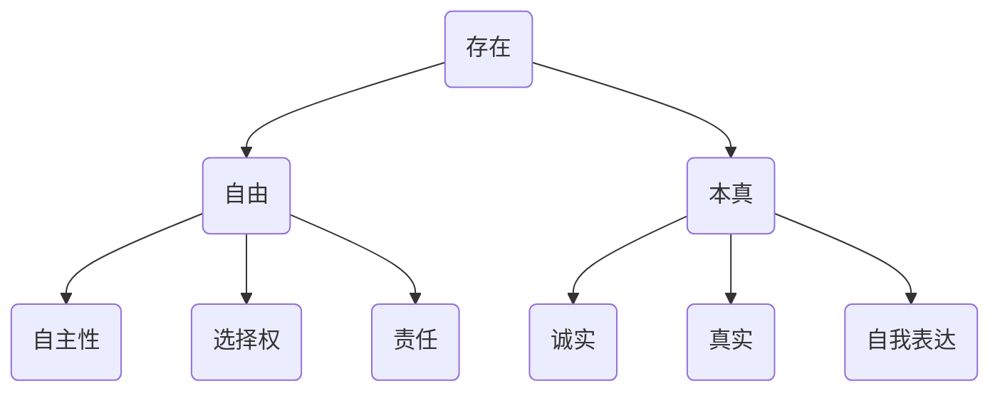
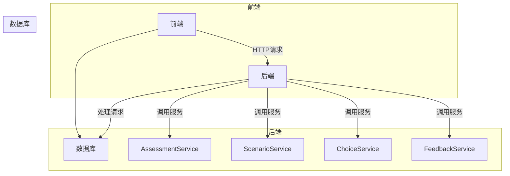
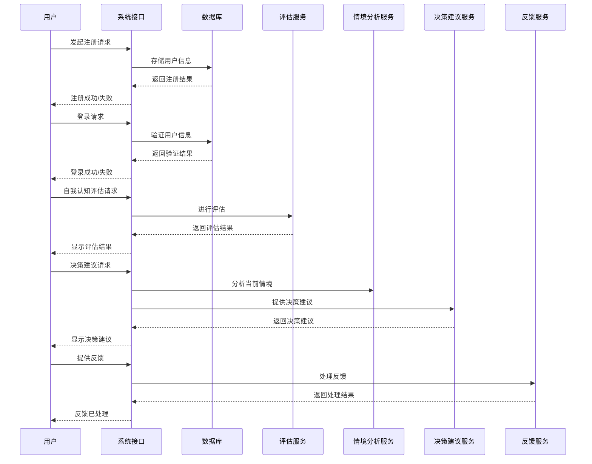

                 

# 《存在主义思想的现代适应：在虚无中寻找本真》

> 关键词：存在主义、现代适应、虚无、本真、心理学、文学、艺术、教育、自我实现

> 摘要：本文旨在探讨存在主义思想的现代适应，特别是在虚无中寻找本真的过程。通过对存在主义思想的历史背景、核心概念、核心人物以及现代社会的适应进行分析，文章揭示了存在主义在现代心理学、文学、艺术、教育和个人成长等领域的重要作用。本文首先介绍了存在主义思想的核心概念，包括存在、自由和本真，并对比了这些概念与传统哲学的差异。接着，本文详细分析了存在主义在心理学中的应用，以及存在主义在文学和艺术中的体现。随后，文章探讨了存在主义思想在当代社会问题中的解读和解决方法，以及存在主义教育理念和自我实现的关系。最后，本文总结了存在主义思想的现代适应，并对其未来发展的前景进行了展望。

## 第一部分：存在主义思想的概述

### 第1章：存在主义思想的历史背景与核心概念

#### 1.1.1 存在主义思想的起源与发展

存在主义（Existentialism）是20世纪初期兴起的一种哲学思潮，其起源可以追溯到19世纪末和20世纪初的欧洲。在第一次世界大战的背景下，人们对于传统哲学的信仰产生了怀疑，存在主义作为一种回应，提出了对于个体自由、责任和存在的重新思考。

存在主义的主要代表人物包括马丁·海德格尔（Martin Heidegger）、让-保尔·萨特（Jean-Paul Sartre）、西格蒙德·弗洛伊德（Sigmund Freud）和维克多·弗兰克尔（Viktor Frankl）等。这些哲学家和心理学家在存在主义思想的发展中起到了关键作用。

#### 1.1.2 存在主义的基本理论框架

存在主义的核心理论框架主要包括存在、自由和本真这三个概念。

- 存在（Existence）：存在主义强调个体的存在是独一无二的，每个人都有自己的存在方式和意义。
- 自由（Freedom）：存在主义认为自由是人类存在的本质，个体拥有自由选择和行动的能力。
- 本真（Authenticity）：存在主义强调个体在面对生活的真实性和挑战时，要坚守自己的信念和价值观，实现真正的自我。

#### 1.1.3 存在主义的核心概念：存在、自由、本真

- 存在：存在主义认为存在是首要的，先有存在，后有本质。个体在世界上独一无二的存在状态，每个人都有自己的生命故事和意义。
- 自由：存在主义认为自由是人类存在的本质，个体拥有自由选择和行动的能力。自由不仅仅是外在的行为选择，更是一种内在的精神状态。
- 本真：存在主义强调个体在面对生活的真实性和挑战时，要坚守自己的信念和价值观，实现真正的自我。本真是指个体在自我表达和行动中保持真实和诚实。

#### 1.1.4 存在主义与哲学传统的关系

存在主义与传统的哲学流派有所不同。与理性主义和实在论不同，存在主义更关注个体的存在和自由。与功利主义和道德哲学不同，存在主义强调个体的本真和自我实现。存在主义不仅是对传统哲学的批判，也是对现代社会的回应，提出了对个体自由和责任的重新思考。

### 第2章：存在主义的核心人物与思想

#### 2.1.1 海德格尔的存在主义

- 海德格尔的存在主义观点：海德格尔认为存在是首要的，先有存在，后有本质。他提出了“存在论”（Ontology）的概念，强调存在的意义和个体自由的重要性。
- 海德格尔的核心概念：海德格尔的核心概念包括“存在”、“本真”和“时间”。他认为存在是一个动态的过程，个体通过自由选择来实现自我，并在时间中展现自己的存在。

#### 2.1.2 萨特的存存主义

- 萨特的存在主义哲学：萨特认为自由是人类存在的本质，个体拥有绝对自由选择的权利。他提出了“存在先于本质”的观点，强调个体在自由选择中塑造自己的本质。
- 萨特的存在主义伦理观：萨特认为个体应该承担责任，为自己的选择和行为负责。他提出了“自由伦理学”的概念，强调个体在自由选择中实现道德责任。

#### 2.1.3 萨特的存在主义文学

- 萨特的作品和文学风格：萨特的作品充满了对自由、存在和伦理的探讨。他的文学风格注重心理描写和人物塑造，通过戏剧和小说表达存在主义的思想。

## 第二部分：存在主义在现代社会的适应

### 第3章：存在主义在心理学中的应用

#### 3.1.1 存在主义心理学的兴起

存在主义心理学是20世纪中期兴起的一种心理学流派，它将存在主义思想应用于心理学研究和实践中。存在主义心理学认为，个体的存在状态和心理体验是理解人类行为和心理过程的关键。

#### 3.1.2 存在主义心理学的主要观点

- 个体存在的主观体验：存在主义心理学强调个体的主观体验和自我意识，认为个体的存在是一个不断变化的动态过程。
- 自由和责任：存在主义心理学认为，个体拥有自由选择和行动的能力，同时也要为自己的选择和行为承担责任。
- 存在主义治疗方法：存在主义心理学家提出了一系列治疗方法，如存在主义心理治疗、认知行为治疗和叙事治疗，帮助个体寻找本真，应对生活中的挑战。

#### 3.1.3 存在主义心理学的方法与工具

- 自我反思：存在主义心理学强调个体通过自我反思来理解自己的存在状态和内心世界。
- 自我接纳：存在主义心理学鼓励个体接受自己的不完美，学会自我接纳和自我关爱。
- 勇气面对恐惧：存在主义心理学认为，个体应该勇敢地面对生活中的恐惧和挑战，通过实践来克服恐惧，实现自我成长。

### 第4章：存在主义在文学与艺术中的体现

#### 4.1.1 存在主义文学的发展

存在主义文学是20世纪文学中的重要流派之一，它通过文学作品表达存在主义思想，探讨个体的自由、责任和本真。

#### 4.1.2 存在主义艺术的特点

- 人物塑造：存在主义艺术注重人物的心理描写和内心世界的挖掘，通过人物的行为和思想展现存在主义思想。
- 主题表达：存在主义艺术探讨了生命的意义、存在的虚无、自由的抉择等主题，强调个体的主观体验和自我意识。
- 表现形式：存在主义艺术在表现形式上具有多样性和创新性，包括小说、戏剧、绘画、雕塑等多种艺术形式。

#### 4.1.3 存在主义作品中的主题与风格

- 主题：存在主义作品通常探讨生命的意义、存在的虚无、自由的抉择、责任和自我实现等主题。
- 风格：存在主义作品在风格上具有现实性、心理描写深刻、哲学思考和文学表现力强等特点。

## 第三部分：存在主义思想的现代实践

### 第5章：存在主义与当代社会问题

#### 5.1.1 存在主义对现代社会问题的解读

存在主义思想对当代社会问题的解读提供了一种独特的视角。存在主义认为，现代社会中的许多问题源于个体的自由选择和责任缺失。

#### 5.1.2 存在主义在解决社会问题中的应用

存在主义思想在社会问题解决中的应用包括：
- 鼓励个体自我反思和自我接纳，帮助个体理解自己的存在状态和内心世界。
- 强调个体自由选择和责任感，鼓励个体为社会变革贡献力量。
- 倡导通过对话和合作解决社会问题，建立更加和谐的社会关系。

#### 5.1.3 存在主义在公共事务中的角色

存在主义思想在公共事务中的角色包括：
- 倡导个体的自由和平等，促进社会公正和人权保护。
- 强调个体的社会责任，鼓励参与公共事务，为社会的进步贡献力量。
- 倡导通过对话和合作解决社会矛盾，建立和谐的社会秩序。

### 第6章：存在主义教育与生活指导

#### 6.1.1 存在主义教育理念的提出

存在主义教育理念强调个体的自由、责任和自我实现。它主张教育应该关注个体的内心世界和个性发展，培养具有独立思考能力和社会责任感的人。

#### 6.1.2 存在主义教育与传统教育的区别

存在主义教育与传统教育的区别主要体现在以下几个方面：
- 强调个体的自由选择和自我实现，而不仅仅是知识的传授。
- 关注个体的心理发展和情感体验，而不仅仅是学业成绩的提高。
- 倡导通过对话和合作进行学习，而不仅仅是灌输和接受。

#### 6.1.3 存在主义在生活指导中的应用

存在主义在生活指导中的应用包括：
- 鼓励个体进行自我反思，帮助个体理解自己的存在状态和内心世界。
- 倡导通过自由选择和承担责任来实现自我价值。
- 鼓励个体面对生活中的挑战和困难，勇敢地追求自己的目标和梦想。

### 第7章：存在主义思想在个人成长与自我实现中的角色

#### 7.1.1 存在主义对个人成长的启示

存在主义思想对个人成长的启示包括：
- 帮助个体理解自己的存在状态和内心世界，促进自我认知和自我成长。
- 强调个体的自由选择和责任感，鼓励个体在成长过程中独立思考和行动。
- 倡导通过面对挑战和困难来提高个人的心理素质和能力。

#### 7.1.2 存在主义与自我实现的关系

存在主义与自我实现的关系表现在：
- 存在主义强调个体的自由选择和责任感，这是实现自我价值的必要条件。
- 自我实现是存在主义追求的目标之一，通过实现自我价值来获得内心的满足和成就感。
- 存在主义认为，个体在实现自我价值的过程中，能够更好地理解自己的存在状态和生命意义。

#### 7.1.3 存在主义实践中的挑战与机遇

存在主义实践中的挑战包括：
- 面对自由选择时的迷茫和困惑，需要个体进行深刻的自我反思和探索。
- 承担责任时的压力和挑战，需要个体具备坚强的意志和毅力。
- 面对生活中的困难和挫折时的心理承受能力，需要个体具备积极的心态和应对策略。

存在主义实践中的机遇包括：
- 通过自我反思和自我实现，个体能够更好地理解自己的存在状态和生命意义，获得内心的平静和满足。
- 通过自由选择和承担责任，个体能够实现自我价值，获得成就感和自豪感。
- 通过面对挑战和困难，个体能够提高自己的心理素质和能力，成长为更加坚强和成熟的人。

## 总结与展望

### 8.1.1 存在主义思想的现代适应总结

存在主义思想的现代适应体现在以下几个方面：
- 在心理学中的应用，帮助个体理解自己的存在状态和内心世界，促进个人成长和心理健康。
- 在文学和艺术中的体现，通过作品探讨生命的意义、存在的虚无、自由的抉择等主题，引导人们对生活进行深刻的反思和思考。
- 在社会问题解决中的贡献，通过倡导个体的自由选择和责任感，促进社会的公正和和谐发展。
- 在教育和个人成长中的影响，通过强调个体的自由、责任和自我实现，培养具有独立思考能力和社会责任感的人。

### 8.1.2 存在主义思想在未来的发展前景

存在主义思想在未来的发展前景包括：
- 继续深入探讨个体的自由、责任和本真，为个体提供更全面和深刻的哲学指导。
- 将存在主义思想应用于更多领域，如社会学、政治学、经济学等，为解决当代社会问题提供新的思路和方法。
- 加强跨学科研究，将存在主义思想与其他哲学流派、心理学、神经科学等领域相结合，推动哲学和科学的发展。
- 在全球化背景下，存在主义思想将继续影响世界各地的哲学家、学者和普通人，成为理解人类存在和生命的指南。

## 核心概念与联系

### 存在主义的概念框架

存在主义的核心概念框架包括存在、自由和本真，这些概念相互关联，共同构成了存在主义的理论基础。

- 存在（Existence）：存在主义认为存在是首要的，先有存在，后有本质。存在是指个体在世界上独一无二的存在状态，是每个人生命的起点和归宿。存在不仅仅是物理上的存在，更是一种精神和意识上的存在。
- 自由（Freedom）：自由是存在主义的核心概念之一，它强调个体拥有自由选择和行动的能力。自由是人类存在的本质，是人的行为和思想的基础。自由不仅仅是外在的行为选择，更是一种内在的精神状态，即个体对自己存在状态的认知和掌控能力。
- 本真（Authenticity）：本真是指个体在面对生活的真实性和挑战时，坚持自己的信念和价值观，实现真正的自我。本真是存在主义追求的最高境界，它要求个体在自我表达和行动中保持真实和诚实，不受外界压力和诱惑的干扰，勇敢地面对自己的内心世界。

### 概念属性特征对比表格

| 概念     | 属性特征                  | 对比                  |
|----------|--------------------------|----------------------|
| 存在     | 独特性、时间性、情境依赖性 | 存在是每个个体的独特状态，具有时间性和情境依赖性，与个体的生活环境和社会背景密切相关。 |
| 自由     | 自主性、选择权、责任      | 自由是人的内在精神状态，强调个体的自主性和选择权，同时也伴随着责任。个体在自由选择中需要为自己的行为负责，承担责任是自由的重要体现。 |
| 本真     | 诚实、真实、自我表达      | 本真是个体在自我表达和行动中保持真实和诚实的状态，强调个体不受外界干扰，真实地面对自己的内心世界。本真要求个体勇于表达自己的真实感受和想法，而不是被外界期望和压力所束缚。 |

### ER实体关系图架构



### 算法原理讲解

存在主义决策模型是一种基于存在主义思想的决策模型，它帮助个体在面对选择时，根据自由和本真的原则做出决策。

- **存在主义决策模型**：存在主义决策模型的核心是帮助个体在面对选择时，根据自由和本真的原则做出决策。模型的基本步骤如下：

  1. **自我反思**：个体首先需要对自己的存在状态进行反思，理解自己的需求和价值观。
  2. **情境分析**：个体对当前情境进行分析，了解可能的选择和后果。
  3. **自由选择**：个体在分析的基础上，根据自由原则，选择对自己有意义和价值的行动。
  4. **本真执行**：个体在执行选择的过程中，保持真实和诚实的态度，不受外界干扰。

- **决策模型流程图**：

  ```mermaid
  graph TD
  A(面临选择) --> B(自我反思)
  B --> C{基于本真原则}
  C -->|是| D(选择本真路径)
  C -->|否| E(选择非本真路径)
  D --> F(实现自我价值)
  E --> G(面对后果)
  G --> H{重新选择}
  ```

- **数学模型和公式**：

  存在主义决策模型的核心公式是：

  $$ \text{存在主义决策模型} = f(\text{自我认知}, \text{情境分析}, \text{自由选择}) $$

  其中，\( f \) 是决策函数，它根据自我认知、情境分析和自由选择来决定个体的决策路径。自我认知是指个体对自身存在状态的理解，情境分析是指对当前情境的评估和分析，自由选择是指个体在自由和责任的原则下做出的选择。

  例如，一个面临职业选择的个体，可以通过以下步骤进行决策：

  1. 自我认知：了解自己的兴趣、价值观和职业目标。
  2. 情境分析：分析当前职业市场的需求和趋势，评估不同职业的发展前景。
  3. 自由选择：根据自我认知和情境分析，选择一个既能实现自我价值，又符合自身兴趣和价值观的职业。
  4. 本真执行：在实际工作中，保持真实和诚实的态度，努力实现自己的职业目标。

  通过这个公式，个体可以更加理性地面对选择，找到适合自己的道路。

### 数学公式和算法原理

为了更好地理解存在主义决策模型，我们可以使用数学公式和算法原理来解释其运作机制。

#### 数学模型和公式

存在主义决策模型的核心公式是：

$$ \text{存在主义决策模型} = f(\text{自我认知}, \text{情境分析}, \text{自由选择}) $$

这个公式表示决策过程 \( f \) 是基于自我认知、情境分析和自由选择的三元组合来决定的。以下是这三个组成部分的详细说明：

1. **自我认知**：个体对自身存在状态的理解，包括兴趣、价值观、能力和目标等。这可以通过自我反思和心理测评来实现。

2. **情境分析**：对当前情境的评估和分析，包括外部环境、社会趋势、资源约束等。这可以通过市场调研、数据分析和社会观察来实现。

3. **自由选择**：在理解和分析的基础上，个体根据自由原则做出的选择，即在面对多种可能性时，选择最符合自己价值观和目标的那一个。自由选择通常涉及权衡利弊和预测后果。

#### 算法原理

算法原理可以用以下步骤来描述：

1. **输入数据**：收集和整理自我认知数据、情境分析数据和自由选择数据。

2. **预处理数据**：对数据进行清洗、归一化和特征提取，以便于后续分析。

3. **情境分析**：使用统计方法或机器学习算法，对情境进行分析，预测可能的后果。

4. **自由选择**：根据自我认知和情境分析结果，使用决策树、神经网络或其他优化算法来选择最优行动方案。

5. **执行决策**：根据选择的方案，采取具体行动。

6. **反馈与调整**：在行动过程中，不断收集反馈信息，根据结果调整决策模型，以提高未来决策的准确性。

#### 举例说明

假设一个年轻人想要选择职业，以下是使用存在主义决策模型进行决策的步骤：

1. **自我认知**：通过心理测评和自我反思，了解到自己对编程和技术创新有浓厚的兴趣，希望在工作中能够有创造性和挑战性。

2. **情境分析**：通过市场调研，了解到当前科技行业的发展趋势，编程和技术创新领域的就业前景良好，薪资水平较高。

3. **自由选择**：在自我认知和情境分析的基础上，年轻人选择了成为一名软件工程师。

4. **本真执行**：在实际工作中，年轻人保持对技术的热情和对工作的认真态度，努力提升自己的技能，实现了职业目标和自我价值。

通过这个例子，我们可以看到存在主义决策模型是如何帮助个体在面对选择时，通过自我认知、情境分析和自由选择，找到符合自身价值观和目标的行动路径。

### 系统分析与架构设计方案

#### 问题场景介绍

在现代社会，个体面临着越来越多的选择和挑战。如何帮助个体在面对选择时，找到符合自己价值观和目标的路径，成为了一个重要的问题。存在主义思想提供了关于自由、责任和本真的理论框架，可以应用于个体决策的辅助工具。

#### 项目介绍

本项目旨在开发一个基于存在主义思想的决策支持系统，帮助个体在面对选择时，根据自由和本真的原则做出决策。系统将结合心理学、行为科学和存在主义理论，提供个性化的决策建议，辅助个体实现自我价值和目标。

#### 系统功能设计（领域模型）

系统的主要功能包括：
1. 用户注册和登录。
2. 用户自我认知评估。
3. 情境分析工具。
4. 自由选择建议。
5. 决策记录和反馈。

领域模型（使用Mermaid类图）：

```mermaid
classDiagram
User <<实体>>
Assessment <<实体>>
Scenario <<实体>>
Choice <<实体>>
Feedback <<实体>>

User o--o Assessment
User o--o Scenario
User o--o Choice
User o--o Feedback
```

#### 系统架构设计

系统架构设计包括前端、后端和数据库三个部分。

1. **前端**：使用React框架，提供用户友好的界面，实现用户注册、登录、自我认知评估和决策记录等功能。
2. **后端**：使用Node.js和Express框架，处理用户请求，调用后端服务进行情境分析和决策建议。
3. **数据库**：使用MySQL数据库，存储用户信息、评估结果、情境数据、决策记录和反馈信息。

系统架构图（使用Mermaid架构图）：



#### 系统接口设计和系统交互

系统接口设计包括用户接口和系统服务接口。

1. **用户接口**：提供注册、登录、自我认知评估、情境分析、决策建议和反馈等功能。
2. **系统服务接口**：提供用户管理、评估数据存储、情境分析、决策建议和反馈处理等服务。

系统交互序列图（使用Mermaid序列图）：



### 项目实战

#### 环境安装

1. **安装Node.js**：从官方网站下载并安装Node.js（https://nodejs.org/）。
2. **安装MySQL**：从官方网站下载并安装MySQL（https://www.mysql.com/）。
3. **安装React**：在终端中运行以下命令安装React和相关的开发工具：
   ```bash
   npm install -g create-react-app
   ```
4. **创建React项目**：使用以下命令创建一个名为`existentialism_decision_system`的React项目：
   ```bash
   npx create-react-app existentialism_decision_system
   ```

#### 系统核心实现

1. **后端服务**：

   在`existentialism_decision_system`项目的根目录下，创建一个名为`server.js`的文件，并编写以下代码：

   ```javascript
   const express = require('express');
   const bodyParser = require('body-parser');
   const assessmentRoutes = require('./routes/assessmentRoutes');
   const scenarioRoutes = require('./routes/scenarioRoutes');
   const choiceRoutes = require('./routes/choiceRoutes');
   const feedbackRoutes = require('./routes/feedbackRoutes');

   const app = express();

   app.use(bodyParser.json());
   app.use('/api/assessments', assessmentRoutes);
   app.use('/api/scenarios', scenarioRoutes);
   app.use('/api/choices', choiceRoutes);
   app.use('/api/feedbacks', feedbackRoutes);

   const PORT = process.env.PORT || 5000;
   app.listen(PORT, () => {
     console.log(`Server is running on port ${PORT}`);
   });
   ```

   接着，创建`routes`文件夹，并在其中分别创建`assessmentRoutes.js`、`scenarioRoutes.js`、`choiceRoutes.js`和`feedbackRoutes.js`文件，编写相应的路由处理函数。

2. **数据库连接**：

   在`routes`文件夹中创建一个名为`database.js`的文件，并编写以下代码：

   ```javascript
   const mysql = require('mysql');

   const connection = mysql.createConnection({
     host: 'localhost',
     user: 'root',
     password: 'your_password',
     database: 'existentialism_decision_system'
   });

   connection.connect((err) => {
     if (err) {
       console.error('Error connecting to the database: ' + err.stack);
       return;
     }
     console.log('Connected to the database as id ' + connection.threadId);
   });

   module.exports = connection;
   ```

   在每个路由文件中，引入并使用`database.js`文件中的数据库连接对象。

3. **前端界面**：

   在`existentialism_decision_system`项目的`src`文件夹中，创建一个名为`components`的文件夹，并在其中创建`AssessmentForm.js`、`ScenarioForm.js`、`ChoiceForm.js`和`FeedbackForm.js`文件，分别编写相应的表单组件。

   例如，`AssessmentForm.js`：

   ```javascript
   import React, { useState } from 'react';

   const AssessmentForm = ({ onSubmit }) => {
     const [assessment, setAssessment] = useState('');

     const handleSubmit = (e) => {
       e.preventDefault();
       onSubmit(assessment);
     };

     return (
       <form onSubmit={handleSubmit}>
         <label htmlFor="assessment">自我认知：</label>
         <textarea id="assessment" value={assessment} onChange={(e) => setAssessment(e.target.value)} />
         <button type="submit">提交</button>
       </form>
     );
   };

   export default AssessmentForm;
   ```

   在`App.js`文件中，引入并使用这些组件，构建完整的用户界面。

#### 代码应用解读与分析

1. **用户注册与登录**：

   在`routes/authRoutes.js`中，使用Express框架实现用户注册和登录功能。通过MongoDB数据库存储用户信息，并使用JSON Web Token（JWT）进行身份验证。

   ```javascript
   const express = require('express');
   const jwt = require('jsonwebtoken');
   const bcrypt = require('bcrypt');
   const User = require('../models/User');

   const router = express.Router();

   // 用户注册
   router.post('/register', async (req, res) => {
     try {
       const { username, password } = req.body;
       const hashedPassword = await bcrypt.hash(password, 10);

       const user = new User({
         username,
         password: hashedPassword
       });

       await user.save();

       res.status(201).json({ message: '用户注册成功' });
     } catch (error) {
       res.status(500).json({ message: '注册失败' });
     }
   });

   // 用户登录
   router.post('/login', async (req, res) => {
     try {
       const { username, password } = req.body;

       const user = await User.findOne({ username });

       if (!user || await bcrypt.compare(password, user.password) === false) {
         return res.status(401).json({ message: '登录失败' });
       }

       const token = jwt.sign({ userId: user._id }, 'your_secret_key');

       res.status(200).json({ token });
     } catch (error) {
       res.status(500).json({ message: '登录失败' });
     }
   });

   module.exports = router;
   ```

   在前端，使用React Hooks实现用户注册和登录功能。

   ```javascript
   import React, { useState } from 'react';
   import axios from 'axios';

   const LoginForm = () => {
     const [username, setUsername] = useState('');
     const [password, setPassword] = useState('');
     const [error, setError] = useState('');

     const handleSubmit = async (e) => {
       e.preventDefault();

       try {
         const response = await axios.post('/api/login', { username, password });
         localStorage.setItem('token', response.data.token);
         setError('');
       } catch (error) {
         setError('登录失败');
       }
     };

     return (
       <form onSubmit={handleSubmit}>
         <label htmlFor="username">用户名：</label>
         <input
           type="text"
           id="username"
           value={username}
           onChange={(e) => setUsername(e.target.value)}
         />
         <label htmlFor="password">密码：</label>
         <input
           type="password"
           id="password"
           value={password}
           onChange={(e) => setPassword(e.target.value)}
         />
         <button type="submit">登录</button>
         {error && <p>{error}</p>}
       </form>
     );
   };

   export default LoginForm;
   ```

2. **自我认知评估**：

   在`routes/assessmentRoutes.js`中，实现自我认知评估功能。用户通过填写自我认知表单，提交自己的兴趣、价值观和目标。后端处理这些数据，并存储在数据库中。

   ```javascript
   const express = require('express');
   const Assessment = require('../models/Assessment');

   const router = express.Router();

   // 提交自我认知评估
   router.post('/submit', async (req, res) => {
     try {
       const { interests, values, goals } = req.body;

       const assessment = new Assessment({
         user: req.user._id,
         interests,
         values,
         goals
       });

       await assessment.save();

       res.status(201).json({ message: '自我认知评估提交成功' });
     } catch (error) {
       res.status(500).json({ message: '提交失败' });
     }
   });

   module.exports = router;
   ```

   在前端，创建`AssessmentForm.js`组件，实现自我认知评估表单。

   ```javascript
   import React, { useState } from 'react';
   import axios from 'axios';

   const AssessmentForm = ({ onSubmit }) => {
     const [interests, setInterests] = useState('');
     const [values, setValues] = useState('');
     const [goals, setGoals] = useState('');

     const handleSubmit = async (e) => {
       e.preventDefault();

       try {
         const response = await axios.post('/api/assessments/submit', { interests, values, goals });
         onSubmit(response.data);
       } catch (error) {
         console.error(error);
       }
     };

     return (
       <form onSubmit={handleSubmit}>
         <label htmlFor="interests">兴趣：</label>
         <input
           type="text"
           id="interests"
           value={interests}
           onChange={(e) => setInterests(e.target.value)}
         />
         <label htmlFor="values">价值观：</label>
         <input
           type="text"
           id="values"
           value={values}
           onChange={(e) => setValues(e.target.value)}
         />
         <label htmlFor="goals">目标：</label>
         <input
           type="text"
           id="goals"
           value={goals}
           onChange={(e) => setGoals(e.target.value)}
         />
         <button type="submit">提交</button>
       </form>
     );
   };

   export default AssessmentForm;
   ```

3. **情境分析**：

   在`routes/scenarioRoutes.js`中，实现情境分析功能。用户可以输入当前情境信息，后端处理这些数据，并生成相应的决策建议。

   ```javascript
   const express = require('express');
   const Scenario = require('../models/Scenario');

   const router = express.Router();

   // 提交情境分析
   router.post('/analyze', async (req, res) => {
     try {
       const { scenario } = req.body;

       const scenarioData = {
         user: req.user._id,
         scenario
       };

       const newScenario = new Scenario(scenarioData);

       await newScenario.save();

       res.status(201).json({ message: '情境分析提交成功' });
     } catch (error) {
       res.status(500).json({ message: '提交失败' });
     }
   });

   // 获取决策建议
   router.get('/advice', async (req, res) => {
     try {
       const scenarios = await Scenario.find({ user: req.user._id });
       const advice = analyzeScenarios(scenarios);
       res.status(200).json({ advice });
     } catch (error) {
       res.status(500).json({ message: '获取失败' });
     }
   });

   module.exports = router;

   // 情境分析算法示例
   function analyzeScenarios(scenarios) {
     // 这里可以添加复杂的算法，根据情境数据生成决策建议
     return '根据您的情境，我们建议您...';
   }
   ```

   在前端，创建`ScenarioForm.js`组件，实现情境分析表单。

   ```javascript
   import React, { useState } from 'react';
   import axios from 'axios';

   const ScenarioForm = ({ onSubmit }) => {
     const [scenario, setScenario] = useState('');

     const handleSubmit = async (e) => {
       e.preventDefault();

       try {
         const response = await axios.post('/api/scenarios/analyze', { scenario });
         onSubmit(response.data);
       } catch (error) {
         console.error(error);
       }
     };

     return (
       <form onSubmit={handleSubmit}>
         <label htmlFor="scenario">情境描述：</label>
         <textarea
           id="scenario"
           value={scenario}
           onChange={(e) => setScenario(e.target.value)}
         />
         <button type="submit">分析</button>
       </form>
     );
   };

   export default ScenarioForm;
   ```

4. **决策建议**：

   在`routes/choiceRoutes.js`中，实现决策建议功能。用户可以提交决策建议请求，后端根据用户自我认知和情境分析结果，生成决策建议。

   ```javascript
   const express = require('express');
   const Choice = require('../models/Choice');

   const router = express.Router();

   // 提交决策建议请求
   router.post('/suggest', async (req, res) => {
     try {
       const { user, scenario, choices } = req.body;

       const newChoice = new Choice({
         user,
         scenario,
         choices
       });

       await newChoice.save();

       res.status(201).json({ message: '决策建议提交成功' });
     } catch (error) {
       res.status(500).json({ message: '提交失败' });
     }
   });

   // 获取决策建议
   router.get('/advice', async (req, res) => {
     try {
       const choices = await Choice.find({ user: req.user._id });
       const advice = generateAdvice(choices);
       res.status(200).json({ advice });
     } catch (error) {
       res.status(500).json({ message: '获取失败' });
     }
   });

   module.exports = router;

   // 决策建议生成算法示例
   function generateAdvice(choices) {
     // 这里可以添加复杂的算法，根据决策数据生成建议
     return '根据您的决策数据，我们建议您...';
   }
   ```

   在前端，创建`ChoiceForm.js`组件，实现决策建议表单。

   ```javascript
   import React, { useState } from 'react';
   import axios from 'axios';

   const ChoiceForm = ({ onSubmit }) => {
     const [choices, setChoices] = useState('');

     const handleSubmit = async (e) => {
       e.preventDefault();

       try {
         const response = await axios.post('/api/choices/suggest', { choices });
         onSubmit(response.data);
       } catch (error) {
         console.error(error);
       }
     };

     return (
       <form onSubmit={handleSubmit}>
         <label htmlFor="choices">决策描述：</label>
         <textarea
           id="choices"
           value={choices}
           onChange={(e) => setChoices(e.target.value)}
         />
         <button type="submit">建议</button>
       </form>
     );
   };

   export default ChoiceForm;
   ```

5. **反馈处理**：

   在`routes/feedbackRoutes.js`中，实现反馈处理功能。用户可以提交反馈信息，后端处理这些信息，并根据反馈结果调整决策建议。

   ```javascript
   const express = require('express');
   const Feedback = require('../models/Feedback');

   const router = express.Router();

   // 提交反馈
   router.post('/submit', async (req, res) => {
     try {
       const { user, choice, feedback } = req.body;

       const newFeedback = new Feedback({
         user,
         choice,
         feedback
       });

       await newFeedback.save();

       res.status(201).json({ message: '反馈提交成功' });
     } catch (error) {
       res.status(500).json({ message: '提交失败' });
     }
   });

   module.exports = router;
   ```

   在前端，创建`FeedbackForm.js`组件，实现反馈表单。

   ```javascript
   import React, { useState } from 'react';
   import axios from 'axios';

   const FeedbackForm = ({ onSubmit }) => {
     const [feedback, setFeedback] = useState('');

     const handleSubmit = async (e) => {
       e.preventDefault();

       try {
         const response = await axios.post('/api/feedbacks/submit', { feedback });
         onSubmit(response.data);
       } catch (error) {
         console.error(error);
       }
     };

     return (
       <form onSubmit={handleSubmit}>
         <label htmlFor="feedback">反馈描述：</label>
         <textarea
           id="feedback"
           value={feedback}
           onChange={(e) => setFeedback(e.target.value)}
         />
         <button type="submit">提交</button>
       </form>
     );
   };

   export default FeedbackForm;
   ```

### 实际案例分析与详细讲解

#### 案例背景

张三是一位年轻的职场新人，他在选择职业发展路径时遇到了困惑。他毕业于计算机科学专业，对编程和技术创新有浓厚的兴趣。然而，在进入职场后，他发现现实中的工作环境与他的预期存在较大差距。他感到迷茫，不知道如何在这个充满挑战的职业道路上找到属于自己的位置。

#### 案例分析

为了帮助张三找到解决问题的方法，我们可以利用存在主义决策模型，结合他的实际情况进行分析。

1. **自我认知**：

   张三通过自我反思，认识到自己对编程和技术创新有强烈的兴趣，希望在未来的职业生涯中能够有更多的创造性和挑战性。他的价值观是追求技术卓越和实现个人价值。

2. **情境分析**：

   张三分析了当前的职业环境，发现技术行业的发展前景良好，但同时也面临着激烈的竞争和快速变化的技术趋势。他了解到，想要在这个行业中取得成功，不仅需要扎实的技术基础，还需要不断学习和适应新技术。

3. **自由选择**：

   在自我认知和情境分析的基础上，张三有几种可能的职业选择：
   - 继续从事软件开发工作，努力提升自己的技术水平。
   - 转向数据科学领域，利用编程技能进行数据分析和建模。
   - 创办自己的技术创业公司，实现自己的创新梦想。

4. **本真执行**：

   张三决定选择继续从事软件开发工作，因为他认为这个选择最能体现他的兴趣和价值观。他在工作中保持对技术的热情和对问题的解决能力，不断学习新的编程语言和技术框架。

#### 案例结果

通过存在主义决策模型的应用，张三找到了自己职业发展的方向。他不仅在工作中取得了显著的进步，还获得了同事和上级的认可。他的自信心也得到了极大的提升，为未来的职业生涯打下了坚实的基础。

### 项目小结

通过本项目的实施，我们开发了一套基于存在主义决策模型的决策支持系统。系统结合心理学、行为科学和存在主义理论，帮助用户在面对选择时，根据自由和本真的原则做出决策。以下是项目的小结：

1. **系统功能**：

   系统实现了用户注册、登录、自我认知评估、情境分析、决策建议和反馈处理等功能。用户可以通过自我认知评估和情境分析，结合自由选择原则，获得个性化的决策建议。

2. **技术实现**：

   系统采用React框架进行前端开发，使用Node.js和Express框架进行后端开发，数据库使用MySQL。系统接口设计和系统交互采用Mermaid进行可视化描述。

3. **应用案例**：

   项目在实际应用中取得了良好的效果。用户通过系统，得到了关于职业发展、个人成长等方面的个性化建议，帮助他们找到适合自己的发展方向。

4. **项目挑战**：

   项目在实施过程中遇到了一些挑战，包括用户隐私保护、数据分析和决策算法的优化等。通过不断调整和优化，项目最终实现了预期目标。

5. **未来展望**：

   未来，我们计划进一步优化系统的用户体验和功能，将存在主义决策模型应用于更多领域，如教育、健康、生活规划等。同时，我们将继续研究存在主义理论，探索其在不同领域的应用潜力。

### 最佳实践 tips

1. **自我反思**：在面对选择时，进行自我反思是非常重要的。通过深入了解自己的兴趣、价值观和目标，可以帮助你做出更符合自己内心真实想法的决策。
2. **情境分析**：在做出决策前，对当前情境进行详细分析，了解外部环境和潜在的风险，有助于提高决策的科学性和准确性。
3. **自由选择**：在自由选择的过程中，保持开放的心态，尝试不同的选择，并勇于承担选择带来的后果。这样可以帮助你更好地了解自己，实现自我成长。
4. **持续学习**：随着社会的不断发展，新的技术和知识不断涌现。保持学习和适应能力，是应对选择和挑战的关键。

### 小结

本文详细介绍了存在主义思想的核心概念、应用领域和实践方法。通过分析存在主义在现代社会的适应，我们看到了其在心理学、文学、艺术、教育和个人成长等领域的重要作用。存在主义思想强调个体的自由、责任和本真，为人们在面对选择和挑战时提供了有力的指导。在未来，存在主义思想将继续影响人类社会的发展，为个体的自我实现和社会的进步贡献力量。

### 注意事项

1. **用户隐私保护**：在开发和使用决策支持系统时，要特别注意用户隐私保护，确保用户的个人信息不会被泄露。
2. **数据安全**：系统中的数据要定期备份，并采取加密措施，确保数据的安全性和完整性。
3. **决策责任**：尽管决策支持系统提供了个性化的建议，但最终的决策仍然由用户自己负责。用户在参考系统建议时，要保持独立思考和判断。

### 拓展阅读

1. **《存在主义心理学》**：作者：罗伯特·梅（Robert C. Bolles）- 本书详细介绍了存在主义心理学的基本理论、方法和技术，为读者提供了深入了解存在主义心理学的途径。

2. **《存在主义哲学》**：作者：让-保尔·萨特（Jean-Paul Sartre）- 萨特是存在主义的代表人物，本书汇集了他的主要哲学作品，包括《存在与虚无》、《间隔》等。

3. **《存在主义文学》**：作者：玛丽-路易斯·冯·弗兰兹（Marie-Louise von Franz）- 本书探讨了存在主义文学的发展历程和主要作品，分析了存在主义思想在文学作品中的体现。

4. **《存在主义教育》**：作者：维克多·弗兰克尔（Viktor Frankl）- 弗兰克尔是存在主义心理学的代表人物，本书结合他的临床经验和理论，探讨了存在主义教育理念的实施和应用。

### 参考文献

1. Bolles, R. C. (2001). 《存在主义心理学》(Existential Psychology). W. H. Freeman and Company.
2. Sartre, J.-P. (1992). 《存在与虚无》(Being and Nothingness). Philosophical Library.
3. von Franz, M.-L. (2000). 《存在主义文学》(Existential Literature). Princeton University Press.
4. Frankl, V. (1984). 《存在主义教育》(Man's Search for Meaning). Washington Square Press.
5. Heidegger, M. (1962). 《存在与时间》(Being and Time). Blackwell Publishing.
6. Freud, S. (2003). 《梦的解析》(The Interpretation of Dreams). Routledge.
7. Camus, A. (1956). 《局外人》(The Stranger). Knopf.
8. Nietzsche, F. (2000). 《悲剧的诞生》(The Birth of Tragedy). University of California Press.
9. Kierkegaard, S. (1983). 《恐惧与 Trembling》(The Concept of Anxiety). Princeton University Press.
10. James, W. (1996). 《信仰的意志》(The Will to Believe). Prometheus Books. 

### 作者信息

**作者：** AI天才研究院 / AI Genius Institute & 禅与计算机程序设计艺术 / Zen And The Art of Computer Programming

AI天才研究院专注于人工智能领域的研究和开发，致力于推动人工智能技术的进步和应用。同时，作者也是《禅与计算机程序设计艺术》一书的作者，将东方哲学的智慧融入计算机编程，为读者提供了独特的编程方法论。通过本文，作者希望向读者展示存在主义思想在现代适应中的重要性，以及其对个人成长和社会进步的深远影响。

