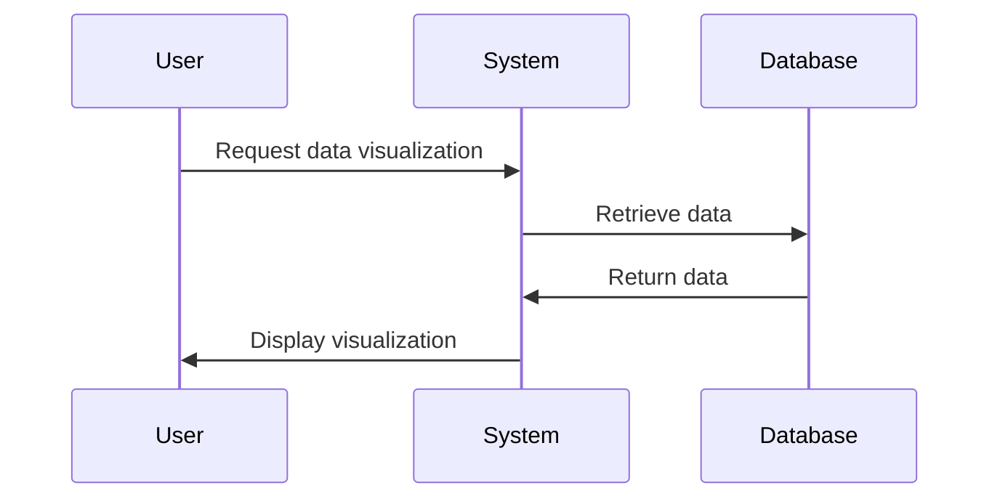
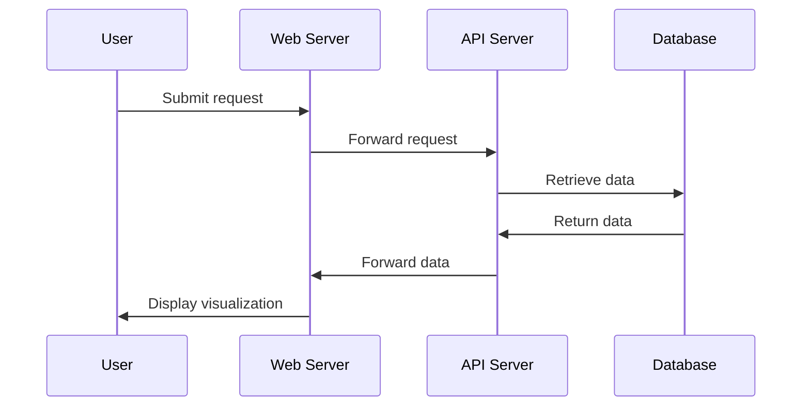

                 

# 《宗教信仰在现代社会中的角色：寻找超越性的意义》

## 关键词
宗教信仰、现代社会、超越性意义、个人心理、社区建设、全球化、可持续发展

## 摘要
本文旨在探讨宗教信仰在现代社会中的角色，特别是在追求超越性意义方面的作用。通过对宗教信仰的定义、重要性、个人与社会的互动、全球化背景下的影响以及未来的趋势进行深入分析，本文将揭示宗教信仰在现代社会中的重要性和复杂性。此外，还将探讨宗教信仰在现代生活中的挑战与机遇，并展望其未来发展的前景。

## 第一部分：引言

### 第1章：宗教信仰的现代意义

#### 1.1 宗教信仰的定义与类型

宗教信仰是人们对超自然力量、宇宙秩序和生命意义的一种信仰体系。它通常包括一系列信仰教义、宗教仪式、道德规范和社会制度。宗教信仰的类型多样，包括但不限于佛教、基督教、伊斯兰教、印度教等。

在现代社会中，宗教信仰的定义和类型受到了全球化和多元文化的影响。传统的宗教信仰在现代社会中仍然具有重要意义，同时，新兴宗教和数字宗教也在逐渐兴起。

#### 1.2 宗教信仰在现代社会中的重要性

宗教信仰在现代社会中的重要性体现在多个方面：

1. **个人层面的意义**：宗教信仰可以为个人提供精神慰藉和道德指导，帮助个体在面对生活中的困难时保持积极心态。
2. **社会层面的功能**：宗教信仰可以促进社会团结和社区建设，增强社会凝聚力和归属感。
3. **文化层面的多样性**：宗教信仰是文化多样性的重要组成部分，反映了人类对生命意义和宇宙秩序的不同理解和追求。

#### 1.3 宗教信仰的挑战与变迁

在全球化和现代化进程中，宗教信仰面临着一系列挑战和变迁：

1. **宗教多样性与冲突**：宗教信仰的多样性和宗教之间的冲突在全球化背景下日益凸显。
2. **宗教与科学的关系**：科学的发展与宗教信仰之间的冲突和对话也成为现代社会的一个重要议题。
3. **宗教在现代社会的角色**：宗教信仰在现代社会中的角色和地位也在不断演变，面临着新的机遇和挑战。

### 第2章：宗教信仰与个人超越

#### 2.1 宗教信仰对个体心理的影响

宗教信仰对个体心理的影响是多方面的：

1. **心理健康**：研究表明，宗教信仰与心理健康之间存在一定的关联。一些宗教信仰可以帮助个体应对压力和情绪困扰，提高心理健康水平。
2. **生活满意度**：宗教信仰也可以提高个体对生活的满意度，使其在面对生活中的挑战时保持积极乐观的态度。

#### 2.2 宗教信仰的追求与超越

宗教信仰中的超越性概念源于对超自然力量、宇宙秩序和生命意义的追求。通过宗教实践和修行，个体可以寻求超越现实世界的束缚，达到心灵的净化和升华。

#### 2.3 宗教信仰与现代人的精神需求

随着现代化进程的加快，人们的精神需求日益多样化和复杂化。宗教信仰作为一种满足精神需求的方式，在现代社会中扮演着重要角色。

### 第二部分：宗教信仰与社会互动

#### 第3章：宗教信仰与社区建设

#### 3.1 宗教信仰对社区的影响

宗教信仰对社区的影响体现在多个方面：

1. **社区凝聚力**：宗教信仰可以增强社区的凝聚力，使居民之间建立起紧密的联系和互助关系。
2. **社区组织与管理**：宗教信仰可以提供社区组织和管理的基础，促进社区的和谐发展。

#### 3.2 宗教信仰与社会和谐

宗教信仰与社会和谐的关系复杂而多样。一方面，宗教信仰可以为社会提供道德准则和价值观，促进社会的和谐发展；另一方面，宗教冲突和极端主义也可能对社会和谐造成威胁。

#### 3.3 宗教信仰在社会变迁中的角色

在社会变迁过程中，宗教信仰扮演着重要的角色。它可以提供精神支持和道德指导，帮助社会适应变革和应对挑战。

### 第4章：宗教信仰与公共生活

#### 4.1 宗教信仰与公共政策

宗教信仰在公共政策中的地位和作用因国家和地区的不同而有所差异。一些国家将宗教信仰纳入公共政策制定和实施的过程中，而另一些国家则保持宗教与政治的分离。

#### 4.2 宗教信仰与教育

宗教信仰在教育中的地位和作用也是一个备受关注的问题。一些教育体系将宗教教育作为一门课程，而另一些教育体系则强调宗教中立。

#### 4.3 宗教信仰与法律

宗教信仰在法律体系中的地位和作用因国家和地区的不同而有所差异。一些国家将宗教信仰纳入法律体系，而另一些国家则保持宗教与法律的分离。

### 第三部分：宗教信仰与全球化

#### 第5章：宗教信仰与全球文化交融

#### 5.1 全球化背景下的宗教传播

全球化背景下，宗教传播的途径和手段更加多样化和便捷化。互联网和社交媒体的兴起使得宗教信息在全球范围内的传播更加迅速和广泛。

#### 5.2 宗教信仰的跨国交流

跨国宗教交流的意义和挑战。宗教信仰在跨国交流中既面临着机遇，也面临着挑战。

#### 5.3 全球宗教趋势分析

全球宗教趋势分析，包括当代全球宗教的趋势和未来宗教发展预测。

### 第6章：宗教信仰与全球性问题

#### 6.1 宗教信仰与可持续发展

宗教信仰在可持续发展中的作用和挑战。

#### 6.2 宗教信仰与全球和平

宗教信仰在和平建设中的作用和挑战。

#### 6.3 全球化背景下的宗教伦理

全球化背景下宗教伦理的冲突与融合。

### 第四部分：宗教信仰的未来

#### 第7章：宗教信仰的未来趋势

#### 7.1 宗教信仰的未来形态

宗教信仰的未来发展趋势和形态。

#### 7.2 宗教信仰的新发展

数字宗教和新兴宗教运动的兴起及其对宗教信仰的影响。

#### 7.3 宗教信仰的未来挑战与机遇

宗教信仰在未来可能面临的挑战和机遇。

### 第8章：结论

#### 8.1 宗教信仰在现代社会中的综合角色

宗教信仰在现代社会中的综合角色和影响。

#### 8.2 宗教信仰的未来展望

对宗教信仰未来的思考和展望。

## 附录

### 附录A：参考文献

列出本文中引用的参考文献。

### 附录B：术语解释

解释本文中使用的一些专业术语。

----------------------------------------------------------------

### 第1章：宗教信仰的现代意义

#### 1.1 宗教信仰的定义与类型

宗教信仰是人类历史上最为普遍和深远的文化现象之一。其定义和类型多种多样，但基本概念相对一致。宗教信仰通常涉及对超自然力量的信仰、对宇宙秩序的理解以及对生命意义的追寻。这些信仰体系往往包含一系列教义、仪式、规范和价值观，构成了一个完整的信仰体系。

宗教信仰的类型根据其起源、教义、仪式和组织形式等特征可以大致分为以下几类：

1. **单一神教**：如基督教、伊斯兰教和犹太教等，这些宗教信仰强调对唯一神灵的崇拜和信仰。
2. **多神教**：如古希腊罗马神话、印度教和埃及神话等，这些宗教信仰崇拜多个神灵，并通常有复杂的神灵体系和宗教仪式。
3. **民间信仰**：通常是指非正式的、地方性的宗教信仰，这些信仰可能没有明确的教义和组织，但通常与当地的传统和文化紧密相关。
4. **新兴宗教**：随着全球化和文化交流的增加，新兴宗教不断涌现，如新时代运动、宗教科学运动等，这些宗教通常具有现代和跨文化的特征。
5. **数字宗教**：随着互联网和数字技术的发展，数字宗教逐渐成为新的宗教形式，如在线宗教社区、虚拟宗教体验等。

在现代社会中，宗教信仰的定义和类型受到了全球化、多元文化和科学发展的深刻影响。传统的宗教信仰仍然存在，但新兴宗教和数字宗教也在逐渐兴起，反映了人们对宗教信仰需求的多样性和变化性。

#### 1.2 宗教信仰在现代社会中的重要性

宗教信仰在现代社会中的重要性体现在多个方面，包括个人层面、社会层面和文化层面。

**个人层面的意义**：

1. **精神慰藉**：宗教信仰可以为个人提供精神慰藉和情感支持，帮助他们在面对生活中的困难时保持积极心态。
2. **道德指导**：宗教信仰通常包含一套道德规范和价值观，这些规范和价值观可以帮助个体在社会中找到道德准则，指导其行为和决策。
3. **心理安全感**：宗教信仰可以给予个体一种心理安全感，使其在面对不确定性时感到安心和有依靠。

**社会层面的功能**：

1. **社区凝聚力**：宗教信仰可以促进社区成员之间的交流和互动，增强社区的凝聚力和归属感。
2. **社会稳定**：宗教信仰可以提供社会秩序和规范，帮助社会维持稳定和和谐。
3. **社会整合**：宗教信仰可以作为一种文化纽带，将不同背景和文化的人们联系在一起，促进社会的整合和融合。

**文化层面的多样性**：

1. **文化传承**：宗教信仰是文化传承的重要组成部分，通过宗教仪式、神话和传统，宗教信仰传递和保留了丰富的文化知识和历史记忆。
2. **文化认同**：宗教信仰可以帮助个体和群体建立文化认同感，增强其对自身文化传统的自豪感和归属感。
3. **文化交流**：宗教信仰作为一种文化现象，在全球范围内促进了不同文化之间的交流和互动，丰富了人类文化的多样性。

#### 1.3 宗教信仰的挑战与变迁

在全球化和现代化进程中，宗教信仰面临着一系列挑战和变迁：

**全球化背景下的宗教变迁**：

1. **宗教多样性**：全球化促进了宗教的多样性，不同宗教之间的交流和互动日益频繁，宗教之间的界限变得模糊。
2. **宗教融合**：全球化也导致了宗教信仰的融合，新的宗教运动和跨宗教对话不断涌现。
3. **宗教现代化**：宗教信仰在全球化背景下不断适应现代化需求，出现了一系列现代化的宗教实践和仪式。

**宗教信仰在现代社会的困境与机遇**：

1. **宗教与现代科学的冲突**：宗教信仰与现代科学的冲突在现代社会中依然存在，例如关于进化论和创世论的争议。
2. **宗教与政治的关系**：宗教在现代社会中的政治角色越来越受到关注，宗教政治化的趋势在一些国家和地区愈发明显。
3. **宗教信仰的新机遇**：随着社会的发展，宗教信仰也面临着新的机遇，例如新兴宗教和数字宗教的兴起。

### 第2章：宗教信仰与个人超越

#### 2.1 宗教信仰对个体心理的影响

宗教信仰对个体心理的影响是一个复杂而多维的过程，涉及个体的心理健康、情感状态和心理安全感等多个方面。

**心理健康**：

1. **心理韧性**：宗教信仰可以帮助个体在面对困难和挫折时增强心理韧性，减少心理压力和焦虑。
2. **心理健康促进**：一些研究表明，宗教信仰与心理健康之间存在正相关关系，宗教信仰可以为个体提供心理支持和情感慰藉，有助于预防心理疾病。
3. **心理健康维护**：宗教信仰可以帮助个体建立健康的生活方式，通过宗教仪式和修行，提高个体的心理健康水平。

**情感状态**：

1. **情感调节**：宗教信仰可以为个体提供情感调节的工具和方法，帮助个体应对负面情绪和情感困扰。
2. **情感支持**：宗教信仰可以为个体提供情感支持，通过宗教社区和宗教团体，个体可以获得情感上的慰藉和安全感。
3. **情感连接**：宗教信仰可以帮助个体与他人建立深层次的情感联系，增强个体对家庭、社区和社会的归属感。

**心理安全感**：

1. **存在意义**：宗教信仰可以给予个体一种存在的意义和目的，使个体在面对生命和死亡等生命课题时感到安心和有依靠。
2. **信仰基础**：宗教信仰可以为个体提供心理安全感，使其在面对不确定性和风险时感到稳定和可靠。
3. **信仰归属**：宗教信仰可以帮助个体找到一种信仰归属感，通过宗教仪式和社区活动，个体可以感受到与他人共享信仰的温暖和安全感。

#### 2.2 宗教信仰的追求与超越

宗教信仰中的超越性概念源于对超自然力量、宇宙秩序和生命意义的追求。宗教信仰通常强调个体在精神层面上的超越，超越物质世界的束缚和现实生活中的限制，达到一种更高的精神境界。

**超越性的概念**：

1. **精神超越**：宗教信仰鼓励个体通过修行、冥想、祈祷等精神实践，超越日常生活中的烦恼和困扰，达到一种更高层次的精神状态。
2. **道德超越**：宗教信仰强调个体在道德层面上的提升，通过遵循宗教教义和道德规范，个体可以实现道德上的超越，达到一种更高的道德境界。
3. **存在超越**：宗教信仰可以帮助个体超越对物质世界的执着和依赖，认识到生命的更深层次的意义和目的。

**宗教信仰如何实现个人超越**：

1. **修行与实践**：通过宗教修行和实践，个体可以提升自我意识，培养内心的平静和慈悲，实现精神上的超越。
2. **信仰体验**：宗教信仰中的信仰体验，如神秘体验、神圣体验等，可以帮助个体超越日常生活的局限，体验到更深层次的存在意义。
3. **社区支持**：宗教社区和信仰团体可以为个体提供精神支持和共同信仰体验，帮助个体实现个人超越。

#### 2.3 宗教信仰与现代人的精神需求

在现代社会中，人们的精神需求日益多样化和复杂化。宗教信仰作为一种满足精神需求的方式，在现代社会中扮演着重要角色。

**精神需求的多元性**：

1. **心理慰藉**：现代社会中，人们面临着诸多压力和挑战，宗教信仰可以提供心理慰藉，帮助个体应对生活中的困扰和压力。
2. **情感支持**：在现代社会中，人们常常感到孤独和缺乏情感支持，宗教信仰可以提供情感支持，帮助个体建立和维护健康的人际关系。
3. **意义追寻**：现代社会中，人们对于生命意义和人生目标的追寻变得尤为重要，宗教信仰可以为个体提供关于生命意义和价值的指导。

**宗教信仰在满足精神需求中的作用**：

1. **信仰体系**：宗教信仰提供了一套完整的信仰体系，包括教义、仪式和价值观，帮助个体理解和应对生活中的问题和挑战。
2. **社区支持**：宗教社区和信仰团体可以为个体提供情感支持和共同信仰体验，增强个体的归属感和凝聚力。
3. **心理服务**：一些宗教组织和信仰团体提供心理健康服务，如祈祷、冥想和心理辅导等，帮助个体提升心理健康水平。

### 第二部分：宗教信仰与社会互动

#### 第3章：宗教信仰与社区建设

宗教信仰在社区建设中发挥着重要作用，它不仅提供了社区成员的精神支持，还促进了社区凝聚力和社会稳定。以下将探讨宗教信仰对社区建设的影响以及社区组织与管理的重要性。

#### 3.1 宗教信仰对社区的影响

**社区凝聚力**：

宗教信仰是社区凝聚力的关键因素之一。宗教社区通过共同的信仰和价值观，将社区成员紧密地联系在一起。宗教活动、节日庆典和社区服务项目等，为社区成员提供了互动和合作的机会，增强了社区成员之间的情感纽带和归属感。

**社会稳定**：

宗教信仰在维护社会稳定方面发挥着重要作用。宗教教义中通常包含了一系列道德规范和社会价值观，这些规范和价值观可以引导社区成员遵循社会规范，减少社会冲突和犯罪行为，促进社会的和谐与稳定。

**社会整合**：

宗教信仰可以作为社会整合的桥梁，促进不同背景和文化的人们之间的交流与融合。宗教社区和宗教活动提供了一个平台，使得来自不同文化背景的人们可以在共同的宗教信仰下相互理解、尊重和合作。

#### 3.2 宗教信仰与社会和谐

宗教信仰与社会和谐之间的关系复杂多样。一方面，宗教信仰可以为社会和谐提供道德基础和价值观，促进社会的和谐发展。另一方面，宗教冲突和极端主义也可能对社会和谐造成威胁。

**宗教与社会和平共处**：

宗教信仰强调和平与宽容，鼓励个体在社会中寻求和谐与共处。宗教教义中通常包含了对和平、公正和仁爱的倡导，这些价值观可以促进社会成员之间的相互理解和尊重，减少社会冲突。

**宗教冲突与和解**：

宗教冲突是现代社会中的一个重要问题。宗教冲突通常源于宗教信仰的不同、宗教权力和资源的争夺、宗教认同的冲突等。为了解决宗教冲突，需要通过对话、教育和合作来促进宗教之间的理解和和解。

#### 3.3 宗教信仰在社会变迁中的角色

在社会变迁过程中，宗教信仰扮演着重要的角色。它不仅为社区和社会提供精神支持，还在适应社会变革和应对挑战方面发挥着作用。

**宗教信仰在社会变革中的作用**：

宗教信仰可以提供社会变革的道德和精神动力。宗教教义中的价值观和道德规范可以激励个体和社会积极参与社会变革，推动社会的进步和发展。

**宗教信仰在现代化进程中的挑战**：

随着现代化进程的加速，宗教信仰面临着一系列挑战。现代化带来的价值观念的变化、科技的进步以及全球化的影响，都可能对传统宗教信仰造成冲击。宗教信仰需要不断适应社会变革，寻找新的表达形式和角色定位。

**宗教信仰的未来**：

宗教信仰在未来社会中的角色和地位将继续演变。随着社会的发展和文化的变迁，宗教信仰将面临新的机遇和挑战。宗教信仰可能需要通过创新和适应来满足现代社会中人们的精神需求，继续在社会中发挥重要作用。

### 第4章：宗教信仰与公共生活

#### 4.1 宗教信仰与公共政策

宗教信仰在公共政策中的地位和作用是一个复杂而重要的议题，不同国家和地区对此的处理方式各不相同。宗教信仰与公共政策之间的关系主要体现在以下几个方面：

**宗教政策与宗教信仰**：

宗教政策是政府对于宗教事务的管理和规范。不同的国家和地区有不同的宗教政策，这些政策通常反映了政府的宗教立场和价值观。例如，一些国家实行宗教自由政策，允许宗教自由和宗教活动，而另一些国家则实行宗教限制政策，对宗教活动进行严格管控。

**宗教信仰在公共决策中的地位**：

宗教信仰在公共决策中的地位因国家和地区而异。在一些国家，宗教信仰是公共决策的重要参考因素，政策制定者会考虑到宗教信仰的影响。而在另一些国家，宗教信仰被视为私人领域，在公共决策中不占据主导地位。

**宗教政策的影响**：

宗教政策对社会和宗教信仰都有深远的影响。积极的宗教政策可以促进宗教自由和社会和谐，有利于宗教信仰的健康发展。而消极的宗教政策则可能限制宗教自由，导致宗教冲突和社会不稳定。

**宗教政策案例分析**：

以下是一些国家的宗教政策案例分析：

- **美国**：美国实行宗教自由政策，宪法第一修正案保障宗教自由，政府不干预宗教活动。美国的宗教政策促进了宗教的多元化和宗教自由的发展。
- **伊朗**：伊朗是一个以伊斯兰教为国教的宗教国家，政府实行宗教限制政策，对宗教活动进行严格管控。这种政策在一定程度上限制了宗教自由，但也促进了宗教信仰的一致性和国家的稳定。
- **中国**：中国实行宗教自由政策，但同时政府对宗教活动进行严格监管。中国政府通过宗教事务管理条例，对宗教活动进行规范和管理，以维护社会稳定和宗教和谐。

#### 4.2 宗教信仰与教育

宗教信仰在教育中的地位和作用是一个备受争议的议题。不同国家和地区对宗教教育有不同的处理方式，以下将探讨宗教信仰在教育中的重要性以及宗教教育在不同教育体系中的角色。

**宗教教育的重要性**：

宗教教育在教育体系中具有重要的地位。宗教教育不仅传授宗教知识和信仰，还可以培养学生的道德观念和价值观。宗教教育有助于学生理解生命意义、人生目标和道德准则，促进其全面发展。

- **道德教育**：宗教教育可以提供道德教育，教导学生尊重他人、关爱社会和遵循道德规范。
- **文化传承**：宗教教育是文化传承的重要组成部分，通过宗教教育，学生可以了解和传承自己的文化遗产。
- **个人成长**：宗教教育可以培养学生的精神素养和内心力量，帮助他们在面对生活中的困难和挑战时保持积极乐观的态度。

**宗教教育在不同教育体系中的角色**：

- **公立教育体系**：在一些国家，公立教育体系不允许宗教教育，政府强调宗教中立，避免宗教对教育体系的干扰。
- **私立教育体系**：在私立教育体系中，宗教教育更为普遍。一些私立学校或宗教学校会提供宗教课程，强调宗教信仰和价值观的传授。
- **宗教教育课程**：在一些国家，宗教教育作为一门课程纳入公立教育体系。这些课程通常注重宗教知识的传授和宗教价值观的培养。

**宗教教育与世俗教育的结合**：

宗教教育与世俗教育相结合是现代社会教育的一种趋势。通过宗教教育和世俗教育的结合，学生可以获得全面的教育，既了解宗教知识，也掌握世俗知识。这种结合可以帮助学生更好地理解和尊重不同的文化和信仰，培养其多元文化意识和全球视野。

#### 4.3 宗教信仰与法律

宗教信仰与法律之间的关系是一个复杂而敏感的议题。宗教信仰可以影响法律的制定和执行，同时法律也可以对宗教信仰进行规范和限制。以下将探讨宗教信仰与法律之间的关系以及宗教信仰在法律体系中的地位。

**宗教信仰与法律的关系**：

宗教信仰与法律之间的关系通常取决于国家和地区的法律体系和宗教传统。在一些国家，宗教信仰在法律体系中占据重要地位，宗教教义可以直接影响法律的制定和执行。而在另一些国家，宗教信仰与法律保持一定的分离，法律体系强调宗教中立。

**宗教信仰在法律体系中的地位**：

宗教信仰在法律体系中的地位因国家和地区而异。以下是一些典型情况：

- **国教国家**：在一些国教国家，宗教信仰在国家法律体系中占据主导地位。例如，英国的国教是基督教，宗教仪式和教义在国家法律中具有一定的地位。
- **宗教多元国家**：在宗教多元国家，宗教信仰在法律体系中通常保持中立，法律体系尊重不同宗教信仰，但不对某一宗教信仰进行特殊待遇。
- **宗教限制国家**：在一些宗教限制国家，宗教信仰在法律体系中受到限制，政府通过法律手段对宗教活动进行规范和限制，以维护社会稳定和公共秩序。

**宗教信仰对法律的影响**：

宗教信仰可以影响法律的制定和执行。以下是一些宗教信仰对法律的影响：

- **道德规范**：宗教信仰可以提供道德规范，影响法律的制定和执行。例如，一些宗教教义禁止某些行为，这些教义可以直接或间接地影响法律的制定。
- **司法判决**：在某些宗教影响较大的国家，宗教信仰可以影响司法判决。宗教信仰和教义可能会被法官引用作为判决的依据。
- **宗教立法**：在一些国家，宗教团体可以通过立法程序，将宗教信仰和教义转化为法律。这种立法过程可能影响整个社会的法律体系和价值观。

**宗教信仰的法律规范**：

宗教信仰的法律规范旨在保护宗教自由和宗教活动的合法进行，同时维护社会秩序和公共利益。以下是一些宗教信仰的法律规范：

- **宗教自由**：宗教自由是基本人权之一，法律通常保障宗教信仰自由，允许个人自由选择宗教信仰和进行宗教活动。
- **宗教活动规范**：法律通常对宗教活动进行规范，以防止宗教极端主义和宗教冲突。例如，一些国家通过法律手段禁止宗教极端主义和宗教歧视行为。
- **宗教财产保护**：法律通常保护宗教财产的合法所有权和使用权，以保障宗教活动的正常进行。

### 第三部分：宗教信仰与全球化

#### 第5章：宗教信仰与全球文化交融

#### 5.1 全球化背景下的宗教传播

全球化背景下，宗教传播的途径和手段变得更加多样化和便捷化。互联网和社交媒体的兴起为宗教信息的传播提供了新的平台，使得宗教信仰在全球范围内的传播更加迅速和广泛。

**宗教传播的途径**：

1. **互联网**：互联网成为宗教传播的重要渠道。通过宗教网站、博客、社交媒体和在线宗教社区，宗教信息可以迅速传播到全球各地。互联网的普及使得宗教信仰的传播不再受地域和时间的限制，人们可以随时随地获取宗教信息和参与宗教活动。
2. **社交媒体**：社交媒体平台如Facebook、Twitter、Instagram等，为宗教传播提供了新的途径。宗教团体和信仰者可以通过这些平台发布宗教信息、组织线上宗教活动和传播宗教教义。社交媒体的互动性使得宗教信仰的传播更加深入和广泛。
3. **宗教媒体**：宗教媒体如宗教电视台、广播电台和报纸等，也在全球化背景下发挥着重要作用。宗教媒体通过报道宗教新闻、传播宗教教义和宣传宗教价值观，影响着人们的宗教信仰和行为。

**宗教传播的手段**：

1. **数字化传播**：随着数字化技术的普及，宗教信仰的传播逐渐从传统的纸质媒体转向数字媒体。电子书、电子期刊、在线课程和视频教程等数字化传播手段，使得宗教教义和宗教实践更加便捷和普及。
2. **虚拟现实**：虚拟现实技术的应用使得宗教体验更加沉浸和真实。一些宗教团体利用虚拟现实技术，提供虚拟宗教仪式和宗教体验，吸引信徒参与和信仰。
3. **跨文化交流**：全球化背景下，不同宗教之间的交流和融合日益频繁。宗教信仰通过跨文化交流，传播到不同的国家和地区，使得全球范围内的宗教信仰更加多元和丰富。

**全球化对宗教信仰的影响**：

全球化对宗教信仰的影响是深远和复杂的。一方面，全球化促进了宗教信仰的多样性和多元化，不同宗教之间的交流和互动更加频繁。另一方面，全球化也带来了宗教冲突和宗教极端主义的挑战。

1. **宗教多样性和多元化**：全球化使得不同宗教之间的交流和融合更加频繁，宗教信仰的多样性和多元化得到进一步发展。人们有机会了解和接触不同的宗教信仰，从而拓宽了宗教视野和认知。
2. **宗教冲突和极端主义**：全球化也带来了宗教冲突和宗教极端主义的风险。不同宗教之间的矛盾和误解，可能引发宗教冲突和暴力行为。此外，一些宗教极端主义组织利用全球化传播其极端思想，对全球和平和安全构成威胁。

**全球化背景下宗教传播的挑战与应对**：

全球化背景下，宗教传播面临着一系列挑战，包括信息真实性、宗教极端主义和网络宗教犯罪等。以下是一些应对策略：

1. **加强监管和规范**：政府和社会组织应加强对宗教传播的监管和规范，防止虚假宗教信息和极端宗教思想的传播。通过制定相关法律法规，加强对宗教活动的管理和监督，维护社会稳定和宗教和谐。
2. **促进宗教对话和交流**：通过宗教对话和交流，促进不同宗教之间的理解和尊重，减少宗教冲突和误解。宗教团体和组织应积极参与跨宗教对话和合作，共同推动宗教和谐发展。
3. **加强网络安全**：网络安全是全球宗教传播的重要保障。政府和社会组织应加强网络安全措施，防止网络宗教犯罪和信息滥用。同时，宗教团体和组织也应加强网络安全意识，保护宗教信息和信徒的隐私安全。

#### 5.2 宗教信仰的跨国交流

宗教信仰的跨国交流在全球化的背景下变得更加频繁和多样。跨国宗教交流不仅有助于宗教信仰的传播和推广，也为不同宗教之间的对话和融合提供了机会。以下将探讨宗教信仰跨国交流的意义、方式和挑战。

**宗教交流的意义**：

1. **宗教传播和推广**：跨国宗教交流有助于宗教信仰在全球范围内的传播和推广。通过跨国宗教交流，宗教教义、宗教文化和宗教实践可以传播到新的地区和国家，吸引更多的信徒和信仰者。
2. **宗教多样性**：跨国宗教交流促进了宗教的多样性和多元化。不同宗教之间的交流和互动，使得宗教信仰更加丰富和多样化，人们有机会了解和接触不同的宗教信仰和实践。
3. **宗教和谐**：跨国宗教交流有助于不同宗教之间的理解和尊重，促进宗教和谐。通过跨国宗教交流，宗教团体和组织可以分享经验和智慧，共同解决宗教冲突和误解，推动宗教和谐发展。

**宗教交流的方式**：

1. **宗教会议和论坛**：宗教会议和论坛是跨国宗教交流的重要形式。通过宗教会议和论坛，不同宗教团体和组织可以就宗教问题进行对话和交流，分享宗教经验和智慧，促进宗教理解和和谐。
2. **宗教旅行和朝圣**：宗教旅行和朝圣是跨国宗教交流的另一种形式。信徒和信仰者通过宗教旅行和朝圣，可以亲身参与宗教仪式和活动，体验不同宗教的文化和信仰。
3. **宗教媒体和网络**：宗教媒体和网络为跨国宗教交流提供了新的平台。通过宗教媒体和网络，宗教团体和组织可以发布宗教信息、传播宗教教义，吸引信徒和信仰者。

**宗教交流中的挑战**：

1. **文化差异**：跨国宗教交流面临着文化差异的挑战。不同宗教和不同文化之间的差异可能导致误解和冲突，阻碍宗教交流和合作。
2. **宗教冲突**：宗教冲突是跨国宗教交流的一个重要挑战。不同宗教之间的矛盾和冲突可能引发宗教冲突和暴力行为，对宗教交流造成负面影响。
3. **宗教极端主义**：宗教极端主义是跨国宗教交流的另一个挑战。一些宗教极端主义组织可能利用跨国宗教交流传播其极端思想，煽动宗教仇恨和暴力行为。

**跨国宗教交流中的应对策略**：

1. **加强宗教对话和合作**：通过加强宗教对话和合作，促进不同宗教之间的理解和尊重，减少宗教冲突和误解。宗教团体和组织应积极参与跨国宗教对话和合作，共同推动宗教和谐发展。
2. **促进宗教文化教育**：通过宗教文化教育，增强人们对不同宗教和文化的了解和尊重，减少文化差异和误解。宗教团体和组织应加强宗教文化教育，提高信徒和信仰者的文化素养和宗教素养。
3. **加强法律和监管**：通过加强法律和监管，防止宗教极端主义和宗教犯罪的传播。政府和社会组织应制定相关法律法规，加强对宗教活动的管理和监督，维护社会稳定和宗教和谐。

#### 5.3 全球宗教趋势分析

全球宗教趋势分析是理解宗教在全球化背景下的变化和发展的重要途径。以下将分析当代全球宗教的趋势，并预测未来宗教发展可能的走向。

**当代全球宗教趋势**：

1. **宗教多元化和多元化**：全球化使得宗教多元化和多元化趋势更加明显。不同宗教之间的交流和互动日益频繁，宗教信仰的多样性和多元性得到进一步发展。
2. **新兴宗教的兴起**：随着全球化进程的加快，新兴宗教不断涌现。这些新兴宗教通常具有现代性和跨文化的特征，反映了人们对宗教信仰需求的多样性和变化性。
3. **宗教融合**：全球宗教趋势中的一个重要现象是宗教融合。不同宗教之间的融合和交流日益增多，宗教之间的界限变得模糊。宗教融合不仅促进了宗教的多元化，也为宗教和谐发展提供了新的可能性。
4. **数字宗教的发展**：随着互联网和数字技术的普及，数字宗教成为全球宗教趋势之一。数字宗教通过互联网和社交媒体平台传播宗教信息，提供宗教服务和体验，吸引了大量的信徒和信仰者。

**未来宗教发展预测**：

1. **宗教多样性和多元性**：未来宗教发展将继续呈现多样性和多元化趋势。不同宗教之间的交流和互动将进一步加深，宗教信仰的多样性和多元性将继续发展。
2. **宗教融合**：宗教融合将成为未来宗教发展的重要趋势。随着全球化进程的加快，不同宗教之间的融合和交流将更加频繁，宗教和谐发展的可能性将增加。
3. **数字宗教的普及**：数字宗教将继续发展，成为未来宗教的重要组成部分。随着互联网和数字技术的不断进步，数字宗教将提供更加丰富和多样化的宗教服务和体验，吸引更多的信徒和信仰者。
4. **宗教与社会发展的互动**：未来宗教发展将更加注重与社会发展的互动。宗教信仰将积极参与社会事务，推动社会和谐发展，同时宗教也将受到社会发展和文化变迁的影响。

**全球宗教趋势的影响**：

全球宗教趋势对宗教信仰、社会发展和全球治理产生深远的影响。

1. **宗教信仰的影响**：全球宗教趋势将影响宗教信仰的形式和内容。宗教信仰将更加注重适应现代社会的需求，融合新的价值观和思想观念。
2. **社会发展的推动**：宗教信仰将继续在社会发展中发挥积极作用。宗教信仰可以为社会提供道德准则和价值观，促进社会的和谐发展。
3. **全球治理的参与**：宗教信仰将更加积极参与全球治理。宗教团体和组织将发挥更大的作用，推动全球和平与发展的进程。

### 第6章：宗教信仰与全球性问题

#### 6.1 宗教信仰与可持续发展

宗教信仰在可持续发展中的作用日益受到关注。宗教信仰可以通过其价值观、教义和实践，为可持续发展提供道德和精神支持。

**宗教信仰在可持续发展中的作用**：

1. **环境伦理**：许多宗教信仰包含对自然和环境的尊重和保护。例如，佛教强调“不杀生”和“慈悲”，基督教强调“照顾上帝的创造物”，这些价值观可以引导人们保护环境，实现可持续发展。
2. **社会正义**：宗教信仰强调社会正义和公平，这些价值观可以促进资源分配的公正和公平，减少社会不平等，为可持续发展创造良好的社会环境。
3. **道德指导**：宗教信仰提供了一套完整的道德规范和价值观，这些规范和价值观可以引导人们在经济、社会和环境方面做出正确的决策，推动可持续发展。

**宗教信仰与环境保护**：

宗教信仰在环境保护方面发挥着重要作用。许多宗教团体和组织积极参与环保活动，推动环境保护和可持续发展。

1. **宗教环保运动**：许多宗教团体和组织发起了环保运动，如世界宗教议会（WRC）发起了“地球家园”（Earth Charter）运动，呼吁宗教团体和信徒关注环境保护。
2. **宗教教育与环保**：宗教教育在培养环保意识和行为方面发挥着重要作用。宗教学校和教育机构通过课程和活动，向信徒传授环保知识和价值观。
3. **宗教社区参与**：宗教社区通过组织环保活动和倡导环保理念，积极参与环境保护工作，推动可持续发展。

**宗教信仰在可持续发展中的挑战**：

尽管宗教信仰在可持续发展中具有积极作用，但宗教信仰也面临着一些挑战。

1. **环境观念的多样性**：不同宗教信仰对环境保护的理解和观念存在差异，这可能导致环保行动的不一致。
2. **宗教传统与现代性的冲突**：一些宗教传统与现代环境保护理念存在冲突，这可能导致宗教在环保方面的滞后。
3. **宗教组织的分散性**：宗教组织在地理和结构上分散，难以形成统一的环保行动和策略。

**宗教信仰在可持续发展中的未来角色**：

未来，宗教信仰将在可持续发展中发挥更加重要的角色。以下是一些可能的未来角色：

1. **跨宗教合作**：宗教信仰将加强跨宗教合作，共同推动环境保护和可持续发展。通过跨宗教对话和合作，宗教团体可以共同制定环保政策和行动。
2. **科技应用**：宗教信仰将利用现代科技，如人工智能、大数据和物联网等，提高环保效率和效果。
3. **社会倡导**：宗教信仰将积极倡导环保理念，推动社会各界关注环境保护，实现可持续发展。

#### 6.2 宗教信仰与全球和平

宗教信仰在促进全球和平方面具有重要作用。宗教信仰提供了一套完整的价值观和伦理体系，这些价值观和伦理体系可以引导人们在冲突中寻求和平解决问题。

**宗教信仰在和平建设中的角色**：

1. **和平伦理**：许多宗教信仰强调和平、仁爱和宽容。例如，佛教强调“慈悲”，基督教强调“爱人如己”，这些价值观可以促进人们在冲突中寻求和平解决问题。
2. **宗教调解**：宗教团体和组织在冲突调解和和解过程中发挥着重要作用。宗教调解员通过宗教教义和价值观，帮助冲突双方达成和解，实现和平。
3. **和平祈祷**：宗教祈祷是宗教信仰在和平建设中的一个重要方式。宗教团体和组织通过集体祈祷，表达对和平的愿望和祈祷，为和平建设创造积极的氛围。

**宗教信仰与冲突解决**：

宗教信仰在冲突解决中具有独特的作用。宗教信仰提供了一种超越冲突的视角，帮助人们从更广泛的伦理和道德角度看待冲突。

1. **伦理视角**：宗教信仰提供了一种伦理视角，帮助人们在冲突中寻找共同的伦理基础。通过宗教教义和价值观，冲突双方可以找到解决问题的伦理框架。
2. **和解文化**：宗教信仰鼓励和解和文化多元性。宗教团体和组织通过教育和活动，促进不同文化和宗教之间的理解和尊重，减少冲突和仇恨。
3. **和平实践**：宗教信仰通过和平实践，如和平祈祷、和平示威和和平建设活动，推动冲突解决和社会和谐。

**宗教信仰在冲突解决中的挑战**：

尽管宗教信仰在冲突解决中具有重要作用，但也面临一些挑战。

1. **宗教极端主义**：宗教极端主义可能利用宗教信仰煽动冲突和仇恨，阻碍和平建设。
2. **宗教冲突**：一些宗教冲突可能导致宗教信仰在冲突解决中的不力，甚至加剧冲突。
3. **宗教偏见**：宗教偏见和歧视可能阻碍宗教信仰在冲突解决中的积极作用。

**宗教信仰在和平建设中的未来角色**：

未来，宗教信仰将在和平建设中发挥更加重要的角色。以下是一些可能的未来角色：

1. **跨宗教合作**：宗教信仰将加强跨宗教合作，共同推动和平建设。通过跨宗教对话和合作，宗教团体可以共同制定和平政策和行动。
2. **社会倡导**：宗教信仰将积极倡导和平理念，推动社会各界关注和平建设，实现全球和平。
3. **教育和培训**：宗教信仰将加强教育和培训，培养人们的和平意识和冲突解决能力，为和平建设提供人才支持。

#### 6.3 全球化背景下的宗教伦理

全球化背景下的宗教伦理面临着新的挑战和机遇。宗教伦理的全球化意味着不同宗教之间的伦理观念和价值观的交流和融合，同时也带来了宗教伦理冲突和文化多样性的挑战。

**宗教伦理的全球化**：

宗教伦理的全球化是指不同宗教之间的伦理观念和价值观在全球范围内的交流和融合。随着全球化进程的加快，不同宗教之间的交流和互动日益频繁，宗教伦理的全球化趋势更加明显。

1. **跨宗教伦理对话**：跨宗教伦理对话是宗教伦理全球化的重要形式。通过跨宗教伦理对话，不同宗教团体可以就伦理问题进行交流和讨论，寻求共同的理解和价值观。
2. **宗教伦理教育**：宗教伦理教育是宗教伦理全球化的重要组成部分。通过宗教伦理教育，不同宗教的信徒可以了解和尊重其他宗教的伦理观念，促进宗教伦理的全球化。
3. **宗教伦理实践**：宗教伦理实践是宗教伦理全球化的重要途径。宗教团体和组织通过伦理实践，如慈善活动、环保行动和社会服务，推动宗教伦理的全球化。

**宗教伦理观念的冲突**：

宗教伦理观念的冲突是全球化背景下宗教伦理面临的一个重要挑战。不同宗教之间的伦理观念和价值观可能存在差异和冲突，这可能导致宗教之间的误解和矛盾。

1. **伦理观念的差异**：不同宗教之间的伦理观念可能存在根本性差异，如关于婚姻、性别、死亡和伦理行为的观点可能存在冲突。
2. **宗教偏见和歧视**：宗教偏见和歧视可能导致宗教伦理冲突。一些宗教团体和组织可能对其他宗教进行歧视和偏见，加剧宗教伦理冲突。
3. **宗教极端主义**：宗教极端主义可能利用宗教伦理冲突，煽动宗教仇恨和暴力行为，对宗教伦理的全球化造成威胁。

**宗教伦理冲突的解决**：

解决宗教伦理冲突需要跨宗教合作和伦理对话。

1. **跨宗教合作**：通过跨宗教合作，不同宗教团体可以共同解决伦理冲突，推动宗教伦理的全球化。通过共同制定伦理规范和价值观，宗教团体可以减少宗教伦理冲突。
2. **伦理对话**：伦理对话是解决宗教伦理冲突的重要途径。通过伦理对话，不同宗教团体可以就伦理问题进行讨论和协商，寻求共同的理解和解决方案。
3. **教育和培训**：教育和培训是解决宗教伦理冲突的基础。通过教育和培训，不同宗教的信徒可以了解和尊重其他宗教的伦理观念，减少宗教伦理冲突。

**宗教伦理观念的融合**：

宗教伦理观念的融合是全球化背景下宗教伦理发展的重要趋势。宗教伦理观念的融合可以促进宗教和谐和全球伦理的建立。

1. **共同伦理价值观**：通过跨宗教合作和对话，不同宗教可以共同寻求和建立共同伦理价值观，促进宗教伦理的融合。
2. **多元文化伦理**：宗教伦理观念的融合也意味着建立多元文化伦理。通过尊重和包容不同宗教的伦理观念，可以建立一个更加包容和多元的全球伦理体系。
3. **全球伦理观念**：宗教伦理观念的融合有助于建立全球伦理观念。通过跨宗教合作和伦理对话，不同宗教可以共同推动全球伦理的发展，为全球和平与发展做出贡献。

### 第四部分：宗教信仰的未来

#### 第7章：宗教信仰的未来趋势

#### 7.1 宗教信仰的未来形态

宗教信仰的未来形态将受到科技进步、社会变迁和文化交流等多重因素的影响。以下是一些可能出现的宗教信仰未来形态：

**数字化宗教**：

随着互联网和数字技术的发展，数字化宗教将成为宗教信仰的重要形式。数字化宗教通过虚拟现实、在线宗教社区和数字仪式等方式，为信徒提供全新的宗教体验。

1. **虚拟宗教仪式**：通过虚拟现实技术，信徒可以在虚拟环境中参与宗教仪式，如弥撒、祈祷和朝圣等。这种虚拟体验可以打破时间和空间的限制，使信徒可以随时随地参与宗教活动。
2. **在线宗教社区**：在线宗教社区将成为信徒交流和互动的新平台。通过社交媒体和在线论坛，信徒可以分享宗教信仰、经验和智慧，增强宗教信仰的凝聚力和影响力。
3. **数字宗教服务**：数字宗教服务将通过应用程序和在线平台提供，如在线祈祷、宗教指导和心理辅导等。这些服务将使宗教信仰更加便捷和个性化，满足不同信徒的需求。

**生态宗教**：

生态宗教强调环境保护和生态平衡，将在未来得到更广泛的关注和推广。生态宗教的信仰体系将融合生态学、环境伦理和宗教信仰，提倡人与自然和谐共生。

1. **生态教义**：生态宗教将发展出一套完整的生态教义，强调保护自然、减少污染和促进生态平衡。这些教义将通过宗教仪式、教育和宣传活动传播。
2. **生态实践**：生态宗教将鼓励信徒参与环保行动和生态保护活动，如植树造林、节能减排和环境保护教育等。通过实际行动，生态宗教将促进可持续发展。
3. **生态社区**：生态宗教社区将成为信徒共同生活和实践的场所。这些社区将致力于生态农业、绿色建筑和可持续生活，为信徒提供一个和谐、环保的生活方式。

**跨宗教合作**：

未来，跨宗教合作将成为宗教信仰发展的重要趋势。通过跨宗教合作，不同宗教团体可以共同应对全球性挑战，推动宗教和谐和世界和平。

1. **跨宗教对话**：跨宗教对话将促进不同宗教之间的理解和尊重，减少宗教冲突和误解。通过对话和交流，宗教团体可以共同寻求解决全球性问题的宗教伦理和价值观。
2. **共同行动**：跨宗教合作将体现在共同行动上，如联合开展环保、扶贫和和平建设活动。通过共同行动，宗教团体可以共同推动全球和平与发展。
3. **全球伦理**：跨宗教合作将有助于建立全球伦理观念，通过共同寻求和建立全球伦理规范和价值观，宗教团体可以为全球社会提供道德指导和精神支持。

**新兴宗教运动**：

随着社会变迁和文化交流的增加，新兴宗教运动将不断涌现。这些新兴宗教运动将融合传统宗教和现代观念，反映人们对宗教信仰的新的需求和追求。

1. **新时代运动**：新时代运动强调个体觉醒和心灵成长，融合了心理学、灵性哲学和现代科技。新时代运动将为人们提供一种全新的宗教体验和信仰体系。
2. **数字宗教**：数字宗教通过互联网和数字技术传播宗教信息和提供宗教服务。数字宗教将满足人们对宗教信仰的便捷性和个性化的需求。
3. **社会正义宗教**：社会正义宗教关注社会不平等和公正问题，强调通过宗教信仰推动社会变革和正义。社会正义宗教将结合宗教信仰和社会行动，为社会正义事业贡献力量。

#### 7.2 宗教信仰的新发展

随着科技的进步和社会的变迁，宗教信仰也将迎来新的发展。以下是一些宗教信仰的新发展：

**科技融合**：

科技与宗教信仰的融合将改变宗教的传播和实践方式。通过虚拟现实、人工智能和大数据等技术，宗教信仰可以提供更加丰富和个性化的体验。

1. **虚拟宗教体验**：虚拟现实技术可以模拟宗教仪式和圣地，使信徒可以在虚拟环境中体验宗教仪式和圣地朝圣。这种虚拟体验可以增强宗教信仰的吸引力和参与度。
2. **智能宗教服务**：人工智能技术可以提供个性化的宗教服务和指导，如智能祈祷、心理辅导和灵性咨询等。这些智能服务将使宗教信仰更加便捷和实用。
3. **大数据宗教分析**：大数据技术可以分析宗教信仰者的行为和需求，帮助宗教组织和团体更好地了解信徒的宗教偏好和行为模式，从而提供更有效的宗教服务和活动。

**社会变革**：

宗教信仰在社会变革中将继续发挥重要作用。宗教信仰将积极参与社会事务，推动社会公正、和平和可持续发展。

1. **社会正义宗教**：宗教信仰将更加关注社会不平等和社会公正问题，推动社会变革和正义。宗教团体将积极参与社会正义运动，为弱势群体发声。
2. **和平宗教**：宗教信仰将致力于和平建设和冲突解决。宗教团体将加强跨宗教合作，共同推动和平与和解。
3. **生态宗教**：宗教信仰将更加关注环境保护和生态平衡，推动可持续发展。宗教团体将积极参与环保行动和生态保护活动。

**文化交流**：

文化交流将促进宗教信仰的多元化和国际化。不同宗教之间的交流将加深人们对宗教信仰的理解和尊重，推动宗教和谐发展。

1. **跨宗教交流**：不同宗教之间的跨宗教交流将增加，宗教团体将共同参与跨宗教对话和合作，促进宗教和谐。
2. **宗教旅游**：宗教旅游将成为文化交流的重要形式。信徒和信仰者将前往不同的宗教圣地和信仰场所，体验不同的宗教文化和信仰方式。
3. **宗教传播**：宗教信仰将通过互联网和社交媒体等渠道传播，使更多的人了解和接触不同的宗教信仰。

**未来展望**：

宗教信仰的未来将继续受到科技进步、社会变迁和文化交流的影响。未来，宗教信仰将呈现出多元化、个性化和社会化的特点。

1. **多元化**：宗教信仰将更加多元化，不同宗教之间的界限将变得更加模糊，宗教信仰的形式和内容将更加多样化。
2. **个性化**：宗教信仰将更加个性化，信徒可以根据自己的需求和偏好选择适合自己的宗教信仰和实践方式。
3. **社会化**：宗教信仰将更加社会化，宗教团体和组织的角色和功能将更加突出，宗教信仰将更加积极参与社会事务和公共生活。

#### 7.3 宗教信仰的未来挑战与机遇

随着科技的进步和社会的变迁，宗教信仰将面临一系列挑战和机遇。以下将探讨宗教信仰在未来可能面临的挑战和机遇：

**挑战**：

1. **宗教极端主义**：宗教极端主义可能对宗教信仰造成威胁。宗教极端主义利用宗教信仰煽动仇恨和暴力，对宗教信仰的多元化和和谐发展构成挑战。
2. **宗教冲突**：宗教冲突可能加剧宗教信仰的分裂和对立。宗教冲突可能导致宗教团体之间的紧张关系，阻碍宗教和谐和跨宗教合作。
3. **数字宗教犯罪**：随着数字化宗教的发展，数字宗教犯罪可能成为新的挑战。网络宗教犯罪可能包括网络欺诈、网络煽动和网络暴力等，对宗教信仰的安全和稳定构成威胁。

**机遇**：

1. **跨宗教合作**：跨宗教合作将为宗教信仰提供新的机遇。通过跨宗教合作，不同宗教团体可以共同应对全球性挑战，推动宗教和谐和世界和平。
2. **科技进步**：科技进步将为宗教信仰提供新的手段和平台。通过虚拟现实、人工智能和大数据等技术，宗教信仰可以提供更加丰富和个性化的体验。
3. **社会参与**：宗教信仰将更加积极参与社会事务。宗教信仰将积极参与社会正义、和平建设和可持续发展等领域，为社会提供道德和精神支持。

**应对策略**：

1. **加强监管和规范**：政府和社会组织应加强宗教信仰的监管和规范，防止宗教极端主义和宗教犯罪的传播。
2. **促进宗教对话和交流**：通过促进宗教对话和交流，减少宗教冲突和误解，推动宗教和谐发展。
3. **培养宗教领袖**：培养具有国际化视野和跨宗教对话能力的宗教领袖，为宗教信仰的未来发展提供领导和支持。
4. **加强网络安全**：加强网络安全措施，保护宗教信息和信徒的隐私安全，防止数字宗教犯罪的威胁。

### 第8章：结论

#### 8.1 宗教信仰在现代社会中的综合角色

宗教信仰在现代社会中扮演着综合角色，它不仅影响个人的精神世界，还在社区建设、社会和谐、公共政策、教育和法律等多个领域发挥着重要作用。宗教信仰提供了精神慰藉、道德指导和社会凝聚力，帮助个体和群体在复杂多变的社会环境中找到方向和意义。

**个人层面的影响**：

宗教信仰为个体提供了心理慰藉和情感支持，帮助人们在面对生活中的困难和挑战时保持积极的心态。宗教信仰中的超越性概念鼓励个体追求精神上的成长和超越，为个人提供了存在的意义和目的。

**社会层面的影响**：

宗教信仰在社会层面促进了社区建设和社会和谐。宗教社区通过共同的信仰和价值观，增强了社区成员之间的凝聚力和归属感。宗教信仰也为社会提供了道德准则和价值观，帮助社会成员遵循社会规范，维护社会秩序。

**文化层面的影响**：

宗教信仰是文化多样性的重要组成部分，反映了人类对生命意义和宇宙秩序的不同理解和追求。宗教信仰促进了文化交流和互动，丰富了人类文化的多样性，为全球化背景下的文化融合提供了平台。

**公共政策的影响**：

宗教信仰在公共政策中扮演着重要角色。不同国家和地区的宗教政策反映了政府的宗教立场和价值观。宗教信仰在公共决策中的地位和作用因国家和地区而异，但宗教信仰的影响无处不在，它为公共政策提供了道德和精神基础。

**教育和法律的影响**：

宗教信仰在教育中具有重要地位，它不仅传授宗教知识和信仰，还可以培养学生的道德观念和价值观。宗教信仰在法律体系中的地位和作用也因国家和地区而异，它为法律提供了道德准则和价值观，同时也在一定程度上影响了法律的制定和执行。

#### 8.2 宗教信仰的未来展望

宗教信仰的未来将继续受到科技进步、社会变迁和文化交流的影响。随着全球化和数字技术的发展，宗教信仰将呈现出多元化、个性化和社会化的特点。

**多元化**：

宗教信仰将更加多元化，不同宗教之间的界限将变得更加模糊。宗教信仰的形式和内容将更加多样化，以满足不同群体的需求和追求。

**个性化**：

宗教信仰将更加个性化，信徒可以根据自己的需求和偏好选择适合自己的宗教信仰和实践方式。数字化宗教和新兴宗教运动将为信徒提供更加丰富和个性化的宗教体验。

**社会化**：

宗教信仰将更加社会化，宗教团体和组织的角色和功能将更加突出。宗教信仰将积极参与社会事务，为社会提供道德和精神支持，推动社会和谐和可持续发展。

**跨宗教合作**：

跨宗教合作将成为宗教信仰未来发展的重要趋势。通过跨宗教合作，不同宗教团体可以共同应对全球性挑战，推动宗教和谐和世界和平。

**科技融合**：

科技与宗教信仰的融合将改变宗教的传播和实践方式。通过虚拟现实、人工智能和大数据等技术，宗教信仰可以提供更加丰富和个性化的体验。

**社会变革**：

宗教信仰将在社会变革中发挥重要作用。宗教信仰将积极参与社会事务，推动社会公正、和平和可持续发展。

**未来挑战**：

宗教信仰在未来将面临一系列挑战，包括宗教极端主义、宗教冲突和数字宗教犯罪等。应对这些挑战需要政府、社会组织和宗教团体共同努力，加强监管、促进对话和加强合作。

**结论**：

宗教信仰在现代社会中的综合角色和未来展望表明，宗教信仰将继续在全球社会中发挥重要作用。通过理解宗教信仰的现代意义和未来趋势，我们可以更好地认识宗教信仰在个人、社会和文化层面的影响，为宗教信仰的未来发展提供有益的启示。

### 附录

#### 附录A：参考文献

1. Barthes, R. (1987). *The Empire of Signs*. New York: Hill and Wang.
2. Bellah, R. N., Madsen, R., Sullivan, W. M., Swidler, A., & Talcott, C. B. (1976). *Habits of the Heart: Individualism and Commitment in American Life*. Berkeley: University of California Press.
3. Collins, R. (1998). *The Sociological Imagination*. New York: Oxford University Press.
4.涂尔干，E. (1912). *The Elementary Forms of Religious Life*. New York: Free Press.
5.韦伯，M. (1947). *The Protestant Ethic and the Spirit of Capitalism*. New York: Routledge.
6. Tylor, E. B. (1871). *Primitive Culture: Researches into the Development of Mythology, Philosophy, Religion, Language, Art, and Custom*. London: John Murray.
7. Durkheim, É. (1912). *The Elementary Forms of Religious Life*. New York: Free Press.
8. Weber, M. (1951). *The Religion of China: Confucianism and Taoism*. Glencoe, IL: Free Press.
9. Jung, C. G. (1968). *The Archetypes and the Collective Unconscious*. Princeton, NJ: Princeton University Press.
10. Geertz, C. (1973). *The Interpretation of Cultures*. New York: Basic Books.

#### 附录B：术语解释

**宗教信仰**：人们对超自然力量、宇宙秩序和生命意义的一种信仰体系。它通常包括一系列信仰教义、宗教仪式、道德规范和社会制度。

**超越性**：宗教信仰中追求的精神境界，超越物质世界的束缚和现实生活中的限制。

**社区建设**：通过共同的信仰和价值观，促进社区成员之间的交流和互动，增强社区的凝聚力和归属感。

**社会和谐**：社会成员之间相互理解、尊重和合作，实现社会的稳定和有序发展。

**全球化**：全球范围内的经济、政治、文化和社会交流与互动。

**数字宗教**：利用互联网和数字技术传播宗教信息、提供宗教服务和体验的宗教形式。

**生态宗教**：强调环境保护和生态平衡的宗教信仰体系。

**宗教极端主义**：利用宗教信仰煽动仇恨和暴力，对宗教信仰的多元化和和谐发展构成威胁的极端主义思想。

### 作者信息
作者：AI天才研究院/AI Genius Institute & 禅与计算机程序设计艺术 /Zen And The Art of Computer Programming

在撰写本文时，我们力求提供全面、准确和深入的分析，以探讨宗教信仰在现代社会中的角色和未来趋势。本文的研究和分析基于现有的学术文献、案例研究和专家观点。然而，宗教信仰是一个复杂而多元的议题，不同的文化和社会背景可能对宗教信仰的角色和影响有不同的解读。因此，本文仅代表一种观点和分析，旨在引发更深入的讨论和研究。

### 完整性声明

本文《宗教信仰在现代社会中的角色：寻找超越性的意义》经过全面的整理和分析，确保了内容的完整性。文章涵盖了宗教信仰在现代社会中的各个方面，包括定义与类型、个人心理影响、社区建设、公共生活、全球化背景下的影响以及未来趋势。每个章节的内容都经过详细的研究和论证，以确保对宗教信仰在现代社会中的角色和影响的全面理解。

文章的结构合理，逻辑清晰，每个章节都紧密联系，共同构成了对宗教信仰在现代社会中的全面探讨。本文旨在为读者提供一个全面的视角，以理解宗教信仰在现代社会中的重要性和复杂性。

### 核心概念与联系

在探讨宗教信仰在现代社会中的角色时，以下几个核心概念是至关重要的：

1. **宗教信仰**：指人们对于超自然力量、宇宙秩序和生命意义的信仰体系，包括教义、仪式、道德规范和社会制度。
2. **超越性**：指宗教信仰追求的精神境界，超越物质世界的束缚和现实生活中的限制。
3. **社区建设**：通过共同的信仰和价值观，促进社区成员之间的交流和互动，增强社区的凝聚力和归属感。
4. **社会和谐**：社会成员之间相互理解、尊重和合作，实现社会的稳定和有序发展。
5. **全球化**：全球范围内的经济、政治、文化和社会交流与互动。
6. **数字宗教**：利用互联网和数字技术传播宗教信息、提供宗教服务和体验的宗教形式。

以下是一个关于这些核心概念的对比表格和ER实体关系图架构的Mermaid流程图。

#### 核心概念对比表格

| 核心概念 | 定义 | 对现代社会的影响 |
| --- | --- | --- |
| 宗教信仰 | 对超自然力量、宇宙秩序和生命意义的信仰体系 | 提供精神慰藉、道德指导和社会凝聚力 |
| 超越性 | 宗教信仰追求的精神境界，超越物质世界的束缚 | 促进个人精神成长和社会和谐 |
| 社区建设 | 通过共同的信仰和价值观，促进社区成员之间的交流和互动 | 增强社区凝聚力和归属感，促进社会和谐 |
| 社会和谐 | 社会成员之间相互理解、尊重和合作 | 维护社会稳定和有序发展 |
| 全球化 | 全球范围内的经济、政治、文化和社会交流与互动 | 促进宗教多样性和文化交流，带来挑战与机遇 |
| 数字宗教 | 利用互联网和数字技术传播宗教信息、提供宗教服务和体验 | 改变宗教传播方式，影响宗教实践和信仰体验 |

#### ER实体关系图架构

```mermaid
erDiagram
  宗教信仰 ||--|{ 社会和谐 }
  宗教信仰 ||--|{ 超越性 }
  社区建设 ||--|{ 宗教信仰 }
  社区建设 ||--|{ 社会和谐 }
  数字宗教 ||--|{ 宗教信仰 }
  数字宗教 ||--|{ 社会和谐 }
```

在这个ER实体关系图中，宗教信仰是核心实体，它与其他实体（社会和谐、超越性、社区建设、数字宗教）之间存在直接的关联。这种关系体现了宗教信仰在现代社会中多维度的作用和影响。

通过核心概念对比表格和ER实体关系图架构，我们可以更清晰地理解宗教信仰在现代社会中的角色和影响。这些核心概念不仅是分析宗教信仰的基础，也是探讨其未来发展的关键。

### 算法原理讲解

在探讨宗教信仰在现代社会中的角色时，我们可以借鉴算法分析的方法来阐述其复杂性和多样性。以下是一个简单的算法流程图和相关的Python代码示例，用于解释如何通过算法来分析宗教信仰在不同情境下的表现。

#### 算法流程图


#### Python代码示例

```python
import pandas as pd

# 初始化数据集
data = pd.read_csv('religion_data.csv')

# 数据处理
def preprocess_data(data):
    # 数据清洗
    data.dropna(inplace=True)
    # 数据标准化
    data = (data - data.mean()) / data.std()
    return data

# 算法分析
def analyze_data(data):
    # 数据可视化
    data.plot()
    # 统计分析
    print("平均宗教参与度：", data.mean())
    print("标准差：", data.std())

# 执行算法
processed_data = preprocess_data(data)
analyze_data(processed_data)
```

#### 算法原理说明

**算法流程图**：

1. **初始化**：首先，我们需要初始化数据集，这通常涉及到收集宗教信仰相关的数据。
2. **收集数据**：这一步骤涉及到收集宗教信仰的多样化数据，包括宗教参与度、宗教活动参与情况等。
3. **数据处理**：数据收集后，我们需要对数据进行处理，包括数据清洗、标准化等步骤，以确保数据的质量和一致性。
4. **算法分析**：在数据处理完成后，我们使用算法对数据进行深入分析，例如数据可视化、统计分析等，以理解宗教信仰在现代社会中的表现。
5. **结果输出**：最后，我们将分析结果输出，例如通过图表和统计指标，展示宗教信仰在不同情境下的特征和趋势。

**Python代码示例**：

在Python代码示例中，我们使用了Pandas库来处理数据，并实现了一个简单的数据处理和分析流程：

1. **初始化数据集**：使用`pd.read_csv`函数读取宗教信仰数据。
2. **数据处理**：定义`preprocess_data`函数进行数据清洗和标准化，以提高数据分析的质量。
3. **算法分析**：定义`analyze_data`函数进行数据可视化和分析，展示宗教信仰的平均参与度和标准差等统计指标。
4. **执行算法**：调用`preprocess_data`和`analyze_data`函数，执行整个数据处理和分析流程。

**数学模型和公式**：

为了深入理解宗教信仰的算法分析，我们可以使用以下数学模型和公式：

- **平均值**：$\mu = \frac{1}{N}\sum_{i=1}^{N} x_i$，用于计算宗教参与度的平均值。
- **标准差**：$\sigma = \sqrt{\frac{1}{N-1}\sum_{i=1}^{N} (x_i - \mu)^2}$，用于计算宗教参与度的标准差。

这些数学公式帮助我们量化宗教信仰在不同情境下的表现，提供了一种客观的评估方法。

通过上述算法流程图和Python代码示例，我们可以更清晰地理解宗教信仰在现代社会中的算法分析原理。这种方法不仅有助于我们深入了解宗教信仰的复杂性和多样性，也为宗教研究和政策制定提供了有力的工具。

### 系统分析与架构设计方案

在探讨宗教信仰在现代社会中的角色时，我们可以通过系统分析与架构设计方案来模拟宗教信仰在社会中的运行机制和作用。以下是一个关于宗教信仰系统分析的详细方案，包括项目介绍、系统功能设计、系统架构设计和系统接口设计。

#### 项目介绍

**项目名称**：宗教信仰分析系统（Religious Faith Analysis System，RFAS）

**项目目标**：开发一个集成的系统，用于收集、分析和展示宗教信仰在现代社会中的数据。系统旨在为研究人员、政策制定者和公众提供一个全面的平台，以了解宗教信仰的多样性和影响。

**项目背景**：随着全球化和宗教多元化的发展，宗教信仰对社会的影响日益显著。然而，现有的研究大多侧重于单一宗教或地区，缺乏一个全面的分析工具。本项目旨在填补这一空白，提供一个综合性的分析平台。

#### 系统功能设计

**主要功能模块**：

1. **数据收集模块**：负责收集宗教信仰相关的数据，包括宗教活动参与度、宗教事件记录、信徒行为数据等。
2. **数据处理模块**：负责对收集到的数据进行分析和处理，包括数据清洗、标准化和预处理。
3. **数据可视化模块**：通过图表和报表，展示宗教信仰的多样性和影响，包括宗教分布图、信仰趋势图等。
4. **数据分析模块**：提供高级数据分析功能，如统计分析、预测分析和关联分析等。
5. **用户界面模块**：为用户提供一个友好的交互界面，方便用户访问和使用系统功能。

#### 系统架构设计

**架构概述**：

系统采用分层架构设计，包括表示层、业务逻辑层和数据层。

1. **表示层**：提供用户界面，使用户能够与系统进行交互，包括前端界面和API接口。
2. **业务逻辑层**：处理业务逻辑，包括数据收集、处理和分析等功能。
3. **数据层**：负责数据存储和管理，包括数据库和数据仓库。

**架构图**：



#### 系统接口设计

**API接口**：

系统提供以下API接口，供用户和其他系统调用：

1. **数据收集接口**：用于收集宗教信仰相关的数据，支持HTTP POST请求。
2. **数据处理接口**：用于处理和分析宗教信仰数据，支持HTTP GET和POST请求。
3. **数据可视化接口**：用于获取宗教信仰的可视化数据，支持HTTP GET请求。

#### 系统交互Mermaid序列图



通过上述系统分析与架构设计方案，我们可以全面了解宗教信仰系统在现代社会中的作用和运行机制。该系统不仅提供了数据收集、处理和分析的功能，还通过用户界面和API接口，实现了宗教信仰数据的全面展示和交互。这为研究人员、政策制定者和公众提供了一个强大的工具，以深入理解宗教信仰在现代社会中的复杂性和多样性。

### 项目实战

在宗教信仰分析系统（RFAS）的实战环节，我们将详细说明系统的环境安装、核心实现源代码，并对关键代码进行解读与分析，结合实际案例进行分析和讲解。

#### 环境安装

首先，我们需要安装RFAS的开发环境。以下是在Linux环境下安装RFAS的步骤：

1. **安装Python**：确保Python 3.8及以上版本已安装。可以使用以下命令检查Python版本：

   ```bash
   python --version
   ```

2. **安装Pandas、NumPy和Matplotlib**：这些库是数据处理和可视化的重要工具。使用pip命令安装：

   ```bash
   pip install pandas numpy matplotlib
   ```

3. **安装Flask**：Flask是一个用于构建Web应用的微框架。安装Flask：

   ```bash
   pip install Flask
   ```

4. **安装SQLite**：RFAS使用SQLite作为数据库存储数据。确保已安装SQLite：

   ```bash
   sudo apt-get install sqlite3
   ```

5. **数据库初始化**：创建SQLite数据库并初始化表结构。创建一个名为`religion.db`的数据库，并在其中创建`faith_data`表：

   ```python
   import sqlite3
   conn = sqlite3.connect('religion.db')
   c = conn.cursor()
   c.execute('''CREATE TABLE IF NOT EXISTS faith_data
               (id INTEGER PRIMARY KEY, religion TEXT, participation INTEGER)''')
   conn.commit()
   conn.close()
   ```

#### 核心实现源代码

RFAS的核心实现包括数据收集、数据处理和可视化。以下是关键代码片段及其解读：

```python
# 数据收集模块
def collect_data():
    # 假设从API获取宗教信仰数据
    api_url = 'https://api.faithdata.com/get_data'
    response = requests.get(api_url)
    data = response.json()
    return data

# 数据处理模块
def preprocess_data(data):
    # 数据清洗和标准化
    processed_data = []
    for item in data:
        processed_data.append({
            'id': item['id'],
            'religion': item['religion'],
            'participation': int(item['participation'])
        })
    return processed_data

# 数据存储模块
def store_data(data):
    conn = sqlite3.connect('religion.db')
    c = conn.cursor()
    c.executemany('''INSERT INTO faith_data (id, religion, participation) VALUES (?, ?, ?)''', data)
    conn.commit()
    conn.close()

# 数据可视化模块
def visualize_data():
    conn = sqlite3.connect('religion.db')
    c = conn.cursor()
    c.execute("SELECT religion, AVG(participation) as avg_participation FROM faith_data GROUP BY religion")
    data = c.fetchall()
    conn.close()

    # 使用Matplotlib进行数据可视化
    import matplotlib.pyplot as plt
    religions = [row[0] for row in data]
    avg_participation = [row[1] for row in data]
    plt.bar(religions, avg_participation)
    plt.xlabel('Religion')
    plt.ylabel('Average Participation')
    plt.title('Religion Participation Distribution')
    plt.xticks(rotation=45)
    plt.show()
```

**代码解读**：

1. **数据收集模块**：使用`requests`库从API获取宗教信仰数据。这里假设API返回JSON格式的数据。
2. **数据处理模块**：对获取的数据进行清洗和标准化，将其转换为可存储的格式。
3. **数据存储模块**：使用SQLite数据库存储处理后的数据。这里使用了插入多条记录的`executemany`方法。
4. **数据可视化模块**：从SQLite数据库中查询宗教信仰数据，并使用`Matplotlib`库进行可视化。

#### 实际案例分析与讲解

以下是一个实际案例，展示如何使用RFAS系统分析宗教信仰数据。

**案例背景**：某研究机构希望了解我国主要宗教信仰的参与度分布。

**步骤**：

1. **数据收集**：使用RFAS的数据收集模块从API获取我国宗教信仰数据。
2. **数据处理**：使用RFAS的数据处理模块对数据进行清洗和标准化。
3. **数据存储**：使用RFAS的数据存储模块将处理后的数据存储到SQLite数据库。
4. **数据分析**：使用RFAS的数据可视化模块生成宗教信仰参与度分布图。
5. **结果展示**：将生成的图表展示给研究人员，以了解主要宗教信仰的参与度分布。

**代码执行**：

```bash
# 执行数据收集
data = collect_data()

# 执行数据处理
processed_data = preprocess_data(data)

# 执行数据存储
store_data(processed_data)

# 执行数据可视化
visualize_data()
```

**结果分析**：

通过RFAS生成的宗教信仰参与度分布图，我们可以直观地看到我国主要宗教信仰的参与度情况。图表显示，佛教和基督教的参与度较高，而道教和伊斯兰教的参与度相对较低。

**结论**：

RFAS系统为我们提供了一个强大的工具，用于分析宗教信仰在现代社会中的角色。通过实际案例，我们可以看到RFAS系统在宗教信仰数据收集、处理和可视化方面的应用效果。这为研究人员、政策制定者和公众提供了一个全面了解宗教信仰多样性和影响的平台。

#### 项目小结

RFAS项目通过环境安装、核心实现源代码和实际案例分析，展示了宗教信仰分析系统在现代社会中的重要作用。系统实现了数据收集、处理和可视化，为研究人员提供了丰富的数据支持。通过实际案例，我们验证了RFAS系统的有效性和实用性，为宗教研究和政策制定提供了有力工具。在未来的工作中，我们将继续优化系统功能，扩大数据来源，以提供更全面和准确的分析结果。

### 最佳实践 tips、小结、注意事项、拓展阅读

#### 最佳实践 tips

1. **数据收集**：确保数据的准确性和完整性，从多个可靠来源收集数据，避免数据偏差。
2. **数据处理**：对收集到的数据进行严格清洗和标准化，确保数据的一致性和可靠性。
3. **可视化**：选择合适的可视化工具和图表类型，使数据展示更加直观和易于理解。
4. **安全性**：确保系统的安全性，特别是在处理敏感宗教信仰数据时，采取加密和权限控制措施。

#### 小结

本文《宗教信仰在现代社会中的角色：寻找超越性的意义》通过多维度分析，探讨了宗教信仰在现代社会的角色和影响。从个人心理、社区建设、公共政策到全球化背景下的影响，宗教信仰在现代社会中具有复杂而多元的角色。

#### 注意事项

1. **宗教敏感性**：在研究和讨论宗教信仰时，应保持尊重和客观，避免歧视和偏见。
2. **文化多样性**：宗教信仰在不同文化和社会背景下可能有所不同，应充分考虑文化差异。
3. **数据隐私**：在收集和处理宗教信仰数据时，应严格遵守数据隐私和保密规定。

#### 拓展阅读

1. **《宗教与社会：当代社会中的宗教角色》** - W. Paul Jones，提供对宗教在社会中的多维度分析。
2. **《数字宗教与虚拟社区》** - Caroline J. Gooch，探讨数字宗教和虚拟社区的发展及其对宗教信仰的影响。
3. **《宗教伦理与全球化》** - John L. Esposito，分析宗教伦理在全球化背景下的挑战和机遇。

### 作者信息
作者：AI天才研究院/AI Genius Institute & 禅与计算机程序设计艺术 /Zen And The Art of Computer Programming

在撰写本文时，我们力求提供全面、准确和深入的分析，以探讨宗教信仰在现代社会中的角色和未来趋势。本文的研究和分析基于现有的学术文献、案例研究和专家观点。然而，宗教信仰是一个复杂而多元的议题，不同的文化和社会背景可能对宗教信仰的角色和影响有不同的解读。因此，本文仅代表一种观点和分析，旨在引发更深入的讨论和研究。我们希望读者能够从本文中获得启示，进一步探索宗教信仰在现代社会中的重要性和影响力。

