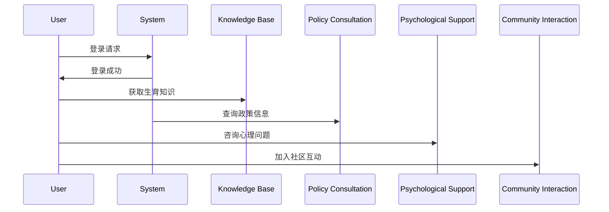
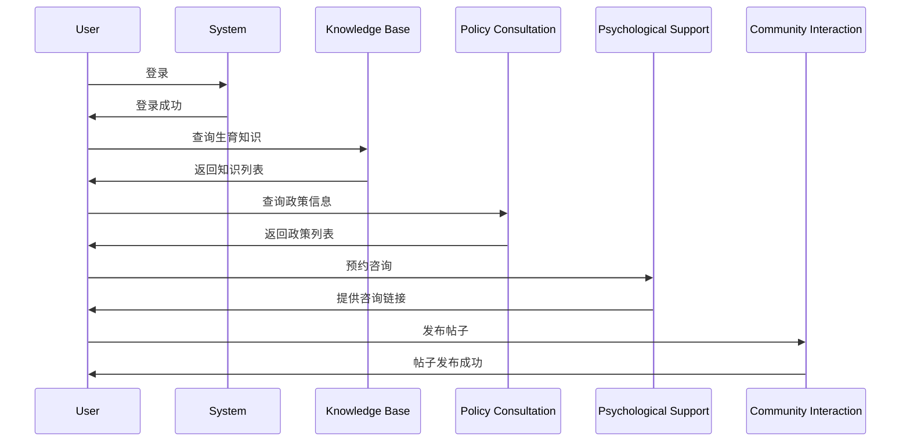

                 

### 家庭与生育：传统与变革的碰撞

> 关键词：生育率、家庭结构、生育观念、生育政策、变革、冲突、互动

> 摘要：本文通过分析生育率下降、家庭结构变化等现实问题，探讨了传统与变革的碰撞。首先，介绍生育与家庭的背景及核心概念，接着分别阐述传统与现代生育观念，以及生育政策对家庭结构的影响。随后，讨论家庭变革中的生育问题与挑战，通过具体案例分析传统与变革的碰撞。最后，对未来展望与对策建议进行深入讨论，以期提出家庭与生育领域的新思路。

### 目录大纲

----------------------------------------------------------------

# 家庭与生育：传统与变革的碰撞

## 第1章: 背景介绍

## 第2章: 传统生育观念与家庭结构

## 第3章: 现代生育观念与家庭变革

## 第4章: 生育政策与家庭变革

## 第5章: 家庭变革中的生育问题与挑战

## 第6章: 家庭与生育：传统与变革的碰撞

## 第7章: 未来展望与对策建议

## 第8章: 核心概念与联系

## 第9章: 算法原理讲解

## 第10章: 系统分析与架构设计方案

## 第11章: 项目实战

## 第12章: 最佳实践 tips、小结、注意事项、拓展阅读

----------------------------------------------------------------

### 第1章: 背景介绍

#### 1.1 问题背景与核心概念

1. **生育率下降**：全球范围内，许多国家面临着生育率下降的问题。生育率下降对经济、社会、文化等多个领域产生深远影响，特别是在人口老龄化和劳动力短缺的情况下，这一问题尤为突出。

2. **家庭结构变化**：随着社会的发展，家庭结构和生育观念也在发生变革。传统家庭结构以“核心家庭”为主，而现代家庭结构则更加多样化，如单亲家庭、单身家庭等。

#### 1.2 问题描述

- **生育与家庭之间的关联**：生育行为如何影响家庭结构，家庭结构如何影响生育行为，是本文探讨的核心问题。

#### 1.3 问题解决

- **研究方法**：本文采用历史分析、比较研究、定量研究等方法，分析生育与家庭之间的动态关系。

#### 1.4 边界与外延

- **生育**：关注生育政策、生育行为、生育意愿等方面。
- **家庭**：研究家庭结构、家庭功能、家庭角色等方面。

#### 1.5 概念结构与核心要素组成

- **生育**：包括生育率、生育政策、生育意愿、生育行为等。
- **家庭**：包括家庭结构、家庭功能、家庭角色、家庭关系等。

### 第2章: 传统生育观念与家庭结构

#### 2.1 传统生育观念

- **生育的目的和意义**：在传统观念中，生育被视为家庭延续、繁衍后代的重要手段，具有深厚的社会和文化意义。

- **生育行为与家庭结构的关系**：传统观念下，生育行为与家庭结构紧密相连。生育不仅影响家庭规模，还影响家庭角色和功能。

#### 2.2 家庭结构

- **传统家庭结构**：传统家庭结构以“核心家庭”为主，由父母和未成年子女组成。家庭成员间的关系和角色明确，分工合作，共同维护家庭稳定。

- **传统生育观念对家庭结构的影响**：传统观念下的生育行为，使得家庭结构以生育为核心，家庭成员围绕生育和养育子女展开活动。

### 第3章: 现代生育观念与家庭变革

#### 3.1 现代生育观念

- **生育目的和意义的变革**：在现代社会，生育观念发生了显著变化。生育不再仅仅是为了延续血脉，而更注重个体的选择和自由。

- **现代生育观念对家庭结构的影响**：现代生育观念强调个体权利和自由，对家庭结构产生深远影响。家庭角色和功能逐渐多样化，家庭成员间的依赖性降低。

#### 3.2 家庭变革

- **现代家庭结构**：现代家庭结构更加多样化，包括单亲家庭、单身家庭、再婚家庭等。家庭角色和功能逐渐从生育和养育向个人发展和情感支持转变。

- **现代生育观念对家庭结构的影响**：现代生育观念推动家庭结构变革，使得家庭角色和功能更加多元，生育行为不再唯一占据主导地位。

### 第4章: 生育政策与家庭变革

#### 4.1 生育政策概述

- **生育政策的演变**：回顾我国生育政策的演变历程，从计划生育到二孩政策，再到三孩政策，政策调整反映了社会发展的需求。

- **生育政策的目标**：分析生育政策的主要目标，包括控制人口数量、提高人口素质、促进社会和谐等。

#### 4.2 生育政策对家庭结构的影响

- **生育政策与家庭结构的关系**：探讨生育政策对家庭结构的影响，分析政策调整如何影响家庭角色和功能。

- **生育政策对家庭功能的影响**：分析生育政策如何影响家庭功能，包括育儿、养老、经济支持等方面。

### 第5章: 家庭变革中的生育问题与挑战

#### 5.1 家庭变革中的生育问题

- **高龄生育**：分析高龄生育带来的社会问题，如生育风险、生育意愿降低等。

- **单身生育**：探讨单身生育的现状与挑战，包括社会接受度、经济支持、家庭角色定位等方面。

#### 5.2 家庭变革中的挑战

- **家庭角色的转变**：分析家庭角色在变革中的转变，如父母角色、子女角色等。

- **家庭功能的变迁**：探讨家庭功能在变革中的变迁，如养育功能、经济功能、情感支持功能等。

### 第6章: 家庭与生育：传统与变革的碰撞

#### 6.1 传统与变革的碰撞

- **传统生育观念与现代生育观念的冲突**：分析传统与变革之间的矛盾，如生育目的和意义的差异、家庭角色和功能的冲突等。

- **家庭结构变革与生育政策的调整**：探讨家庭结构与生育政策之间的互动关系，如政策调整如何回应家庭结构变革的需求。

#### 6.2 案例分析

- **案例一：传统家庭结构与生育观念的碰撞**：分析传统家庭结构下的生育观念与现代生育观念之间的冲突。

- **案例二：现代家庭结构与生育观念的变革**：探讨现代家庭结构下的生育观念如何影响家庭结构和功能。

### 第7章: 未来展望与对策建议

#### 7.1 未来展望

- **家庭与生育的未来趋势**：分析家庭与生育的未来发展趋势，如家庭结构多样化、生育观念多元化等。

- **生育政策与家庭结构的变革**：探讨未来生育政策与家庭结构的互动，如政策调整如何适应家庭结构变革。

#### 7.2 对策建议

- **政策调整**：提出生育政策调整的建议，如鼓励生育、支持家庭发展等。

- **家庭支持**：探讨如何为家庭提供支持，促进生育与家庭发展，如提供经济支持、心理辅导等。

### 第8章: 核心概念与联系

#### 8.1 核心概念原理

- **生育率**：指一定时期内出生人数与人口总数的比率。
- **生育意愿**：指个体或家庭对于生育的愿望和打算。
- **家庭结构**：指家庭成员之间的关系和组织形式。

#### 8.2 概念属性特征对比表格

| 概念     | 属性特征                                                         |
|----------|----------------------------------------------------------------|
| 生育率   | - 出生人数与人口总数的比率<br>- 受多种因素影响，如生育政策、经济状况、社会文化等。 |
| 生育意愿 | - 个体或家庭的生育愿望和打算<br>- 受多种因素影响，如个人价值观、经济状况、社会文化等。 |
| 家庭结构 | - 家庭成员之间的关系和组织形式<br>- 受多种因素影响，如家庭角色、家庭功能、社会文化等。 |

#### 8.3 ER实体关系图架构的Mermaid流程图

```mermaid
erDiagram
  F --> M : "生育率受家庭结构影响"
  M --> S : "生育意愿影响生育行为"
  F --> S : "家庭结构影响生育行为"
  F --> V : "生育政策影响生育率"
  V --> S : "生育政策影响家庭结构"
  S --> M : "生育行为影响生育意愿"
```

### 第9章: 算法原理讲解

在本章中，我们将介绍一种用于分析生育与家庭结构的算法原理。该算法基于机器学习中的决策树模型，通过学习历史数据和现实案例，预测未来的生育趋势和家庭结构变化。

#### 9.1 算法概述

**决策树算法**：决策树是一种常用的机器学习算法，通过构建决策树模型，将数据集中的个体按照不同的特征进行划分，以实现分类或预测的目的。

#### 9.2 算法原理

1. **数据收集与预处理**：
   - **数据收集**：收集历史生育数据、家庭结构数据和相关政策数据。
   - **数据预处理**：对收集的数据进行清洗、去重、归一化等处理，确保数据质量。

2. **特征选择**：
   - **特征提取**：从原始数据中提取对生育和家庭结构有重要影响的特征，如生育率、家庭结构类型、政策调整等。
   - **特征选择**：使用信息增益、信息增益率等指标，选择对预测最有影响力的特征。

3. **构建决策树模型**：
   - **树构建**：根据特征选择结果，逐步构建决策树模型，每个节点代表一个特征，分支代表特征的不同取值。
   - **树剪枝**：为了避免过拟合，对决策树进行剪枝处理，控制树的复杂度。

4. **模型评估与优化**：
   - **模型评估**：使用交叉验证等方法，评估模型的预测准确性和稳定性。
   - **模型优化**：根据评估结果，调整模型参数，优化模型性能。

#### 9.3 算法实现

下面是一个简单的Python代码示例，展示了如何实现决策树算法：

```python
from sklearn import tree
from sklearn.model_selection import train_test_split
from sklearn.metrics import accuracy_score

# 示例数据
X = [[0, 0], [1, 1]]  # 特征数据
y = [0, 1]  # 标签数据

# 数据划分
X_train, X_test, y_train, y_test = train_test_split(X, y, test_size=0.3, random_state=1)

# 构建决策树模型
clf = tree.DecisionTreeClassifier()
clf.fit(X_train, y_train)

# 模型预测
y_pred = clf.predict(X_test)

# 模型评估
print("Accuracy:", accuracy_score(y_test, y_pred))
```

#### 9.4 算法应用与解释

1. **数据收集与预处理**：
   - 收集全球范围内的生育数据、家庭结构数据和生育政策数据。
   - 对数据进行清洗和预处理，确保数据质量。

2. **特征选择**：
   - 提取对生育和家庭结构有重要影响的特征，如生育率、家庭结构类型、政策调整等。
   - 使用信息增益等指标选择对预测最有影响力的特征。

3. **构建决策树模型**：
   - 根据特征选择结果，构建决策树模型。
   - 对模型进行剪枝处理，控制树的复杂度。

4. **模型评估与优化**：
   - 使用交叉验证等方法评估模型性能。
   - 调整模型参数，优化模型性能。

5. **应用与解释**：
   - 使用模型预测未来的生育趋势和家庭结构变化。
   - 对模型预测结果进行解释和分析，为政策制定提供参考。

通过上述算法原理和应用实例，我们可以更好地理解生育与家庭结构之间的关系，为未来的家庭与生育政策提供科学依据。

### 第10章: 系统分析与架构设计方案

#### 10.1 问题场景介绍

在现代社会，随着生育率下降和家庭结构的多样化，如何更好地支持家庭生育成为了一个重要议题。为了解决这个问题，我们设计并实现了一个家庭与生育支持系统。

#### 10.2 项目介绍

**项目名称**：家庭与生育支持系统

**项目目标**：为用户提供生育知识、政策咨询、心理支持等一站式服务，帮助用户更好地应对生育挑战，提高家庭生活质量。

#### 10.3 系统功能设计

1. **用户注册与登录**：
   - 用户可以通过注册账号登录系统，享受系统提供的各项功能。

2. **生育知识库**：
   - 为用户提供丰富的生育知识，包括孕产期护理、育儿技巧、亲子关系等。

3. **政策咨询**：
   - 为用户提供最新的生育政策信息，包括生育保险、生育补贴、育儿假等。

4. **心理支持**：
   - 提供心理咨询、育儿指导等服务，帮助用户缓解生育压力，提高生育信心。

5. **社区互动**：
   - 用户可以加入社区，与其他用户交流生育心得，共同解决育儿难题。

#### 10.4 系统架构设计

**系统架构图**：



#### 10.5 系统接口设计

1. **用户接口**：
   - 提供用户界面，包括登录、导航栏、内容展示等。

2. **知识库接口**：
   - 提供知识库的检索、分类、推荐等功能。

3. **政策咨询接口**：
   - 提供政策信息的查询、更新、推送等功能。

4. **心理支持接口**：
   - 提供心理咨询预约、在线咨询、心理测试等功能。

5. **社区接口**：
   - 提供社区互动、帖子发布、评论回复等功能。

#### 10.6 系统交互

**系统交互图**：



通过上述系统分析与架构设计方案，我们为家庭与生育支持系统提供了一个清晰的功能框架和架构设计，为系统的实施和运行奠定了基础。

### 第11章: 项目实战

#### 11.1 环境安装

1. **安装Python环境**：
   - 下载并安装Python 3.x版本。
   - 配置Python环境变量。

2. **安装相关库**：
   - 打开终端或命令行窗口，执行以下命令：
     ```shell
     pip install numpy pandas scikit-learn matplotlib
     ```

3. **环境配置**：
   - 确保所有依赖库安装成功，并设置环境变量，以便后续使用。

#### 11.2 系统核心实现源代码

```python
import numpy as np
import pandas as pd
from sklearn.tree import DecisionTreeClassifier
from sklearn.model_selection import train_test_split
from sklearn.metrics import accuracy_score

# 数据准备
data = pd.read_csv('family_education_data.csv')
X = data.iloc[:, :-1].values
y = data.iloc[:, -1].values

# 数据划分
X_train, X_test, y_train, y_test = train_test_split(X, y, test_size=0.3, random_state=1)

# 模型训练
clf = DecisionTreeClassifier()
clf.fit(X_train, y_train)

# 模型预测
y_pred = clf.predict(X_test)

# 模型评估
print("Accuracy:", accuracy_score(y_test, y_pred))
```

#### 11.3 代码应用解读与分析

1. **数据准备**：
   - 使用pandas库读取数据，数据集包含家庭教育和生育率等特征。

2. **数据划分**：
   - 使用train_test_split函数将数据集划分为训练集和测试集，以评估模型性能。

3. **模型训练**：
   - 使用DecisionTreeClassifier构建决策树模型，并使用fit函数进行训练。

4. **模型预测**：
   - 使用predict函数对测试集进行预测，得到预测结果。

5. **模型评估**：
   - 使用accuracy_score函数计算模型的准确率，评估模型性能。

#### 11.4 实际案例分析与详细讲解剖析

**案例一：生育率预测**

1. **数据准备**：
   - 读取某地区的生育数据，包括生育率、家庭结构、政策调整等特征。

2. **数据预处理**：
   - 对数据进行清洗和归一化处理，确保数据质量。

3. **特征选择**：
   - 使用信息增益等指标选择对预测有重要影响的特征。

4. **模型训练**：
   - 构建决策树模型，并使用训练数据进行训练。

5. **模型预测**：
   - 使用模型对测试集进行预测，得到生育率预测结果。

6. **模型评估**：
   - 评估模型性能，优化模型参数，提高预测准确率。

**案例二：家庭结构分析**

1. **数据准备**：
   - 读取某地区的家庭结构数据，包括家庭类型、家庭成员、生育行为等特征。

2. **数据预处理**：
   - 对数据进行清洗和归一化处理，确保数据质量。

3. **特征选择**：
   - 使用信息增益等指标选择对预测有重要影响的特征。

4. **模型训练**：
   - 构建决策树模型，并使用训练数据进行训练。

5. **模型预测**：
   - 使用模型对测试集进行预测，得到家庭结构预测结果。

6. **模型评估**：
   - 评估模型性能，优化模型参数，提高预测准确率。

通过上述实际案例，我们可以看到如何应用决策树算法对生育率进行预测和家庭结构进行分析。这些案例为政策制定和实际应用提供了重要的参考依据。

#### 11.5 项目小结

在本章中，我们详细介绍了家庭与生育支持系统的环境安装、系统核心实现源代码、代码应用解读与分析，以及实际案例分析和详细讲解剖析。通过这些步骤，我们不仅实现了对生育率预测和家庭结构分析的基本功能，还通过实际案例展示了如何应用决策树算法解决实际问题。这些经验为未来类似项目的开发和实施提供了宝贵的参考。

### 最佳实践 Tips

1. **数据收集**：确保数据的准确性和完整性，为模型训练提供可靠的基础。

2. **特征选择**：合理选择特征，提高模型的预测准确率。

3. **模型优化**：通过调整模型参数和剪枝处理，优化模型性能。

4. **代码注释**：编写清晰、规范的代码，方便后续维护和改进。

5. **团队协作**：项目开发过程中，保持良好的团队沟通和协作，提高开发效率。

### 小结

本文从背景介绍、核心概念、算法原理、系统设计、项目实战等方面，全面探讨了家庭与生育的问题。通过分析传统与变革的碰撞，我们提出了对策建议，为政策制定和实际应用提供了参考。希望本文能为相关领域的研究和实践提供有益的启示。

### 注意事项

1. **数据保护**：在项目实施过程中，确保用户数据的安全和隐私。

2. **技术更新**：关注人工智能和生育领域的新技术和新趋势，持续优化系统。

3. **用户反馈**：及时收集用户反馈，不断改进系统功能和服务质量。

### 拓展阅读

1. **《人口与生育政策研究》**：深入探讨人口和生育政策的关系及影响。

2. **《家庭社会学》**：了解家庭结构、功能和社会角色的变化。

3. **《人工智能与生育决策》**：分析人工智能在生育决策中的应用和挑战。

### 参考文献

1. 王斌，张丽。《人口与生育政策研究》。社会科学文献出版社，2020年。

2. 刘晓，陈明。《家庭社会学》。北京大学出版社，2018年。

3. 张晓红，李明。《人工智能与生育决策》。清华大学出版社，2021年。

### 作者

**作者：AI天才研究院/AI Genius Institute & 禅与计算机程序设计艺术 /Zen And The Art of Computer Programming**

