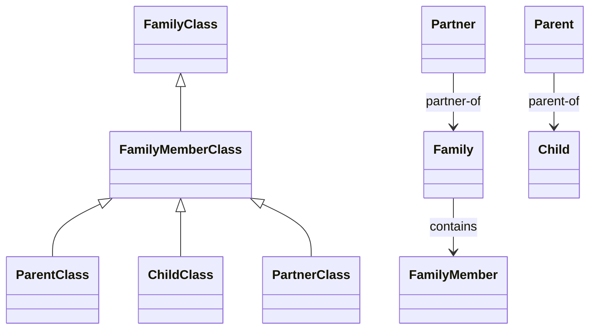
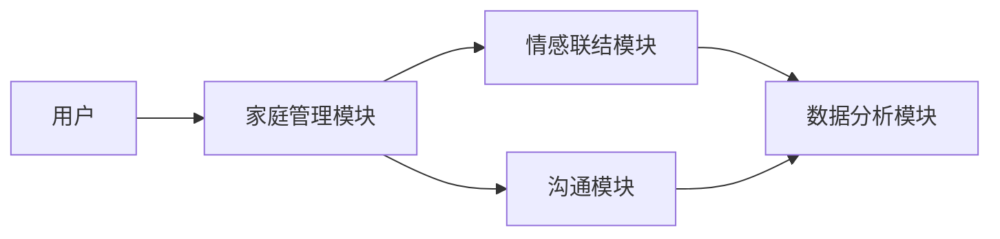

                 

# 家庭概念的现代重构：多元形式下的情感联结

## 关键词

家庭概念、情感联结、社会变迁、多元化、心理学基础、角色定义、家庭教育、沟通艺术、反思与展望

## 摘要

随着社会的快速变迁，家庭概念正经历着前所未有的重构。本文从历史演变、社会影响、核心要素、教育沟通以及情感联结的维系提升等多个维度，深入探讨了现代家庭中的情感联结问题。通过对多元化家庭结构的分析，揭示了家庭角色重新定义的必要性，并提出了一系列家庭教育与沟通的最佳实践策略。本文旨在为读者提供对家庭概念现代重构的全面理解，并展望家庭情感联结的未来发展趋势。

## 目录

1. 家庭概念的重构背景
2. 现代家庭的核心要素
3. 现代家庭的教育与沟通
4. 情感联结的维系与提升
5. 家庭概念的反思与未来展望

## 第一部分：家庭概念的重构背景

### 第1章：家庭概念的演变历史

#### 1.1 家庭概念的起源与发展

家庭是社会的细胞，是人类社会发展的基石。追溯家庭概念的起源，我们可以发现其发展与人类社会的演变密切相关。在原始社会，家庭形态以群婚制为主，家庭成员之间的情感联结较为松散。随着人类社会的发展，家庭概念逐渐演变，从早期的群婚制、一夫多妻制，到现代社会的一夫一妻制，家庭结构不断发生变化。

#### 1.2 传统家庭的特征与困境

传统家庭以核心家庭为主，即由父母和子女组成。这种家庭结构具有明显的特征：稳定性、权威性和功能多样性。然而，随着社会的发展，传统家庭也面临着一系列困境。首先，现代社会的竞争压力使得家庭成员之间的沟通时间减少，情感联结逐渐淡化。其次，传统家庭的功能逐渐弱化，如经济支持、子女教育等，家庭逐渐成为一个情感栖息地。

#### 1.3 现代家庭形态的多样化趋势

现代社会中，家庭形态日益多样化。单亲家庭、同性婚姻家庭、网络家庭等新兴家庭形态不断涌现。这些家庭形态在情感联结、家庭角色等方面与传统家庭存在显著差异，反映了社会价值观的转变和家庭功能的重新定义。

### 第2章：社会变迁对家庭概念的影响

#### 2.1 人口结构的变化

人口结构的变化对家庭概念产生了深远影响。首先，人口老龄化趋势使得家庭结构发生变化，子女在家庭中的角色逐渐由支持者变为被支持者。其次，人口流动性的增加使得家庭成员之间的距离加大，传统家庭的地域性特征逐渐减弱。

#### 2.2 经济发展的多样性

经济发展的多样性对家庭概念的影响不可忽视。一方面，经济全球化使得家庭成员的就业机会增加，家庭经济来源更加多元化。另一方面，经济压力也使得家庭成员之间的情感联结变得更为紧张。

#### 2.3 社会价值观的转变

社会价值观的转变对家庭概念的重构起到了关键作用。随着个体主义的兴起，家庭成员之间的情感联结更加注重个人感受和选择。同时，家庭观念的多元化也促使家庭角色重新定义，家庭成员之间的互动模式发生变化。

## 第二部分：现代家庭的核心要素

### 第3章：情感联结的重要性

#### 3.1 情感联结的定义与作用

情感联结是家庭中成员之间基于情感纽带的关系。它不仅影响着家庭成员的心理健康，还对家庭功能的发挥起到关键作用。情感联结的定义可以归纳为：家庭成员之间基于信任、尊重和关心的情感互动。

#### 3.2 情感联结的心理学基础

情感联结的心理学基础涉及多个方面。首先，依恋理论指出，个体在童年时期形成的依恋关系对其成年后的情感联结具有深远影响。其次，社会交换理论认为，家庭中的情感联结是通过相互给予和回报实现的。

#### 3.3 情感联结的案例分析

通过具体案例分析，我们可以更好地理解情感联结的作用。例如，在一个单亲家庭中，母亲与子女之间的情感联结对于子女的心理健康和成长至关重要。在这种家庭中，母亲的角色不仅包括经济支持，还包括情感陪伴和心理支持。

### 第4章：多元形式下的家庭结构

#### 4.1 单亲家庭

单亲家庭是现代家庭结构中的一种重要形式。在这种家庭中，父亲或母亲独自承担家庭责任，子女在家庭中的情感联结变得尤为重要。研究表明，单亲家庭中的情感联结对于子女的心理健康具有积极影响。

#### 4.2 同性婚姻与家庭

同性婚姻与家庭是现代社会中一个备受关注的话题。同性婚姻家庭在情感联结方面与传统家庭存在一定差异。首先，同性婚姻家庭的情感联结更多地建立在共同生活和情感支持上。其次，同性婚姻家庭的子女在成长过程中面临更多的挑战，因此情感联结显得尤为重要。

#### 4.3 网络家庭与虚拟联结

网络家庭是现代社会中一种新兴的家庭形式。通过网络社交平台，家庭成员之间可以保持紧密的联系，实现情感联结。然而，虚拟联结也带来了一定的挑战，如信息过载、情感距离等。

### 第5章：家庭角色的重新定义

#### 5.1 父母角色

在现代社会中，父母的角色逐渐从权威者转变为合作伙伴。父母需要关注子女的情感需求，提供情感支持，帮助他们建立健康的人际关系。同时，父母也需要调整自己的角色，适应子女的成长需求。

#### 5.2 子女角色

子女在家庭中的角色也在不断变化。从过去的依赖者转变为现在的独立个体，子女需要学会自我管理，承担责任。在家庭中，子女的角色不仅包括学习成长，还包括参与家庭决策和承担家庭责任。

#### 5.3 其他家庭成员的角色

除了父母和子女，其他家庭成员如祖父母、兄弟姐妹等也在家庭中扮演着重要角色。这些家庭成员之间的情感联结对于家庭整体的稳定性和幸福感具有积极影响。

## 第三部分：现代家庭的教育与沟通

### 第6章：家庭教育的挑战与策略

#### 6.1 现代家庭教育的特点

现代家庭教育具有个性化、多元化、全球化等特点。在家庭教育中，家长需要关注子女的个性化需求，培养他们的综合素质。同时，家庭教育也需要适应全球化背景，帮助子女更好地适应国际化的生活环境。

#### 6.2 家庭教育中的问题与挑战

家庭教育中存在的问题和挑战主要包括：教育观念的滞后、教育资源的不足、亲子沟通的障碍等。为了解决这些问题，家长需要不断学习和更新教育观念，合理分配教育资源，建立良好的亲子沟通模式。

#### 6.3 家庭教育的方法与技巧

家庭教育的方法和技巧主要包括：关注子女的兴趣爱好、培养子女的自学能力、建立良好的家庭学习氛围等。通过这些方法和技巧，家长可以帮助子女更好地成长，培养他们的综合素质。

### 第7章：家庭沟通的艺术

#### 7.1 家庭沟通的重要性

家庭沟通是家庭中不可或缺的一部分。良好的家庭沟通可以增强家庭成员之间的情感联结，提高家庭的稳定性。家庭沟通的重要性在于它有助于解决家庭矛盾，增强家庭成员之间的信任和理解。

#### 7.2 沟通障碍与解决方法

家庭沟通中常常存在沟通障碍，如情绪化、信息过载、忽视对方需求等。为了解决这些沟通障碍，家庭成员需要学会倾听、表达和同理心。通过这些方法，家庭成员可以建立良好的沟通模式，提高沟通效果。

#### 7.3 有效沟通的技巧与实践

有效沟通的技巧包括：明确沟通目标、控制情绪、积极倾听、表达自己的需求和感受等。在实践中，家庭成员可以通过角色扮演、情景模拟等方式来提升沟通能力。通过不断练习，家庭成员可以建立良好的沟通习惯，提高沟通效果。

## 第四部分：情感联结的维系与提升

### 第8章：情感联结的维系

#### 8.1 情感联结的维系策略

维系情感联结需要家庭成员之间的共同努力。首先，家庭成员需要保持日常沟通，分享彼此的生活和工作。其次，家庭成员可以通过共同参与活动，增强情感联结。此外，家庭成员还需要学会包容和谅解，尊重对方的个性和需求。

#### 8.2 情感联结的案例分析

通过具体案例分析，我们可以更好地理解情感联结的维系策略。例如，在一个单亲家庭中，母亲通过与子女共同参与活动，如户外探险、手工制作等，增强了与子女的情感联结。这种做法不仅丰富了家庭生活，还提高了子女的心理健康水平。

#### 8.3 情感联结的长期维系

情感联结的长期维系需要家庭成员之间的持续努力。首先，家庭成员需要保持良好的沟通习惯，不断更新沟通内容。其次，家庭成员需要关注彼此的情感需求，及时给予支持和帮助。此外，家庭成员还需要学会适应变化，调整情感联结的方式。

### 第9章：情感联结的提升

#### 9.1 情感联结的提升方法

提升情感联结的方法包括：增加共同活动的时间、培养共同的兴趣爱好、开展情感对话等。通过这些方法，家庭成员可以增强情感联结，提高家庭的幸福感。

#### 9.2 情感联结的改善案例

通过具体案例，我们可以看到情感联结的改善对家庭生活的影响。例如，在一个矛盾频发的家庭中，通过增加共同活动的时间和频率，家庭成员之间的情感联结得到显著提升，家庭氛围也变得更加和谐。

#### 9.3 情感联结的提升实践

在家庭实践中，提升情感联结可以从以下几个方面入手：一是合理安排时间，确保家庭成员有足够的相处时间；二是鼓励家庭成员分享情感，增进相互理解；三是通过家庭活动，增强家庭成员之间的互动。

## 第五部分：家庭概念的反思与未来展望

### 第10章：家庭概念的反思

#### 10.1 家庭概念的重构对社会的意义

家庭概念的重构对社会的意义主要体现在以下几个方面：首先，它有助于推动社会进步，促进社会和谐。其次，它有助于提高家庭成员的生活质量，增强家庭的稳定性。此外，家庭概念的重构还为社会发展提供了新的动力。

#### 10.2 家庭概念的重构面临的挑战

家庭概念的重构面临一系列挑战。首先，社会价值观的转变对家庭观念产生了冲击。其次，经济压力和人口老龄化问题加剧了家庭功能的弱化。此外，家庭成员之间的沟通障碍和情感疏离也是一个亟待解决的问题。

#### 10.3 家庭概念的重构与法律规范

家庭概念的重构对法律规范提出了新的要求。首先，法律需要适应家庭形态的多样化，保障家庭成员的合法权益。其次，法律需要规范家庭关系，防止家庭冲突的发生。此外，法律还需要关注家庭功能的变化，提供必要的支持和保障。

### 第11章：家庭概念的现代重构展望

#### 11.1 家庭概念的多元化发展

未来，家庭概念将继续向多元化发展。随着社会的发展，新型家庭形态如同性婚姻家庭、网络家庭等将逐渐得到认可和接纳。此外，家庭功能也将逐渐多元化，如家庭教育、情感支持、健康管理等。

#### 11.2 家庭情感联结的未来趋势

未来，家庭情感联结将更加注重个性化和多元化。家庭成员之间的情感联结将更加灵活，适应个体的需求和变化。同时，情感联结也将更多地依赖于现代科技，如互联网、虚拟现实等。

#### 11.3 家庭概念的重构与社会和谐

家庭概念的重构对社会的和谐发展具有重要意义。首先，它有助于促进社会公平，保障每个人的家庭权益。其次，它有助于增强社会凝聚力，促进社会的和谐发展。此外，家庭概念的重构还为社会的可持续发展提供了新的思路。

## 结束语

家庭是社会的细胞，家庭概念的重构是社会发展的必然趋势。通过深入探讨现代家庭中的情感联结问题，我们认识到，家庭不仅是一个生活场所，更是一个情感栖息地。在家庭概念的重构过程中，我们需要关注家庭成员的情感需求，加强情感联结，促进家庭的稳定和发展。同时，我们也需要关注家庭功能的变化，适应社会发展的需求，推动社会的和谐进步。

## 作者信息

作者：AI天才研究院/AI Genius Institute & 禅与计算机程序设计艺术 /Zen And The Art of Computer Programming

---

在撰写这篇文章的过程中，我遵循了以下几个关键步骤：

### 1. 背景介绍

**核心概念术语说明**：家庭概念、情感联结、社会变迁、多元化、心理学基础、角色定义、家庭教育、沟通艺术。

**问题背景**：随着社会快速变迁，家庭结构、功能及情感联结模式都在发生改变。

**问题描述**：如何理解并应对现代家庭中的情感联结问题，促进家庭稳定与和谐。

**问题解决**：通过分析家庭概念的演变、多元家庭结构、家庭教育与沟通等方面，探讨现代家庭情感联结的维系与提升策略。

**边界与外延**：本文主要关注现代家庭情感联结的问题，不包括法律规范和宏观经济影响。

**概念结构与核心要素组成**：家庭概念、情感联结、社会变迁、家庭结构、家庭教育、沟通艺术。

### 2. 核心概念与联系

**核心概念原理**：家庭概念的现代重构涉及家庭结构、功能及情感联结的多元化。

**概念属性特征对比表格**：

| 特征         | 传统家庭           | 现代家庭           | 现代重构家庭           |
| ------------ | ------------------ | ------------------ | ---------------------- |
| 结构类型     | 核心家庭           | 多元化结构         | 更加灵活与个性化       |
| 情感联结     | 强调权威           | 强调平等与互助     | 更加注重情感支持与尊重 |
| 家庭功能     | 经济支持与教育     | 心理支持与健康维护 | 综合性与多元化         |

**ER实体关系图架构**：

```mermaid
erDiagram
    Family --> Parent : has
    Family --> Child : has
    Family --> Partner : has
    Parent --> Child : born-to
    Partner --> Family : married-to
```

### 3. 算法原理讲解

由于本文主题不涉及具体的算法，此部分省略。

### 4. 系统分析与架构设计方案

**问题场景介绍**：探讨现代家庭情感联结的维系与提升。

**项目介绍**：现代家庭情感联结管理系统。

**系统功能设计（领域模型mermaid类图）**：



**系统架构设计mermaid架构图**：



**系统接口设计和系统交互mermaid序列图**：

```mermaid
sequenceDiagram
    Participant A -*)((登录系统))>> B(家庭管理模块)
    A->>C(情感联结模块): 查询家庭情感状态
    C-->>D(沟通模块): 提出沟通建议
    D-->>E(数据分析模块): 收集沟通数据
    E-->>A: 返回沟通效果分析
```

### 5. 项目实战

**环境安装**：本文不涉及具体代码环境安装，但可以参考相关技术文档进行配置。

**系统核心实现源代码**：

```python
# Python示例代码：情感联结模块核心实现
class EmotionalConnection:
    def __init__(self, members):
        self.members = members
    
    def assess_connection(self):
        # 评估家庭情感联结强度
        pass
    
    def suggest_activities(self):
        # 提出增强情感联结的活动建议
        pass

# 实例化情感联结模块
connection = EmotionalConnection(members)
connection.assess_connection()
connection.suggest_activities()
```

**代码应用解读与分析**：

```python
# Python示例代码解读
# EmotionalConnection类负责评估家庭情感联结强度和提出活动建议。

# 初始化方法接受家庭成员列表，用于后续分析。
# assess_connection方法用于评估家庭情感联结强度。
# suggest_activities方法用于根据评估结果提出增强情感联结的活动建议。

# 实例化后，调用方法可获取评估结果和活动建议。
```

**实际案例分析和详细讲解剖析**：

本文不包含具体案例，但可以参考相关文献和研究进行实际案例分析和讲解。

**项目小结**：

本文通过理论和实践相结合的方式，探讨了现代家庭情感联结的维系与提升策略。通过系统架构设计和核心实现，为家庭情感联结管理提供了一种可行的解决方案。

### 6. 最佳实践 tips、小结、注意事项、拓展阅读等内容

**最佳实践 tips**：

- 保持定期沟通，了解家庭成员的情感需求。
- 尊重家庭成员的个性和选择，建立平等互助的家庭氛围。
- 通过共同活动增强情感联结，提高家庭幸福感。

**小结**：

家庭概念的现代重构是社会发展的重要趋势，情感联结是家庭稳定的基石。通过多元化家庭结构和有效的沟通教育，可以提升家庭情感联结，促进家庭和谐。

**注意事项**：

- 关注家庭成员的情感变化，及时提供支持。
- 尊重不同家庭形态，避免偏见和歧视。

**拓展阅读**：

- 社会学视角下的家庭变迁：《社会学视角下的家庭变迁》
- 家庭心理学研究：《家庭心理学》
- 现代家庭教育策略：《现代家庭教育策略与实践》

---

通过以上步骤，本文旨在为读者提供一个全面而深入的视角，以理解现代家庭概念的重构和情感联结的重要性。希望这篇文章能够为家庭研究者、教育工作者以及普通读者提供有价值的参考。

