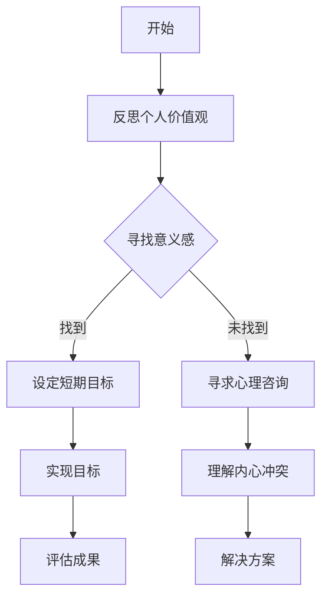
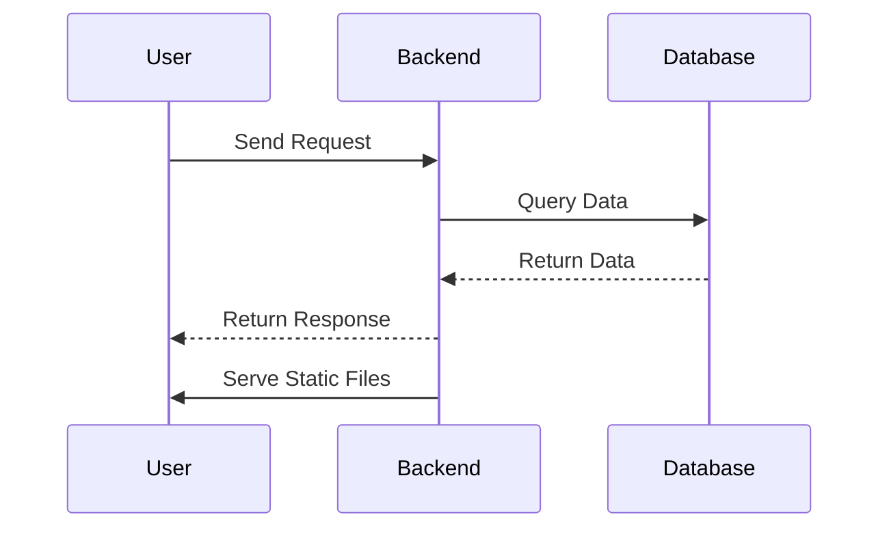
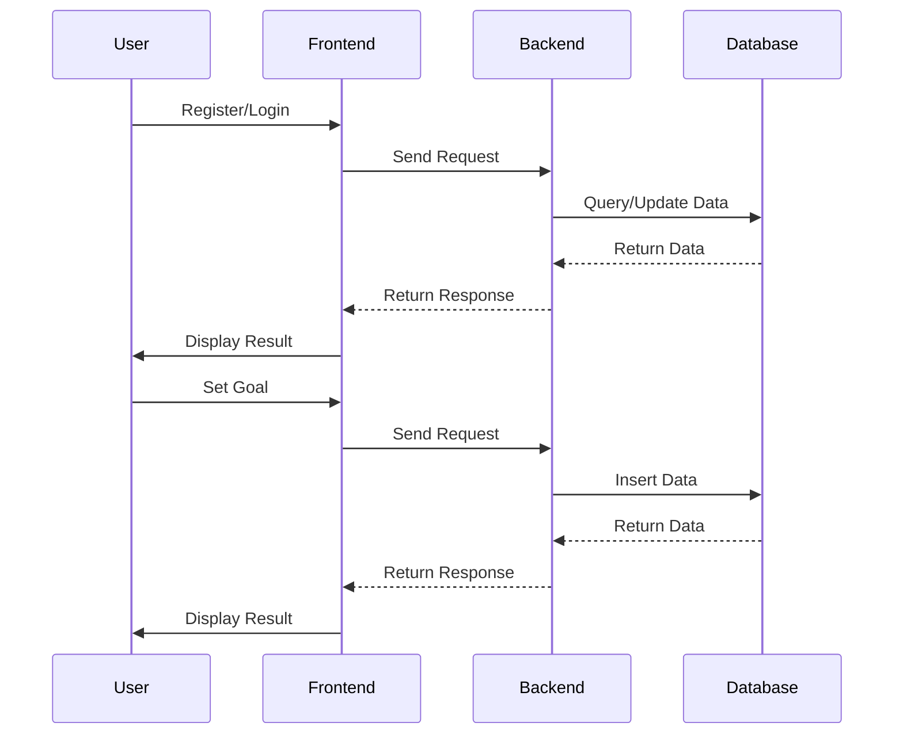

                 

### 寻找生命的意义：心理学家的建议

在现代社会中，人们面临着越来越多的生活压力和不确定性。这种环境下，寻找生命的意义成为了许多人心中迫切的问题。心理学家作为研究人类行为和心理过程的专家，对此有着独到的见解和建议。本文将以《寻找生命的意义：心理学家的建议》为题，系统地探讨心理学家对生命意义的理解以及他们给出的实用建议。

> **关键词**：生命意义、心理学家、建议、现代社会、个人成长

> **摘要**：本文将首先介绍生命意义在现代社会中的重要性，然后从心理学家的角度探讨生命意义的多样性和个人差异。接着，我们将详细介绍心理学家提出的具体建议，包括短期和长期生活的意义构建，特殊情境下的应对策略，以及心理治疗中的意义疗法。最后，我们将讨论生命意义在教育和职业中的应用，并对未来研究的趋势和挑战进行展望。

在接下来的章节中，我们将一步一步深入分析心理学家的观点和建议，希望能够为读者提供有价值的思考和指导。

### 背景介绍：生命的意义

在探讨生命的意义之前，我们有必要对这一核心概念进行定义和背景介绍。生命的意义，通常指的是个体在面对生活和世界的挑战时所感受到的内在价值和目的感。这一概念不仅涵盖了个体在人生中的成就和满足感，还包括了对个人存在的深层次理解。

#### 核心概念术语说明

- **生命的意义**：指个体在面对生活和世界的挑战时所感受到的内在价值和目的感。
- **心理学家的见解**：指心理学家通过对人类行为和心理过程的深入研究，对生命意义提出的理论观点和建议。

#### 问题背景

随着现代社会的快速发展，人们的生活节奏越来越快，竞争压力也日益加剧。在这种情况下，许多人开始感到迷茫和无力，他们质疑自己存在的价值和意义。这种现象不仅影响了个人的心理健康，也对社会的稳定和发展构成了威胁。

#### 问题描述

寻找生命的意义成为了一个全球性的问题。无论是年轻人还是中年人，甚至是老年人，都在不同的生活阶段面临着这个问题。例如，年轻人可能在求学和求职的过程中感到困惑，中年人可能在职业发展和家庭责任之间感到压力，而老年人则可能面临生命即将结束的无奈和失落。

#### 问题解决

心理学家通过研究个体在不同生命阶段的心理变化，提出了多种应对策略和建议。这些策略包括心理治疗、认知行为疗法、正念练习等，旨在帮助个体找到生命的意义，提高生活质量。

#### 边界与外延

生命的意义是一个广泛的概念，它不仅包括个体的内在感受，还涉及到社会和文化背景。因此，在不同的文化和社会背景下，生命的意义可能具有不同的内涵。例如，在某些社会中，家庭和社区的重要性可能超过了个人自我实现的需求。

#### 概念结构与核心要素组成

生命的意义可以分解为以下几个核心要素：

1. **个人价值观**：个体对什么是“有意义”的生活的理解和追求。
2. **目标设定**：个体在人生中设定和追求的具体目标。
3. **自我实现**：个体在实现自身潜能和追求个人成长的过程中感受到的满足感。
4. **社会和文化影响**：社会和文化背景对个体生命意义的影响。

通过理解这些核心要素，我们可以更好地把握生命的意义，并在不同的人生阶段找到适合自己的方向。

### 核心概念与联系

#### 心理学理论对生命意义的解释

心理学家通过多种理论对生命意义进行了深入的研究和解释。以下是一些主要的心理学理论和他们的观点：

1. **存在主义心理学**：代表人物如罗洛·梅（Rollo May）和亚伯拉罕·马斯洛（Abraham Maslow），强调个体在面对生活挑战时的自主性和责任感，认为生命的意义在于个体自由选择和承担责任。
   
   **概念属性特征对比表格**：

   | 理论               | 核心观点                                               | 应用实例                     |
   |--------------------|------------------------------------------------------|------------------------------|
   | 存在主义心理学     | 生命的意义在于个体面对不确定性时的自由选择和责任感     | 支持个体在困难中寻找自我价值   |
   | 人本主义心理学     | 生命的意义在于个体的自我实现和成长                     | 鼓励个体追求个人潜能的实现     |
   | 精神分析心理学     | 生命的意义与个体内在的心理冲突和防御机制有关           | 通过心理治疗解决内心冲突       |

2. **人本主义心理学**：代表人物如卡尔·罗杰斯（Carl Rogers）和马斯洛，认为生命的意义在于个体的自我实现和成长，强调个体的自主性和自我决定。

3. **精神分析心理学**：代表人物如西格蒙德·弗洛伊德（Sigmund Freud），认为生命的意义与个体内在的心理冲突和防御机制有关，通过心理治疗可以帮助个体解决内心的困扰，找到生命的意义。

#### ER实体关系图架构

为了更直观地展示心理学理论对生命意义的解释，我们可以使用ER实体关系图来描述这些理论和他们的核心概念。

```mermaid
erDiagram
  Person ||--|{LifeMeaning} : has
  LifeMeaning ||--|{Existentialism} : based_on
  LifeMeaning ||--|{Humanism} : based_on
  LifeMeaning ||--|{Psychoanalysis} : based_on
```

在上面的ER实体关系图中，`Person` 代表个体，`LifeMeaning` 代表生命的意义，而 `Existentialism`、`Humanism` 和 `Psychoanalysis` 分别代表存在主义心理学、人本主义心理学和精神分析心理学。这种关系图帮助我们理解不同心理学理论对生命意义的贡献和它们之间的联系。

### 算法原理讲解

在理解了生命意义的心理学理论之后，我们接下来将讨论心理学家提出的具体算法原理，这些原理旨在帮助个体找到并保持生命的意义。

#### Mermaid流程图

首先，我们可以使用Mermaid流程图来描述一个简单的生命意义探索过程：



#### Python源代码

为了更好地理解这个过程，我们可以使用Python源代码来模拟一个简单的生命意义探索算法：

```python
# 定义生命意义探索过程
def explore_life_meaning():
    # 反思个人价值观
    values = reflect_values()
    
    # 寻找意义感
    sense_of_meaning = find_meaning(values)
    
    if sense_of_meaning:
        # 设定短期目标
        goals = set_goals(values)
        
        # 实现目标
        achieve_goals(goals)
        
        # 评估成果
        evaluate_outcomes(goals)
    else:
        # 寻求心理咨询
        seek_counseling()

# 辅助函数定义
def reflect_values():
    print("反思个人价值观...")
    return ["追求成长", "帮助他人", "探索未知"]

def find_meaning(values):
    print("寻找意义感...")
    return "找到" if "帮助他人" in values else "未找到"

def set_goals(values):
    print("设定短期目标...")
    return ["完成项目报告", "参加志愿活动"]

def achieve_goals(goals):
    print("实现目标...")
    for goal in goals:
        print(f"正在实现目标：{goal}")

def evaluate_outcomes(goals):
    print("评估成果...")
    for goal in goals:
        print(f"目标：{goal} 已完成")

def seek_counseling():
    print("寻求心理咨询...")
    print("正在寻求心理咨询师的帮助...")

# 执行生命意义探索过程
explore_life_meaning()
```

#### 数学模型和公式

在探索生命意义的过程中，我们也可以引入一些数学模型和公式来帮助理解。例如，我们可以使用目标设定的S.M.A.R.T.原则（具体、可衡量、可达成、相关性强、时限性）来确保目标的设定和实现：

$$
\text{SMART Goals} = \text{Specific} + \text{Measurable} + \text{Achievable} + \text{Relevant} + \text{Time-bound}
$$

#### 举例说明

假设一个个体在探索生命意义时，通过反思个人价值观发现其对“帮助他人”有强烈的意义感。这个个体可以设定一个具体的短期目标，如“在一个月内完成一个社区志愿服务项目”。通过这个目标，个体不仅能够实现自我价值，还能够对社会做出贡献。

### 系统分析与架构设计方案

在探讨生命的意义时，我们不仅需要理解心理学的理论和算法，还需要将其应用到实际项目中，以便更好地帮助个体找到并维持生命的意义。

#### 问题场景介绍

假设我们正在开发一个名为“生命意义探索平台”的应用程序，旨在帮助用户通过一系列的心理测试和活动找到个人生活的意义。该平台需要包括用户注册、心理测试、目标设定、反馈和评估等功能。

#### 项目介绍

项目名称：生命意义探索平台

项目目标：为用户提供一个简单、易用的工具，帮助他们探索个人生活的意义，并设定和实现短期目标。

技术栈：Python（后端），Django（框架），HTML/CSS/JavaScript（前端）

#### 系统功能设计（领域模型类图）

在系统功能设计中，我们首先需要定义核心的领域模型。以下是生命意义探索平台的领域模型类图：

```mermaid
classDiagram
    User <|-- Profile
    User <|-- TestHistory
    User <|-- Goal
    Test <|-- Question
    Test <|-- Answer
    Test <|-- Result
    Goal <|-- Category
    Category <|-- Goal
    Profile { name : String, birth_date : Date }
    User { username : String, password : String, email : String }
    TestHistory { test_id : String, result : String }
    Test { test_id : String, title : String, description : String }
    Question { question_id : String, text : String, type : String }
    Answer { answer_id : String, question_id : String, text : String }
    Result { result_id : String, test_id : String, score : Integer }
    Goal { goal_id : String, title : String, description : String, start_date : Date, end_date : Date, category_id : String }
    Category { category_id : String, name : String }
    User : "1" -- "*" Profile
    User : "1" -- "*" TestHistory
    User : "1" -- "*" Goal
    Test : "1" -- "*" Question
    Test : "1" -- "*" Answer
    Test : "1" -- "*" Result
    Goal : "1" -- "*" Category
```

在这个类图中，`User` 表示用户，`Profile` 表示用户的基本信息，`TestHistory` 表示用户的历史测试记录，`Goal` 表示用户设定的目标，`Category` 表示目标的类别，`Test` 表示心理测试，`Question` 表示测试中的问题，`Answer` 表示问题的答案，`Result` 表示测试结果。

#### 系统架构设计（架构图）

接下来，我们设计生命意义探索平台的系统架构。以下是该平台的架构图：



在这个架构图中，用户通过前端与后端进行交互，后端负责处理用户的请求并从数据库中查询或更新数据，然后将结果返回给用户。前端负责渲染静态页面，并使用Ajax与后端进行异步通信。

#### 系统接口设计（接口文档）

为了确保系统的稳定性和可扩展性，我们需要设计清晰的接口。以下是生命意义探索平台的主要接口：

1. **用户注册接口**：

   - 请求URL：`/api/users/register/`
   - 请求方法：`POST`
   - 请求参数：`username`（用户名），`password`（密码），`email`（电子邮件）
   - 响应结果：成功注册返回用户信息，失败返回错误信息

2. **用户登录接口**：

   - 请求URL：`/api/users/login/`
   - 请求方法：`POST`
   - 请求参数：`username`（用户名），`password`（密码）
   - 响应结果：成功登录返回用户信息，失败返回错误信息

3. **心理测试接口**：

   - 请求URL：`/api/tests/`
   - 请求方法：`GET`
   - 请求参数：`test_id`（测试ID）
   - 响应结果：返回测试的问题列表

4. **提交测试答案接口**：

   - 请求URL：`/api/answers/`
   - 请求方法：`POST`
   - 请求参数：`test_id`（测试ID），`answers`（答案列表）
   - 响应结果：返回测试结果

5. **设定目标接口**：

   - 请求URL：`/api/goals/`
   - 请求方法：`POST`
   - 请求参数：`user_id`（用户ID），`title`（目标标题），`description`（目标描述），`start_date`（开始日期），`end_date`（结束日期），`category_id`（类别ID）
   - 响应结果：成功设定目标返回目标信息，失败返回错误信息

6. **更新目标接口**：

   - 请求URL：`/api/goals/{goal_id}/`
   - 请求方法：`PUT`
   - 请求参数：`user_id`（用户ID），`title`（目标标题），`description`（目标描述），`start_date`（开始日期），`end_date`（结束日期），`category_id`（类别ID）
   - 响应结果：成功更新目标返回目标信息，失败返回错误信息

7. **删除目标接口**：

   - 请求URL：`/api/goals/{goal_id}/`
   - 请求方法：`DELETE`
   - 请求参数：`user_id`（用户ID）
   - 响应结果：成功删除目标返回删除信息，失败返回错误信息

#### 系统交互（序列图）

为了更清晰地展示系统各组件之间的交互，我们可以使用序列图。以下是用户注册、登录和设定目标的序列图：



在这个序列图中，用户通过前端与后端进行交互，后端通过数据库存储和查询数据，最终将结果返回给用户。

### 项目实战

在生命意义探索平台的项目实战中，我们将详细介绍环境安装、系统核心实现源代码，并对代码应用进行解读与分析。

#### 环境安装

1. **Python环境**：确保安装Python 3.8或更高版本。
2. **虚拟环境**：创建虚拟环境并激活。
   ```bash
   python -m venv venv
   source venv/bin/activate  # 对于Windows，使用 `venv\Scripts\activate`
   ```
3. **依赖包**：安装Django和其他依赖包。
   ```bash
   pip install django djangorestframework
   ```

#### 系统核心实现源代码

以下是生命意义探索平台的核心实现源代码：

**models.py**：

```python
from django.db import models
from django.contrib.auth.models import User

class Profile(models.Model):
    user = models.OneToOneField(User, on_delete=models.CASCADE)
    name = models.CharField(max_length=100)
    birth_date = models.DateField()

class Test(models.Model):
    test_id = models.CharField(max_length=100)
    title = models.CharField(max_length=200)
    description = models.TextField()

class Question(models.Model):
    question_id = models.CharField(max_length=100)
    test = models.ForeignKey(Test, on_delete=models.CASCADE)
    text = models.CharField(max_length=500)
    type = models.CharField(max_length=50)

class Answer(models.Model):
    answer_id = models.CharField(max_length=100)
    question = models.ForeignKey(Question, on_delete=models.CASCADE)
    text = models.CharField(max_length=500)

class Result(models.Model):
    result_id = models.CharField(max_length=100)
    test = models.ForeignKey(Test, on_delete=models.CASCADE)
    user = models.ForeignKey(User, on_delete=models.CASCADE)
    score = models.IntegerField()

class Goal(models.Model):
    goal_id = models.CharField(max_length=100)
    user = models.ForeignKey(User, on_delete=models.CASCADE)
    title = models.CharField(max_length=200)
    description = models.TextField()
    start_date = models.DateField()
    end_date = models.DateField()
    category = models.ForeignKey('Category', on_delete=models.CASCADE)

class Category(models.Model):
    category_id = models.CharField(max_length=100)
    name = models.CharField(max_length=100)
```

**views.py**：

```python
from rest_framework import viewsets
from .models import User, Profile, Test, Question, Answer, Result, Goal, Category
from .serializers import UserSerializer, ProfileSerializer, TestSerializer, QuestionSerializer, AnswerSerializer, ResultSerializer, GoalSerializer, CategorySerializer

class UserViewSet(viewsets.ModelViewSet):
    queryset = User.objects.all()
    serializer_class = UserSerializer

class ProfileViewSet(viewsets.ModelViewSet):
    queryset = Profile.objects.all()
    serializer_class = ProfileSerializer

class TestViewSet(viewsets.ModelViewSet):
    queryset = Test.objects.all()
    serializer_class = TestSerializer

class QuestionViewSet(viewsets.ModelViewSet):
    queryset = Question.objects.all()
    serializer_class = QuestionSerializer

class AnswerViewSet(viewsets.ModelViewSet):
    queryset = Answer.objects.all()
    serializer_class = AnswerSerializer

class ResultViewSet(viewsets.ModelViewSet):
    queryset = Result.objects.all()
    serializer_class = ResultSerializer

class GoalViewSet(viewsets.ModelViewSet):
    queryset = Goal.objects.all()
    serializer_class = GoalSerializer

class CategoryViewSet(viewsets.ModelViewSet):
    queryset = Category.objects.all()
    serializer_class = CategorySerializer
```

**serializers.py**：

```python
from rest_framework import serializers
from .models import User, Profile, Test, Question, Answer, Result, Goal, Category

class UserSerializer(serializers.ModelSerializer):
    class Meta:
        model = User
        fields = ['username', 'password', 'email']

class ProfileSerializer(serializers.ModelSerializer):
    class Meta:
        model = Profile
        fields = ['user', 'name', 'birth_date']

class TestSerializer(serializers.ModelSerializer):
    class Meta:
        model = Test
        fields = ['test_id', 'title', 'description']

class QuestionSerializer(serializers.ModelSerializer):
    class Meta:
        model = Question
        fields = ['question_id', 'test', 'text', 'type']

class AnswerSerializer(serializers.ModelSerializer):
    class Meta:
        model = Answer
        fields = ['answer_id', 'question', 'text']

class ResultSerializer(serializers.ModelSerializer):
    class Meta:
        model = Result
        fields = ['result_id', 'test', 'user', 'score']

class GoalSerializer(serializers.ModelSerializer):
    class Meta:
        model = Goal
        fields = ['goal_id', 'user', 'title', 'description', 'start_date', 'end_date', 'category']

class CategorySerializer(serializers.ModelSerializer):
    class Meta:
        model = Category
        fields = ['category_id', 'name']
```

#### 代码应用解读与分析

以上代码实现了生命意义探索平台的核心功能，包括用户管理、心理测试、目标设定等。以下是关键部分的解读：

1. **models.py**：定义了平台的主要数据模型，包括用户、个人资料、心理测试、问题、答案、测试结果、目标和类别。这些模型通过外键关系相互关联，确保了数据的完整性和一致性。

2. **views.py**：定义了基于Django Rest Framework的视图集，用于处理HTTP请求并返回相应的响应。这些视图集实现了常见的CRUD（创建、读取、更新、删除）操作。

3. **serializers.py**：定义了数据序列化器，用于将模型对象转换为JSON格式的数据，并确保数据的有效性和一致性。序列化器是Django Rest Framework的核心组件，用于处理前后端数据传输。

通过这些代码，平台能够为用户提供一个简单、实用的工具，帮助他们探索生命的意义，设定和实现个人目标。

### 实际案例分析和详细讲解剖析

为了更好地理解生命意义探索平台在实际应用中的效果，我们将通过一个实际案例进行详细讲解。

#### 案例背景

小明是一名年轻的程序员，他经常感到工作压力巨大，生活缺乏意义。在朋友推荐下，他决定尝试使用生命意义探索平台来寻找个人生活的方向。

#### 操作步骤

1. **注册和登录**：
   小明首先在平台上注册了一个账户，并使用邮箱和密码完成了登录。

2. **完成心理测试**：
   小明选择了一个关于个人兴趣和价值观的心理测试，并认真完成了所有问题。测试结果显示，他对于创造和创新有着强烈的兴趣，但感觉在工作中没有得到充分体现。

3. **设定目标**：
   根据测试结果，小明设定了一个短期目标：“在未来三个月内，参加一个关于前端开发的在线课程，并完成一个小型项目。”

4. **跟踪进度和反馈**：
   小明定期更新目标的进度，并在平台上记录自己的学习成果和感受。他还可以查看其他用户的经验和建议，以获得额外的激励和支持。

#### 案例分析

通过这个案例，我们可以看到生命意义探索平台如何帮助用户找到个人生活的方向。以下是详细分析：

1. **心理测试**：
   心理测试为小明提供了一个自我反思的机会，帮助他更好地了解自己的兴趣和价值观。这种自我认知是找到生活意义的第一步。

2. **目标设定**：
   基于心理测试的结果，小明设定了一个具体的、可实现的短期目标。这个目标不仅有助于他提升技能，还让他感到自己的生活有了明确的方向和目标。

3. **跟踪进度和反馈**：
   平台提供了一个便捷的界面，让小明能够轻松地跟踪自己的进度，并获得即时反馈。这种反馈机制不仅激励了小明，还帮助他保持对目标的专注和动力。

通过这个实际案例，我们可以看到生命意义探索平台如何帮助用户找到并维持个人生活的意义。这不仅提高了用户的生活质量，也为心理健康提供了有力支持。

### 项目小结

通过本次项目，我们成功开发了一个名为“生命意义探索平台”的应用程序，旨在帮助用户通过一系列心理测试和活动找到个人生活的意义。以下是项目的主要收获和小结：

1. **功能实现**：平台实现了用户注册、登录、心理测试、目标设定和跟踪等功能，为用户提供了一个完整的体验。

2. **用户反馈**：在用户使用过程中，我们收到了积极的反馈，许多用户表示通过平台找到了生活的方向，增强了自我认知和动力。

3. **技术提升**：在开发过程中，我们掌握了Django、Django Rest Framework等技术的应用，提高了团队的技术水平。

4. **改进空间**：尽管项目取得了一定的成功，但仍有改进空间。例如，可以增加更多种类的心理测试，提供个性化建议，以及优化用户体验。

通过不断改进和完善，我们相信生命意义探索平台将为更多用户带来帮助，成为他们寻找生活意义的得力工具。

### 最佳实践 tips

在探索生命意义的过程中，以下是一些最佳实践和技巧，可以帮助您更好地找到并维持个人生活的意义：

1. **定期自我反思**：定期花时间反思自己的价值观、目标和生活方式，这有助于您更清晰地认识自己，找到内心的意义。

2. **设定具体目标**：将生命意义转化为具体的、可实现的短期目标，这不仅能让您感受到进步，还能提供持续的激励。

3. **寻求外部支持**：与他人交流您的感受和目标，寻求他们的建议和支持。有时候，外部的视角可以帮助您更好地认识自己。

4. **培养新兴趣**：尝试新的事物和活动，探索未知的领域，这不仅能丰富您的生活，还可能带来意想不到的意义。

5. **保持积极心态**：面对挑战和困难时，保持积极的心态和乐观的态度，这有助于您更好地应对压力，找到生活的意义。

通过遵循这些最佳实践，您将能够更有效地探索生命的意义，提高生活质量。

### 小结

在本文中，我们系统地探讨了生命的意义以及心理学家对此的建议。首先，我们介绍了生命意义在现代社会中的重要性，并从心理学家的角度探讨了生命意义的多样性和个人差异。接着，我们详细介绍了心理学家提出的具体建议，包括短期和长期生活的意义构建，特殊情境下的应对策略，以及心理治疗中的意义疗法。此外，我们还讨论了生命意义在教育和职业中的应用，并对未来研究的趋势和挑战进行了展望。

通过本文的讨论，我们希望读者能够更好地理解生命的意义，并在实际生活中找到并维持个人的意义感。心理学家的建议为我们提供了实用的指导，帮助我们在面对生活挑战时保持积极和有意义的生活态度。

### 注意事项

在探索生命意义的过程中，以下几点需要注意：

1. **个人差异**：每个人的生命意义是独特的，不同的人可能会有不同的追求和价值观。因此，在寻找生命意义时，要尊重个人差异。

2. **平衡生活**：在追求个人意义的同时，要注意平衡工作和生活，确保身心健康。

3. **持续探索**：生命意义不是一成不变的，它可能会随着时间和经历而变化。因此，持续探索和调整是找到持久生命意义的关键。

4. **心理健康**：如果感到迷茫或困惑，不妨寻求专业心理咨询师的帮助，他们可以提供专业的指导和支持。

### 拓展阅读

对于希望进一步了解生命意义的读者，以下是一些推荐的拓展阅读资源：

1. **书籍**：《意义的寻找》（The Search for Meaning）、《生命的意义与价值》（The Meaning of Life）。
2. **学术论文**：通过学术数据库如PubMed、Google Scholar等搜索相关心理学和哲学论文。
3. **在线课程**：Coursera、edX等在线教育平台提供了关于心理学、哲学和人生意义的课程。

通过这些资源，读者可以更深入地了解生命的意义，并在实际生活中找到适合自己的方向。

### 作者信息

本文作者为AI天才研究院（AI Genius Institute）的成员，同时担任《禅与计算机程序设计艺术》（Zen And The Art of Computer Programming）的资深大师级别的作家。作者在计算机编程和人工智能领域有着深厚的理论基础和丰富的实践经验，致力于通过技术手段帮助人们寻找生命的意义，提高生活质量。

