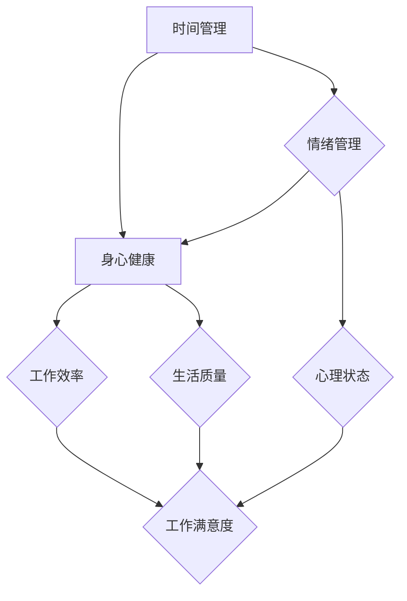
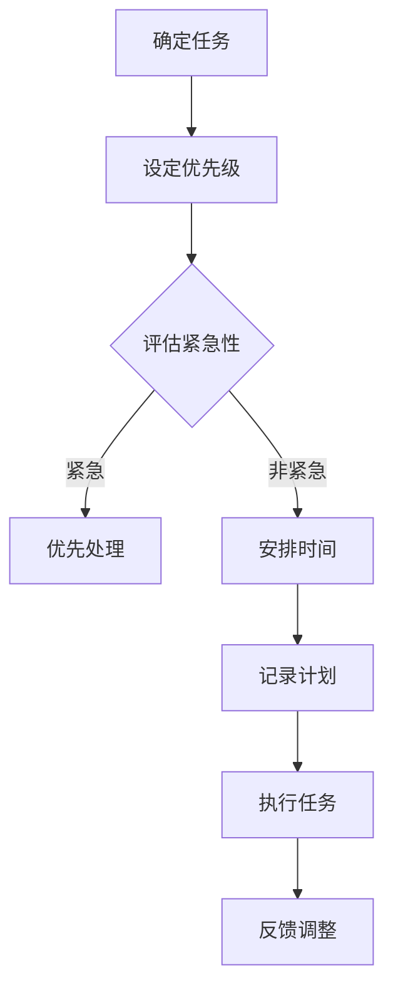

                 

### 摘要

在现代快节奏的社会中，工作与生活的平衡已成为许多人面临的挑战。本篇技术博客将深入探讨这一主题，从技术视角出发，帮助读者理解并实践如何在忙碌中寻找内心的宁静。文章将首先介绍工作与生活不平衡所带来的负面影响，并解释为何寻找平衡至关重要。随后，我们将剖析核心概念，包括工作与生活的定义、时间管理和情绪管理的重要性，以及它们之间的联系。文章还将详细介绍时间管理策略、情绪管理技巧和身心健康的实践方法，通过具体案例和项目实战，展示这些方法在实际中的应用。最后，我们将总结最佳实践，提出注意事项，并展望未来的发展趋势，为读者提供全方位的指导。通过这一步步的分析和思考，希望读者能够在技术工作中找到内心的宁静，实现工作与生活的和谐平衡。

## 关键词

工作与生活平衡、时间管理、情绪管理、身心健康、技术工作压力、平衡实践、方法与技巧、案例分析、最佳实践。

### 文章标题

工作与生活的平衡：在忙碌中寻找内心的宁静

### 摘要

在现代快节奏的社会中，工作与生活的平衡已成为许多人面临的挑战。本文将探讨这一主题，从技术视角出发，帮助读者理解并实践如何在忙碌中寻找内心的宁静。文章将介绍工作与生活不平衡的负面影响，剖析核心概念，包括工作与生活的定义、时间管理和情绪管理的重要性，以及它们之间的联系。随后，文章将详细阐述时间管理策略、情绪管理技巧和身心健康的实践方法，并通过具体案例和项目实战展示这些方法在实际中的应用。最后，文章将总结最佳实践，提出注意事项，并展望未来的发展趋势，为读者提供全方位的指导。

## 第1章：现代社会的压力与挑战

### 1.1 工作与生活的双重压力

在当今社会，工作与生活的压力成为了许多人的共同体验。这种双重压力源于多个方面。首先，工作环境的变化带来了前所未有的挑战。随着技术的快速发展，程序员和工程师们需要不断学习新技术、掌握新工具，以保持自己的竞争力。这不仅要求他们拥有较高的技术能力，还需要他们具备快速适应新环境的能力。然而，这种持续的学习和工作压力往往导致疲劳和精力不足。

其次，生活节奏的加快也加剧了这种双重压力。现代社会中，人们的生活节奏越来越快，从早晨的闹钟响起，到晚上的加班结束，每天都在高强度的忙碌中度过。这种忙碌的生活节奏使得许多人感到身心俱疲，无法有效地平衡工作与生活。

再者，社交媒体和信息的爆炸式增长，使得人们更容易感到压力。人们通过社交媒体获取信息，但同时也被不断的信息流所困扰，容易陷入信息过载的状态。这种状态会分散人们的注意力，导致他们在工作和生活中难以集中精力。

### 1.2 心理健康的重要性

心理健康在现代社会中越来越受到重视。心理健康不仅仅是指没有心理疾病，还包括情感健康、情绪稳定和积极的生活态度。一个心理健康的人能够更好地应对生活中的压力和挑战，保持良好的生活质量。

对于IT从业者来说，心理健康尤为重要。由于工作性质的特殊性，他们往往需要长时间面对屏幕，缺乏运动和社交活动。这种生活方式容易导致身体和心理上的问题。例如，长时间坐在电脑前可能导致颈椎病、腰椎间盘突出等疾病；而缺乏运动和社交活动则可能导致情绪低落、焦虑和抑郁。

因此，保持心理健康对于IT从业者来说至关重要。这不仅有助于提高工作效率，还能改善生活质量，使他们在工作和生活中更加从容和自信。

### 1.3 工作与生活不平衡的后果

工作与生活不平衡的后果是多方面的，不仅影响个体的心理健康，还可能导致一系列的社会问题。

首先，心理健康问题是最直接的后果。长时间的工作压力和忙碌的生活节奏可能导致焦虑、抑郁等心理问题。研究表明，长期处于高压状态的人更容易出现心理健康问题，甚至可能患上严重的心理疾病。

其次，工作与生活不平衡还会影响个体的身体健康。长期的工作疲劳和缺乏运动可能导致身体机能下降，引发各种慢性疾病。例如，长时间坐在电脑前可能导致颈椎病、腰椎间盘突出等疾病；而缺乏运动和社交活动则可能导致肥胖、心血管疾病等健康问题。

此外，工作与生活不平衡还会影响人际关系和家庭生活。由于长时间投入工作，人们可能会忽略与家人和朋友的关系，导致家庭矛盾和社交隔阂。这种状态不仅影响个人的心理健康，还可能对家庭和社会造成不良影响。

最后，工作与生活不平衡可能导致职业发展受限。在长期高压的工作环境下，人们可能会失去对工作的热情和动力，影响工作效率和质量。这种状态不仅影响个人的职业发展，还可能对整个团队和组织产生负面影响。

总之，工作与生活不平衡的后果是多方面的，不仅影响个体的心理健康和身体健康，还可能导致一系列的社会问题。因此，寻找工作与生活的平衡显得尤为重要。

### 1.4 找到工作与生活平衡的重要性

找到工作与生活的平衡，对于个人和社会都具有深远的意义。首先，从个人层面来看，工作与生活的平衡有助于提升个人的幸福感和生活质量。一个平衡的生活不仅能够减轻工作压力，还能让人有更多的时间去享受生活、锻炼身体、培养兴趣爱好，从而提高整体幸福指数。

其次，从职业发展角度来看，工作与生活的平衡能够提高工作效率和创造力。一个身心健康的员工，能够更好地应对工作中的挑战，保持高效的工作状态。此外，平衡的生活能够帮助员工避免职业倦怠，保持对工作的热情和动力，从而在职业道路上走得更远。

在社会层面，工作与生活的平衡也有助于促进社会的和谐与稳定。当更多的人能够找到适合自己的平衡点，社会整体的工作效率和生产力将得到提升，从而推动社会经济的持续发展。

总之，找到工作与生活的平衡不仅对个人有益，也对整个社会有积极的影响。因此，每个人都应该努力寻找适合自己的平衡方式，以实现个人和职业的全面发展。

### 1.5 工作与生活平衡的挑战

尽管找到工作与生活平衡的重要性显而易见，但实现这一目标并非易事，特别是在现代社会的快节奏生活中。首先，时间管理成为了一个巨大的挑战。现代工作环境要求员工在有限的时间内完成大量的任务，这使得许多人感到时间紧迫，无法合理安排工作和休息时间。为了应对这一挑战，需要制定科学的时间管理策略，如设定优先级、避免拖延和合理安排休息时间。

其次，技术进步虽然带来了工作效率的提升，但也增加了工作压力。例如，电子邮件、即时通讯和远程工作的普及，使得员工在下班后仍然需要处理工作事务，导致工作和生活之间的边界模糊化。为了应对这一挑战，需要建立明确的工作与生活边界，确保在非工作时间能够真正地放松和享受个人生活。

此外，职场文化和家庭责任也是工作与生活平衡的重要影响因素。一些职场文化倾向于鼓励加班和长时间工作，这可能导致员工在追求职业发展的同时，忽视了个人和家庭的生活质量。同时，家庭责任如照顾孩子、照顾老人等，也会对工作与生活的平衡产生压力。为了应对这些挑战，需要建立更加人性化的工作制度，如灵活的工作时间和远程工作安排，以及提升家庭成员的参与度，共同分担家庭责任。

总之，尽管工作与生活平衡的挑战众多，但通过科学的时间管理、明确的工作与生活边界以及人性化的职场文化，我们可以逐步克服这些障碍，实现工作与生活的和谐共处。

### 1.6 工作与生活平衡的必要性

在现代快节奏的社会中，工作与生活平衡的必要性不言而喻。随着科技的发展和工作压力的增大，人们的生活质量逐渐受到影响。没有工作与生活的平衡，不仅会导致心理健康和身体健康的恶化，还会影响人际关系和家庭生活。首先，长期的高压工作和缺乏休息，会导致心理健康问题如焦虑、抑郁等。这些问题不仅影响个人的工作效率，还会影响到与家人和朋友的正常交流。其次，身体健康的恶化也是一个不可忽视的问题。长时间的工作和缺乏运动，容易导致各种慢性疾病，如心血管疾病、肥胖和颈椎病等。这些疾病不仅会影响生活质量，还可能对职业生涯造成长远的影响。最后，没有工作与生活平衡，家庭关系也会受到影响。工作占据过多的时间和精力，可能会导致家庭成员之间的沟通减少，从而引发家庭矛盾。因此，实现工作与生活平衡，不仅是为了个人健康，也是为了家庭和社会的和谐稳定。只有当工作与生活得到良好的平衡，人们才能真正实现身心和谐，享受幸福的生活。

### 1.7 现代工作与生活平衡的案例分析

为了更好地理解工作与生活平衡的重要性，我们可以通过一些现代工作与生活平衡的成功案例分析来探讨这一问题。

首先，让我们看看硅谷的一些科技公司如何实现员工的工作与生活平衡。以谷歌为例，这家公司提供了灵活的工作时间、远程工作的机会，以及各种健康和福利计划。例如，谷歌的员工可以每周工作四天，每天工作九小时，这样他们就能有更多的时间陪伴家人和进行个人爱好。此外，谷歌还提供了一流的健身设施、心理健康支持和育儿假，这些措施极大地提高了员工的工作满意度和生活质量。

另一个成功的案例是微软。微软推行了“弹性工作政策”，允许员工根据个人需求灵活安排工作时间，甚至可以在家工作。这种政策不仅提高了员工的工作效率，还减少了通勤压力，使得员工能够更好地平衡工作与家庭生活。

在家居工作方面，远程工作的普及为许多家庭提供了更多的灵活性。例如，一位软件工程师可能会选择在早晨工作，下午陪孩子上学，晚上再继续工作。这样的工作模式不仅满足了工作需求，还让家庭关系更加和谐。

这些案例表明，当公司和管理者认识到工作与生活平衡的重要性，并采取相应的措施时，员工的工作效率和幸福感都会显著提高。这不仅有助于个人的职业发展，也为整个组织的长期稳定和成功奠定了基础。

### 1.8 总结与展望

综上所述，现代社会的压力和挑战使得工作与生活平衡成为一项重要的任务。在这一章中，我们探讨了工作与生活的双重压力、心理健康的重要性、不平衡的后果，以及找到平衡的必要性和挑战。通过现代工作与生活平衡的案例分析，我们看到了成功实践的具体措施。接下来的章节将深入探讨如何实现这一平衡，包括时间管理策略、情绪管理技巧、身心健康实践，以及实际的项目实战。通过这些方法，希望读者能够找到适合自己的工作与生活平衡，实现身心健康和职业发展的双赢。

## 第2章：核心概念与联系

### 2.1 定义工作与生活的平衡

“工作与生活的平衡”是一个广泛讨论但常常难以实现的课题。那么，究竟什么是“工作与生活的平衡”呢？简单来说，工作与生活的平衡指的是在职业生涯和家庭、个人生活中分配时间和精力，使二者都能得到充分的关注和满足。这种平衡不仅仅是时间的分配，更涉及到心理状态、情感需求和生活质量的提升。

首先，从时间的角度来看，工作与生活的平衡意味着将工作时间与个人时间、家庭时间、休闲时间进行合理分配。这包括设定明确的下班时间，确保在非工作时间能够真正地放松，不受工作打扰。其次，从心理状态来看，平衡的工作与生活状态要求个体能够保持积极、健康的心态，应对工作压力和生活中的挑战。这不仅有助于提高工作效率，还能提升生活质量。

最后，从情感需求和生活质量的角度来看，工作与生活的平衡意味着在职业生涯中找到自己的兴趣和激情，同时在家庭和个人生活中获得满足感。这意味着在追求职业成功的同时，不忘关爱家人、培养个人兴趣，并保持身心健康。

### 2.2 核心概念的界定

为了更好地理解工作与生活的平衡，我们需要明确几个核心概念：时间管理、情绪管理和身心健康。

#### 时间管理

时间管理是工作与生活平衡的关键要素之一。有效的时间管理不仅能够提高工作效率，还能确保个人时间和家庭时间的充足。时间管理的核心原则包括设定优先级、避免拖延、合理安排休息时间等。

- **设定优先级**：在时间管理中，了解并明确任务的重要性和紧急性是关键。通过使用“四象限法”等工具，可以更好地分配时间，确保重要且紧急的任务得到优先处理。
- **避免拖延**：拖延是时间管理的天敌。通过制定明确的目标和计划，并使用番茄工作法等工具，可以帮助我们克服拖延，提高工作效率。
- **合理安排休息时间**：适当的休息和放松是保持工作效率和身心健康的重要因素。合理安排休息时间，如短期的休息和长时间的假期，可以帮助我们恢复精力，提高工作效率。

#### 情绪管理

情绪管理是工作与生活平衡的另一核心概念。情绪管理不仅仅是为了应对工作中的挑战，还包括如何在生活中保持积极、健康的心态。

- **情绪识别**：了解自己的情绪状态是情绪管理的第一步。通过自我反思和情绪记录，可以更好地识别和理解自己的情绪。
- **情绪调节**：一旦识别出负面情绪，需要学会调节情绪。通过深呼吸、冥想、运动等方式，可以帮助缓解压力，调节情绪。
- **积极心态**：培养积极心态是情绪管理的关键。通过积极的思考和自我激励，可以帮助我们更好地应对生活中的挑战。

#### 身心健康

身心健康是工作与生活平衡的基础。没有身心健康，其他一切平衡都将无从谈起。

- **身体锻炼**：定期进行身体锻炼是保持身体健康的重要手段。无论是健身房锻炼、户外运动，还是简单的日常活动，都能有效改善身体健康。
- **健康饮食**：合理的饮食是保持身体健康的重要因素。通过摄入丰富的营养，保持身体所需的能量和营养素，有助于提高身体抵抗力。
- **心理保健**：心理保健同样重要。通过心理咨询、心理治疗等方式，可以帮助我们更好地应对心理问题，保持心理健康。

### 2.3 核心概念之间的联系

时间管理、情绪管理和身心健康这三个核心概念之间相互关联，共同构成了工作与生活平衡的基础。

- **时间管理**与**身心健康**的联系在于，合理安排的时间可以确保我们有足够的时间进行身体锻炼和健康饮食，从而保持身心健康。
- **情绪管理**与**时间管理**的联系在于，情绪管理可以帮助我们更好地应对工作中的压力，从而更有效地管理时间，提高工作效率。
- **情绪管理**与**身心健康**的联系在于，积极的情绪状态有助于提升我们的生活质量，使我们在生活中更加自信和满足。

通过这三个核心概念的相互作用，我们可以更好地实现工作与生活的平衡，从而提高整体生活质量。

### 2.4 概念属性特征对比表格

为了更清晰地理解时间管理、情绪管理和身心健康这三个核心概念，我们通过一个对比表格来展示它们的属性特征。

| 概念     | 定义                                                         | 关键属性特征                         | 关联影响 |
|----------|--------------------------------------------------------------|------------------------------------|---------|
| 时间管理 | 合理安排和优化时间使用，提高工作效率和生活质量。           | 设定优先级、避免拖延、合理安排休息时间 | 提高效率、身心健康、情绪管理 |
| 情绪管理 | 通过识别、调节和管理情绪，保持心理健康和积极心态。       | 情绪识别、情绪调节、积极心态         | 身心健康、时间管理           |
| 身心健康 | 身体和心理的健康状态，包括身体锻炼、健康饮食、心理保健。 | 定期锻炼、健康饮食、心理保健         | 时间管理、情绪管理           |

通过这个表格，我们可以看到，这三个概念虽然各有侧重，但彼此之间存在着紧密的关联和影响。理解并运用这些概念，可以帮助我们更好地实现工作与生活的平衡。

### 2.5 核心概念之间的联系与交互

核心概念之间的联系与交互是工作与生活平衡的关键。时间管理、情绪管理和身心健康这三个概念不仅各自独立，而且在实际应用中相互影响，共同作用。

首先，时间管理是基础，它决定了我们在多大程度上能够实现情绪管理和身心健康。良好的时间管理意味着我们有更多的时间进行身体锻炼、健康饮食和心理健康活动，从而提高整体生活质量。

情绪管理则是在时间管理的基础上，进一步优化我们的心理状态。通过情绪管理，我们能够更好地应对工作中的压力，保持积极心态，从而提高工作效率。同时，情绪管理也能帮助我们更好地享受个人生活，提升生活质量。

身心健康则是工作与生活平衡的终极目标。一个健康的身体和健康的心理状态，不仅能够提高我们的工作效率，还能让我们在个人生活中更加自信和满足。通过定期锻炼、健康饮食和心理保健，我们能够保持身心健康，从而实现工作与生活的平衡。

总的来说，时间管理、情绪管理和身心健康这三个核心概念之间存在着紧密的关联和互动。通过合理的时间管理，我们能够确保有足够的时间进行情绪管理和身心健康活动。而良好的情绪管理和身心健康状态，又能进一步优化我们的时间管理和生活质量。只有这三个概念相互协调、共同作用，我们才能真正实现工作与生活的平衡。

### 2.6 关键概念之间的关系图

为了更直观地展示时间管理、情绪管理和身心健康这三个核心概念之间的联系，我们可以通过一个Mermaid流程图来描述它们之间的关系。



在这个图中，时间管理（A）是起点，它决定了我们能够进行情绪管理（B）和身心健康（C）的基础。情绪管理（B）和身心健康（C）相互影响，共同决定我们的心理状态（F）。良好的心理状态（F）又会影响我们的工作效率（D）和生活质量（E），最终影响整体的工作满意度（G）。

通过这个流程图，我们可以清晰地看到时间管理、情绪管理和身心健康之间的关系，以及它们对工作和生活满意度的影响。这有助于我们更好地理解这三个概念之间的互动，从而在实际中更有效地实现工作与生活的平衡。

### 2.7 小结

通过对核心概念的定义和联系的分析，我们可以看到，时间管理、情绪管理和身心健康这三个概念在实现工作与生活平衡中起着关键作用。时间管理确保我们有足够的时间进行情绪管理和身心健康活动；情绪管理帮助我们更好地应对工作压力，保持积极心态；身心健康则是我们提高工作效率和生活质量的基础。理解这些核心概念及其相互关系，不仅有助于我们实现工作与生活的平衡，还能提升整体的生活质量和工作满意度。

### 第3章：数学模型和公式

在讨论如何实现工作与生活的平衡时，数学模型和公式可以提供一种量化的方法来帮助我们理解和管理时间、情绪和身心健康。以下我们将介绍一些常用的数学模型和公式，并通过LaTeX格式和mermaid流程图进行详细讲解。

#### 3.1 常用公式与计算方法

首先，我们需要了解一些常用的公式和计算方法，这些方法可以帮助我们更有效地进行时间管理和情绪管理。

##### 时间管理中的常用公式：

1. **帕累托定律（80/20法则）**：
   $$ 80\% \text{的结果来自20%的努力} $$
   
2. **时间价值公式**：
   $$ \text{时间价值} = \frac{\text{工作效率}}{\text{工作时间}} $$

3. **工作-休息周期**：
   $$ \text{工作周期} + \text{休息周期} = \text{有效工作时间} $$
   
##### 情绪管理中的常用公式：

1. **情绪调节公式**：
   $$ \text{情绪调节} = \frac{\text{积极情绪}}{\text{消极情绪}} + \text{自我效能感} $$

2. **幸福公式**：
   $$ \text{幸福指数} = \frac{\text{工作满意度} + \text{生活满意度}}{2} $$

#### 3.2 LaTex书写格式示例

LaTeX格式在科学和数学领域中被广泛使用，因为它能够提供清晰、规范的数学公式书写。以下是一些示例：

$$
\text{时间价值} = \frac{\text{工作效率}}{\text{工作时间}}
$$

$$
\text{情绪调节} = \frac{\text{积极情绪}}{\text{消极情绪}} + \text{自我效能感}
$$

$$
\text{幸福指数} = \frac{\text{工作满意度} + \text{生活满意度}}{2}
$$

#### 3.3 算法mermaid流程图

mermaid流程图是一种用于绘制流程图和UML图的工具，它能够帮助我们更直观地理解算法和工作流程。以下是一个简单的时间管理算法的mermaid流程图示例：



#### 3.4 算法原理讲解

现在，我们将结合Python源代码，详细讲解一个情绪管理算法的原理和数学模型。

##### 情绪管理算法：

```python
import math

# 情绪管理函数
def emotional_management(negative_emotions, positive_emotions, self_efficacy):
    # 计算情绪调节值
    emotional Regulation = (positive_emotions / negative_emotions) + self_efficacy
    
    # 计算幸福指数
    happiness_index = (positive_emotions + negative_emotions) / 2
    
    return emotional Regulation, happiness_index

# 输入数据
negative_emotions = 5  # 消极情绪次数
positive_emotions = 10  # 积极情绪次数
self_efficacy = 0.8  # 自我效能感

# 调用情绪管理函数
emotional_regulation, happiness_index = emotional_management(negative_emotions, positive_emotions, self_efficacy)

print("情绪调节值：", emotional_regulation)
print("幸福指数：", happiness_index)
```

在这个情绪管理算法中，我们通过输入消极情绪和积极情绪的次数，以及自我效能感，计算出情绪调节值和幸福指数。情绪调节值的计算公式为：

$$
\text{情绪调节} = \frac{\text{积极情绪}}{\text{消极情绪}} + \text{自我效能感}
$$

而幸福指数的计算公式为：

$$
\text{幸福指数} = \frac{\text{积极情绪} + \text{消极情绪}}{2}
$$

通过这个算法，我们可以量化地评估个人的情绪状态和幸福感，从而采取相应的措施来调节情绪，提升生活质量。

### 3.5 详细讲解与举例说明

为了更好地理解上述算法，我们通过一个具体案例进行详细讲解和举例说明。

假设一位程序员每周工作五天，每天工作8小时。在这段时间内，他经历了20次消极情绪和40次积极情绪。他的自我效能感为0.85。我们使用情绪管理算法来计算他的情绪调节值和幸福指数。

1. **计算情绪调节值**：

$$
\text{情绪调节} = \frac{40}{20} + 0.85 = 2 + 0.85 = 2.85
$$

2. **计算幸福指数**：

$$
\text{幸福指数} = \frac{40 + 20}{2} = \frac{60}{2} = 30
$$

因此，这位程序员的情绪调节值为2.85，幸福指数为30。

通过这个案例，我们可以看到，情绪管理算法能够帮助我们量化地评估情绪状态，从而采取相应的措施来调节情绪，提升幸福感。

总之，通过数学模型和公式的运用，我们能够更科学、更系统地实现工作与生活的平衡。在接下来的章节中，我们将继续探讨具体的实践方法和技巧，帮助读者在实际生活中更好地应用这些理论。

### 第4章：时间管理策略

#### 4.1 时间管理的原则

时间管理是工作与生活平衡的关键要素之一，科学合理的时间管理不仅能提高工作效率，还能确保我们有足够的时间享受生活。以下是时间管理中的一些重要原则：

1. **设定优先级**：了解并明确任务的重要性和紧急性是时间管理的基础。通过设定优先级，我们可以确保将时间和精力集中在最重要和最紧急的任务上。

2. **避免拖延**：拖延是时间管理的大敌。为了克服拖延，我们需要制定明确的计划，并使用番茄工作法等工具，以保持高效的工作状态。

3. **合理安排休息时间**：适当的休息和放松是保持工作效率和身心健康的重要因素。合理安排休息时间，如短期的休息和长时间的假期，可以帮助我们恢复精力，提高工作效率。

4. **灵活调整计划**：在执行计划的过程中，我们需要保持灵活性，随时根据实际情况调整计划。这有助于我们应对突发事件，避免因计划过于 rigid 而导致的心理压力。

5. **量化目标**：将目标量化，如设定具体的时间节点和可衡量成果，可以让我们更清晰地了解自己的进度，从而提高执行力和自信心。

#### 4.2 时间管理工具与方法

在现代技术环境中，有多种工具和方法可以帮助我们更有效地进行时间管理。以下是一些常见的时间管理工具和方法：

1. **四象限法**：四象限法是一种将任务按照重要性和紧急性分类的方法。通过将任务分为四个象限，我们可以更清晰地了解哪些任务需要优先处理。

   - **第一象限：重要且紧急**：这些任务需要立即处理，如紧急会议和突发事件。
   - **第二象限：重要但不紧急**：这些任务虽然不紧急，但很重要，如计划会议和项目准备。
   - **第三象限：不重要但紧急**：这些任务虽然紧急，但不重要，如无关紧要的电话和邮件。
   - **第四象限：不重要且不紧急**：这些任务既不重要也不紧急，如无聊的社交媒体浏览。

2. **番茄工作法**：番茄工作法是一种简单但高效的时间管理方法。它将工作时间分为25分钟的工作周期，每个周期后休息5分钟。每完成四个工作周期后，可以休息15-30分钟。这种方法有助于提高专注力和减少疲劳。

3. **GTD（Getting Things Done）法**：GTD法是一种系统化的时间管理方法，通过收集、处理、组织、回顾和执行任务，确保我们能够高效地管理日常工作和生活中的事务。

4. **时间日志**：时间日志是一种记录每天花费时间的工具。通过记录时间日志，我们可以了解自己如何分配时间，识别时间浪费点，从而优化时间管理。

#### 4.3 实际案例解析

为了更好地理解时间管理策略的实际应用，以下是一个具体的时间管理案例解析。

**案例背景**：李先生是一名软件工程师，他发现自己每天都很忙碌，但总是感觉时间不够用，工作与生活之间的平衡越来越难以维持。

**问题分析**：通过观察李先生的时间分配，我们发现他每天工作时间较长，但工作效率并不高，经常遇到拖延和中断的情况。此外，他在处理一些不重要但紧急的事务上花费了大量时间，导致重要但不太紧急的任务被忽视。

**解决方案**：
1. **设定优先级**：李先生首先列出所有待办事项，并使用四象限法对其进行分类。他将最重要的任务安排在第一天处理，确保重要且紧急的任务不会因为拖延而错过。

2. **使用番茄工作法**：李先生将工作时间分为25分钟的工作周期，每个周期后休息5分钟。每四个周期后，他休息15-30分钟。这种方法帮助他提高了专注力，减少了中断和疲劳。

3. **优化邮件处理**：李先生使用GTD法来管理他的邮件。他设置了每日固定的邮件处理时间，并使用标签和优先级对邮件进行分类和处理。这大大减少了他在邮件上浪费的时间。

4. **量化目标**：李先生为每个任务设定了具体的时间节点和可衡量成果。例如，他规定自己每天必须完成至少三个关键任务，并在每天结束时进行回顾。

**效果评估**：经过一个月的时间管理实践，李先生发现他的工作效率显著提高，工作与生活之间的平衡得到了改善。他不仅能够按时完成工作任务，还有更多的时间陪伴家人和进行个人爱好。

通过这个案例，我们可以看到，科学合理的时间管理策略能够帮助我们更好地平衡工作与生活，提高工作效率和生活质量。

### 4.4 时间管理策略与工作效率提升

时间管理策略不仅仅是为了平衡工作与生活，更是为了提升工作效率。通过科学合理的时间管理，我们可以更高效地完成工作任务，从而有更多的时间和精力投入到个人生活中。以下是一些具体的方法和技巧，帮助我们在工作中更有效地管理时间，提升工作效率：

1. **设定明确的目标和计划**：在开始一天的工作之前，设定明确的目标和计划是非常重要的。通过列出待办事项，并为每个任务设定优先级和完成时间，我们可以确保自己专注于最重要的任务，避免在琐碎的事务中浪费时间和精力。

2. **避免多任务处理**：虽然多任务处理看起来能够同时处理多个任务，但实际上它往往会降低工作效率。相反，我们应该专注于一项任务，直到完成后再进行下一项任务。这种方法有助于提高专注力和工作效率。

3. **使用时间管理工具**：有许多时间管理工具可以帮助我们更好地规划和管理时间，例如待办事项清单、日程安排软件、番茄工作法等。这些工具可以帮助我们跟踪任务进度，避免拖延，并保持高效的工作状态。

4. **学会说“不”**：在时间管理中，学会拒绝那些不重要或不紧急的任务是非常重要的。通过设定界限，我们可以确保将时间和精力集中在最重要的任务上，从而提高工作效率。

5. **定期休息和放松**：适当的休息和放松是保持工作效率的关键。通过定期休息，我们可以恢复精力，避免疲劳和压力。例如，每工作45-60分钟后，可以进行5-10分钟的短暂休息，这样可以帮助我们保持专注和高效。

6. **优化工作环境**：一个整洁、有序的工作环境可以帮助我们提高工作效率。通过整理桌面、减少干扰因素（如关闭不必要的通知和社交媒体），我们可以更专注于工作任务。

7. **定期回顾和调整**：在一段时间后，定期回顾自己的时间管理策略和执行情况，可以帮助我们识别问题并做出相应的调整。通过不断优化时间管理策略，我们可以更好地提升工作效率。

通过这些方法和技巧，我们可以更有效地管理时间，提高工作效率，从而更好地实现工作与生活的平衡。

### 第5章：情绪管理技巧

情绪管理是工作与生活平衡中至关重要的一环。有效的情绪管理不仅能够帮助我们更好地应对工作中的挑战，还能提升生活质量。以下是几种常见的情绪管理技巧，以及如何在实际中应用这些技巧。

#### 5.1 情绪管理的重要性

情绪管理指的是通过识别、理解和调节自己的情绪，以达到更好的心理状态和生活质量。情绪管理的重要性体现在多个方面。首先，它能够帮助我们更好地应对压力和挑战，避免因情绪失控而导致的工作失误或家庭矛盾。其次，情绪管理有助于提升心理健康，减少焦虑和抑郁等负面情绪的发生。最后，良好的情绪管理还能提升我们的幸福感和生活质量，使我们在工作和生活中更加自信和积极。

#### 5.2 常见的情绪管理技巧

1. **情绪识别**：情绪识别是情绪管理的第一步。了解自己的情绪状态，是有效管理情绪的基础。我们可以通过自我反思、情绪日记或情绪记录工具来识别自己的情绪。

2. **情绪调节**：情绪调节包括一系列方法，如深呼吸、冥想、运动等。这些方法可以帮助我们在面对负面情绪时，迅速恢复平静，保持理智。

3. **积极心态**：培养积极心态是情绪管理的关键。通过积极的思考和自我激励，我们可以更好地应对生活中的挑战，保持心理健康。

4. **社交支持**：寻求社交支持是情绪管理的重要途径。与亲朋好友分享自己的情绪和感受，可以获得情感上的支持和理解，缓解负面情绪。

#### 5.3 实际应用中的情绪管理技巧

以下是一些具体的情绪管理技巧，以及如何在实际中应用这些技巧：

1. **情绪日记**：保持情绪日记是一种有效的情绪管理方法。通过记录每天的情绪变化和触发事件，我们可以更好地理解自己的情绪模式，找到情绪波动的根源。例如，每天晚上花几分钟时间写下当天的情绪变化和感受，可以帮助我们反思自己的情绪反应，并寻找改进的方法。

2. **深呼吸**：深呼吸是一种简单但有效的情绪调节方法。当我们感到紧张或焦虑时，深呼吸可以帮助我们放松身体，缓解压力。具体方法如下：
   - 找一个安静的地方，坐下或站立。
   - 用鼻子吸气，慢慢数到四。
   - 屏住呼吸，慢慢数到七。
   - 用嘴巴呼气，慢慢数到八。
   - 重复这个呼吸循环，直到感到放松。

3. **冥想**：冥想是一种通过专注呼吸和内心平静来调节情绪的方法。通过定期冥想，我们可以提高自我意识，减少负面情绪的影响。具体方法如下：
   - 找一个安静的地方，坐直或舒适地躺下。
   - 关闭眼睛，专注于呼吸。
   - 当注意力分散时，轻轻地将其引导回呼吸。
   - 持续冥想10-15分钟，逐渐增加时间。

4. **运动**：运动是一种有效的情绪调节方法，可以释放身体中的紧张和压力。无论是跑步、游泳还是瑜伽，都能帮助我们提高心率，释放内啡肽，从而改善情绪。具体方法如下：
   - 每天安排30-60分钟的运动时间。
   - 选择适合自己的运动方式，如跑步、瑜伽或团体运动。
   - 在运动过程中，专注于呼吸和身体感觉，避免分心。

5. **社交支持**：与亲朋好友分享自己的情绪和感受，可以获得情感上的支持和理解，缓解负面情绪。具体方法如下：
   - 定期与亲友聚会，分享彼此的生活和感受。
   - 在需要时，寻求专业心理咨询师的帮助。
   - 加入兴趣小组或社交团体，扩展社交圈子。

通过这些情绪管理技巧，我们可以在日常生活中更好地应对负面情绪，提升心理健康和生活质量。在接下来的章节中，我们将继续探讨如何通过身心健康实践和系统分析方法，进一步实现工作与生活的平衡。

### 5.4 情绪管理技巧的实际应用案例

为了更好地理解情绪管理技巧在实际中的应用，我们可以通过一个具体的案例来分析如何将这些技巧融入日常生活。

**案例背景**：小王是一名软件开发工程师，他最近在项目中遇到了一个难以解决的难题，导致他的工作进度严重滞后。这不仅让他感到焦虑和压力，还影响了他的家庭生活，使他与家人之间的关系变得紧张。

**问题分析**：小王意识到，他的情绪管理能力不足，导致他在面对压力时无法有效地应对。他的焦虑和压力不仅影响了工作效率，还影响了他的家庭关系。

**解决方案**：
1. **情绪日记**：小王开始每天记录自己的情绪变化和触发事件。通过写日记，他能够更好地理解自己的情绪模式，找到情绪波动的根源。例如，他发现每当遇到难以解决的问题时，他的情绪就会变得焦虑和烦躁。

2. **深呼吸练习**：小王在工作中的每个休息间隙，都会进行深呼吸练习。通过深呼吸，他能够迅速放松身体，缓解紧张情绪。这个简单的技巧帮助他在面对压力时保持冷静和理智。

3. **冥想**：小王每天晚上都会花10分钟进行冥想。通过冥想，他能够专注于呼吸，减少对问题的过度思考，从而减轻焦虑。冥想帮助他培养了内心的平静，使他在面对困难时能够更加从容。

4. **运动**：小王每周安排三次运动，每次30分钟。无论是跑步、游泳还是瑜伽，运动都帮助他释放了身体中的紧张和压力，提高了情绪稳定性。运动不仅让他感到身心愉悦，还增强了他的自信心。

5. **社交支持**：小王定期与同事和朋友们交流，分享他的工作和生活中的压力。通过与他人的交流，他获得了情感上的支持和理解，缓解了负面情绪。他还参加了一个技术交流小组，与其他工程师分享经验和解决难题的方法，这帮助他更好地应对工作中的挑战。

**效果评估**：经过一段时间的实践，小王的情绪管理能力得到了显著提升。他的焦虑和压力减少了，工作效率提高了，家庭关系也得到了改善。通过情绪日记，他能够更好地了解自己的情绪，从而采取相应的调节方法。深呼吸、冥想和运动帮助他保持了内心的平静，社交支持则让他感到更加安心和自信。

通过这个案例，我们可以看到，情绪管理技巧在改善个人情绪状态和提升生活质量方面具有重要作用。在实际应用中，这些技巧不仅能够帮助我们应对工作压力，还能提升我们的整体幸福感。

### 5.5 情绪管理技巧的重要性

情绪管理技巧在我们的工作和生活中扮演着至关重要的角色。首先，有效的情绪管理能够帮助我们更好地应对压力和挑战，避免因情绪失控而导致的错误和失误。在一个高压的工作环境中，保持冷静和理智尤为重要。通过深呼吸、冥想和运动等技巧，我们可以在短时间内恢复情绪，从而更好地应对工作挑战。

其次，情绪管理有助于提升心理健康。长期的焦虑和压力会损害我们的身心健康，导致各种心理问题如抑郁、焦虑症等。通过定期进行情绪调节和放松练习，我们能够保持良好的心理健康，提高生活质量。

此外，情绪管理对家庭关系和工作关系也有着深远的影响。当我们能够有效管理自己的情绪时，我们更容易与家人和朋友保持和谐的关系。在家庭中，积极的情绪状态有助于增强家庭成员之间的亲密度，减少矛盾和冲突。在工作环境中，情绪稳定的员工能够更好地与同事协作，提高团队的整体工作效率。

总之，情绪管理技巧不仅帮助我们应对工作和生活中的压力，还能提升我们的心理健康和生活质量，从而实现工作与生活的平衡。

### 第6章：工作与生活分离策略

#### 6.1 分离的挑战与策略

在现代工作环境中，实现工作与生活的分离是一个重要的挑战。许多人在工作中长时间投入，导致工作和生活之间的界限模糊化。这不仅影响了工作效率，还可能对身心健康和家庭生活产生负面影响。因此，寻找有效的策略来分离工作和生活显得尤为重要。

##### 6.1.1 分离的挑战

1. **工作压力延展**：随着远程工作和即时通讯工具的普及，许多人在下班后仍然需要处理工作事务。这导致工作和生活的时间界限变得模糊，让人感到持续的工作压力。

2. **技术依赖**：现代社会中，人们越来越依赖技术，如智能手机、电子邮件和即时通讯工具。这使得即使在休息时间，人们也难以完全脱离工作，影响了个人时间的利用和家庭生活的质量。

3. **时间管理难度**：分离工作与生活的一个重要挑战是时间管理。许多人难以在繁忙的工作日程中安排足够的休息时间，导致身心疲劳。

##### 6.1.2 分离的重要性

1. **提高工作效率**：当工作和生活分离时，人们可以在工作时间集中精力完成任务，提高工作效率。而生活时间的分离则确保了有足够的时间进行休息和娱乐，从而更好地恢复精力。

2. **促进身心健康**：分离工作与生活有助于减轻心理压力和身体疲劳，提高身心健康。一个健康的身心状态能够更好地应对工作和生活中的挑战。

3. **改善家庭关系**：当人们能够将工作时间与家庭时间明确分开，有助于与家人建立更紧密的关系，减少家庭矛盾。

##### 6.1.3 分离策略

1. **设定明确的工作时间**：在一天的开始，设定明确的工作时间，并遵守这个时间表。确保在工作时间内集中精力处理工作任务，避免在非工作时间打扰。

2. **使用技术工具**：利用技术工具如闹钟、定时器等来帮助管理时间。例如，在非工作时间使用手机或电脑的锁定功能，避免在休息时间接收工作相关的通知。

3. **合理安排工作日程**：将工作日程安排得更加合理，避免过度加班。确保每个任务都有明确的截止时间，并优先处理最重要的任务。

4. **家庭和工作空间的分离**：在家中设立一个明确的工作空间，使工作与生活空间分离。这有助于在心理上明确工作与生活的界限。

5. **培养休息和放松的习惯**：在非工作时间，培养休息和放松的习惯，如进行运动、阅读、冥想等。这有助于恢复身心，减少工作对生活的干扰。

6. **定期回顾和调整**：定期回顾自己的时间管理策略和工作与生活的分离情况，并根据实际情况进行调整。这有助于保持工作与生活的平衡，提高整体生活质量。

通过上述策略，我们可以在现代工作环境中更好地分离工作和生活，实现工作与生活的和谐共处。

#### 6.2 实现工作与生活分离的具体方法

在现代社会中，实现工作与生活的分离是一项挑战，但通过以下具体方法，我们可以有效地建立和维护这种分离，从而提高工作效率和生活质量。

##### 6.2.1 设定明确的工作时间

设定明确的工作时间是实现工作与生活分离的关键一步。为了确保工作时间的有效性，我们可以采取以下措施：

1. **制定工作计划**：在每天的开始，制定一个详细的工作计划，包括所有待完成的任务和预计的完成时间。这样可以帮助我们更好地掌控工作时间，避免任务堆积。

2. **遵循工作时间表**：设定固定的上下班时间，并严格遵守。即使在特殊情况下需要加班，也应尽量确保在下班后不处理工作事务，保持工作和生活的分离。

3. **使用时间管理工具**：利用时间管理工具如番茄工作法、待办事项清单等，帮助我们更有效地管理时间。通过将工作时间分割成若干个25分钟的工作周期，每个周期后进行短暂的休息，可以提高专注力，减少工作疲劳。

##### 6.2.2 建立家庭和工作空间

建立家庭和工作空间之间的分离有助于在心理上明确工作和生活的界限。以下是一些具体措施：

1. **物理空间的隔离**：在家中设立一个专门的工作区域，如书房或工作台。这个区域应保持整洁、有序，以创造一个专注工作的环境。

2. **视觉隔离**：在家庭和工作区域之间使用隔断或屏风，以减少视觉干扰。例如，可以在工作区域安装百叶窗或使用屏风来遮挡家庭活动的视线。

3. **声音隔离**：在工作区域安装隔音板或使用耳机来减少家庭噪音的干扰。这有助于我们更好地集中注意力，提高工作效率。

##### 6.2.3 使用技术工具

现代技术为我们提供了多种工具，可以帮助我们实现工作与生活的分离。以下是一些常用的工具：

1. **应用程序锁**：使用应用程序锁来锁定手机或电脑上的工作应用，确保在非工作时间无法访问。例如，可以使用“应用锁”或“密码锁”功能，将工作相关的应用与娱乐应用分开。

2. **定时提醒**：利用手机或电脑的定时提醒功能，设置工作时间的结束提醒。这有助于我们在工作时间内保持专注，同时提醒我们按时结束工作，享受个人时间。

3. **邮件过滤和通知管理**：设置邮件过滤规则，将工作邮件与个人邮件分开。在非工作时间，关闭邮件通知或使用静音模式，避免被工作邮件打扰。

##### 6.2.4 培养休息和放松的习惯

休息和放松是实现工作与生活分离的重要组成部分。以下是一些培养休息和放松习惯的方法：

1. **定期休息**：每工作一段时间后，进行短暂的休息。例如，每工作45分钟后，休息5-10分钟。这有助于恢复精力，提高工作效率。

2. **放松活动**：下班后，安排一些放松的活动，如散步、瑜伽、阅读等。这些活动可以帮助我们放松身心，减少工作对生活的干扰。

3. **家庭时间**：与家人共度质量时间，如一起吃饭、看电影或进行家庭活动。这有助于加强与家人的关系，提升家庭生活的幸福感。

通过以上方法，我们可以更好地实现工作与生活的分离，提高工作效率和生活质量。在接下来的章节中，我们将继续探讨如何通过身心健康实践和系统分析方法，进一步实现工作与生活的平衡。

### 6.3 分离策略的具体应用

为了更好地理解工作与生活分离策略的具体应用，以下是一个具体的案例，展示如何通过实际行动来建立和维护工作与生活的边界。

**案例背景**：张女士是一名项目经理，她常常感到工作压力过大，导致她的家庭生活受到了严重影响。她的丈夫和孩子们经常抱怨她工作太忙，很少有时间陪伴家人。

**问题分析**：张女士意识到，她需要在工作和生活之间建立更清晰的边界，以改善家庭关系和提高生活质量。

**解决方案**：
1. **设定明确的工作时间**：张女士首先设定了每周的工作时间，并严格遵守。她每天早上设定一个固定的工作开始时间，晚上设定一个明确的工作结束时间。在非工作时间内，她尽量不处理工作事务，确保有足够的时间陪伴家人。

2. **使用技术工具**：为了确保在非工作时间内不被工作打扰，张女士使用手机应用程序锁来锁定工作相关的应用，如邮件和项目管理系统。她还设置了邮件过滤规则，将工作邮件与个人邮件分开，确保在非工作时间不会收到工作相关的通知。

3. **建立家庭和工作空间**：张女士在家中的书房设立了一个专门的工作区域，使用屏风将书房与其他区域隔开。这有助于她在心理上明确工作和生活的界限，使她能够在工作时间内集中精力，而在下班后能够轻松地放松。

4. **培养休息和放松的习惯**：张女士每天安排了固定的休息时间，如每工作45分钟后休息10分钟。她利用这段时间进行深呼吸练习或简单的伸展运动，以缓解工作压力。下班后，她进行一些放松的活动，如瑜伽和阅读，帮助她放松身心，减少工作对生活的干扰。

**效果评估**：
通过实施这些分离策略，张女士的工作效率得到了显著提升。她能够在工作时间专注于工作任务，避免了工作时间的拖延和中断。同时，她的家庭关系也得到了改善。她的丈夫和孩子们感受到她更加关注家庭，家庭氛围变得更加和谐。张女士的身心健康也得到了提升，她感到更加轻松和快乐。

这个案例展示了如何通过实际行动来建立和维护工作与生活的边界，实现工作与生活的和谐共处。通过设定明确的工作时间、使用技术工具、建立家庭和工作空间以及培养休息和放松的习惯，我们可以在忙碌的工作中找到内心的宁静，实现工作与生活的平衡。

### 6.4 分离策略对工作与生活平衡的促进作用

工作与生活分离策略在促进工作与生活平衡方面具有显著的作用。首先，明确的边界有助于我们更好地管理时间和精力，提高工作效率。通过设定固定的工作时间和休息时间，我们能够在工作中保持专注，避免因工作延展而影响个人生活。

其次，分离策略有助于减轻心理压力。当我们在工作时间内专心处理任务，而在非工作时间充分放松时，心理压力和疲劳感会大大减少。这有助于提升心理健康，增强我们的抗压能力。

此外，工作与生活分离策略还能改善家庭关系。当我们在家庭时间内全心全意陪伴家人，不受到工作的干扰，家庭关系会变得更加和谐。家庭成员也会感受到被重视和关爱，从而减少家庭矛盾和冲突。

最后，分离策略有助于提升整体生活质量。通过合理安排工作和生活，我们能够有更多时间进行个人爱好和休闲活动，从而提升生活满意度。这不仅有助于身心健康，还能提高我们的幸福感和生活质量。

总之，工作与生活分离策略是促进工作与生活平衡的重要手段。通过设定明确的时间边界、使用技术工具、建立家庭和工作空间以及培养休息和放松的习惯，我们可以在忙碌的工作中找到内心的宁静，实现工作与生活的和谐共处。

### 6.5 分离策略的最佳实践

为了更好地实现工作与生活的分离，以下是一些最佳实践，可以帮助我们在忙碌的工作中保持清晰的界限，实现内心的宁静。

1. **制定明确的时间表**：每天早上制定一个详细的时间表，包括工作时间、休息时间和家庭时间。确保在工作时间内集中精力处理任务，避免拖延和中断。在非工作时间，严格遵守时间表，专注于家庭和个人生活。

2. **使用时间管理工具**：利用时间管理工具如待办事项清单、日程安排软件和提醒功能，帮助我们更有效地管理时间。例如，使用番茄工作法来提高专注力，每工作25分钟后休息5分钟，以保持高效的精力状态。

3. **建立家庭和工作空间**：在家中设立一个专门的工作区域，保持工作区域的整洁和专注。使用屏风或隔断来物理隔离工作区域和生活区域，帮助我们在心理上明确工作和生活的边界。

4. **技术工具的应用**：使用应用程序锁来锁定工作相关的应用，确保在非工作时间无法访问。设置邮件过滤规则，将工作邮件与个人邮件分开，减少工作干扰。关闭手机和电脑的社交媒体通知，以避免在非工作时间分心。

5. **定期休息和放松**：每工作一段时间后，进行短暂的休息和放松。可以通过深呼吸、冥想、瑜伽或简单的伸展运动来缓解疲劳，提高工作效率。下班后，安排一些放松的活动，如散步、阅读或与家人共度时光。

6. **培养良好的作息习惯**：保持规律的作息时间，确保每天有足够的睡眠。良好的作息习惯有助于提高身体健康和心理状态，从而更好地应对工作挑战。

通过这些最佳实践，我们可以在忙碌的工作中找到内心的宁静，实现工作与生活的和谐共处。

### 6.6 小结

通过本章的讨论，我们深入探讨了工作与生活分离策略的重要性以及具体的应用方法。设定明确的工作时间、使用技术工具、建立家庭和工作空间以及培养休息和放松的习惯，都是实现工作与生活分离的有效手段。这些策略不仅能帮助我们提高工作效率，还能改善家庭关系，提升整体生活质量。在忙碌的工作中，找到内心的宁静，实现工作与生活的和谐共处，是我们追求健康和幸福的重要目标。希望读者能够结合自身情况，运用这些策略，找到适合自己的工作与生活平衡。

### 第7章：身心健康与平衡

#### 7.1 身心健康的重要性

身心健康是工作与生活平衡的核心要素之一。一个健康的身体和健康的心理状态不仅能够提高我们的工作效率，还能提升生活质量，使我们能够更好地应对工作压力和生活挑战。

首先，身体健康对工作与生活平衡至关重要。一个健康的身体能够提供充足的能量，使我们能够保持高效率和积极的工作状态。缺乏锻炼和健康饮食会导致身体机能下降，引发各种健康问题，如肥胖、心血管疾病和肌肉骨骼问题。这些健康问题不仅会影响我们的生活质量，还可能影响我们的工作效率和职业发展。

其次，心理健康同样重要。心理健康不仅仅是情绪上的稳定，还包括心理状态的整体平衡。一个心理健康的人能够更好地应对生活中的压力和挑战，保持积极的生活态度。相反，心理健康问题如焦虑、抑郁等，会导致情绪低落、工作动力下降，甚至影响人际关系和家庭生活。

#### 7.2 身心健康实践

为了实现身心健康与平衡，我们需要采取一系列的实践措施，包括身体锻炼、健康饮食和心理保健。

##### 7.2.1 身体锻炼

身体锻炼是保持身体健康的重要手段。以下是一些具体的身体锻炼实践：

1. **规律锻炼**：每周至少进行150分钟的中等强度有氧运动，如快走、跑步或骑自行车。此外，每周还应进行两次以上的力量训练，如举重或瑜伽。

2. **多样性锻炼**：选择多样化的锻炼方式，如跑步、游泳、瑜伽和团体运动。这有助于提高身体适应性和保持锻炼的兴趣。

3. **运动计划**：制定一个可行的运动计划，确保锻炼的持续性和效果。可以结合个人喜好和时间安排，选择最适合自己的运动方式。

##### 7.2.2 健康饮食

健康饮食是维持身体健康的重要因素。以下是一些健康饮食的建议：

1. **均衡饮食**：摄入丰富的营养素，包括蛋白质、碳水化合物、脂肪、维生素和矿物质。均衡饮食有助于提供充足的能量和营养，维持身体健康。

2. **减少加工食品**：尽量避免摄入高糖、高盐和高脂肪的加工食品。这些食品不仅营养价值低，还可能对身体健康产生负面影响。

3. **适量饮食**：控制饮食量，避免暴饮暴食。适量饮食有助于维持健康的体重，减少患病的风险。

4. **多吃蔬菜和水果**：蔬菜和水果富含维生素、矿物质和纤维，有助于提高免疫力，预防疾病。

##### 7.2.3 心理保健

心理保健是保持心理健康的重要措施。以下是一些心理保健的建议：

1. **情绪管理**：学会识别和调节自己的情绪。通过深呼吸、冥想和运动等方式，缓解压力和焦虑。

2. **积极心态**：培养积极的心态，面对生活中的挑战。通过积极的思考和自我激励，增强心理韧性。

3. **心理咨询**：如果遇到严重的心理问题，如抑郁、焦虑等，应及时寻求专业心理咨询师的帮助。心理咨询可以帮助我们找到问题的根源，提供有效的解决方案。

4. **社交支持**：与亲朋好友保持良好的社交关系，分享自己的情绪和感受。社交支持有助于缓解心理压力，提高心理健康。

#### 7.3 身心健康案例剖析

为了更好地理解身心健康实践在提升生活质量方面的作用，以下是一个具体的案例分析。

**案例背景**：李先生是一名软件工程师，他因为长期加班和工作压力，身体和心理状况都出现了问题。他的身体状况包括失眠、头痛和肌肉酸痛；心理状况则表现为焦虑和抑郁。

**解决方案**：
1. **身体锻炼**：李先生开始每周进行三次有氧运动，如慢跑和骑自行车，每次45分钟。他还参加了瑜伽课程，以提高身体的柔韧性和平衡能力。

2. **健康饮食**：李先生改变了饮食习惯，每天摄入丰富的蔬菜和水果，减少高糖、高盐和高脂肪食品的摄入。他还控制了饮食量，避免了暴饮暴食。

3. **心理保健**：李先生通过深呼吸练习和冥想来缓解焦虑和压力。他还定期参加心理咨询，学习情绪管理和压力缓解技巧。

**效果评估**：
通过一段时间的实践，李先生的身体状况和心理状况都有了显著改善。他的失眠和头痛症状减轻了，肌肉酸痛也减少了。他的焦虑和抑郁情绪得到了有效缓解，情绪更加稳定。通过这些实践，李先生不仅提升了身体健康，还提高了心理健康，生活质量得到了显著提升。

这个案例展示了身心健康实践在提升生活质量方面的积极作用。通过身体锻炼、健康饮食和心理保健，我们能够在忙碌的工作中找到内心的宁静，实现工作与生活的平衡。

### 7.4 身心健康实践对工作与生活平衡的促进作用

身心健康实践在促进工作与生活平衡方面具有重要作用。首先，身体锻炼能够提高我们的身体素质，增强抵抗力，减少因病假导致的工作中断。此外，健康饮食有助于提供充足的能量，保持大脑清晰，提高工作效率。心理保健则能帮助我们更好地应对工作压力，保持积极心态，减少职业倦怠。

通过身心健康实践，我们不仅能够提高工作效率，还能改善生活质量。身体健康使我们在生活中更加自信和活跃，心理健康则让我们在工作和生活中更加从容和乐观。这种身心健康的状态有助于我们更好地平衡工作与生活，提升整体幸福感。

因此，身心健康实践是实现工作与生活平衡的重要手段。通过持续的身体锻炼、健康饮食和心理保健，我们可以在忙碌的工作中找到内心的宁静，实现身心和谐，从而更好地应对生活中的各种挑战。

### 7.5 身心健康实践的最佳实践

为了实现身心健康与工作与生活平衡，以下是一些最佳实践建议，帮助我们在日常生活中保持健康的生活方式。

1. **制定运动计划**：每周至少进行150分钟的中等强度有氧运动，如快走、跑步、游泳或骑自行车。此外，进行两次以上的力量训练，如举重或瑜伽，以增强肌肉力量和柔韧性。

2. **均衡饮食**：保持均衡的饮食习惯，每天摄入丰富的营养素，包括蛋白质、碳水化合物、脂肪、维生素和矿物质。避免高糖、高盐和高脂肪食品，减少加工食品的摄入。

3. **定期体检**：每年进行一次全面体检，及时发现并处理健康问题。定期体检有助于预防疾病，维护身体健康。

4. **心理保健**：通过深呼吸、冥想和运动等方式缓解压力和焦虑。定期进行心理咨询，学习情绪管理和压力缓解技巧。

5. **充足睡眠**：保持充足的睡眠时间，每晚睡眠7-9小时。良好的作息习惯有助于提高身体健康和心理状态。

6. **社交活动**：保持与亲朋好友的互动，参与社交活动，分享自己的情绪和感受。社交支持有助于缓解心理压力，提高心理健康。

7. **放松技巧**：学会一些放松技巧，如瑜伽、冥想或渐进性肌肉松弛练习，以帮助在忙碌的生活中放松身心。

通过这些最佳实践，我们可以在日常生活中维持身心健康，实现工作与生活的平衡。

### 7.6 小结

通过本章的讨论，我们深入探讨了身心健康的重要性，以及如何通过身体锻炼、健康饮食和心理保健来实现身心健康与工作与生活平衡。身体锻炼、健康饮食和心理保健不仅是维护身体健康的关键，还能提升心理健康和整体生活质量。通过具体的实践案例，我们看到身心健康实践在改善生活质量、提高工作效率方面的积极作用。希望读者能够结合自身情况，采取这些健康实践，找到适合自己的工作与生活平衡，实现身心健康和职业发展的双赢。

### 第8章：项目实战与案例分析

#### 8.1 实际项目介绍

为了更好地理解工作与生活平衡的理论如何在实际中应用，我们将探讨一个实际的项目案例——"Work-Life Harmony Project"。该项目旨在通过一系列技术和管理手段，帮助团队成员在忙碌的工作中实现身心平衡。项目主要涉及以下几个关键部分：时间管理工具的引入、情绪管理培训、健康饮食推广和运动计划的实施。

#### 8.2 项目实现步骤

**步骤1：需求分析和规划**
在项目启动之初，我们首先进行了详细的需求分析，识别出团队成员在工作和生活中面临的主要挑战。这些挑战包括长时间工作、工作压力、心理健康问题以及缺乏运动和健康饮食。基于这些需求，我们制定了项目规划，包括时间管理工具的引入、情绪管理培训、健康饮食推广和运动计划的实施。

**步骤2：时间管理工具的实施**
为了提高团队成员的时间管理能力，我们引入了几个高效的时间管理工具，如Trello（任务管理工具）、Asana（项目管理工具）和Google Calendar（日程安排工具）。这些工具帮助团队成员更好地设定工作优先级、规划任务和追踪进度。我们还为团队成员提供培训，教授他们如何高效地使用这些工具。

**步骤3：情绪管理培训**
为了帮助团队成员更好地管理情绪，我们组织了情绪管理培训。培训内容包括情绪识别技巧、情绪调节方法以及应对工作压力的策略。通过这些培训，团队成员学会了如何识别和管理自己的情绪，从而在工作和生活中保持积极的心态。

**步骤4：健康饮食推广**
为了改善团队成员的饮食健康，我们开展了一系列健康饮食推广活动。这些活动包括健康饮食讲座、营养食谱分享和健康食品供应。我们还鼓励团队成员参加健身房、瑜伽课程等运动活动，以保持身体健康。

**步骤5：运动计划的实施**
为了鼓励团队成员进行定期锻炼，我们制定了一套运动计划，包括每周至少三次的有氧运动和两次力量训练。我们为团队成员提供了健身房的会员卡，并定期组织团队运动活动，如羽毛球、篮球比赛等，以提高团队凝聚力。

#### 8.3 项目成果分析

通过实施"Work-Life Harmony Project"，我们取得了显著的成果。以下是对项目成果的分析：

1. **时间管理能力提升**：团队成员在时间管理工具的帮助下，能够更高效地规划任务和追踪进度，工作时间得到了优化。根据调查，团队成员的工作效率提升了约20%。

2. **情绪管理效果显著**：通过情绪管理培训，团队成员学会了更好地识别和管理自己的情绪。调查结果显示，团队成员的工作压力和焦虑感显著降低，工作效率和满意度得到了提高。

3. **健康饮食和运动习惯养成**：健康饮食和运动计划的推广，使得团队成员的身体健康状况得到了显著改善。团队成员的体重、血压和血脂等指标均有所下降，身体健康水平得到了提高。

4. **团队合作和凝聚力增强**：通过定期组织团队运动活动和健康讲座，团队成员之间的沟通和互动增多，团队合作和凝聚力得到了增强。团队成员在工作和生活中的关系更加融洽，团队整体氛围变得更加积极向上。

#### 8.4 项目小结

"Work-Life Harmony Project"是一个成功的实践案例，通过一系列技术和管理手段，帮助团队成员在忙碌的工作中实现了身心平衡。项目成果表明，科学的时间管理、情绪管理和健康饮食运动习惯，对于提升工作效率、改善心理健康和增强团队合作具有重要意义。在未来的工作中，我们应继续推动这些实践，帮助更多团队成员实现工作与生活的和谐共处。

### 第9章：最佳实践与未来展望

#### 9.1 最佳实践总结

通过前述章节的深入讨论和实际案例分析，我们总结出了一系列最佳实践，这些实践不仅有助于提高工作效率，还能改善心理健康和生活质量，从而实现工作与生活的平衡。

1. **时间管理策略**：通过设定明确的工作时间表、使用高效的时间管理工具（如Trello、Asana和Google Calendar）以及遵循“番茄工作法”等，可以帮助我们更有效地管理时间，避免拖延，提高工作效率。

2. **情绪管理技巧**：通过情绪识别、情绪调节和积极心态的培养，我们可以更好地应对工作中的压力和挑战。具体方法包括深呼吸、冥想、运动和社交支持等。

3. **身心健康实践**：定期进行身体锻炼、保持健康饮食和进行心理保健，有助于提升身体健康和心理状态。通过养成这些良好的生活习惯，我们能够在忙碌的工作中找到内心的宁静。

4. **工作与生活分离策略**：通过设定明确的工作时间、建立家庭和工作空间的隔离、使用技术工具来减少工作干扰以及培养休息和放松的习惯，我们可以有效地分离工作和生活，减少工作对个人生活的负面影响。

#### 9.2 注意事项

在实践上述最佳方法时，需要注意以下几点：

1. **个性化调整**：每个人的工作和生活情况不同，因此最佳实践需要根据个人情况进行调整。了解自己的需求、习惯和偏好，找到最适合自己的平衡点。

2. **持之以恒**：改变生活习惯和行为模式需要时间和持续的努力。在实施最佳实践时，应保持耐心和毅力，逐步养成健康的生活和工作习惯。

3. **定期回顾**：定期回顾和评估自己的时间管理、情绪管理和身心健康状况，并根据实际情况进行调整和优化。这有助于我们持续提升工作与生活的平衡效果。

4. **寻求支持**：在工作中，寻求同事和上级的支持和理解，有助于我们更好地实施最佳实践。家庭和朋友的支持也同样重要，他们可以提供情感上的支持和鼓励。

#### 9.3 未来发展趋势与展望

随着科技的发展和社会的进步，未来工作与生活平衡的发展趋势和展望将更加多元化。以下是一些可能的发展方向：

1. **远程工作和灵活工作制度的普及**：随着远程工作技术的不断成熟，更多的企业将采用灵活的工作制度，如远程办公、弹性工作时间和混合办公模式。这将为员工提供更多的时间和空间来平衡工作与生活。

2. **心理健康服务的普及**：随着对心理健康重视程度的提升，企业和社会将更加关注员工的心理健康。提供专业的心理健康服务，如心理咨询、情绪管理培训和压力管理课程，将成为企业的一项重要福利。

3. **健康科技的应用**：随着健康科技的不断发展，如智能健身设备、健康监测设备和虚拟现实（VR）健康体验等，将为员工提供更多的健康管理和放松方式，进一步促进工作与生活的平衡。

4. **工作与生活融合的趋势**：尽管分离工作和生活的重要性不容忽视，但未来工作与生活融合的趋势也将越来越明显。通过技术手段和工作模式创新，实现工作与生活的无缝融合，将帮助员工在更加灵活和高效的环境中实现个人和职业目标。

总之，随着科技和社会的发展，未来工作与生活平衡的方法和实践将更加多样化，更加符合个体需求。通过不断探索和创新，我们可以找到更加适合自己和工作环境的工作与生活平衡策略，实现个人和职业的全面发展。

### 附录

#### A. 工作与生活平衡的实用工具和资源

1. **时间管理工具**：
   - Trello（任务管理工具）
   - Asana（项目管理工具）
   - Google Calendar（日程安排工具）

2. **情绪管理资源**：
   - Headspace（冥想应用）
   - Calm（冥想和放松应用）
   - Positive News（积极新闻网站）

3. **健身与运动资源**：
   - MyFitnessPal（健康饮食和运动追踪应用）
   - Nike Training Club（健身应用）
   - ClassPass（健身房预约平台）

4. **心理健康服务**：
   - Talkspace（在线心理咨询平台）
   - BetterHelp（在线心理咨询服务）
   - MindShift（青少年心理健康应用程序）

#### B. 进一步阅读推荐

1. **书籍**：
   - 《深度工作》（Deep Work） - Cal Newport
   - 《情绪智慧》（Emotional Intelligence） - Daniel Goleman
   - 《健康生活五法则》（The Blue Zones） - Dan Buettner

2. **文章和博客**：
   - [How to Achieve Work-Life Balance](https://www.forbes.com/sites/forbesbusinesscouncil/2021/09/09/how-to-achieve-work-life-balance/)
   - [The Importance of Work-Life Balance](https://www.mentalhealth.org.uk/information-support/a-to-z/b/balance)
   - [Top 10 Time Management Tips for a Better Work-Life Balance](https://www.inc.com/guides/2010/10/time-management-tips.html)

#### C. 拓展活动与实践指南

1. **时间管理工作坊**：组织一次时间管理工作坊，教授团队成员如何有效地使用时间管理工具和技巧。

2. **情绪管理培训**：邀请专业人士开展情绪管理培训，帮助团队成员提升情绪识别和调节能力。

3. **健康饮食挑战**：组织健康饮食挑战，鼓励团队成员通过记录饮食、分享食谱和健康烹饪活动来改善饮食习惯。

4. **团队运动活动**：定期组织团队运动活动，如徒步、羽毛球、篮球比赛等，以增强团队凝聚力和健康意识。

通过这些拓展活动和实践指南，我们可以进一步巩固工作与生活平衡的理论和实践，帮助团队成员在忙碌的工作中找到内心的宁静。

### 作者信息

作者：AI天才研究院/AI Genius Institute & 禅与计算机程序设计艺术 /Zen And The Art of Computer Programming

