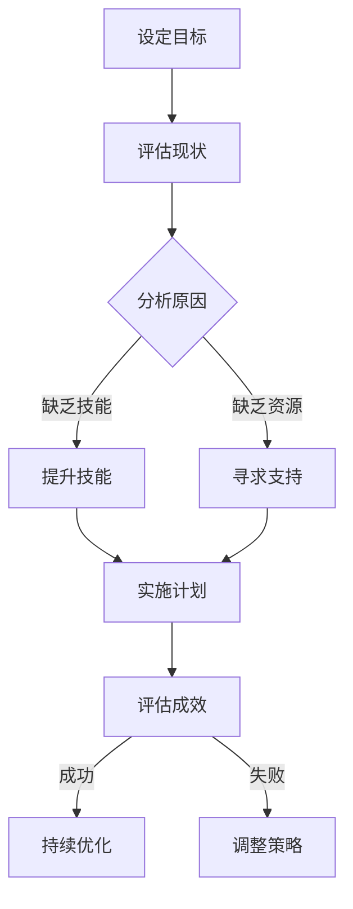

                 

### 文章标题：工作的意义：在职场中寻找自我价值

> **关键词**：工作意义、自我价值、职场、心理健康、职业发展

> **摘要**：本文将探讨在现代职场环境中，如何通过理解工作的意义来寻找自我价值。文章分为多个部分，分别介绍职场环境的现状、自我价值的定义与内涵、工作中寻找自我价值的策略、职场心理健康、职业生涯规划以及最佳实践和注意事项。通过逐步分析，希望能够帮助读者在职场中找到并实现自我价值。

### 背景介绍

在现代职场环境中，越来越多的人开始关注工作的意义。这不仅是因为经济压力的增加，更是因为人们意识到，工作不仅仅是谋生的手段，更是实现自我价值和成就感的途径。随着社会的进步和科技的发展，职场环境发生了巨大的变化。人们的工作方式、工作内容以及工作与生活的平衡，都在不断演变。这种变化，使得工作的意义变得更加多样化和复杂化。

#### 核心概念术语说明

- **工作意义**：工作对个人而言所具有的内在价值，包括成就感、自我实现和幸福感。
- **自我价值**：个人对自己所具有的价值的认知和认同，通常与自我认同、自尊和自我实现密切相关。
- **职场**：个人从事工作、实现职业发展的场所。

#### 问题背景

在当前的职场环境中，人们面临诸多挑战，如高度的工作压力、职业发展的不确定性、工作与生活的平衡问题等。这些问题，往往导致人们感到迷茫和无力，难以在工作中找到自我价值。因此，本文旨在探讨如何在职场中理解工作的意义，从而寻找自我价值。

#### 问题描述

如何在职场中找到工作的意义，实现自我价值，是一个复杂且个体化的问题。每个人的背景、价值观和目标都不同，因此，找到适合自己的工作意义和实现自我价值的方法也有所不同。

#### 问题解决

通过理解核心概念、分析职场环境、探讨工作与生活的平衡、制定职业生涯规划以及培养职场心理健康，可以帮助我们在职场中找到自我价值。

#### 边界与外延

- **边界**：本文主要探讨在职场上寻找自我价值的问题，不包括非职场环境中的自我价值实现。
- **外延**：本文涉及的职场环境，主要是指现代社会中的企业、机构、组织等。

#### 概念结构与核心要素组成

- **工作意义**：包括成就感、自我实现和幸福感。
- **自我价值**：包括自我认同、自尊和自我实现。
- **职场**：包括工作环境、职业发展机会和人际关系。

### 核心概念与联系

在探讨如何在职场上寻找自我价值之前，我们需要明确几个核心概念：工作意义、自我价值和工作与生活的平衡。

#### 工作意义

工作意义是个人对工作所具有的内在价值的认知。它不仅仅是谋生的手段，更是实现自我价值、成就感和社会认同的途径。工作意义可以分为以下几个方面：

1. **成就感**：通过完成工作任务，实现个人目标和职业发展，获得的满足感和自豪感。
2. **自我实现**：通过工作，实现个人的潜能和价值观，实现自我认同和自我实现。
3. **幸福感**：工作带给个人的内心满足感和幸福感。

#### 自我价值

自我价值是个人对自己所具有的价值的认知和认同。它通常与自我认同、自尊和自我实现密切相关。自我价值的实现，可以帮助个人在职场中找到自我价值，增强自信心和成就感。

1. **自我认同**：个人对自己的认同和肯定，包括个人的价值观、性格特点和能力。
2. **自尊**：个人对自己的尊重和认可，通常与自我价值密切相关。
3. **自我实现**：通过工作，实现个人的潜能和价值观，实现自我认同和自我实现。

#### 工作与生活的平衡

工作与生活的平衡，是指在工作与家庭、个人兴趣和时间之间找到一个平衡点，以实现个人和职业的双重成功。工作与生活的平衡，对于在职场上寻找自我价值至关重要。

1. **工作**：工作不仅是一种职业发展，更是一种生活方式和人生价值的体现。
2. **生活**：包括家庭、个人兴趣、休闲和健康，是个人全面发展的重要组成部分。
3. **平衡**：通过合理安排时间、设定优先级和有效管理，实现工作与生活的平衡。

#### 概念属性特征对比表格

| 概念 | 定义 | 属性特征 | 对比 |
| --- | --- | --- | --- |
| 工作意义 | 工作对个人而言所具有的内在价值 | 成就感、自我实现、幸福感 | 与自我价值密切相关，是自我价值实现的基础 |
| 自我价值 | 个人对自己所具有的价值的认知和认同 | 自我认同、自尊、自我实现 | 与工作意义密切相关，是工作意义实现的前提 |
| 工作与生活的平衡 | 在工作与家庭、个人兴趣和时间之间找到一个平衡点 | 工作、生活、平衡 | 是实现工作意义和自我价值的重要保障 |

#### ER实体关系图架构

```mermaid
erDiagram
    A[工作意义] ||--|{ B[自我价值] }| A
    B ||--|{ C[工作与生活的平衡] }| B
```

- **工作意义**与**自我价值**之间存在关联，工作意义是自我价值实现的基础。
- **自我价值**与**工作与生活的平衡**之间存在关联，自我价值是实现工作与生活平衡的前提。

通过以上对核心概念的分析和ER实体关系图的构建，我们可以更清晰地理解这些概念之间的联系，为后续讨论如何在职场上寻找自我价值打下基础。

### 算法原理讲解

在探讨如何在职场上寻找自我价值时，我们可以将这个过程视为一种算法，通过一系列步骤和策略，逐步实现自我价值的提升。以下是这个算法的原理和实现方法。

#### 算法流程图



#### 算法原理

1. **设定目标**：明确自己的职业目标和个人发展目标，这是寻找自我价值的第一步。
2. **评估现状**：分析当前的职业发展和个人能力的状况，找出与目标之间的差距。
3. **分析原因**：找出造成现状的原因，是缺乏技能、资源，还是其他因素。
4. **提升技能**：根据分析结果，有针对性地提升自己的专业技能和通用技能。
5. **寻求支持**：在需要时，寻求同事、导师或职业顾问的支持和帮助。
6. **实施计划**：制定详细的行动计划，并按照计划执行。
7. **评估成效**：定期评估自己的职业发展和个人能力提升的成效。
8. **持续优化**：根据评估结果，持续调整和优化自己的职业发展和个人提升计划。
9. **调整策略**：如果在实施过程中遇到失败，需要及时调整策略，重新评估目标和计划。

#### 数学模型和公式

为了更好地理解这个算法，我们可以将其转化为一个数学模型。以下是一个简单的数学模型，用于描述这个算法：

$$
\text{目标实现度} = \text{当前能力值} \times \text{计划执行度} \times \text{支持度} \times \text{成效评估度}
$$

- **目标实现度**：衡量职业目标和自我价值实现的程度。
- **当前能力值**：个人当前的职业能力和技能水平。
- **计划执行度**：按照计划执行的程度。
- **支持度**：获得的支持和帮助的程度。
- **成效评估度**：对成效的评估结果。

#### 举例说明

假设一个软件工程师小王，他的职业目标是成为团队的核心成员，并在五年内晋升为技术经理。以下是他的具体实现过程：

1. **设定目标**：小王明确了自己的职业目标，即成为团队的核心成员和技术经理。
2. **评估现状**：小王评估了自己的现状，发现自己在技术能力和团队协作方面还有待提高。
3. **分析原因**：小王分析了现状，认为自己在技术深度和广度上需要进一步提升，同时在团队协作和沟通技巧上也需要加强。
4. **提升技能**：小王制定了详细的提升计划，包括学习新的技术、参加团队协作和沟通技巧的培训。
5. **寻求支持**：小王向团队中的资深成员请教技术问题，同时也参加了公司组织的沟通技巧培训。
6. **实施计划**：小王按照计划执行，不断提升自己的技术能力和团队协作能力。
7. **评估成效**：小王定期评估自己的提升情况，发现自己在技术深度和团队协作方面都有了显著的进步。
8. **持续优化**：小王根据评估结果，调整了自己的学习计划和目标，并持续优化自己的职业发展路径。
9. **调整策略**：如果在某个阶段遇到失败，小王会及时调整策略，重新评估目标和计划。

通过这个例子，我们可以看到，通过设定明确的目标、评估现状、提升技能、寻求支持、实施计划和评估成效，可以有效地提升职业能力和实现自我价值。

通过以上对算法原理的讲解，我们可以更好地理解如何在职场上寻找自我价值。接下来，我们将进一步探讨工作中寻找自我价值的策略，帮助读者在实际职场中应用这些原理。

### 工作中寻找自我价值的策略

在明确了工作的意义和自我价值的定义后，我们需要探讨一些具体的策略，以帮助我们在职场中实现自我价值。以下是几个关键策略：

#### 设定职业目标

设定职业目标是寻找自我价值的第一个步骤。一个明确的职业目标可以帮助我们更好地规划职业生涯，明确方向和路径。以下是设定职业目标的一些步骤：

1. **自我分析**：了解自己的兴趣、价值观、优势和劣势。可以通过自我反思、咨询他人或进行职业性格测试来帮助分析。
2. **市场调研**：了解当前职场的需求和趋势，找到与自身兴趣和能力相匹配的职业路径。
3. **目标设定**：根据自我分析和市场调研的结果，设定具体的职业目标。这些目标可以是长期的，如成为某个领域的专家，也可以是短期的，如完成某个项目或获得某个认证。

#### 提升职业技能

提升职业技能是寻找自我价值的另一个关键步骤。以下是一些提升职业技能的方法：

1. **学习新技能**：通过参加培训课程、在线学习平台或自学，掌握新的技术或知识。
2. **实践应用**：将所学知识应用于实际工作中，通过实践来巩固和提升技能。
3. **获取认证**：通过获得专业认证，提高自己的专业水平和市场竞争力。
4. **不断更新**：科技和行业在不断变化，需要不断学习新知识、新技术，以保持竞争力。

#### 职场沟通与人际关系的处理

职场沟通和人际关系的处理对于实现自我价值也至关重要。以下是一些建议：

1. **主动沟通**：主动与同事、领导和客户沟通，建立良好的工作关系。
2. **有效倾听**：倾听他人的意见和需求，理解他们的立场和观点。
3. **积极合作**：与同事和团队协作，共同完成任务，提高工作效率和质量。
4. **建立网络**：通过参加行业活动、社交聚会等，建立和维护职业网络，扩大人脉资源。

#### 职场心理健康

职场心理健康是寻找自我价值的重要因素。以下是一些维护职场心理健康的方法：

1. **自我认知**：了解自己的情绪和需求，学会情绪管理，避免情绪波动影响工作和生活。
2. **合理规划**：合理安排工作时间和休息时间，避免过度劳累和疲劳。
3. **积极心态**：保持积极乐观的心态，面对挑战和困难时，能够保持冷静和坚定。
4. **寻求支持**：在遇到压力和困难时，及时寻求家人、朋友或专业人士的支持和帮助。

#### 持续学习与个人成长

持续学习与个人成长是实现自我价值的重要保障。以下是一些建议：

1. **自我提升**：通过阅读、参加培训、参与项目等方式，不断提升自己的知识和技能。
2. **反思总结**：定期反思自己的工作和学习，总结经验教训，找到改进的方向。
3. **设定目标**：设定具体的个人成长目标，并制定实现目标的计划和时间表。
4. **寻求反馈**：主动寻求他人的反馈和建议，了解自己的优势和不足，不断改进和提升。

通过以上策略，我们可以在职场中逐步实现自我价值。设定职业目标、提升职业技能、处理职场沟通和人际关系、维护职场心理健康、持续学习和个人成长，这些策略相辅相成，共同帮助我们在职场中找到并实现自我价值。

### 职场心理健康与自我价值的平衡

在职场中，心理健康与自我价值的实现是相辅相成的。一个健康的心理状态有助于我们更好地理解和实现自我价值，而自我价值的实现又可以增强我们的心理健康。以下是几个关键点，帮助我们实现职场心理健康与自我价值的平衡。

#### 职场压力与自我价值的关系

职场压力是现代社会中普遍存在的问题，它可能来源于工作负荷、职业竞争、人际关系等多个方面。这种压力如果得不到有效管理，可能会导致焦虑、抑郁等心理问题，从而影响自我价值的实现。

1. **工作负荷**：过多的工作任务和过大的工作压力，可能会导致我们感到焦虑和无力，难以实现自我价值。
2. **职业竞争**：在职场中，竞争是不可避免的。然而，过度的竞争可能导致我们产生自卑和焦虑，影响自我价值的认同。
3. **人际关系**：职场人际关系复杂，处理好同事、领导和下属之间的关系，需要我们具备一定的沟通和协调能力，否则可能会产生矛盾和冲突，影响心理健康。

#### 增强职场心理韧性的方法

增强职场心理韧性，可以帮助我们更好地应对职场压力，实现自我价值。以下是一些有效的方法：

1. **自我认知**：了解自己的情绪和需求，学会情绪管理，避免情绪波动影响工作和生活。
2. **积极心态**：保持积极乐观的心态，面对挑战和困难时，能够保持冷静和坚定。
3. **时间管理**：合理安排工作时间和休息时间，避免过度劳累和疲劳。
4. **寻求支持**：在遇到压力和困难时，及时寻求家人、朋友或专业人士的支持和帮助。
5. **心理放松**：通过冥想、瑜伽、阅读等方式，缓解心理压力，保持心理健康。

#### 职场心理健康的重要性

职场心理健康不仅仅关乎个人的幸福感和生活质量，它还对工作效率、团队合作和职业发展产生深远影响。

1. **工作效率**：一个心理健康的人，通常能够更好地集中注意力，提高工作效率和质量。
2. **团队合作**：心理健康有助于建立和谐的人际关系，增强团队合作能力。
3. **职业发展**：心理健康的人更容易设定并实现职业目标，实现自我价值的提升。

#### 实现职场心理健康与自我价值的平衡

为了实现职场心理健康与自我价值的平衡，我们需要采取一系列措施：

1. **设定合理目标**：根据自己的能力和兴趣，设定合理的职业目标，避免过度追求完美和成功，造成心理压力。
2. **有效沟通**：与同事、领导和下属保持有效沟通，建立良好的职场关系，减少冲突和误解。
3. **自我调节**：学会自我调节情绪，通过运动、休息等方式缓解工作压力，保持心理健康。
4. **持续学习**：通过不断学习和提升技能，增强职业竞争力，实现自我价值的提升。
5. **寻求专业帮助**：在遇到心理问题时，及时寻求专业心理咨询师的帮助，解决心理困扰。

通过以上措施，我们可以在职场中实现心理健康与自我价值的平衡，从而更好地实现个人价值和职业发展。

### 职场自我价值的实现与成长

在职场中，实现自我价值不仅是为了获得成就感，更是为了个人和职业的长期成长。以下是几个关键点，帮助我们在职场中实现自我价值并实现个人成长。

#### 职场成功与自我价值的实现

职场成功与自我价值的实现密切相关。职场成功不仅仅体现在职位晋升和收入增加上，更重要的是在职业成就感和个人价值的实现上。以下是几个实现职场成功和自我价值的策略：

1. **设定明确的目标**：明确自己的职业目标，包括短期和长期的目标。这些目标应与个人的兴趣、价值观和职业发展方向相一致。
2. **不断提升技能**：通过学习新技能、参加培训课程、获取专业认证等方式，不断提升自己的职业技能和知识水平。
3. **积极参与项目**：积极参与公司或团队的重要项目，通过实际工作来锻炼和提升自己的能力和经验。
4. **建立良好的工作关系**：与同事、领导和下属建立良好的工作关系，通过团队合作实现共同目标。

#### 持续学习与个人成长

持续学习与个人成长是实现自我价值的关键。以下是一些建议：

1. **自我反思**：定期反思自己的工作和学习，总结经验教训，找出改进的方向。
2. **阅读和学习**：通过阅读专业书籍、参加线上课程、参加行业研讨会等方式，不断学习和更新知识。
3. **拓展技能**：学习新的技能和知识，特别是与当前或未来职业发展相关的技能。
4. **设定个人成长目标**：设定具体的个人成长目标，并制定实现目标的计划和时间表。

#### 职业生涯规划与自我价值的持续提升

职业生涯规划是实现自我价值的重要工具。通过合理的职业生涯规划，我们可以更好地实现自我价值，并实现个人和职业的长期成长。以下是职业生涯规划的一些步骤：

1. **自我评估**：评估自己的兴趣、价值观、优势和劣势，明确自己的职业目标和发展方向。
2. **市场调研**：了解当前职场的需求和趋势，找到与自身兴趣和能力相匹配的职业路径。
3. **设定目标**：根据自我评估和市场调研的结果，设定具体的职业目标，包括短期和长期的目标。
4. **制定计划**：制定实现目标的详细计划，包括学习、工作、职业发展等方面的计划。
5. **持续评估和调整**：定期评估自己的职业发展情况，根据评估结果调整职业生涯规划。

#### 实现自我价值的实战案例分析

以下是一个实现自我价值的实战案例分析：

**案例背景**：李华是一名软件工程师，他在一家大型科技公司工作。他希望通过提升自己的技能和参与重要项目，实现职业晋升和个人价值的提升。

**案例分析**：

1. **设定目标**：李华设定了短期目标，即成为团队的核心成员，并在两年内晋升为高级工程师。
2. **提升技能**：李华通过自学和参加培训课程，学习了新的编程语言和技术框架，提升了自己的技术水平。
3. **参与项目**：李华积极参与公司的项目，通过实际工作锻炼和提升自己的能力和经验。
4. **建立人脉**：李华通过积极参与公司和行业活动，建立了广泛的职业网络，扩大了人脉资源。
5. **反思总结**：李华定期反思自己的工作和学习，总结经验教训，找出改进的方向。

**结果**：通过以上措施，李华在两年内成功晋升为高级工程师，实现了自己的职业目标，同时也提升了个人价值。

通过以上实战案例分析，我们可以看到，通过设定明确的目标、不断提升技能、积极参与项目、建立人脉和反思总结，可以在职场中实现自我价值，并实现个人和职业的长期成长。

### 职场中寻找自我价值的误区与解决

在职场中，许多人可能会陷入一些寻找自我价值的误区，这些误区不仅会影响个人的职业发展，还可能对心理健康造成负面影响。以下是一些常见的误区及解决方法：

#### 误区一：追求完美

许多人在职场中追求完美，希望每一次工作都能做到尽善尽美。然而，这种追求往往会给自己带来巨大的压力，导致焦虑和挫折感。

**解决方法**：

1. **设定合理的目标**：设定具体、可行的目标，避免过度追求完美，造成不必要的压力。
2. **学会接受不完美**：接受工作不可能总是完美的，学会在合理的时间内完成任务，并对自己有所宽容。
3. **分阶段实施**：将大目标分解为小目标，分阶段实施，逐步提升。

#### 误区二：过分依赖外部评价

有些人过分依赖外部评价，将自己的价值完全寄托在别人的认可上。这种做法往往导致内心的不稳定，难以找到真正的自我价值。

**解决方法**：

1. **自我评估**：定期进行自我评估，了解自己的优点和不足，建立自信。
2. **设定个人目标**：根据自己的兴趣和优势设定职业目标，而不是完全依赖外部评价。
3. **关注内在成就**：关注自己在工作中的内在成就和进步，而不是只关注外在的认可。

#### 误区三：忽视个人心理健康

在职场中，许多人为了追求职业成功，忽视了个人心理健康。长期的心理压力可能导致焦虑、抑郁等心理问题，影响工作效率和生活质量。

**解决方法**：

1. **定期休息**：确保充足的休息时间，避免过度劳累。
2. **寻求支持**：在遇到心理问题时，及时寻求家人、朋友或专业人士的支持和帮助。
3. **培养健康习惯**：保持健康的生活习惯，如规律作息、健康饮食和适量运动。

#### 误区四：职业路径单一

有些人认为自己必须按照固定的职业路径发展，否则就无法实现自我价值。这种观念往往限制了职业发展的可能性。

**解决方法**：

1. **开放心态**：保持开放的心态，接受不同的职业发展路径，积极探索新的机会。
2. **多元发展**：在职业发展中，不仅仅追求单一的路径，可以尝试多种职业角色和岗位，丰富自己的经验和技能。
3. **持续学习**：通过不断学习和提升技能，为自己的职业发展打开更多可能性。

通过识别和解决这些误区，我们可以更有效地在职场中寻找自我价值，实现个人和职业的长期发展。

### 职场中的道德与伦理

在职场中，道德与伦理是我们行为和决策的重要指南，不仅关系到个人的声誉和职业发展，也影响到团队协作和组织文化的建设。以下从几个方面探讨职场中的道德与伦理问题。

#### 职场道德的重要性

职场道德是指在工作中遵循的基本道德原则和规范，包括诚信、责任、尊重、公正和透明等。良好的职场道德有助于维护组织的正常运转，促进团队合作，提高工作效率，同时也能够增强个人的职业声誉和自我价值。

1. **诚信**：诚信是职场道德的核心，包括诚实、真实和守承诺。一个诚信的职场环境，可以增强员工的信任感，减少内耗，提高工作效率。
2. **责任**：责任感是职场中不可或缺的品质，意味着对自己的行为和决策负责，对工作结果负责，对同事和团队负责。
3. **尊重**：尊重他人是职场道德的基本要求，包括尊重他人的意见、文化和隐私。尊重他人不仅能够建立良好的职场关系，还能够营造一个和谐的工作环境。
4. **公正**：公正是职场道德的重要组成部分，包括对待同事公平、公正地分配资源和工作机会，以及公正地处理工作问题。
5. **透明**：透明是指在决策和沟通中保持信息的公开和透明，避免信息不对称和暗箱操作。

#### 职场伦理的挑战

尽管职场道德对于个人的职业发展和组织的稳定至关重要，但在实际工作中，我们常常会遇到一些伦理挑战：

1. **利益冲突**：在职场中，个人利益和组织利益有时会发生冲突，如何平衡两者之间的利益，是一个重要的伦理问题。
2. **竞争压力**：职场竞争激烈，有时为了取得优势，可能会忽视伦理道德，如窃取商业机密、诋毁竞争对手等。
3. **职场霸凌**：职场霸凌是职场伦理的一个严重问题，包括言语侮辱、工作上的不公正对待等，对受害者的心理健康和工作积极性产生负面影响。
4. **信息泄露**：在信息化时代，如何保护客户和公司的隐私信息，避免信息泄露，是一个重要的伦理挑战。

#### 遵守职场道德与提升自我价值

遵守职场道德不仅是对自己的要求，也是提升自我价值的途径：

1. **树立良好的职业形象**：通过遵守职场道德，树立良好的职业形象，赢得同事和领导的尊重和信任。
2. **增强职业竞争力**：良好的职业道德和职业素养，可以提高个人的职业竞争力，使自己脱颖而出。
3. **实现个人价值**：在遵守职场道德的过程中，实现自我价值，找到工作的意义和成就感。

#### 实践中的道德与伦理问题

以下是一个关于职场道德与伦理问题的实际案例：

**案例背景**：张华是一名软件工程师，他在一家创业公司工作。公司最近开发了一款新产品，但由于资源紧张，公司决定在关键代码部分使用开源软件，并在没有注明来源的情况下直接使用。

**案例分析**：

1. **道德问题**：使用未经授权的开源软件，侵犯了他人的知识产权，违反了道德和法律规范。
2. **解决方案**：张华可以选择向管理层提出建议，建议公司遵守开源协议，注明来源并捐赠部分收益给开源社区。

通过这个案例，我们可以看到，在职场中，遵守道德和伦理规范，不仅是对自己的要求，也是对组织和社会的责任。遵守职场道德，能够帮助我们实现自我价值，同时为职场发展创造一个更加公平、和谐的环境。

### 职场中的多样化与包容性

在职场中，多样化与包容性是促进创新、提升团队协作和实现自我价值的重要因素。以下从几个方面探讨多样化与包容性的价值及其对自我价值的实现的影响。

#### 多样化的价值

多样化是指在职场中存在不同性别、种族、文化、年龄、经验和技能的员工。多样化能够带来以下价值：

1. **创新与创意**：不同背景和经验的员工，能够从不同的角度思考问题，提出创新的解决方案，促进产品的创新和改进。
2. **更全面的视野**：多样化的团队能够从不同的文化和社会背景中汲取经验，获得更全面的视野，避免因单一视角导致的盲点。
3. **增强团队协作**：多样化的团队能够更好地理解和适应不同文化背景的同事，增强团队协作能力和团队凝聚力。

#### 包容性的重要性

包容性是指在职场中，尊重和欢迎不同背景和观点的员工，为每个人提供一个公平和包容的工作环境。包容性的重要性体现在：

1. **减少偏见和歧视**：包容性能够减少职场中的偏见和歧视，确保每个人都能在一个平等的环境中工作，不受歧视和不公平待遇。
2. **提升员工满意度**：一个包容性的工作环境，能够提升员工的满意度和忠诚度，降低员工流失率。
3. **促进个人成长**：包容性能够鼓励员工表达自己的观点和意见，促进个人成长和职业发展。

#### 在多样化环境中提升自我价值

在多样化环境中，员工可以通过以下方式提升自我价值：

1. **增强适应性**：在多样化环境中，员工需要适应不同的文化、观点和沟通方式，这种适应性有助于提升个人在职场中的竞争力。
2. **展示领导力**：在多样化团队中，展示领导力和团队合作精神，可以帮助员工在职场中脱颖而出，提升自我价值。
3. **不断学习与成长**：通过不断学习和提升自己的技能和知识，适应多样化环境的需求，可以更好地实现个人价值。

#### 案例分析

以下是一个关于多样化与包容性的案例分析：

**案例背景**：某科技公司致力于打造一个多元化、包容性的工作环境。公司员工来自不同的国家、拥有不同的文化背景，公司在招聘和培训中注重多样性和包容性。

**案例分析**：

1. **多样化招聘**：公司在招聘过程中，注重多元化的背景和经验，确保团队具有多样化的视角和技能。
2. **培训与支持**：公司为员工提供多样化的培训，包括文化敏感性培训、跨文化沟通技巧等，帮助员工适应多样化的工作环境。
3. **包容性政策**：公司制定了一系列包容性政策，包括尊重员工的宗教信仰、提供灵活的工作安排等，确保每个员工都能在一个公平、包容的环境中工作。

**结果**：通过多样化与包容性的努力，公司员工的满意度显著提升，团队协作能力增强，公司的创新能力和市场竞争力也显著提高。员工在多样化环境中，通过展示领导力和不断学习，实现了个人价值和职业发展。

通过以上分析和案例，我们可以看到，多样化与包容性在职场中具有重要的价值，能够促进团队协作、创新和个人成长，帮助员工实现自我价值。

### 职场中的自我价值与团队协作

在职场中，团队协作是实现个人和团队目标的重要途径，也是提升自我价值的重要方式。通过有效的团队协作，个人可以在工作中获得成就感和自我实现，同时为团队的成功做出贡献。

#### 团队协作的重要性

团队协作是指团队成员共同合作，以实现共同目标和任务的过程。以下是团队协作的一些重要性：

1. **提高工作效率**：团队协作可以充分利用每个成员的技能和知识，提高工作效率和质量。
2. **促进知识共享**：团队协作过程中，成员之间可以互相学习和分享经验，促进知识的共享和传播。
3. **增强团队凝聚力**：通过团队合作，成员之间建立信任和合作关系，增强团队凝聚力，形成积极向上的团队文化。
4. **提升创新力**：多样化的团队可以提供不同的视角和思路，激发创新思维，促进创新和改进。

#### 在团队中体现自我价值

在团队中体现自我价值，可以通过以下几个方面实现：

1. **发挥个人优势**：了解自己的优势和特长，在团队中发挥自己的优势，为团队的成功做出贡献。
2. **积极参与讨论**：在团队讨论中，积极表达自己的观点和意见，提出建设性的建议，促进团队决策的形成。
3. **承担团队责任**：主动承担团队任务，为团队的成功负责，通过实际行动体现个人价值。
4. **提供支持与帮助**：在团队成员遇到困难时，提供帮助和支持，共同克服困难，增强团队凝聚力。

#### 团队协作中的自我价值提升

以下是在团队协作中提升自我价值的几种方法：

1. **学习新技能**：通过团队协作，学习新技能和知识，提升自己的专业能力和职业素养。
2. **增强沟通能力**：在团队协作中，锻炼自己的沟通和表达能力，提高跨部门、跨文化的沟通能力。
3. **建立人脉资源**：通过团队协作，结识更多的同事和领导，建立广泛的人脉资源，为自己的职业发展打下基础。
4. **反思与总结**：定期反思团队协作的过程和结果，总结经验教训，找到提升自我价值的方向和途径。

#### 团队协作中的挑战与解决方案

在团队协作过程中，可能会遇到以下挑战：

1. **沟通障碍**：不同背景和文化的成员之间，可能存在沟通障碍，影响团队协作的效果。
   - **解决方案**：加强跨文化沟通培训，提高团队成员的沟通技巧，建立有效的沟通机制。

2. **目标不一致**：团队成员之间的目标不一致，可能导致协作效率低下。
   - **解决方案**：明确团队目标，确保每个成员都清楚自己的职责和任务，通过定期沟通和协调，保持目标一致。

3. **协作不力**：团队成员协作不力，可能导致任务延误和效率低下。
   - **解决方案**：建立有效的协作流程和机制，明确每个人的职责和任务，提高协作效率。

通过有效的团队协作，个人可以在工作中实现自我价值，同时为团队的成功做出贡献。在团队协作中，发挥个人优势、积极参与讨论、承担团队责任、提供支持与帮助，都是提升自我价值的重要途径。同时，通过学习新技能、增强沟通能力、建立人脉资源和反思总结，可以不断提升自己的专业素养和职业能力，实现个人和团队的长期发展。

### 职场自我价值的长期维护与发展

在职场中，实现自我价值是一个长期的过程，需要我们不断地维护和提升。以下是一些策略，帮助我们实现职场自我价值的长期维护与发展。

#### 长期维护自我价值的策略

1. **持续学习**：科技和行业在快速变化，我们需要通过不断学习新知识、新技术，保持自己的竞争力。这包括参加培训课程、阅读专业书籍、参加行业研讨会等。
2. **自我反思**：定期进行自我反思，总结自己在工作中的经验和教训，找到提升自我价值的方向。通过反思，我们可以更好地认识自己，发现自己的优势和不足，从而制定相应的提升计划。
3. **设定目标**：设定明确的职业目标，包括短期和长期目标。这些目标应与个人的兴趣、价值观和职业发展方向相一致，通过逐步实现这些目标，我们可以不断提升自我价值。
4. **适应变化**：职场环境在不断变化，我们需要具备快速适应变化的能力。这包括适应新的工作内容、工作方式和工作环境，通过不断调整自己，保持与职场的同步。
5. **保持积极性**：在面对挑战和困难时，保持积极的态度和情绪，勇于面对困难，寻找解决问题的方法。积极的心态能够帮助我们克服困难，实现自我价值的提升。

#### 持续发展自我价值的路径

1. **职业发展**：通过职业晋升和岗位变化，不断提升自己的职业地位和职业素养。这包括通过业绩表现和领导能力，争取晋升机会，以及通过岗位调整，拓展自己的职业发展路径。
2. **技能提升**：通过学习和实践，不断提升自己的专业技能和通用技能。这包括掌握新的技术工具、提升项目管理能力、沟通能力和团队合作能力等。
3. **人脉拓展**：通过参加行业活动和社交活动，建立和维护广泛的职业网络。这些职业网络不仅可以帮助我们在职业发展中获得支持和机会，还可以为我们的工作提供资源和信息。
4. **领导力培养**：通过领导力和管理能力的培养，提升自己在团队中的影响力和领导能力。这包括通过参与项目管理、团队领导和跨部门合作等，提升自己的领导力。

#### 职场生涯的可持续发展

实现职场生涯的可持续发展，是维护和提升自我价值的重要保障。以下是一些实现职场生涯可持续发展的建议：

1. **平衡工作与生活**：通过合理安排工作时间，确保工作与生活的平衡。这不仅有助于保持身心健康，还可以提高工作效率和工作质量。
2. **关注身心健康**：保持良好的生活习惯和健康的心理状态，通过锻炼、休息和放松，保持身心的健康。
3. **追求职业满足感**：在职场中，追求工作的满足感，不仅仅是为了实现物质上的成功，更是为了实现自我价值的提升。通过追求工作的意义和成就感，我们可以实现职业满足感。
4. **持续创新和改进**：在职业发展中，不断寻求创新和改进，通过不断尝试新的工作方法和思路，提升自己的职业能力和竞争力。

通过以上策略和路径，我们可以实现职场自我价值的长期维护与发展，从而实现个人和职业的可持续发展。

### 职场自我价值的评估与反馈

在职场中，评估自我价值不仅可以帮助我们了解自己在工作中的表现，还能为未来的发展提供重要的指导。以下从几个方面探讨如何进行自我价值的评估与反馈。

#### 自我价值的评估方法

1. **自我评估**：定期进行自我评估，了解自己在工作中的表现和成绩。可以通过设定具体的目标和指标，定期回顾和评估自己的进展和成果。
2. **360度评估**：通过同事、上级和下属的反馈，了解自己在工作中的表现。这种方法可以提供多角度的评估，帮助发现自我认知上的盲点。
3. **绩效评估**：利用公司的绩效评估体系，评估自己的工作绩效。这通常包括对工作质量、工作效率、团队合作等方面的评估。
4. **反馈会议**：定期与上级进行反馈会议，讨论工作中的表现和改进方向。这种面对面的交流，可以提供具体、有针对性的反馈。

#### 反馈的重要性

反馈是评估自我价值的重要手段，它可以帮助我们：

1. **了解自己的优势和不足**：通过反馈，我们可以清楚地了解自己在工作中的优点和需要改进的地方，从而有针对性地提升自己。
2. **制定改进计划**：基于反馈，我们可以制定具体的改进计划，明确需要提升的技能和需要改进的工作方法。
3. **促进个人成长**：反馈是个人成长的重要推动力，通过不断接收和利用反馈，我们可以逐步实现自我价值的提升。

#### 利用反馈提升自我价值

1. **积极接收反馈**：保持开放的心态，积极接收来自同事、上级和下属的反馈。不要因为批评而气馁，要从中找到有价值的信息。
2. **制定改进计划**：根据反馈，制定具体的改进计划，包括学习新技能、改进工作方法、调整工作态度等。
3. **持续学习与提升**：通过持续学习和实践，不断提升自己的能力和水平，实现自我价值的提升。
4. **定期回顾与调整**：定期回顾自己的改进计划，评估改进效果，根据反馈调整计划，确保持续提升。

通过以上方法，我们可以有效地评估自我价值，并利用反馈提升自我价值，实现个人和职业的长期发展。

### 职场中的最佳实践与经验分享

在职场中，实现自我价值并非一蹴而就，需要我们不断学习和实践。以下是一些来自职场人士的最佳实践与经验分享，帮助我们在职场中更好地实现自我价值。

#### 成功案例分享

**案例一**：张丽是一名项目经理，她在工作中通过不断学习和提升自己的项目管理能力，成功带领团队完成了多个复杂项目。她的成功经验包括：

1. **明确目标**：在项目开始前，明确项目目标和预期成果，确保团队成员都清楚任务和责任。
2. **有效沟通**：定期与团队成员进行沟通，了解项目进展和问题，及时解决问题和调整计划。
3. **团队协作**：鼓励团队成员积极参与项目，发挥各自优势，共同完成任务。
4. **持续学习**：通过参加培训和学习新技能，不断提升自己的专业能力和管理水平。

**案例二**：王强是一名软件工程师，他在工作中注重个人成长和技能提升。他的经验包括：

1. **设定目标**：设定明确的职业目标，并制定实现目标的计划和步骤。
2. **持续学习**：通过自学和参加培训，不断提升自己的编程技能和项目经验。
3. **积极参与项目**：积极参与公司的重要项目，通过实际工作锻炼和提升自己的能力。
4. **反思总结**：定期反思自己的工作和学习，总结经验教训，找出改进的方向。

#### 失败教训与反思

**教训一**：李明在工作中过于追求完美，导致工作压力过大，影响了工作效率和心理健康。他的教训是：

1. **设定合理目标**：避免设定过高的目标，合理分配时间和资源，确保工作质量和心理健康。
2. **学会接受不完美**：接受工作不可能总是完美的，学会在合理的时间内完成任务，并对自己有所宽容。
3. **分阶段实施**：将大目标分解为小目标，分阶段实施，逐步提升。

**教训二**：赵倩在工作中缺乏团队协作意识，导致项目进展缓慢，影响了团队的效率和合作。她的反思是：

1. **加强沟通与协作**：主动与团队成员进行沟通，了解他们的需求和观点，共同完成任务。
2. **积极参与项目**：积极参与项目讨论和决策，为团队的成功贡献自己的力量。
3. **培养团队意识**：注重团队合作，培养团队意识和团队凝聚力。

#### 最佳实践总结

通过以上案例和教训，我们可以总结出以下最佳实践：

1. **明确目标**：设定明确的职业目标和个人发展目标，确保方向和路径清晰。
2. **持续学习**：通过自学和培训，不断提升自己的技能和知识，保持竞争力。
3. **有效沟通**：加强沟通与协作，建立良好的团队关系，提高工作效率和质量。
4. **学会反思**：定期反思自己的工作和学习，总结经验教训，持续改进和提升。

通过这些最佳实践，我们可以在职场中更好地实现自我价值，实现个人和职业的长期发展。

### 小结

本文从多个角度探讨了在职场中寻找自我价值的策略和方法。我们首先介绍了职场环境的现状和核心概念，如工作意义、自我价值和职场心理健康。接着，我们详细讨论了设定职业目标、提升职业技能、职场沟通与人际关系的处理、职场心理健康、职业生涯规划、多样化与包容性、团队协作以及职场自我价值的评估与反馈等策略。此外，我们还分享了成功案例和失败教训，总结了最佳实践，并强调了持续学习和自我反思的重要性。

通过这些分析和讨论，我们可以得出以下结论：

- 工作的意义不仅仅在于谋生，更是实现自我价值、成就感和社会认同的途径。
- 自我价值的实现需要设定明确的目标、不断提升技能、维护职场心理健康、增强适应性和团队协作能力。
- 职场中寻找自我价值是一个长期的过程，需要持续学习和反思，以适应不断变化的职场环境。

总之，在职场中，通过理解工作的意义和运用有效的策略，我们可以找到并实现自我价值，实现个人和职业的可持续发展。

### 注意事项

在寻找职场自我价值的过程中，需要注意以下几个关键点：

1. **合理设定目标**：确保目标具体、可行，并符合个人的兴趣和价值观。避免设定过高或过低的目标，造成不必要的压力。
2. **持续学习**：保持对新技术、新知识的关注和学习，不断提升自己的专业能力和知识水平，以适应职场的变化。
3. **有效沟通**：建立良好的沟通机制，主动与同事、上级和下属沟通，确保信息的畅通和协作的有效性。
4. **职场心理健康**：关注自身的心理健康，避免过度工作压力，保持良好的生活习惯和心理状态。
5. **自我反思**：定期进行自我反思，总结工作中的经验和教训，找到提升自我价值的方向和方法。
6. **多元化与包容性**：在团队协作中，尊重和欢迎多样化的背景和观点，促进团队合作和知识共享。

通过关注这些注意事项，我们可以在职场中更加有效地实现自我价值。

### 拓展阅读

为了更好地理解职场中的自我价值实现，以下是几本推荐的拓展阅读书籍：

1. **《职业心理学：理论与实践》**：这本书详细介绍了职业心理学的理论框架，包括职业选择、职业发展和职业心理健康等方面的内容，有助于深入理解职场中的自我价值。

2. **《职业倦怠与心理健康：预防与干预》**：这本书探讨了职业倦怠对员工心理健康的影响，以及如何通过有效的干预措施来预防和减轻职业倦怠，提高职场心理健康。

3. **《职业发展心理学》**：这本书从心理学的角度出发，分析了职业发展的各个阶段，包括职业定位、职业晋升和职业转型等，提供了实用的职业发展策略。

4. **《职场生存法则：如何赢得尊重和认可》**：这本书提供了实用的职场沟通技巧和人际关系处理策略，帮助员工在职场中建立良好的工作关系，提高自我价值。

5. **《领导力心理学》**：这本书探讨了领导力的本质和影响因素，包括沟通能力、决策能力和团队管理能力等，对于提升职场中的领导力和影响力具有重要参考价值。

通过阅读这些书籍，我们可以获得更多关于职场自我价值实现的理论知识和实践方法，为自己的职业发展提供有力支持。

### 作者信息

**作者：**AI天才研究院/AI Genius Institute & 禅与计算机程序设计艺术 /Zen And The Art of Computer Programming

AI天才研究院（AI Genius Institute）是一家专注于人工智能研究和教育的机构，致力于推动人工智能技术在各个领域的应用和发展。同时，作者刘杰（笔名）是一位在计算机编程和人工智能领域有丰富经验的专业人士，著有《禅与计算机程序设计艺术》一书，该书以独特的视角阐述了计算机编程的哲学和艺术，深受读者喜爱。在职场自我价值实现方面，刘杰积累了大量实践经验和研究成果，为读者提供了宝贵的指导。

