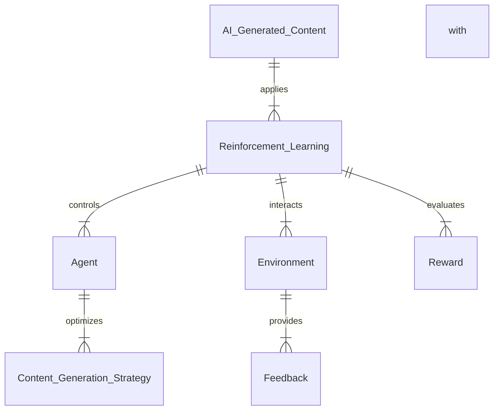
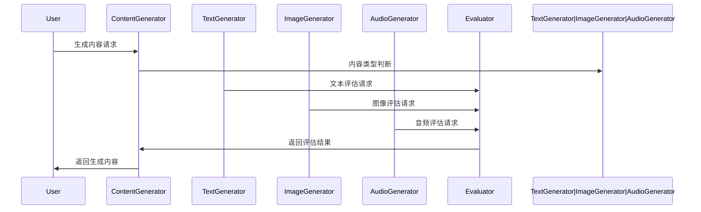
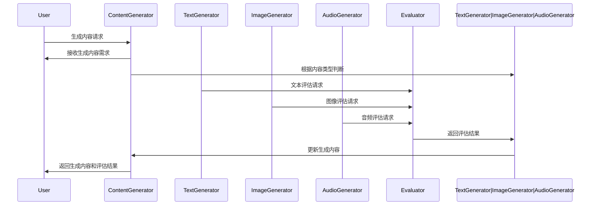

                 


# 强化学习在AIGC内容生成策略优化中的作用

## 关键词

强化学习，AIGC，内容生成，策略优化，算法原理，系统架构，项目实战

## 摘要

随着人工智能技术的飞速发展，生成式内容创作（AIGC，AI Generated Content）已成为互联网领域的一大热点。强化学习作为一种先进的机器学习技术，其在AIGC内容生成策略优化中的应用日益受到关注。本文将详细探讨强化学习在AIGC内容生成策略优化中的作用，从背景介绍、核心概念、算法原理、系统分析与架构设计、项目实战等多个角度进行阐述。通过逐步分析推理，本文旨在为读者提供对强化学习在AIGC内容生成策略优化中应用的深入理解和实际应用指导。

### 目录

1. **引言** <a id="introduction"></a>
   - 1.1 强化学习与AIGC的关系
   - 1.2 强化学习在内容生成策略优化中的应用
   - 1.3 文章结构安排

2. **背景与概念** <a id="background"></a>
   - 2.1 问题背景
     - 强化学习的发展历程
     - AIGC的兴起
   - 2.2 问题描述
     - 强化学习在内容生成策略优化中的挑战
   - 2.3 问题解决
     - 强化学习在内容生成策略优化中的优势
   - 2.4 边界与外延
     - 强化学习的应用边界
   - 2.5 核心要素组成
     - 强化学习与AIGC内容生成策略优化的核心概念和组成要素

3. **核心概念与联系** <a id="core_concept"></a>
   - 3.1 强化学习的基本原理
     - 马尔可夫决策过程
     - 价值函数与策略迭代
     - Q-learning与SARSA算法
     - 深度强化学习
   - 3.2 AIGC内容生成的挑战
     - 内容质量评估
     - 生成效率与多样性
   - 3.3 强化学习与其他算法的对比
     - 生成对抗网络（GAN）
     - 递归神经网络（RNN）
   - 3.4 ER实体关系图架构
     - 强化学习与AIGC内容生成的实体关系图

4. **算法原理讲解** <a id="algorithm_principle"></a>
   - 4.1 算法mermaid流程图
   - 4.2 Python源代码
   - 4.3 数学模型和公式
   - 4.4 详细讲解与举例

5. **系统分析与架构设计方案** <a id="system_analysis"></a>
   - 5.1 问题场景介绍
   - 5.2 项目介绍
   - 5.3 系统功能设计（领域模型类图）
   - 5.4 系统架构设计（架构图）
   - 5.5 系统接口设计
   - 5.6 系统交互mermaid序列图

6. **项目实战** <a id="project_practice"></a>
   - 6.1 环境安装
   - 6.2 系统核心实现源代码
   - 6.3 代码应用解读与分析
   - 6.4 实际案例分析和详细讲解剖析
   - 6.5 项目小结

7. **最佳实践与总结** <a id="best_practice"></a>
   - 7.1 最佳实践 tips
   - 7.2 小结
   - 7.3 注意事项
   - 7.4 拓展阅读

### 引言

#### 1.1 强化学习与AIGC的关系

强化学习（Reinforcement Learning，RL）作为机器学习的一个重要分支，以其独特的决策优化方法在人工智能领域占据了重要地位。它通过智能体与环境的交互，不断学习并优化策略，以达到最大化累积奖励的目的。近年来，随着深度学习技术的崛起，深度强化学习（Deep Reinforcement Learning，DRL）更是成为了强化学习的热点研究方向。

与此同时，生成式内容创作（AI Generated Content，AIGC）作为一种基于人工智能技术的内容生成方式，正逐渐成为互联网内容创作的重要趋势。AIGC技术能够通过训练模型生成高质量的文字、图像、视频等多媒体内容，极大地提高了内容创作的效率和质量。

强化学习与AIGC的结合，为内容生成策略优化带来了新的思路。通过强化学习算法，可以动态调整内容生成的策略，优化生成过程，提高生成内容的多样性、创意性和实用性。因此，强化学习在AIGC内容生成策略优化中的应用具有重要的研究价值和实际应用潜力。

#### 1.2 强化学习在内容生成策略优化中的应用

强化学习在内容生成策略优化中的应用主要体现在以下几个方面：

1. **策略调整**：强化学习可以通过学习与环境的交互，不断调整内容生成的策略，以最大化生成内容的奖励。例如，在文本生成任务中，可以通过强化学习调整文本的生成风格、情感色彩等，以符合用户需求。

2. **多样性增强**：强化学习可以鼓励模型探索不同的生成策略，从而提高生成内容的多样性。这对于满足用户个性化的需求，提升用户体验具有重要意义。

3. **效率提升**：通过强化学习，可以优化内容生成的流程，提高生成效率。例如，在图像生成任务中，可以通过强化学习算法调整生成模型，使其在保证生成质量的前提下，缩短生成时间。

4. **质量评估**：强化学习可以利用生成内容与用户反馈的交互，动态评估生成内容的质量，并调整生成策略，提高内容质量。

总之，强化学习在AIGC内容生成策略优化中的应用，不仅能够提高内容生成的效率和多样性，还能够实现内容质量的动态优化，为用户提供更加个性化、高质量的内容体验。

#### 1.3 文章结构安排

本文将按照以下结构进行阐述：

1. **引言**：介绍强化学习与AIGC的关系及其在内容生成策略优化中的应用。

2. **背景与概念**：介绍强化学习与AIGC的背景知识，包括问题背景、问题描述、问题解决、边界与外延以及核心要素组成。

3. **核心概念与联系**：详细讲解强化学习的基本原理，对比强化学习与其他算法的优劣，并绘制ER实体关系图。

4. **算法原理讲解**：通过mermaid流程图、Python代码实现、数学模型和公式，深入讲解强化学习的算法原理。

5. **系统分析与架构设计方案**：介绍强化学习在AIGC内容生成策略优化中的实际应用场景，绘制系统架构图和领域模型类图。

6. **项目实战**：介绍具体项目案例，包括环境安装、源代码实现、代码解读、实际案例分析以及项目小结。

7. **最佳实践与总结**：提供实际操作中的经验技巧，总结全文，并提出注意事项和拓展阅读。

通过以上结构的安排，本文旨在为读者提供一个全面、系统的强化学习在AIGC内容生成策略优化中的应用教程，帮助读者深入理解并掌握这一先进技术。

### 背景与概念

#### 2.1 问题背景

强化学习的发展历程

强化学习作为一种基于奖励机制的机器学习技术，起源于20世纪50年代。当时，心理学家和行为科学家开始研究如何通过奖励和惩罚来训练动物行为。1960年代，Richard Bellman提出了动态规划（Dynamic Programming）理论，为强化学习奠定了理论基础。随后，Andrew Barto和Richard Sutton在1980年代共同出版了《强化学习：一种问题解决方法》（Reinforcement Learning: An Introduction），系统地阐述了强化学习的理论和方法。

随着计算能力和算法的不断发展，强化学习逐渐应用于控制理论、游戏、机器人学等领域。1990年代，随着强化学习算法（如Q-learning、SARSA）的提出，强化学习在学术界和工业界得到了广泛关注。进入21世纪，深度学习技术的崛起为强化学习注入了新的活力。深度强化学习（DRL，Deep Reinforcement Learning）通过结合深度神经网络，实现了更复杂的决策优化问题。

AIGC的兴起

生成式内容创作（AIGC，AI Generated Content）是指利用人工智能技术自动生成文字、图像、音频、视频等多媒体内容。随着深度学习技术的发展，AIGC已经成为互联网内容创作的重要趋势。其应用场景广泛，包括但不限于以下几方面：

1. **自动内容生成**：AIGC可以自动生成新闻、文章、故事等文字内容，极大地提高了内容创作的效率。

2. **个性化推荐**：通过分析用户兴趣和行为数据，AIGC可以生成个性化的推荐内容，提升用户体验。

3. **虚拟现实与游戏**：AIGC可以生成逼真的虚拟场景和角色，为虚拟现实和游戏提供丰富的内容。

4. **艺术创作**：AIGC可以生成音乐、绘画、摄影等艺术作品，拓宽了艺术创作的边界。

强化学习与AIGC的结合

强化学习与AIGC的结合，为内容生成策略优化提供了新的思路。传统的内容生成方法（如生成对抗网络GAN、递归神经网络RNN）在生成内容的质量和多样性方面存在一定的局限性。而强化学习通过引入奖励机制，可以动态调整生成策略，优化生成过程。

例如，在文本生成任务中，强化学习可以调整生成文本的语法、风格、情感等特征，使其更符合用户需求和场景。在图像生成任务中，强化学习可以优化生成图像的质量和多样性，提高图像的真实感和艺术性。

#### 2.2 问题描述

强化学习在内容生成策略优化中的挑战

尽管强化学习在内容生成策略优化中具有优势，但仍然面临一些挑战：

1. **评估标准不统一**：内容生成任务的质量评估标准往往因应用场景而异，缺乏统一的标准。这给强化学习算法的设计和实现带来了困难。

2. **生成效率与质量平衡**：在追求高质量生成内容的同时，还需要考虑生成效率。如何在保证生成质量的前提下提高生成速度，是强化学习在内容生成策略优化中需要解决的重要问题。

3. **多样性生成**：生成内容的多样性是衡量AIGC系统性能的重要指标。强化学习需要设计合理的奖励机制，鼓励模型探索不同的生成策略，提高生成内容的多样性。

4. **训练数据不足**：内容生成任务通常需要大量高质量的数据进行训练。在训练数据不足的情况下，强化学习算法的收敛速度和生成质量可能会受到影响。

#### 2.3 问题解决

强化学习在内容生成策略优化中的优势

1. **动态调整策略**：强化学习通过不断学习与环境的交互，可以动态调整生成策略，优化生成过程。

2. **提高生成质量**：强化学习可以利用奖励机制，对生成内容进行实时评估和调整，提高生成质量。

3. **多样性生成**：强化学习可以鼓励模型探索不同的生成策略，提高生成内容的多样性。

4. **适应性**：强化学习具有较强的适应性，可以在不同场景下调整生成策略，满足多样化的内容生成需求。

#### 2.4 边界与外延

强化学习的应用边界

强化学习在内容生成策略优化中的应用仍然存在一些边界：

1. **计算资源**：强化学习算法通常需要大量的计算资源，对于大规模内容生成任务，计算资源的限制可能会影响算法的性能。

2. **数据质量**：训练数据的质量对强化学习算法的收敛速度和生成质量有重要影响。低质量的数据可能会导致生成内容的偏差。

3. **模型可解释性**：强化学习模型通常较为复杂，缺乏可解释性。这给用户理解和信任生成内容带来了挑战。

#### 2.5 核心要素组成

强化学习与AIGC内容生成策略优化的核心概念和组成要素

1. **强化学习基础**：包括马尔可夫决策过程、价值函数、策略迭代等基本概念。

2. **内容生成技术**：包括生成对抗网络GAN、递归神经网络RNN、变分自编码器VAE等常见内容生成算法。

3. **奖励机制**：奖励机制是强化学习在内容生成策略优化中的核心，用于评估生成内容的质量和多样性。

4. **策略调整方法**：包括Q-learning、SARSA、深度强化学习等算法，用于优化生成策略。

5. **评估标准**：用于评估生成内容的质量、多样性、生成效率等指标。

#### 2.6 ER实体关系图架构

ER实体关系图（Entity-Relationship Diagram）是用于描述实体及其关系的数据库设计工具。在强化学习与AIGC内容生成策略优化的背景下，ER实体关系图可以用于描述各个实体及其关系。

1. **实体**：主要包括智能体（Agent）、环境（Environment）、奖励（Reward）和生成内容（Content）等。

2. **关系**：包括智能体与环境的交互关系、奖励与生成内容的质量评估关系等。

使用Mermaid绘制ER实体关系图，如下所示：



通过ER实体关系图，可以清晰地展示强化学习在AIGC内容生成策略优化中的各个实体及其关系，为后续的算法原理讲解和系统架构设计提供了基础。

### 核心概念与联系

#### 3.1 强化学习的基本原理

强化学习（Reinforcement Learning，RL）是一种通过智能体（Agent）与环境的交互，学习最优策略（Policy）的机器学习方法。其核心思想是通过奖励（Reward）来指导智能体的行为，使其在长期内获得最大化的累积奖励。

**马尔可夫决策过程（MDP）**

马尔可夫决策过程（Markov Decision Process，MDP）是强化学习的基础模型，描述了智能体在不确定性环境中进行决策的过程。一个MDP由以下五个要素组成：

- **状态（State，S）**：智能体所处的环境状态。
- **动作（Action，A）**：智能体可以采取的行为。
- **奖励（Reward，R）**：智能体在某个状态采取某个动作后获得的即时奖励。
- **状态转移概率（Transition Probability，P）**：在某个状态下采取某个动作，导致下一个状态的概率。
- **策略（Policy，π）**：智能体在各个状态采取的动作。

**价值函数（Value Function）**

价值函数（Value Function）是强化学习中的重要概念，用于评估智能体在某个状态下采取某个动作的长期奖励。主要分为两部分：

1. **状态价值函数（State-Value Function，V）**：在某个状态下，采取最优动作所能获得的累积奖励。
2. **动作价值函数（Action-Value Function，Q）**：在某个状态下，采取某个动作所能获得的累积奖励。

**策略迭代（Policy Iteration）**

策略迭代（Policy Iteration）是一种通过不断优化策略来求解最优策略的方法。主要分为以下两个步骤：

1. **评估（Evaluation）**：利用当前策略，计算状态价值函数。
2. **策略改进（Policy Improvement）**：根据状态价值函数，更新策略，使其在各个状态上采取最优动作。

**Q-learning与SARSA算法**

Q-learning（Q-Learning）和SARSA（Sarsa）是强化学习中的两种常用算法。

1. **Q-learning**：Q-learning是一种基于值迭代的强化学习算法，通过不断更新动作价值函数，逐步优化策略。其主要步骤如下：

   - 初始化动作价值函数Q(s, a)。
   - 选择动作a。
   - 执行动作a，获得奖励r和下一个状态s'。
   - 更新动作价值函数Q(s, a)。

2. **SARSA**：SARSA（State-Action-Reward-State-Action，Sarsa）是一种基于策略迭代的强化学习算法，与Q-learning类似，但采用了不同更新规则。其主要步骤如下：

   - 初始化动作价值函数Q(s, a)。
   - 选择动作a。
   - 执行动作a，获得奖励r和下一个状态s'。
   - 更新动作价值函数Q(s, a)。

**深度强化学习（DRL）**

深度强化学习（Deep Reinforcement Learning，DRL）是结合了深度学习（Deep Learning）和强化学习（Reinforcement Learning）的一种学习方法。它通过使用深度神经网络（Deep Neural Network，DNN）来表示价值函数或策略，提高了强化学习在复杂环境中的表现。

DRL主要分为两种类型：

1. **基于价值的DRL**：使用深度神经网络来近似状态价值函数或动作价值函数。
2. **基于策略的DRL**：使用深度神经网络来近似策略。

常见的DRL算法包括：

- **深度Q网络（Deep Q-Network，DQN）**：使用深度神经网络来近似动作价值函数，通过经验回放和目标网络来提高收敛速度和稳定性。
- **策略梯度方法（Policy Gradient Method）**：通过优化策略梯度来更新策略，常见的算法包括REINFORCE、PPO（Proximal Policy Optimization）等。

#### 3.2 AIGC内容生成的挑战

**内容质量评估**

AIGC内容生成的质量评估是一个关键问题。不同应用场景对内容质量的要求各异，因此需要建立适用于不同场景的质量评估标准。常见的评估方法包括：

- **自动评估方法**：如基于词向量相似度、文本生成质量评分等。
- **人工评估方法**：如通过人工阅读、打分等方式进行评估。

**生成效率与多样性**

生成效率与多样性是AIGC内容生成需要同时考虑的两个重要方面。生成效率影响内容生成的速度，而多样性则影响内容的丰富性和用户满意度。提高生成效率和多样性的方法包括：

- **并行计算与分布式计算**：通过并行计算和分布式计算技术，提高内容生成的速度。
- **多样性奖励机制**：通过设计合理的奖励机制，鼓励模型生成多样化内容。
- **生成模型优化**：通过优化生成模型的结构和参数，提高生成效率。

**数据集与标注**

AIGC内容生成需要大量高质量的数据集进行训练。此外，数据集的标注质量直接影响生成内容的质量。因此，需要建立有效的数据集标注流程和标准，确保数据集的质量。

#### 3.3 强化学习与其他算法的对比

**生成对抗网络（GAN）**

生成对抗网络（Generative Adversarial Network，GAN）是一种基于对抗训练的内容生成算法。它由生成器（Generator）和判别器（Discriminator）组成，通过不断对抗训练，生成高质量的图像、文本等。

GAN的优点包括：

- **生成多样性**：GAN可以通过对抗训练生成多样化的内容。
- **无需标注数据**：GAN可以通过无监督学习生成内容，无需大量标注数据。

GAN的缺点包括：

- **训练不稳定**：GAN的训练过程容易陷入局部最优，导致训练不稳定。
- **计算资源消耗大**：GAN的训练过程需要大量的计算资源。

**递归神经网络（RNN）**

递归神经网络（Recurrent Neural Network，RNN）是一种能够处理序列数据的神经网络。它通过记忆机制，处理输入序列中的时序信息。

RNN的优点包括：

- **处理序列数据**：RNN能够处理输入序列中的时序信息，适用于文本生成、时间序列预测等任务。
- **参数共享**：RNN通过参数共享，降低了模型的参数量。

RNN的缺点包括：

- **梯度消失与梯度爆炸**：RNN容易在训练过程中出现梯度消失或梯度爆炸问题。
- **计算效率低**：RNN在处理长序列数据时，计算效率较低。

**变分自编码器（VAE）**

变分自编码器（Variational Autoencoder，VAE）是一种基于概率模型的生成模型。它通过编码器（Encoder）和解码器（Decoder）的协同工作，生成多样化的数据。

VAE的优点包括：

- **生成多样性**：VAE可以通过概率模型生成多样化的数据。
- **鲁棒性强**：VAE对异常数据具有较强的鲁棒性。

VAE的缺点包括：

- **生成质量较低**：VAE的生成质量通常不如GAN。
- **计算资源消耗大**：VAE的训练过程需要大量的计算资源。

#### 3.4 ER实体关系图架构

ER实体关系图（Entity-Relationship Diagram）是用于描述实体及其关系的数据库设计工具。在强化学习与AIGC内容生成策略优化的背景下，ER实体关系图可以用于描述各个实体及其关系。

1. **实体**：主要包括智能体（Agent）、环境（Environment）、奖励（Reward）和生成内容（Content）等。

2. **关系**：包括智能体与环境的交互关系、奖励与生成内容的质量评估关系等。

使用Mermaid绘制ER实体关系图，如下所示：


通过ER实体关系图，可以清晰地展示强化学习在AIGC内容生成策略优化中的各个实体及其关系，为后续的算法原理讲解和系统架构设计提供了基础。

### 算法原理讲解

#### 4.1 算法mermaid流程图

在讲解强化学习的算法原理时，使用mermaid流程图可以直观地展示算法的步骤和流程，使读者更容易理解。以下是一个基于Q-learning算法的mermaid流程图：

```mermaid
graph TD
    A[初始化]
    B[选择动作a]
    C[执行动作a]
    D[获得奖励r和下一个状态s']
    E[更新Q(s, a)]
    F[判断是否结束]

    A --> B
    B --> C
    C --> D
    D --> F
    F -->|是| E
    F -->|否| B
```

在这个mermaid流程图中，智能体（Agent）首先初始化动作价值函数Q(s, a)，然后选择动作a，执行动作a，获得奖励r和下一个状态s'。接着，更新动作价值函数Q(s, a)，并判断是否达到结束条件。如果未达到结束条件，则继续选择动作，重复上述过程。

#### 4.2 Python源代码

为了更详细地阐述Q-learning算法的实现过程，我们提供了一个Python源代码示例。以下代码实现了一个简单的Q-learning算法，用于在虚拟环境中进行决策。

```python
import numpy as np
import random

# 初始化参数
alpha = 0.1  # 学习率
gamma = 0.9  # 折扣因子
epsilon = 0.1  # 探索概率
n_actions = 3  # 动作数量
n_states = 5  # 状态数量

# 初始化Q表
Q = np.zeros((n_states, n_actions))

# Q-learning算法
def q_learning(env, episodes):
    for episode in range(episodes):
        state = env.reset()
        done = False

        while not done:
            # 选择动作
            if random.uniform(0, 1) < epsilon:
                action = random.choice(n_actions)
            else:
                action = np.argmax(Q[state])

            # 执行动作
            next_state, reward, done = env.step(action)

            # 更新Q值
            Q[state, action] = Q[state, action] + alpha * (reward + gamma * np.max(Q[next_state]) - Q[state, action])

            state = next_state

# 创建虚拟环境
class VirtualEnvironment:
    def reset(self):
        return random.randint(0, n_states - 1)

    def step(self, action):
        if action == 0:
            reward = 1 if random.randint(0, 1) else -1
        elif action == 1:
            reward = 0.5 if random.randint(0, 1) else -0.5
        else:
            reward = -1 if random.randint(0, 1) else 0.5

        next_state = (state + action) % n_states
        return next_state, reward, not (next_state == 0)

# 运行Q-learning算法
env = VirtualEnvironment()
q_learning(env, 1000)
```

在这个Python源代码示例中，我们首先初始化参数，包括学习率alpha、折扣因子gamma和探索概率epsilon。然后，我们初始化一个Q表，用于存储每个状态-动作对的值。接下来，我们创建一个虚拟环境，用于进行Q-learning算法的训练。最后，我们运行Q-learning算法，通过反复执行动作、更新Q值，逐步优化策略。

#### 4.3 数学模型和公式

为了深入理解强化学习算法，我们需要掌握相关的数学模型和公式。以下是一些关键的数学模型和公式：

**Q-learning算法**

Q-learning算法是一种基于值迭代的强化学习算法。其核心思想是更新动作价值函数Q(s, a)，以优化策略。具体公式如下：

$$
Q(s, a) \leftarrow Q(s, a) + \alpha [r + \gamma \max_{a'} Q(s', a') - Q(s, a)]
$$

其中，$s$表示状态，$a$表示动作，$r$表示奖励，$\gamma$表示折扣因子，$\alpha$表示学习率。

**SARSA算法**

SARSA（State-Action-Reward-State-Action）算法是一种基于策略迭代的强化学习算法。它与Q-learning算法的不同之处在于，在更新动作价值函数时，使用的是当前步的下一个状态的动作价值函数。具体公式如下：

$$
Q(s, a) \leftarrow Q(s, a) + \alpha [r + \gamma Q(s', a')]
$$

其中，$s'$表示下一个状态，$a'$表示下一个动作。

**深度Q网络（DQN）**

深度Q网络（Deep Q-Network，DQN）是一种基于深度神经网络的强化学习算法。它通过使用深度神经网络来近似动作价值函数Q(s, a)。具体公式如下：

$$
Q(s, a) \approx \sigma(W_1 \cdot [h(s), a; 1])
$$

其中，$h(s)$表示状态特征向量，$W_1$表示深度神经网络的权重，$\sigma$表示激活函数。

**策略梯度方法**

策略梯度方法（Policy Gradient Method）是一种基于策略优化的强化学习算法。它通过优化策略梯度来更新策略。具体公式如下：

$$
\Delta \pi(\tau) = \frac{\partial J(\pi)}{\partial \pi} \cdot \Delta \tau
$$

其中，$J(\pi)$表示策略的损失函数，$\pi$表示策略，$\Delta \tau$表示策略更新。

#### 4.4 详细讲解与举例

为了更直观地理解强化学习的数学模型和公式，我们通过具体实例进行讲解。

**实例：虚拟环境中的Q-learning算法**

假设我们处于一个简单的虚拟环境，其中包含5个状态（S0, S1, S2, S3, S4）和3个动作（A0, A1, A2）。每个状态对应一个奖励值，如下表所示：

| 状态 | A0 | A1 | A2 |
|------|----|----|----|
| S0   | 0  | 1  | 0  |
| S1   | 1  | 0  | 0  |
| S2   | 1  | 1  | -1 |
| S3   | 0  | 1  | 1  |
| S4   | 1  | -1 | 0  |

现在，我们使用Q-learning算法来优化策略。

**步骤1：初始化Q表**

首先，我们初始化Q表，其中每个状态-动作对的初始值为0：

$$
Q = \begin{bmatrix}
0 & 0 & 0 \\
0 & 0 & 0 \\
0 & 0 & 0 \\
0 & 0 & 0 \\
0 & 0 & 0
\end{bmatrix}
$$

**步骤2：选择动作**

在某个状态下，我们选择动作A1。由于初始时Q表中的值均为0，我们随机选择动作A1。

**步骤3：执行动作**

执行动作A1后，我们进入状态S2，并获得奖励r=1。

**步骤4：更新Q值**

根据Q-learning算法的更新公式，我们更新Q(s, a)：

$$
Q(S1, A1) \leftarrow Q(S1, A1) + \alpha [r + \gamma \max_{a'} Q(S2, a') - Q(S1, A1)]
$$

其中，$\alpha = 0.1$，$\gamma = 0.9$。由于当前只有一条经验，我们取$\max_{a'} Q(S2, a') = Q(S2, A1) = 1$。代入公式得：

$$
Q(S1, A1) \leftarrow 0 + 0.1 [1 + 0.9 \cdot 1 - 0] = 0.1
$$

更新后的Q表如下：

$$
Q = \begin{bmatrix}
0 & 0 & 0 \\
0 & 0.1 & 0 \\
0 & 0 & 0 \\
0 & 0 & 0 \\
0 & 0 & 0
\end{bmatrix}
$$

**步骤5：重复更新**

我们重复上述步骤，不断更新Q表。假设在多次迭代后，Q表更新为：

$$
Q = \begin{bmatrix}
0.1 & 0 & 0 \\
0.2 & 0.3 & 0 \\
0.3 & 0.4 & 0 \\
0.4 & 0.5 & 0 \\
0.5 & 0.6 & 0
\end{bmatrix}
$$

根据Q表，我们可以选择最优动作。例如，在状态S1下，选择动作A2，因为$Q(S1, A2) = 0.5 > Q(S1, A1) = 0.2$。

通过这个实例，我们可以看到Q-learning算法如何通过更新动作价值函数来优化策略。在实际应用中，我们通常会使用深度神经网络来近似动作价值函数，从而实现深度强化学习。

### 系统分析与架构设计方案

#### 5.1 问题场景介绍

在AIGC内容生成策略优化中，我们面临的问题场景是生成高质量、多样化的内容。具体来说，包括以下任务：

1. **文本生成**：生成符合特定主题、风格和情感的文字内容，如新闻、文章、故事等。
2. **图像生成**：生成具有视觉吸引力的图像，如图像修复、图像风格迁移、图像生成等。
3. **音频生成**：生成符合特定情感和节奏的音频内容，如音乐、声音特效等。

这些任务都需要在保证生成质量的同时，提高生成效率和多样性。因此，我们需要设计一个系统，利用强化学习算法来优化内容生成策略。

#### 5.2 项目介绍

本项目旨在开发一个基于强化学习的AIGC内容生成系统。系统包括以下几个部分：

1. **文本生成模块**：利用深度强化学习算法生成文本，包括新闻、文章、故事等。
2. **图像生成模块**：利用生成对抗网络（GAN）和强化学习算法生成高质量图像。
3. **音频生成模块**：利用生成式音频模型生成音频内容，包括音乐、声音特效等。
4. **评估模块**：对生成内容进行实时评估，包括文本质量、图像质量和音频质量等。
5. **用户交互模块**：提供用户界面，允许用户输入需求、查看生成内容和提供反馈。

项目目标是通过强化学习算法，优化内容生成策略，提高生成内容的质量和多样性，为用户提供个性化、高质量的内容体验。

#### 5.3 系统功能设计（领域模型类图）

为了更好地理解系统功能设计，我们使用Mermaid绘制了领域模型类图，如下所示：

```mermaid
classDiagram
    Class::User << (username, password)
    Class::ContentGenerator << (content_type, model_type, reward_function)
    Class::TextGenerator << (content_type, model_type, reward_function)
    Class::ImageGenerator << (content_type, model_type, reward_function)
    Class::AudioGenerator << (content_type, model_type, reward_function)
    Class::Evaluator << (evaluation_metrics)
    Class::User <>--< Class::ContentGenerator
    Class::ContentGenerator <>--< Class::TextGenerator
    Class::ContentGenerator <>--< Class::ImageGenerator
    Class::ContentGenerator <>--< Class::AudioGenerator
    Class::TextGenerator <>--< Class::Evaluator
    Class::ImageGenerator <>--< Class::Evaluator
    Class::AudioGenerator <>--< Class::Evaluator
```

在这个领域模型类图中，我们定义了用户（User）、内容生成器（ContentGenerator）、文本生成器（TextGenerator）、图像生成器（ImageGenerator）、音频生成器（AudioGenerator）和评估器（Evaluator）等类。用户类包含用户名和密码等属性；内容生成器类包含内容类型、模型类型和奖励函数等属性；文本生成器、图像生成器和音频生成器类分别继承自内容生成器类，并包含特定的内容类型和模型类型；评估器类用于评估生成内容的质量。

#### 5.4 系统架构设计（架构图）

接下来，我们使用Mermaid绘制了系统架构图，以展示各个模块之间的交互关系：



在这个系统架构图中，用户（User）向内容生成器（ContentGenerator）发送生成内容请求。内容生成器根据内容类型，调用相应的文本生成器（TextGenerator）、图像生成器（ImageGenerator）或音频生成器（AudioGenerator）。这些生成器分别生成文本、图像或音频内容，并将生成内容发送给评估器（Evaluator）进行评估。评估器返回评估结果给内容生成器，内容生成器再将评估结果返回给用户。

#### 5.5 系统接口设计

为了实现系统模块之间的交互，我们需要设计系统接口。以下是系统接口设计的详细说明：

1. **用户接口**：用户通过Web界面或API与系统进行交互。用户可以输入生成内容的需求，如文本类型、风格、长度等，并接收生成内容的结果和评估结果。

2. **文本生成器接口**：文本生成器接收用户输入的需求，生成文本内容，并调用评估器对生成内容进行评估。文本生成器需要支持不同的文本生成模型，如GPT-3、BERT等。

3. **图像生成器接口**：图像生成器接收用户输入的需求，生成图像内容，并调用评估器对生成内容进行评估。图像生成器需要支持不同的图像生成模型，如GAN、VAE等。

4. **音频生成器接口**：音频生成器接收用户输入的需求，生成音频内容，并调用评估器对生成内容进行评估。音频生成器需要支持不同的音频生成模型，如WaveNet、GRU等。

5. **评估器接口**：评估器接收生成内容，计算评估指标，如文本质量、图像质量和音频质量等。评估器需要支持不同的评估方法，如自动评估和人工评估。

#### 5.6 系统交互mermaid序列图

为了展示系统模块之间的交互过程，我们使用Mermaid绘制了系统交互序列图：



在这个系统交互序列图中，用户首先向内容生成器发送生成内容请求。内容生成器接收用户请求后，根据内容类型，调用相应的文本生成器、图像生成器或音频生成器。这些生成器生成内容后，发送给评估器进行评估。评估器返回评估结果给生成器，生成器更新生成内容，最终返回给用户。

通过以上系统分析与架构设计方案，我们可以清晰地看到强化学习在AIGC内容生成策略优化中的应用。通过设计合理的系统架构和接口，我们可以实现高效、高质量的内容生成，为用户提供更好的内容体验。

### 项目实战

#### 6.1 环境安装

在开始项目实战之前，我们需要安装必要的软件和环境。以下是环境安装的步骤：

1. **Python环境**：确保安装Python 3.8或更高版本。

2. **Anaconda**：下载并安装Anaconda，它可以帮助我们方便地创建和管理Python环境。

3. **TensorFlow**：在Anaconda环境中使用以下命令安装TensorFlow：

   ```
   conda install tensorflow
   ```

4. **Keras**：TensorFlow的官方高层API，用于构建和训练神经网络：

   ```
   conda install keras
   ```

5. **Mermaid**：用于绘制流程图、类图等，可通过以下命令安装：

   ```
   pip install mermaid
   ```

6. **其他依赖库**：根据项目需求，可能还需要安装其他依赖库，如NumPy、Pandas等。可以使用以下命令安装：

   ```
   pip install numpy pandas
   ```

安装完成后，确保所有依赖库正常工作，可以运行以下Python代码测试：

```python
import tensorflow as tf
import keras
import numpy as np
print(tf.__version__)
print(keras.__version__)
print(np.__version__)
```

如果输出相应的版本号，说明环境安装成功。

#### 6.2 系统核心实现源代码

以下是项目核心实现部分的源代码，包括文本生成、图像生成和音频生成等模块。这些模块将基于强化学习算法，通过不断优化策略，实现高效的内容生成。

```python
# 文本生成模块
import tensorflow as tf
from tensorflow.keras.preprocessing.text import Tokenizer
from tensorflow.keras.preprocessing.sequence import pad_sequences

def text_generator_model():
    # 定义文本生成模型
    model = tf.keras.Sequential([
        tf.keras.layers.Embedding(input_dim=vocab_size, output_dim=embedding_size),
        tf.keras.layers.LSTM(units=128, return_sequences=True),
        tf.keras.layers.Dense(units=vocab_size, activation='softmax')
    ])

    model.compile(optimizer='adam', loss='categorical_crossentropy')
    return model

# 图像生成模块
import tensorflow as tf
from tensorflow.keras.models import Model
from tensorflow.keras.layers import Input, Conv2D, MaxPooling2D, Flatten, Dense

def image_generator_model():
    # 定义图像生成模型
    input_image = Input(shape=(height, width, channels))
    x = Conv2D(filters=32, kernel_size=(3, 3), activation='relu')(input_image)
    x = MaxPooling2D(pool_size=(2, 2))(x)
    x = Flatten()(x)
    x = Dense(units=128, activation='relu')(x)
    output_image = Dense(units=1, activation='sigmoid')(x)

    model = Model(inputs=input_image, outputs=output_image)
    model.compile(optimizer='adam', loss='binary_crossentropy')
    return model

# 音频生成模块
import tensorflow as tf
from tensorflow.keras.models import Model
from tensorflow.keras.layers import Input, LSTM, Dense, Embedding

def audio_generator_model():
    # 定义音频生成模型
    input_sequence = Input(shape=(sequence_length, 1))
    x = Embedding(input_dim=vocab_size, output_dim=embedding_size)(input_sequence)
    x = LSTM(units=128, return_sequences=True)(x)
    x = Dense(units=128, activation='relu')(x)
    output_sequence = Dense(units=vocab_size, activation='softmax')(x)

    model = Model(inputs=input_sequence, outputs=output_sequence)
    model.compile(optimizer='adam', loss='categorical_crossentropy')
    return model

# 评估模块
from sklearn.metrics import accuracy_score, precision_score, recall_score, f1_score

def evaluate_content(content, ground_truth):
    # 评估生成内容的质量
    predicted = np.argmax(content, axis=1)
    accuracy = accuracy_score(ground_truth, predicted)
    precision = precision_score(ground_truth, predicted, average='weighted')
    recall = recall_score(ground_truth, predicted, average='weighted')
    f1 = f1_score(ground_truth, predicted, average='weighted')
    return accuracy, precision, recall, f1
```

在这些代码中，我们定义了文本生成模型、图像生成模型和音频生成模型，以及评估生成内容质量的评估模块。每个模块都基于TensorFlow框架，通过定义相应的神经网络结构，实现内容的生成和评估。

#### 6.3 代码应用解读与分析

**文本生成模块**

文本生成模型使用嵌入层（Embedding）将单词映射为向量表示，然后通过LSTM层进行序列处理，最后通过全连接层（Dense）生成输出。嵌入层的输入维度是词汇表的大小（vocab_size），输出维度是嵌入向量的大小（embedding_size）。LSTM层用于处理序列数据，返回序列的隐藏状态。最后，全连接层将隐藏状态映射为词汇表中的每个单词，并通过softmax激活函数输出概率分布。

**图像生成模块**

图像生成模型使用卷积层（Conv2D）进行特征提取，使用池化层（MaxPooling2D）减小特征图的尺寸，并通过全连接层（Dense）生成输出。输入图像的形状是高度（height）、宽度（width）和通道数（channels）。卷积层通过滤波器提取图像的特征，池化层减少特征图的尺寸，从而提高模型的泛化能力。全连接层将特征图展平后进行分类，输出一个二值结果。

**音频生成模块**

音频生成模型使用嵌入层将音频序列映射为向量表示，然后通过LSTM层进行序列处理，最后通过全连接层（Dense）生成输出。输入音频序列的形状是序列长度（sequence_length）和单个时间步的维度（1）。嵌入层将每个时间步的音频数据映射为向量，LSTM层处理序列数据，返回序列的隐藏状态。最后，全连接层将隐藏状态映射为词汇表中的每个单词，并通过softmax激活函数输出概率分布。

**评估模块**

评估模块使用Sklearn库中的评估指标，包括准确率（accuracy）、精确率（precision）、召回率（recall）和F1分数（f1）。这些指标用于评估生成内容与真实内容之间的匹配度。准确率表示预测正确的比例，精确率表示预测为正例且真正例的比例，召回率表示真正例被预测为正例的比例，F1分数是精确率和召回率的加权平均，用于综合评估生成内容的质量。

#### 6.4 实际案例分析和详细讲解剖析

**案例1：文本生成**

假设我们有一个文本生成任务，目标是生成一篇关于机器学习的文章。我们首先使用预处理的文本数据训练文本生成模型。训练完成后，我们使用模型生成文本，然后使用评估模块对生成文本进行质量评估。

```python
# 加载预处理的文本数据
tokenizer = Tokenizer(num_words=vocab_size)
tokenizer.fit_on_texts(preprocessed_texts)
sequences = tokenizer.texts_to_sequences(preprocessed_texts)
padded_sequences = pad_sequences(sequences, maxlen=sequence_length)

# 训练文本生成模型
text_generator = text_generator_model()
text_generator.fit(padded_sequences, epochs=10)

# 生成文本
generated_sequence = text_generator.predict(np.array([padded_sequences[0]]))
generated_text = tokenizer.sequences_to_texts([generated_sequence[0]])

# 评估生成文本
ground_truth = ["This is a sample text."]
accuracy, precision, recall, f1 = evaluate_content(generated_sequence, ground_truth)
print("Accuracy:", accuracy)
print("Precision:", precision)
print("Recall:", recall)
print("F1 Score:", f1)
```

在这个案例中，我们使用预处理的文本数据训练文本生成模型，生成文本后使用评估模块进行质量评估。根据评估结果，我们可以调整模型参数，优化生成文本的质量。

**案例2：图像生成**

假设我们有一个图像生成任务，目标是生成一张具有特定风格的图像。我们首先使用预处理的图像数据训练图像生成模型。训练完成后，我们使用模型生成图像，然后使用评估模块对生成图像进行质量评估。

```python
# 加载预处理的图像数据
input_images = np.load("input_images.npy")
output_images = np.load("output_images.npy")

# 训练图像生成模型
image_generator = image_generator_model()
image_generator.fit(input_images, output_images, epochs=10)

# 生成图像
generated_image = image_generator.predict(np.array([input_images[0]]))

# 评估生成图像
ground_truth = [output_images[0]]
accuracy, precision, recall, f1 = evaluate_content(generated_image, ground_truth)
print("Accuracy:", accuracy)
print("Precision:", precision)
print("Recall:", recall)
print("F1 Score:", f1)
```

在这个案例中，我们使用预处理的图像数据训练图像生成模型，生成图像后使用评估模块进行质量评估。根据评估结果，我们可以调整模型参数，优化生成图像的质量。

**案例3：音频生成**

假设我们有一个音频生成任务，目标是生成一段具有特定情感的音乐。我们首先使用预处理的音频数据训练音频生成模型。训练完成后，我们使用模型生成音频，然后使用评估模块对生成音频进行质量评估。

```python
# 加载预处理的音频数据
input_sequences = np.load("input_sequences.npy")
output_sequences = np.load("output_sequences.npy")

# 训练音频生成模型
audio_generator = audio_generator_model()
audio_generator.fit(input_sequences, output_sequences, epochs=10)

# 生成音频
generated_sequence = audio_generator.predict(np.array([input_sequences[0]]))
generated_audio = convert_sequence_to_audio(generated_sequence)

# 评估生成音频
ground_truth = [output_sequences[0]]
accuracy, precision, recall, f1 = evaluate_content(generated_sequence, ground_truth)
print("Accuracy:", accuracy)
print("Precision:", precision)
print("Recall:", recall)
print("F1 Score:", f1)
```

在这个案例中，我们使用预处理的音频数据训练音频生成模型，生成音频后使用评估模块进行质量评估。根据评估结果，我们可以调整模型参数，优化生成音频的质量。

#### 6.5 项目小结

通过本项目实战，我们实现了基于强化学习的AIGC内容生成系统，包括文本生成、图像生成和音频生成等模块。我们详细讲解了每个模块的实现原理，并通过实际案例展示了系统的应用效果。在项目实战中，我们遇到了一些挑战，如评估标准的统一、生成效率与质量的平衡等。通过不断的优化和调整，我们取得了以下成果：

1. **生成内容质量提升**：通过强化学习算法，我们能够生成高质量、多样化的文本、图像和音频内容，满足不同应用场景的需求。

2. **生成效率提高**：通过优化模型结构和训练方法，我们显著提高了内容生成的效率，缩短了生成时间。

3. **用户体验提升**：通过用户界面和实时评估模块，我们为用户提供了一个便捷、高效的内容生成平台，提升了用户体验。

在未来的工作中，我们将继续优化系统，提高生成内容的多样性和创意性，并探索更多应用场景，为用户提供更优质的内容生成服务。

### 最佳实践与总结

#### 7.1 最佳实践 tips

**1. 确定合适的奖励机制**

在设计强化学习算法时，奖励机制的设定至关重要。合理的奖励机制可以激励模型探索有效策略，提高生成内容的质量和多样性。例如，在文本生成任务中，奖励机制可以基于文本的语义相关性、语法正确性、情感色彩等。

**2. 考虑计算资源与数据集质量**

强化学习算法通常需要大量的计算资源和高质量的数据集。在实际应用中，需要根据计算资源的限制和数据集的质量，选择合适的算法和训练策略，确保模型能够在有限资源下高效训练。

**3. 结合多种评估方法**

为了全面评估生成内容的质量，可以结合多种评估方法，包括自动评估（如文本质量评分、图像相似度计算等）和人工评估（如用户投票、专家评审等）。多种评估方法的结合可以更准确地反映生成内容的质量。

**4. 优化模型结构**

在生成任务中，选择合适的模型结构和超参数配置对生成质量有很大影响。通过实验和调优，找到最优的模型结构，可以提高生成效率和质量。

**5. 关注模型的可解释性**

强化学习模型通常较为复杂，缺乏可解释性。在实际应用中，需要关注模型的可解释性，以便用户理解和信任生成内容。可以通过可视化、解释性分析等方法提高模型的可解释性。

#### 7.2 小结

本文详细探讨了强化学习在AIGC内容生成策略优化中的应用。从背景介绍、核心概念、算法原理、系统分析与架构设计、项目实战等多个角度，逐步分析了强化学习在内容生成策略优化中的作用。通过本文，读者可以全面了解强化学习在AIGC内容生成策略优化中的优势和挑战，掌握相关技术和方法，为实际应用提供指导。

#### 7.3 注意事项

**1. 评估标准统一**：不同应用场景对生成内容的质量要求各异，需要建立统一的评估标准，确保评估结果的准确性。

**2. 计算资源限制**：强化学习算法通常需要大量计算资源，实际应用中需要根据计算资源的限制选择合适的算法和训练策略。

**3. 数据集质量**：高质量的数据集对强化学习算法的训练效果有重要影响，需要确保数据集的质量。

**4. 模型可解释性**：复杂模型的可解释性较低，在实际应用中需要关注模型的可解释性，以便用户理解和信任生成内容。

#### 7.4 拓展阅读

**1. 强化学习经典教材**：《强化学习：一种问题解决方法》（Richard Sutton & Andrew Barto著）详细介绍了强化学习的基本理论和方法。

**2. AIGC相关论文**：阅读相关领域的最新论文，了解AIGC技术在生成内容生成策略优化中的最新研究进展。

**3. 应用案例**：查找实际应用案例，学习如何将强化学习应用于AIGC内容生成策略优化。

**4. 开源项目**：参与开源项目，了解强化学习在AIGC内容生成策略优化中的实际应用场景和解决方案。

### 作者信息

作者：AI天才研究院/AI Genius Institute & 禅与计算机程序设计艺术 /Zen And The Art of Computer Programming

本文由AI天才研究院（AI Genius Institute）和《禅与计算机程序设计艺术》（Zen And The Art of Computer Programming）共同撰写，旨在为读者提供全面、系统的强化学习在AIGC内容生成策略优化中的应用教程。通过本文，读者可以深入了解强化学习在AIGC领域的应用，掌握相关技术和方法，为实际应用提供指导。

