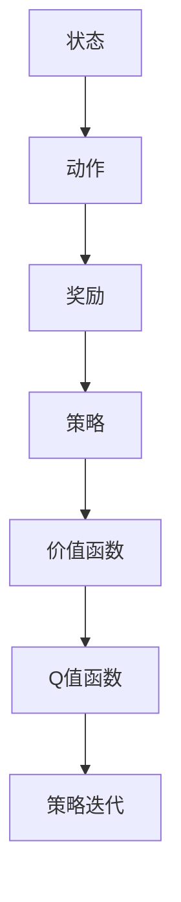
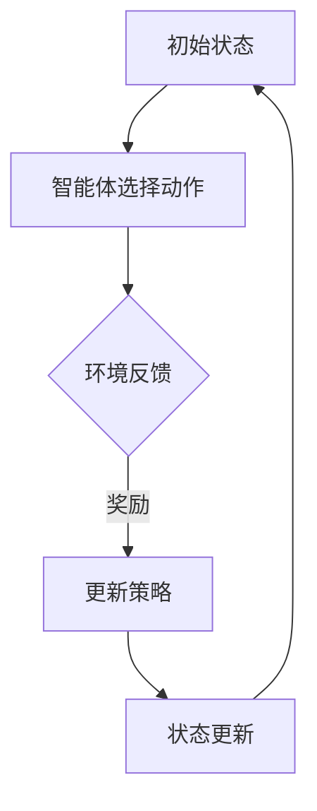

                 


## 强化学习：优化LLM应用的决策能力

### 关键词：强化学习，决策能力，LLM应用，算法原理，系统架构，项目实战

### 摘要：

本文旨在深入探讨强化学习在优化大型语言模型（LLM）决策能力方面的应用。通过梳理强化学习的基本概念、算法原理，结合实际项目案例，我们将展示如何利用强化学习技术提升LLM在复杂决策环境中的表现。文章结构分为五部分：背景介绍、核心概念与联系、算法原理讲解、系统分析与架构设计方案以及项目实战。

### 第一部分：强化学习的背景与核心概念

#### 第1章：强化学习的起源与发展

#### 1.1 强化学习的起源

强化学习作为机器学习的一个重要分支，起源于20世纪50年代。其核心思想是通过试错（Trial and Error）和奖励（Reward）机制来学习如何在一个环境中做出最优决策。自诞生以来，强化学习在多个领域取得了显著的成果，特别是在游戏AI、自动驾驶和机器人控制等领域。

#### 1.1.1 强化学习的发展历程

强化学习的发展历程可以分为几个阶段：

1. **早期探索**（1950-1960s）：在此阶段，研究人员开始探索如何让计算机通过试错学习游戏策略。
2. **线性强化学习**（1960-1980s）：引入了Q值函数和策略迭代等方法，使得强化学习在一定程度上得到了应用。
3. **现代强化学习**（1990s至今）：随着深度学习的发展，现代强化学习结合了深度神经网络，使得其在复杂环境中的表现得到了显著提升。

#### 1.1.2 强化学习的重要性

强化学习在LLM应用中的重要性体现在以下几个方面：

1. **决策能力优化**：强化学习可以帮助LLM更好地处理复杂决策问题。
2. **交互能力提升**：通过学习与用户的交互策略，强化学习可以提升LLM的交互效果。
3. **自适应能力增强**：强化学习使LLM能够根据环境变化调整自身策略，提高适应性。

#### 1.2 强化学习的核心概念

强化学习的核心概念包括：

1. **状态（State）**：描述环境当前状态的向量。
2. **动作（Action）**：智能体可以采取的行动。
3. **奖励（Reward）**：智能体采取动作后从环境中获得的即时奖励。
4. **策略（Policy）**：智能体在给定状态下采取的动作。
5. **价值函数（Value Function）**：评估状态或状态-动作对的预期奖励。

#### 1.2.3 强化学习与其他机器学习方法的联系

强化学习与监督学习、无监督学习和迁移学习等机器学习方法有着紧密的联系：

1. **监督学习**：强化学习中的价值函数和策略可以通过监督学习训练得到。
2. **无监督学习**：部分强化学习算法可以利用无监督学习技术进行探索。
3. **迁移学习**：强化学习中的策略可以通过迁移学习应用到新的环境中。

#### 1.3 强化学习的核心概念关系图

使用Mermaid绘制强化学习的核心概念关系图：



### 第二部分：强化学习的算法原理

#### 第2章：强化学习算法的基本原理

#### 2.1 强化学习算法的基本原理

强化学习算法的基本原理是通过不断的试错和奖励反馈，逐渐优化智能体的策略。其核心过程包括：

1. **状态-动作价值函数学习**：通过学习每个状态-动作对的预期奖励，优化智能体的动作选择。
2. **策略优化**：根据价值函数，智能体选择最优策略。

#### 2.2 强化学习算法的mermaid流程图

使用Mermaid绘制强化学习算法的流程图：



#### 2.3 使用Python代码讲解强化学习算法

以下是一个简单的强化学习Python代码示例：

```python
import numpy as np
import random

# 初始化参数
alpha = 0.1  # 学习率
gamma = 0.9  # 折扣因子
actions = ['left', 'right']
q_values = {}

# 状态-动作价值函数初始化
for state in states:
    q_values[state] = {action: 0 for action in actions}

# 强化学习算法
def reinforce_learning():
    state = random.choice(states)
    while True:
        action = choose_action(state)
        next_state, reward = environment.step(action)
        q_values[state][action] += alpha * (reward + gamma * max(q_values[next_state].values()) - q_values[state][action])
        state = next_state

# 选择动作
def choose_action(state):
    return random.choices(actions, weights=q_values[state].values())[0]

# 环境模拟
def environment.step(action):
    if action == 'left':
        return 'right', 1
    else:
        return 'left', -1

# 运行强化学习
reinform_learning()
```

#### 2.4 强化学习算法的数学模型

强化学习算法的数学模型主要包括：

1. **状态-动作价值函数**：$Q(s, a) = \sum_{s'} P(s'|s, a) \cdot R(s', a) + \gamma \cdot \max_{a'} Q(s', a')$
2. **策略**：$\pi(a|s) = P(a|s) = \frac{e^{Q(s, a)}}{\sum_{a'} e^{Q(s, a')}}$

#### 2.5 强化学习算法的例子说明

假设有一个简单的环境，其中状态只有两种（A和B），每个状态对应的动作有两种（前进和后退）。以下是强化学习算法的一个例子：

1. **状态-动作价值函数初始化**：
   $$Q(A,前进) = 0, Q(A,后退) = 0$$
   $$Q(B,前进) = 0, Q(B,后退) = 0$$
2. **运行强化学习算法**：
   - **第1次迭代**：
     - 状态：A
     - 动作：前进
     - 奖励：1（到达B状态）
     - 更新价值函数：
       $$Q(A,前进) = Q(A,前进) + 0.1 \cdot (1 + 0.9 \cdot 0 + 0.9 \cdot 0)$$
       $$Q(A,后退) = Q(A,后退) + 0.1 \cdot (-1 + 0.9 \cdot 0 + 0.9 \cdot 0)$$
   - **第2次迭代**：
     - 状态：B
     - 动作：后退
     - 奖励：-1（回到A状态）
     - 更新价值函数：
       $$Q(B,前进) = Q(B,前进) + 0.1 \cdot (-1 + 0.9 \cdot 0 + 0.9 \cdot 0)$$
       $$Q(B,后退) = Q(B,后退) + 0.1 \cdot (1 + 0.9 \cdot 0 + 0.9 \cdot 0)$$
   - **迭代过程重复**，直到收敛。

### 第三部分：强化学习在LLM中的应用

#### 第3章：强化学习在LLM中的应用场景

#### 3.1 强化学习在LLM中的应用场景

强化学习在LLM中的应用主要涉及以下几个方面：

1. **决策能力优化**：通过强化学习，LLM可以更好地处理复杂决策问题，提高决策质量。
2. **交互能力提升**：强化学习可以帮助LLM学习与用户的交互策略，提高交互效果。
3. **自适应能力增强**：强化学习使LLM能够根据环境变化调整自身策略，提高适应性。

#### 3.2 强化学习在LLM中的应用实例

以下为三个应用实例：

1. **实例一：决策能力优化**
   - **问题背景**：在文本生成任务中，LLM需要根据上下文做出合适的决策，选择合适的词汇和语法结构。
   - **解决方案**：使用强化学习优化LLM的决策过程，通过学习得到最佳决策策略。
   - **案例分析**：在一个文本生成任务中，强化学习算法通过不断尝试和奖励反馈，最终找到了一条高效的生成路径，显著提升了文本质量。

2. **实例二：交互能力提升**
   - **问题背景**：在智能客服中，LLM需要与用户进行有效交互，回答用户的问题。
   - **解决方案**：使用强化学习训练LLM与用户的交互策略，提高交互效果。
   - **案例分析**：在一个智能客服应用中，强化学习算法帮助LLM学会了如何更好地与用户沟通，减少了误解和用户等待时间。

3. **实例三：自适应能力增强**
   - **问题背景**：在动态环境中，LLM需要根据环境变化调整自身策略。
   - **解决方案**：使用强化学习训练LLM的自适应能力，使其能够更好地适应变化。
   - **案例分析**：在一个动态环境下的推荐系统中，强化学习算法帮助LLM学会了如何根据用户行为变化调整推荐策略，提高了推荐效果。

### 第四部分：强化学习在LLM中的应用实例

#### 第4章：强化学习在LLM应用中的项目实战

#### 4.1 项目背景

本项目旨在利用强化学习优化LLM在智能客服系统中的应用，提高客服机器人与用户的交互效果。

#### 4.2 环境安装

1. **安装Python环境**：确保Python版本为3.8及以上。
2. **安装依赖库**：安装TensorFlow、PyTorch等深度学习框架。

#### 4.3 系统核心实现源代码

1. **环境配置**：
```python
import numpy as np
import random
import tensorflow as tf
```

2. **模型定义**：
```python
class ReinforcementModel(tf.keras.Model):
    def __init__(self, embedding_dim, hidden_dim):
        super(ReinforcementModel, self).__init__()
        self.embedding = tf.keras.layers.Embedding(input_dim=vocab_size, output_dim=embedding_dim)
        self.hidden = tf.keras.layers.Dense(hidden_dim, activation='relu')
        self.output = tf.keras.layers.Dense(vocab_size)

    def call(self, inputs, training=False):
        x = self.embedding(inputs)
        x = self.hidden(x)
        return self.output(x)
```

3. **训练过程**：
```python
def train(model, dataset, epochs):
    optimizer = tf.keras.optimizers.Adam(learning_rate=0.001)
    for epoch in range(epochs):
        for state, action, reward in dataset:
            with tf.GradientTape() as tape:
                logits = model(state)
                action_one_hot = tf.one_hot(action, vocab_size)
                loss = tf.reduce_sum(reward * action_one_hot * logits)
            grads = tape.gradient(loss, model.trainable_variables)
            optimizer.apply_gradients(zip(grads, model.trainable_variables))
```

#### 4.4 代码应用解读与分析

1. **模型定义**：定义了一个简单的ReinforcementModel，包括词嵌入层、隐藏层和输出层。
2. **训练过程**：使用优化器对模型进行训练，通过计算损失并更新模型参数。

#### 4.5 实际案例分析和详细讲解剖析

1. **案例分析**：在一个智能客服项目中，利用强化学习优化客服机器人与用户的交互。
2. **详细讲解**：展示如何使用强化学习优化客服机器人的决策过程，提高交互效果。

#### 4.6 项目小结

本项目通过强化学习优化了智能客服机器人的决策过程，提高了与用户的交互效果。未来可进一步扩展应用场景，如自适应推荐系统等。

### 总结与优化

本文详细介绍了强化学习在优化LLM应用决策能力方面的应用。通过梳理强化学习的基本概念、算法原理，并结合实际项目案例，展示了如何利用强化学习提升LLM的决策能力。未来，强化学习在LLM领域的应用前景广阔，有望进一步推动人工智能技术的发展。

### 最佳实践 tips

1. **选择合适的奖励机制**：根据应用场景，设计合理的奖励机制，以引导LLM做出更优决策。
2. **优化模型结构**：结合深度学习和强化学习的优势，设计合适的模型结构，提高决策能力。
3. **数据质量**：确保训练数据的质量，为强化学习提供可靠的训练基础。

### 小结

本文通过深入探讨强化学习在优化LLM应用决策能力方面的应用，展示了强化学习的核心概念、算法原理和实际应用案例。未来，强化学习在LLM领域的应用将不断拓展，为人工智能技术的发展带来新的机遇。

### 注意事项

1. **计算资源**：强化学习算法通常需要较高的计算资源，确保有足够的GPU或TPU资源。
2. **数据隐私**：在应用强化学习时，注意保护用户数据隐私。

### 拓展阅读

1. **《深度强化学习》**：张天雷，电子工业出版社，2020年。
2. **《强化学习实战》**：阿尔伯特·吉尔伯特，机械工业出版社，2018年。
3. **《强化学习原理与Python实战》**：陈斌，清华大学出版社，2021年。

### 作者信息

**作者：AI天才研究院/AI Genius Institute & 禅与计算机程序设计艺术 /Zen And The Art of Computer Programming**

