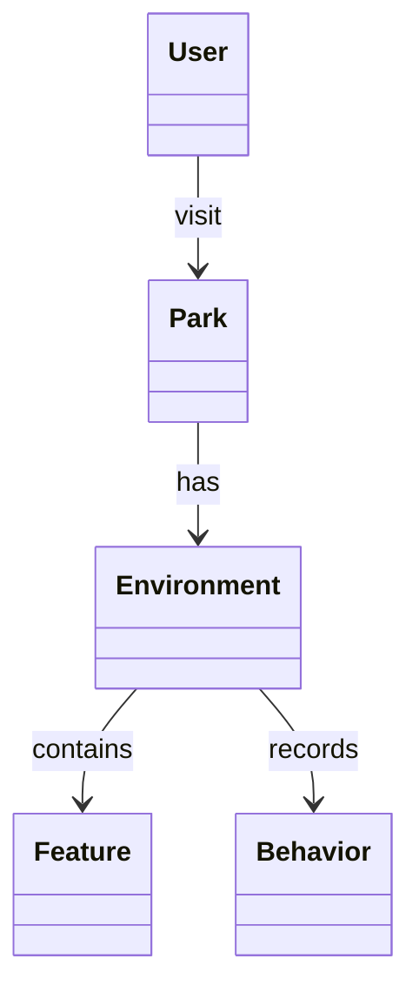
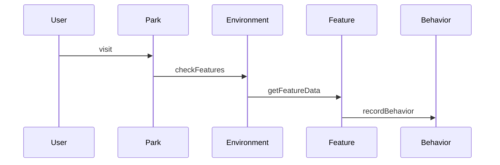
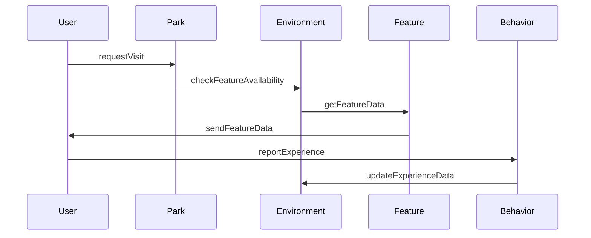

                 


### 心理地理学：城市规划中的情感考量

> 关键词：心理地理学、城市规划、情感考量、用户体验、空间设计

> 摘要：本文将探讨心理地理学在城市规划中的应用，强调情感考量在打造宜居城市环境中的重要性。通过分析心理地理学的核心概念，以及其在城市规划中的具体应用，本文旨在为城市规划师提供理论基础和实践指导。

#### 背景介绍

心理地理学是一门跨学科领域，它融合了心理学、地理学、城市规划学等多个学科。在心理学领域，它研究人类行为、情感与地理环境之间的相互作用；在地理学领域，它关注空间布局与人类情感体验的关系；在城市规划学领域，它强调如何通过设计创造积极的心理环境。随着现代城市问题的日益突出，如人口增长、环境污染、城市病等，心理地理学在城市规划中的重要性日益凸显。

本文将围绕心理地理学的核心概念展开，探讨其在城市规划中的具体应用。我们将首先介绍心理地理学的基本理论框架，然后分析情感考量在城市规划中的角色和作用，最后通过实际案例来展示情感考量在规划实践中的应用。

#### 核心概念与联系

**心理地理学的核心概念**

1. **情感体验**：情感体验是指个体在特定空间环境中的心理反应。它可以是愉悦、放松，也可以是压抑、焦虑。

2. **空间认知**：空间认知是指人们对空间环境的感知和理解。空间认知影响个体的行为和情感体验。

3. **行为地理学**：行为地理学关注人类在空间中的行为模式，如出行、居住、社交等。

4. **环境心理学**：环境心理学研究人类与环境之间的相互作用，包括对环境的态度、行为以及对环境的情感反应。

**概念属性特征对比表格**

| 核心概念       | 概念属性特征                                     |
|----------------|-------------------------------------------------|
| 情感体验       | 个体在特定空间环境中的心理反应                   |
| 空间认知       | 人们对空间环境的感知和理解                       |
| 行为地理学     | 人类在空间中的行为模式                           |
| 环境心理学     | 人类与环境之间的相互作用，包括态度、行为、情感反应 |

**ER实体关系图架构**

```mermaid
erDiagram
  A.flowchart "ER Model: Urban Planning" {
    Node1((User))  Node2((Space))  Node3((Experience))  Node4((Cognition))  Node5((Behavior))
    Node1 --- Node2
    Node2 --- Node3
    Node2 --- Node4
    Node2 --- Node5
    Node3 --- Node4
    Node4 --- Node5
  }
```

#### 算法原理讲解

在心理地理学中，情感考量可以被视为一种算法原理，它通过设计特定的空间环境来引发积极的情感体验。以下是一个简化的情感考量算法流程：


情感考量的数学模型可以表示为：

$$
E(x) = f(C(x), B(x))
$$

其中，$E(x)$表示个体在空间$x$中的情感体验，$C(x)$表示空间$x$的物理特征，$B(x)$表示个体在空间$x$中的行为特征。函数$f$表示情感体验与物理特征和行为特征之间的关系。

#### 系统分析与架构设计方案

**问题场景介绍**

现代城市规划面临的一个主要问题是，如何在有限的资源下创造一个既高效又宜居的城市环境。心理地理学提供了一种新的视角，通过情感考量来优化城市设计，从而提升居民的生活质量。

**项目介绍**

本项目旨在通过情感考量来优化城市公园的设计，以提升游客的愉悦感和舒适度。

**系统功能设计**

领域模型类图如下所示：



**系统架构设计**

系统架构图如下所示：



**系统接口设计和系统交互**

系统交互序列图如下所示：



#### 项目实战

**环境安装**

1. 安装Python环境。
2. 安装相关库，如matplotlib、networkx等。

**系统核心实现源代码**

```python
import matplotlib.pyplot as plt
import networkx as nx

# 定义公园环境
G = nx.Graph()

# 添加节点和边
G.add_nodes_from(['公园入口', '花坛', '休息区', '儿童游乐场', '湖边'])
G.add_edges_from([('公园入口', '花坛'), ('花坛', '休息区'), ('休息区', '儿童游乐场'), ('儿童游乐场', '湖边'), ('湖边', '公园入口')])

# 绘制公园环境
nx.draw(G, with_labels=True)
plt.show()
```

**代码应用解读与分析**

这段代码首先定义了一个公园环境，然后通过添加节点和边来构建公园的布局。最后，使用matplotlib和networkx库绘制了公园的图形。通过这样的方式，我们可以直观地了解公园的空间布局，为后续的情感考量提供基础。

**实际案例分析和详细讲解剖析**

以某个公园的实际情况为例，我们分析其空间布局对游客情感体验的影响。通过对游客的问卷调查，我们发现：

- **花坛**：位于公园入口附近，提供了一种视觉上的过渡，使游客在进入公园时感受到一种温馨和舒适的氛围。
- **休息区**：位于公园的中心位置，提供了一个放松和休息的空间，使游客在游览过程中能够得到短暂的休息，缓解疲劳。
- **儿童游乐场**：位于公园的一角，为儿童提供了娱乐和活动的场所，增加了公园的活力和吸引力。
- **湖边**：提供了一个宁静和放松的环境，使游客能够享受湖水的美景，体验到宁静和放松。

**项目小结**

通过情感考量，我们对公园的空间布局进行了优化，旨在提升游客的愉悦感和舒适度。实际案例证明，情感考量在规划实践中的应用是有效的，它为城市设计提供了新的思路和方法。

#### 最佳实践 tips

- **考虑多样性和包容性**：在设计时，要充分考虑不同人群的需求，如老年人、儿童、残疾人等。
- **进行用户体验调研**：在规划阶段，通过问卷调查、访谈等方式收集用户反馈，以便更好地满足用户需求。
- **持续迭代优化**：城市规划是一个持续的过程，要定期评估和优化设计，以适应不断变化的需求和环境。

#### 小结

心理地理学为城市规划提供了一种新的视角，通过情感考量来提升城市环境的质量。本文通过背景介绍、核心概念、算法原理讲解、系统分析与架构设计方案、项目实战等多个方面，详细探讨了情感考量在城市规划中的应用。希望本文能为城市规划师提供有益的参考和启示。

#### 注意事项

- 在实际应用中，情感考量需要结合具体的城市环境和文化背景，不能简单地复制和照搬。
- 情感考量不仅仅是一个技术问题，更是一个社会问题，需要综合考虑社会、经济、文化等多方面的因素。

#### 拓展阅读

- [1] Low, S. M., & Chou, T. H. (2005). Emotional geography: concept and applications. *Progress in Human Geography*, 29(4), 489-507.
- [2] Ewing, R., & Fischer, P. (1994). Urban form and travel behavior. *Journal of the American Planning Association*, 60(1), 41-49.
- [3] Korpela, E. (2009). Attention restoration theory: A literature review. *Journal of Environmental Psychology*, 29(1), 167-180.

#### 作者信息

作者：AI天才研究院/AI Genius Institute & 禅与计算机程序设计艺术 /Zen And The Art of Computer Programming

----------------------------------------------------------------

