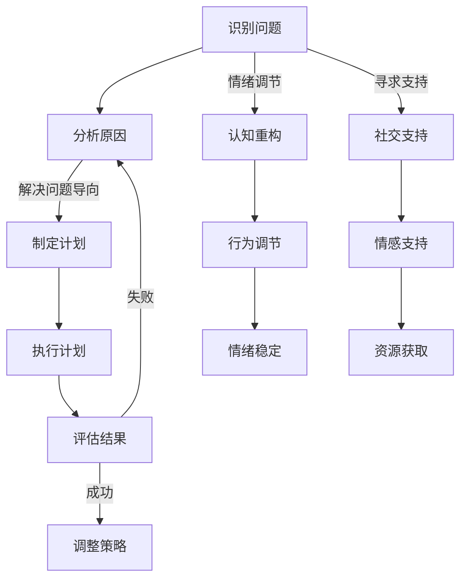
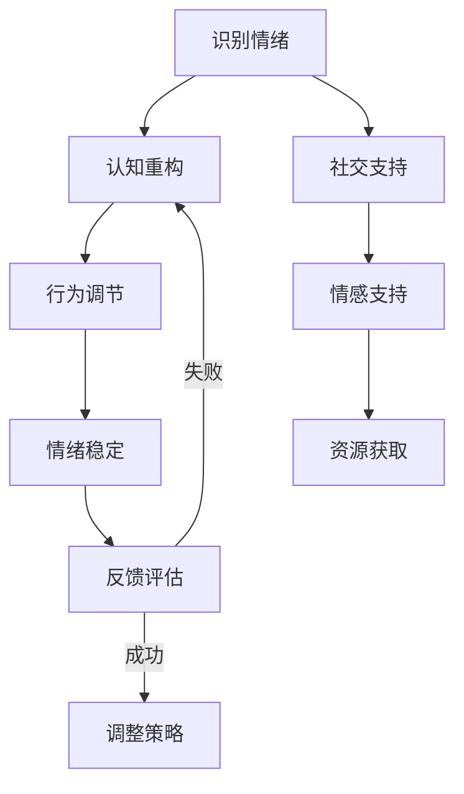
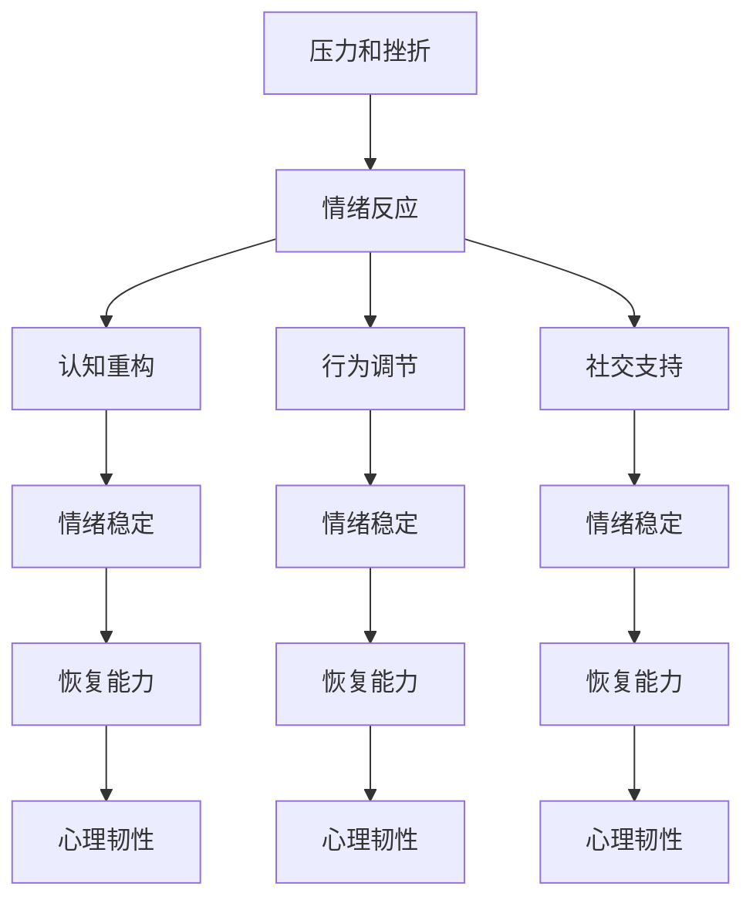

                 


### 1. 引言

#### 1.1 心理韧性的重要性

在当今快速变化和竞争激烈的社会环境中，心理韧性成为人们不可或缺的素质。心理韧性（Resilience）是指个体在面对压力、挑战和逆境时，能够迅速恢复、适应和成长的能力。这种能力不仅关乎个人的心理健康，还影响到个人的职业生涯、人际关系和社会功能。

首先，心理韧性在职业生涯中扮演着关键角色。在IT行业，程序员、软件工程师和其他技术人员经常面临复杂的项目、紧张的时间表和技术难题。这些压力可能导致焦虑、倦怠甚至职业倦怠。具有高心理韧性的人能够更好地应对这些挑战，保持高效的工作状态，从而提高职业成就。

其次，心理韧性在人际关系中也非常重要。在团队合作中，团队成员可能会遇到沟通障碍、冲突和误解。具有心理韧性的人能够更好地处理这些人际挑战，建立积极的团队关系，促进团队的协作与和谐。

最后，心理韧性对于个人的整体福祉和幸福指数也有着深远的影响。它帮助人们更好地应对生活中的起伏和不确定性，从而提高生活质量。

#### 1.2 遇到挫折时的心理状态

当个体遇到挫折时，通常会出现一系列心理反应。这些反应可能包括：

- **情绪反应**：例如焦虑、沮丧、愤怒或恐惧。
- **认知反应**：例如自我怀疑、消极思维、对未来的担忧。
- **行为反应**：例如逃避、退缩、放弃或过度努力。

这些心理状态对个体的恢复和成长有着重要的影响。如果个体能够有效地管理和调节这些反应，他们更有可能从挫折中恢复过来，甚至变得更加坚强。

#### 1.3 心理韧性的定义与内涵

心理韧性是一个多维度的概念，它不仅包括个体应对压力和挫折的能力，还涉及到个体的适应、恢复和成长过程。具体来说，心理韧性包含以下几个关键要素：

- **适应能力**：指个体在逆境中调整自己以适应环境变化的能力。
- **恢复能力**：指个体在经历压力和挫折后迅速恢复到正常状态的能力。
- **成长能力**：指个体在逆境中不仅能够恢复，还能够从中学习和成长的能力。

#### 1.4 心理韧性研究现状与趋势

近年来，心理韧性的研究日益受到关注。研究主要集中在以下几个方面：

- **个体差异**：研究心理韧性在不同个体之间的差异，探索影响心理韧性的遗传和环境因素。
- **干预措施**：开发和实践心理韧性训练和干预策略，以提升个体的心理韧性。
- **跨文化研究**：探讨心理韧性在不同文化背景下的表现形式和影响因素。

未来，心理韧性的研究可能会进一步深化，探索其在不同领域的应用，如教育、健康、工作和家庭生活等。

### 1.5 心理韧性的核心概念

心理韧性是一个复杂的概念，它包含多个核心要素，这些要素相互作用，共同构成了个体的心理韧性。以下是对这些核心概念的详细探讨：

#### 1.5.1 应对策略

应对策略是指个体在面对压力和挑战时所采用的思维和行为方式。有效的应对策略可以帮助个体更好地应对逆境，减少负面情绪的影响，并提高恢复能力。常见的应对策略包括：

- **问题解决导向**：指个体在面对问题时，采取积极的行动去解决，而不是逃避或放弃。
- **情绪调节**：指个体通过认知和行为手段来调节自己的情绪，以减少负面情绪的影响。
- **寻求支持**：指个体在遇到困难时，主动寻求他人的帮助和支持。

以下是一个简单的 Mermaid 流程图，展示了不同应对策略的流程：



#### 1.5.2 自我效能感

自我效能感是指个体对自己应对挑战和完成任务的能力的信念。高自我效能感的人更倾向于采取积极的行动，面对困难时不轻易放弃，并且在逆境中表现出更强的韧性。

以下是一个 Mermaid 类图，展示了自我效能感的组成部分及其相互关系：

```mermaid
classDiagram
Class Self_Efficacy
    +string Self_Efficacy_Level
    +boolean Is_Low
    +boolean Is_High
    +float Confidence_Level
    +string Behavior_Situation

Self_Efficacy "包含" --> Behavior_Situation
Self_Efficacy "影响" --> Confidence_Level
Self_Efficacy "影响" --> Is_Low
Self_Efficacy "影响" --> Is_High
```

#### 1.5.3 情绪调节

情绪调节是指个体通过认知和行为手段来管理自己的情绪。有效的情绪调节可以帮助个体更好地应对压力和挑战，保持心理平衡。情绪调节包括认知重构、行为调节和社交支持等策略。

以下是一个 Mermaid 流程图，展示了情绪调节的过程：



通过以上对心理韧性的核心概念的分析，我们可以看到心理韧性是一个多维度的概念，涉及到应对策略、自我效能感和情绪调节等多个方面。这些核心概念相互作用，共同构成了个体的心理韧性，帮助个体更好地应对生活中的挑战。

### 2. 心理韧性与其他概念的联系

心理韧性不仅是一个独立的个体特征，还与其他心理和社会因素有着密切的联系。理解这些联系有助于更全面地认识心理韧性的本质和其在实际生活中的应用。

#### 2.1 心理韧性与社会支持

社会支持是指个体从家庭、朋友、同事和其他社会关系中获得的支持和帮助。社会支持对心理韧性有着重要的影响。研究表明，高水平的社会支持有助于增强个体的心理韧性，使其在面对逆境时能够更加坚强和适应。

社会支持可以分为三类：

- **情感支持**：提供情感上的理解和慰藉，帮助个体缓解压力和负面情绪。
- **信息支持**：提供实际的信息和知识，帮助个体更好地应对挑战和困难。
- **评价支持**：提供积极的反馈和认可，增强个体的自信心和自我效能感。

以下是一个 Mermaid ER 图，展示了心理韧性与社会支持之间的关系：

```mermaid
erDiagram
Person ||--|{ Support } : receives
Support ||--|{ Resilience } : affects

Person {
    +int ID
    +string Name
}
Support {
    +int ID
    +string Type
}
Resilience {
    +int ID
    +string Level
}
```

#### 2.2 心理韧性与情绪调节

情绪调节是心理韧性的核心组成部分之一。情绪调节能力强的个体能够在面对压力和挫折时更好地控制自己的情绪，避免情绪失控对心理韧性的破坏。

情绪调节包括认知重构、行为调节和社交支持等策略。认知重构是指通过改变对事件的理解和解释来调节情绪；行为调节是指通过改变行为方式来调节情绪；社交支持则是通过与他人交流和获得帮助来调节情绪。

以下是一个 Mermaid 流程图，展示了情绪调节与心理韧性之间的关系：



#### 2.3 心理韧性与自我效能感

自我效能感是指个体对自己应对挑战和完成任务的能力的信念。高自我效能感的人更倾向于采取积极的行动，面对困难时不轻易放弃，并且在逆境中表现出更强的韧性。

自我效能感对心理韧性有着重要的影响。研究表明，自我效能感高的个体在面对逆境时能够保持乐观的态度，积极地寻求解决问题的方法，从而增强心理韧性。

以下是一个 Mermaid 类图，展示了自我效能感与心理韧性之间的关系：

```mermaid
classDiagram
Class Self_Efficacy
    +string Self_Efficacy_Level
    +boolean Is_Low
    +boolean Is_High
    +float Confidence_Level
    +string Behavior_Situation

Class Resilience
    +string Resilience_Level
    +boolean Is_Strong
    +boolean Is_Weak

Self_Efficacy "影响" --> Resilience
Resilience "影响" --> Self_Efficacy
```

通过以上分析，我们可以看到心理韧性不仅与情绪调节、社会支持和自我效能感等心理因素有着密切的联系，还受到个体特征、环境因素等多方面的影响。理解这些联系有助于我们更全面地认识心理韧性的本质，从而更好地培养和提升个体的心理韧性。

### 3. 心理韧性的评估方法

评估心理韧性是理解个体在面对压力和挑战时的能力的重要步骤。以下介绍几种常用的心理韧性评估方法和工具，并比较它们之间的优缺点。

#### 3.1 评估工具的类型

心理韧性的评估工具可以分为以下几类：

- **自我报告问卷**：个体通过填写问卷来评估自己的心理韧性水平。这类工具操作简单，适用于大规模研究。
- **行为观察法**：通过观察个体在现实情境中的行为来评估其心理韧性。这类方法更直观，但可能需要更多的时间和资源。
- **实验室测试**：通过控制实验条件来评估个体的心理韧性。这类方法能够提供精确的数据，但受实验条件限制，可能难以完全模拟现实情境。

#### 3.2 常见的评估工具

以下是几种常见的心理韧性评估工具：

- **心理韧性量表（CD-RISC）**：这是一种自我报告问卷，用于评估个体的心理韧性水平。量表包括25个项目，涵盖情绪调节、适应能力和应对策略等方面。CD-RISC 的优点是简单易行，信效度较高，但缺点是可能受个体自我评价的影响。
- **心理韧性指标（RS-14）**：这也是一种自我报告问卷，包含14个项目，评估个体的韧性、适应能力和情绪调节能力。RS-14 的优点是结构简单，易于操作，但可能需要进一步验证其信效度。
- **行为观察法**：通过观察个体在特定情境下的行为表现来评估其心理韧性。例如，可以在模拟工作场景中观察个体如何应对压力和挑战。这种方法直观且真实，但需要专业的观察者和较多的时间。
- **实验室测试**：在实验室中，通过控制实验条件来评估个体的心理韧性。例如，可以通过压力测试、情绪调节任务等来评估个体的韧性。这种方法能够提供精确的数据，但受实验条件的限制，可能难以完全模拟现实情境。

#### 3.3 比较与选择

以下是一个简单的 Mermaid 表格，比较了不同评估工具的优缺点：

```mermaid
table
| 评估工具        | 优点                | 缺点                        |
|----------------|---------------------|-----------------------------|
| 自我报告问卷    | 简便，适用于大规模研究 | 可能受自我评价影响            |
| 行为观察法      | 直观，真实          | 需要专业观察者，时间较长       |
| 实验室测试      | 数据精确            | 实验条件限制，难以模拟现实情境 |
```

在选择评估工具时，应考虑以下因素：

- **研究目的**：根据研究的具体目标选择合适的评估工具。
- **资源**：考虑评估工具所需的时间和资源，以及是否能够获得所需的数据。
- **可靠性**：选择信效度较高的工具，确保评估结果的准确性。
- **适用性**：选择适用于研究对象的工具，确保评估结果具有实际意义。

通过合理选择和运用评估工具，我们可以更准确地了解个体的心理韧性水平，从而为其提供有针对性的培训和干预措施。

### 4. 心理韧性理论的发展历程

心理韧性（Resilience）作为一个心理学概念，其发展历程可以追溯到20世纪中叶。在这一过程中，学者们通过不断的研究和探索，逐渐形成了丰富的理论体系和实证研究，为理解和提升心理韧性提供了坚实的基础。

#### 4.1 早期研究与初步概念化

心理韧性最早的研究可以追溯到20世纪50年代和60年代，当时的心理学家主要关注在极端环境下个体如何保持心理平衡。比如，Vivien Alden在1952年对澳大利亚的柯尔迪亚尼土著人的研究表明，这些土著人能够在极其恶劣的自然环境中生存和繁衍，表现出极高的心理韧性。这一研究奠定了心理韧性研究的初步基础。

1960年代，Ann Masten提出了“弹性理论”（Elasticity Theory），认为心理韧性是个体在面对压力和逆境时能够恢复和适应的能力。她强调，这种能力并不是先天就有的，而是在个体成长过程中通过一系列经历和经验逐渐培养和发展起来的。

#### 4.2 经典理论的发展

1970年代到1990年代，心理韧性研究进入了一个快速发展的阶段。这一时期，学者们提出了多个经典理论，对心理韧性的概念和机制进行了深入探讨。

- **缓冲器理论**（Buffering Theory）：Seymour Sarason在1976年提出了缓冲器理论，认为心理韧性就像一个缓冲器，能够减少压力对个体的负面影响。这个理论强调了心理韧性在调节压力和适应过程中的作用。
- **韧性发展模型**（Developmental Model of Resilience）：James W. Pennebaker和Robert J. Pomerantz在1988年提出了韧性发展模型，认为心理韧性是个体在成长过程中逐渐形成的，包括应对策略、社会支持、自我效能感等多个因素。
- **多重因素模型**（Multi-Factor Model）：Rutter在1987年提出了多重因素模型，认为心理韧性是个体内部因素和外部环境相互作用的结果，包括遗传因素、心理过程、社会支持和应对策略等多个维度。

#### 4.3 现代研究与前沿趋势

进入21世纪，心理韧性研究继续深入，涵盖了更广泛的应用领域和实证研究。

- **文化视角**：跨文化研究显示，心理韧性在不同文化背景下表现出不同的特征和影响因素。学者们开始关注文化对心理韧性的影响，以及如何在不同文化环境中培养和提高个体的心理韧性。
- **跨学科研究**：心理学、教育学、社会学、医学等多个领域的学者共同参与心理韧性的研究，探索心理韧性与健康、教育、职业发展等方面的关系。
- **干预策略**：随着对心理韧性机制的深入理解，研究者们开始开发和应用各种干预策略，以提升个体的心理韧性。这些策略包括认知行为疗法、正念练习、情感调节训练等。

#### 4.4 总结

心理韧性理论的发展历程体现了学者们对个体如何应对压力和挑战的持续关注和探索。从早期的初步概念化到现代的全面研究，心理韧性理论经历了不断的深化和扩展。未来，随着研究的进一步深入，心理韧性理论将继续为理解个体的适应能力和发展提供重要的理论支持和实证依据。

### 5. 个人层面的心理韧性构建

在个人层面构建心理韧性，是提升个体应对压力和逆境能力的关键步骤。以下将从自我认知、积极心态、应对策略和心理调适四个方面，详细探讨如何构建个人层面的心理韧性。

#### 5.1 自我认知与自我效能感

自我认知是指个体对自己心理状态、能力和特点的认识。自我认知有助于个体了解自己的优点和不足，从而更好地应对生活中的挑战。以下是一些提高自我认知的方法：

- **反思与自我评价**：定期反思自己的行为和情绪，识别自己的优点和需要改进的地方。通过自我评价，个体可以更加客观地了解自己的能力。
- **求助与反馈**：向他人寻求反馈，了解他们对自己的看法。他人的观点可以帮助个体发现自我认知中的盲点。

自我效能感是影响心理韧性的重要因素。自我效能感高的人相信自己能够应对各种挑战，从而在逆境中保持积极的态度。以下是一些提高自我效能感的方法：

- **设定可实现的短期目标**：通过逐步实现小目标，个体可以积累成功的经验，提高自信心。
- **积极自我暗示**：通过积极的自我暗示来增强自我效能感，例如：“我能够克服困难”、“我有能力解决问题”等。

#### 5.2 建立积极的心态

积极的心态是心理韧性的重要组成部分。以下是一些建立积极心态的方法：

- **感恩练习**：每天花时间思考自己感激的事物，这有助于提升幸福感，减少负面情绪。
- **正面思考**：尝试用积极的角度看待生活中的挑战和困难，将逆境视为成长的机会。
- **自我激励**：给自己设定奖励，每当达成一个小目标时，给予自己一些奖励，以保持积极的状态。

#### 5.3 应对策略与心理调适

应对策略是指个体在面对压力和挑战时所采用的方法。以下是一些有效的应对策略：

- **问题解决导向**：将注意力集中在解决问题上，而不是抱怨和逃避。通过制定具体的行动计划，逐步解决问题。
- **情绪调节**：学会控制自己的情绪，避免情绪失控。可以通过深呼吸、冥想等方法来放松身心。

心理调适是指个体在面临压力和挑战时，通过调整自己的心理状态来保持平衡。以下是一些心理调适的方法：

- **放松训练**：通过瑜伽、冥想等方式，放松身心，缓解压力。
- **积极社交**：与家人、朋友交流，分享自己的感受和困惑，获得情感上的支持。

#### 5.4 增强心理韧性的实践方法

为了增强个人的心理韧性，以下是一些建议：

- **定期锻炼**：体育锻炼不仅可以提高身体健康，还能增强心理韧性。通过锻炼，个体可以学会如何在困难面前保持积极和坚韧。
- **持续学习**：学习新的技能和知识，可以帮助个体在面对挑战时更加自信和有能力。
- **保持乐观**：培养乐观的态度，相信自己能够克服困难。乐观的人更容易从挫折中恢复过来，并从中学习和成长。

通过自我认知、积极心态、应对策略和心理调适，个体可以逐步构建和提升自己的心理韧性，更好地应对生活中的各种挑战。

### 6. 社会支持系统对心理韧性的影响

社会支持系统在提升心理韧性方面发挥着重要作用。一个强大的社会支持网络可以为个体提供情感上的慰藉、实际的帮助和指导，从而帮助个体更好地应对压力和逆境。

#### 6.1 社会支持的类型与作用

社会支持可以分为以下几类：

- **情感支持**：提供情感上的理解和安慰，帮助个体缓解压力和负面情绪。例如，朋友或家人在个体遇到困难时给予鼓励和关怀，可以帮助个体感到被支持和理解。
- **信息支持**：提供实际的信息和知识，帮助个体更好地应对挑战和困难。例如，在职业发展过程中，导师或同事提供的专业建议和指导可以帮助个体更有效地解决问题。
- **评价支持**：提供积极的反馈和认可，增强个体的自信心和自我效能感。例如，领导对员工的认可和鼓励，可以激励员工在逆境中保持积极和坚韧。

#### 6.2 家庭环境与心理韧性

家庭环境是影响个体心理韧性的重要因素之一。一个和谐的家庭环境可以为个体提供稳定的支持和安全感，从而增强个体的心理韧性。以下是一些家庭环境对心理韧性的积极影响：

- **沟通**：家庭成员之间的有效沟通可以增进理解和支持。通过沟通，个体可以表达自己的感受和需求，得到家庭成员的理解和帮助。
- **情感支持**：家庭成员在个体遇到困难时提供情感支持，可以帮助个体缓解压力和负面情绪，增强心理韧性。
- **共同经历**：家庭成员共同经历生活中的起伏和挑战，可以增强彼此之间的凝聚力和支持。

#### 6.3 同伴关系与社会支持网络

同伴关系也是社会支持系统的重要组成部分。与朋友和同事建立良好的关系，可以为个体提供情感上的支持和实际的帮助。以下是一些同伴关系对心理韧性的积极影响：

- **社交互动**：与朋友和同事的社交互动可以提升个体的幸福感，减少孤独感。在遇到困难时，朋友的鼓励和支持可以帮助个体保持积极的心态。
- **职业发展**：同事之间的专业交流和合作，可以提升个体的职业技能和职业信心。同事的指导和建议，可以帮助个体更好地应对工作中的挑战。
- **资源共享**：在同伴关系中，个体可以分享资源和经验，共同解决面临的问题。这种资源共享有助于提升整个团队的心理韧性。

#### 6.4 学校教育与社会支持

学校教育在培养个体心理韧性方面也发挥着重要作用。学校可以通过以下方式提供社会支持：

- **心理辅导**：学校可以提供心理辅导服务，帮助学生在面对压力和困难时得到专业支持。心理辅导师可以提供情绪调节技巧、应对策略和心理调适方法。
- **团队活动**：学校可以组织团队活动，增强学生之间的凝聚力和互助精神。通过团队合作，学生可以在面对挑战时感受到集体的支持。
- **教育资源**：学校可以提供丰富的教育资源，帮助学生提升知识和技能，增强自信心和自我效能感。

通过以上分析，我们可以看到，社会支持系统对个体心理韧性的提升有着深远的影响。一个强大的社会支持网络，可以提供情感上的慰藉、实际的帮助和指导，帮助个体更好地应对生活中的挑战。无论是家庭环境、同伴关系还是学校教育，社会支持系统都在不同层面发挥着重要作用，为个体的心理韧性提供坚实的支持。

### 7. 组织文化对心理韧性的促进

组织文化在塑造员工的心理韧性方面发挥着重要作用。一个积极向上的组织文化不仅可以提高员工的士气和归属感，还能够增强员工在面对压力和挑战时的心理韧性。

#### 7.1 组织文化对员工心理韧性的影响

组织文化是指一个组织所共同遵循的价值观、信念和行为规范。不同的组织文化会对员工的心理韧性产生不同的影响：

- **支持性文化**：在支持性文化中，员工感受到组织的关心和支持。这种文化鼓励员工面对挑战时寻求帮助，并提供必要的资源和指导。支持性文化有助于提升员工的心理韧性，使其在面对逆境时能够更加坚韧和适应。

- **竞争性文化**：在竞争性文化中，员工面临较大的压力和竞争。这种文化虽然能够激发员工的积极性和创造力，但也可能导致员工产生焦虑和压力，从而影响心理韧性。因此，竞争性文化需要适度，以避免对员工的负面心理影响。

- **学习型文化**：学习型文化强调持续学习和个人成长。在这种文化中，员工不断接受新的知识和技能培训，提升自己的能力和自信心。学习型文化有助于员工在面对挑战时保持积极的态度，并从中学习和成长。

#### 7.2 建立积极组织文化的方法

为了建立积极的组织文化，组织可以采取以下方法：

- **领导者的示范作用**：领导者通过自身的言行，树立积极的榜样。领导者应该鼓励员工面对困难时保持乐观，积极寻求解决方案，并在员工遇到挑战时提供支持和帮助。

- **员工参与**：鼓励员工参与组织决策和活动，提升员工的归属感和参与感。通过员工参与，组织可以更好地了解员工的需求和期望，从而更好地满足员工的情感和心理需求。

- **培训与发展**：组织可以提供各种培训和发展机会，帮助员工提升技能和知识。这不仅有助于提升员工的职业素养，还能够增强员工的心理韧性，使其在面对挑战时更加自信和有能力。

- **激励机制**：建立合理的激励机制，奖励那些在逆境中表现出色的员工。激励机制可以激发员工的积极性和主动性，促进员工在压力和挑战中保持心理韧性。

#### 7.3 团队建设与心理韧性

团队建设在提升员工心理韧性方面也发挥着重要作用。通过团队建设，组织可以增强员工之间的合作与支持，提高团队的凝聚力和心理韧性。以下是一些团队建设的方法：

- **团队活动**：组织各种团队活动，如团队建设训练、团建旅行等，增强员工之间的互动和了解。通过这些活动，员工可以建立更加紧密的团队关系，提高团队协作能力和心理韧性。

- **团队沟通**：鼓励团队内部进行开放和坦诚的沟通，建立良好的沟通机制。有效的沟通可以帮助员工更好地理解和支持彼此，减少误解和冲突，从而提升团队的心理韧性。

- **共同目标**：明确团队的共同目标，使员工认识到自己的工作对团队和组织的价值。共同目标可以激发员工的归属感和责任感，提高员工在面对挑战时的心理韧性。

#### 7.4 领导风格与心理韧性

领导风格对员工心理韧性有着重要的影响。以下是一些领导风格对心理韧性的影响：

- **民主型领导**：民主型领导鼓励员工参与决策，尊重员工的意见和需求。这种领导风格有助于提升员工的自主性和自信心，增强员工的心理韧性。

- **教练型领导**：教练型领导注重员工的个人成长和发展，提供指导和支持。这种领导风格有助于提升员工的自我效能感，增强员工在面对挑战时的心理韧性。

- **权威型领导**：权威型领导通过严格的规章制度和管理方式来确保工作的顺利进行。这种领导风格可能在短期内提高效率，但长期来看可能对员工的心理韧性产生负面影响。

通过以上分析，我们可以看到，组织文化、领导风格和团队建设都对员工心理韧性有着重要的影响。一个积极向上的组织文化，以及合适的领导风格和团队建设方法，可以显著提升员工的心理韧性，使其在面临压力和挑战时能够更加坚韧和适应。

### 8. 成功的韧性案例解析

在探讨如何提升个人心理韧性时，成功的案例分析为我们提供了宝贵的经验和教训。以下我们将分析几个具有代表性的韧性案例，从个人、团队和企业三个层面探讨其在面对逆境时的策略和成果。

#### 8.1 个人成功转型

案例一是一位IT行业的技术专家，他在职业生涯中经历了多次转型，每次都面临巨大的挑战。然而，通过积极的心态和有效的应对策略，他成功地实现了职业发展。

**问题背景**：这位技术专家曾在一家大公司工作多年，负责开发关键业务系统。然而，随着行业的变化和技术的更新，公司逐渐陷入了困境，最终不得不进行大规模裁员。这位专家也在裁员名单中。

**问题解决**：首先，他接受了现实，并决定利用这个机会转型。他花了三个月时间进行自我反思，分析了自身的技能和兴趣，并确定了新的职业目标——成为数据科学家。接下来，他报名参加了数据科学相关的培训课程，并通过自学和实际项目积累经验。在转型过程中，他遇到了许多困难和挫折，但他始终保持积极的态度，不断调整自己的策略。最终，他成功转型，成为了一名数据科学家，并在新的岗位上取得了显著的成绩。

**边界与外延**：这个案例展示了个人在面临职业困境时，通过自我认知和积极应对，成功实现转型的过程。其边界在于如何适应行业变化，而外延则涵盖了职业规划、技能学习和心态调整等方面。

#### 8.2 团队逆境中的成长

案例二是某初创企业的团队，在创业初期经历了多次失败，但他们通过团队合作和不断的尝试，最终取得了成功。

**问题背景**：这个初创企业的团队在创业初期遇到了资金不足、市场不成熟和团队内部分歧等挑战。资金短缺导致他们无法进行大规模市场推广，而市场的不成熟使得产品推广困难重重。此外，团队内部的分歧也影响了项目的进展。

**问题解决**：首先，团队领导通过召开多次会议，进行了深入的沟通和讨论，找到了问题的根源。他们决定重新审视产品和市场策略，并调整团队目标。其次，团队通过内部培训和外部合作，提升成员的技能和知识，增强了团队的凝聚力。在市场策略方面，他们从最初的大规模推广转向了精细化的市场定位和用户调研，逐渐找到了适合自己的市场。通过这些努力，团队不仅克服了逆境，还在市场上取得了突破。

**边界与外延**：这个案例展示了团队在逆境中通过沟通、培训和策略调整，实现成长和发展的过程。其边界在于如何应对市场变化和团队内部问题，而外延则涵盖了团队建设、市场策略和用户研究等方面。

#### 8.3 企业在困境中的重生

案例三是某大型制造企业，在面临行业转型和市场竞争压力时，通过创新和调整战略，成功实现了企业的重生。

**问题背景**：这家企业原本是一家传统的制造企业，但随着市场环境的变化，传统业务开始衰退。面对激烈的市场竞争和客户需求的变化，企业陷入了困境。

**问题解决**：首先，企业领导层意识到需要转型升级，他们决定将业务重心转移到智能制造和绿色制造。为了实现这一目标，他们投入大量资金进行技术研发和设备升级。其次，企业通过市场调研和客户反馈，调整了产品结构和营销策略，逐渐找到了新的市场定位。此外，企业还积极培养和引进人才，提升了整体竞争力。通过这些努力，企业在逆境中找到了新的发展方向，并逐渐恢复了市场地位。

**边界与外延**：这个案例展示了企业在面临市场变化和竞争压力时，通过创新和战略调整，实现重生和持续发展的过程。其边界在于如何应对市场变化和保持企业的竞争力，而外延则涵盖了技术创新、市场调整和人才培养等方面。

#### 8.4 案例分析总结

通过以上案例分析，我们可以看到，成功的韧性案例具有以下共同特点：

1. **积极的心态**：无论是个人还是团队，在面对逆境时，积极的心态都是关键。只有保持乐观和坚定的信念，才能在困难中找到出路。

2. **有效的应对策略**：通过自我认知、技能提升、团队协作和战略调整，个体和团队可以有效地应对各种挑战。

3. **持续的学习和适应**：在快速变化的环境中，持续学习和适应是保持竞争力的关键。通过不断学习和调整，个体和团队可以更好地应对未来的挑战。

4. **社会支持系统的支持**：家庭、朋友、同事和社会组织在提升心理韧性方面发挥着重要作用。一个强大的社会支持系统可以帮助个体和团队在逆境中保持坚韧和适应。

这些成功的韧性案例为我们提供了宝贵的经验和启示，帮助我们更好地理解和提升心理韧性。

### 9. 心理韧性培养的挑战与对策

在培养心理韧性的过程中，个体和组织可能会面临诸多挑战。以下分析这些挑战，并提出相应的对策。

#### 9.1 韧性培养的难点分析

**1. 缺乏自我认知**：许多人在面对挑战时，往往不知道自己的优点和弱点，这限制了他们有效地利用自己的资源。缺乏自我认知是培养韧性的首要障碍。

**2. 情绪调节困难**：在压力和逆境中，情绪波动是常见的现象。对于一些人来说，情绪调节能力较弱，容易陷入负面情绪的泥潭，影响韧性的培养。

**3. 社会支持不足**：在现代社会，人际关系复杂，社会支持系统不完善。缺乏有效的社会支持，个体在面对挑战时难以获得及时的帮助和指导。

**4. 应对策略有限**：许多人缺乏有效的应对策略，面对压力和困难时，容易采取逃避、放弃或过度努力等不健康的方式，这不利于韧性的培养。

**5. 资源和时间限制**：个体和组织在培养心理韧性时，可能会受到资源有限和时间紧张的约束，难以全面实施韧性培养计划。

#### 9.2 对策与实践

**1. 加强自我认知**：个体可以通过反思、自我评价和寻求他人反馈来增强自我认知。定期进行自我反思，识别自己的优点和不足，有助于明确个人目标和提升心理韧性。

**2. 提高情绪调节能力**：个体可以通过学习情绪调节技巧，如深呼吸、冥想和认知重构等，提高情绪调节能力。这些技巧有助于在压力和逆境中保持冷静和平衡。

**3. 建立有效的社会支持系统**：个体和组织可以通过建立和维护人际关系，加强社会支持网络。家庭、朋友、同事和社会组织都可以成为重要的支持来源。定期进行沟通和互动，有助于增强社会支持。

**4. 掌握有效的应对策略**：个体和组织可以通过学习和实践各种应对策略，如问题解决、积极思维和放松训练等，提高应对挑战的能力。这些策略可以帮助个体更好地应对压力和逆境。

**5. 持续投入时间和资源**：个体和组织应该认识到心理韧性培养是一个长期过程，需要持续的时间和资源投入。通过制定计划和持续努力，逐步提升心理韧性。

#### 9.3 持续培养心理韧性的策略

**1. 定期培训与练习**：个体和组织可以定期进行心理韧性培训，学习新的技巧和方法。通过持续练习，逐步提高心理韧性。

**2. 跨学科合作**：个体和组织可以与心理学、教育学、医学等领域专家合作，共同研究和推广心理韧性培养。跨学科合作有助于提升培训的质量和效果。

**3. 实践与反思**：个体和组织应在实践中不断反思和总结，从经验中学习和成长。通过实践与反思相结合，不断提升心理韧性。

**4. 融入企业文化**：组织可以通过将心理韧性培养融入企业文化，形成一种积极、支持性的工作氛围。员工在这样的文化中更容易培养和提升心理韧性。

通过以上对策和策略，个体和组织可以克服韧性培养过程中的挑战，持续提升心理韧性，更好地应对生活中的压力和挑战。

### 10. 心理韧性培训的意义与未来方向

心理韧性培训在现代社会中具有重要的意义，它不仅有助于提升个体的心理健康和幸福感，还对企业和社会的可持续发展产生深远影响。

#### 10.1 心理韧性在现代社会中的作用

在现代社会，人们面临的各种压力和挑战日益增多，从工作压力、人际关系到经济困境，这些问题都可能对个体的心理健康产生负面影响。心理韧性培训能够帮助个体更好地应对这些压力，从而提升其心理健康和幸福感。具体来说，心理韧性培训具有以下几个作用：

- **提升心理健康**：通过心理韧性培训，个体可以学会有效的情绪调节策略，减少压力和焦虑，提高心理弹性。
- **增强幸福感**：心理韧性培训有助于个体建立积极的思维模式，增强对生活的满足感和幸福感。
- **提升适应能力**：心理韧性培训使个体能够更好地适应生活中的变化和挑战，提高适应能力。

#### 10.2 心理韧性研究的未来趋势

心理韧性研究正朝着多个方向快速发展，未来可能的发展趋势包括：

- **跨学科研究**：心理韧性研究将继续与其他学科如教育学、社会学、医学等领域交叉融合，形成更加全面的理论体系。
- **技术支持**：随着科技的发展，心理韧性研究将更多地依赖于大数据、人工智能等技术手段，进行大规模的数据分析和个性化干预。
- **应用领域扩展**：心理韧性研究将逐渐应用到更多领域，如教育、工作场所健康、公共卫生等，以提升不同群体和心理韧性水平。

#### 10.3 培养心理韧性的社会价值

培养心理韧性不仅对个体有益，也对整个社会产生积极影响。以下是一些社会价值：

- **提升社会稳定性**：拥有高心理韧性的人群在遇到困难时更能够保持冷静和理性，这有助于减少社会动荡和冲突。
- **促进社会进步**：心理韧性培训能够培养出更加适应社会变化的个体，推动社会创新和进步。
- **提高生产效率**：在职场中，拥有高心理韧性的员工能够更好地应对工作压力，提高工作效率和质量。

#### 10.4 个人与企业对心理韧性的责任

个人和企业都有责任培养和提升心理韧性，以下是一些建议：

- **个人责任**：个人可以通过自我反思、学习和实践来提升心理韧性。同时，个人应积极参与心理韧性培训，提高应对压力和挑战的能力。
- **企业责任**：企业可以通过以下措施来培养员工的心理韧性：提供心理韧性培训、建立支持性企业文化、关注员工心理健康等。

总之，心理韧性培训在现代社会中具有重要意义，其研究和发展趋势显示出广阔的前景。个人和企业都有责任共同努力，提升心理韧性，以应对日益复杂的社会环境。

### 11. 心理韧性培训实践指南

为了有效地实施心理韧性培训，以下提供了一套详细的实践指南，包括培训计划设计、方法与工具、效果评估以及持续培训与改进的策略。

#### 11.1 培训计划设计

设计一个有效的心理韧性培训计划，首先需要明确培训目标、受众和培训内容。以下是一个简单的培训计划设计流程：

**1. 确定培训目标**：根据组织和个体的需求，明确培训的目标。例如，提升员工的应对压力的能力、增强员工的情绪调节能力等。

**2. 确定受众**：确定培训的对象，如企业员工、学校学生、社会公众等。不同受众的特点和需求会影响培训的内容和方式。

**3. 制定培训内容**：根据培训目标和受众，设计培训的内容。常见的内容包括情绪管理、应对策略、自我认知、积极心态等。

**4. 选择培训方式**：根据受众的特点和培训内容，选择合适的培训方式。常见的培训方式包括讲座、工作坊、在线课程、案例分析等。

**5. 制定培训时间表**：合理安排培训时间，确保培训内容的连贯性和实用性。

#### 11.2 方法与工具

实施心理韧性培训时，可以采用以下方法和工具：

**1. 讲座**：通过专家讲座，传授心理韧性的理论知识和方法，帮助受众了解心理韧性的重要性。

**2. 工作坊**：在工作坊中，通过互动和实践活动，让受众亲身体验和应用心理韧性技巧。

**3. 情景模拟**：通过模拟真实场景，让受众在模拟环境中练习应对压力和挑战的技巧。

**4. 案例分析**：通过分析真实的案例，帮助受众了解心理韧性在实际生活中的应用。

**5. 在线课程**：利用网络平台，提供灵活的学习时间和内容，使受众可以随时随地学习。

**6. 培训手册**：为受众提供培训手册，总结培训内容，方便受众课后复习和实践。

#### 11.3 效果评估

为了确保培训效果，需要对培训进行效果评估。以下是一些常用的评估方法：

**1. 问卷调查**：通过设计问卷，收集受众对培训内容的满意度和培训效果的评价。

**2. 行为观察**：观察受众在培训后的行为变化，如情绪调节能力的提升、应对策略的改进等。

**3. 成果展示**：通过成果展示，如工作项目、个人报告等，评估培训的实际效果。

**4. 绩效评估**：通过工作绩效评估，了解培训对个人和团队工作绩效的影响。

#### 11.4 持续培训与改进

为了保持培训效果，需要持续进行培训并不断改进。以下是一些建议：

**1. 定期复习**：定期组织复习课程，巩固受众所学知识。

**2. 跟踪反馈**：通过跟踪调查和反馈，了解受众在实际应用中的问题和需求，及时调整培训内容和方法。

**3. 进阶培训**：为已经完成基础培训的受众提供进阶培训，提升其心理韧性水平。

**4. 持续支持**：为受众提供持续的支持，如在线咨询、心理辅导等，帮助其在实际工作中应用心理韧性技巧。

**5. 案例分享**：通过案例分享，让受众了解其他成功案例，激发学习兴趣和动力。

通过以上实践指南，组织和个人可以有效地实施心理韧性培训，提升心理韧性水平，更好地应对生活中的挑战。

### 12. 心理韧性培训总结与最佳实践

通过本文的详细探讨，我们可以看到心理韧性在现代社会中的重要性以及如何有效提升个人和组织层面的心理韧性。以下是对心理韧性培训的总结和最佳实践建议：

#### 心理韧性培训总结

1. **核心概念**：心理韧性是指个体在面对压力、挑战和逆境时，能够迅速恢复、适应和成长的能力。它包括适应能力、恢复能力和成长能力三个核心要素。

2. **理论发展**：心理韧性理论经历了从早期的初步概念化到现代的多维度研究的演变，包括缓冲器理论、韧性发展模型和多重因素模型等。

3. **个人层面**：自我认知、积极心态、应对策略和心理调适是构建个人心理韧性的关键。自我认知和自我效能感、情绪调节、应对策略等都是重要组成部分。

4. **社会支持**：社会支持系统，包括家庭、朋友、同事和社会组织，对提升心理韧性有显著作用。社会支持有助于个体在逆境中保持平衡和积极。

5. **组织文化**：组织文化对员工的心理韧性有重要影响。支持性文化和领导风格有助于提升员工的心理韧性。

6. **成功案例**：个人和团队在面对逆境时，通过积极的心态和有效的策略，可以成功提升心理韧性。企业通过创新和调整战略，也能实现逆境中的重生。

7. **挑战与对策**：在培养心理韧性的过程中，个体和组织可能面临多种挑战，如缺乏自我认知、情绪调节困难等，但通过合理的方法和持续的实践，可以克服这些挑战。

#### 最佳实践建议

1. **自我认知**：定期进行自我反思，识别自己的优点和不足，设定明确的目标，提高自我效能感。

2. **情绪调节**：学习情绪调节技巧，如深呼吸、冥想和认知重构等，以更好地管理自己的情绪。

3. **社会支持**：建立和维护强有力的社会支持系统，包括家庭、朋友和同事，以获得情感上的支持和实际的帮助。

4. **持续学习**：通过不断学习和实践，提升知识和技能，增强心理韧性。

5. **积极心态**：培养乐观的心态，将挑战视为成长的机会，以积极的态度面对生活中的困难。

6. **应对策略**：掌握各种应对策略，如问题解决、积极思维和放松训练等，以有效地应对压力和逆境。

7. **组织文化**：组织应营造支持性的文化氛围，提供培训和发展机会，关注员工的心理健康。

通过以上总结和建议，我们可以更全面地理解和应用心理韧性培训，帮助个人和组织在面临压力和挑战时保持坚韧和适应，提升整体幸福感和社会效能。

### 13. 注意事项与拓展阅读

在培养和提升心理韧性时，需要注意以下几点：

1. **个性化**：每个人的心理韧性培养路径都是独特的，因此需要根据个体差异制定个性化的计划和策略。
2. **持续性**：心理韧性不是一蹴而就的，需要持续的努力和实践，通过长期的学习和训练来逐步提升。
3. **反馈与调整**：定期进行自我评估和获取反馈，根据实际情况调整培训内容和策略。
4. **心理健康**：关注心理健康，及时识别和解决心理问题，防止过度压力导致的心理问题。

为了深入了解心理韧性的理论和实践，以下是一些拓展阅读资源：

- **书籍推荐**：
  - 《心理韧性：如何在逆境中保持坚强》（“Resilience: How to Bounce Back From Life's Challenges”）
  - 《韧性：如何从逆境中崛起》（“The Resilience Factor: Seven Essential Steps to Developing Resilience and Achieving Your Potential”）
  - 《韧性时代：如何在快速变化的世界中保持竞争力》（“The Resilience Dividend: How the Best Entrepreneurs and Fast-Growing Companies Are Embracing a New Model of Leadership”）

- **学术论文**：通过学术数据库如Google Scholar、PubMed等，可以搜索到大量关于心理韧性的高水平研究论文，了解该领域的最新研究成果。

- **在线课程**：许多在线教育平台，如Coursera、Udemy等，提供关于心理韧性相关的在线课程，适合不同层次的学习者。

通过阅读相关书籍和论文，参加在线课程，以及持续实践和自我反思，可以进一步加深对心理韧性的理解和应用，提升自身的心理韧性水平。

### 14. 作者信息

作者：AI天才研究院/AI Genius Institute & 禅与计算机程序设计艺术 /Zen And The Art of Computer Programming

AI天才研究院专注于人工智能领域的前沿研究和教育，致力于培养全球顶尖的人工智能专家。同时，我们致力于将计算机科学的理论与实际应用相结合，通过《禅与计算机程序设计艺术》这本书，为程序员和开发者提供深刻的编程哲学和实用技巧，帮助他们在技术道路上不断精进，保持内心的平静和创造力。我们的研究成果和出版物在全球范围内享有盛誉，深受读者喜爱和尊重。希望通过我们的努力，能够为推动人工智能的发展和人类社会的进步做出积极贡献。

