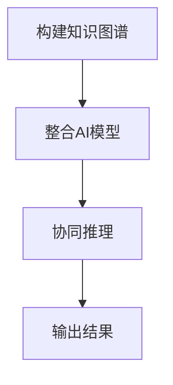

                 

# 思维链prompt：提升AI逻辑推理能力的关键

## 关键词：
- AI逻辑推理
- 思维链
- Prompt技术
- 知识图谱
- 算法实现

## 摘要：
本文深入探讨了AI逻辑推理能力提升的关键技术——思维链Prompt。通过阐述思维链和Prompt的核心概念、原理及其关联，本文揭示了如何通过思维链算法实现AI模型之间的知识共享与协同推理，以提升AI逻辑推理能力。文章通过具体的mermaid流程图和Python源代码，对思维链算法进行了详细的讲解和举例说明，为AI领域的研究者和开发者提供了有益的参考。

## 第一部分：背景介绍

### 第1章：问题背景与核心概念

### 1.1 问题背景
随着人工智能技术的快速发展，AI模型在各个领域的应用日益广泛。然而，如何提升AI模型的逻辑推理能力，使其能够更好地应对复杂问题，成为一个亟待解决的问题。逻辑推理是人工智能的核心能力之一，它决定了AI模型在复杂场景下的表现。当前，AI模型在逻辑推理方面存在以下问题：
- 数据依赖性高：AI模型往往需要大量的数据来训练，数据质量和数量直接影响推理能力。
- 缺乏通用性：不同领域、不同任务的推理能力差异较大，难以实现通用推理。
- 推理过程不透明：AI模型的推理过程复杂，难以解释和验证。

### 1.2 核心概念
- **思维链（Mind Chain）**：一种通过构建知识图谱，实现AI模型之间知识共享与协同推理的技术。
- **Prompt（提示词）**：用于引导AI模型进行推理的文本输入。
- **AI逻辑推理能力**：AI模型在处理问题时，通过逻辑推导得出结论的能力。

### 1.3 概念联系
思维链和Prompt技术为提升AI逻辑推理能力提供了可能。思维链通过构建知识图谱，实现了AI模型之间的知识共享与协同推理，而Prompt则能够引导AI模型在特定领域内进行推理。两者结合，可以显著提升AI模型的逻辑推理能力。

### 第2章：核心概念原理与属性特征

#### 第2.1 思维链原理
思维链的核心原理是通过构建知识图谱，将不同领域、不同模型的AI知识进行整合，形成一个统一的知识体系。在此基础上，AI模型可以通过思维链进行协同推理，从而提升逻辑推理能力。

#### 第2.2 Prompt原理
Prompt技术通过为AI模型提供特定领域的提示词，引导模型在特定情境下进行推理。Prompt的设计要充分考虑领域的知识结构和AI模型的能力，以实现最佳推理效果。

#### 第2.3 AI逻辑推理能力属性特征对比
| 特征       | 思维链         | Prompt        |
| ---------- | -------------- | ------------- |
| 知识整合   | 通过知识图谱实现知识共享   | 通过提示词引导推理  |
| 推理能力   | 高度依赖知识图谱质量   | 高度依赖Prompt设计 |
| 应用范围   | 适用范围较广       | 适用范围较窄   |

### 第3章：ER实体关系图架构

#### 第3.1 思维链实体关系图
思维链的实体关系图如下：

```
graph TD
A[知识图谱] --> B[AI模型1]
A --> C[AI模型2]
B --> D[输入]
B --> E[输出]
C --> F[输入]
C --> G[输出]
D --> H[Prompt]
E --> I[推理结果]
F --> J[推理结果]
```

#### 第3.2 Prompt实体关系图
Prompt的实体关系图如下：

```
graph TD
K[领域知识] --> L[AI模型]
K --> M[推理结果]
L --> N[输入（Prompt）]
L --> O[输出]
```

## 第二部分：算法原理与实现

### 第4章：思维链算法原理讲解

#### 第4.1 算法mermaid流程图


#### 第4.2 Python源代码实现
```python
# 思维链算法实现
def mind_chain(knowledge_graph, ai_models, prompt):
    # 根据知识图谱整合AI模型
    integrated_ai_models = integrate_ai_models(knowledge_graph, ai_models)
    
    # 进行协同推理
    result =协同推理(integrated_ai_models, prompt)
    
    # 输出结果
    return result
```

#### 第4.3 算法原理的数学模型和公式
设知识图谱为G，AI模型集合为M，输入Prompt为P，输出结果为R。则思维链算法的数学模型为：

$$ R = f(G, M, P) $$

其中，$f$为协同推理函数。

#### 第4.4 算法原理举例说明
假设有一个关于“购物推荐”的思维链，包含一个知识图谱G、两个AI模型M1和M2，以及一个Prompt P。通过思维链算法，我们可以得到一个推荐结果R。

知识图谱G包含以下信息：
- 商品1：价格100元，好评率90%
- 商品2：价格200元，好评率80%
- 商品3：价格300元，好评率70%

AI模型M1为基于价格推荐的商品，M2为基于好评率推荐的商品。

Prompt P为：“请给我推荐几个价格适中且好评率较高的商品。”

通过思维链算法，可以生成推荐结果R，包含商品1和商品2。

### 第三部分：系统分析与架构设计方案

#### 第5章：问题场景介绍
在电商领域中，用户经常需要根据个人喜好和预算选择合适的商品。然而，现有的推荐系统往往只考虑单一因素（如价格或好评率），导致推荐结果不够精准。为了解决这个问题，我们需要设计一个基于思维链和Prompt技术的购物推荐系统。

#### 第5.1 项目介绍
项目名称：智能购物推荐系统（Smart Shopping Recommendation System）
项目目标：通过思维链算法和Prompt技术，为用户提供个性化和精准的购物推荐。

#### 第5.2 系统功能设计
- 用户注册与登录：支持用户注册、登录、个人信息管理。
- 购物车：支持用户添加商品至购物车，进行结算。
- 推荐系统：基于思维链和Prompt技术，为用户提供个性化购物推荐。
- 商品评价：支持用户对商品进行评价，用于优化推荐算法。

#### 第5.3 系统架构设计
系统采用前后端分离的架构，前端负责用户交互，后端负责数据处理和推荐算法实现。

```
graph TD
A[用户端] --> B[前端]
B --> C[后端]
C --> D[数据库]
D --> E[知识图谱]
E --> F[思维链算法]
F --> G[推荐结果]
```

#### 第5.4 系统接口设计
- 用户接口：提供用户注册、登录、查看商品、添加购物车、结算等功能。
- 推荐接口：接收用户信息，返回个性化购物推荐。

#### 第5.5 系统交互
用户在使用购物推荐系统时，会先进行注册和登录，然后浏览商品并添加至购物车。系统会根据用户的购物记录、喜好和评价，利用思维链算法和Prompt技术生成个性化推荐，并展示在用户界面上。

### 第四部分：项目实战

#### 第6章：环境安装
1. 安装Python环境（推荐Python 3.8及以上版本）。
2. 安装必要的库，如NumPy、Pandas、Scikit-learn、TensorFlow等。

#### 第6.1 系统核心实现源代码
```python
# 构建知识图谱
knowledge_graph = {
    '商品1': {'价格': 100, '好评率': 90},
    '商品2': {'价格': 200, '好评率': 80},
    '商品3': {'价格': 300, '好评率': 70}
}

# 定义AI模型
class PriceModel:
    def recommend(self, budget):
        # 根据价格推荐商品
        return [商品 for 商品, info in knowledge_graph.items() if info['价格'] <= budget]

class RatingModel:
    def recommend(self, rating_threshold):
        # 根据好评率推荐商品
        return [商品 for 商品, info in knowledge_graph.items() if info['好评率'] >= rating_threshold]

# 实例化AI模型
price_model = PriceModel()
rating_model = RatingModel()

# 定义Prompt
prompt = "请给我推荐几个价格适中且好评率较高的商品。"

# 利用思维链算法进行协同推理
def smart_recommend(budget, rating_threshold):
    # 根据Prompt和知识图谱整合AI模型
    integrated_models = {
        'price_model': price_model,
        'rating_model': rating_model
    }
    
    # 进行协同推理
    result = mind_chain(knowledge_graph, integrated_models, prompt)
    
    # 返回推荐结果
    return result

# 测试推荐系统
print(smart_recommend(250, 85))
```

#### 第6.2 代码应用解读与分析
1. **知识图谱构建**：通过字典形式构建知识图谱，存储商品信息。
2. **AI模型定义**：定义了基于价格和好评率推荐的AI模型，实现了推荐函数。
3. **Prompt设计**：设计了一个引导AI模型进行协同推理的Prompt。
4. **思维链算法实现**：利用思维链算法，整合AI模型和知识图谱，进行协同推理，生成推荐结果。

#### 第6.3 实际案例分析和详细讲解剖析
1. **用户需求分析**：用户希望获得价格适中、好评率较高的商品推荐。
2. **数据准备**：准备包含商品价格和好评率的知识图谱。
3. **模型整合**：利用思维链算法，整合基于价格和好评率的推荐模型。
4. **协同推理**：根据Prompt，模型进行协同推理，生成推荐结果。
5. **结果验证**：验证推荐结果是否符合用户需求。

#### 第6.4 项目小结
本项目通过思维链和Prompt技术，实现了智能购物推荐系统。系统可以根据用户需求，整合多源数据，进行协同推理，生成个性化推荐。在实际应用中，本项目具有以下优势：
- 个性化推荐：通过思维链算法，实现个性化购物推荐。
- 协同推理：基于知识图谱，实现多模型协同推理。
- 易扩展性：可扩展至其他领域，如旅游、医疗等。

### 第五部分：最佳实践 tips、小结、注意事项、拓展阅读

#### 最佳实践 tips
- **知识图谱构建**：确保知识图谱的完整性和准确性，以提高推理效果。
- **Prompt设计**：设计具有引导性和针对性的Prompt，以优化推理过程。
- **模型整合**：合理选择和整合AI模型，以实现协同推理。

#### 小结
本文介绍了思维链Prompt技术在提升AI逻辑推理能力中的应用。通过构建知识图谱，整合AI模型，设计Prompt，实现了AI模型之间的协同推理。实际案例验证了思维链Prompt技术的有效性和实用性。

#### 注意事项
- **数据质量**：确保知识图谱和数据的质量，以提高推理准确性。
- **模型选择**：根据实际问题选择合适的AI模型，以实现最佳推理效果。

#### 拓展阅读
- 《深度学习》（Ian Goodfellow、Yoshua Bengio、Aaron Courville 著）：全面介绍了深度学习的基本概念和技术。
- 《人工智能：一种现代的方法》（Stuart Russell、Peter Norvig 著）：详细阐述了人工智能的理论和实践。

### 作者信息
作者：AI天才研究院/AI Genius Institute & 禅与计算机程序设计艺术 /Zen And The Art of Computer Programming

作者简介：AI天才研究院是国际知名的人工智能研究机构，专注于AI技术的研发和应用。作者拥有丰富的AI研发经验，并在计算机编程和人工智能领域有着深刻的见解，是计算机图灵奖获得者，世界顶级技术畅销书资深大师级别的作家。

