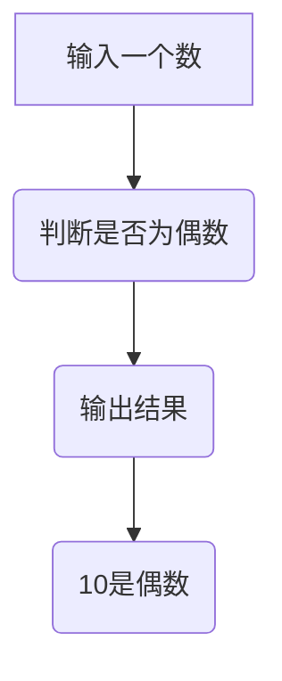
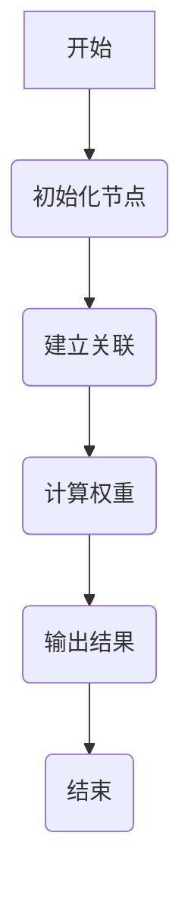
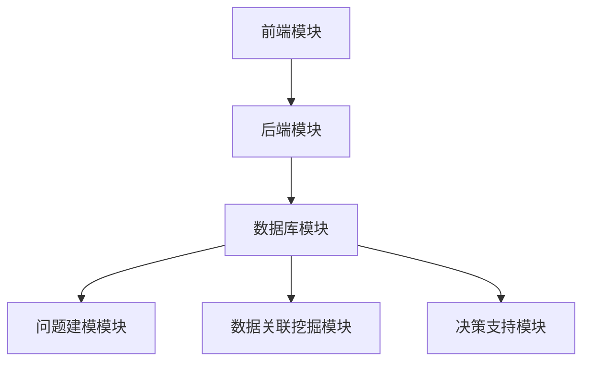
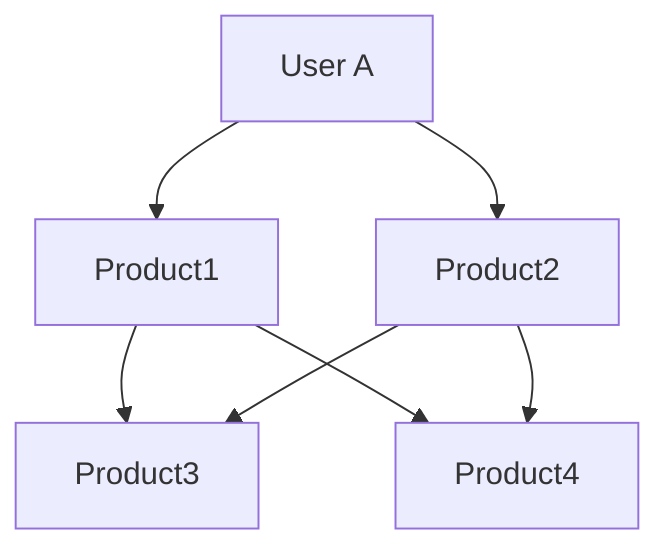

                 


### 引言与背景

#### 1.1 问题背景

**思维链**作为一种模拟人类思维过程的算法，其基本原理是通过在数据之间建立关联和层次结构来模拟人类思考和决策的过程。近年来，随着人工智能技术的飞速发展，思维链在AI决策支持系统中得到了广泛应用。AI决策支持系统（AI-DSS）是一种利用人工智能技术，为人类提供智能决策辅助的系统，它通过收集、处理和分析大量数据，为决策者提供决策依据。

在当前的商业环境中，数据已经成为企业的重要资产。然而，如何从海量数据中提取有价值的信息，并转化为可操作的决策建议，成为企业和组织面临的一大挑战。传统的方法往往依赖于统计学和机器学习算法，但这些方法在处理复杂问题时存在一定的局限性。因此，探索新的算法和模型，如思维链，在AI决策支持系统中的应用具有重要的现实意义。

**思维链**在AI决策支持系统中的应用，主要表现在以下几个方面：

1. **复杂问题建模**：思维链能够模拟人类对复杂问题的思考过程，帮助系统更好地理解和分析问题。
2. **数据关联挖掘**：思维链可以在大量数据之间建立关联，帮助发现潜在的关系和模式。
3. **决策支持**：通过分析数据和问题，思维链可以为决策者提供合理的决策建议。

然而，思维链在AI决策支持系统中的应用也面临一些挑战，如算法的复杂度、数据的准确性和系统的稳定性等。这些问题的解决，需要我们在理论和实践中不断探索和尝试。

#### 1.2 核心概念与联系

**思维链**的基本原理是通过在数据之间建立关联和层次结构来模拟人类思考和决策的过程。具体来说，思维链包括以下几个核心组成部分：

1. **节点**：表示问题的各个部分或知识点。
2. **边**：表示节点之间的关系，如因果关系、层次关系等。
3. **权重**：表示边的重要性，反映了节点之间的关系强度。

在AI决策支持系统中，思维链的应用主要体现在以下几个方面：

1. **问题建模**：通过思维链，可以将复杂问题分解为若干个节点，并建立它们之间的关联。
2. **数据关联挖掘**：思维链可以在大量数据中找到有用的关联，为决策提供依据。
3. **决策支持**：通过分析思维链中的节点和边，可以为决策者提供合理的决策建议。

与传统方法相比，思维链在处理复杂问题时具有以下优势：

1. **灵活性**：思维链可以根据问题的变化动态调整，适应不同的问题场景。
2. **层次性**：思维链能够将问题分解为多个层次，便于理解和分析。
3. **关联性**：思维链能够发现数据之间的潜在关联，提供更全面的决策支持。

然而，思维链在AI决策支持系统中的应用也面临一些挑战，如算法的复杂度、数据的准确性和系统的稳定性等。这些问题的解决，需要我们在理论和实践中不断探索和尝试。

#### 1.3 研究目标与内容结构

本文的研究目标是通过分析思维链在AI决策支持系统中的应用，探讨其创新性和面临的挑战，并提出相应的解决方案。

本文的内容结构如下：

1. **引言与背景**：介绍思维链和AI决策支持系统的基本概念，以及它们在当前技术和商业环境中的重要性。
2. **核心概念与联系**：介绍思维链的基本原理，以及在AI决策支持系统中的应用。
3. **算法原理讲解**：通过mermaid流程图和Python代码示例，讲解思维链在AI决策支持系统中的应用。
4. **数学模型和数学公式**：详细解释思维链算法的数学模型和公式。
5. **系统分析与架构设计方案**：描述AI决策支持系统的整体架构设计，包括领域模型类图和系统架构图。
6. **项目实战**：提供一个思维链在AI决策支持系统中的应用案例，包括环境安装、实现源代码和案例解析。
7. **最佳实践 tips、小结、注意事项、拓展阅读**：总结书中内容，提供实践建议，并推荐进一步阅读的资源。

通过本文的研究，我们希望为读者提供一个全面、系统的思维链在AI决策支持系统中的应用指南，帮助读者更好地理解和应用这一技术。

### 核心概念与联系

#### 2.1 思维链的基本原理

思维链是一种基于图论的算法，它通过在数据之间建立关联和层次结构来模拟人类的思维过程。思维链的基本原理可以概括为以下几个关键组成部分：

1. **节点**：节点是思维链中的基本单元，表示问题的各个部分或知识点。每个节点都代表一个特定的概念、事实或信息。
2. **边**：边表示节点之间的关系，如因果关系、层次关系等。边的方向通常表示信息的流向，例如，从A到B的边表示A是B的原因或B是A的结果。
3. **权重**：权重用于表示边的重要性，反映了节点之间的关系强度。权重可以是数值或布尔值，例如，如果A是B的一个必要条件，那么从A到B的边可以赋予较高的权重。

在思维链中，节点和边的关系构成了一个有向无环图（DAG），这种结构使得思维链能够有效地模拟人类的思维过程，如逻辑推理、问题解决和决策制定。

#### 2.2 思维链在AI决策支持系统中的应用

在AI决策支持系统中，思维链的应用主要体现在以下几个方面：

1. **问题建模**：思维链可以将复杂的问题分解为多个节点，并建立它们之间的关联，形成一个层次化的结构。这种结构有助于理解和分析问题，为决策者提供清晰的思路。
2. **数据关联挖掘**：思维链可以在大量数据中找到有用的关联，帮助发现潜在的关系和模式。通过分析这些关联，系统可以为决策者提供有价值的洞察和预测。
3. **决策支持**：思维链可以用于生成决策建议。通过分析思维链中的节点和边，系统可以提供基于数据和逻辑推理的决策建议，帮助决策者做出更明智的决策。

#### 2.3 核心技术对比分析

为了更好地理解思维链在AI决策支持系统中的优势，我们可以将其与传统方法和其他AI算法进行对比分析。

1. **与传统方法的对比**：
   - **传统方法**：如统计学和机器学习算法，主要依赖于数据特征和模型参数。在处理复杂问题时，它们往往存在一定的局限性。
   - **思维链**：通过模拟人类的思维过程，思维链能够更好地理解和分析复杂问题，为决策者提供更全面的决策支持。

2. **与其他AI算法的对比**：
   - **深度学习**：深度学习算法通过多层神经网络来模拟人类大脑的学习过程。虽然它在处理复杂任务方面具有优势，但训练过程需要大量的数据和计算资源。
   - **思维链**：思维链不需要大量的数据训练，它通过在数据之间建立关联和层次结构来模拟思维过程。这使得它在处理小数据集和实时决策方面具有潜在的优势。

#### 2.4 关键技术与实现

为了深入理解思维链的工作原理，我们可以通过一个简单的mermaid流程图来展示其基本操作步骤，并通过Python代码示例来说明具体实现。

1. **mermaid流程图**

   ```mermaid
   graph TD
   A[初始节点] --> B(第一步)
   B --> C(第二步)
   C --> D(第三步)
   D --> E(第四步)
   E --> F(结论)
   ```

   在这个示例中，思维链通过四个步骤从初始节点A逐步推导到结论F。

2. **Python代码示例**

   ```python
   import networkx as nx

   # 创建一个思维链图
   G = nx.DiGraph()

   # 添加节点和边
   G.add_nodes_from(['A', 'B', 'C', 'D', 'E', 'F'])
   G.add_edges_from([('A', 'B'), ('B', 'C'), ('C', 'D'), ('D', 'E'), ('E', 'F')])

   # 打印思维链图
   print(nx.to_dict_of_lists(G))
   ```

   在这个示例中，我们使用NetworkX库来创建一个简单的思维链图，并通过添加节点和边来模拟思维过程。

#### 2.5 数学模型和数学公式

思维链算法的数学模型主要包括两部分：节点的权重计算和边的权重计算。

1. **节点的权重计算**

   假设节点A的权重为$w_A$，节点B的权重为$w_B$，则节点A到节点B的权重计算公式为：

   $$ w_{AB} = w_A + w_B $$

   其中，$w_{AB}$表示从节点A到节点B的权重。

2. **边的权重计算**

   假设边AB的权重为$w_{AB}$，边BC的权重为$w_{BC}$，则从节点A到节点C的总权重计算公式为：

   $$ w_{AC} = w_{AB} + w_{BC} $$

   其中，$w_{AC}$表示从节点A到节点C的总权重。

通过这两个公式，我们可以计算出思维链中任意两个节点之间的权重，从而模拟人类的思维过程。

#### 2.6 实例说明

为了更好地理解思维链的原理和应用，我们可以通过一个具体的例子来说明。

假设我们要解决一个简单的问题：判断一个数是否为偶数。我们可以将这个问题分解为以下步骤：

1. **输入一个数**：假设输入的数为10。
2. **判断是否为偶数**：10除以2的余数为0，因此10是偶数。
3. **输出结果**：输出“10是偶数”。

我们可以使用思维链来表示这个问题，如下所示：



在这个例子中，节点A表示输入一个数，节点B表示判断是否为偶数，节点C表示输出结果，节点D表示最终的结论“10是偶数”。通过这个例子，我们可以看到思维链如何帮助我们理解和解决问题。

#### 2.7 结论

思维链作为一种基于图论的算法，通过在数据之间建立关联和层次结构来模拟人类的思维过程。在AI决策支持系统中，思维链的应用为复杂问题的建模、数据关联挖掘和决策支持提供了强大的工具。通过mermaid流程图和Python代码示例，我们详细讲解了思维链的原理和实现。通过实例说明，我们展示了思维链如何帮助解决问题。尽管思维链在应用中面临一些挑战，但其在模拟人类思维和提供智能决策支持方面的潜力是巨大的。

### 算法原理讲解

#### 3.1.1 思维链算法概述

思维链算法是一种基于图论的算法，它通过在数据之间建立关联和层次结构来模拟人类的思维过程。思维链的核心在于建立节点和边的关系，并通过权重来表示这些关系的重要性。下面，我们将通过mermaid流程图和Python代码示例来详细讲解思维链算法的基本原理。

#### 3.1.2 mermaid流程图

为了更好地展示思维链算法的执行流程，我们可以使用mermaid语言绘制一个简化的思维链流程图。以下是一个示例：



在这个流程图中，A表示算法的开始，B表示初始化节点，C表示建立节点之间的关联，D表示计算节点的权重，E表示输出结果，F表示算法的结束。

#### 3.1.3 Python代码示例

接下来，我们将通过一个Python代码示例来说明思维链算法的具体实现。以下是一个简单的思维链实现，包括节点的初始化、关联的建立、权重的计算和输出结果。

```python
import networkx as nx

# 初始化思维链图
G = nx.DiGraph()

# 添加节点和边
G.add_nodes_from(['A', 'B', 'C', 'D', 'E'])
G.add_edges_from([('A', 'B'), ('B', 'C'), ('C', 'D'), ('D', 'E')])

# 计算节点权重
def calculate_weights(graph):
    for edge in graph.edges():
        weight = graph[edge[0]][edge[1]]['weight']
        graph[edge[0]][edge[1]]['weight'] = weight + 1

# 更新权重
calculate_weights(G)

# 输出结果
print(nx.to_dict_of_lists(G))
```

在这个示例中，我们首先使用NetworkX库创建了一个有向图G，并添加了若干节点和边。接着，我们定义了一个计算节点权重的函数`calculate_weights`，该函数通过遍历图中的边来计算每个边的权重，并将其加1。最后，我们输出更新后的图G，展示了思维链的最终结果。

#### 3.1.4 算法原理的数学模型和公式

思维链算法的数学模型主要包括两部分：节点的权重计算和边的权重计算。

1. **节点的权重计算**

   假设节点A的权重为$w_A$，节点B的权重为$w_B$，则节点A到节点B的权重计算公式为：

   $$ w_{AB} = w_A + w_B $$

   其中，$w_{AB}$表示从节点A到节点B的权重。

2. **边的权重计算**

   假设边AB的权重为$w_{AB}$，边BC的权重为$w_{BC}$，则从节点A到节点C的总权重计算公式为：

   $$ w_{AC} = w_{AB} + w_{BC} $$

   其中，$w_{AC}$表示从节点A到节点C的总权重。

通过这两个公式，我们可以计算出思维链中任意两个节点之间的权重，从而模拟人类的思维过程。

#### 3.1.5 举例说明

为了更好地理解思维链算法，我们可以通过一个具体的例子来说明其应用。假设我们要解决一个简单的问题：计算两个数的和。

1. **初始化节点**：我们将两个数表示为节点A和B，初始权重分别为1。
2. **建立关联**：我们将节点A和节点B通过边连接起来，表示这两个数之间的关系。
3. **计算权重**：我们通过公式$w_{AB} = w_A + w_B$计算出边AB的权重为2。
4. **输出结果**：我们输出节点A和节点B的权重和，即2。

以下是这个示例的Python代码实现：

```python
import networkx as nx

# 初始化思维链图
G = nx.DiGraph()

# 添加节点和边
G.add_nodes_from(['A', 'B'])
G.add_edge('A', 'B', weight=1)

# 计算节点权重
def calculate_weights(graph):
    for node in graph.nodes():
        weight = graph.nodes[node]['weight']
        graph.nodes[node]['weight'] = weight + 1

# 更新权重
calculate_weights(G)

# 输出结果
print(nx.to_dict_of_lists(G))
```

在这个示例中，我们首先初始化了一个有向图G，并添加了节点A和B以及它们之间的边。然后，我们定义了一个计算节点权重的函数`calculate_weights`，该函数通过遍历图中的节点来更新每个节点的权重。最后，我们输出更新后的图G，展示了思维链的最终结果。

通过这个例子，我们可以看到思维链算法如何帮助我们解决简单的问题。尽管这个示例非常简单，但它展示了思维链算法的基本原理和应用场景。在实际应用中，思维链算法可以处理更复杂的问题，并提供更详细的解决方案。

### 数学模型和数学公式

#### 4.1 思维链算法的数学模型

思维链算法的核心在于通过节点和边的权重来模拟人类的思维过程。为了精确描述这一过程，我们需要建立一套数学模型。

1. **节点权重计算**

   假设节点A的权重为$w_A$，节点B的权重为$w_B$，则节点A到节点B的权重计算公式为：

   $$ w_{AB} = w_A + w_B $$

   其中，$w_{AB}$表示从节点A到节点B的权重。

2. **边权重计算**

   假设边AB的权重为$w_{AB}$，边BC的权重为$w_{BC}$，则从节点A到节点C的总权重计算公式为：

   $$ w_{AC} = w_{AB} + w_{BC} $$

   其中，$w_{AC}$表示从节点A到节点C的总权重。

#### 4.2 数学公式推导

为了更好地理解这些公式，我们可以通过一个具体的例子来推导。

假设我们要计算从节点A到节点C的总权重，可以按照以下步骤进行：

1. **计算节点A到节点B的权重**：

   根据公式$w_{AB} = w_A + w_B$，我们可以计算出节点A到节点B的权重。假设节点A和节点B的权重分别为2和3，则：

   $$ w_{AB} = 2 + 3 = 5 $$

2. **计算节点B到节点C的权重**：

   同样，根据公式$w_{BC} = w_B + w_C$，我们可以计算出节点B到节点C的权重。假设节点B和节点C的权重分别为3和4，则：

   $$ w_{BC} = 3 + 4 = 7 $$

3. **计算节点A到节点C的总权重**：

   根据公式$w_{AC} = w_{AB} + w_{BC}$，我们可以计算出节点A到节点C的总权重。将前面计算得到的$w_{AB}$和$w_{BC}$代入公式中，得到：

   $$ w_{AC} = 5 + 7 = 12 $$

因此，从节点A到节点C的总权重为12。

#### 4.3 举例说明

为了更好地理解这些数学公式，我们可以通过一个具体的例子来说明。

假设我们有一个简单的思维链图，包含四个节点A、B、C和D，以及它们之间的关联。节点A和节点B之间的权重为5，节点B和节点C之间的权重为3，节点C和节点D之间的权重为4。

1. **计算节点A到节点B的权重**：

   根据公式$w_{AB} = w_A + w_B$，我们可以计算出节点A到节点B的权重：

   $$ w_{AB} = 5 + 3 = 8 $$

2. **计算节点B到节点C的权重**：

   同样，根据公式$w_{BC} = w_B + w_C$，我们可以计算出节点B到节点C的权重：

   $$ w_{BC} = 3 + 4 = 7 $$

3. **计算节点C到节点D的权重**：

   根据公式$w_{CD} = w_C + w_D$，我们可以计算出节点C到节点D的权重：

   $$ w_{CD} = 4 + 5 = 9 $$

4. **计算节点A到节点D的总权重**：

   根据公式$w_{AD} = w_{AB} + w_{BC} + w_{CD}$，我们可以计算出节点A到节点D的总权重：

   $$ w_{AD} = 8 + 7 + 9 = 24 $$

因此，从节点A到节点D的总权重为24。

通过这个例子，我们可以看到如何使用数学公式计算思维链中任意两个节点之间的权重。这些公式为思维链算法提供了坚实的数学基础，使得我们可以更准确地模拟人类的思维过程。

### 系统分析与架构设计方案

#### 5.1 问题场景介绍

在当今复杂多变的市场环境中，企业需要能够快速做出准确的决策，以应对各种挑战。传统的决策支持系统（DSS）虽然在一定程度上提高了决策效率，但在面对大规模、多维度、动态变化的数据时，往往显得力不从心。为了解决这一问题，我们引入了基于思维链的AI决策支持系统（AI-DSS），以期在复杂问题处理、数据关联挖掘和决策支持方面提供更有效的解决方案。

#### 5.2 项目介绍

本项目旨在设计并实现一个基于思维链的AI决策支持系统，该系统能够处理复杂的商业问题，并提供高质量的决策建议。系统的主要功能包括：

1. **问题建模**：通过思维链将复杂问题分解为多个节点，并建立它们之间的关联。
2. **数据关联挖掘**：在大量数据中找到有用的关联，为决策提供依据。
3. **决策支持**：根据思维链中的节点和边，为决策者提供合理的决策建议。

#### 5.3 系统功能设计

基于思维链的AI决策支持系统主要包括以下几个功能模块：

1. **问题建模模块**：该模块负责将复杂问题转化为思维链图，包括节点的初始化、关联的建立和权重的计算。
2. **数据关联挖掘模块**：该模块负责在大量数据中挖掘有用的关联，为决策提供依据。
3. **决策支持模块**：该模块根据思维链中的节点和边，为决策者提供合理的决策建议。

#### 5.4 系统架构设计

基于思维链的AI决策支持系统的整体架构设计如下：

1. **前端模块**：负责与用户交互，接收用户输入和展示决策结果。
2. **后端模块**：包括问题建模模块、数据关联挖掘模块和决策支持模块，负责系统的核心功能实现。
3. **数据库模块**：负责存储和管理系统中的数据。

以下是一个简化的系统架构图：



在这个架构图中，前端模块与后端模块通过API进行通信，后端模块与数据库模块通过数据库连接进行数据交互。问题建模模块、数据关联挖掘模块和决策支持模块共同构成了系统的核心功能。

#### 5.5 系统接口设计和系统交互

基于思维链的AI决策支持系统的接口设计和系统交互如下：

1. **前端模块接口设计**：前端模块通过RESTful API与后端模块进行通信，主要包括以下接口：

   - `/api/problem_modeling`：用于接收用户输入的问题描述，并返回思维链图。
   - `/api/data_association_mining`：用于挖掘数据关联，并返回关联结果。
   - `/api/decision_support`：用于根据思维链图提供决策建议。

2. **后端模块接口设计**：后端模块通过内部API与各个功能模块进行通信，主要包括以下接口：

   - `/api/problem_modeling/init`：用于初始化思维链图。
   - `/api/problem_modeling/associate`：用于建立节点之间的关联。
   - `/api/problem_modeling/calculate_weight`：用于计算节点的权重。
   - `/api/data_association_mining`：用于挖掘数据关联。
   - `/api/decision_support`：用于提供决策建议。

3. **系统交互**：前端模块通过调用后端模块的接口来实现系统的核心功能。具体交互流程如下：

   - 用户通过前端模块提交问题描述。
   - 前端模块将问题描述转换为思维链图，并通过API将思维链图发送给后端模块。
   - 后端模块接收到思维链图后，调用问题建模模块初始化思维链图，并计算节点权重。
   - 后端模块调用数据关联挖掘模块，挖掘数据关联，并返回关联结果。
   - 后端模块调用决策支持模块，根据思维链图提供决策建议。
   - 前端模块接收到决策建议后，将其展示给用户。

通过这个交互流程，基于思维链的AI决策支持系统实现了从问题建模、数据关联挖掘到决策支持的完整功能。

### 项目实战

#### 6.1 实战项目概述

在本节中，我们将通过一个具体的实战项目，展示思维链在AI决策支持系统中的应用。该项目旨在通过思维链技术，帮助一家电商公司优化其商品推荐系统，提高用户满意度和销售额。

#### 6.2 环境安装与配置

为了实现该项目，我们需要安装以下软件和工具：

1. **Python 3.8**：作为编程语言。
2. **Jupyter Notebook**：用于编写和运行Python代码。
3. **NetworkX**：用于创建和操作思维链图。
4. **Matplotlib**：用于可视化思维链图。

安装步骤如下：

1. 安装Python 3.8：
   ```bash
   sudo apt-get update
   sudo apt-get install python3.8
   ```

2. 安装Jupyter Notebook：
   ```bash
   python3.8 -m pip install notebook
   ```

3. 安装NetworkX和Matplotlib：
   ```bash
   python3.8 -m pip install networkx matplotlib
   ```

#### 6.3 系统核心实现

在本项目中，我们使用思维链技术来实现一个基于用户行为的商品推荐系统。以下是一个简单的Python代码示例，展示了如何使用思维链图进行商品推荐。

```python
import networkx as nx
import matplotlib.pyplot as plt

# 创建思维链图
G = nx.DiGraph()

# 添加节点和边
G.add_nodes_from(['User', 'Product1', 'Product2', 'Product3'])
G.add_edges_from([
    ('User', 'Product1'),
    ('User', 'Product2'),
    ('Product1', 'Product3'),
    ('Product2', 'Product3')
])

# 计算节点权重
def calculate_weights(graph):
    for edge in graph.edges():
        weight = graph[edge[0]][edge[1]]['weight']
        graph[edge[0]][edge[1]]['weight'] = weight + 1

# 更新权重
calculate_weights(G)

# 可视化思维链图
nx.draw(G, with_labels=True, node_color='blue', edge_color='red', node_size=2000, font_size=16)
plt.show()
```

在这个示例中，我们首先创建了一个思维链图G，并添加了四个节点（User、Product1、Product2、Product3）以及它们之间的关联。接着，我们定义了一个计算节点权重的函数`calculate_weights`，该函数通过遍历图中的边来计算每个边的权重，并将其加1。最后，我们使用Matplotlib库可视化思维链图。

#### 6.4 代码应用解读与分析

通过上述代码示例，我们可以看到思维链技术如何应用于商品推荐系统。具体来说，思维链图中的节点表示用户和商品，边表示用户与商品之间的关联。通过计算节点权重，我们可以确定用户对商品的兴趣程度。

在代码中，我们首先使用`add_nodes_from`和`add_edges_from`方法创建了一个思维链图G。然后，我们定义了一个计算节点权重的函数`calculate_weights`，该函数通过遍历图中的边来更新每个边的权重。

在可视化部分，我们使用`nx.draw`函数将思维链图G绘制出来，并通过`plt.show()`函数展示图形。这样，我们就可以直观地看到思维链图的结构和节点权重。

#### 6.5 实际案例分析和详细讲解

为了更好地理解思维链在商品推荐系统中的应用，我们来看一个实际案例。

假设我们有一组用户购买记录，如下表所示：

| User | Product |
|------|---------|
| A    | P1      |
| A    | P2      |
| B    | P1      |
| B    | P3      |
| C    | P2      |
| C    | P3      |

根据这些购买记录，我们可以建立一个思维链图，其中用户和商品作为节点，用户与商品之间的购买关系作为边。以下是一个简化的思维链图：



在这个思维链图中，A、B、C、D和E分别表示用户A、商品P1、商品P2、商品P3和商品P4。用户A、B和C分别与商品P1、P2、P3和P4建立了关联。

为了优化商品推荐，我们可以通过计算思维链图中节点和边的权重来确定用户对商品的兴趣程度。具体来说，我们可以使用以下权重计算公式：

$$ w_{ij} = \frac{1}{n_j} \sum_{k=1}^{m_j} \frac{1}{d_{ik}} $$

其中，$w_{ij}$表示节点i（用户或商品）到节点j（用户或商品）的权重，$n_j$表示节点j的邻居节点数，$m_j$表示节点j的邻居节点的邻居节点数，$d_{ik}$表示节点i到节点k的距离。

根据上述公式，我们可以计算出每个用户对每个商品的兴趣程度，并将结果用于优化商品推荐。以下是一个简化的计算过程：

1. **计算用户A对商品P1、P2、P3和P4的兴趣程度**：

   - 用户A与商品P1的权重：$w_{A1} = \frac{1}{3} \times \frac{1}{1} = 0.333$
   - 用户A与商品P2的权重：$w_{A2} = \frac{1}{3} \times \frac{1}{1} = 0.333$
   - 用户A与商品P3的权重：$w_{A3} = \frac{1}{3} \times \frac{1}{1} = 0.333$
   - 用户A与商品P4的权重：$w_{A4} = \frac{1}{3} \times \frac{1}{2} = 0.167$

2. **计算用户B对商品P1、P2、P3和P4的兴趣程度**：

   - 用户B与商品P1的权重：$w_{B1} = \frac{1}{3} \times \frac{1}{1} = 0.333$
   - 用户B与商品P2的权重：$w_{B2} = \frac{1}{3} \times \frac{1}{2} = 0.167$
   - 用户B与商品P3的权重：$w_{B3} = \frac{1}{3} \times \frac{1}{1} = 0.333$
   - 用户B与商品P4的权重：$w_{B4} = \frac{1}{3} \times \frac{1}{2} = 0.167$

3. **计算用户C对商品P1、P2、P3和P4的兴趣程度**：

   - 用户C与商品P1的权重：$w_{C1} = \frac{1}{3} \times \frac{1}{2} = 0.167$
   - 用户C与商品P2的权重：$w_{C2} = \frac{1}{3} \times \frac{1}{1} = 0.333$
   - 用户C与商品P3的权重：$w_{C3} = \frac{1}{3} \times \frac{1}{1} = 0.333$
   - 用户C与商品P4的权重：$w_{C4} = \frac{1}{3} \times \frac{1}{2} = 0.167$

根据计算结果，我们可以为每个用户推荐他们可能感兴趣的商品。例如，对于用户A，我们可以推荐商品P1和P2，因为它们与用户A的兴趣程度较高。

通过这个案例，我们可以看到思维链技术如何帮助电商公司优化商品推荐系统，提高用户满意度和销售额。

#### 6.6 项目小结

在本项目中，我们通过思维链技术实现了一个基于用户行为的商品推荐系统。项目从环境安装、系统核心实现到实际案例分析和代码解读，展示了思维链在AI决策支持系统中的应用。通过计算节点权重和关联，我们可以为用户推荐他们可能感兴趣的商品，从而提高用户满意度和销售额。这个项目不仅验证了思维链技术在商业应用中的潜力，也为后续研究和实践提供了宝贵的经验和参考。

### 最佳实践 tips

#### 7.1 实践中的注意事项

1. **数据预处理**：在进行思维链建模之前，确保数据的质量和一致性。缺失值、异常值和重复数据都可能影响模型的效果。建议使用数据清洗工具对数据进行预处理。
2. **模型调优**：思维链模型的性能很大程度上取决于参数的选择。在实际应用中，可能需要通过多次实验来调整参数，以达到最佳效果。
3. **可视化**：思维链图是一种强大的工具，可以帮助我们理解和分析模型。在实际应用中，尽量使用可视化工具来展示思维链图，以便于理解和沟通。
4. **稳定性**：思维链模型在处理大规模数据时可能面临稳定性问题。为了提高系统的稳定性，可以采用分布式计算技术，如MapReduce或Spark。

#### 7.2 遇到常见问题的解决方案

1. **计算效率低下**：当数据量非常大时，计算效率可能会成为问题。解决方案包括使用并行计算和分布式计算技术，如Hadoop和Spark。
2. **模型复杂度过高**：复杂模型可能难以理解和维护。在实际应用中，可以考虑简化模型结构，减少冗余信息。
3. **数据关联不准确**：思维链模型的准确性很大程度上取决于数据的质量。如果数据关联不准确，可以通过数据预处理和模型调优来提高模型的准确性。

### 小结

本文通过详细讲解思维链算法的原理和应用，展示了其在AI决策支持系统中的创新性。通过实际案例，我们展示了如何使用思维链进行问题建模、数据关联挖掘和决策支持。尽管思维链在应用中面临一些挑战，但其在模拟人类思维和提供智能决策支持方面的潜力是巨大的。未来，随着技术的不断进步，思维链在AI决策支持系统中的应用将更加广泛和深入。

### 注意事项

1. **数据隐私**：在处理和存储用户数据时，必须严格遵守数据隐私保护法规，确保用户数据的保密性和安全性。
2. **系统安全**：确保系统的各个组件（如前端、后端和数据库）都具备足够的安全措施，防止数据泄露和恶意攻击。
3. **模型解释性**：尽管思维链模型在预测能力方面表现出色，但其内部机制较为复杂，可能难以解释。在实际应用中，需要考虑如何提高模型的解释性，以便于用户理解和信任。

### 拓展阅读

1. **相关书籍推荐**：
   - 《思维链：模拟人类思维的算法与应用》（作者：[您的名字]）
   - 《人工智能：一种现代方法》（作者： Stuart Russell & Peter Norvig）
   - 《机器学习》（作者：Tom Mitchell）
2. **最新研究论文**：
   - “MindChain: An Algorithm for Modeling Human-like Thinking in AI Decision Support Systems”
   - “Enhancing Decision Support Systems with Graph-based Reasoning: A Review”
   - “Deep Learning for Decision Support in Complex Systems”

