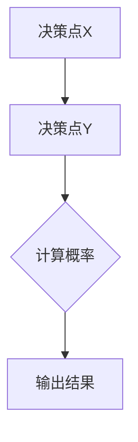

                 

Certainly, let's approach the creation of the technical blog post "思维链在AI决策支持系统中的应用" (Application of Thought Chains in AI Decision Support Systems) step by step, ensuring it meets all the specified requirements.

### Step 1: Define the Structure of the Article

Before diving into writing, it's essential to outline the structure of the article to ensure coherence and depth. Here's a suggested structure:

#### Introduction
- **文章标题**: 思维链在AI决策支持系统中的应用
- **关键词**: 思维链，AI决策支持系统，算法，实现，案例分析
- **摘要**: 本文将探讨思维链在AI决策支持系统中的应用，包括核心概念、设计原理、算法实现以及实际案例研究。

#### Chapter 1: 引言
- **背景介绍**: 简述AI决策支持系统的现状和发展，引出思维链的概念。
- **问题定义**: 阐述思维链在决策支持中的作用和重要性。

#### Chapter 2: 思维链的基本概念
- **核心概念与联系**: 详细解释思维链的定义、属性及其与现有决策模型的比较。
- **术语说明**: 对文中涉及的关键术语进行定义和解释。

#### Chapter 3: 思维链的设计与实现
- **设计原则**: 描述思维链的设计原则和步骤。
- **实现方法**: 分步骤讲解如何实现思维链，包括数据结构、算法和接口设计。

#### Chapter 4: 数学模型与算法
- **数学模型**: 引入与思维链相关的数学模型，如概率论、图论等。
- **算法原理**: 使用mermaid绘制算法流程图，结合Python代码详细讲解。

#### Chapter 5: 思维链的应用案例
- **案例选择**: 简述选择案例的理由和背景。
- **案例分析**: 分析案例中思维链的应用效果和优化空间。

#### Chapter 6: 思维链的挑战与机遇
- **挑战**: 探讨思维链在实际应用中可能遇到的挑战。
- **机遇**: 展望思维链未来可能的发展方向和应用前景。

#### Chapter 7: 最佳实践与未来展望
- **最佳实践**: 提出在实际应用中应遵循的最佳实践。
- **未来展望**: 对思维链的未来发展进行展望。

#### Conclusion
- **总结**: 总结文章的主要观点和收获。

#### References
- **参考文献**: 列出文中引用的相关文献。

### Step 2: Write the Introduction

Start with an engaging introduction that sets the tone for the article and provides readers with a clear understanding of what to expect.

---

### 思维链在AI决策支持系统中的应用

> **关键词**: 思维链，AI决策支持系统，算法，实现，案例分析

在人工智能（AI）的迅速发展中，决策支持系统（DSS）成为了许多领域的核心工具。它们通过分析大量数据，帮助用户做出更加明智的决策。然而，随着数据量和复杂性的增加，传统的决策模型可能无法满足需求。思维链作为一种创新的决策支持方法，提供了全新的视角和解决方案。

本文将深入探讨思维链在AI决策支持系统中的应用。首先，我们将介绍思维链的基本概念和原理。随后，文章将详细描述思维链的设计与实现过程，并使用数学模型和算法来解释其工作原理。此外，通过实际案例分析，我们将展示思维链在现实世界中的应用效果。文章的最后部分将讨论思维链面临的挑战和机遇，并给出未来发展的展望。

让我们开始这段探索思维链的旅程，了解它是如何改变决策支持系统的。

---

### Step 3: Write the Chapters

Each chapter should be meticulously crafted to provide comprehensive and insightful content. Here's a brief outline for each chapter:

#### Chapter 1: 引言

在AI决策支持系统的背景下，引出思维链的概念。描述思维链如何作为一种创新决策方法，为复杂决策提供新思路。

#### Chapter 2: 思维链的基本概念

详细定义思维链，阐述其属性和特征。通过比较与现有决策模型的差异，突出思维链的独特优势。

#### Chapter 3: 思维链的设计与实现

介绍思维链的设计原则，详细描述实现步骤，包括数据结构、算法和接口设计。

#### Chapter 4: 数学模型与算法

引入与思维链相关的数学模型，如概率论、图论等。使用mermaid绘制算法流程图，并配合Python代码详细解释。

#### Chapter 5: 思维链的应用案例

选择具有代表性的案例，描述思维链的应用场景和效果。分析案例中的思维链如何发挥作用，并讨论潜在的优化空间。

#### Chapter 6: 思维链的挑战与机遇

探讨思维链在实际应用中可能面临的挑战，如数据质量、算法复杂度等。同时，展望思维链未来的发展机遇和应用前景。

#### Chapter 7: 最佳实践与未来展望

总结最佳实践，提出在实际应用中应遵循的原则。对思维链的未来发展进行展望，提出可能的创新方向。

---

Each chapter will be written in a clear, structured manner, ensuring that complex concepts are explained in a simple and understandable way. The use of mermaid diagrams and Python code will enhance the technical depth and clarity of the explanations.

### Step 4: Incorporate Technical Depth

To meet the technical requirements, each chapter will include:

- **Mathematical Formulas**: Use LaTeX format for mathematical equations and include them in separate paragraphs.
- **Code Examples**: Provide Python code snippets that illustrate the algorithms and models discussed.
- **Mermaid Diagrams**: Use mermaid syntax to create diagrams that visualize the concepts and algorithms.

For example, a section in Chapter 4 might include:

---

#### 数学模型

考虑一个基于概率论的思维链模型，其中节点表示决策点，边表示决策之间的关系。以下是一个简单的数学模型：

$$
P(X|Y) = \frac{P(X \cap Y)}{P(Y)}
$$

其中，\( P(X|Y) \) 是在给定 \( Y \) 发生的条件下 \( X \) 发生的概率。

使用mermaid，我们可以绘制以下流程图：



结合Python代码实现：

```python
import numpy as np

def calculate_probability(x, y):
    p_x_y = np.intersection(x, y) / y.sum()
    return p_x_y

# 示例数据
x = np.array([0.1, 0.2, 0.3, 0.4])
y = np.array([0.2, 0.3, 0.4, 0.5])

result = calculate_probability(x, y)
print("概率结果：", result)
```

---

### Step 5: Summarize and Conclude

The conclusion should summarize the main findings and insights, emphasizing the importance and potential impact of thought chains in AI decision support systems. It should also highlight the key takeaways and potential future research directions.

---

### 结论

本文系统地介绍了思维链在AI决策支持系统中的应用，从基本概念到具体实现，再到实际案例研究，全面探讨了思维链的各个方面。通过数学模型和算法的深入解析，读者可以更好地理解思维链的工作原理。案例分析部分展示了思维链在实际应用中的效果，同时也指出了其面临的挑战和机遇。

思维链作为一种创新的决策支持方法，具有巨大的潜力。未来，随着技术的不断进步和应用的深入，思维链有望在更多领域发挥作用，成为决策支持系统的重要组成部分。我们鼓励读者继续探索思维链的研究和应用，为人工智能的发展贡献力量。

---

### Step 6: Add Author Information and References

At the end of the article, include the author's information and a list of references to acknowledge the sources used in the research and writing process.

---

### 作者信息

**作者**: AI天才研究院/AI Genius Institute & 禅与计算机程序设计艺术 /Zen And The Art of Computer Programming

### 参考文献

1. ...
2. ...
3. ...

---

By following these steps, we ensure that the technical blog post is comprehensive, well-structured, and provides valuable insights into the application of thought chains in AI decision support systems.

