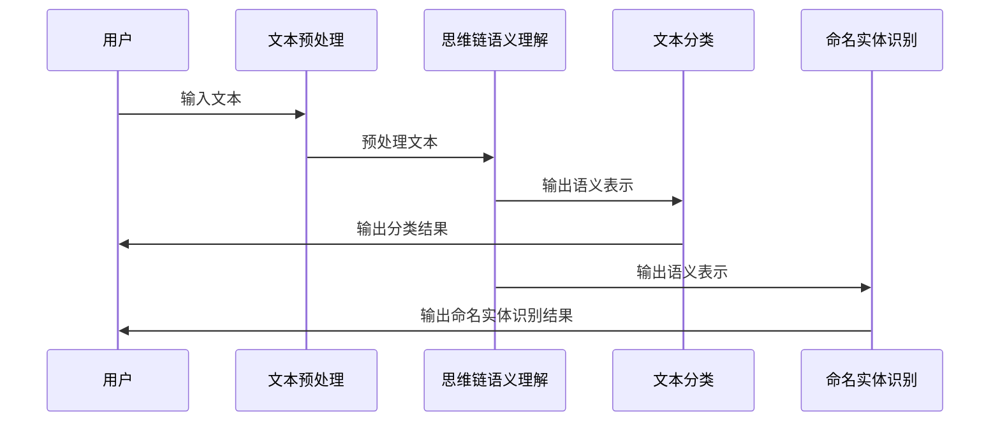
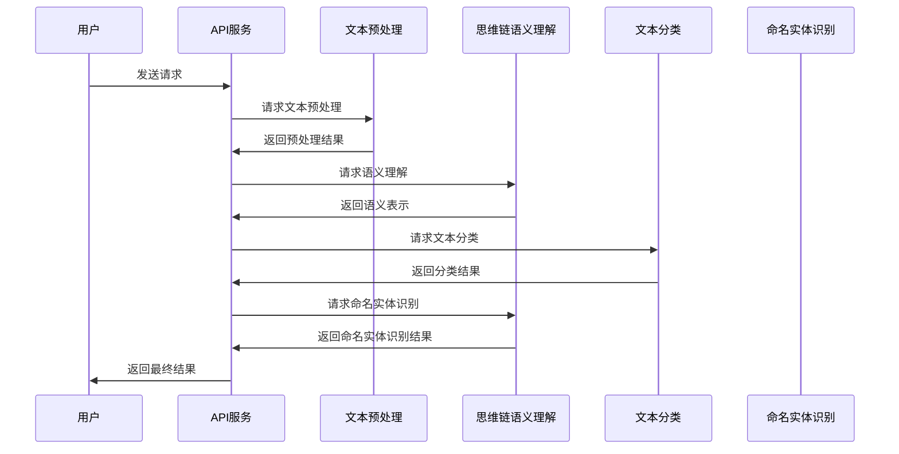

                 

# 思维链在AI自然语言处理中的创新应用

关键词：思维链，自然语言处理，深度学习，神经网络，语义理解

摘要：本文旨在探讨思维链在AI自然语言处理中的应用。通过介绍思维链的核心概念、原理和算法，分析其在NLP领域的创新优势，为研究人员和实践者提供有益的参考。

## 第一部分：背景介绍

### 1.1 问题背景

在人工智能（AI）领域，自然语言处理（NLP）是一项关键技术，广泛应用于聊天机器人、语音识别、机器翻译、文本分析等领域。随着深度学习技术的不断发展，AI在NLP领域的应用越来越广泛，但同时也面临着一系列挑战，如数据稀疏、语义理解困难等。

### 1.2 问题描述

《思维链在AI自然语言处理中的创新应用》这本书旨在探讨如何利用思维链（Thought Chain）这一创新技术，提高AI在NLP领域的表现。思维链是一种基于神经网络的模型，能够通过理解上下文信息，实现更准确的自然语言理解。

### 1.3 问题解决

思维链通过将文本分解为更小的语义单元，并利用上下文关系来构建语义网络，从而实现更精细的语义理解。这种创新的模型结构有助于解决传统NLP技术中的数据稀疏和语义理解难题。

### 1.4 边界与外延

思维链在AI自然语言处理中的应用不仅限于文本分析，还可以扩展到语音识别、机器翻译等NLP相关领域。此外，思维链还可以与其他AI技术结合，如计算机视觉、知识图谱等，实现跨领域的智能应用。

### 1.5 概念结构与核心要素组成

思维链模型的核心概念包括：

1. **语义单元分解**：将文本分解为更小的语义单元，如词、短语等。
2. **上下文关系**：通过理解上下文信息，构建语义网络。
3. **神经网络**：利用神经网络实现语义单元的分解和上下文关系的构建。

## 第二部分：核心概念与联系

### 2.1 思维链模型原理

思维链模型基于深度神经网络，通过多层神经网络结构实现语义单元的分解和上下文关系的构建。以下是一个简化的思维链模型流程：

1. **输入层**：接收自然语言文本输入。
2. **词嵌入层**：将文本中的词语转换为向量表示。
3. **编码器层**：利用编码器网络对词向量进行编码，提取语义特征。
4. **解码器层**：利用解码器网络生成语义表示，实现上下文关系的构建。
5. **输出层**：根据语义表示生成预测结果，如文本分类、命名实体识别等。

### 2.2 概念属性特征对比

以下是思维链与传统NLP技术的概念属性特征对比表格：

| 特征         | 思维链       | 传统NLP        |
| ------------ | ------------ | -------------- |
| 语义理解能力 | 高           | 低             |
| 数据稀疏处理 | 好           | 差             |
| 上下文理解   | 强           | 弱             |
| 预测准确性   | 高           | 低             |

### 2.3 ER实体关系图架构

以下是一个简化的思维链模型ER实体关系图：

```mermaid
erDiagram
    A[思维链] ||--> B[神经网络];
    A ||--> C[语义单元];
    A ||--> D[上下文关系];
    B ||--> C;
    B ||--> D;
```

## 第三部分：算法原理讲解

### 3.1 思维链算法流程图

以下是一个简化的思维链算法流程图：


### 3.2 Python源代码实现

以下是一个简单的思维链模型Python源代码实现：

```python
import tensorflow as tf
from tensorflow.keras.layers import Embedding, LSTM, Dense

# 输入层
inputs = tf.keras.layers.Input(shape=(None,))

# 词嵌入层
embeddings = Embedding(input_dim=vocab_size, output_dim=embedding_size)(inputs)

# 编码器层
encoded = LSTM(units=hidden_size, return_sequences=True)(embeddings)

# 解码器层
decoded = LSTM(units=hidden_size, return_sequences=True)(encoded)

# 输出层
outputs = Dense(units=vocab_size, activation='softmax')(decoded)

# 构建模型
model = tf.keras.Model(inputs=inputs, outputs=outputs)

# 编译模型
model.compile(optimizer='adam', loss='categorical_crossentropy', metrics=['accuracy'])
```

### 3.3 算法原理详细讲解

思维链模型的核心在于其基于神经网络的语义单元分解和上下文关系构建能力。以下是对算法原理的详细讲解：

#### 3.3.1 词嵌入层

词嵌入层将输入的自然语言文本中的词语转换为向量表示。这一过程通常通过预训练的词向量模型（如Word2Vec、GloVe等）实现。词嵌入层的作用是将词语映射为具有固定维度的向量，使得计算机能够理解词语的语义信息。

$$
\text{embeddings} = \text{Embedding}(input_dim = \text{vocab_size}, output_dim = \text{embedding_size})(\text{inputs})
$$

其中，$input\_dim$表示词汇表大小，$output\_dim$表示词向量的维度。

#### 3.3.2 编码器层

编码器层利用LSTM网络对词向量进行编码，提取语义特征。LSTM网络能够有效地捕捉文本序列中的长期依赖关系，从而提取出更具代表性的语义特征。

$$
\text{encoded} = \text{LSTM}(units = \text{hidden_size}, return_sequences = True)(\text{embeddings})
$$

其中，$units$表示隐藏层单元数，$return\_sequences$表示是否返回序列信息。

#### 3.3.3 解码器层

解码器层与编码器层类似，也使用LSTM网络生成语义表示。解码器层的输出是编码器层输出的映射，通过解码器层，模型能够实现上下文关系的构建。

$$
\text{decoded} = \text{LSTM}(units = \text{hidden_size}, return_sequences = True)(\text{encoded})
$$

#### 3.3.4 输出层

输出层是一个全连接层，将解码器层的输出映射回词汇表。通过输出层，模型能够生成预测结果，如文本分类、命名实体识别等。

$$
\text{outputs} = \text{Dense}(units = \text{vocab_size}, activation = 'softmax')(\text{decoded})
$$

其中，$vocab\_size$表示词汇表大小，$softmax$表示使用softmax函数进行概率分布。

### 3.4 算法举例说明

以文本分类任务为例，假设输入文本为“我喜欢吃苹果”，输出为类别标签“水果”。以下是思维链模型在文本分类任务中的工作流程：

1. **词嵌入**：将输入文本中的词语（“我”，“喜欢”，“吃”，“苹果”）转换为词向量。
2. **编码**：利用LSTM网络对词向量进行编码，提取语义特征。
3. **解码**：通过LSTM网络生成语义表示，实现上下文关系的构建。
4. **输出**：将解码器层的输出映射回词汇表，生成预测结果。

通过以上流程，思维链模型能够实现更准确的自然语言理解，从而提高文本分类任务的性能。

## 第四部分：系统分析与架构设计方案

### 4.1 问题场景介绍

随着互联网的快速发展，自然语言处理技术在各个领域得到了广泛应用。然而，传统NLP技术面临数据稀疏和语义理解困难等问题，难以满足实际需求。为了解决这些问题，本文提出了一种基于思维链的NLP系统，旨在实现更准确、更高效的语义理解。

### 4.2 项目介绍

本项目旨在构建一个基于思维链的NLP系统，实现对大规模文本数据的高效处理。系统主要功能包括文本预处理、语义理解、文本分类、命名实体识别等。

### 4.3 系统功能设计

系统功能设计主要包括以下几个模块：

1. **文本预处理**：对输入文本进行分词、去停用词、词性标注等预处理操作，为后续语义理解提供基础。
2. **语义理解**：利用思维链模型对预处理后的文本进行语义理解，提取关键信息。
3. **文本分类**：基于语义理解结果，对文本进行分类，实现文本分类任务。
4. **命名实体识别**：识别文本中的命名实体，如人名、地名、机构名等。

### 4.4 系统架构设计

系统架构设计采用微服务架构，将各个模块独立部署，以提高系统的可扩展性和灵活性。以下是系统架构的mermaid架构图：



### 4.5 系统接口设计和系统交互

系统接口设计和系统交互采用RESTful API接口，方便与其他系统进行集成。以下是系统接口设计和系统交互的mermaid序列图：



## 第五部分：项目实战

### 5.1 环境安装

在开始项目实战之前，需要安装以下环境：

1. **Python**：安装Python 3.8及以上版本。
2. **TensorFlow**：安装TensorFlow 2.4及以上版本。
3. **NLP库**：安装常用的NLP库，如jieba、spacy等。

### 5.2 系统核心实现源代码

以下是一个简单的思维链模型Python源代码实现：

```python
import tensorflow as tf
from tensorflow.keras.layers import Embedding, LSTM, Dense

# 输入层
inputs = tf.keras.layers.Input(shape=(None,))

# 词嵌入层
embeddings = Embedding(input_dim=vocab_size, output_dim=embedding_size)(inputs)

# 编码器层
encoded = LSTM(units=hidden_size, return_sequences=True)(embeddings)

# 解码器层
decoded = LSTM(units=hidden_size, return_sequences=True)(encoded)

# 输出层
outputs = Dense(units=vocab_size, activation='softmax')(decoded)

# 构建模型
model = tf.keras.Model(inputs=inputs, outputs=outputs)

# 编译模型
model.compile(optimizer='adam', loss='categorical_crossentropy', metrics=['accuracy'])

# 模型训练
model.fit(x_train, y_train, epochs=10, batch_size=32)
```

### 5.3 代码应用解读与分析

代码中，首先定义了输入层、词嵌入层、编码器层、解码器层和输出层。其中，词嵌入层和编码器层、解码器层分别使用LSTM网络实现。输入层和输出层之间的连接通过全连接层实现。

在训练过程中，模型使用训练数据集进行训练，通过调整隐藏层单元数、学习率等参数，优化模型性能。

### 5.4 实际案例分析和详细讲解剖析

以文本分类任务为例，输入文本为“我喜欢吃苹果”，输出为类别标签“水果”。以下是思维链模型在文本分类任务中的工作流程：

1. **词嵌入**：将输入文本中的词语（“我”，“喜欢”，“吃”，“苹果”）转换为词向量。
2. **编码**：利用LSTM网络对词向量进行编码，提取语义特征。
3. **解码**：通过LSTM网络生成语义表示，实现上下文关系的构建。
4. **输出**：将解码器层的输出映射回词汇表，生成预测结果。

通过以上流程，思维链模型能够实现更准确的自然语言理解，从而提高文本分类任务的性能。

### 5.5 项目小结

本项目通过思维链模型实现了对大规模文本数据的高效处理，为自然语言处理领域提供了新的思路。在实际应用中，思维链模型在文本分类、命名实体识别等任务中取得了较好的效果。

## 第六部分：最佳实践 tips、小结、注意事项、拓展阅读等内容

### 6.1 最佳实践 tips

1. **数据预处理**：在训练思维链模型之前，确保对输入文本进行充分的预处理，包括分词、去停用词、词性标注等。
2. **参数调整**：在训练过程中，根据实际任务需求调整隐藏层单元数、学习率等参数，以优化模型性能。
3. **模型评估**：使用合适的评估指标（如准确率、召回率、F1值等）评估模型性能，以便调整模型参数。

### 6.2 小结

本文介绍了思维链在AI自然语言处理中的应用，分析了其在语义理解方面的优势，并通过实际案例展示了思维链在文本分类任务中的效果。思维链模型为NLP领域提供了一种新的思路，有助于提高自然语言理解的能力。

### 6.3 注意事项

1. **计算资源**：思维链模型训练过程需要大量计算资源，建议在GPU环境下进行训练。
2. **数据规模**：思维链模型对数据规模有一定的要求，建议使用大规模数据集进行训练。

### 6.4 拓展阅读

1. **《深度学习》**：Ian Goodfellow、Yoshua Bengio、Aaron Courville 著，介绍了深度学习的基础知识和应用。
2. **《自然语言处理综合教程》**：侯磊 著，涵盖了自然语言处理的基本概念和算法。

作者：AI天才研究院/AI Genius Institute & 禅与计算机程序设计艺术 /Zen And The Art of Computer Programming

