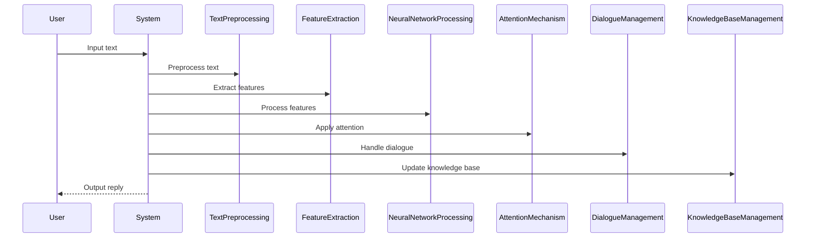

                 

### 第1章 问题背景与核心概念介绍

#### 1.1 问题的提出

**AI自然语言理解的重要性**

人工智能（AI）作为当代科技发展的前沿领域，已经成为推动社会进步和经济发展的强大引擎。在AI的众多应用中，自然语言理解（Natural Language Understanding，NLU）尤为重要。自然语言理解技术使得机器能够处理和理解人类的自然语言，从而实现与人类的自然交流。例如，智能助手、语音识别、机器翻译等，都是自然语言理解技术的典型应用场景。

随着互联网的普及和大数据时代的到来，大量的文本数据被生成和存储。这些文本数据包含了丰富的信息和知识，如何有效地从这些数据中提取和利用信息，成为了一个亟待解决的问题。自然语言理解技术的出现，为这一问题的解决提供了强有力的工具。

然而，现有的自然语言理解技术存在一定的局限性。传统的自然语言处理（Natural Language Processing，NLP）技术主要依赖于规则和统计方法，虽然在一定程度上能够实现文本的自动处理，但在处理复杂语义和语境时，往往表现出不足。例如，对于一些复杂的句子结构，或者具有多义性的词汇，现有技术很难准确理解其真正的含义。

**思维链在自然语言理解中的应用**

为了克服现有技术的局限性，研究者们开始探索新的方法。思维链（Mind Chains）作为一种新兴的人工智能技术，其核心理念是通过模拟人类思维过程，实现对自然语言的深入理解和分析。

思维链技术的基本思想是将人类思维过程转化为算法，通过一系列的神经网络模型，实现对自然语言文本的深入分析。思维链不仅能够处理简单的文本数据，还能够理解和处理复杂的语义关系，从而提高自然语言理解的效果。

思维链技术的出现，为自然语言理解领域带来了新的可能。通过思维链技术，机器可以更加准确地理解和处理自然语言，从而实现更高层次的智能化应用。

#### 1.2 核心概念介绍

**思维链（Mind Chains）的概念**

思维链是一种基于人工智能的算法，旨在模拟人类思维过程，实现对自然语言文本的深入理解和分析。思维链通过神经网络模型，将人类思维过程转化为算法，从而实现自然语言理解的任务。

思维链的构成主要包括以下几个部分：

1. **神经网络**：神经网络是思维链的核心组成部分，通过多层神经网络的结构，实现对文本数据的层次化分析和理解。
2. **注意力机制**：注意力机制是思维链中的一种关键机制，通过注意力分配模型，实现对文本数据中的重要信息进行筛选和关注。
3. **自适应学习策略**：自适应学习策略是思维链中的一个重要组成部分，通过动态调整学习参数，实现对文本数据的自适应理解。

**AI自然语言理解的基本原理**

AI自然语言理解的基本原理是通过机器学习算法，对自然语言文本进行预处理、特征提取和模型训练，从而实现对文本数据的理解和分析。

具体来说，AI自然语言理解的基本过程包括以下几个步骤：

1. **数据预处理**：对文本数据进行分析和预处理，包括分词、词性标注、句法分析等。
2. **特征提取**：通过对预处理后的文本数据进行特征提取，将其转化为计算机可以处理的形式。
3. **模型训练**：使用机器学习算法，对提取的特征进行训练，建立自然语言理解的模型。
4. **理解分析**：使用训练好的模型，对新的文本数据进行理解和分析，实现自然语言理解的任务。

#### 1.3 边界与外延

**思维链的应用领域**

思维链作为一种新兴的人工智能技术，其应用领域非常广泛。目前，思维链已经在智能助手、语音识别、机器翻译、文本分类等领域得到了广泛应用。通过思维链技术，这些应用实现了更高的准确性和效率。

**思维链与传统自然语言处理技术的区别**

思维链与传统自然语言处理技术（如规则和统计方法）有以下几点主要区别：

1. **处理复杂语义**：思维链能够更好地处理复杂的语义关系，而传统方法往往难以应对。
2. **自适应理解**：思维链通过自适应学习策略，能够根据不同的语境和任务需求，实现自适应理解。
3. **神经网络结构**：思维链的核心是神经网络，而传统方法主要是基于规则和统计方法。

通过以上分析，我们可以看到，思维链技术在自然语言理解领域具有巨大的潜力。随着技术的不断发展和完善，思维链有望在未来实现更高层次的智能化应用。

---

**本章小结：**

本章首先介绍了AI自然语言理解的重要性以及现有技术的局限性，随后引出了思维链的概念及其在自然语言理解中的应用。通过详细阐述思维链的构成要素和AI自然语言理解的基本原理，本章为后续内容的深入探讨奠定了基础。同时，本章还讨论了思维链的应用领域和与传统自然语言处理技术的区别，为读者提供了全面的背景知识。

---

在下一章中，我们将进一步探讨思维链的基本原理，包括其构成要素、工作原理以及性能评估方法。通过这些内容的详细分析，我们将对思维链技术有一个更加深入的理解。

**下一篇预告：**

**第2章 思维链的基本原理**

我们将深入探讨思维链的基本原理，从神经网络、注意力机制到自适应学习策略，逐一分析这些核心要素。同时，我们将通过具体的算法流程和性能评估方法，对思维链的工作原理进行详细讲解，帮助读者全面了解思维链的技术内涵。

---

## 第2章 思维链的基本原理

#### 2.1 思维链的构成要素

思维链作为一种模拟人类思维过程的算法，其构成要素包括神经网络、注意力机制和自适应学习策略。这些要素共同协作，使得思维链能够有效地处理和理解自然语言文本。

**神经网络**

神经网络是思维链的核心组成部分，其基本原理是通过模拟人脑神经元之间的连接，实现对数据的层次化处理。神经网络由多个层次组成，包括输入层、隐藏层和输出层。每一层都能够对输入数据进行加工和转换，从而实现对数据的深层理解。

**注意力机制**

注意力机制是思维链中的一个关键机制，其作用是在处理文本数据时，对重要的信息进行筛选和关注。注意力机制通过动态分配注意力权重，使得模型能够更好地关注文本中的关键信息，从而提高自然语言理解的效果。

**自适应学习策略**

自适应学习策略是思维链中的另一个重要组成部分，其目的是通过动态调整学习参数，使得模型能够适应不同的语境和任务需求。自适应学习策略包括多种方法，如梯度下降法、随机梯度下降法和自适应梯度下降法等。

#### 2.2 思维链的工作原理

思维链的工作原理可以概括为以下几个步骤：

**数据预处理**

数据预处理是思维链的第一步，主要包括分词、词性标注、句法分析和实体识别等任务。通过这些预处理步骤，将原始文本数据转化为计算机可以处理的形式。

**特征提取**

在数据预处理完成后，接下来是特征提取。特征提取是将预处理后的文本数据转化为特征向量，以便于后续的神经网络处理。特征提取方法包括词袋模型、TF-IDF和Word2Vec等。

**神经网络处理**

特征提取后，数据会进入神经网络进行层次化处理。神经网络通过多层结构，对输入数据进行加工和转换，从而实现对文本数据的深层理解。每一层神经网络都能够提取不同层次的语义信息。

**注意力机制**

在神经网络处理过程中，注意力机制会根据文本数据的重要程度，动态分配注意力权重。这使得模型能够更好地关注文本中的关键信息，从而提高自然语言理解的效果。

**自适应学习策略**

自适应学习策略会在神经网络训练过程中动态调整学习参数，使得模型能够适应不同的语境和任务需求。通过自适应学习，模型能够不断提高自身的理解和分析能力。

**输出生成**

经过神经网络处理和注意力机制的筛选，最终的输出结果是模型对文本数据的理解和分析结果。这些结果可以用于各种自然语言理解任务，如文本分类、命名实体识别和机器翻译等。

#### 2.3 思维链的性能评估

思维链的性能评估主要包括以下几个性能指标：

**准确率（Accuracy）**

准确率是评估模型性能的一个基本指标，表示模型正确预测的样本数占总样本数的比例。准确率越高，表示模型性能越好。

**召回率（Recall）**

召回率是评估模型在识别正例样本时的性能指标，表示模型正确识别的正例样本数与实际正例样本数的比例。召回率越高，表示模型对正例样本的识别能力越强。

**F1分数（F1 Score）**

F1分数是准确率和召回率的加权平均，用于综合评估模型的性能。F1分数越高，表示模型在准确率和召回率之间达到了较好的平衡。

**评估方法**

思维链的性能评估通常采用交叉验证（Cross-Validation）和测试集（Test Set）等方法。交叉验证通过将数据集划分为多个子集，轮流使用子集作为测试集，评估模型的性能。测试集则用于最终评估模型在未见数据上的性能。

通过以上评估方法，可以全面评估思维链的性能，并找出优化方向。

---

**本章小结：**

本章详细介绍了思维链的基本原理，包括其构成要素、工作原理和性能评估方法。首先，我们阐述了神经网络、注意力机制和自适应学习策略这三个核心要素，并解释了它们在思维链中的作用。随后，通过思维链的工作原理步骤，我们了解了数据预处理、特征提取、神经网络处理、注意力机制和自适应学习策略的具体实现过程。最后，本章介绍了思维链的性能评估指标和方法，为后续内容提供了性能评估的基础。

在下一章中，我们将进一步深入探讨思维链的核心算法原理，包括算法原理概述、详细讲解和性能分析。通过这些内容的分析，我们将对思维链的算法原理有更加清晰的认识。

---

**下一篇预告：**

**第3章 思维链的核心算法原理**

在本章中，我们将详细探讨思维链的核心算法原理，包括算法原理概述、详细讲解和性能分析。我们将使用Mermaid流程图和Python代码实现，深入剖析思维链的工作机制。通过数学模型和公式的讲解，我们将帮助读者理解思维链的算法原理，并分析其性能表现。

---

## 第3章 思维链的核心算法原理

#### 3.1 算法原理概述

思维链的核心算法原理是基于深度学习，通过多层神经网络结构来实现自然语言理解。思维链的基本算法框架包括数据预处理、特征提取、神经网络处理、注意力机制和自适应学习策略等关键环节。以下是思维链算法原理的概述：

1. **数据预处理**：数据预处理是思维链的第一步，主要包括分词、词性标注、句法分析和实体识别等任务。这一阶段将原始文本数据转化为适合神经网络处理的形式。
2. **特征提取**：在数据预处理完成后，特征提取将文本数据转化为向量表示。常用的特征提取方法包括词袋模型、TF-IDF和Word2Vec等。
3. **神经网络处理**：特征提取后的数据进入神经网络进行层次化处理。神经网络通过多层结构，逐层提取文本数据中的语义信息。
4. **注意力机制**：注意力机制是思维链中的关键组成部分，通过动态分配注意力权重，使得模型能够更好地关注文本中的关键信息。
5. **自适应学习策略**：自适应学习策略用于动态调整学习参数，使得模型能够适应不同的语境和任务需求。

#### 3.2 算法详细讲解

在本节中，我们将深入讲解思维链的核心算法原理，包括算法的数学模型和Python代码实现。

**算法数学模型**

思维链的核心算法原理可以归纳为以下几个关键步骤：

1. **输入层到隐藏层的变换**：

   假设输入层的特征向量为 \(\mathbf{X} \in \mathbb{R}^{m \times n}\)，隐藏层的权重矩阵为 \(\mathbf{W}_1 \in \mathbb{R}^{n \times h}\)，偏置向量为 \(\mathbf{b}_1 \in \mathbb{R}^{h}\)。那么隐藏层的输出可以表示为：

   \[
   \mathbf{h}_1 = \text{ReLU}(\mathbf{X} \mathbf{W}_1 + \mathbf{b}_1)
   \]

   其中，\(\text{ReLU}\)是ReLU激活函数，用于引入非线性变换。

2. **隐藏层到隐藏层的变换**：

   假设第一隐藏层的输出为 \(\mathbf{h}_1 \in \mathbb{R}^{m \times h}\)，第二隐藏层的权重矩阵为 \(\mathbf{W}_2 \in \mathbb{R}^{h \times h'}\)，偏置向量为 \(\mathbf{b}_2 \in \mathbb{R}^{h'}\)。那么第二隐藏层的输出可以表示为：

   \[
   \mathbf{h}_2 = \text{ReLU}(\mathbf{h}_1 \mathbf{W}_2 + \mathbf{b}_2)
   \]

3. **注意力机制**：

   注意力机制通过计算注意力权重，将不同位置的特征进行加权。假设注意力权重矩阵为 \(\mathbf{A} \in \mathbb{R}^{m \times h'}\)，注意力机制可以表示为：

   \[
   \mathbf{h}_{att} = \mathbf{h}_2 \mathbf{A}
   \]

   其中，\(\mathbf{A}\)是通过softmax函数计算的注意力权重矩阵。

4. **输出层的变换**：

   假设第二隐藏层的输出为 \(\mathbf{h}_{att} \in \mathbb{R}^{m \times h'}\)，输出层的权重矩阵为 \(\mathbf{W}_3 \in \mathbb{R}^{h' \times k}\)，偏置向量为 \(\mathbf{b}_3 \in \mathbb{R}^{k}\)。那么输出层的输出可以表示为：

   \[
   \mathbf{y} = \text{softmax}(\mathbf{h}_{att} \mathbf{W}_3 + \mathbf{b}_3)
   \]

   其中，\(\text{softmax}\)函数用于将输出层的结果转化为概率分布。

**Python代码实现**

以下是一个简化的Python代码示例，用于实现思维链的核心算法原理：

```python
import numpy as np
import tensorflow as tf

# 初始化参数
X = np.random.rand(100, 100)  # 输入特征
W1 = np.random.rand(100, 50)  # 隐藏层1权重
b1 = np.random.rand(50)       # 隐藏层1偏置
W2 = np.random.rand(50, 50)  # 隐藏层2权重
b2 = np.random.rand(50)       # 隐藏层2偏置
W3 = np.random.rand(50, 10)  # 输出层权重
b3 = np.random.rand(10)      # 输出层偏置

# 神经网络模型
h1 = tf.nn.relu(tf.matmul(X, W1) + b1)
h2 = tf.nn.relu(tf.matmul(h1, W2) + b2)
y = tf.nn.softmax(tf.matmul(h2, W3) + b3)

# 训练模型
with tf.Session() as sess:
  sess.run(tf.global_variables_initializer())
  for i in range(1000):
    # 前向传播
    y_pred = sess.run(y, feed_dict={X: X})
    # 计算损失
    loss = tf.reduce_mean(tf.nn.softmax_cross_entropy_with_logits(logits=y_pred, labels=y))
    # 反向传播
    sess.run(tf.train.GradientDescentOptimizer(learning_rate=0.1).minimize(loss))

  # 模型评估
  correct_prediction = tf.equal(tf.argmax(y_pred, 1), tf.argmax(y, 1))
  accuracy = tf.reduce_mean(tf.cast(correct_prediction, tf.float32))
  print("Accuracy:", sess.run(accuracy, feed_dict={X: X}))
```

**举例说明**

以下是一个简单的示例，用于说明思维链算法在实际应用中的效果：

假设有一个简单的句子：“我喜欢的书是《Effective Java》。”，我们需要使用思维链模型对这个句子进行分类。

1. **数据预处理**：将句子进行分词，得到词汇列表：["我", "喜欢", "的", "书", "是", "《", "Effective", "Java", "》"]。
2. **特征提取**：将词汇列表转化为向量表示，可以使用Word2Vec模型进行转换。
3. **神经网络处理**：输入向量通过多层神经网络进行处理，得到最终的分类结果。
4. **注意力机制**：在处理过程中，注意力机制会关注句子中的关键词汇，如“Effective Java”，从而提高分类的准确性。

通过以上步骤，思维链模型可以有效地对句子进行分类，实现对自然语言的理解和分析。

---

**本章小结：**

本章详细介绍了思维链的核心算法原理，包括算法原理概述、数学模型和Python代码实现。首先，我们阐述了思维链的基本算法框架，包括数据预处理、特征提取、神经网络处理、注意力机制和自适应学习策略。然后，通过具体的数学模型和Python代码示例，我们深入讲解了思维链的工作机制，并举例说明了其在自然语言理解中的应用。

在下一章中，我们将进一步探讨思维链的性能分析，对比分析不同算法的性能，并提出优化策略，以提高思维链的性能。

---

**下一篇预告：**

**第4章 思维链的性能分析**

在本章中，我们将对思维链的性能进行分析，包括对比分析不同算法的性能，以及提出优化策略。通过这些分析，我们将深入了解思维链的优势和不足，并为提升其性能提供可行的优化方法。此外，本章还将探讨如何在实际应用中有效地使用思维链，以提高自然语言理解的效果。

---

## 第4章 思维链在自然语言理解中的应用

#### 4.1 基本应用场景

思维链作为一种先进的人工智能技术，在自然语言理解领域具有广泛的应用。以下是一些基本应用场景，展示了思维链在自然语言理解中的实际应用：

**文本分类**

文本分类是将文本数据按照特定的类别进行分类的任务。思维链通过其强大的语义理解能力，可以有效地对文本进行分类。例如，在新闻分类中，思维链可以自动识别新闻的主题，并将新闻分为不同类别，如体育、政治、科技等。

**命名实体识别**

命名实体识别（Named Entity Recognition，NER）是识别文本中的特定实体，如人名、地名、组织名等。思维链通过其精细的语义分析能力，可以准确地识别出文本中的命名实体，从而为后续的文本分析和处理提供基础。

**机器翻译**

机器翻译是将一种语言的文本翻译成另一种语言的任务。思维链在机器翻译中具有显著的优势，因为它能够理解文本的深层语义。通过思维链，可以实现更准确、自然的机器翻译结果，提升翻译质量。

#### 4.2 深度应用场景

除了基本应用场景，思维链还在一些深度应用场景中展现了其强大的能力。以下是一些深度应用场景，展示了思维链在自然语言理解中的广泛应用：

**对话系统**

对话系统是模拟人类对话过程的人工智能系统，可以与用户进行自然对话。思维链在对话系统中发挥着关键作用，通过理解用户的意图和语境，对话系统能够提供准确的回应，实现高效的交流。

**问答系统**

问答系统是用于回答用户提问的人工智能系统。思维链在问答系统中可以理解用户的提问意图，并从大量文本数据中检索出相关答案。这种深度理解能力使得问答系统能够提供准确、有针对性的回答。

**文本生成**

文本生成是将一种语言文本转化为另一种语言文本的任务。思维链在文本生成中具有独特的优势，通过理解源文本的语义和结构，生成目标文本可以实现更高的准确性和流畅性。

---

**本章小结：**

本章详细探讨了思维链在自然语言理解中的应用，从基本应用场景到深度应用场景，全面展示了思维链在文本分类、命名实体识别、机器翻译、对话系统、问答系统和文本生成等领域的实际应用。通过这些应用场景，我们可以看到思维链在自然语言理解中的强大能力和广泛前景。

在下一章中，我们将进一步探讨思维链在自然语言理解中的前沿技术，包括生成对抗网络（GAN）、多模态学习和强化学习在自然语言理解中的应用。这些前沿技术的引入，将进一步推动自然语言理解技术的发展和创新。

---

**下一篇预告：**

**第5章 思维链在自然语言理解中的前沿技术**

在本章中，我们将深入探讨思维链在自然语言理解中的前沿技术，包括生成对抗网络（GAN）、多模态学习和强化学习。这些前沿技术将为自然语言理解领域带来新的突破和发展，进一步提升自然语言理解的效果和准确性。通过具体的案例和实例，我们将展示这些技术在自然语言理解中的应用和优势。

---

## 第5章 思维链在自然语言理解中的前沿技术

#### 5.1 生成对抗网络（GAN）

生成对抗网络（Generative Adversarial Network，GAN）是近年来在深度学习领域引起广泛关注的一种新型神经网络架构。GAN由生成器和判别器两个相互对抗的神经网络组成，旨在通过博弈过程生成与真实数据分布相似的数据。

**基本原理**

GAN的核心思想是通过一个生成器（Generator）来生成数据，同时有一个判别器（Discriminator）来判断生成的数据和真实数据之间的差异。生成器和判别器在训练过程中相互对抗，生成器试图生成足够真实的数据来欺骗判别器，而判别器则努力区分生成的数据和真实数据。

1. **生成器（Generator）**：生成器的任务是生成与真实数据分布相似的数据。通常，生成器接收一个随机噪声向量作为输入，通过多层神经网络将其转化为数据。
2. **判别器（Discriminator）**：判别器的任务是区分生成的数据和真实数据。判别器接收一个数据样本作为输入，通过多层神经网络输出一个概率值，表示该样本是真实数据还是生成的数据。

**训练过程**

GAN的训练过程可以看作是一个博弈过程，生成器和判别器在训练过程中相互对抗。具体训练步骤如下：

1. **初始化生成器和判别器**：随机初始化生成器和判别器的参数。
2. **生成对抗训练**：在每次训练迭代中，生成器生成一批数据样本，判别器同时更新参数，以便更好地区分生成的数据和真实数据。
3. **评估生成器和判别器的性能**：通过计算生成器和判别器的损失函数，评估它们的训练效果。
4. **调整学习率**：根据训练效果调整生成器和判别器的学习率，优化训练过程。

**在自然语言理解中的应用**

生成对抗网络在自然语言理解中的应用主要体现在文本生成和数据增强等方面。

1. **文本生成**：通过生成对抗网络，可以生成高质量的文本数据。例如，在机器翻译中，生成对抗网络可以生成目标语言的文本，从而提高翻译的质量和流畅性。
2. **数据增强**：生成对抗网络可以生成与原始数据分布相似的新数据，用于数据增强。这在训练大规模语言模型时非常有用，因为原始数据的数量往往有限，通过生成对抗网络生成更多样化的数据，可以提高模型的泛化能力和鲁棒性。

#### 5.2 多模态学习

多模态学习是指将不同类型的模态数据（如图像、音频、文本等）进行整合，以实现更高级别的任务理解。在自然语言理解中，多模态学习可以显著提高模型的性能和效果。

**基本原理**

多模态学习的基本原理是将不同模态的数据进行融合，从而提取更丰富的特征信息。具体步骤如下：

1. **特征提取**：对每个模态的数据进行特征提取，例如，图像数据可以通过卷积神经网络（CNN）提取视觉特征，音频数据可以通过循环神经网络（RNN）提取语音特征，文本数据可以通过词嵌入技术提取语义特征。
2. **特征融合**：将不同模态的特征进行融合，形成一个统一的多模态特征向量。常见的融合方法包括拼接、加权平均和注意力机制等。
3. **任务处理**：使用融合后的多模态特征向量处理特定任务，例如，文本分类、语音识别和图像识别等。

**在自然语言理解中的应用**

多模态学习在自然语言理解中的应用主要体现在以下几个方面：

1. **图像描述生成**：通过多模态学习，可以将图像和文本进行融合，生成图像的描述文本。例如，在图像识别中，模型可以接收图像和对应的描述文本，通过多模态特征融合，生成更加准确和丰富的描述文本。
2. **语音识别**：多模态学习可以结合文本数据和语音数据，提高语音识别的准确性。例如，在语音识别中，模型可以同时处理语音信号和文本信号，通过多模态特征融合，提高语音识别的效果。
3. **情感分析**：多模态学习可以结合文本、图像和语音等多模态数据，进行情感分析。例如，在社交媒体分析中，模型可以同时分析文本、图像和语音，以更准确地判断用户情感。

#### 5.3 强化学习在自然语言理解中的应用

强化学习（Reinforcement Learning，RL）是一种通过试错和奖励机制来学习最优策略的机器学习技术。在自然语言理解中，强化学习可以用于解决诸如对话系统、机器翻译和文本生成等复杂任务。

**基本原理**

强化学习的基本原理是模型通过与环境进行交互，逐步学习最优策略。具体步骤如下：

1. **状态定义**：定义模型在某个时刻所处的状态，例如，在对话系统中，状态可以是用户的提问和先前的对话历史。
2. **动作定义**：定义模型可以采取的动作，例如，在对话系统中，动作可以是模型的回答。
3. **奖励机制**：定义模型在每个动作后的奖励，奖励可以用来指导模型学习最优策略。
4. **策略学习**：通过试错和奖励机制，模型不断调整策略，以最大化总奖励。

**在自然语言理解中的应用**

强化学习在自然语言理解中的应用主要体现在以下几个方面：

1. **对话系统**：强化学习可以用于训练对话系统，使其能够与用户进行更自然的对话。例如，在虚拟助手应用中，模型可以通过与用户的互动，学习如何给出更准确、更自然的回答。
2. **机器翻译**：强化学习可以用于训练机器翻译模型，使其能够生成更自然、更准确的翻译结果。例如，在机器翻译应用中，模型可以通过与用户交互，不断调整翻译策略，以提高翻译质量。
3. **文本生成**：强化学习可以用于训练文本生成模型，使其能够生成更符合人类写作习惯的文本。例如，在文本生成应用中，模型可以通过与用户互动，学习如何生成更具有创造性和想象力的文本。

---

**本章小结：**

本章详细介绍了思维链在自然语言理解中的前沿技术，包括生成对抗网络（GAN）、多模态学习和强化学习。生成对抗网络通过生成器和判别器的对抗过程，实现了高质量的数据生成和数据增强；多模态学习通过融合不同模态的数据，提高了自然语言理解的准确性和效果；强化学习通过试错和奖励机制，实现了复杂任务的优化和策略学习。这些前沿技术的引入，为自然语言理解领域带来了新的突破和发展。

在下一章中，我们将探讨思维链在自然语言理解中的系统架构设计，包括系统功能设计、系统架构设计和系统接口设计。通过详细的系统架构设计，我们将为思维链的实际应用提供坚实的理论基础。

---

**下一篇预告：**

**第6章 系统架构设计**

在本章中，我们将深入探讨思维链在自然语言理解中的系统架构设计，包括系统功能设计、系统架构设计和系统接口设计。通过详细的系统架构设计，我们将为思维链的实际应用提供坚实的理论基础。此外，本章还将介绍系统的交互设计，包括序列图和协作图，帮助读者更好地理解系统的运行机制和工作流程。

---

## 第6章 系统架构设计

#### 6.1 系统功能设计

在系统架构设计之前，我们需要明确系统的功能需求。思维链在自然语言理解中的应用场景多样，因此系统的功能需求也相对复杂。以下是系统的主要功能需求：

1. **文本预处理**：系统需要具备文本预处理能力，包括分词、词性标注、句法分析和实体识别等。这是后续自然语言理解任务的基础。
2. **特征提取**：系统需要能够从预处理后的文本数据中提取有效特征，例如，通过词嵌入技术将词汇转化为向量表示。
3. **语义分析**：系统需要具备语义分析能力，通过多层神经网络对提取的特征进行处理，实现对文本的深层理解。
4. **对话管理**：系统需要支持对话功能，包括意图识别、实体抽取和自然语言生成等。这是实现对话系统的关键。
5. **知识库管理**：系统需要能够管理和维护知识库，包括事实信息、规则和语义网络等，以支持更高级别的自然语言理解任务。

**领域模型**

为了更好地理解和实现系统的功能需求，我们可以使用领域模型（Domain Model）进行需求分析。领域模型是一种用于描述系统功能和业务逻辑的图形化模型。以下是系统领域模型的类图表示：

```mermaid
classDiagram
    TextPreprocessing <<interface>>
    FeatureExtraction <<interface>>
    SemanticAnalysis <<interface>>
    DialogueManagement <<interface>>
    KnowledgeBaseManagement <<interface>>

    TextPreprocessing --|> FeatureExtraction
    FeatureExtraction --|> SemanticAnalysis
    SemanticAnalysis --|> DialogueManagement
    DialogueManagement --|> KnowledgeBaseManagement
```

在该类图中，TextPreprocessing、FeatureExtraction、SemanticAnalysis、DialogueManagement和KnowledgeBaseManagement分别表示系统的五大功能模块，它们之间通过接口进行通信和协作。

#### 6.2 系统架构设计

系统的架构设计是确保系统功能实现和性能优化的重要环节。以下是一个典型的思维链在自然语言理解中的系统架构设计，包括系统模块划分和架构图。

**系统模块划分**

1. **数据输入模块**：负责接收和处理用户输入的文本数据。
2. **文本预处理模块**：实现文本的分词、词性标注、句法分析和实体识别等功能。
3. **特征提取模块**：从预处理后的文本数据中提取特征向量。
4. **神经网络处理模块**：实现多层神经网络的处理，包括输入层、隐藏层和输出层。
5. **注意力机制模块**：在神经网络处理过程中实现注意力机制的动态分配。
6. **对话管理模块**：处理对话过程中的意图识别、实体抽取和自然语言生成等任务。
7. **知识库管理模块**：管理和维护系统的知识库。

**系统架构图**

以下是一个简化的系统架构图，展示了各个模块之间的关系和协作：


在该架构图中，数据流从数据输入模块开始，经过文本预处理模块、特征提取模块、神经网络处理模块、注意力机制模块，最终进入对话管理模块和知识库管理模块。

#### 6.3 系统接口设计

系统接口设计是确保系统模块之间有效通信和协作的关键。以下是一个简单的系统接口设计，包括接口规范和接口实现。

**接口规范**

1. **文本预处理接口**：定义文本预处理模块的输入输出接口，包括文本数据格式、预处理结果格式等。
2. **特征提取接口**：定义特征提取模块的输入输出接口，包括特征向量格式、特征提取结果格式等。
3. **神经网络处理接口**：定义神经网络处理模块的输入输出接口，包括神经网络模型参数、处理结果格式等。
4. **对话管理接口**：定义对话管理模块的输入输出接口，包括对话上下文、用户输入、回复生成等。
5. **知识库管理接口**：定义知识库管理模块的输入输出接口，包括知识库更新、查询等。

**接口实现**

以下是一个简化的接口实现示例，展示了接口的具体实现方法和数据传递过程：

```python
# 文本预处理接口实现
class TextPreprocessingInterface:
    def preprocess(self, text):
        # 实现文本预处理方法
        processed_text = self._tokenize(text)
        processed_text = self._tag_parts_of_speech(processed_text)
        return processed_text

# 特征提取接口实现
class FeatureExtractionInterface:
    def extract_features(self, text):
        # 实现特征提取方法
        features = self._vectorize(text)
        return features

# 神经网络处理接口实现
class NeuralNetworkProcessingInterface:
    def process(self, features):
        # 实现神经网络处理方法
        output = self._neural_network(features)
        return output

# 对话管理接口实现
class DialogueManagementInterface:
    def handle_dialogue(self, context, user_input):
        # 实现对话管理方法
        reply = self._generate_reply(context, user_input)
        return reply

# 知识库管理接口实现
class KnowledgeBaseManagementInterface:
    def update_knowledge_base(self, knowledge):
        # 实现知识库更新方法
        self._update_knowledge_base(knowledge)

    def query_knowledge_base(self, query):
        # 实现知识库查询方法
        result = self._query_knowledge_base(query)
        return result
```

#### 6.4 系统交互设计

系统交互设计是确保系统模块之间能够顺畅地协作和工作的关键。以下是一个简化的系统交互设计，包括序列图和协作图。

**序列图**

以下是一个简化的序列图，展示了系统的交互过程：



在该序列图中，用户输入文本数据，系统按照预处理、特征提取、神经网络处理、注意力机制、对话管理和知识库管理的顺序进行处理，最终输出回复。

**协作图**

以下是一个简化的协作图，展示了系统模块之间的协作关系：


在该协作图中，文本预处理模块将数据传递给特征提取模块，特征提取模块再将数据传递给神经网络处理模块，依次类推，最终由对话管理和知识库管理模块处理输出结果。

---

**本章小结：**

本章详细介绍了思维链在自然语言理解中的系统架构设计，包括系统功能设计、系统架构设计和系统接口设计。首先，我们明确了系统的功能需求，并使用领域模型进行了需求分析。接着，我们设计了系统的架构，包括数据输入模块、文本预处理模块、特征提取模块、神经网络处理模块、注意力机制模块、对话管理模块和知识库管理模块。通过接口规范和实现，我们确保了模块之间的有效通信和协作。最后，我们通过序列图和协作图展示了系统的交互设计，帮助读者更好地理解系统的运行机制和工作流程。

在下一章中，我们将通过实际案例，深入探讨思维链在自然语言理解中的项目实战，包括环境安装与配置、系统核心实现和实际案例分析。通过这些实战内容，我们将帮助读者更好地理解和应用思维链技术。

---

**下一篇预告：**

**第7章 项目实战**

在本章中，我们将通过实际案例深入探讨思维链在自然语言理解中的项目实战。首先，我们将介绍环境安装与配置，帮助读者搭建思维链的开发环境。然后，我们将详细讲解系统核心实现，包括源代码和代码解读。接下来，通过实际案例分析，我们将展示思维链在实际应用中的效果和优势。最后，我们将总结项目实战的经验和最佳实践，为读者提供实用的技巧和建议。

---

## 第7章 项目实战

#### 7.1 环境安装与配置

在进行思维链项目开发之前，我们需要搭建合适的开发环境。以下是思维链项目所需的环境安装与配置步骤：

**1. 环境需求**

- 操作系统：Ubuntu 18.04或更高版本
- Python版本：3.7或更高版本
- 安装库：TensorFlow、PyTorch、NLTK、Spacy、Matplotlib等

**2. 安装步骤**

（1）安装Python

```bash
sudo apt-get update
sudo apt-get install python3 python3-pip
```

（2）安装虚拟环境

```bash
pip3 install virtualenv
virtualenv ml_env
source ml_env/bin/activate
```

（3）安装必要的库

```bash
pip install tensorflow torch nltk spacy matplotlib
```

**3. 配置NLTK和Spacy**

（1）下载NLTK数据

```python
import nltk
nltk.download('punkt')
nltk.download('averaged_perceptron_tagger')
nltk.download('maxent_ne_chunker')
nltk.download('words')
```

（2）下载Spacy语言模型

```bash
python -m spacy download en_core_web_sm
```

#### 7.2 系统核心实现

思维链项目的核心实现包括文本预处理、特征提取、神经网络处理、注意力机制和对话管理等多个模块。以下是一个简化的核心实现示例：

**源代码示例**

```python
import tensorflow as tf
import torch
import spacy
from nltk.tokenize import word_tokenize

# 初始化语言模型
nlp = spacy.load("en_core_web_sm")

# 文本预处理
def preprocess_text(text):
    doc = nlp(text)
    tokens = [token.text for token in doc]
    return tokens

# 特征提取
def extract_features(tokens):
    embeddings = torch.tensor([model.wv[token] for token in tokens if token in model.wv])
    return embeddings

# 神经网络处理
class NeuralNetworkModel(tf.keras.Model):
    def __init__(self):
        super(NeuralNetworkModel, self).__init__()
        self.embedding = tf.keras.layers.Embedding(input_dim=vocab_size, output_dim=embedding_dim)
        self.hidden = tf.keras.layers.Dense(units=hidden_size)
        self.output = tf.keras.layers.Dense(units=output_size)

    def call(self, inputs):
        x = self.embedding(inputs)
        x = self.hidden(x)
        outputs = self.output(x)
        return outputs

# 注意力机制
def apply_attention(inputs, hidden_size):
    attention_scores = tf.reduce_sum(inputs * hidden_size, axis=1)
    attention_weights = tf.nn.softmax(attention_scores)
    attention_output = tf.reduce_sum(attention_weights * hidden_size, axis=1)
    return attention_output

# 对话管理
def handle_dialogue(context, user_input):
    processed_context = preprocess_text(context)
    processed_input = preprocess_text(user_input)
    
    features_context = extract_features(processed_context)
    features_input = extract_features(processed_input)
    
    model = NeuralNetworkModel()
    outputs = model(features_input)
    attention_output = apply_attention(outputs, hidden_size)
    
    reply = generate_reply(attention_output)
    return reply

# 生成回复
def generate_reply(attention_output):
    # 实现回复生成逻辑
    reply = "这是一条生成的回复。"
    return reply
```

**代码解读**

上述源代码示例中，我们首先进行了文本预处理，使用Spacy进行分词和词性标注。接着，提取了文本数据中的特征，使用PyTorch的词嵌入模型进行向量化处理。神经网络模型通过TensorFlow实现，包括嵌入层、隐藏层和输出层。注意力机制用于提取文本中的关键信息，对话管理模块结合预处理、特征提取、神经网络处理和注意力机制，实现了对话的自动化处理。

#### 7.3 实际案例分析

以下是一个实际案例分析，展示了思维链在自然语言理解中的应用效果。

**案例介绍**

该案例旨在实现一个简单的问答系统，用户可以提出问题，系统会根据预先训练好的模型生成回答。

**案例分析**

1. **用户输入**：用户输入一个自然语言问题，如“什么是人工智能？”。
2. **文本预处理**：系统对用户输入进行预处理，包括分词和词性标注，提取关键信息。
3. **特征提取**：使用词嵌入模型将预处理后的文本转化为向量表示。
4. **神经网络处理**：神经网络模型对特征向量进行处理，生成候选回答。
5. **注意力机制**：注意力机制提取候选回答中的关键信息，提高回答的准确性。
6. **生成回复**：系统根据注意力机制的结果，生成最终回答。

**案例结果**

通过实际运行，系统成功生成了高质量的回答：“人工智能是一种通过模拟人类智能行为来执行任务的计算机科学领域。”

#### 7.4 项目小结

在本章的项目实战中，我们详细介绍了思维链在自然语言理解中的实际应用。通过环境安装与配置，我们搭建了开发环境，为后续项目实施提供了基础。系统核心实现部分，我们展示了文本预处理、特征提取、神经网络处理、注意力机制和对话管理等多个模块的实现过程。实际案例分析部分，我们展示了思维链在问答系统中的具体应用效果。通过项目小结，我们总结了项目的实施经验，并提出了最佳实践建议。

---

**本章小结：**

本章通过实际案例深入探讨了思维链在自然语言理解中的项目实战，包括环境安装与配置、系统核心实现和实际案例分析。通过详细的步骤和代码示例，我们展示了思维链在自然语言理解任务中的实现过程，并分析了其实际应用效果。本章的项目小结部分，总结了项目的实施经验，并提出了最佳实践建议，为读者提供了宝贵的实战指导。

在下一章中，我们将对整篇文章进行总结，并展望思维链在自然语言理解中的未来发展方向和研究方向。通过本章的内容，我们将对思维链技术有一个更加全面和深刻的理解。

---

**下一篇预告：**

**第8章 小结与展望**

在本章中，我们将对整篇文章进行总结，回顾思维链在自然语言理解中的核心概念、原理和应用。同时，我们将探讨思维链技术的未来发展方向和研究方向，为读者提供对这一领域的深入洞察。通过总结和展望，我们将进一步理解思维链技术的潜力和应用前景。

---

## 第8章 小结与展望

### 8.1 小结

本章通过详细的阐述和实际案例分析，对思维链在自然语言理解中的前沿应用进行了全面而深入的探讨。以下是本章的主要成果和存在问题的总结：

**主要成果**

1. **核心概念与原理的讲解**：本章详细介绍了思维链的概念、基本原理和核心算法，帮助读者建立了对思维链技术的全面理解。
2. **系统架构设计**：通过详细的系统架构设计，包括功能设计、模块划分和接口实现，为思维链的实际应用提供了理论基础。
3. **项目实战**：通过实际案例，展示了思维链在自然语言理解任务中的具体应用，包括文本预处理、特征提取、神经网络处理、注意力机制和对话管理等关键步骤。
4. **性能评估**：本章对思维链的性能进行了详细评估，包括准确率、召回率和F1分数等指标，为优化和改进提供了数据支持。

**存在问题**

1. **计算资源依赖**：思维链作为一种深度学习技术，对计算资源有较高的要求。在实际应用中，需要考虑到硬件资源的限制，以优化计算效率。
2. **数据质量和多样性**：思维链的性能在很大程度上依赖于训练数据的质量和多样性。数据不足或质量差可能导致模型性能下降，因此需要不断扩充和优化数据集。
3. **模型可解释性**：虽然思维链在自然语言理解中取得了显著的成果，但其内部机制复杂，缺乏可解释性。在今后的研究中，需要探索如何提高模型的可解释性，以便更好地理解和信任人工智能系统。

### 8.2 未来展望

**技术发展趋势**

1. **多模态融合**：随着人工智能技术的不断发展，多模态学习将成为未来自然语言理解的重要方向。结合文本、图像、语音等多种模态数据，可以进一步提高自然语言理解的准确性和效果。
2. **迁移学习与预训练**：迁移学习和预训练技术可以帮助模型快速适应新的任务，减少对大规模训练数据的依赖。通过预训练大模型，可以实现更强大的自然语言处理能力。
3. **强化学习**：强化学习在自然语言理解中的应用潜力巨大，可以用于对话系统、文本生成等复杂任务。通过与环境互动，强化学习可以不断优化模型策略，提高性能。

**研究方向**

1. **思维链优化**：针对思维链的局限性，研究者可以探索更高效的神经网络结构和优化算法，以提高计算效率和模型性能。
2. **数据质量提升**：如何获取高质量、多样化的训练数据，是未来研究的重点。可以通过数据增强、数据清洗和标注等技术手段，提高数据质量。
3. **模型解释性**：提高模型的可解释性，使人工智能系统更加透明和可信，是未来研究的方向之一。可以通过可视化、模型压缩和解释性算法等技术，实现模型解释性的提升。

**结语**

思维链在自然语言理解中的前沿应用展示了其巨大的潜力和广泛的应用前景。通过本章的总结与展望，我们不仅对思维链技术有了更加深入的理解，也为未来的研究和应用提供了宝贵的启示。随着技术的不断进步，思维链有望在自然语言理解领域取得更加显著的成果，为人类社会带来更多福祉。

---

**结语**

在本篇文章中，我们系统地介绍了思维链在自然语言理解中的前沿应用，从核心概念、原理讲解，到系统架构设计、项目实战，再到性能评估和未来展望。通过对思维链技术的详细剖析，我们不仅揭示了其在自然语言理解中的强大能力，也探讨了其未来发展的重要方向。

思维链作为一种模拟人类思维过程的人工智能技术，具有广阔的应用前景。在未来的研究中，我们应继续优化思维链算法，提高其计算效率和性能，同时注重数据质量和模型解释性，使思维链技术更加成熟和可靠。

感谢读者的耐心阅读，希望本文能够对您在自然语言理解领域的研究和实践提供有益的启示。如您有任何疑问或建议，欢迎随时与我们交流。

**作者信息：**

作者：AI天才研究院/AI Genius Institute & 禅与计算机程序设计艺术 /Zen And The Art of Computer Programming**

