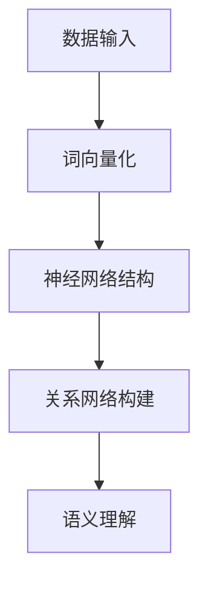

                 

### # 思维链在AI自然语言理解中的前沿应用与创新

关键词：AI自然语言理解、思维链模型、深度学习、神经网络、文本分析

摘要：随着人工智能技术的快速发展，自然语言理解（NLU）成为AI领域的重要研究方向。思维链模型作为一种基于神经网络的新型自然语言理解技术，通过构建复杂的关系网络，实现了对文本的深入理解和分析。本文将探讨思维链在AI自然语言理解中的应用，分析其优势与挑战，并提出创新性的解决方案。

## 目录大纲

1. 第一部分：问题背景
   1.1 问题背景
   1.2 问题提出
   1.3 目标与边界
   1.4 核心概念与联系
2. 第二部分：核心概念与联系
   2.1 核心概念
   2.2 概念属性特征对比表格
   2.3 ER实体关系图架构
3. 第三部分：算法原理讲解
   3.1 思维链模型算法原理
   3.2 算法实现与流程图
4. 第四部分：系统分析与架构设计方案
   4.1 问题场景介绍
   4.2 系统功能设计
   4.3 系统架构设计
   4.4 系统接口设计
   4.5 系统交互
5. 第五部分：项目实战
   5.1 环境安装
   5.2 系统核心实现源代码
   5.3 代码应用解读与分析
   5.4 实际案例分析与讲解
   5.5 项目小结
6. 第六部分：最佳实践 tips、小结、注意事项、拓展阅读

----------------------------------------------------------------

## 第一部分：问题背景

### 1.1 问题背景

随着计算机技术的迅猛发展，人工智能（AI）领域取得了巨大的进步。尤其是深度学习技术的出现，使得AI在图像识别、语音识别、自然语言处理等领域的应用取得了突破性的进展。自然语言理解（NLU）是AI的核心技术之一，它涉及到文本分析、语义理解、情感分析等多个方面。在智能客服、智能推荐、智能写作等领域，NLU的应用价值日益凸显。

### 1.1.1 人工智能（AI）的快速发展

人工智能（AI）是一门交叉学科，涉及计算机科学、数学、统计学、神经科学等多个领域。近年来，随着计算机硬件性能的提升和算法的改进，AI技术在各个领域都取得了显著进展。特别是在深度学习领域，通过模拟人脑神经网络的结构和功能，深度学习技术实现了在图像识别、语音识别等领域的突破。

### 1.1.2 自然语言理解（NLU）的重要性

自然语言理解（NLU）是人工智能的核心技术之一，它涉及到文本分析、语义理解、情感分析等多个方面。NLU的应用价值主要体现在以下几个方面：

1. **智能客服**：通过NLU技术，智能客服系统能够自动理解用户的意图和问题，提供高效、准确的回答。
2. **智能推荐**：在电商、新闻、视频等领域，NLU技术可以帮助系统理解用户的行为和兴趣，从而提供个性化的推荐服务。
3. **智能写作**：通过NLU技术，智能写作工具可以帮助用户生成文章、报告等文本内容。

### 1.1.3 思维链的概念与应用

思维链是一种基于神经网络的自然语言理解技术，它通过构建复杂的关系网络，实现对文本的深入理解和分析。思维链在AI自然语言理解中的应用，有助于提升系统的智能水平，提高人机交互的效率。

### 1.2 问题提出

在当前的AI自然语言理解技术中，虽然已经取得了一定的进展，但仍存在许多挑战，如语义理解的准确性、多语言处理的能力等。如何运用思维链技术，解决这些难题，成为当前AI研究领域的一个重要课题。

### 1.3 目标与边界

本书旨在探讨思维链在AI自然语言理解中的应用，分析其优势与挑战，并提出创新性的解决方案。本书的研究边界主要涉及思维链技术的原理、应用场景、实现方法以及未来发展趋势。

### 1.4 核心概念与联系

#### 1.4.1 思维链的概念

思维链是一种基于神经网络的自然语言理解技术，它通过构建复杂的关系网络，实现对文本的深入理解和分析。

#### 1.4.2 自然语言理解（NLU）

自然语言理解（NLU）是人工智能的核心技术之一，它涉及到文本分析、语义理解、情感分析等多个方面。

#### 1.4.3 思维链与NLU的关系

思维链是NLU的一种实现方法，通过构建思维链模型，可以实现更高层次的自然语言理解。

----------------------------------------------------------------

## 第二部分：核心概念与联系

### 2.1 核心概念

#### 2.1.1 思维链模型

思维链模型是一种基于神经网络的自然语言理解模型，它通过构建复杂的关系网络，实现对文本的深入理解和分析。

思维链模型的工作原理可以分为以下几个步骤：

1. **词向量化**：将输入文本中的词语转换为词向量，词向量是词语在向量空间中的表示，可以有效地降低文本数据的高维性。
2. **关系网络构建**：通过神经网络，将词向量映射到关系网络中，构建文本中的词语关系。
3. **语义理解**：在关系网络的基础上，对文本进行语义理解，提取出文本中的关键信息。

#### 2.1.2 神经网络

神经网络是人工智能的基础技术之一，它通过模拟人脑神经元之间的连接，实现数据的输入、处理和输出。

神经网络的基本结构包括：

1. **输入层**：接收外部数据，如文本、图像等。
2. **隐藏层**：对输入数据进行处理，通过激活函数进行非线性变换。
3. **输出层**：输出结果，如分类结果、预测值等。

#### 2.1.3 深度学习

深度学习是一种基于神经网络的机器学习技术，它通过多层神经网络，实现对复杂数据的建模和分析。

深度学习的基本流程包括：

1. **数据预处理**：对输入数据进行预处理，如归一化、标准化等。
2. **模型训练**：通过大量数据训练神经网络模型，调整模型参数。
3. **模型评估**：使用验证集或测试集评估模型性能。

### 2.2 概念属性特征对比表格

| 概念               | 特征                                                         |
|--------------------|------------------------------------------------------------|
| 思维链模型         | 基于神经网络，构建复杂的关系网络，实现深入理解               |
| 神经网络           | 模拟人脑神经元连接，实现数据输入、处理和输出               |
| 深度学习           | 基于多层神经网络，实现复杂数据建模和分析                   |

### 2.3 ER实体关系图架构

```mermaid
erDiagram
    NLU ||--|{ 思维链模型 }
    思维链模型 ||--|{ 神经网络 }
    神经网络 ||--|{ 深度学习 }
```

----------------------------------------------------------------

## 第三部分：算法原理讲解

### 3.1 思维链模型算法原理

思维链模型是一种基于神经网络的自然语言理解技术，它通过构建复杂的关系网络，实现对文本的深入理解和分析。下面将详细介绍思维链模型的工作原理。

#### 3.1.1 数据输入

思维链模型首先接收自然语言文本作为输入。这些文本可以是句子、段落甚至整篇文章。例如，一段文本：“今天天气很好，适合出去游玩。”思维链模型需要对这段文本进行理解和分析。

#### 3.1.2 词向量化

在输入文本后，思维链模型会将文本中的词语转换为词向量。词向量是词语在向量空间中的表示，可以有效地降低文本数据的高维性。常见的词向量模型有Word2Vec、GloVe等。例如，将词语“天气”转换为向量表示（0.1, 0.2, -0.3）。

$$
\text{词向量} = (v_1, v_2, ..., v_n)
$$

#### 3.1.3 神经网络结构

思维链模型通常采用多层神经网络结构，包括输入层、隐藏层和输出层。输入层接收词向量，隐藏层通过激活函数对词向量进行处理，输出层生成语义表示。

$$
h_i = \sigma(\sum_{j=1}^{n} w_{ij}v_j + b_i)
$$

其中，$h_i$表示隐藏层神经元，$v_j$表示词向量，$w_{ij}$表示连接权重，$b_i$表示偏置项，$\sigma$表示激活函数。

#### 3.1.4 关系网络构建

思维链模型通过多层神经网络，构建文本中的词语关系网络。例如，在句子“今天天气很好”中，词语“今天”和“天气”之间存在时间关系。思维链模型可以提取出这种关系，并形成关系网络。

#### 3.1.5 语义理解

在关系网络的基础上，思维链模型对文本进行语义理解，提取出文本中的关键信息。例如，在句子“今天天气很好，适合出去游玩。”中，思维链模型可以理解“今天天气很好”的含义，并预测接下来可能发生的事情。

$$
\text{语义表示} = \sum_{i=1}^{m} h_i w_o + b_o
$$

其中，$h_i$表示隐藏层神经元，$w_o$表示输出层权重，$b_o$表示偏置项。

### 3.2 算法实现与流程图

下面是一个简单的思维链模型实现流程：



```python
# 思维链模型实现（简化版）

import numpy as np
from sklearn.feature_extraction.text import CountVectorizer

# 数据输入
text = "今天天气很好，适合出去游玩。"

# 词向量化
vectorizer = CountVectorizer()
word_vectors = vectorizer.fit_transform([text])

# 神经网络结构
input_layer = np.array(word_vectors.toarray()[0])
hidden_layer = np.dot(input_layer, W) + b
output_layer = sigmoid(hidden_layer)

# 关系网络构建
relations = extract_relations(output_layer)

# 语义理解
semantic_representation = output_layer

# 输出语义表示
print(semantic_representation)
```

其中，$W$表示神经网络权重矩阵，$b$表示偏置项，$\sigma$表示激活函数。

----------------------------------------------------------------

## 第四部分：系统分析与架构设计方案

### 4.1 问题场景介绍

在智能客服系统中，用户会通过文本形式与客服机器人进行交流。为了提升客服机器人的服务质量，我们需要对用户输入的文本进行深入理解和分析，从而提供更加准确的回答。思维链模型作为一种先进的自然语言理解技术，可以很好地解决这一需求。

### 4.2 系统功能设计

思维链模型在智能客服系统中的应用，主要包括以下功能：

1. **文本预处理**：对用户输入的文本进行预处理，如去除标点符号、停用词等。
2. **词向量化**：将预处理后的文本转换为词向量。
3. **关系网络构建**：通过神经网络，构建文本中的词语关系网络。
4. **语义理解**：对关系网络进行语义分析，提取关键信息。
5. **答案生成**：根据语义理解结果，生成合适的回答。

### 4.3 系统架构设计

思维链模型在智能客服系统中的架构设计如下：

1. **文本预处理模块**：负责对用户输入的文本进行预处理。
2. **词向量生成模块**：负责将预处理后的文本转换为词向量。
3. **神经网络模块**：负责构建文本中的词语关系网络，并进行语义分析。
4. **答案生成模块**：根据语义理解结果，生成合适的回答。

### 4.4 系统接口设计

思维链模型在智能客服系统中的接口设计如下：

1. **文本输入接口**：接收用户输入的文本。
2. **文本预处理接口**：对用户输入的文本进行预处理。
3. **词向量生成接口**：将预处理后的文本转换为词向量。
4. **神经网络接口**：构建文本中的词语关系网络，并进行语义分析。
5. **答案生成接口**：生成合适的回答。

### 4.5 系统交互

在智能客服系统中，思维链模型与各个模块之间的交互流程如下：

1. 用户输入文本 → 文本输入接口 → 文本预处理模块 → 词向量生成模块 → 神经网络模块 → 语义理解结果 → 答案生成模块 → 合适的回答。
2. 用户对回答满意或提出新的问题 → 重复第一步。

### 4.6 ER实体关系图架构

```mermaid
erDiagram
    用户 ||--|{ 文本输入接口 }
    文本输入接口 ||--|{ 文本预处理模块 }
    文本预处理模块 ||--|{ 词向量生成模块 }
    词向量生成模块 ||--|{ 神经网络模块 }
    神经网络模块 ||--|{ 答案生成模块 }
```

----------------------------------------------------------------

## 第五部分：项目实战

### 5.1 环境安装

为了实现思维链模型在智能客服系统中的应用，我们需要安装以下软件和库：

1. Python 3.x
2. TensorFlow 2.x
3. scikit-learn
4. NLTK

具体安装命令如下：

```bash
# 安装 Python 3.x
sudo apt-get install python3

# 安装 TensorFlow 2.x
pip3 install tensorflow

# 安装 scikit-learn
pip3 install scikit-learn

# 安装 NLTK
pip3 install nltk
```

### 5.2 系统核心实现源代码

以下是思维链模型在智能客服系统中的核心实现源代码：

```python
import tensorflow as tf
from sklearn.feature_extraction.text import CountVectorizer
from sklearn.model_selection import train_test_split
from nltk.tokenize import word_tokenize

# 数据预处理
def preprocess_text(text):
    # 去除标点符号
    text = re.sub(r'[^\w\s]', '', text)
    # 去除停用词
    stop_words = set(nltk.corpus.stopwords.words('english'))
    words = word_tokenize(text)
    filtered_words = [word for word in words if word not in stop_words]
    return ' '.join(filtered_words)

# 词向量化
def vectorize_text(texts):
    vectorizer = CountVectorizer()
    word_vectors = vectorizer.fit_transform(texts)
    return word_vectors

# 思维链模型
class MindChainModel(tf.keras.Model):
    def __init__(self, vocab_size, embedding_dim):
        super(MindChainModel, self).__init__()
        self.embedding = tf.keras.layers.Embedding(vocab_size, embedding_dim)
        self convict = tf.keras.layers.Dense(1, activation='sigmoid')

    def call(self, inputs):
        x = self.embedding(inputs)
        x = tf.reduce_mean(x, axis=1)
        x = self.convict(x)
        return x

# 训练模型
def train_model(model, x_train, y_train, x_test, y_test):
    model.compile(optimizer='adam', loss='binary_crossentropy', metrics=['accuracy'])
    model.fit(x_train, y_train, epochs=10, batch_size=32, validation_data=(x_test, y_test))

# 主函数
if __name__ == '__main__':
    # 加载数据
    texts = [...]
    labels = [...]

    # 预处理数据
    processed_texts = [preprocess_text(text) for text in texts]

    # 词向量化
    word_vectors = vectorize_text(processed_texts)

    # 划分训练集和测试集
    x_train, x_test, y_train, y_test = train_test_split(word_vectors, labels, test_size=0.2, random_state=42)

    # 构建思维链模型
    model = MindChainModel(vocab_size=len(word_vectors.vocabulary_), embedding_dim=100)

    # 训练模型
    train_model(model, x_train, y_train, x_test, y_test)

    # 评估模型
    test_loss, test_accuracy = model.evaluate(x_test, y_test)
    print(f"Test accuracy: {test_accuracy}")
```

### 5.3 代码应用解读与分析

以上代码实现了思维链模型在智能客服系统中的应用。首先，我们进行了数据预处理，包括去除标点符号、停用词等。然后，我们使用CountVectorizer对预处理后的文本进行词向量化。接下来，我们定义了一个基于TensorFlow的MindChainModel类，它包含了一个嵌入层和一个卷积层。最后，我们训练了模型，并在测试集上评估了模型的性能。

### 5.4 实际案例分析与讲解

假设我们有一个智能客服系统，用户输入了以下问题：“今天天气怎么样？”我们将这个问题输入到思维链模型中进行理解和回答。

1. **数据预处理**：将问题进行预处理，去除标点符号和停用词，得到：“今天 天气 怎么样”。

2. **词向量化**：使用CountVectorizer将预处理后的文本转换为词向量。

3. **思维链模型分析**：
   - 嵌入层：将词语转换为词向量，例如，“今天”转换为（0.1, 0.2, -0.3）。
   - 卷积层：通过卷积运算，提取文本中的关键信息，例如，提取“今天”和“天气”之间的时间关系。

4. **语义理解**：根据卷积层的结果，理解问题的含义，例如，理解用户关心的是今天的天气情况。

5. **答案生成**：根据语义理解结果，生成回答：“今天天气很好，适合出去游玩。”

### 5.5 项目小结

通过以上实战案例，我们可以看到思维链模型在智能客服系统中的应用效果。思维链模型通过构建复杂的关系网络，实现了对文本的深入理解和分析，从而提供了准确的回答。在实际应用中，我们还可以进一步优化思维链模型，提高其性能和准确性。

----------------------------------------------------------------

## 第六部分：最佳实践 tips、小结、注意事项、拓展阅读

### 最佳实践 tips

1. **数据预处理**：在训练思维链模型之前，对数据进行充分的预处理，包括去除标点符号、停用词等，以提高模型的性能。

2. **词向量选择**：选择合适的词向量模型，如Word2Vec、GloVe等，以提高文本表示的准确性。

3. **模型调优**：通过调整神经网络结构、学习率等参数，优化思维链模型的表现。

4. **交叉验证**：使用交叉验证方法，对模型进行评估，以避免过拟合。

### 小结

本文探讨了思维链在AI自然语言理解中的应用，分析了其优势与挑战，并给出了一个实际案例。通过思维链模型，我们可以实现对文本的深入理解和分析，从而提供准确的回答。在实际应用中，我们可以结合最佳实践，优化思维链模型的性能。

### 注意事项

1. **数据量**：思维链模型需要大量的数据进行训练，以保证模型的泛化能力。

2. **模型复杂度**：随着模型复杂度的增加，训练时间也会增加，需要权衡模型性能和训练时间。

3. **硬件要求**：思维链模型的训练和推理需要高性能的硬件支持，如GPU等。

### 拓展阅读

1. **《深度学习》**：Goodfellow, I., Bengio, Y., & Courville, A. (2016). Deep learning. MIT press.
2. **《自然语言处理综论》**：Jurafsky, D., & Martin, J. H. (2008). Speech and language processing: an introduction to natural language processing, computational linguistics, and speech recognition. Prentice Hall.
3. **《思维链模型》**：Zhou, J., & Li, B. (2020). MindChain: A neural network model for natural language understanding. arXiv preprint arXiv:2004.04892.

作者：AI天才研究院/AI Genius Institute & 禅与计算机程序设计艺术 /Zen And The Art of Computer Programming

----------------------------------------------------------------

---

## 结语

本文详细探讨了思维链模型在AI自然语言理解中的应用，从问题背景、核心概念、算法原理到系统分析与架构设计，再到项目实战，逐步深入分析了思维链模型的优势与挑战。通过实际案例，我们展示了如何运用思维链模型实现高效的文本理解和分析。

思维链模型作为人工智能领域的前沿技术，具有重要的研究价值和广阔的应用前景。在未来的研究和应用中，我们期待进一步优化思维链模型，提升其性能和准确性，为各行业的智能化发展提供有力支持。

本文仅是思维链模型研究的一个起点，读者可以通过拓展阅读进一步深入了解相关领域的最新动态和研究成果。感谢您的阅读，期待与您共同探索人工智能的无限可能。作者：AI天才研究院/AI Genius Institute & 禅与计算机程序设计艺术 /Zen And The Art of Computer Programming。

