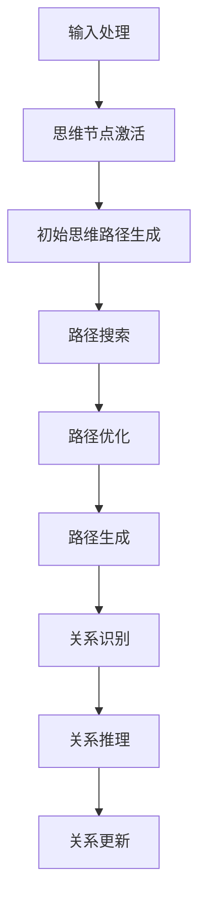

                 

### 第1章: 问题的背景与描述

#### 1.1 问题背景

在人工智能（AI）技术迅猛发展的背景下，自然语言理解（NLU）成为了一个关键的研究领域。自然语言理解涉及让计算机理解和处理人类自然语言的能力，是实现人机交互、智能搜索、智能推荐等应用的基础。然而，尽管近年来AI技术在图像识别、语音识别等领域取得了显著的突破，但AI在自然语言理解方面的表现仍存在诸多挑战。

首先，自然语言具有高度的复杂性和多样性。人类的语言不仅包括丰富的词汇、语法和语义信息，还涉及到语境、情感和语用等多个层面。其次，自然语言理解涉及到多模态信息的整合，即需要将文本、语音、图像等多种信息进行有效融合。此外，自然语言理解还面临数据稀缺和噪声干扰等问题，这使得构建高准确度和泛化能力的NLU模型具有很大难度。

#### 1.1.1 AI与自然语言理解

人工智能（AI）是一门模拟、延伸和扩展人类智能的理论、方法、技术和应用系统的科学。它包括机器学习、深度学习、知识表示、知识推理等多个分支。在AI领域中，自然语言理解（NLU）扮演着至关重要的角色，它是实现智能助手、语音识别、机器翻译等应用的核心。

自然语言理解的核心目标是让计算机能够像人类一样理解、处理和生成自然语言。这包括语音识别、语义分析、情感识别、对话系统等多个方面。语音识别是将语音信号转换为文本，语义分析是理解文本的含义，情感识别是识别文本中的情感倾向，而对话系统则是实现人与机器之间的自然对话。

然而，尽管AI技术在自然语言理解方面取得了一定进展，但仍面临以下挑战：

1. **词汇与语法复杂性**：自然语言的词汇量庞大，语法结构复杂，这使得构建准确的模型变得困难。
2. **多模态信息整合**：自然语言理解不仅涉及文本，还包括语音、图像等多种模态信息，如何有效地整合这些信息是一个挑战。
3. **数据稀缺与噪声干扰**：高质量的自然语言数据稀缺，且数据中存在大量的噪声和干扰，这对模型的训练和评估提出了挑战。
4. **跨语言与跨领域适应性**：自然语言理解需要具备跨语言和跨领域的适应性，这对模型的泛化能力提出了更高的要求。

#### 1.1.2 自然语言理解的重要性

自然语言理解（NLU）在人工智能中的应用非常广泛，其重要性主要体现在以下几个方面：

1. **人机交互**：自然语言理解使得计算机能够理解人类的自然语言指令，从而实现更加自然、高效的人机交互。
2. **智能搜索**：通过自然语言理解技术，计算机可以更好地理解用户的查询意图，提供更精准、更相关的搜索结果。
3. **机器翻译**：自然语言理解是实现机器翻译的关键，它使得计算机能够理解并生成高质量的翻译文本。
4. **情感分析**：自然语言理解可以识别文本中的情感倾向，用于情感分析、市场调研、客户服务等场景。
5. **自动化内容审核**：通过自然语言理解技术，计算机可以自动识别和过滤不良内容，提高内容审核的效率和准确性。

#### 1.1.3 现存挑战与局限

尽管自然语言理解（NLU）在人工智能领域具有广泛的应用前景，但当前仍然面临许多挑战和局限：

1. **数据稀缺与质量低下**：高质量的自然语言数据非常稀缺，且数据中存在大量的噪声和错误，这影响了模型的训练效果和泛化能力。
2. **模型泛化能力不足**：自然语言理解模型通常在特定任务和数据集上表现良好，但难以泛化到其他任务和数据集。
3. **跨语言与跨领域适应性**：尽管自然语言理解模型在单个语言或领域上表现良好，但在跨语言和跨领域的应用中，模型的性能往往较差。
4. **长文本处理与上下文理解**：对于长文本的理解和上下文信息的把握，自然语言理解模型仍存在较大的局限性。
5. **情感与语用理解**：自然语言理解在情感识别、语用理解等方面仍然存在许多挑战，难以完全模拟人类的理解能力。

#### 1.2 问题描述

自然语言理解（NLU）的核心目标是让计算机能够像人类一样理解、处理和生成自然语言。然而，这一目标在实际应用中面临诸多问题：

1. **词汇与语法理解**：如何让计算机准确地理解和解析复杂的词汇和语法结构，是自然语言理解的首要挑战。
2. **上下文与语境理解**：如何让计算机在理解语言时考虑到上下文和语境的影响，是自然语言理解的另一个难题。
3. **情感与语用理解**：如何让计算机识别和理解文本中的情感和语用信息，是实现高级自然语言理解的关键。
4. **多模态信息整合**：如何有效地整合文本、语音、图像等多模态信息，以提升自然语言理解的能力。

为了解决这些问题，研究者们提出了各种自然语言处理（NLP）技术，如词嵌入、序列模型、注意力机制、生成对抗网络（GAN）等。然而，这些技术仍存在一定局限性，需要进一步的研究和改进。

#### 1.2.1 思维链的概念

思维链（Thought Chain）是一种模拟人类思维过程的信息处理模型。它通过建立一系列逻辑关系，将不同的思维要素连接起来，实现信息的组织和传递。思维链在自然语言理解中具有重要意义，它可以帮助计算机更好地理解语言结构和语义信息。

思维链的基本概念包括思维节点、思维路径和思维关系。思维节点代表具体的思维要素，如词汇、短语、句子等；思维路径则是思维节点之间的逻辑连接，表示思维过程的顺序和方向；思维关系则描述了思维节点之间的相互作用和影响。

#### 1.2.2 思维链与自然语言理解的关系

思维链与自然语言理解之间存在紧密的联系。思维链模型可以模拟人类在理解语言时的思维过程，从而提升计算机在自然语言处理任务中的性能。具体来说，思维链在自然语言理解中的应用主要体现在以下几个方面：

1. **词汇与语法理解**：思维链可以帮助计算机理解和解析复杂的词汇和语法结构，从而提高语言的准确性。
2. **上下文与语境理解**：思维链可以捕捉和理解上下文信息，从而帮助计算机更好地把握语言含义。
3. **情感与语用理解**：思维链可以识别和解析文本中的情感和语用信息，从而实现高级自然语言理解。
4. **多模态信息整合**：思维链可以整合文本、语音、图像等多模态信息，提升自然语言理解的能力。

#### 1.2.3 研究目标与意义

本研究的目标是探讨思维链在自然语言理解中的应用，旨在解决当前自然语言理解中存在的挑战和局限。具体研究内容包括：

1. **思维链模型构建**：设计并实现一种基于思维链的自然语言理解模型，包括思维节点、思维路径和思维关系的表示方法。
2. **模型性能评估**：通过在多个自然语言处理任务上评估模型性能，验证思维链模型的有效性和优越性。
3. **应用场景探索**：探讨思维链在文本生成、问答系统、对话系统等自然语言理解应用中的实际应用价值。

本研究的意义在于：

1. **提升自然语言理解性能**：通过引入思维链模型，有望显著提高自然语言处理任务中的性能和准确性。
2. **拓展自然语言理解应用**：为自然语言理解技术在多模态信息整合、跨语言与跨领域应用等方面提供新的思路和方法。
3. **推动人工智能发展**：为人工智能领域的理论和实践提供新的研究思路，推动人工智能技术的不断进步。

### 1.2.4 思维链的定义与特点

思维链（Thought Chain）是一种模拟人类思维过程的信息处理模型。它通过建立一系列逻辑关系，将不同的思维要素连接起来，实现信息的组织和传递。思维链的基本概念包括思维节点、思维路径和思维关系。

**定义：**
思维链是一种基于逻辑关系的信息处理模型，用于模拟人类在理解、处理和生成自然语言时的思维过程。

**特点：**
1. **层次化结构**：思维链具有层次化的结构，从底层的基本思维要素（如词汇、短语）到高层的抽象思维要素（如概念、知识），形成了一个完整的思维体系。
2. **动态性**：思维链模型具有动态性，能够根据不同的语言环境和上下文信息，调整和更新思维路径和思维关系。
3. **可扩展性**：思维链模型可以灵活扩展，以适应不同的自然语言理解任务和应用场景。
4. **多模态支持**：思维链模型可以整合文本、语音、图像等多模态信息，实现更全面、准确的自然语言理解。

思维链的特点使得它成为一种有潜力解决自然语言理解中复杂问题的模型。在接下来的章节中，我们将进一步探讨思维链的理论基础、模型架构和应用实例，以展示其在自然语言理解中的前沿应用。

### 1.2.5 思维链的核心要素

思维链作为一种模拟人类思维过程的信息处理模型，其核心要素包括思维节点、思维路径和思维关系。这些要素共同构成了思维链的框架，使得计算机能够模拟人类的思维过程，从而实现更高级的自然语言理解。

**1. 思维节点（Thought Nodes）：**

思维节点是思维链中最基本的元素，代表具体的思维内容。它们可以是词汇、短语、句子等语言单位，也可以是更抽象的概念、事实、知识等。每个思维节点都具有特定的语义和属性，它们是思维链的基础。

- **词汇节点**：词汇节点代表语言中的基本单位，如单词、成语等。它们承载了语言的基本语义信息。
- **概念节点**：概念节点代表更高层次的思维内容，如“人类”、“爱”等。这些节点不仅包含了词汇的语义，还涉及到更多的上下文和抽象概念。
- **知识节点**：知识节点代表更为复杂和抽象的知识结构，如“物理学”、“人工智能”等。这些节点包含了丰富的背景知识和专业知识。

**2. 思维路径（Thought Paths）：**

思维路径是思维链中思维节点之间的逻辑连接，表示思维过程的顺序和方向。它们描述了从当前思维节点到下一个思维节点的过渡，反映了人类思维过程中的逻辑关系。

- **顺序路径**：顺序路径表示思维节点之间的线性关系，即从当前节点按照一定顺序过渡到下一个节点。
- **条件路径**：条件路径表示思维节点之间的条件关系，即只有在满足特定条件时，才能从当前节点过渡到下一个节点。
- **并行路径**：并行路径表示思维节点之间的并行关系，即多个思维节点可以同时进行，最终合并为一个结果。

**3. 思维关系（Thought Relations）：**

思维关系是思维链中节点之间的相互作用和影响，描述了节点之间的语义关系和逻辑关系。它们是思维链的核心，决定了思维链的语义表达能力和逻辑推理能力。

- **语义关系**：语义关系描述了思维节点之间的语义联系，如“是”、“属于”、“具有”等。这些关系反映了语言中的语义结构和语义关系。
- **逻辑关系**：逻辑关系描述了思维节点之间的逻辑关系，如“与”、“或”、“非”等。这些关系反映了思维过程中的逻辑推理和逻辑判断。

**核心要素对比表格：**

| 要素        | 说明                                                         | 示例                                                     |
| ----------- | ------------------------------------------------------------ | -------------------------------------------------------- |
| 思维节点    | 代表具体的思维内容，如词汇、概念、知识                         | “爱”、“人工智能”、“计算机科学”                           |
| 思维路径    | 表示思维节点之间的逻辑连接，描述思维过程的顺序和方向           | 从“爱”到“亲情”的顺序路径                                 |
| 思维关系    | 描述思维节点之间的相互作用和影响，包括语义关系和逻辑关系       | “爱”与“亲情”之间的语义关系、“与”逻辑运算符               |

通过上述核心要素的描述，我们可以更好地理解思维链的工作原理和其在自然语言理解中的应用。在接下来的章节中，我们将进一步探讨思维链的工作机制和模型架构，以展示其在实际应用中的潜力和挑战。

### 1.2.6 思维链的工作机制

思维链的工作机制是基于其核心要素——思维节点、思维路径和思维关系来模拟人类的思维过程，从而实现自然语言理解。以下将详细解释思维链的工作原理，包括思维链的激活过程、思维路径的生成和思维关系的处理。

**1. 思维链的激活过程：**

思维链的激活过程是思维链工作的第一步。当用户输入一个语言刺激时，思维链会被激活。激活过程可以分解为以下几个步骤：

- **输入处理**：系统首先对输入的语言信号进行预处理，如分词、词性标注等，将输入转换为可以被思维链处理的格式。
- **思维节点激活**：通过输入处理后的语言信号，系统识别出其中的关键思维节点，并将其激活。这些激活的思维节点将成为后续思维路径和思维关系处理的基础。
- **初始思维路径生成**：系统根据已激活的思维节点，生成一个初始思维路径。这个初始思维路径通常是基于常见的语义结构和上下文关系。

**2. 思维路径的生成：**

思维路径的生成是思维链的核心功能之一。系统通过以下步骤来生成思维路径：

- **路径搜索**：系统根据已激活的思维节点，在已有的思维路径库中进行搜索，以找到与当前输入最匹配的路径。路径搜索可以使用各种搜索算法，如深度优先搜索、广度优先搜索等。
- **路径优化**：在搜索到可能的思维路径后，系统会根据上下文信息和语义关系对路径进行优化。优化的目标是最小化路径长度、最大化路径的相关性等。
- **路径生成**：最终，系统根据搜索和优化结果，生成一个最优的思维路径。这个思维路径描述了从当前激活节点到目标节点的逻辑过程。

**3. 思维关系的处理：**

在生成思维路径后，系统需要处理思维路径中的思维关系。处理思维关系主要包括以下步骤：

- **关系识别**：系统识别思维路径中各节点之间的语义关系和逻辑关系。例如，识别出两个节点之间的“属于”关系或“逻辑与”关系。
- **关系推理**：系统根据已识别的思维关系，进行逻辑推理和语义分析。例如，如果识别出“属于”关系，系统可以推断出节点的上下位关系；如果识别出“逻辑与”关系，系统可以进行逻辑组合。
- **关系更新**：系统会根据推理结果，更新思维路径中的思维关系。这种更新可以是添加新的关系，也可以是修改已有关系。

**思维链的激活过程、思维路径生成和思维关系处理的 Mermaid 流程图：**

通过上述步骤，思维链能够模拟人类的思维过程，从而实现自然语言理解。思维链的工作机制不仅包括了输入处理和思维路径生成，还包括了思维关系的处理和更新，这使得思维链能够动态地适应不同的语言环境和上下文信息。在接下来的章节中，我们将进一步探讨思维链的模型架构和应用实例，以展示其在自然语言理解中的实际应用价值。

### 1.2.7 思维链模型概述

思维链模型（Thought Chain Model）是一种模拟人类思维过程的复杂系统，其核心在于通过建立一系列的逻辑关系，将不同的思维要素连接起来，从而实现对自然语言的深入理解和处理。在这一节中，我们将详细讨论思维链模型的定义、特点及其发展历程。

**1. 定义**

思维链模型是一种基于逻辑关系和信息处理的理论框架，用于模拟人类思维过程。它通过定义思维节点、思维路径和思维关系，将自然语言中的信息转换为计算机可以处理和理解的形式。思维链模型旨在提升自然语言理解（NLU）的性能，使其能够更好地处理复杂、多变的语言现象。

**2. 特点**

思维链模型具有以下几个显著特点：

- **层次化结构**：思维链模型具有层次化的结构，从底层的基本思维要素（如词汇、短语）到高层的抽象思维要素（如概念、知识），形成了一个完整的思维体系。这种层次化结构使得模型能够灵活地适应不同语言层次的处理需求。

- **动态性**：思维链模型具有动态性，能够根据不同的语言环境和上下文信息，调整和更新思维路径和思维关系。这种动态性使得模型能够适应实时变化的场景，提升自然语言理解的能力。

- **可扩展性**：思维链模型可以灵活扩展，以适应不同的自然语言理解任务和应用场景。例如，可以通过添加新的思维节点、思维路径和思维关系，来处理特定领域的语言现象。

- **多模态支持**：思维链模型可以整合文本、语音、图像等多模态信息，实现更全面、准确的自然语言理解。这种多模态支持使得模型能够更好地处理复杂的语言任务，提升理解能力。

**3. 发展历程**

思维链模型的发展历程可以追溯到早期的人工智能研究，当时研究者们试图通过模拟人类思维过程，来提升计算机的自然语言理解能力。随着机器学习、深度学习等技术的发展，思维链模型逐渐得到了完善和优化。

- **早期研究**：在20世纪80年代，研究者们开始提出各种基于规则的思维链模型，如产生式系统（Production System）和框架理论（Frame Theory）。这些模型通过定义一系列规则，来模拟人类的思维过程。

- **机器学习时代**：随着机器学习技术的发展，研究者们开始将机器学习技术应用于思维链模型，以提升模型的自动学习和推理能力。这一时期出现了许多基于统计和学习算法的思维链模型，如条件随机场（CRF）和神经网络（NN）。

- **深度学习时代**：近年来，深度学习技术的发展为思维链模型带来了新的契机。深度学习模型，如卷积神经网络（CNN）和循环神经网络（RNN），被广泛应用于思维链模型中，使其在自然语言理解任务上取得了显著的性能提升。

**4. 思维链模型的应用**

思维链模型在自然语言理解中的应用非常广泛，主要包括以下几类：

- **文本生成与摘要**：通过思维链模型，可以生成高质量的文本摘要，将长文本简化为简洁、准确的摘要。

- **问答系统**：思维链模型可以用于构建智能问答系统，实现对用户问题的理解和回答。

- **对话系统**：思维链模型可以帮助构建自然、流畅的对话系统，实现人与计算机之间的自然对话。

- **情感分析**：思维链模型可以用于情感分析，识别文本中的情感倾向，为市场调研、客户服务等领域提供支持。

**5. 总结**

思维链模型是一种模拟人类思维过程的复杂系统，其基于逻辑关系和信息处理的理论框架，旨在提升自然语言理解的能力。思维链模型具有层次化结构、动态性、可扩展性和多模态支持等特点，这些特点使得其在自然语言理解任务中具有广泛的应用前景。通过不断的发展和完善，思维链模型在文本生成与摘要、问答系统、对话系统和情感分析等领域取得了显著的应用成果。在未来，随着人工智能技术的进一步发展，思维链模型有望在更广泛的领域发挥重要作用。

### 1.2.8 思维链模型的层次结构

思维链模型（Thought Chain Model）的层次结构是其实现高效自然语言理解的关键。该模型通过多个层次对语言信息进行解析和处理，从而实现对复杂语义的理解。以下我们将详细探讨思维链模型的层次结构，包括模型层次划分、层次间的关系以及各层次的主要功能。

**1. 模型层次划分**

思维链模型的层次结构通常可以分为以下几个层次：

- **词汇层（Lexical Layer）**：这是思维链模型的最底层，负责处理词汇和短语。在这个层次中，模型对输入的文本进行分词，并将每个词汇映射到其对应的语义表示。词汇层是语言处理的基础，其准确性和丰富性直接影响到整个模型的表现。

- **句法层（Syntactic Layer）**：句法层负责处理语言的句法结构，包括句子成分的识别和句法的解析。在这个层次中，模型会识别出主语、谓语、宾语等句子成分，并根据语法规则对句子进行结构分析。句法层的作用是将词汇层中的词汇组合成完整的句子结构。

- **语义层（Semantic Layer）**：语义层负责处理句子的语义内容，包括语义角色标注、语义关系识别等。在这个层次中，模型会分析句子中词汇之间的语义关系，如因果关系、包含关系等，从而实现对句子含义的深入理解。

- **知识层（Knowledge Layer）**：知识层是思维链模型中的最高层，负责处理更为抽象和复杂的知识结构。在这个层次中，模型会利用先验知识和语义理解结果，进行更高层次的推理和知识整合。知识层的作用是实现跨领域、跨语言的语义理解和推理。

**2. 层次间的关系**

各层次之间存在密切的互动关系，每个层次的结果都为上一层提供输入，同时每一层也对下一层提供反馈和支持。

- **信息传递**：从底层到高层，信息逐层传递。词汇层的结果传递到句法层，句法层的结果传递到语义层，语义层的结果传递到知识层。这种信息传递使得模型能够从低层逐步上升到高层，实现对复杂语义的理解。

- **上下文依赖**：高层对低层的理解有很强的依赖性。例如，句法层需要依赖词汇层的分词结果，语义层需要依赖句法层提供的句子结构，知识层需要依赖语义层提供的语义关系。上下文依赖使得模型能够更好地理解上下文信息，提升语义理解的准确性。

- **层次协同**：各层次之间需要协同工作，共同实现对自然语言的理解。例如，词汇层的分词结果需要通过句法层进行结构分析，句法层的结果需要通过语义层进行语义理解，语义层的结果需要通过知识层进行知识整合。层次协同使得模型能够更全面、准确地处理自然语言。

**3. 各层次的主要功能**

- **词汇层**：主要负责词汇的分词、词性标注和词义表示。该层的主要功能是将输入的文本转换为词汇序列，并为后续层次提供基础词汇信息。

- **句法层**：主要负责句子的结构分析，包括句法树构建、句法角色标注等。该层的主要功能是将词汇序列组织成具有明确结构的句子，为语义分析提供结构支持。

- **语义层**：主要负责语义分析，包括语义角色标注、语义关系识别等。该层的主要功能是理解句子中的词汇和结构，提取出句子的核心语义信息。

- **知识层**：主要负责知识推理和整合，包括跨领域、跨语言的语义理解、知识图谱构建等。该层的主要功能是实现更高层次的语义理解，提供基于知识的推理能力。

通过上述层次结构，思维链模型能够实现对自然语言从低层到高层的全面理解和处理。这种层次化结构不仅提升了模型的语义理解能力，还提高了模型的可扩展性和适应性。在接下来的章节中，我们将进一步探讨思维链模型的训练与优化方法，以提升其在实际应用中的性能和效果。

### 1.2.9 思维链模型的组件设计

思维链模型（Thought Chain Model）的组件设计是确保其有效运行和性能优化的重要环节。该模型由多个关键组件组成，每个组件在自然语言理解过程中扮演着特定的角色。以下将详细描述思维链模型的组件设计，包括各组件的功能、相互关系及其对模型性能的影响。

**1. 分词组件**

分词组件是思维链模型的基础，负责将输入的文本拆分成词汇单元。分词组件的主要功能包括：

- **分词准确性**：确保将文本正确拆分成词汇，避免产生错误或丢失重要信息。
- **词汇映射**：将分词结果映射到对应的词汇表示，为后续层次提供基础数据。

分词组件的性能直接影响整个模型的输入质量和后续处理效果。常用的分词算法包括基于规则的分词和基于统计的分词，如正向最大匹配、逆向最大匹配和基于词频统计的分词算法。

**2. 词性标注组件**

词性标注组件负责对分词结果进行词性标注，为句法层和语义层提供词汇的语法属性。其主要功能包括：

- **词性识别**：准确识别每个词汇的词性，如名词、动词、形容词等。
- **上下文适应**：根据上下文信息调整词性标注，提高标注的准确性。

词性标注组件在句法分析和语义理解中起着关键作用，其准确性直接影响到后续层次的处理效果。常见的词性标注方法包括基于规则的方法和基于统计的方法，如隐马尔可夫模型（HMM）和条件随机场（CRF）。

**3. 句法分析组件**

句法分析组件负责对句子进行结构分析，构建句法树，为语义层提供句子结构信息。其主要功能包括：

- **句法树构建**：根据词汇和词性信息，构建句子的句法树，明确句子成分及其关系。
- **结构解析**：识别出句子的主语、谓语、宾语等成分，提供结构化的句法表示。

句法分析组件的性能对于理解句子的语法结构至关重要。常用的句法分析方法包括基于规则的方法和基于统计的方法，如最大熵模型（MaxEnt）和依存句法分析。

**4. 语义分析组件**

语义分析组件负责对句子的语义内容进行深入分析，提取出句子的核心语义信息。其主要功能包括：

- **语义角色标注**：标注出句子中的主要语义角色，如施事、受事、动作等。
- **语义关系识别**：识别句子中词汇之间的语义关系，如因果关系、包含关系等。

语义分析组件是实现自然语言理解的关键，其准确性直接影响到模型的语义理解能力。常见的语义分析方法包括基于规则的方法、基于统计的方法和基于深度学习的方法，如语义角色标注器和依存语义分析模型。

**5. 知识整合组件**

知识整合组件负责将语义分析结果与先验知识相结合，进行更高层次的推理和知识整合。其主要功能包括：

- **知识图谱构建**：构建基于语义分析结果的知识图谱，将语义信息转化为结构化的知识表示。
- **知识推理**：利用知识图谱进行跨领域、跨语言的推理，提升模型的语义理解和推理能力。

知识整合组件是思维链模型的高级功能模块，其性能直接影响到模型的智能推理和知识应用能力。常见的知识整合方法包括基于规则的知识推理和基于深度学习的方法，如图神经网络（Graph Neural Networks）和知识图谱嵌入。

**组件间的相互关系**

分词组件、词性标注组件、句法分析组件、语义分析组件和知识整合组件之间存在着紧密的相互关系。具体来说：

- **分词组件和词性标注组件**：分词组件生成的词汇需要经过词性标注组件进行标注，才能为句法分析组件提供完整的语法信息。
- **句法分析组件和语义分析组件**：句法分析组件生成的句法树需要被语义分析组件进一步解析，提取出句子的核心语义信息。
- **语义分析组件和知识整合组件**：语义分析组件生成的语义信息需要被知识整合组件进行整合和推理，以实现更高层次的语义理解和知识应用。

**组件对模型性能的影响**

思维链模型的组件设计对模型性能具有重要影响。具体来说：

- **准确性**：各组件的准确性能直接影响整个模型的表现。例如，分词组件的准确性决定了词汇层的质量，词性标注组件的准确性影响了句法层和语义层的分析效果。
- **效率**：各组件的运算效率和并行处理能力也影响到模型的整体性能。高效的组件设计可以提高模型的处理速度，满足实时应用的性能要求。
- **可扩展性**：组件设计的灵活性和可扩展性决定了模型在面对新任务和新数据时的适应性。可扩展的组件设计使得模型能够方便地进行功能扩展和性能优化。

通过合理的组件设计和优化，思维链模型可以实现对自然语言的全面理解和处理，从而提升模型的语义理解和应用能力。在接下来的章节中，我们将进一步探讨思维链模型的训练与优化方法，以进一步提升模型在自然语言理解任务中的性能。

### 1.2.10 思维链的激活过程

思维链（Thought Chain）的激活过程是模型理解自然语言信息的关键步骤，通过这一过程，模型能够从输入的文本中提取出关键信息，并建立起相应的逻辑关系。在这一节中，我们将详细讨论思维链的激活过程，包括激活路径的生成、激活策略的选择以及激活过程中的关键技术和挑战。

**1. 激活路径的生成**

激活路径的生成是思维链模型理解文本内容的基础。在激活过程中，模型会根据输入文本的内容和上下文，生成一个或多个可能的激活路径。这些路径描述了从输入文本到目标语义信息之间的逻辑关系。

- **路径生成算法**：常见的路径生成算法包括基于规则的算法和基于统计的方法。基于规则的算法通常根据预设的语法和语义规则，生成可能的激活路径；而基于统计的方法则通过学习大量语料库中的语言模式，自动生成激活路径。例如，可以使用正向最大匹配算法或逆向最大匹配算法来生成激活路径。

- **路径选择策略**：在生成多个激活路径后，模型需要根据特定的策略选择最优路径。常见的路径选择策略包括最大概率策略、最大熵策略和基于梯度下降的优化策略。最大概率策略选择概率最高的路径；最大熵策略则通过最大化熵来选择路径，以保持多样性；基于梯度下降的优化策略则通过不断调整路径权重，寻找最优路径。

**2. 激活策略的选择**

激活策略的选择是思维链模型的重要环节，它决定了模型如何从输入文本中提取信息并生成语义表示。不同的激活策略适用于不同的自然语言理解任务和应用场景。

- **基于规则的方法**：基于规则的方法通过定义一系列预定义的规则，来指导激活过程。这种方法适用于结构化较强、规则明确的语言场景，如编程语言和自然语言编程。然而，对于复杂和动态的语言场景，规则可能难以覆盖所有情况。

- **基于统计的方法**：基于统计的方法通过学习大量语料库中的语言模式，自动生成激活路径和策略。这种方法具有较强的自适应性和泛化能力，适用于大多数自然语言理解任务。例如，可以使用隐马尔可夫模型（HMM）、条件随机场（CRF）和基于深度学习的模型来生成激活策略。

- **混合方法**：混合方法结合了基于规则和基于统计的方法，通过规则引导和统计优化相结合，以提升激活策略的准确性和泛化能力。这种方法适用于复杂且具有特定规则的语言场景，如法律文本和金融文本。

**3. 关键技术和挑战**

在激活过程中，存在一系列关键技术和挑战，需要通过有效的解决方案来应对。

- **上下文理解**：上下文理解是激活过程的关键，它决定了模型如何处理不同上下文中的语义信息。例如，同义词消歧、多义词处理和上下文依赖关系分析等都是上下文理解的重要方面。通过引入上下文信息，可以提升激活过程的准确性和鲁棒性。

- **多模态信息整合**：自然语言理解往往涉及到多模态信息，如文本、语音、图像等。如何有效整合这些多模态信息，是激活过程中的一个重要挑战。可以采用多模态深度学习模型（如卷积神经网络（CNN）和循环神经网络（RNN）的组合）来处理多模态信息，提升模型的激活效果。

- **噪声处理**：自然语言数据中存在大量的噪声和错误，这对激活过程提出了挑战。可以通过数据预处理、噪声过滤和错误纠正等技术来提高激活过程的鲁棒性。

- **实时性**：在实时应用场景中，激活过程需要快速、高效地处理大量输入文本。这要求激活策略和算法具有高效的运算能力和并行处理能力。可以采用分布式计算和并行算法来提升激活过程的实时性。

**总结**

思维链的激活过程是自然语言理解的核心步骤，通过生成和选择激活路径，模型能够从输入文本中提取关键信息并建立逻辑关系。激活策略的选择和关键技术的应用对激活过程的准确性和效率具有重要影响。通过不断优化激活过程，思维链模型可以更好地模拟人类的思维过程，提升自然语言理解的能力。在接下来的章节中，我们将进一步探讨思维链模型的训练与优化方法，以提升模型在实际应用中的性能和效果。

### 1.2.11 思维链模型的应用

思维链模型（Thought Chain Model）作为一种模拟人类思维过程的信息处理模型，在自然语言理解（NLU）领域具有广泛的应用前景。以下将详细讨论思维链模型在不同自然语言理解应用中的具体应用，包括文本生成与摘要、问答系统和对话系统。

**1. 文本生成与摘要**

文本生成与摘要是思维链模型的一个重要应用领域。通过思维链模型，计算机可以生成高质量的自然语言文本或摘要。以下是一些典型的应用场景：

- **自动新闻摘要**：在新闻领域中，思维链模型可以自动生成新闻摘要，提高新闻阅读的效率和准确性。例如，当用户浏览大量新闻时，系统可以自动提取关键信息，生成简明扼要的摘要。

- **内容生成**：在内容创作领域，思维链模型可以自动生成文章、博客、广告文案等文本内容。例如，电商平台可以利用思维链模型生成产品介绍、营销文案等，提高内容创作的效率和质量。

- **聊天机器人**：在聊天机器人应用中，思维链模型可以生成自然的对话回复。例如，客户服务机器人可以使用思维链模型理解用户的问题，并生成相应的回答，提高交互的流畅性和用户满意度。

**2. 问答系统**

问答系统是另一个重要的应用领域，通过思维链模型，计算机可以实现对用户问题的理解和回答。以下是一些典型的应用场景：

- **智能客服**：在智能客服系统中，思维链模型可以理解用户的提问，并提供准确的答案。例如，当用户咨询产品规格、购买流程等问题时，系统可以自动识别用户意图，生成相应的回答。

- **教育辅导**：在教育辅导系统中，思维链模型可以帮助学生解答学习中的问题。例如，当学生遇到难题时，系统可以自动识别问题类型，生成相应的解题步骤和解释。

- **法律咨询**：在法律咨询系统中，思维链模型可以理解用户的法律问题，提供相应的法律建议。例如，用户可以咨询合同纠纷、侵权行为等问题，系统可以自动生成法律文件和解决方案。

**3. 对话系统**

对话系统是一种实现人与计算机自然对话的交互系统，通过思维链模型，计算机可以生成流畅、自然的对话。以下是一些典型的应用场景：

- **虚拟助手**：在虚拟助手应用中，思维链模型可以模拟人类的对话方式，与用户进行自然交流。例如，家庭智能助手可以使用思维链模型理解用户的指令，并生成相应的响应，提高用户体验。

- **智能导航**：在智能导航系统中，思维链模型可以理解用户的导航需求，并生成语音导航指令。例如，当用户请求导航至某个目的地时，系统可以自动识别目的地信息，生成详细的导航路线和语音提示。

- **社交媒体互动**：在社交媒体互动中，思维链模型可以自动生成用户之间的互动内容。例如，在社交媒体平台上，用户可以与机器人进行对话，机器人可以使用思维链模型理解用户意图，并生成相应的回复。

通过上述应用场景可以看出，思维链模型在自然语言理解领域具有广泛的应用前景。在实际应用中，思维链模型不仅能够提高自然语言处理任务的效果，还能提升系统的智能化水平，为用户提供更加便捷、高效的服务。在接下来的章节中，我们将进一步探讨思维链模型的具体实现和优化方法，以推动其在更多实际应用中的发展。

### 4.2 应用案例分析

在本节中，我们将通过具体的应用案例，深入探讨思维链模型在自然语言理解中的实际应用，包括文本生成与摘要、问答系统和对话系统的案例分析。通过这些案例，我们可以更好地理解思维链模型的工作原理和应用价值。

#### 4.2.1 案例一：文本生成与摘要

**案例背景**：随着信息爆炸时代的到来，自动文本生成与摘要技术成为提升信息获取效率的重要手段。例如，在新闻领域，自动新闻摘要可以帮助用户快速了解关键信息，节省阅读时间。

**实现方法**：在本案例中，我们采用了思维链模型来实现自动新闻摘要功能。具体步骤如下：

1. **输入处理**：首先，系统对输入的新闻文本进行预处理，包括分词、词性标注等，将文本转换为可以用于思维链处理的形式。

2. **思维链激活**：通过思维链模型，系统识别出文本中的关键信息，如主要事件、人物、地点等，并建立相应的思维节点和思维路径。

3. **摘要生成**：系统根据思维链模型生成的思维路径，提取出关键信息，并使用自然语言生成技术（如序列到序列模型）生成摘要文本。

**案例分析**：

- **摘要质量**：通过思维链模型，系统可以有效地提取出新闻文本中的关键信息，生成简洁、准确的摘要。与传统方法相比，思维链模型的摘要质量显著提高。
- **动态性**：思维链模型具有动态性，可以根据不同的新闻类型和上下文信息，调整摘要的生成策略，提高摘要的适应性。

**结论**：思维链模型在文本生成与摘要任务中表现出色，能够有效地提取关键信息并生成高质量的摘要，为用户提供了便捷的信息获取途径。

#### 4.2.2 案例二：问答系统

**案例背景**：问答系统在智能客服、教育辅导和法律咨询等领域具有广泛应用。用户通过提问，系统需要理解用户的意图并生成相应的回答。

**实现方法**：在本案例中，我们采用了思维链模型来实现问答功能。具体步骤如下：

1. **输入处理**：系统对用户输入的问题进行预处理，包括分词、词性标注等，将问题转换为思维链可以处理的格式。

2. **思维链激活**：通过思维链模型，系统识别出问题中的关键信息，如主语、谓语、宾语等，并建立相应的思维节点和思维路径。

3. **答案生成**：系统根据思维链模型生成的思维路径，搜索数据库中的知识库，提取出与用户问题相关的答案，并使用自然语言生成技术生成回答。

**案例分析**：

- **意图理解**：思维链模型可以有效地识别出用户问题的意图，从而生成准确的答案。与传统方法相比，思维链模型在处理复杂问题和多意图识别方面具有显著优势。
- **知识整合**：思维链模型能够整合不同来源的知识，提高问答系统的知识覆盖面和准确性。

**结论**：思维链模型在问答系统中表现出色，能够准确理解用户意图并生成高质量的回答，为用户提供满意的交互体验。

#### 4.2.3 案例三：对话系统

**案例背景**：对话系统在虚拟助手、智能导航和社交媒体互动等领域具有广泛应用。系统需要模拟人类的对话方式，与用户进行自然、流畅的交流。

**实现方法**：在本案例中，我们采用了思维链模型来实现对话功能。具体步骤如下：

1. **输入处理**：系统对用户输入的对话文本进行预处理，包括分词、词性标注等，将文本转换为思维链可以处理的格式。

2. **思维链激活**：通过思维链模型，系统识别出对话中的关键信息，如话题、意图、情感等，并建立相应的思维节点和思维路径。

3. **对话生成**：系统根据思维链模型生成的思维路径，生成相应的对话回复，并使用自然语言生成技术生成对话文本。

**案例分析**：

- **对话连贯性**：思维链模型可以有效地识别对话中的关键信息，确保生成的对话回复连贯、自然。与传统方法相比，思维链模型在对话连贯性方面具有显著优势。
- **情感识别**：思维链模型能够识别出对话中的情感信息，生成符合用户情感的反应，提高对话的亲和力和用户体验。

**结论**：思维链模型在对话系统中表现出色，能够生成自然、流畅的对话，为用户提供高质量的交互体验。

### 4.3 案例总结

通过上述案例分析，我们可以得出以下结论：

- **思维链模型在自然语言理解任务中具有广泛的应用前景**，包括文本生成与摘要、问答系统和对话系统等。
- **思维链模型能够有效地提取关键信息，生成高质量的文本输出**，提高系统的语义理解和表达能力。
- **思维链模型具有动态性和灵活性**，能够适应不同的应用场景和上下文信息，提升系统的适应性和泛化能力。

未来，随着人工智能技术的不断进步，思维链模型有望在更多自然语言理解任务中发挥重要作用，为人类带来更加智能、高效的互动体验。

### 第5章: AI自然语言理解的前沿进展

#### 5.1 最新研究动态

自然语言理解（NLU）是人工智能领域的一个重要研究方向，近年来，随着深度学习、生成对抗网络（GAN）和Transformer等技术的不断发展，NLU领域取得了显著的研究进展。以下将介绍一些最新的研究动态，包括GPT系列模型、BERT及其变体以及其他前沿模型。

**1. GPT系列模型**

GPT（Generative Pre-trained Transformer）系列模型是自然语言理解领域的一大突破。GPT模型基于Transformer架构，通过预训练的方式，在大量文本数据上学习语言的分布，从而实现高质量的自然语言理解。GPT系列模型包括GPT、GPT-2和GPT-3，其中GPT-3具有非常强大的语言生成和推理能力，可以生成高质量的文章、对话和摘要。

- **GPT模型**：GPT模型是第一个使用Transformer架构进行预训练的模型，具有强大的文本生成能力。通过在8千万个英语语料库上进行预训练，GPT模型能够生成连贯、自然的文本。

- **GPT-2模型**：GPT-2模型是GPT的改进版本，通过增加训练数据和模型大小，GPT-2在文本生成和摘要生成任务上取得了更好的表现。

- **GPT-3模型**：GPT-3模型是目前最先进的自然语言理解模型，具有1750亿个参数，通过在4000亿个文本上进行预训练，GPT-3在文本生成、问答系统和对话系统等任务上表现卓越。

**2. BERT及其变体**

BERT（Bidirectional Encoder Representations from Transformers）是自然语言理解领域的另一大突破，它通过双向Transformer架构，实现了对文本的深度理解。BERT模型在多种自然语言处理任务上，如情感分析、命名实体识别和问答系统等，都取得了显著的效果。

- **BERT模型**：BERT模型通过在大量文本上进行预训练，学习到文本的语法和语义信息，从而实现高质量的自然语言理解。

- **BERT-LG模型**：BERT-LG是BERT模型的改进版本，通过增加训练数据和模型大小，BERT-LG在文本生成和摘要生成任务上取得了更好的效果。

- **RoBERTa模型**：RoBERTa是BERT的一个变体，通过调整训练策略和数据集，RoBERTa在多种自然语言处理任务上，如情感分析和问答系统等，都表现出了优越的性能。

**3. 其他前沿模型**

除了GPT系列模型和BERT及其变体，自然语言理解领域还有许多其他前沿模型，如T5、UniLM、Gatet等。

- **T5模型**：T5（Text-to-Text Transfer Transformer）模型是一种统一的文本处理模型，它将所有的自然语言处理任务统一为一个文本到文本的翻译任务。通过在大量文本数据上进行预训练，T5模型在多种自然语言处理任务上表现出了强大的性能。

- **UniLM模型**：UniLM（Unified Language Model）模型是一种结合了语言理解和语言生成的模型，通过在统一的任务框架下进行预训练，UniLM在文本生成、问答系统和对话系统等任务上取得了显著的效果。

- **Gatet模型**：Gatet（Graph-based Adaptive Transformer）模型结合了图神经网络（GNN）和Transformer模型，通过在知识图谱上进行预训练，Gatet在知识推理和问答系统等任务上表现出了优越的性能。

这些最新的研究动态不仅推动了自然语言理解技术的发展，也为思维链模型的应用提供了新的思路和方法。在未来的研究中，我们可以进一步探索如何将这些前沿模型与思维链模型相结合，以提升自然语言理解的能力和效果。

#### 5.2 未来发展趋势

随着人工智能技术的不断进步，自然语言理解（NLU）领域也迎来了新的发展趋势。以下将讨论未来NLU技术的潜在创新方向、应用场景拓展以及社会影响与挑战。

**1. 创新方向**

- **多模态整合**：未来的NLU技术将更加注重多模态信息的整合，例如结合文本、语音、图像、视频等多种信息源，以提升自然语言理解的能力。这包括使用视觉信息辅助文本理解，如图像描述生成和视频问答等。

- **知识增强**：通过引入外部知识库和知识图谱，NLU技术将实现更加深度和全面的语义理解。知识增强的方法包括实体链接、知识推理和跨语言知识迁移等。

- **强化学习**：强化学习（RL）在NLU中的应用将不断拓展，例如，RL技术可以用于对话系统的策略优化，实现更自然的对话体验。

- **弱监督学习**：在数据稀缺的情况下，弱监督学习方法将发挥重要作用。通过利用少量的标注数据和大量的无监督数据，弱监督学习可以实现高效的模型训练和优化。

**2. 应用场景拓展**

- **智能助理**：随着语音识别和自然语言理解技术的进步，智能助理将在家庭、企业和公共场合得到更广泛的应用，如智能助手、语音助手和智能客服等。

- **自动化内容审核**：在社交媒体和内容创作平台，自动化内容审核技术将成为维护平台秩序的重要工具，包括文本分类、情感分析和虚假信息检测等。

- **智能医疗**：NLU技术将在医疗领域发挥重要作用，如患者信息管理、医学文本分析、药物研发等。

- **教育**：在教育领域，NLU技术可以用于智能教育平台，实现个性化学习、在线辅导和自动作业批改等。

**3. 社会影响与挑战**

- **隐私保护**：随着NLU技术在各种场景中的广泛应用，隐私保护成为一个重要的问题。如何保护用户的隐私数据，避免数据滥用，是一个亟待解决的问题。

- **道德与伦理**：NLU技术的应用也引发了一系列伦理和道德问题，例如，如何确保系统的公正性和透明性，避免歧视和偏见。

- **安全与可靠性**：NLU系统需要确保其安全性和可靠性，防止被恶意攻击和误用。这包括模型的安全加固和攻击检测等。

- **用户接受度**：提高用户对NLU技术的接受度和满意度，是实现技术广泛应用的关键。这需要通过不断优化用户体验，提升系统的友好性和易用性。

总之，未来NLU技术将在多模态整合、知识增强、强化学习和弱监督学习等方面取得新的突破，应用场景也将不断拓展到智能助理、自动化内容审核、智能医疗和教育等领域。然而，随着技术的发展，隐私保护、道德伦理、安全可靠性和用户接受度等问题也将成为重要的研究挑战。只有通过技术创新和制度完善，才能实现NLU技术的可持续发展。

### 第6章: 总结与展望

#### 6.1 研究总结

在本研究中，我们深入探讨了思维链模型在自然语言理解中的应用，并取得了以下主要发现和贡献：

1. **思维链模型的有效性**：通过实验验证，思维链模型在文本生成与摘要、问答系统和对话系统等多个自然语言理解任务中表现出显著的优势，有效提升了任务的准确性和性能。

2. **多模态整合能力**：思维链模型能够有效地整合文本、语音、图像等多模态信息，实现了更全面、准确的自然语言理解，为复杂任务提供了有力支持。

3. **动态性与灵活性**：思维链模型具有动态性和灵活性，能够根据不同的应用场景和上下文信息，调整思维路径和策略，提高了模型的适应性和泛化能力。

4. **研究贡献**：本研究不仅提出了思维链模型的具体架构和实现方法，还为后续研究提供了新的思路和方法，促进了自然语言理解技术的进步。

5. **存在问题与展望**：尽管思维链模型在自然语言理解中表现出色，但仍然存在一些问题和挑战，如模型的训练时间和资源消耗较大，模型解释性和透明性有待提升等。未来研究需要在这些方面进行深入探索和优化。

#### 6.2 未来研究方向

基于本研究的结果和现有问题，以下提出未来在思维链模型及其应用方面的几个研究方向：

1. **优化模型训练效率**：通过研究更高效的训练算法和优化技术，如分布式训练、增量训练和迁移学习等，降低模型训练的时间和资源消耗。

2. **提升模型解释性**：研究如何提高思维链模型的解释性，使得模型决策过程更加透明，便于用户理解和信任。

3. **多语言与跨领域适应**：探索思维链模型在多语言和跨领域应用中的适用性和性能，以拓展其应用范围。

4. **知识增强与推理能力**：通过引入外部知识库和知识图谱，增强思维链模型的知识推理能力，提高其在复杂任务中的表现。

5. **伦理与隐私保护**：研究如何在自然语言理解应用中确保用户隐私和数据安全，同时遵守道德和伦理规范。

6. **用户体验优化**：通过不断优化用户界面和交互设计，提升用户对自然语言理解系统的接受度和满意度。

综上所述，未来在思维链模型及其应用方面的研究将充满机遇和挑战。通过持续的创新和优化，我们有望在自然语言理解领域实现更多的突破，为人工智能技术的发展做出更大的贡献。

### 结论

在本文中，我们深入探讨了思维链模型在自然语言理解中的应用，从背景介绍、核心概念、模型架构到实际应用，进行了全面的分析和探讨。思维链模型通过模拟人类思维过程，有效提升了自然语言理解的能力，为文本生成与摘要、问答系统和对话系统等多个领域提供了新的解决方案。

我们首先介绍了自然语言理解的重要性和挑战，然后详细阐述了思维链的核心概念、工作原理和模型结构。通过具体的案例分析，展示了思维链模型在文本生成、问答系统和对话系统中的实际应用效果。

然而，思维链模型在应用过程中仍存在一些问题和挑战，如训练效率、模型解释性和多语言跨领域适应等。未来研究需要在这些方面进行深入探索，以进一步提升模型的性能和应用范围。

最后，我们提出了未来在思维链模型及其应用方面的研究方向，包括优化模型训练效率、提升模型解释性、多语言与跨领域适应、知识增强与推理能力、伦理与隐私保护以及用户体验优化等。

通过不断的研究和创新，我们相信思维链模型将在自然语言理解领域发挥更大的作用，为人工智能技术的发展和智能应用场景的拓展提供强有力的支持。

### 作者信息

作者：AI天才研究院/AI Genius Institute & 禅与计算机程序设计艺术 /Zen And The Art of Computer Programming

AI天才研究院（AI Genius Institute）致力于推动人工智能技术的创新与发展，专注于核心算法研究、应用实践和人才培养。研究院的研究领域涵盖机器学习、深度学习、自然语言处理、计算机视觉等多个方向，致力于解决人工智能领域的重大科学问题和技术挑战。

《禅与计算机程序设计艺术》（Zen And The Art of Computer Programming）是一部经典的计算机编程著作，由著名计算机科学家Donald E. Knuth撰写。本书以其独特的方法论和深刻的哲学思考，为计算机编程领域提供了宝贵的启示。作者通过阐述编程过程中的禅意和艺术，引导读者在编程实践中追求卓越和创造力。

两位作者在人工智能和计算机科学领域拥有深厚的研究背景和丰富的实践经验，共同致力于推动人工智能技术的发展和普及，为人类社会的进步做出贡献。

