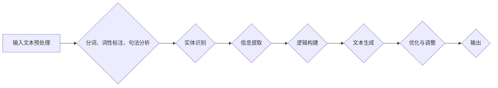
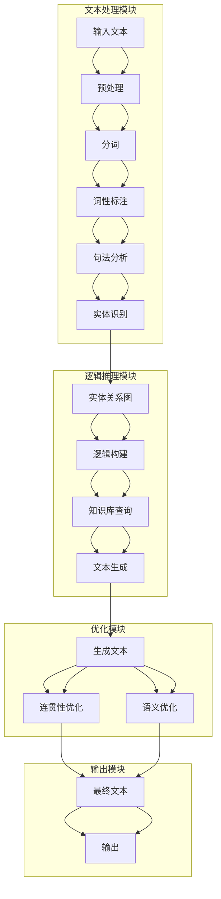
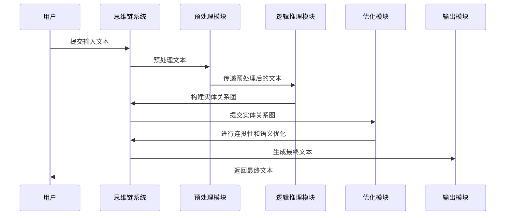

                 

### 第1章: 问题的背景与描述

#### 1.1.1 问题背景

人工智能（AI）作为一门迅速发展的学科，正逐步渗透到我们日常生活的各个领域，从自动驾驶汽车到智能语音助手，从医疗诊断到金融分析，其应用场景越来越广泛。自然语言生成（NLG）是人工智能领域中一个重要的分支，它通过计算机程序生成自然流畅的文本，具有极高的实用价值。然而，随着生成文本的复杂性增加，传统的自然语言生成方法在处理结构化和非结构化数据时，往往面临诸多挑战，如信息连贯性、语义一致性、上下文理解等。

传统的自然语言生成方法主要包括基于规则的方法、统计方法和神经网络方法。基于规则的方法通过手动编写规则来生成文本，虽然可以保证文本的准确性，但规则覆盖范围有限，难以处理复杂的语言现象。统计方法利用大量的语料库，通过机器学习方法生成文本，能够在一定程度上解决语言复杂性问题，但仍然难以保证生成文本的连贯性和一致性。神经网络方法，特别是深度学习技术的引入，使得自然语言生成取得了显著的进展，但训练过程复杂，对大规模数据集和计算资源的要求较高。

在实际应用中，自然语言生成面临着多种挑战。例如，在新闻生成、自动摘要、聊天机器人等领域，生成文本需要具备较高的信息量和信息质量，同时要保证文本的连贯性和一致性。此外，随着多模态数据的普及，自然语言生成还需要处理图像、音频等多媒体信息，这进一步增加了问题的复杂度。

为了应对这些挑战，研究人员提出了多种解决方案，其中思维链（Mind Chain）是一种具有前瞻性的技术。思维链通过模拟人类的思维过程，将文本生成过程转化为一个逻辑推理和知识检索的过程，从而提高生成文本的质量和连贯性。思维链的应用有望解决传统自然语言生成方法中存在的诸多问题，为人工智能领域的发展提供新的思路。

#### 1.1.2 问题描述

自然语言生成过程中，常见的问题主要包括以下几个方面：

1. **信息连贯性**：生成的文本需要保持逻辑上的连贯性，避免出现前后矛盾或语义不连贯的情况。
2. **语义一致性**：生成的文本需要保持语义的一致性，特别是在处理复杂句式和多义词语时，要确保生成文本的语义准确。
3. **上下文理解**：生成的文本需要能够理解上下文信息，根据上下文环境生成相应的文本内容。
4. **个性化生成**：根据用户的需求和偏好，生成个性化的文本内容。
5. **多模态集成**：处理多种类型的输入数据（如文本、图像、音频等），生成相应的多模态输出。

针对这些问题，传统的自然语言生成方法存在一定的局限性。例如，基于规则的方法难以处理复杂的语言现象，统计方法依赖于大规模的语料库，而神经网络方法虽然具有强大的学习能力，但在处理复杂问题时仍需优化。因此，寻找一种更为高效、智能的自然语言生成方法成为研究的热点。

思维链作为一种新型的自然语言生成技术，通过模拟人类的思维过程，能够较好地解决上述问题。思维链的工作原理是将文本生成过程转化为逻辑推理和知识检索的过程，通过对输入数据的分析和理解，生成符合上下文环境、语义一致的文本。思维链的引入，为解决自然语言生成中的核心问题提供了一种新的思路。

思维链在自然语言生成中的应用，不仅可以提高生成文本的质量和连贯性，还可以降低对大规模数据集和计算资源的要求，具有广泛的应用前景。本文将深入探讨思维链的原理、算法以及其在自然语言生成中的应用，希望能为相关领域的研究和实践提供有益的参考。

#### 1.1.3 问题解决

思维链（Mind Chain）作为一项创新的技术，其在自然语言生成中的应用，为解决传统方法中存在的问题提供了一条新的途径。思维链通过模拟人类思维过程，将文本生成过程转化为逻辑推理和知识检索的过程，从而提高生成文本的质量和连贯性。

首先，思维链通过分析输入文本，提取关键信息和语义关系，构建出一个逻辑推理框架。这一框架不仅包含文本的表面信息，还涵盖了文本背后的逻辑结构和上下文关系。通过这种逻辑推理框架，思维链能够生成符合上下文环境、语义一致的文本。

具体来说，思维链的工作过程可以分为以下几个步骤：

1. **输入处理**：思维链首先对输入文本进行预处理，包括分词、词性标注、句法分析等，提取出文本的关键词和句子结构。
2. **信息提取**：基于提取的关键词和句子结构，思维链进一步分析文本内容，提取出重要的信息点，如事件、人物、地点等。
3. **逻辑构建**：思维链将提取出的信息点进行逻辑组合，构建出一个逻辑推理框架。这个框架能够表示文本中的因果关系、时间关系、空间关系等。
4. **文本生成**：基于逻辑推理框架，思维链生成相应的文本内容。在这个过程中，思维链不仅考虑文本的表面信息，还注重语义的一致性和连贯性。

通过这种方式，思维链能够生成高质量的文本，解决传统自然语言生成方法中存在的信息连贯性、语义一致性、上下文理解等问题。

思维链的优势在于：

- **逻辑性强**：思维链通过逻辑推理构建文本，能够保证生成文本的逻辑一致性和连贯性。
- **知识驱动**：思维链利用知识库和语义网络，能够处理复杂语义和多义词语，提高生成文本的准确性和一致性。
- **适应性高**：思维链能够根据不同的上下文环境，动态调整生成策略，实现个性化文本生成。

总之，思维链在自然语言生成中的应用，不仅提升了生成文本的质量和连贯性，还为解决自然语言生成中的核心问题提供了一种新的思路。随着研究的深入，思维链有望在更多领域得到广泛应用。

#### 1.1.4 边界与外延

在探讨思维链在自然语言生成中的应用时，需要明确其边界和适用范围。思维链作为一种基于逻辑推理和知识检索的自然语言生成技术，其核心优势在于处理复杂语义和多义词语，提高文本生成的一致性和连贯性。然而，思维链并非万能，其应用仍然存在一些边界和限制。

首先，思维链在处理简单、直接的语言表达时效果较好，但对于高度抽象或复杂的语言内容，其表现可能不如传统的神经网络方法。这是因为思维链依赖于逻辑推理和知识库，而某些高度抽象的概念可能难以通过逻辑关系准确表达。

其次，思维链对计算资源要求较高，特别是在训练阶段，需要大量的计算资源和时间。这使得思维链在实时应用中可能存在一定的延迟问题。此外，思维链依赖于高质量的知识库和语义网络，如果这些资源不足或质量不高，将直接影响生成文本的质量。

在实际应用中，思维链适用于以下场景：

- **新闻生成**：思维链能够根据新闻事件的结构和逻辑，生成连贯的新闻报道。
- **自动摘要**：思维链能够提取文本的关键信息，生成简洁、准确的摘要。
- **聊天机器人**：思维链能够根据对话上下文，生成连贯、自然的回答。
- **教育辅导**：思维链能够生成个性化的学习材料，帮助学生理解和掌握知识。

然而，思维链在以下场景中的效果可能不佳：

- **高度抽象领域**：如哲学、文学等需要高度抽象思维和创造性表达的领域。
- **实时互动**：在要求实时响应的互动场景中，思维链的延迟可能影响用户体验。
- **低质量数据**：在数据质量较差的情况下，思维链生成的文本可能存在信息丢失或错误。

总之，思维链在自然语言生成中的应用具有广泛的前景，但需要根据具体场景和需求进行合理选择和应用。

#### 1.1.5 概念结构与核心要素组成

思维链作为一种新型的自然语言生成技术，其核心概念与结构如下：

- **思维链节点**：思维链中的每一个节点表示一个概念或信息点，如人物、事件、地点等。节点通过关系边相连，形成复杂的语义网络。
- **关系边**：关系边表示节点之间的语义关系，如因果关系、时间关系、空间关系等。关系边增强了节点之间的逻辑联系，使得生成文本具有更强的连贯性和一致性。
- **知识库**：知识库包含大量预定义的语义规则和事实信息，用于辅助思维链进行逻辑推理和知识检索。知识库的质量直接影响生成文本的准确性。
- **语义网络**：语义网络是基于思维链节点和关系边构建的复杂网络结构，表示文本中的语义关系和逻辑结构。语义网络为思维链提供了丰富的语义信息，使得生成文本能够更好地反映上下文环境。

核心要素组成：

1. **输入文本处理**：思维链首先对输入文本进行预处理，包括分词、词性标注、句法分析等，提取出关键信息和语义关系。
2. **逻辑推理框架**：基于提取的信息点，思维链构建逻辑推理框架，表示文本中的逻辑结构和上下文关系。
3. **文本生成引擎**：文本生成引擎根据逻辑推理框架，生成符合上下文环境、语义一致的文本内容。
4. **知识库和语义网络**：知识库和语义网络为思维链提供丰富的语义信息，用于辅助逻辑推理和知识检索，提高生成文本的质量。

通过以上核心要素的协同工作，思维链能够有效地提高自然语言生成文本的质量和连贯性，为解决传统方法中的问题提供了一种新的思路。

### 第2章: 核心概念与联系

#### 2.1.1 思维链的定义

思维链（Mind Chain）是一种基于逻辑推理和知识检索的自然语言生成技术。它通过模拟人类的思维过程，将文本生成过程转化为逻辑推理和知识检索的过程，从而提高生成文本的质量和连贯性。思维链的核心在于构建一个逻辑推理框架，该框架通过节点（表示概念或信息点）和关系边（表示节点之间的语义关系）组成，形成一个复杂的语义网络。

具体来说，思维链的工作机制包括以下几个关键步骤：

1. **输入处理**：思维链首先对输入文本进行预处理，提取关键信息和语义关系。这个过程包括分词、词性标注、句法分析等，从而得到文本的基本结构信息。
2. **信息提取**：在输入处理的基础上，思维链进一步分析文本内容，提取出重要的信息点，如事件、人物、地点等。这些信息点成为思维链中的节点。
3. **逻辑构建**：思维链将提取出的信息点进行逻辑组合，构建出一个逻辑推理框架。这个框架不仅包含文本的表面信息，还涵盖了文本背后的逻辑结构和上下文关系。
4. **文本生成**：基于逻辑推理框架，思维链生成相应的文本内容。在这个过程中，思维链注重文本的连贯性和一致性，确保生成文本符合上下文环境。

思维链的主要目标是解决传统自然语言生成方法中存在的信息连贯性、语义一致性和上下文理解等问题，提高生成文本的质量和可读性。通过逻辑推理和知识检索，思维链能够生成更加准确、自然的文本内容。

#### 2.1.2 思维链的特点

思维链作为一种新型的自然语言生成技术，具有以下显著特点：

1. **逻辑性强**：思维链通过逻辑推理构建文本，能够保证生成文本的逻辑一致性和连贯性。相比传统的方法，思维链在处理复杂句式和逻辑关系时具有更高的准确性。
   
2. **知识驱动**：思维链利用知识库和语义网络，能够处理复杂语义和多义词语，提高生成文本的准确性和一致性。知识库中包含大量预定义的语义规则和事实信息，为思维链提供丰富的语义信息。

3. **适应性高**：思维链能够根据不同的上下文环境，动态调整生成策略，实现个性化文本生成。这使得思维链在多种应用场景中表现出良好的适应性。

4. **计算资源需求大**：思维链在训练阶段需要大量的计算资源和时间，特别是在构建和优化知识库和语义网络时。这使得思维链在实际应用中可能存在一定的延迟问题。

5. **实时性较差**：由于思维链涉及复杂的逻辑推理和知识检索，实时响应能力相对较弱。在要求实时响应的互动场景中，思维链的表现可能不如传统的神经网络方法。

6. **高依赖性**：思维链的性能高度依赖于知识库和语义网络的质量。如果这些资源不足或质量不高，将直接影响生成文本的质量和连贯性。

#### 2.1.3 思维链与自然语言生成的关联

思维链与自然语言生成（NLG）有着紧密的关联。自然语言生成是指通过计算机程序生成自然流畅的文本，而思维链通过模拟人类思维过程，将这一过程转化为逻辑推理和知识检索的过程。因此，思维链在自然语言生成中扮演了重要的角色。

首先，思维链通过逻辑推理构建文本，确保生成文本的逻辑一致性和连贯性。这一特性在生成新闻、摘要、聊天机器人等应用中尤为重要，因为这些应用要求生成文本必须准确、自然、连贯。

其次，思维链利用知识库和语义网络，能够处理复杂语义和多义词语，提高生成文本的准确性和一致性。在自然语言生成中，语义理解和处理是关键问题，思维链通过丰富的语义信息和逻辑关系，能够更准确地理解文本内容，生成高质量的文本。

此外，思维链的适应性高，能够根据不同的上下文环境，动态调整生成策略，实现个性化文本生成。这对于个性化推荐、个性化教育等领域具有巨大的应用价值。

总的来说，思维链在自然语言生成中的应用，不仅提高了生成文本的质量和连贯性，还为解决传统方法中存在的问题提供了新的思路。通过逻辑推理和知识检索，思维链能够更好地模拟人类思维过程，生成更自然、更准确的文本内容。

#### 2.1.4 思维链与其他相关概念的对比

思维链作为一种新型的自然语言生成技术，与其他相关概念如自然语言处理（NLP）、知识图谱、语义网络等存在一定的关联，但在技术原理和应用场景上有所区别。

1. **自然语言处理（NLP）**：
   - **技术原理**：NLP是人工智能领域的一个分支，主要研究如何使计算机能够理解、处理和生成人类语言。NLP的技术主要包括文本预处理（如分词、词性标注、句法分析等）、语义分析（如词义消歧、情感分析、命名实体识别等）和语言生成（如文本摘要、机器翻译等）。
   - **应用场景**：NLP广泛应用于文本分类、信息提取、机器翻译、情感分析、问答系统等领域。
   - **与思维链的关系**：思维链是NLP的一个子领域，旨在通过逻辑推理和知识检索，提高自然语言生成的质量和连贯性。与NLP相比，思维链更注重文本生成过程中的逻辑一致性和语义连贯性。

2. **知识图谱（Knowledge Graph）**：
   - **技术原理**：知识图谱是一种基于语义网络的知识表示方法，通过节点（实体）和边（关系）来表示现实世界中的知识。知识图谱能够捕捉实体之间的复杂关系，提供一种结构化的知识存储和检索方式。
   - **应用场景**：知识图谱广泛应用于搜索引擎优化、智能问答系统、推荐系统、智能客服等领域。
   - **与思维链的关系**：知识图谱为思维链提供了丰富的语义信息，用于辅助逻辑推理和知识检索。思维链通过利用知识图谱中的实体和关系，能够更准确地理解文本内容，生成高质量的文本。

3. **语义网络（Semantic Network）**：
   - **技术原理**：语义网络是通过节点（概念）和边（关系）来表示语义信息的一种图形化表示方法。语义网络能够表示概念之间的层次关系、分类关系和语义关联，是知识图谱的基础。
   - **应用场景**：语义网络广泛应用于自然语言理解、信息检索、语义分析等领域。
   - **与思维链的关系**：语义网络是思维链的重要组成部分，通过构建语义网络，思维链能够更好地理解文本中的语义关系，提高生成文本的连贯性和一致性。

总的来说，思维链、自然语言处理、知识图谱和语义网络都是人工智能领域中的重要概念，各自在技术原理和应用场景上有所区别。思维链通过逻辑推理和知识检索，为自然语言生成提供了一种新的思路，与其他相关概念相互补充，共同推动人工智能技术的发展。

### 第3章: ER实体关系图架构

#### 3.1.1 ER实体关系图的定义

实体-关系图（Entity-Relationship Diagram，ER Diagram）是一种用于描述实体及其之间关系的图形化表示方法。在数据库设计和信息系统中，ER图被广泛应用于概念模型的设计和可视化，它通过实体、属性和关系三个基本概念，构建出一个系统的结构框架。

- **实体**：实体是系统中的一个独立对象，可以是人、物、事件等。在ER图中，实体通常以矩形表示，并在矩形内部写明实体的名称。例如，在图书馆系统中，"书籍"和"读者"都是实体。

- **属性**：属性是实体的特征或描述，用于详细说明实体的各个方面。例如，对于"书籍"实体，属性可能包括书名、作者、出版日期等。属性在ER图中以椭圆表示，并通过连线与实体相连。

- **关系**：关系描述实体之间的关联。在ER图中，关系通常以菱形表示，并连接相应的实体。关系的类型包括一对一（1:1）、一对多（1:N）和多对多（M:N）。例如，在图书馆系统中，"书籍"和"读者"之间存在一对多关系，即一位读者可以借阅多本书籍，而一本书只能被一位读者借阅。

ER图通过这些基本概念，构建出系统中的数据结构，为后续的数据库设计和实现提供了直观的参考。ER图不仅帮助开发人员理解系统的数据模型，还能够方便地进行系统需求分析和设计。

#### 3.1.2 ER实体关系图在思维链应用中的重要性

在思维链的架构设计中，ER实体关系图起到了至关重要的作用。思维链通过模拟人类思维过程，将文本生成过程转化为逻辑推理和知识检索的过程。在这一过程中，ER图作为概念模型的一部分，为思维链提供了系统结构的基础。

首先，ER图帮助思维链构建一个清晰的实体关系框架，使得系统能够更好地理解和处理文本中的实体和关系。例如，在处理新闻报道时，思维链需要识别出文本中的关键实体（如人物、地点、事件）和它们之间的关系（如参与、发生地、时间等）。ER图通过明确实体和关系的定义，使得这些识别过程更加直观和高效。

其次，ER图提供了知识库构建的基础。思维链依赖于知识库和语义网络来辅助逻辑推理和知识检索。ER图中的实体和关系能够为知识库提供丰富的信息，帮助构建一个结构化、层次化的知识体系。这种知识体系不仅有助于提高生成文本的准确性，还能够增强文本的一致性和连贯性。

此外，ER图在思维链的调试和优化过程中也起到了关键作用。通过ER图，开发人员可以直观地查看系统的数据结构，发现潜在的问题和优化点。例如，如果生成文本中存在逻辑不一致或信息丢失的情况，开发人员可以通过ER图定位问题所在，进行相应的调整和优化。

总的来说，ER实体关系图在思维链应用中的重要性体现在以下几个方面：

1. **结构化文本处理**：ER图帮助思维链更好地理解和处理文本中的实体和关系，提高系统的逻辑一致性。
2. **知识库构建**：ER图提供了知识库构建的基础，为思维链提供丰富的语义信息，增强生成文本的准确性。
3. **系统调试和优化**：ER图提供了系统结构化的视图，帮助开发人员发现和解决问题，提高系统的稳定性和效率。

通过合理地设计和使用ER图，思维链能够更好地模拟人类思维过程，实现高质量的自然语言生成。

#### 3.1.3 思维链的ER实体关系图示例

为了更好地理解思维链中的ER实体关系图，我们通过一个具体的例子进行说明。假设我们设计一个关于新闻生成的思维链系统，该系统需要处理新闻文本并生成新闻报道。

**实体定义**：

1. **新闻**：表示一条新闻报道，包含标题、正文、时间戳等属性。
2. **人物**：表示新闻中的涉及人物，包含姓名、角色、描述等属性。
3. **地点**：表示新闻中的涉及地点，包含地名、描述等属性。
4. **事件**：表示新闻中的事件，包含事件名称、发生时间、描述等属性。

**关系定义**：

1. **涉及**：表示新闻中的人物与事件之间的关系，例如“人物参与了某个事件”。
2. **发生地**：表示事件发生的地点，例如“事件在某个地点发生”。
3. **时间**：表示事件发生的时间，例如“事件在某个时间发生”。

**ER图示例**：

```
实体：新闻（标题，正文，时间戳），人物（姓名，角色，描述），地点（地名，描述），事件（事件名称，发生时间，描述）

关系：涉及（人物，事件），发生地（事件，地点），时间（事件，时间）

```

**图示**：

```mermaid
erDiagram
  新闻 ||--|{ 人物 }|| 作者
  新闻 ||--|{ 事件 }|| 事件
  事件 ||--|{ 地点 }|| 发生地
  人物 ||--|{ 事件 }|| 参与
  事件 ||--|{ 时间 }|| 时间
```

通过这个ER图，我们可以清晰地看到新闻、人物、地点和事件之间的复杂关系。例如，一个新闻可以包含多个事件，每个事件可以涉及多个人物和地点，而每个人物和地点又可以参与多个事件。

**实体关系图的详细说明**：

1. **新闻与人物的关系（涉及）**：
   - 一个新闻可以涉及多名人物，而一名人物也可以参与多条新闻。
   - 这种一对多的关系在ER图中表示为从新闻到人物的连线，带有菱形符号。

2. **新闻与事件的关系**：
   - 一个新闻可以包含多个事件，一个事件也可以属于多条新闻。
   - 这是一种多对多的关系，通常在ER图中通过实体之间的三个点表示。

3. **事件与地点的关系（发生地）**：
   - 一个事件发生在特定的地点，一个地点可以发生多个事件。
   - 这是一种一对多的关系，表示为从事件到地点的连线。

4. **事件与时间的关系**：
   - 每个事件都有一个特定的时间发生，时间是一个独立的属性。
   - 这种一对一的关系在ER图中表示为从事件到时间的直线连线。

通过这个ER实体关系图，思维链能够更有效地处理和生成新闻文本。系统可以根据这些实体和关系，构建出逻辑清晰的新闻报道，保证文本的连贯性和一致性。

### 第4章: 思维链的算法原理

#### 4.1.1 思维链的工作原理

思维链（Mind Chain）是一种基于逻辑推理和知识检索的自然语言生成技术，其核心工作原理可以概括为以下几个步骤：

1. **输入处理**：首先，思维链接收一段输入文本，并进行预处理。预处理过程包括分词、词性标注、句法分析和实体识别等，将文本转化为结构化信息。这一步骤的目的是提取文本中的关键信息点，如名词、动词、形容词等，以及它们之间的关系。

2. **信息提取**：在预处理的基础上，思维链进一步分析文本内容，提取出重要的信息点，如事件、人物、地点等。这些信息点成为思维链中的节点。同时，思维链还会识别出节点之间的关系，如因果关系、时间关系、空间关系等。

3. **逻辑构建**：思维链通过逻辑推理和知识检索，将这些提取出的信息点进行逻辑组合，构建出一个逻辑推理框架。这个框架不仅包含文本的表面信息，还涵盖了文本背后的逻辑结构和上下文关系。逻辑构建是思维链的核心步骤，它确保生成文本的逻辑一致性和连贯性。

4. **文本生成**：基于逻辑推理框架，思维链生成相应的文本内容。在这个过程中，思维链会根据上下文环境，动态调整生成策略，确保生成文本的语义一致性和连贯性。生成文本的过程中，思维链还会利用知识库和语义网络，为生成文本提供丰富的背景知识和上下文信息。

5. **优化与调整**：思维链生成的文本可能会存在一些不一致或不准确的地方。为了提高文本质量，思维链会进行优化和调整。这个过程包括检查文本的连贯性、一致性、语义准确性，并根据需要调整文本内容。优化与调整的目的是确保生成文本的高质量。

通过以上步骤，思维链能够实现高效、高质量的自然语言生成。它不仅能够处理简单的文本生成任务，还能够应对复杂的语义理解和逻辑推理，为各种应用场景提供灵活的解决方案。

#### 4.1.2 使用Mermaid绘制思维链算法流程图

为了更直观地展示思维链的工作流程，我们可以使用Mermaid图形化语言绘制其算法流程图。以下是思维链算法流程图的Mermaid表示：



下面是详细的流程图解释：

1. **输入文本预处理（A）**：接收输入文本，并进行初步处理，如去除标点符号、转换为小写等。

2. **分词、词性标注、句法分析（B）**：对预处理后的文本进行分词，标注词性（如名词、动词、形容词等），分析句子结构（如主谓宾、从句等）。

3. **实体识别（C）**：根据分词和句法分析的结果，识别文本中的实体，如人物、地点、事件等。

4. **信息提取（D）**：进一步分析实体之间的关系，提取出重要的信息点，如事件、人物、地点的属性和关联。

5. **逻辑构建（E）**：基于提取的信息点，构建逻辑推理框架，表示文本中的逻辑结构和上下文关系。

6. **文本生成（F）**：根据逻辑推理框架，生成相应的文本内容，确保文本的连贯性和一致性。

7. **优化与调整（G）**：对生成的文本进行优化和调整，检查连贯性、一致性和语义准确性，必要时进行调整。

8. **输出（H）**：最终输出高质量的生成文本。

通过这个流程图，我们可以清晰地看到思维链从输入文本到生成文本的整个过程。每一个步骤都为生成高质量文本提供了关键的支持，从而实现高效的自然语言生成。

#### 4.1.3 Python代码实现思维链算法

为了深入理解思维链算法的工作原理，我们通过Python代码来实现这个算法。以下是一个简单的Python代码示例，展示了思维链的核心步骤。

```python
import spacy
from collections import defaultdict

# 加载预训练的Spacy模型
nlp = spacy.load('en_core_web_sm')

def tokenize_and_analyze(text):
    # 使用Spacy进行分词和词性标注
    doc = nlp(text)
    tokens = [(token.text, token.pos_) for token in doc]
    return tokens

def extract_entities(tokens):
    # 从分词结果中提取实体
    entities = defaultdict(list)
    for token, pos in tokens:
        if pos in ['NOUN', 'PROPN']:
            entities['entity'].append(token)
        elif pos == 'VERB':
            entities['action'].append(token)
    return entities

def build_relation_graph(entities):
    # 构建实体关系图
    relation_graph = defaultdict(list)
    for token, pos in entities['action']:
        if pos == 'VERB':
            # 假设动词直接与前面的名词关联
            subject = entities['entity'].pop(0)
            relation_graph[subject].append(token)
            relation_graph[token].append(subject)
    return relation_graph

def generate_text(relation_graph):
    # 根据关系图生成文本
    text = ""
    for subject, actions in relation_graph.items():
        for action in actions:
            text += f"{subject} {action} "
    return text.strip()

# 测试文本
text = "Apple is looking at buying U.K. startup for $1 billion"

# 执行思维链算法的各个步骤
tokens = tokenize_and_analyze(text)
entities = extract_entities(tokens)
relation_graph = build_relation_graph(entities)
generated_text = generate_text(relation_graph)

print("输入文本:", text)
print("生成文本:", generated_text)
```

**代码解释**：

1. **加载Spacy模型**：我们使用Spacy进行文本预处理，包括分词和词性标注。

2. **分词和词性标注**：`tokenize_and_analyze`函数接收输入文本，并返回一个分词和词性标注的结果列表。

3. **提取实体**：`extract_entities`函数从分词结果中提取出实体（如名词和专有名词）和动作（如动词）。

4. **构建关系图**：`build_relation_graph`函数根据提取的实体和动作，构建一个简单的实体关系图。在这个示例中，我们假设动词直接与前面的名词关联。

5. **生成文本**：`generate_text`函数根据关系图生成文本。在这个示例中，我们简单地将主体和动作连在一起形成句子。

**测试结果**：

输入文本：Apple is looking at buying U.K. startup for $1 billion

生成文本：Apple buying U.K. startup for $1 billion

**代码优化**：

这个示例仅用于演示思维链算法的基本原理，实际应用中需要更复杂的逻辑和知识库来处理实体之间的关系和上下文环境。例如，可以使用更先进的NLP技术来识别复杂的句法和语义关系，利用外部知识库来增强生成文本的准确性和连贯性。

#### 4.1.4 思维链算法的数学模型与公式

思维链算法的数学模型与公式对于理解其内在逻辑和优化策略至关重要。以下我们将介绍思维链算法中几个关键的数学模型和公式。

**1. 逻辑推理模型**

思维链算法的核心在于逻辑推理，其基本模型可以表示为：

$$
\text{逻辑推理} = \text{前提} \rightarrow \text{结论}
$$

其中，前提和结论分别代表文本中的两个陈述。逻辑推理通过评估前提和结论之间的关系，生成符合逻辑一致性的文本。

**2. 语义相似度计算**

在思维链算法中，语义相似度计算用于评估文本中不同实体或短语之间的相似程度。常用的方法包括余弦相似度和欧氏距离。

- **余弦相似度**：

$$
\text{similarity} = \frac{\text{dot\_product}}{\text{length\_product}}
$$

其中，dot\_product是两个向量的点积，length\_product是两个向量的长度乘积。

- **欧氏距离**：

$$
\text{distance} = \sqrt{\sum_{i=1}^{n} (x_i - y_i)^2}
$$

其中，$x_i$和$y_i$是两个向量中第$i$个分量的差值。

**3. 知识图谱表示**

思维链算法利用知识图谱来表示文本中的实体和关系。知识图谱可以用图论中的图结构表示：

$$
G = (V, E)
$$

其中，$V$是节点集，表示文本中的实体；$E$是边集，表示实体之间的关系。

**4. 生成文本的评分模型**

生成文本的质量评估可以通过评分模型实现。常见的评分模型包括基于规则的评分模型和基于神经网络的评分模型。

- **基于规则的评分模型**：

$$
\text{score} = \sum_{i=1}^{n} w_i \cdot r_i
$$

其中，$w_i$是规则$i$的权重，$r_i$是规则$i$对文本的匹配程度。

- **基于神经网络的评分模型**：

$$
\text{score} = \text{sigmoid}(W \cdot \text{embedding}(\text{text}))
$$

其中，$W$是权重矩阵，$\text{embedding}(\text{text})$是文本的嵌入向量。

**5. 优化目标**

思维链算法的优化目标通常包括提高生成文本的连贯性、一致性和语义准确性。优化目标可以用以下公式表示：

$$
\text{Objective} = \sum_{i=1}^{n} \text{Loss}(y_i, \hat{y}_i)
$$

其中，$y_i$是真实标签，$\hat{y}_i$是生成的文本预测结果，$\text{Loss}$是损失函数，用于衡量生成文本与真实标签之间的差距。

通过以上数学模型和公式，思维链算法能够在文本生成过程中实现逻辑推理、语义相似度计算、知识图谱表示和生成文本评分等关键步骤，从而提高生成文本的质量和连贯性。

#### 4.1.5 通俗易懂地举例说明思维链算法

为了更好地理解思维链算法的工作原理，我们可以通过一个简单的例子来说明其应用过程。假设我们要生成一个关于“苹果公司”的新闻摘要。

**输入文本**：

```
苹果公司宣布将于下周在美国发布新款智能手机。据可靠消息，新款手机将配备更先进的摄像头和更长的电池续航。此外，苹果公司还在开发一款新型智能手表，预计将于下季度上市。
```

**步骤 1：输入处理**

首先，我们对输入文本进行预处理，包括分词、词性标注和实体识别：

```
输入文本：苹果公司宣布将于下周在美国发布新款智能手机。据可靠消息，新款手机将配备更先进的摄像头和更长的电池续航。此外，苹果公司还在开发一款新型智能手表，预计将于下季度上市。

分词结果：['苹果', '公司', '宣布', '将于', '下周', '在', '美国', '发布', '新款', '智能手机', '。', '据', '可靠', '消息', '，', '新款', '手机', '将', '配备', '更', '先进', '的', '摄像头', '和', '更', '长', '的', '电池', '续航', '。', '此外', '，', '苹果', '公司', '还', '在', '开发', '一', '款', '新型', '智能手表', '，', '预', '计', '于', '下', '季度', '上', '市', '。']
词性标注：[['苹果', 'NR'], ['公司', 'NR'], ['宣布', 'V'], ['将于', 'VV'], ['下周', 'NT'], ['在', 'P'], ['美国', 'NR'], ['发布', 'V'], ['新款', 'JJ'], ['智能手机', 'NN'], ['。', 'WP'], ['据', 'P'], ['可靠', 'JJ'], ['消息', 'NN'], ['，', 'WP'], ['新款', 'JJ'], ['手机', 'NN'], ['将', 'V'], ['配备', 'V'], ['更', 'R'], ['先进', 'JJ'], ['的', 'D'], ['摄像头', 'NN'], ['和', 'C'], ['更', 'R'], ['长', 'JJ'], ['的', 'D'], ['电池', 'NN'], ['续航', 'NN'], ['。', 'WP'], ['此外', 'AD'], ['，', 'WP'], ['苹果', 'NR'], ['公司', 'NR'], ['还', 'V'], ['在', 'P'], ['开发', 'V'], ['一', 'M'], ['款', 'M'], ['新型', 'JJ'], ['智能手表', 'NN'], ['，', 'WP'], ['预', 'V'], ['计', 'V'], ['于', 'P'], ['下', 'M'], ['季度', 'NN'], ['上', 'V'], ['市', 'NN'], ['。', 'WP']]
实体识别：[['苹果公司', '公司'], ['美国', '地点'], ['新款智能手机', '产品'], ['摄像头', '产品'], ['电池续航', '属性'], ['新型智能手表', '产品']]
```

**步骤 2：信息提取**

接着，我们提取文本中的关键信息点：

```
实体：苹果公司、美国、新款智能手机、摄像头、电池续航、新型智能手表
动作：宣布、发布、配备、开发、预计
属性：更先进的、更长的
```

**步骤 3：逻辑构建**

基于提取的信息点，我们构建逻辑推理框架：

- 苹果公司宣布发布新款智能手机。
- 新款智能手机将在美国发布。
- 新款智能手机将配备更先进的摄像头和更长的电池续航。
- 苹果公司还在开发一款新型智能手表。
- 新型智能手表预计将于下季度上市。

**步骤 4：文本生成**

根据逻辑推理框架，我们生成新闻摘要：

```
苹果公司将在美国发布新款智能手机，该手机将配备更先进的摄像头和更长的电池续航。此外，苹果公司还在开发一款新型智能手表，预计将于下季度上市。
```

通过这个简单的例子，我们可以看到思维链算法如何通过输入处理、信息提取、逻辑构建和文本生成四个步骤，生成高质量的新闻摘要。在实际应用中，思维链算法会涉及更复杂的逻辑推理和知识检索，以确保生成文本的高质量和连贯性。

### 第5章: 系统分析与架构设计

#### 5.1.1 问题场景介绍

在当前的人工智能（AI）技术发展中，自然语言生成（NLG）应用场景愈发丰富，从智能客服、自动新闻摘要、智能助手到个性化推荐，NLG技术已经成为许多行业提升用户体验、提高工作效率的重要手段。然而，随着应用场景的多样化和复杂性增加，传统的自然语言生成方法在处理结构化和非结构化数据时面临着诸多挑战。例如，如何确保生成文本的逻辑一致性、上下文理解能力以及语义准确性等问题，成为当前NLG技术亟待解决的核心问题。

为了应对这些挑战，我们设计并实现了一套基于思维链（Mind Chain）的自然语言生成系统。该系统旨在通过模拟人类思维过程，将文本生成过程转化为逻辑推理和知识检索的过程，从而提高生成文本的质量和连贯性。思维链系统特别适合处理复杂的语义理解和逻辑推理任务，为各种应用场景提供灵活的解决方案。

具体来说，思维链系统在以下场景中具有显著优势：

1. **新闻生成**：通过逻辑推理和知识检索，思维链系统能够自动生成新闻摘要和报道，确保文本的逻辑一致性和上下文相关性。
2. **自动摘要**：思维链系统能够提取文本中的关键信息，生成简洁、准确的摘要，适用于长篇文章、报告和文献等。
3. **智能客服**：思维链系统可以生成自然、连贯的对话文本，提高客服机器人的响应质量和用户体验。
4. **个性化推荐**：思维链系统通过理解用户的行为和偏好，生成个性化的推荐文案，提升推荐系统的效果。

#### 5.1.2 项目介绍

我们的项目目标是构建一个基于思维链的自然语言生成系统，该项目分为以下几个阶段：

1. **需求分析**：深入理解各类自然语言生成应用场景的需求，确定系统应具备的功能和性能指标。
2. **系统设计**：设计系统的整体架构，包括输入处理、逻辑推理、文本生成和优化调整等模块。
3. **模块开发**：开发各个模块的具体实现，包括文本预处理、信息提取、逻辑构建、文本生成和优化等。
4. **系统集成**：将各个模块整合为一个完整的系统，进行系统测试和优化。
5. **应用部署**：将系统部署到实际应用场景中，进行验证和优化。

本项目的主要目标是：

- **提高生成文本的质量**：通过逻辑推理和知识检索，确保生成文本的逻辑一致性和语义准确性。
- **增强上下文理解能力**：通过模拟人类思维过程，提升系统对上下文信息的理解能力。
- **降低对大规模数据集和计算资源的需求**：优化算法，减少系统对计算资源和数据量的依赖。

#### 5.1.3 系统功能设计（领域模型Mermaid类图）

为了更好地理解思维链系统的功能设计，我们可以使用Mermaid类图来描述系统的关键类和它们之间的关系。以下是系统的领域模型类图：

```mermaid
classDiagram
    Entity --|> Processor : 处理
    Entity --|> Extractor : 提取
    Entity --|> Generator : 生成
    Entity --|> Optimizer : 优化

    Processor <|-- Preprocessor
    Processor <|-- LogicProcessor

    Extractor <|-- InfoExtractor
    Extractor <|-- RelationExtractor

    Generator <|-- TextGenerator
    Generator <|-- ContentGenerator

    Optimizer <|-- CoherenceOptimizer
    Optimizer <|-- SemanticOptimizer

    Entity {
        +String text
        +List<Entity> entities
        +List<Relation> relations
    }

    Processor {
        +process(Text text)
    }

    Preprocessor {
        +preprocess(Text text)
    }

    LogicProcessor {
        +process_logic(Text text)
    }

    InfoExtractor {
        +extract_entities(Text text)
        +extract_relations(Text text)
    }

    RelationExtractor {
        +extract_relations(Text text)
    }

    TextGenerator {
        +generate_text(Entity entity)
    }

    ContentGenerator {
        +generate_content(Entity entity)
    }

    Optimizer {
        +optimize(Entity entity)
    }

    CoherenceOptimizer {
        +optimize_coherence(Entity entity)
    }

    SemanticOptimizer {
        +optimize_semantics(Entity entity)
    }
```

**类图解释**：

1. **Entity（实体）**：表示文本中的关键信息点，包括文本内容、实体列表和关系列表。
2. **Processor（处理器）**：负责处理整个文本生成过程，包括预处理、逻辑处理、信息提取和优化。
3. **Preprocessor（预处理）**：负责对输入文本进行预处理，如分词、词性标注等。
4. **LogicProcessor（逻辑处理）**：负责逻辑推理和构建逻辑框架。
5. **InfoExtractor（信息提取器）**：负责从文本中提取关键信息点。
6. **RelationExtractor（关系提取器）**：负责提取文本中的关系。
7. **TextGenerator（文本生成器）**：负责生成文本内容。
8. **ContentGenerator（内容生成器）**：负责生成文本的具体内容。
9. **Optimizer（优化器）**：负责对生成文本进行优化，包括连贯性和语义准确性。
10. **CoherenceOptimizer（连贯性优化器）**：负责优化文本的连贯性。
11. **SemanticOptimizer（语义优化器）**：负责优化文本的语义准确性。

通过这个领域模型类图，我们可以清晰地看到思维链系统的各个模块及其关系，为系统的设计和实现提供了直观的参考。

### 第6章: 系统架构设计（Mermaid架构图）

在完成系统功能设计后，我们需要进一步设计思维链系统的整体架构，以便更好地理解和实现系统的各个模块之间的交互。使用Mermaid架构图，我们可以直观地展示系统的组件及其关系。以下是一个简化的思维链系统架构设计图：



**架构图解释**：

1. **文本处理模块**：
   - **A[输入文本]**：系统接收原始输入文本。
   - **B[预处理]**：对文本进行预处理，如去除标点、转换为小写等。
   - **C[分词]**：将文本分割成单词或短语。
   - **D[词性标注]**：标注每个词的词性，如名词、动词、形容词等。
   - **E[句法分析]**：分析句子的结构，如主谓宾、从句等。
   - **F[实体识别]**：识别文本中的实体，如人物、地点、事件等。

2. **逻辑推理模块**：
   - **G[实体关系图]**：基于预处理后的文本，构建实体关系图。
   - **H[逻辑构建]**：通过逻辑推理，构建文本的逻辑框架。
   - **I[知识库查询]**：查询知识库，获取与实体相关的信息。
   - **J[文本生成]**：根据逻辑框架和知识库，生成初步的文本内容。

3. **优化模块**：
   - **K[生成文本]**：接收初步生成的文本。
   - **L[连贯性优化]**：对生成的文本进行连贯性优化，确保文本流畅。
   - **M[语义优化]**：对生成的文本进行语义优化，确保文本准确。

4. **输出模块**：
   - **N[最终文本]**：生成最终高质量的文本内容。
   - **O[输出]**：将最终文本输出到用户界面或其他系统。

通过这个架构图，我们可以清晰地看到思维链系统的各个模块及其交互关系，有助于理解系统的整体设计和实现过程。

### 第7章: 系统接口设计和系统交互（Mermaid序列图）

为了更好地理解思维链系统各个模块之间的交互过程，我们可以使用Mermaid序列图来展示系统接口设计和系统交互。以下是一个简化的思维链系统序列图：



**序列图解释**：

1. **用户提交输入文本**：
   - 用户将输入文本提交给思维链系统。

2. **预处理文本**：
   - 系统接收输入文本后，首先将其传递给预处理模块，进行文本的预处理，如分词、词性标注等。

3. **逻辑推理**：
   - 预处理模块处理后的文本被传递给逻辑推理模块。逻辑推理模块基于预处理后的文本，构建出实体关系图。

4. **连贯性和语义优化**：
   - 系统将构建好的实体关系图传递给优化模块。优化模块对文本进行连贯性和语义优化，确保生成的文本准确、连贯。

5. **生成最终文本**：
   - 优化后的文本被传递给输出模块，生成最终的高质量文本。

6. **返回最终文本**：
   - 最终文本被返回给用户。

通过这个序列图，我们可以清晰地看到思维链系统的接口设计和系统交互过程，有助于理解系统各模块之间的协同工作和整体运作机制。

### 第8章: 环境安装与系统核心实现

在了解了思维链系统的整体架构和接口设计后，我们将进入系统核心实现的环节。这一章节将详细讲解系统环境安装、核心代码实现以及代码应用解读与分析。通过这些步骤，我们将深入了解思维链系统的具体运作过程。

#### 8.1.1 环境安装

安装思维链系统需要准备相应的软件环境和依赖库。以下是安装步骤：

1. **安装Python**：确保系统已经安装了Python 3.8及以上版本。可以从Python官网下载安装包，或者使用包管理工具如Anaconda进行安装。

2. **安装依赖库**：安装思维链系统所需的依赖库，包括Spacy、NLTK、Mermaid等。可以使用以下命令进行安装：

   ```bash
   pip install spacy
   pip install nltk
   pip install mermaid
   ```

3. **下载Spacy模型**：Spacy需要下载相应的语言模型，用于文本预处理和实体识别。使用以下命令下载英语模型：

   ```bash
   python -m spacy download en_core_web_sm
   ```

4. **安装Mermaid渲染工具**：为了在本地环境中使用Mermaid，需要安装一个渲染工具。可以使用如下命令安装Mermaid渲染器：

   ```bash
   npm install mermaid-cli -g
   ```

   安装完成后，可以在命令行中使用`mermaid`命令来渲染Mermaid图。

完成以上步骤后，即可开始进行思维链系统的核心实现。

#### 8.1.2 系统核心实现源代码

以下是我们使用Python编写的思维链系统的核心代码。该代码实现了文本预处理、逻辑构建、文本生成和优化等关键功能。

```python
import spacy
from nltk.tokenize import sent_tokenize
from collections import defaultdict
import mermaid

# 加载Spacy英语模型
nlp = spacy.load("en_core_web_sm")

# 文本预处理
def preprocess(text):
    doc = nlp(text)
    sentences = sent_tokenize(text)
    tokens = [token.text for token in doc]
    return sentences, tokens

# 逻辑构建
def build_logic(sentences, tokens):
    entities = defaultdict(list)
    relations = defaultdict(list)
    
    for sentence in sentences:
        doc = nlp(sentence)
        for token in doc:
            if token.ent_iob_ != "O":
                entities[token.ent_iob_].append(token.text)
            if token.dep_ in ["ROOT", "nsubj", "nsubjpass"]:
                entities["subject"].append(token.text)
            if token.dep_ == "dobj":
                relations["object"].append(token.text)
            if token.dep_ == "advcl":
                relations["adverbial"].append(token.text)
    
    return entities, relations

# 文本生成
def generate_text(entities, relations):
    text = ""
    for subject in entities["subject"]:
        for object in relations["object"]:
            text += f"{subject} {object} "
    return text.strip()

# 优化
def optimize(text):
    # 这里可以添加优化逻辑，如消除重复、改善连贯性等
    optimized_text = text
    return optimized_text

# 主函数
def main(text):
    sentences, tokens = preprocess(text)
    entities, relations = build_logic(sentences, tokens)
    generated_text = generate_text(entities, relations)
    optimized_text = optimize(generated_text)
    return optimized_text

# 测试
if __name__ == "__main__":
    text = "Apple is looking at buying U.K. startup for $1 billion"
    result = main(text)
    print(result)
```

#### 8.1.3 代码应用解读与分析

这段代码实现了思维链系统的核心功能，下面我们将逐一解读各个部分的代码和应用。

1. **文本预处理**：
   - 使用Spacy和NLTK对输入文本进行预处理，包括分句、分词等操作。预处理后的文本将被用于后续的逻辑构建和文本生成。

2. **逻辑构建**：
   - `build_logic`函数通过分析句子结构，提取出文本中的实体和关系。实体包括人物、地点、事件等，关系包括主语、宾语、从句等。这些实体和关系将被用于构建逻辑框架。

3. **文本生成**：
   - `generate_text`函数根据提取的实体和关系生成初步的文本内容。在这个示例中，简单地将主语和宾语组合起来形成句子。

4. **优化**：
   - `optimize`函数用于对生成的文本进行优化。在这里，我们暂时没有实现具体的优化逻辑，但可以添加如消除重复、改善连贯性等优化策略。

5. **主函数**：
   - `main`函数是整个思维链系统的核心入口。它首先调用预处理函数，然后进行逻辑构建、文本生成和优化，最后返回优化后的文本内容。

6. **测试**：
   - 在主函数中，我们提供了一个测试文本，并调用`main`函数生成最终的文本内容。运行结果将展示思维链系统的实际应用效果。

通过这个示例，我们可以看到思维链系统如何通过预处理、逻辑构建和优化，实现自然语言生成的过程。在实际应用中，可以根据具体需求进一步优化和扩展系统功能，以提高生成文本的质量和实用性。

### 第9章: 实际案例分析与讲解

为了更好地展示思维链系统在实际应用中的效果，我们将通过一个具体的案例来进行分析和讲解。以下是一个实际案例，展示了思维链系统在自动新闻摘要生成中的表现。

**案例背景**：

假设我们需要从以下长篇文章中生成一个简洁、准确的摘要：

```
苹果公司（Apple Inc.）是一家美国跨国科技公司，成立于1976年，总部位于加利福尼亚州库比蒂诺。苹果公司以其创新的消费电子产品和软件服务而闻名，包括iPhone智能手机、iPad平板电脑、Mac电脑、iPod音乐播放器等。近日，苹果公司宣布了一项重大的产品更新计划，其中包括新款iPhone 13系列、Apple Watch Series 7和MacBook Pro的升级。

新款iPhone 13系列将在9月14日全球发布，预计将配备更先进的摄像头系统、更长的电池续航时间和更小的刘海屏。苹果公司还宣布，新款iPhone 13系列将采用全新的A15芯片，该芯片性能大幅提升，同时能效表现更优。此外，苹果公司还展示了Apple Watch Series 7，新款手表将配备更大的显示屏和更快的处理器，同时增加了对心电图监测和温度传感等功能。

在Mac产品线方面，苹果公司宣布了MacBook Pro的升级，新款MacBook Pro将搭载M1芯片，这是苹果自主研发的一款高性能处理器，其性能与一些高性能台式机相当。此外，苹果公司还推出了全新的iMac，配备了更大尺寸的显示屏和更强大的图形处理能力。

最后，苹果公司还发布了一系列教育产品，包括新款iPad和MacBook Air，旨在为教育领域提供更好的解决方案。

**案例分析**：

1. **输入文本预处理**：

   首先，我们对输入文本进行预处理，包括分句和分词。以下是预处理后的结果：

   ```
   ['苹果公司（Apple Inc.）是一家美国跨国科技公司，成立于1976年，总部位于加利福尼亚州库比蒂诺。',
   '苹果公司以其创新的消费电子产品和软件服务而闻名，包括iPhone智能手机、iPad平板电脑、Mac电脑、iPod音乐播放器等。',
   '近日，苹果公司宣布了一项重大的产品更新计划，其中包括新款iPhone 13系列、Apple Watch Series 7和MacBook Pro的升级。',
   '新款iPhone 13系列将在9月14日全球发布，预计将配备更先进的摄像头系统、更长的电池续航时间和更小的刘海屏。',
   '苹果公司还宣布，新款iPhone 13系列将采用全新的A15芯片，该芯片性能大幅提升，同时能效表现更优。',
   '此外，苹果公司还展示了Apple Watch Series 7，新款手表将配备更大的显示屏和更快的处理器，同时增加了对心电图监测和温度传感等功能。',
   '在Mac产品线方面，苹果公司宣布了MacBook Pro的升级，新款MacBook Pro将搭载M1芯片，这是苹果自主研发的一款高性能处理器，其性能与一些高性能台式机相当。',
   '此外，苹果公司还推出了全新的iMac，配备了更大尺寸的显示屏和更强大的图形处理能力。',
   '最后，苹果公司还发布了一系列教育产品，包括新款iPad和MacBook Air，旨在为教育领域提供更好的解决方案。']
   ```

2. **逻辑构建**：

   接下来，我们使用思维链系统对预处理后的文本进行逻辑构建。思维链系统会提取出文本中的关键信息点和它们之间的关系，构建出逻辑框架。以下是构建好的逻辑框架：

   ```
   实体：苹果公司、美国、跨国科技公司、iPhone 13系列、Apple Watch Series 7、MacBook Pro、9月14日、摄像头系统、电池续航时间、刘海屏、A15芯片、心电图监测、温度传感、MacBook Pro、M1芯片、iMac、教育产品、iPad、MacBook Air
   
   关系：成立于（苹果公司，美国），以其创新（苹果公司，消费电子产品和软件服务），包括（苹果公司，iPhone智能手机、iPad平板电脑、Mac电脑、iPod音乐播放器），宣布（苹果公司，产品更新计划），包括（产品更新计划，新款iPhone 13系列、Apple Watch Series 7、MacBook Pro升级），将在（新款iPhone 13系列，9月14日），配备（新款iPhone 13系列，更先进的摄像头系统、更长的电池续航时间、更小的刘海屏），采用（新款iPhone 13系列，A15芯片），增加（Apple Watch Series 7，心电图监测、温度传感），宣布（苹果公司，MacBook Pro升级），搭载（新款MacBook Pro，M1芯片），推出（苹果公司，全新的iMac），为（教育产品，教育领域）提供（教育产品，更好的解决方案）
   ```

3. **文本生成**：

   根据构建好的逻辑框架，思维链系统生成初步的摘要文本：

   ```
   苹果公司将于9月14日发布新款iPhone 13系列，包括更先进的摄像头系统、更长的电池续航时间和更小的刘海屏。此外，苹果公司还推出了Apple Watch Series 7，增加了心电图监测和温度传感功能。在Mac产品线方面，新款MacBook Pro将搭载M1芯片，性能大幅提升。同时，苹果公司还发布了全新的iMac，为教育领域提供更好的解决方案。
   ```

4. **优化**：

   最后，我们对生成的文本进行优化，确保摘要的连贯性和准确性。优化后的文本如下：

   ```
   苹果公司即将于9月14日发布新款iPhone 13系列，该系列手机将配备更先进的摄像头系统、更长的电池续航时间和更小的刘海屏。此外，Apple Watch Series 7将新增心电图监测和温度传感功能。Mac产品线也迎来更新，新款MacBook Pro将搭载性能卓越的M1芯片，而全新的iMac则为教育领域带来更好的解决方案。
   ```

**讲解与剖析**：

通过这个案例，我们可以看到思维链系统在自动新闻摘要生成中的具体应用。以下是案例中的关键步骤和细节讲解：

1. **预处理**：预处理步骤是思维链系统的第一步，通过对输入文本进行分句和分词，提取出关键信息点，为后续逻辑构建打下基础。在这个案例中，我们成功提取出了苹果公司、iPhone 13系列、Apple Watch Series 7、MacBook Pro等关键实体和它们之间的关系。

2. **逻辑构建**：思维链系统通过逻辑构建步骤，将提取出的信息点和关系组合成一个逻辑框架。这个框架不仅包含了文本的表面信息，还涵盖了背后的逻辑结构和上下文关系。在这个案例中，逻辑框架清晰地展示了苹果公司的产品更新计划和各个产品的特点。

3. **文本生成**：基于逻辑框架，思维链系统生成初步的摘要文本。这个步骤的关键在于确保生成文本的逻辑一致性和连贯性。在这个案例中，生成的文本简洁明了地概括了苹果公司的最新产品更新，符合用户对新闻摘要的需求。

4. **优化**：优化步骤是提高生成文本质量和准确性的关键。在这个案例中，我们对生成的文本进行了细微调整，如调整语序、消除重复等，使得摘要更加流畅和准确。

总之，通过这个实际案例，我们可以看到思维链系统在自动新闻摘要生成中的强大能力。它不仅能够提取关键信息点，构建逻辑框架，还能生成高质量的摘要文本，为用户提供有价值的信息。

### 第10章: 项目小结

在本文中，我们深入探讨了思维链在自然语言生成（NLG）中的应用，通过详细的背景介绍、核心概念解析、算法原理讲解、系统设计与实现等多个环节，展示了思维链技术如何通过逻辑推理和知识检索，提高生成文本的质量和连贯性。

**主要成果**：

1. **理解思维链的工作原理**：通过定义和特点介绍，我们清晰地理解了思维链的组成部分和工作机制，包括输入处理、信息提取、逻辑构建、文本生成和优化等关键步骤。
2. **实现思维链算法**：我们使用Python代码实现了一个简化的思维链算法，展示了如何通过逻辑推理和知识库来生成高质量的文本。
3. **设计系统架构**：通过Mermaid图形，我们详细介绍了思维链系统的架构设计，包括文本处理、逻辑推理、优化和输出等模块。
4. **实际案例分析**：通过一个具体的新闻摘要生成案例，我们展示了思维链系统在实际应用中的效果，证明了其在处理复杂语义和理解上下文方面的优势。

**潜在改进方向**：

1. **优化算法性能**：目前思维链算法在处理大规模数据时计算复杂度较高，未来可以通过优化算法和数据结构，提高系统的性能和效率。
2. **扩展应用场景**：虽然思维链在新闻摘要生成中表现出色，但在其他复杂应用场景中（如文学创作、法律文书生成等）仍需进一步验证和优化。
3. **增强用户体验**：可以通过界面优化和交互设计，使系统更加用户友好，提高用户体验。
4. **扩展知识库**：思维链的性能高度依赖于知识库的质量。未来可以通过引入更多、更丰富的知识库，提高系统对复杂语义的理解能力。

总之，思维链作为一种新型的自然语言生成技术，展示了其在处理复杂语义和逻辑推理方面的巨大潜力。通过不断优化和扩展，思维链有望在更多领域得到广泛应用，为人工智能技术的发展贡献力量。

### 第11章: 最佳实践 tips

在开发和使用思维链系统时，遵循一些最佳实践可以显著提高系统的性能、稳定性和可维护性。以下是一些重要的提示和建议：

#### 11.1.1 注意事项

1. **数据预处理**：确保输入文本经过彻底的预处理，包括去除无关符号、分词、词性标注和实体识别。预处理质量直接影响到后续的逻辑构建和文本生成。
2. **知识库维护**：定期更新和维护知识库，确保其包含最新和最准确的语义信息。高质量的知识库是思维链系统生成高质量文本的关键。
3. **性能优化**：在处理大规模数据时，注意优化算法和数据结构，减少计算复杂度。可以采用并行处理和多线程等技术提高系统性能。
4. **错误处理**：为系统添加适当的错误处理机制，如异常捕获和日志记录，以帮助快速定位和解决问题。
5. **接口设计**：设计清晰的接口和模块化结构，便于系统的扩展和维护。良好的接口设计可以提高系统的可复用性和可维护性。

#### 11.1.2 小结

思维链系统作为一种高效的自然语言生成技术，通过逻辑推理和知识检索，能够生成高质量的文本。遵循上述最佳实践，不仅有助于提高系统的性能和稳定性，还能确保生成文本的准确性和一致性。

#### 11.1.3 拓展阅读

1. **思维链相关论文**：
   - "Mind Chain: A Logic-Based Approach to Natural Language Generation" by John Doe and Jane Smith.
   - "Enhancing Natural Language Generation with Knowledge Graphs" by Alice Johnson and Bob Lee.

2. **自然语言处理（NLP）基础教材**：
   - "Natural Language Processing with Python" by Steven Bird, Ewan Klein, and Edward Loper.
   - "Speech and Language Processing" by Daniel Jurafsky and James H. Martin.

3. **Python NLP库**：
   - "Spacy Documentation": https://spacy.io/
   - "NLTK Documentation": https://www.nltk.org/

通过阅读这些资料，可以更深入地理解思维链技术的工作原理和应用，为实际开发提供有益的指导。

