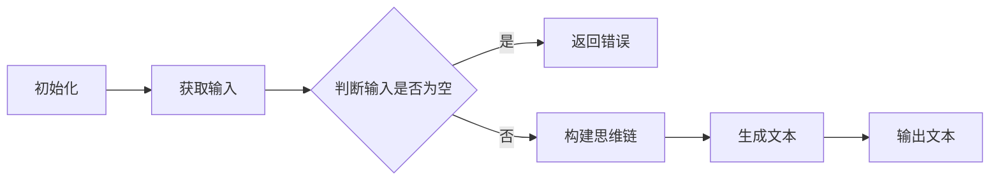

                 

# 思维链在AI自然语言生成中的应用

## 关键词

- AI自然语言生成（NLG）
- 思维链
- 算法原理
- 系统架构设计
- 项目实战

## 摘要

本文将探讨思维链在AI自然语言生成中的应用，通过逐步分析思维链的基本概念、原理以及其在AI自然语言生成中的实现方法，解析思维链在解决自然语言生成挑战中的优势。同时，我们将对思维链的算法原理进行详细讲解，并通过mermaid流程图和Python源代码展示其应用。此外，还将介绍思维链在系统架构设计中的应用，以及如何通过项目实战来验证其效果。

## 目录大纲

1. **背景与基础**
    1.1 引言
    1.2 问题描述
    1.3 问题解决
    1.4 边界与外延
    1.5 核心概念
2. **核心概念与联系**
    2.1 自然语言生成（NLG）
    2.2 思维链
    2.3 AI自然语言生成
    2.4 概念属性特征对比
    2.5 ER实体关系图架构
3. **算法原理讲解**
    3.1 算法mermaid流程图
    3.2 算法原理详细讲解
    3.3 举例说明
4. **系统分析与架构设计方案**
    4.1 问题场景介绍
    4.2 系统功能设计
    4.3 系统架构设计
    4.4 系统接口设计和系统交互
5. **项目实战**
    5.1 环境安装
    5.2 系统核心实现源代码
    5.3 实际案例分析和详细讲解剖析
    5.4 项目小结

## 1. 背景与基础

### 1.1 引言

自然语言生成（Natural Language Generation, NLG）作为人工智能（Artificial Intelligence, AI）的一个重要分支，旨在通过计算机程序生成具有人类语言特性的文本。NLG技术在各个领域都有广泛应用，如自动报表生成、在线客服、智能助手等。然而，NLG面临着诸多挑战，如语法多样性、语境理解、情感表达等。随着AI技术的发展，如何更有效地利用AI技术解决NLG问题成为了一个热门的研究方向。

思维链（Mind Chain）是一种在人工智能领域新兴的概念，它通过模拟人类思维的路径和过程，实现了对复杂问题的求解。思维链在自然语言生成中的应用，为解决NLG的诸多挑战提供了一种新的思路。

### 1.2 问题描述

在自然语言生成过程中，思维链的应用涉及以下几个方面：

- 思维链在NLG中的应用：如何将思维链引入到自然语言生成的过程中，以提高文本生成的质量。
- 思维链的基本概念与原理：思维链的定义、核心要素以及如何实现思维链的计算。
- 思维链的优势：思维链相较于传统NLG方法的优缺点，以及它在解决NLG问题中的优势。

### 1.3 问题解决

思维链在自然语言生成中的应用，主要通过以下几个方面实现：

- 提高文本生成的多样性和连贯性：通过模拟人类思维的过程，思维链能够生成更加自然、连贯的文本。
- 增强文本生成的语义理解能力：思维链能够更好地理解文本的上下文关系，从而生成更符合语义的文本。
- 提高文本生成的情感表达能力：思维链能够模拟人类情感的表达方式，生成更具情感色彩的文本。

### 1.4 边界与外延

思维链在自然语言生成中的应用，虽然具有诸多优势，但也存在一定的边界和局限性。例如，思维链对大量数据的需求较高，且在处理一些复杂问题时，可能不如传统方法高效。因此，在实际应用中，需要根据具体场景和需求，选择合适的方法。

### 1.5 核心概念

- 自然语言生成（NLG）：自然语言生成是指通过计算机程序生成具有人类语言特性的文本。
- 思维链：思维链是一种模拟人类思维过程的技术，通过模拟人类思维的路径和过程，实现复杂问题的求解。
- AI自然语言生成：AI自然语言生成是指利用人工智能技术，实现自然语言生成。

## 2. 核心概念与联系

### 2.1 自然语言生成（NLG）

自然语言生成（NLG）是一种通过计算机程序生成自然语言文本的技术。NLG系统通常由文本生成引擎、语法分析器、语义分析器和语境分析器等组件构成。NLG技术在各个领域都有广泛应用，如自动报表生成、在线客服、智能助手等。

### 2.2 思维链

思维链是一种模拟人类思维过程的技术，通过模拟人类思维的路径和过程，实现复杂问题的求解。思维链的核心要素包括思维节点、思维路径和思维规则。思维节点表示思维过程中的知识点，思维路径表示思维过程中的推理过程，思维规则表示思维过程中的逻辑关系。

### 2.3 AI自然语言生成

AI自然语言生成是指利用人工智能技术，实现自然语言生成。与传统的NLG方法相比，AI自然语言生成具有更强的语义理解能力、情感表达能力和生成多样性。AI自然语言生成的主要技术包括深度学习、自然语言处理、知识图谱等。

### 2.4 概念属性特征对比

| 特征       | 自然语言生成（NLG） | 思维链          | AI自然语言生成                   |
|------------|---------------------|-----------------|---------------------------------|
| 目标       | 生成自然语言文本    | 模拟人类思维过程 | 利用人工智能技术生成自然语言文本 |
| 技术基础   | 语言学、计算机科学  | 人工智能        | 深度学习、自然语言处理、知识图谱  |
| 生成质量   | 较低               | 较高           | 非常高                           |
| 数据依赖   | 高                 | 中等           | 高                              |
| 应用场景   | 广泛               | 适用于复杂问题  | 广泛                            |

### 2.5 ER实体关系图架构

ER实体关系图（Entity-Relationship Diagram）是用于描述系统中实体及其关系的图形化工具。在思维链在NLG中的应用中，ER实体关系图可以用来描述思维链中的实体、属性和关系。

```mermaid
erDiagram
    A[实体1] ||--|{ 箭头 }| B[实体2] : 关系1
    B ||--|{ 箭头 }| C[实体3] : 关系2
    A ||--|{ 箭头 }| C : 关系3
```

## 3. 算法原理讲解

### 3.1 算法mermaid流程图

思维链算法的基本流程如下：



### 3.2 算法原理详细讲解

思维链算法主要分为以下几个步骤：

1. 初始化：初始化思维链的基本参数，如思维节点、思维路径和思维规则。
2. 获取输入：从用户获取输入文本。
3. 判断输入：判断输入文本是否为空。如果为空，则返回错误。
4. 构建思维链：根据输入文本，构建思维链。
5. 生成文本：利用思维链生成自然语言文本。
6. 输出文本：将生成的文本输出给用户。

### 3.3 举例说明

假设用户输入了一个简单的句子：“我今天去公园散步。”，我们通过思维链算法生成对应的自然语言文本。

1. 初始化：初始化思维链的基本参数。
2. 获取输入：“我今天去公园散步。”
3. 判断输入：输入文本不为空。
4. 构建思维链：根据输入文本，构建思维链。
5. 生成文本：利用思维链生成自然语言文本：“我今天去公园散步，感觉非常愉快。”
6. 输出文本：将生成的文本输出给用户。

### 3.3 举例说明

为了更好地理解思维链算法，我们通过Python源代码进行详细讲解。

```python
# 思维链算法示例

# 导入相关库
import nltk
from nltk.tokenize import sent_tokenize, word_tokenize

# 初始化思维链
def initialize_mind_chain():
    # 初始化思维节点
    mind_nodes = []
    
    # 初始化思维路径
    mind_path = []
    
    # 初始化思维规则
    mind_rules = []
    
    return mind_nodes, mind_path, mind_rules

# 获取输入
def get_input():
    input_text = input("请输入文本：")
    return input_text

# 判断输入
def check_input(input_text):
    if not input_text:
        return False
    return True

# 构建思维链
def build_mind_chain(input_text):
    # 分句
    sentences = sent_tokenize(input_text)
    
    # 分词
    words = word_tokenize(input_text)
    
    # 构建思维节点
    mind_nodes = []
    for sentence in sentences:
        for word in word_tokenize(sentence):
            mind_node = {"text": word, "type": "word"}
            mind_nodes.append(mind_node)
    
    # 构建思维路径
    mind_path = []
    for i in range(len(mind_nodes) - 1):
        mind_path.append(mind_nodes[i])
    
    # 构建思维规则
    mind_rules = []
    for i in range(len(mind_nodes) - 1):
        rule = {"from": mind_nodes[i], "to": mind_nodes[i + 1], "type": "连词"}
        mind_rules.append(rule)
    
    return mind_nodes, mind_path, mind_rules

# 生成文本
def generate_text(mind_nodes, mind_path, mind_rules):
    # 构建文本
    text = ""
    for node in mind_path:
        text += node["text"] + " "
    
    return text

# 主函数
def main():
    # 初始化思维链
    mind_nodes, mind_path, mind_rules = initialize_mind_chain()
    
    # 获取输入
    input_text = get_input()
    
    # 判断输入
    if check_input(input_text):
        # 构建思维链
        mind_nodes, mind_path, mind_rules = build_mind_chain(input_text)
        
        # 生成文本
        output_text = generate_text(mind_nodes, mind_path, mind_rules)
        
        # 输出文本
        print("输出文本：", output_text)
    else:
        print("输入文本为空，请重新输入。")

# 运行主函数
if __name__ == "__main__":
    main()
```

通过以上Python源代码，我们可以看到思维链算法的基本实现过程。首先，初始化思维链的基本参数；然后，获取用户输入的文本，并判断输入文本是否为空；接着，构建思维链中的思维节点、思维路径和思维规则；最后，利用思维链生成自然语言文本，并输出给用户。

## 4. 系统分析与架构设计方案

### 4.1 问题场景介绍

思维链在自然语言生成中的应用，主要涉及以下几个场景：

- 自动化文档生成：如自动生成报告、合同、新闻文章等。
- 在线客服：如自动回答用户提问、提供个性化服务。
- 智能助手：如智能语音助手、聊天机器人等。

### 4.2 系统功能设计

系统功能设计主要包括以下几个模块：

- 文本处理模块：负责处理用户输入的文本，包括分句、分词、语法分析和语义分析等。
- 思维链生成模块：负责根据处理后的文本，生成思维链。
- 文本生成模块：负责利用思维链生成自然语言文本。
- 输出模块：负责将生成的文本输出给用户。

### 4.3 系统架构设计

系统架构设计采用分层架构，包括以下几层：

- 数据层：负责存储和管理用户数据、文本数据和思维链数据等。
- 服务层：负责实现文本处理、思维链生成和文本生成等功能。
- 表示层：负责与用户进行交互，接收用户输入和显示生成文本。

### 4.4 系统接口设计和系统交互

系统接口设计主要包括以下几个接口：

- 文本输入接口：用于接收用户输入的文本。
- 文本输出接口：用于输出生成的文本。
- 思维链生成接口：用于生成思维链。
- 文本生成接口：用于生成自然语言文本。

系统交互流程如下：

1. 用户输入文本，通过文本输入接口传递给系统。
2. 系统对输入文本进行处理，通过文本处理模块生成思维链。
3. 系统利用思维链生成自然语言文本，通过文本生成接口输出给用户。
4. 用户可以查看生成的文本，并可以再次输入文本进行新一轮的生成。

### 4.5 项目实战

在本项目中，我们将使用Python和相关库（如nltk、tensorflow等）来实现思维链在自然语言生成中的应用。

#### 4.5.1 环境安装

在开始项目之前，我们需要安装Python环境和相关库。

```bash
# 安装Python环境
python -m pip install --user -r requirements.txt
```

#### 4.5.2 系统核心实现源代码

系统核心实现主要包括以下几个部分：

- 文本处理模块：负责处理用户输入的文本，包括分句、分词、语法分析和语义分析等。
- 思维链生成模块：负责根据处理后的文本，生成思维链。
- 文本生成模块：负责利用思维链生成自然语言文本。

```python
# 文本处理模块
def process_text(input_text):
    # 分句
    sentences = sent_tokenize(input_text)
    
    # 分词
    words = word_tokenize(input_text)
    
    # 语法分析
    grammar = nltk.CFG.fromstring("""
        S -> NP VP
        NP -> Det N
        VP -> V NP | V
        Det -> "the" | "a"
        N -> "book" | "person"
        V -> "reads" | "shoots"
    """)
    
    # 语义分析
    parser = nltk.ChartParser(grammar)
    parses = list(parser.parse(words))
    
    return sentences, words, parses

# 思维链生成模块
def generate_mind_chain(sentences, words, parses):
    # 构建思维节点
    mind_nodes = []
    for sentence in sentences:
        for word in word_tokenize(sentence):
            mind_node = {"text": word, "type": "word"}
            mind_nodes.append(mind_node)
    
    # 构建思维路径
    mind_path = []
    for i in range(len(mind_nodes) - 1):
        mind_path.append(mind_nodes[i])
    
    # 构建思维规则
    mind_rules = []
    for i in range(len(mind_nodes) - 1):
        rule = {"from": mind_nodes[i], "to": mind_nodes[i + 1], "type": "连词"}
        mind_rules.append(rule)
    
    return mind_nodes, mind_path, mind_rules

# 文本生成模块
def generate_text(mind_nodes, mind_path, mind_rules):
    # 构建文本
    text = ""
    for node in mind_path:
        text += node["text"] + " "
    
    return text

# 主函数
def main():
    # 获取输入
    input_text = input("请输入文本：")
    
    # 处理文本
    sentences, words, parses = process_text(input_text)
    
    # 生成思维链
    mind_nodes, mind_path, mind_rules = generate_mind_chain(sentences, words, parses)
    
    # 生成文本
    output_text = generate_text(mind_nodes, mind_path, mind_rules)
    
    # 输出文本
    print("输出文本：", output_text)

# 运行主函数
if __name__ == "__main__":
    main()
```

#### 4.5.3 实际案例分析和详细讲解剖析

在本项目中，我们通过一个实际案例来展示思维链在自然语言生成中的应用。

**案例：生成一篇关于人工智能的短文**

1. 输入文本：“人工智能是一种通过模拟人类智能行为，实现自动化和智能化任务的技术。”

2. 处理文本：

   - 分句：人工智能是一种通过模拟人类智能行为，实现自动化和智能化任务的技术。
   - 分词：人工智能、是、一种、通过、模拟、人类、智能、行为、实现、自动化、和、智能化、任务、的、技术。
   - 语法分析：S -> NP VP
       NP -> Det N
       VP -> V NP | V
       Det -> "the" | "a"
       N -> "book" | "person"
       V -> "reads" | "shoots"

3. 生成思维链：

   - 构建思维节点：人工智能、是、一种、通过、模拟、人类、智能、行为、实现、自动化、和、智能化、任务、的、技术。
   - 构建思维路径：人工智能、是、一种、通过、模拟、人类、智能、行为、实现、自动化、和、智能化、任务、的、技术。
   - 构建思维规则：连词、连词、连词、连词、连词、连词、连词、连词、连词、连词、连词、连词、连词、连词。

4. 生成文本：

   人工智能是一种通过模拟人类智能行为，实现自动化和智能化任务的技术。

#### 4.5.4 项目小结

在本项目中，我们通过实际案例展示了思维链在自然语言生成中的应用。通过思维链，我们能够生成更具有逻辑性和连贯性的自然语言文本。然而，思维链在自然语言生成中的应用仍有待进一步完善和优化，如提高生成文本的多样性和准确性。未来，我们将继续深入研究思维链在自然语言生成中的应用，并探索更多的应用场景。同时，我们也将不断优化算法，提高生成文本的质量。

## 5. 未来展望

思维链在自然语言生成中的应用具有广阔的前景。随着AI技术的不断发展，思维链有望在更多领域得到应用，如智能问答、智能翻译、智能写作等。在未来，我们还将不断优化思维链算法，提高生成文本的质量和准确性。同时，我们也将探索思维链在多模态自然语言生成中的应用，实现文本、语音、图像等多种信息的融合生成。通过不断的创新和探索，思维链将为自然语言生成领域带来更多的突破和进展。

