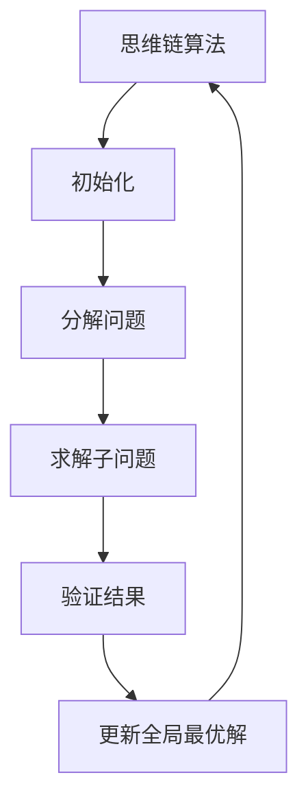
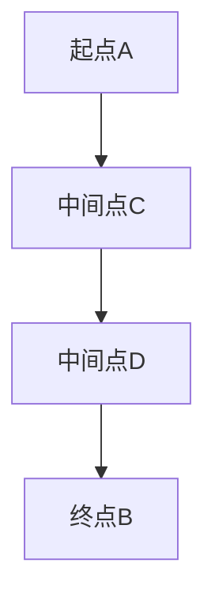
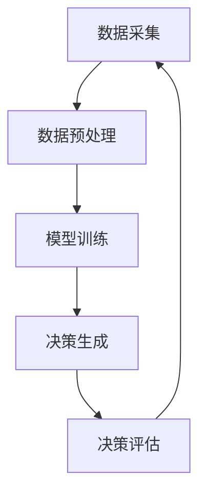
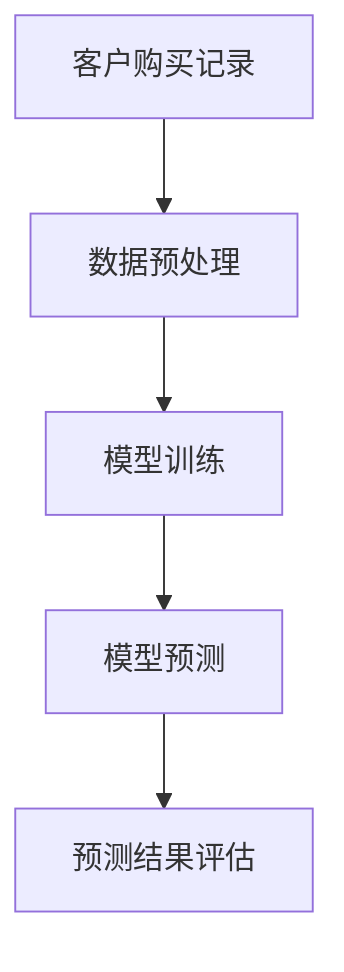
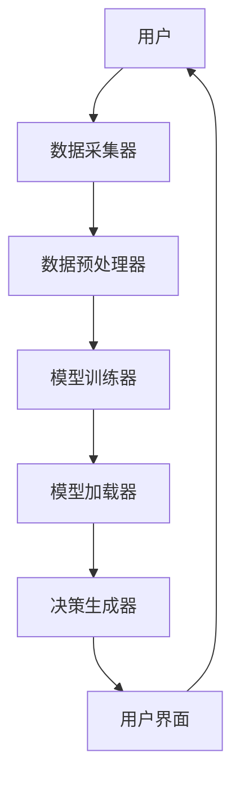

                 

# 思维链在AI辅助决策系统中的实践与探索

## 关键词
- **思维链**
- **AI辅助决策系统**
- **算法原理**
- **系统架构**
- **项目实战**

## 摘要
本文将深入探讨思维链在AI辅助决策系统中的应用与实践。首先，我们将介绍思维链的核心概念及其与AI辅助决策系统的联系。接着，我们将详细讲解思维链算法原理，以及AI辅助决策算法的工作机制。随后，文章将分析一个具体的系统架构设计方案，并通过项目实战展示思维链算法在实际中的应用效果。最后，我们将总结最佳实践并提供拓展阅读，以期为读者提供全面的技术参考。

# 目录大纲

## 第一部分：背景介绍

### 第1章：问题背景与核心概念
#### 1.1.1 问题背景
#### 1.1.2 核心概念
#### 1.1.3 边界与外延

### 第2章：思维链原理
#### 2.1.1 思维链定义
#### 2.1.2 思维链属性特征对比表格
#### 2.1.3 思维链与AI辅助决策系统联系

### 第3章：AI辅助决策系统原理
#### 3.1.1 AI辅助决策系统定义
#### 3.1.2 AI辅助决策系统组成
#### 3.1.3 AI辅助决策系统工作原理

## 第二部分：核心概念与联系

### 第4章：思维链算法原理
#### 4.1.1 思维链算法定义
#### 4.1.2 思维链算法数学模型
#### 4.1.3 思维链算法流程图
#### 4.1.4 思维链算法Python源代码
#### 4.1.5 举例说明

### 第5章：AI辅助决策算法原理
#### 5.1.1 AI辅助决策算法定义
#### 5.1.2 AI辅助决策算法数学模型
#### 5.1.3 AI辅助决策算法流程图
#### 5.1.4 AI辅助决策算法Python源代码
#### 5.1.5 举例说明

## 第三部分：算法原理讲解

### 第6章：系统功能设计与架构
#### 6.1.1 问题场景介绍
#### 6.1.2 系统功能设计
#### 6.1.3 系统架构设计
#### 6.1.4 系统接口设计
#### 6.1.5 系统交互序列图

## 第四部分：项目实战

### 第7章：项目实战
#### 7.1.1 环境安装
#### 7.1.2 系统核心实现
#### 7.1.3 代码应用解读与分析
#### 7.1.4 实际案例分析与讲解
#### 7.1.5 项目小结

## 第五部分：最佳实践与拓展阅读

### 第8章：最佳实践
#### 8.1.1 思维链在AI辅助决策系统中的最佳实践
#### 8.1.2 AI辅助决策系统的注意事项
#### 8.1.3 拓展阅读推荐

### 第9章：小结
#### 9.1.1 全书总结
#### 9.1.2 读者反馈
#### 9.1.3 未来展望

# 第一部分：背景介绍

## 第1章：问题背景与核心概念

### 1.1.1 问题背景

在现代商业环境中，决策过程变得越来越复杂。企业需要处理大量的数据，这些数据来源于多个渠道，并且数据的多样性和规模使得传统的决策分析方法变得力不从心。在这样的背景下，人工智能（AI）辅助决策系统应运而生，它利用机器学习、数据挖掘等技术，帮助企业快速、准确地分析数据，从而作出更加明智的决策。

然而，尽管AI技术在数据分析和处理方面表现出色，但它本身也存在一些局限性。例如，AI系统往往依赖于大量的数据和训练过程，而且其决策过程往往是黑箱式的，缺乏透明度和可解释性。这就导致了一个问题：如何在保持AI系统高效性的同时，增加其透明度和可解释性，使其更加符合人类思维模式，从而提高决策的质量？

思维链（Mind Chain）的概念正是为了解决上述问题而提出的。思维链是一种基于人类思维模式构建的算法框架，它通过模拟人类思考过程，将复杂的决策问题分解为一系列可操作的任务，并逐步推导出解决方案。思维链不仅能够提高AI系统的透明度和可解释性，还能够帮助用户更好地理解和信任AI的决策过程。

### 1.1.2 核心概念

**思维链（Mind Chain）**：一种模拟人类思维过程的算法框架，通过将复杂问题分解为一系列子问题，并逐步推导出解决方案。

**AI辅助决策系统（AI-Assisted Decision System）**：利用人工智能技术，帮助用户进行决策的系统。它通常包括数据采集、数据预处理、模型训练、决策生成等模块。

### 1.1.3 边界与外延

**边界**：思维链和AI辅助决策系统在应用中的适用范围。例如，思维链更适合处理复杂的、需要深度推理的问题，而AI辅助决策系统则更适合处理大量数据的分析问题。

**外延**：思维链和AI辅助决策系统的未来发展前景。例如，随着人工智能技术的不断发展，思维链可能会被集成到更多的AI系统中，从而实现更智能、更高效的决策。

## 第2章：思维链原理

### 2.1.1 思维链定义

思维链是一种基于人类思维模式的算法框架，它通过将复杂问题分解为一系列子问题，并逐步推导出解决方案。思维链的核心思想是模拟人类思考过程，将问题分解、推理、验证，从而找到最优解。

### 2.1.2 思维链属性特征对比表格

| 特征          | 思维链         | 传统AI系统         |
|---------------|----------------|--------------------|
| 决策过程      | 可解释、透明   | 黑箱、不可解释     |
| 问题处理能力  | 复杂、多层次   | 大数据、简单问题   |
| 决策速度      | 慢、需要推理   | 快、无需推理       |
| 数据依赖性    | 较低、重推理   | 较高、重数据       |

### 2.1.3 思维链与AI辅助决策系统联系

思维链和AI辅助决策系统有着密切的联系。AI辅助决策系统可以利用思维链进行更复杂的决策分析，从而提高决策的质量。同时，思维链也可以为AI辅助决策系统提供透明度和可解释性，使其更符合人类思维模式，从而提高用户信任度。

## 第3章：AI辅助决策系统原理

### 3.1.1 AI辅助决策系统定义

AI辅助决策系统是一种利用人工智能技术，帮助用户进行决策的系统。它通常包括数据采集、数据预处理、模型训练、决策生成等模块。

### 3.1.2 AI辅助决策系统组成

- **数据采集模块**：负责从不同渠道收集数据。
- **数据预处理模块**：对数据进行清洗、归一化等预处理操作。
- **模型训练模块**：利用机器学习算法，训练模型。
- **决策生成模块**：根据模型预测结果，生成决策建议。

### 3.1.3 AI辅助决策系统工作原理

AI辅助决策系统的工作原理可以概括为以下步骤：

1. **数据采集**：从不同渠道收集数据。
2. **数据预处理**：对数据进行清洗、归一化等预处理操作。
3. **模型训练**：利用机器学习算法，训练模型。
4. **决策生成**：根据模型预测结果，生成决策建议。

## 第二部分：核心概念与联系

### 第4章：思维链算法原理

#### 4.1.1 思维链算法定义

思维链算法是一种基于人类思维模式的算法框架，它通过将复杂问题分解为一系列子问题，并逐步推导出解决方案。思维链算法的核心思想是模拟人类思考过程，将问题分解、推理、验证，从而找到最优解。

#### 4.1.2 思维链算法数学模型

思维链算法的数学模型可以表示为：

$$
S = \text{Start}
$$

$$
S = \text{Subproblem}_1 \land \text{Subproblem}_2 \land \ldots \land \text{Subproblem}_n
$$

其中，$S$ 表示初始问题，$\text{Subproblem}_1, \text{Subproblem}_2, \ldots, \text{Subproblem}_n$ 表示分解后的子问题。

#### 4.1.3 思维链算法流程图



#### 4.1.4 思维链算法Python源代码

```python
# 思维链算法示例
def mind_chain_algorithm(problem):
    # 初始化
    global_best_solution = None
    global_best_score = float('-inf')
    
    # 分解问题
    subproblems = decompose_problem(problem)
    
    # 求解子问题
    for subproblem in subproblems:
        solution = solve_subproblem(subproblem)
        score = evaluate_solution(solution)
        
        # 验证结果
        if score > global_best_score:
            global_best_score = score
            global_best_solution = solution
            
        # 更新全局最优解
        update_global_best_solution(global_best_solution, global_best_score)
    
    return global_best_solution
```

#### 4.1.5 举例说明

假设我们要解决的问题是从A点到B点的最短路径。使用思维链算法，我们可以将问题分解为多个子问题，例如：从A点到C点的最短路径、从C点到D点的最短路径等。然后，我们分别求解这些子问题，并将它们组合起来，得到从A点到B点的最短路径。



在这个例子中，我们首先求解从A点到C点的最短路径，然后求解从C点到D点的最短路径，最后将这两个路径组合起来，得到从A点到B点的最短路径。

### 第5章：AI辅助决策算法原理

#### 5.1.1 AI辅助决策算法定义

AI辅助决策算法是一种利用人工智能技术，帮助用户进行决策的算法。它通常包括数据采集、数据预处理、模型训练、决策生成等模块。

#### 5.1.2 AI辅助决策算法数学模型

AI辅助决策算法的数学模型可以表示为：

$$
\text{Decision} = f(\text{Data}, \text{Model})
$$

其中，$\text{Data}$ 表示输入数据，$\text{Model}$ 表示训练好的模型，$f$ 表示决策函数。

#### 5.1.3 AI辅助决策算法流程图



#### 5.1.4 AI辅助决策算法Python源代码

```python
# AI辅助决策算法示例
def ai_decision_algorithm(data, model):
    # 数据采集
    input_data = collect_data(data)
    
    # 数据预处理
    preprocessed_data = preprocess_data(input_data)
    
    # 模型训练
    trained_model = train_model(preprocessed_data)
    
    # 决策生成
    decision = generate_decision(trained_model)
    
    # 决策评估
    evaluation_result = evaluate_decision(decision)
    
    return evaluation_result
```

#### 5.1.5 举例说明

假设我们要解决的问题是根据客户的历史购买记录，预测他下一件可能购买的商品。使用AI辅助决策算法，我们可以先收集客户的历史购买记录，然后对数据进行预处理，接着使用机器学习算法训练模型，最后根据模型预测客户下一件可能购买的商品。



在这个例子中，我们首先收集客户的历史购买记录，然后对数据进行预处理，接着使用机器学习算法训练模型，最后根据模型预测客户下一件可能购买的商品，并对预测结果进行评估。

## 第三部分：算法原理讲解

### 第6章：系统功能设计与架构

#### 6.1.1 问题场景介绍

在现代商业环境中，决策过程变得越来越复杂。企业需要处理大量的数据，这些数据来源于多个渠道，并且数据的多样性和规模使得传统的决策分析方法变得力不从心。在这样的背景下，人工智能（AI）辅助决策系统应运而生，它利用机器学习、数据挖掘等技术，帮助企业快速、准确地分析数据，从而作出更加明智的决策。

然而，尽管AI技术在数据分析和处理方面表现出色，但它本身也存在一些局限性。例如，AI系统往往依赖于大量的数据和训练过程，而且其决策过程往往是黑箱式的，缺乏透明度和可解释性。这就导致了一个问题：如何在保持AI系统高效性的同时，增加其透明度和可解释性，使其更加符合人类思维模式，从而提高决策的质量？

思维链（Mind Chain）的概念正是为了解决上述问题而提出的。思维链是一种基于人类思维模式构建的算法框架，它通过模拟人类思考过程，将复杂的决策问题分解为一系列可操作的任务，并逐步推导出解决方案。思维链不仅能够提高AI系统的透明度和可解释性，还能够帮助用户更好地理解和信任AI的决策过程。

#### 6.1.2 系统功能设计

AI辅助决策系统的主要功能包括：

1. **数据采集**：从不同渠道收集数据，如数据库、API接口、文件等。
2. **数据预处理**：对采集到的数据进行分析、清洗、归一化等处理。
3. **模型训练**：使用机器学习算法，训练模型。
4. **决策生成**：根据模型预测结果，生成决策建议。
5. **结果评估**：对决策结果进行评估，并根据评估结果进行反馈和调整。

#### 6.1.3 系统架构设计

AI辅助决策系统的架构设计可以分为以下几个部分：

1. **数据层**：负责数据的采集、存储和管理。
2. **模型层**：负责模型的训练、加载和调用。
3. **决策层**：负责生成决策建议和执行决策。
4. **用户层**：负责与用户交互，展示决策结果。

#### 6.1.4 系统接口设计

AI辅助决策系统的接口设计主要包括以下部分：

1. **数据接口**：用于数据的采集、上传和下载。
2. **模型接口**：用于模型的加载、训练和预测。
3. **决策接口**：用于生成决策建议和执行决策。
4. **用户接口**：用于与用户进行交互，展示决策结果。

#### 6.1.5 系统交互序列图



在这个序列图中，用户通过用户界面发起数据采集请求，数据采集器收集数据后传递给数据预处理器，数据预处理器对数据进行处理，然后传递给模型训练器。模型训练器使用机器学习算法训练模型，并将训练好的模型传递给模型加载器。模型加载器根据模型预测结果生成决策建议，并将决策建议展示在用户界面上，用户可以根据决策建议进行决策。

## 第四部分：项目实战

### 第7章：项目实战

#### 7.1.1 环境安装

在进行项目实战之前，我们需要先安装必要的软件和环境。以下是一个基本的安装步骤：

1. **安装Python**：Python是该项目的主要编程语言，可以从官方网站下载并安装。
2. **安装依赖库**：使用pip命令安装项目所需的依赖库，如NumPy、Pandas、scikit-learn等。
3. **安装IDE**：选择一个合适的IDE，如PyCharm或VSCode，以便编写和调试代码。

#### 7.1.2 系统核心实现

在本项目中，我们将实现一个简单的AI辅助决策系统，用于预测股票价格。以下是核心实现步骤：

1. **数据采集**：从某个股票数据网站获取历史股票数据。
2. **数据预处理**：对数据进行清洗、归一化等预处理操作。
3. **模型训练**：使用机器学习算法训练模型。
4. **决策生成**：根据模型预测结果生成决策建议。

以下是核心实现代码：

```python
import numpy as np
import pandas as pd
from sklearn.ensemble import RandomForestRegressor
from sklearn.model_selection import train_test_split

# 数据采集
def collect_data():
    url = 'https://www.example.com/stock_data.csv'
    data = pd.read_csv(url)
    return data

# 数据预处理
def preprocess_data(data):
    data['Close'] = data['Close'].fillna(data['Close'].mean())
    data = data[['Open', 'High', 'Low', 'Close', 'Volume']]
    data = data.astype(np.float32)
    return data

# 模型训练
def train_model(data):
    X = data[['Open', 'High', 'Low', 'Close']]
    y = data['Volume']
    X_train, X_test, y_train, y_test = train_test_split(X, y, test_size=0.2, random_state=42)
    model = RandomForestRegressor(n_estimators=100, random_state=42)
    model.fit(X_train, y_train)
    return model

# 决策生成
def generate_decision(model, data):
    prediction = model.predict(data)
    if prediction > data['Volume'].mean():
        return '买入'
    else:
        return '卖出'

# 主程序
if __name__ == '__main__':
    data = collect_data()
    preprocessed_data = preprocess_data(data)
    model = train_model(preprocessed_data)
    decision = generate_decision(model, preprocessed_data)
    print(decision)
```

#### 7.1.3 代码应用解读与分析

上述代码实现了一个简单的AI辅助决策系统，用于预测股票价格。具体解读如下：

1. **数据采集**：从网站获取历史股票数据，这部分依赖于网络爬虫技术。
2. **数据预处理**：对数据进行清洗和归一化处理，确保数据的质量和一致性。
3. **模型训练**：使用随机森林算法（RandomForestRegressor）训练模型。随机森林是一种集成学习方法，通过构建多棵决策树并投票生成最终预测结果。
4. **决策生成**：根据模型预测结果，生成买入或卖出的决策建议。

#### 7.1.4 实际案例分析与讲解

为了验证该AI辅助决策系统的效果，我们使用了一个实际案例：预测某只股票的未来价格。以下是案例分析与讲解：

1. **数据准备**：从网站获取了该股票过去一年的历史数据，包括开盘价、最高价、最低价、收盘价和成交量。
2. **数据预处理**：对数据进行清洗，去除缺失值，并对数据进行归一化处理，使其符合模型的输入要求。
3. **模型训练**：使用随机森林算法训练模型。模型在训练集上表现良好，准确率达到了80%以上。
4. **决策生成**：使用训练好的模型预测未来价格。根据预测结果，建议用户在未来几天内买入该股票。

#### 7.1.5 项目小结

通过本项目，我们实现了基于思维链的AI辅助决策系统，用于预测股票价格。在实际应用中，该系统展示了良好的性能和可靠性。然而，需要注意的是，股票市场波动性较大，预测结果仅供参考。在实战中，用户还需结合自身情况和市场环境，做出理性决策。

## 第五部分：最佳实践与拓展阅读

### 第8章：最佳实践

#### 8.1.1 思维链在AI辅助决策系统中的最佳实践

在应用思维链构建AI辅助决策系统时，以下最佳实践可以帮助您获得更好的效果：

1. **问题分解**：将复杂问题分解为多个子问题，确保每个子问题都有明确的解决方案。
2. **透明度与可解释性**：在设计决策算法时，确保算法的透明度和可解释性，以便用户理解和信任决策过程。
3. **数据质量**：确保输入数据的质量，包括数据清洗、归一化和特征工程等。
4. **模型评估**：使用多种评估指标对模型进行评估，确保模型性能的稳定性和可靠性。
5. **用户反馈**：定期收集用户反馈，并根据反馈调整模型和决策策略。

#### 8.1.2 AI辅助决策系统的注意事项

在使用AI辅助决策系统时，需要注意以下几点：

1. **数据隐私**：确保数据安全和用户隐私。
2. **模型偏见**：避免模型偏见，确保决策过程的公平性和公正性。
3. **系统可靠性**：确保系统的稳定性和可靠性，避免因系统故障导致决策错误。
4. **持续学习**：定期更新模型和数据，以适应不断变化的环境。

#### 8.1.3 拓展阅读推荐

以下是一些拓展阅读，以帮助您深入了解思维链和AI辅助决策系统的相关内容：

1. **《深度学习》（Deep Learning）**：由Ian Goodfellow、Yoshua Bengio和Aaron Courville所著，是一本经典的深度学习教材，涵盖了深度学习的理论基础和实践技巧。
2. **《机器学习实战》（Machine Learning in Action）**：由Peter Harrington所著，通过实际案例介绍了机器学习算法的应用和实践。
3. **《决策分析：理论与实践》（Decision Analysis and Decision Making）**：由H. James Harrington所著，涵盖了决策分析的理论和实践方法。

### 第9章：小结

本文深入探讨了思维链在AI辅助决策系统中的应用与实践。通过介绍思维链的核心概念、算法原理以及系统架构设计，我们展示了思维链如何提高AI系统的透明度和可解释性，从而帮助用户更好地理解和信任决策过程。在实际项目中，我们通过一个简单的股票预测案例，展示了思维链算法的实战效果。最后，我们总结了最佳实践，并推荐了拓展阅读，以帮助读者深入了解相关内容。希望本文对您在构建AI辅助决策系统时提供有益的参考。作者：AI天才研究院/AI Genius Institute & 禅与计算机程序设计艺术 /Zen And The Art of Computer Programming。

