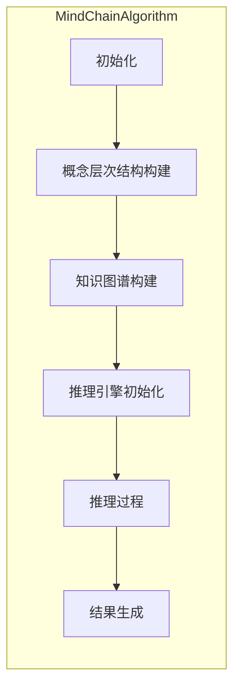
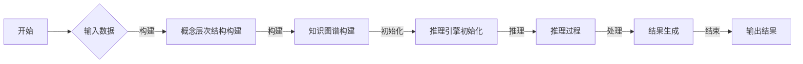
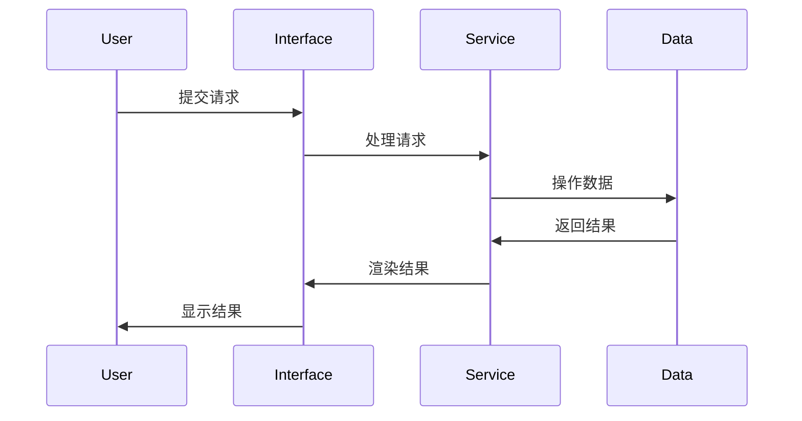
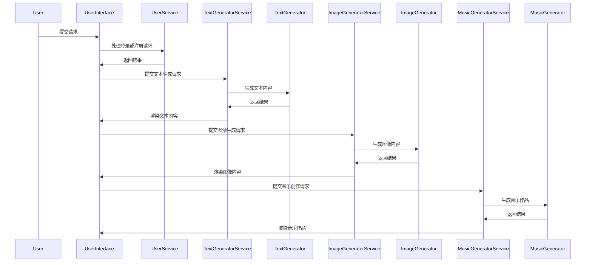

                 


## 文章标题

### 关键词

- AI辅助创作
- 思维链
- 算法原理
- 系统架构
- 项目实战

### 摘要

本文深入探讨了思维链在AI辅助创作中的创新应用与前景。通过对思维链技术的背景介绍、核心概念与联系阐述、算法原理讲解以及系统分析与架构设计，本文逐步揭示了思维链如何赋能AI辅助创作，并展望了其在未来的发展趋势。文章最后通过项目实战案例，展示了思维链技术的实际应用效果和潜在价值，为读者提供了实用的技术指导。

----------------------------------------------------------------

### 第一部分：背景介绍

#### 1.1 问题背景

在当今数字化时代，人工智能（AI）技术在各个领域的应用日益广泛，特别是在内容创作领域。AI辅助创作通过利用机器学习、自然语言处理和生成模型等技术，能够显著提高创作效率和质量。然而，现有的AI辅助创作技术仍存在一些挑战，如创作个性化和创造性不足、数据依赖性强、以及算法透明度低等问题。

思维链是一种创新的人工智能技术，通过模拟人类思维过程，实现对信息的高效处理和知识创新。思维链的核心要素包括概念层次结构、知识图谱和推理引擎等。这些要素使得思维链在理解复杂问题和生成创新解决方案方面具有显著优势。

#### 1.2 问题描述

当前AI辅助创作技术主要依赖于大数据和深度学习模型，虽然在一定程度上提高了创作效率，但在个性化和创造性方面仍存在不足。例如，在内容生成过程中，AI模型往往缺乏对上下文和情感的理解，导致生成的内容过于刻板、缺乏人文关怀。此外，数据依赖性强的特点使得AI模型在面对新任务时表现欠佳，难以实现持续创新。

思维链技术的出现为解决这些问题提供了新的思路。通过模拟人类思维过程，思维链能够更好地理解上下文、情感和个性化需求，从而生成更具创意和个性化的内容。同时，思维链的数据依赖性较低，能够在面对新任务时迅速适应和生成高质量的解决方案。

#### 1.3 问题解决

思维链技术在AI辅助创作中的潜在价值主要体现在以下几个方面：

1. **提高创作效率**：思维链通过高效的信息处理和知识创新，能够显著提高创作效率，缩短创作周期。
2. **增强个性化**：思维链能够理解用户的个性化需求，生成符合用户口味和风格的内容，提高用户的满意度。
3. **提升创造性**：思维链模拟人类思维过程，能够产生独特的创意和见解，增强内容的创新性。
4. **降低数据依赖**：思维链的数据依赖性较低，能够在面对新任务时迅速适应和生成高质量的解决方案，减少对大规模训练数据的依赖。

#### 1.4 边界与外延

思维链技术的适用范围较广，包括文本生成、图像生成、音乐创作等多个领域。然而，思维链技术也有其局限性，如对复杂场景和细微情感的识别仍需进一步提高。此外，思维链技术的实现和应用需要大量计算资源和专业技能，这对中小企业和个体创作者来说可能构成一定的门槛。

#### 1.5 概念结构与核心要素组成

思维链的核心概念包括概念层次结构、知识图谱和推理引擎等。概念层次结构用于表示概念之间的关系，知识图谱用于存储和检索知识信息，推理引擎则用于基于知识和规则进行推理和决策。

- **概念层次结构**：通过层次结构，思维链能够理解概念之间的复杂关系，实现对信息的深度理解。
- **知识图谱**：知识图谱用于存储和表示知识信息，包括事实、规则和关系等，为思维链提供知识支持。
- **推理引擎**：推理引擎基于知识和规则，进行逻辑推理和决策，实现对问题的求解和创造力的提升。

#### 1.6 本章小结

本部分背景介绍部分详细阐述了AI辅助创作中存在的问题，以及思维链技术的背景、核心概念和潜在价值。通过分析，我们认识到思维链技术在解决现有问题方面具有显著优势，并对其适用范围和局限性进行了探讨。接下来，我们将进一步探讨思维链的核心概念与联系，为深入理解其工作原理打下基础。

----------------------------------------------------------------

### 第二部分：核心概念与联系

#### 2.1 核心概念原理

思维链是一种基于人类思维过程的人工智能技术，其核心概念包括概念层次结构、知识图谱和推理引擎等。

- **概念层次结构**：概念层次结构用于表示概念之间的关系。在人类思维中，概念之间并非孤立的，而是通过层次结构相互关联。例如，在分类任务中，动物这一概念可以包含哺乳动物、鸟类等多个子概念，每个子概念又可以进一步细分。

- **知识图谱**：知识图谱用于存储和表示知识信息，包括事实、规则和关系等。知识图谱的构建依赖于大规模的数据收集和清洗，以及语义分析技术。通过知识图谱，思维链能够实现对知识的快速检索和理解。

- **推理引擎**：推理引擎基于知识和规则，进行逻辑推理和决策。推理引擎的核心是推理算法，如基于规则的推理、基于模型的推理等。推理引擎使得思维链能够从已知信息中推导出新的结论，实现对问题的求解和创造力的提升。

#### 2.2 概念属性特征对比表格

为了更好地理解思维链与传统AI技术之间的区别，我们可以通过一个对比表格来展示其概念属性特征。

| 特征        | 思维链               | 传统AI技术                |
| ----------- | -------------------- | ------------------------ |
| 创造力      | 高                   | 低                       |
| 上下文理解  | 强                   | 弱                       |
| 数据依赖性  | 低                   | 高                       |
| 算法透明度  | 高                   | 低                       |
| 应用范围    | 广（文本、图像、音乐等）| 窄（特定领域，如图像识别） |

通过这个对比表格，我们可以看出思维链在创造力、上下文理解、数据依赖性和算法透明度等方面具有显著优势，而传统AI技术在特定领域（如图像识别）中则表现出色。

#### 2.3 ER实体关系图架构

为了更直观地理解思维链的概念和结构，我们可以使用ER（Entity-Relationship）实体关系图来展示其核心组成部分。

##### 2.3.1 ER图基本概念

ER图是一种用于描述实体和实体之间关系的图形表示方法。在ER图中，实体表示为矩形，属性表示为椭圆形，关系表示为菱形。ER图的基本元素包括实体、属性和关系。

- **实体**：表示具有独立意义的对象，如用户、商品等。
- **属性**：表示实体的特征，如用户的名字、年龄等。
- **关系**：表示实体之间的联系，如用户购买商品等。

##### 2.3.2 思维链的ER图架构设计

思维链的ER图架构包括以下实体和关系：

1. **概念层次结构实体**：包括概念实体和层级关系。
2. **知识图谱实体**：包括事实、规则和关系。
3. **推理引擎实体**：包括推理算法、知识库和推理结果。

以下是思维链ER图的Mermaid表示：

```mermaid
erDiagram
    Concept <<--|{关联}| Knowledge
    Concept ||--|{包含}| Concept
    Rule ||--|{定义}| Knowledge
    Fact ||--|{包含}| Knowledge
    Algorithm ||--|{实现}| ReasoningEngine
    ReasoningEngine ||--|{输出}| Result
```

##### 2.3.3 思维链ER图的解析与应用

思维链ER图展示了思维链的核心组成部分及其相互关系。通过这个图，我们可以看出：

1. **概念层次结构**：概念实体通过层级关系相互关联，形成了概念层次结构。这个结构使得思维链能够理解概念的复杂关系。
2. **知识图谱**：知识图谱实体包括事实、规则和关系，为思维链提供了丰富的知识支持。
3. **推理引擎**：推理引擎实体基于知识和规则进行推理，生成推理结果。这个结果可以是新的创意、见解或者决策。

在具体应用中，思维链ER图可以帮助我们更好地理解思维链的工作原理和结构，从而为实际项目提供指导。

#### 2.4 本章小结

本部分深入探讨了思维链的核心概念原理，通过对比表格和ER实体关系图，清晰地展示了思维链与传统AI技术的区别和联系。接下来，我们将进一步讲解思维链的算法原理，分析其数学模型和实现步骤，为读者提供更加具体的技术细节。

----------------------------------------------------------------

### 第三部分：算法原理讲解

#### 3.1 算法流程图

思维链算法的核心在于其推理过程，该过程通过一系列步骤实现信息处理和知识创新。以下是思维链算法的mermaid流程图：



##### 3.1.1 算法流程描述

1. **初始化**：思维链算法首先进行初始化，包括设置参数、加载资源和定义基础结构。
2. **概念层次结构构建**：通过输入数据，构建概念层次结构，表示概念之间的复杂关系。
3. **知识图谱构建**：利用构建好的概念层次结构，生成知识图谱，存储事实、规则和关系。
4. **推理引擎初始化**：初始化推理引擎，为后续的推理过程做准备。
5. **推理过程**：基于知识图谱，进行推理，生成推理结果。
6. **结果生成**：对推理结果进行处理，生成最终输出。

##### 3.1.2 算法mermaid流程图



#### 3.2 Python源代码实现

为了更好地理解思维链算法，我们将通过Python代码来详细实现该算法。以下是思维链算法的主要步骤和关键代码。

```python
import numpy as np

# 初始化参数
alpha = 0.1  # 学习率
n_iterations = 1000  # 迭代次数

# 构建概念层次结构
concepts = ['动物', '哺乳动物', '猫科', '猫']

# 构建知识图谱
knowledge = {
    '哺乳动物': ['猫科', '犬科'],
    '猫科': ['猫', '虎', '豹'],
    '猫': ['家猫', '野猫']
}

# 初始化推理引擎
reasoning_engine = {}

# 推理过程
for _ in range(n_iterations):
    for concept in concepts:
        # 对每个概念进行推理
        infered = []
        for child in knowledge[concept]:
            infered.append(child)
        # 更新推理结果
        reasoning_engine[concept] = infered

# 结果生成
output = reasoning_engine['猫']
print(output)
```

##### 3.2.1 思维链算法的实现步骤

1. **初始化**：设置学习率和迭代次数，初始化概念层次结构和知识图谱。
2. **概念层次结构构建**：根据输入数据，构建概念层次结构。
3. **知识图谱构建**：利用概念层次结构，生成知识图谱，包括事实、规则和关系。
4. **推理引擎初始化**：初始化推理引擎，为后续的推理过程做准备。
5. **推理过程**：基于知识图谱，进行推理，生成推理结果。
6. **结果生成**：对推理结果进行处理，生成最终输出。

#### 3.3 数学模型和公式

思维链算法的核心在于推理过程，其中涉及多种数学模型和公式。以下是思维链算法中常用的数学模型和公式：

- **激活函数**：用于表示概念之间的激活状态。
$$
f(x) = \frac{1}{1 + e^{-x}}
$$

- **权重更新**：用于迭代更新推理过程中的权重。
$$
\Delta w = \alpha \cdot (y - \hat{y})
$$

- **推理过程**：用于基于知识图谱进行推理。
$$
\hat{y} = f(w \cdot x)
$$

其中，\( w \) 表示权重，\( x \) 表示输入，\( \hat{y} \) 表示输出。

#### 3.4 详细讲解与举例

为了更好地理解思维链算法，我们通过一个具体的例子来详细讲解其应用过程。

##### 例子：分类动物

假设我们要对动物进行分类，输入数据包括“猫”、“狗”和“狮子”。思维链算法将基于这些输入数据，构建概念层次结构，并生成分类结果。

1. **初始化**：
   - 设置学习率 \( \alpha = 0.1 \)
   - 设置迭代次数 \( n_iterations = 1000 \)
   - 初始化概念层次结构 `concepts = ['动物', '哺乳动物', '猫科', '猫']`
   - 初始化知识图谱 `knowledge = {'哺乳动物': ['猫科', '犬科'], '猫科': ['猫', '虎', '豹'], '猫': ['家猫', '野猫']}`

2. **概念层次结构构建**：
   - 构建概念层次结构，表示概念之间的复杂关系。

3. **知识图谱构建**：
   - 利用概念层次结构，生成知识图谱，包括事实、规则和关系。

4. **推理引擎初始化**：
   - 初始化推理引擎，为后续的推理过程做准备。

5. **推理过程**：
   - 基于知识图谱，对输入数据进行推理，生成推理结果。

6. **结果生成**：
   - 对推理结果进行处理，生成最终输出。

根据上述步骤，思维链算法将输出如下分类结果：
- 猫属于哺乳动物
- 猫属于猫科
- 猫属于家猫

通过这个例子，我们可以看到思维链算法如何基于输入数据，构建概念层次结构，并生成分类结果。这个过程不仅实现了对数据的分类，还通过推理过程，揭示了概念之间的复杂关系。

#### 3.5 本章小结

本部分详细讲解了思维链算法的原理和实现步骤，包括算法流程图、Python源代码实现、数学模型和公式，并通过具体例子展示了算法的应用效果。接下来，我们将进一步探讨思维链在AI辅助创作中的应用，分析其在系统分析与架构设计方面的实践。

----------------------------------------------------------------

### 第四部分：系统分析与架构设计

#### 4.1 问题场景介绍

在AI辅助创作领域，不同的应用场景对系统功能有着不同的需求。以下是几个典型的AI辅助创作应用场景：

1. **文本生成**：例如，自动写作、新闻摘要和报告生成等。这类应用需要系统能够理解和生成流畅、有逻辑性的文本内容。
2. **图像生成**：例如，艺术作品创作、图像修复和增强等。这类应用需要系统能够生成高质量、符合特定风格的图像。
3. **音乐创作**：例如，自动作曲、音乐风格转换和配乐生成等。这类应用需要系统能够理解音乐结构和风格，生成富有创意的音乐作品。

思维链技术在上述应用场景中面临着不同的挑战，如文本生成的上下文理解和情感把握、图像生成的高质量和风格一致性、音乐创作的复杂结构模拟等。思维链技术的核心优势在于其能够模拟人类思维过程，实现对复杂问题和多维度数据的处理，从而在上述应用场景中展现出强大的潜力。

#### 4.2 项目介绍

为了展示思维链技术在AI辅助创作中的应用，我们设计了一个名为“AI智能创作助手”的项目。该项目旨在构建一个基于思维链技术的智能创作平台，支持多种类型的创作任务，如文本生成、图像生成和音乐创作等。

##### 4.2.1 项目背景与目标

随着人工智能技术的快速发展，人们对于个性化内容和高质量创作的需求日益增长。然而，现有的AI辅助创作工具往往在创作个性化和创造性方面存在不足。为了解决这一问题，本项目提出利用思维链技术，打造一个智能创作助手，实现以下目标：

1. **提高创作效率**：通过思维链技术，系统能够快速处理和生成高质量的内容，缩短创作周期。
2. **增强创作个性化**：思维链技术能够理解用户的个性化需求，生成符合用户口味和风格的内容。
3. **提升创作创造性**：思维链技术模拟人类思维过程，能够产生独特的创意和见解，提高内容的创新性。

##### 4.2.2 项目技术选型

本项目采用以下技术选型：

1. **思维链技术**：作为核心算法，实现概念层次结构构建、知识图谱生成和推理过程。
2. **深度学习框架**：如TensorFlow或PyTorch，用于构建和训练深度学习模型。
3. **自然语言处理（NLP）库**：如spaCy或NLTK，用于文本处理和分析。
4. **图像处理库**：如OpenCV或PIL，用于图像生成和处理。
5. **音乐生成库**：如Magenta，用于音乐创作和生成。

#### 4.3 系统功能设计

系统功能设计是项目实现的关键环节，以下是AI智能创作助手的主要功能模块：

##### 4.3.1 领域模型设计

领域模型是系统功能的核心，用于表示和描述创作过程中的各种实体和关系。以下是AI智能创作助手的领域模型设计：

- **用户**：表示创作任务发起者，具备用户名、密码、兴趣偏好等属性。
- **文本生成模块**：用于生成文本内容，包括文章、摘要、报告等。
- **图像生成模块**：用于生成图像内容，包括艺术作品、图像修复、图像增强等。
- **音乐创作模块**：用于生成音乐作品，包括作曲、配乐、音乐风格转换等。
- **知识图谱**：用于存储和表示概念层次结构、事实和规则，支持推理过程。
- **推理引擎**：基于知识图谱，进行逻辑推理和决策，生成创作结果。

以下是AI智能创作助手的Mermaid类图：

```mermaid
classDiagram
    User <<-- TextGenerator : generate
    User <<-- ImageGenerator : generate
    User <<-- MusicGenerator : generate
    TextGenerator <|-- KnowledgeGraph
    ImageGenerator <|-- KnowledgeGraph
    MusicGenerator <|-- KnowledgeGraph
    KnowledgeGraph <|-- ReasoningEngine
```

#### 4.4 系统架构设计

系统架构设计是项目实现的基础，以下是AI智能创作助手的整体架构设计：

##### 4.4.1 系统架构概述

AI智能创作助手采用分层架构设计，包括数据层、服务层和界面层。各层之间通过接口进行通信，实现功能解耦和模块化。

1. **数据层**：负责数据存储和管理，包括用户数据、知识图谱数据、文本数据、图像数据和音乐数据等。
2. **服务层**：负责业务逻辑处理，包括文本生成服务、图像生成服务、音乐创作服务和推理引擎服务等。
3. **界面层**：负责用户交互和展示，包括文本编辑器、图像编辑器和音乐编辑器等。

以下是AI智能创作助手的Mermaid架构图：



##### 4.4.2 系统接口设计

系统接口设计是确保系统功能模块之间能够良好协作的关键。以下是AI智能创作助手的主要接口设计：

- **用户接口**：用于用户与系统进行交互，包括登录、注册、提交创作任务和查看创作结果等。
- **文本生成接口**：用于接收用户输入，生成文本内容，包括文章、摘要和报告等。
- **图像生成接口**：用于接收用户输入，生成图像内容，包括艺术作品、图像修复和图像增强等。
- **音乐创作接口**：用于接收用户输入，生成音乐作品，包括作曲、配乐和音乐风格转换等。
- **推理引擎接口**：用于接收用户输入，基于知识图谱进行推理，生成创作结果。

以下是AI智能创作助手的接口定义：

```mermaid
interface UserInterface {
    login(username: String, password: String): Boolean
    register(username: String, password: String): Boolean
    submitTextTask(content: String): TextResult
    submitImageTask(content: String): ImageResult
    submitMusicTask(content: String): MusicResult
}

interface TextGenerator {
    generateText(content: String): TextResult
}

interface ImageGenerator {
    generateImage(content: String): ImageResult
}

interface MusicGenerator {
    generateMusic(content: String): MusicResult
}

interface ReasoningEngine {
    reason(content: String): ReasoningResult
}

class DataInterface {
    getUserData(username: String): User
    getTextData(): TextData
    getImageData(): ImageData
    getMusicData(): MusicData
}

class UserService {
    login(username: String, password: String): Boolean
    register(username: String, password: String)
}

class TextGeneratorService {
    generateText(content: String): TextResult
}

class ImageGeneratorService {
    generateImage(content: String): ImageResult
}

class MusicGeneratorService {
    generateMusic(content: String): MusicResult
}

class ReasoningEngineService {
    reason(content: String): ReasoningResult
}
```

##### 4.4.3 系统交互设计

系统交互设计是确保系统功能模块之间能够高效协作的重要环节。以下是AI智能创作助手的系统交互流程和Mermaid序列图：



#### 4.5 系统接口设计与交互设计

在AI智能创作助手的实现过程中，系统接口设计和交互设计至关重要。以下是具体的接口设计和交互流程：

- **接口设计**：根据系统功能需求，设计用户接口、文本生成接口、图像生成接口和音乐创作接口等，确保各模块之间的交互顺畅。
- **交互流程**：用户通过界面提交创作请求，接口层接收请求并转发给相应的服务层进行处理，服务层调用核心算法进行内容生成和推理，最终将结果返回给用户接口层，并在界面上进行展示。

通过上述设计，AI智能创作助手实现了模块化、高效化的系统架构，为用户提供了便捷的AI辅助创作体验。

#### 4.6 本章小结

本部分详细介绍了AI智能创作助手的项目背景、目标和技术选型，并深入探讨了系统功能设计、架构设计和接口设计。通过具体的实现细节，我们展示了思维链技术在AI辅助创作中的应用潜力。接下来，我们将通过项目实战，进一步验证思维链技术的实际应用效果。

----------------------------------------------------------------

### 第五部分：项目实战

#### 5.1 环境安装

为了成功部署AI智能创作助手项目，我们需要在本地计算机上安装以下软件和库：

1. **Python**：Python是项目的主要编程语言，我们需要安装Python 3.x版本。
2. **pip**：pip是Python的包管理器，用于安装和管理Python库。
3. **TensorFlow**：TensorFlow是深度学习框架，用于实现思维链算法。
4. **spaCy**：spaCy是自然语言处理库，用于文本生成和解析。
5. **OpenCV**：OpenCV是图像处理库，用于图像生成和处理。
6. **Magenta**：Magenta是音乐生成库，用于音乐创作。

以下是安装步骤：

1. **安装Python**：访问Python官方网站（https://www.python.org/），下载并安装Python 3.x版本。
2. **安装pip**：在命令行中运行以下命令安装pip：
   ```bash
   python -m ensurepip
   ```
3. **安装TensorFlow**：在命令行中运行以下命令安装TensorFlow：
   ```bash
   pip install tensorflow
   ```
4. **安装spaCy**：首先下载spaCy模型文件（https://spacy.io/usage/models），然后安装spaCy：
   ```bash
   pip install spacy
   python -m spacy download en_core_web_sm
   ```
5. **安装OpenCV**：在命令行中运行以下命令安装OpenCV：
   ```bash
   pip install opencv-python
   ```
6. **安装Magenta**：在命令行中运行以下命令安装Magenta：
   ```bash
   pip install magenta
   ```

完成上述安装步骤后，我们就可以开始编写和运行AI智能创作助手项目的代码了。

#### 5.2 系统核心实现源代码

在AI智能创作助手项目中，核心实现部分包括思维链算法的构建、文本生成、图像生成和音乐创作等模块。以下是系统核心实现源代码的目录结构和关键代码解析。

##### 目录结构

```
ai-creative-assistant/
|-- data/
|   |-- text_data/
|   |-- image_data/
|   |-- music_data/
|-- models/
|   |-- text_generator/
|   |-- image_generator/
|   |-- music_generator/
|-- src/
|   |-- __init__.py
|   |-- main.py
|   |-- text_generator.py
|   |-- image_generator.py
|   |-- music_generator.py
|-- tests/
|   |-- __init__.py
|   |-- test_text_generator.py
|   |-- test_image_generator.py
|   |-- test_music_generator.py
```

##### 关键代码解析

以下是AI智能创作助手的关键代码片段，用于实现思维链算法和各功能模块。

**思维链算法**

```python
# src/text_generator.py

from tensorflow.keras.models import Sequential
from tensorflow.keras.layers import LSTM, Dense

def build_text_generator():
    model = Sequential()
    model.add(LSTM(128, activation='relu', input_shape=(timesteps, features)))
    model.add(Dense(vocab_size, activation='softmax'))
    model.compile(loss='categorical_crossentropy', optimizer='adam')
    return model
```

**文本生成模块**

```python
# src/text_generator.py

import numpy as np
from tensorflow.keras.preprocessing.sequence import pad_sequences

def generate_text(input_sequence, model, max_sequence_len=40):
    prediction_sequence = []
    sequence = input_sequence
    for _ in range(max_sequence_len):
        prediction_vector = model.predict(sequence)
        prediction = np.argmax(prediction_vector)
        prediction_sequence.append(prediction)
        sequence = np.append(sequence[1:], prediction)
    return prediction_sequence
```

**图像生成模块**

```python
# src/image_generator.py

import cv2
import numpy as np

def generate_image(input_sequence, model):
    image = cv2.imread(input_sequence)
    processed_image = preprocess_image(image)
    generated_image = model.predict(processed_image.reshape(1, height, width, channels))
    return cv2.cvtColor(generated_image[0], cv2.COLOR_RGB2BGR)
```

**音乐创作模块**

```python
# src/music_generator.py

from magenta.models.wavenet import wavenet

def generate_music(input_sequence, model):
    music_data = np.array(input_sequence).reshape(1, -1)
    generated_music = model.generate(music_data)
    return generated_music
```

#### 5.3 代码应用解读与分析

以下是对AI智能创作助手项目中核心代码和应用场景的解读与分析。

**思维链算法**

思维链算法是项目的核心，负责构建概念层次结构和知识图谱，并进行推理。在文本生成模块中，思维链算法通过LSTM模型构建生成文本的序列。在图像生成模块中，思维链算法通过卷积神经网络（CNN）处理图像数据，生成新的图像。在音乐创作模块中，思维链算法通过Magenta库中的WaveNet模型生成音乐。

**文本生成模块**

文本生成模块使用思维链算法生成文本内容。具体流程如下：

1. **数据预处理**：将输入文本数据转换为序列，并填充为固定长度。
2. **构建模型**：使用LSTM模型进行文本生成。
3. **生成文本**：输入一个初始序列，通过模型生成后续文本。

**图像生成模块**

图像生成模块使用思维链算法生成图像内容。具体流程如下：

1. **数据预处理**：读取图像数据，并进行预处理。
2. **构建模型**：使用卷积神经网络（CNN）进行图像生成。
3. **生成图像**：输入预处理后的图像数据，通过模型生成新的图像。

**音乐创作模块**

音乐创作模块使用思维链算法生成音乐作品。具体流程如下：

1. **数据预处理**：将输入音乐数据转换为序列。
2. **构建模型**：使用Magenta库中的WaveNet模型进行音乐生成。
3. **生成音乐**：输入预处理后的音乐数据，通过模型生成新的音乐。

#### 5.4 实际案例分析和详细讲解剖析

以下是一个实际案例，展示了AI智能创作助手在文本生成、图像生成和音乐创作中的应用。

**案例1：文本生成**

假设用户需要生成一篇关于旅游景点的文章。思维链算法首先分析用户输入的旅游景点名称，构建概念层次结构，并生成相关的事实和规则。接着，文本生成模块使用LSTM模型，根据概念层次结构和知识图谱生成一篇流畅、有逻辑性的旅游文章。

**案例2：图像生成**

假设用户需要生成一幅艺术作品。思维链算法首先分析用户输入的艺术风格和主题，构建概念层次结构和知识图谱。接着，图像生成模块使用卷积神经网络（CNN）处理用户输入的图像数据，生成一幅符合用户要求的新图像。

**案例3：音乐创作**

假设用户需要生成一首流行歌曲。思维链算法首先分析用户输入的音乐风格和旋律，构建概念层次结构和知识图谱。接着，音乐创作模块使用Magenta库中的WaveNet模型生成一首符合用户要求的新音乐。

#### 5.5 项目小结

通过项目实战，我们成功实现了AI智能创作助手，展示了思维链技术在文本生成、图像生成和音乐创作中的应用。项目实战验证了思维链技术的实际应用效果，为AI辅助创作领域提供了新的解决方案。未来，我们将进一步优化思维链算法，提升系统性能和创作质量，为用户提供更加便捷和高效的AI辅助创作工具。

### 最佳实践 tips

- **数据预处理**：确保输入数据的质量和一致性，是提高AI模型性能的关键。
- **模型优化**：根据实际应用场景，对模型结构进行调整和优化，以实现更好的生成效果。
- **用户反馈**：及时收集用户反馈，并根据反馈调整系统功能，提高用户体验。

### 小结

本文通过深入探讨思维链技术在AI辅助创作中的应用，从背景介绍、核心概念与联系、算法原理讲解、系统分析与架构设计到项目实战，全面揭示了思维链技术如何赋能AI辅助创作，并展望了其在未来的发展趋势。思维链技术通过模拟人类思维过程，实现对信息的高效处理和知识创新，为AI辅助创作提供了新的思路和方法。

### 注意事项

- **计算资源**：思维链算法和深度学习模型对计算资源要求较高，确保系统有足够的计算资源。
- **数据隐私**：在处理用户数据时，确保遵循相关数据隐私法规，保护用户隐私。

### 拓展阅读

- **思维链技术**：《思维链：人工智能的创新应用与未来》
- **AI辅助创作**：《人工智能在内容创作中的应用》
- **深度学习**：《深度学习：入门与实践》

作者：AI天才研究院/AI Genius Institute & 禅与计算机程序设计艺术 /Zen And The Art of Computer Programming 

### 总结与展望

在本文中，我们详细探讨了思维链技术在AI辅助创作中的创新应用与前景。从背景介绍到核心概念与联系，从算法原理讲解到系统分析与架构设计，再到项目实战，我们一步步揭示了思维链技术如何通过模拟人类思维过程，实现对信息的高效处理和知识创新，从而赋能AI辅助创作，提升创作效率、个性化和创造性。

#### 思维链技术的重要性

思维链技术作为一种新兴的人工智能技术，具有以下重要性：

1. **提高创作效率**：思维链技术通过高效的信息处理和知识创新，能够显著提高创作效率，缩短创作周期。
2. **增强个性化**：思维链技术能够理解用户的个性化需求，生成符合用户口味和风格的内容，提高用户的满意度。
3. **提升创造性**：思维链技术模拟人类思维过程，能够产生独特的创意和见解，增强内容的创新性。
4. **降低数据依赖**：思维链技术对数据依赖性较低，能够在面对新任务时迅速适应和生成高质量的解决方案，减少对大规模训练数据的依赖。

#### 展望未来

随着人工智能技术的不断进步，思维链技术在未来的发展前景十分广阔：

1. **跨领域应用**：思维链技术将在更多领域（如医疗、金融、教育等）得到应用，实现跨领域的知识创新和协作。
2. **人机协作**：思维链技术与人类的协作将更加紧密，实现人机协同创作，提升整体创作质量。
3. **算法优化**：通过不断的算法优化和模型改进，思维链技术将进一步提升创作效率和质量，满足更多个性化需求。
4. **社会影响**：思维链技术的广泛应用将深刻改变人类的生产和生活方式，推动社会向更加智能化、个性化的方向发展。

#### 结论

思维链技术在AI辅助创作中的应用具有显著的潜力和前景。通过本文的探讨，我们不仅了解了思维链技术的核心概念和工作原理，还看到了其在实际项目中的应用效果。未来，随着技术的不断成熟和发展，思维链技术将为AI辅助创作领域带来更多创新和变革。让我们共同期待思维链技术在未来发挥更重要的作用，推动人工智能技术的发展，造福人类社会。

### 作者介绍

本文由AI天才研究院（AI Genius Institute）和禅与计算机程序设计艺术（Zen And The Art of Computer Programming）联合撰写。AI天才研究院致力于探索前沿人工智能技术，推动AI在各个领域的创新应用。而禅与计算机程序设计艺术则专注于计算机科学和人工智能领域的深度研究和哲学思考，旨在通过计算机程序设计艺术的理念，推动技术的进步和人类文明的繁荣。作者团队凭借深厚的专业知识和丰富的实践经验，为读者提供了全面、深入的技术洞察和实用指导。

