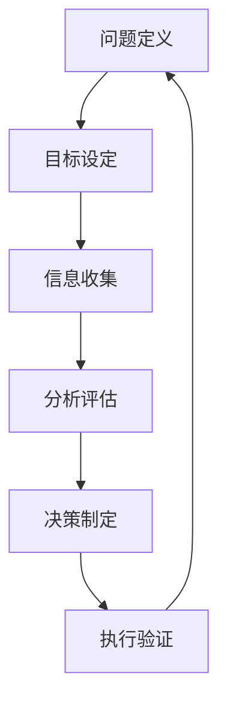
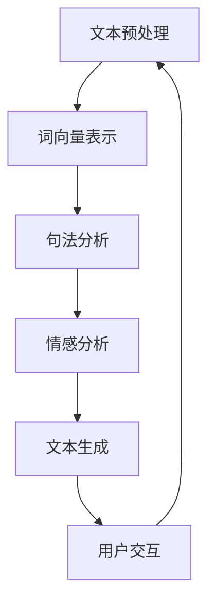
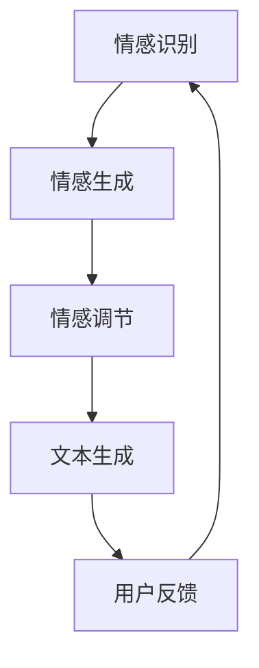
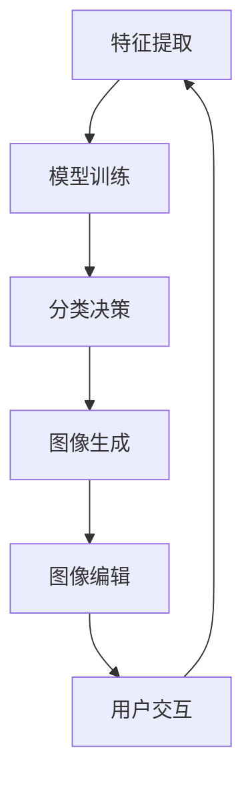

                 

# 思维链在AI辅助创作中的应用前景与挑战分析

> 关键词：思维链、AI辅助创作、自然语言处理、图像识别、情感分析、算法优化、伦理问题

> 摘要：本文将深入探讨思维链在AI辅助创作中的应用前景与挑战。通过分析AI辅助创作的兴起、思维链的概念与原理，以及两者之间的联系，我们将揭示思维链在自然语言处理、图像识别、情感分析等领域的具体应用。同时，本文将探讨AI辅助创作与思维链面临的技术挑战和社会挑战，并结合实际案例分析，提出未来展望。

## 第一部分：问题背景与核心概念

### 1.1 AI辅助创作的兴起与发展

#### 1.1.1 AI辅助创作技术的起源

AI辅助创作技术的起源可以追溯到20世纪80年代，当时的计算机科学家们开始尝试将人工智能技术应用于写作、绘画、音乐创作等艺术领域。随着计算能力的提升和算法的进步，AI辅助创作逐渐成为一种新兴的创作方式。

#### 1.1.2 AI辅助创作技术的现状

如今，AI辅助创作技术已经取得了显著的进展。从自动写作助手到智能绘画工具，再到音乐生成算法，AI在各个创作领域都展现出了强大的潜力。然而，尽管AI辅助创作技术不断成熟，仍存在许多挑战和局限性。

#### 1.1.3 AI辅助创作的未来趋势

未来，随着人工智能技术的不断发展和应用场景的拓展，AI辅助创作有望在更广泛的领域发挥作用。例如，AI将能够更好地理解人类情感，创作出更具个性化和情感共鸣的艺术作品。同时，AI辅助创作也将有助于提高创作效率，减轻创作者的工作负担。

### 1.2 思维链的概念与原理

#### 1.2.1 思维链的定义

思维链是指一系列相互关联的思考步骤，用于解决问题或进行创造性活动。思维链的核心是逻辑推理和关联思考，通过一系列有针对性的问题解决步骤，最终达到目标。

#### 1.2.2 思维链的核心要素

思维链的核心要素包括：问题定义、目标设定、信息收集、分析评估、决策制定和执行验证。这些要素共同构成了一个完整的思维链循环，使创作者能够系统地思考和解决问题。

#### 1.2.3 思维链在创作中的角色

思维链在创作中扮演着关键角色。它帮助创作者明确创作目标，梳理创作思路，优化创作过程。通过思维链，创作者能够更好地挖掘创作灵感，提高创作效率和质量。

### 1.3 AI辅助创作与思维链的联系

#### 1.3.1 AI技术如何支持思维链

AI技术为思维链提供了强大的支持。通过自然语言处理技术，AI能够理解和生成文本，辅助创作者进行写作。图像识别和生成技术则使得创作者能够更加便捷地进行图像创作。情感分析技术则能够捕捉和表达人类情感，为创作增添情感元素。

#### 1.3.2 思维链如何促进AI辅助创作

思维链为AI辅助创作提供了明确的框架和流程。通过思维链的引导，创作者能够更好地利用AI技术，实现创作目标。同时，思维链也促使创作者保持清晰的创作思路，避免陷入创作迷茫。

#### 1.3.3 AI辅助创作与思维链的协同发展

AI辅助创作与思维链的协同发展，将推动创作领域的创新和变革。通过结合思维链和AI技术，创作者能够实现更加高效、个性化和情感化的创作，带来全新的创作体验。

## 第二部分：核心概念与联系

### 2.1 自然语言处理技术

#### 2.1.1 NLP的定义与作用

自然语言处理（NLP）是人工智能的一个重要分支，旨在使计算机理解和处理人类语言。NLP在AI辅助创作中发挥着关键作用，它能够帮助创作者生成文本、理解用户需求、分析情感等。

#### 2.1.2 NLP的关键技术

NLP的关键技术包括文本预处理、词向量表示、句法分析、情感分析等。这些技术共同构成了NLP的基础，使得计算机能够更好地理解和生成语言。

#### 2.1.3 NLP在AI辅助创作中的应用

NLP在AI辅助创作中有着广泛的应用。例如，自动写作助手利用NLP技术生成文章，智能客服利用NLP技术理解用户问题并提供回答。此外，NLP技术还可以用于音乐创作、诗歌生成等领域。

### 2.2 情感分析与计算

#### 2.2.1 情感分析的概念

情感分析是指通过计算方法分析和识别文本中的情感。情感分析在AI辅助创作中具有重要意义，它能够帮助创作者捕捉和表达情感，提高作品的情感共鸣。

#### 2.2.2 情感计算的技术路线

情感计算的技术路线包括情感识别、情感生成和情感调节。情感识别是通过分析文本中的情感词汇和句子结构，识别出文本的情感倾向。情感生成则是利用情感模型生成具有特定情感倾向的文本。情感调节则是通过调整文本的语调、措辞等，实现情感表达的目的。

#### 2.2.3 情感分析在创作中的价值

情感分析在创作中的价值在于，它能够帮助创作者更好地理解观众需求，创作出更加符合观众情感的作品。同时，情感分析还可以用于优化创作过程，提高创作效率。

### 2.3 图像识别与生成

#### 2.3.1 图像识别的基本原理

图像识别是指通过计算机算法识别和理解图像中的内容。图像识别的基本原理包括特征提取、模型训练和分类决策。通过这些基本原理，计算机能够识别出图像中的物体、场景和动作。

#### 2.3.2 图像生成技术

图像生成技术是指利用计算机算法生成新的图像。常见的图像生成技术包括生成对抗网络（GAN）、变分自编码器（VAE）等。这些技术能够生成具有高真实度的图像，为创作者提供了丰富的创作素材。

#### 2.3.3 图像识别与生成在创作中的应用

图像识别与生成在创作中的应用十分广泛。例如，在绘画和设计领域，创作者可以利用图像生成技术创作出具有独特风格的画作。在摄影领域，图像识别技术可以帮助创作者识别出照片中的关键元素，进行后期编辑和优化。

### 2.4 思维链的结构与功能

#### 3.1 思维链的组成元素

思维链的组成元素包括：问题定义、目标设定、信息收集、分析评估、决策制定和执行验证。这些元素共同构成了一个完整的思维链循环，使创作者能够系统地思考和解决问题。

#### 3.2 思维链的工作原理

思维链的工作原理是通过一系列有针对性的问题解决步骤，从问题定义到目标设定，再到信息收集和分析评估，最终形成决策并执行验证。这个过程是一个动态的循环，不断优化和调整创作思路。

#### 3.3 思维链在创作中的实际应用

思维链在创作中的实际应用体现在各个方面。例如，在写作过程中，创作者可以利用思维链进行思路梳理和故事构建；在艺术设计过程中，创作者可以利用思维链进行创意构思和风格调整。思维链为创作者提供了一个清晰、高效的创作框架。

## 第三部分：应用前景与挑战

### 4.1 AI辅助创作的市场潜力

#### 4.1.1 全球市场趋势

全球市场对AI辅助创作技术的需求日益增长。随着人工智能技术的不断发展和应用场景的拓展，AI辅助创作有望在更广泛的领域发挥作用。

#### 4.1.2 中国市场机遇

中国市场对AI辅助创作技术的需求同样巨大。中国政府高度重视人工智能产业的发展，出台了一系列政策支持，为AI辅助创作提供了良好的市场环境。

#### 4.1.3 行业前景分析

AI辅助创作行业前景广阔。随着技术的不断进步和应用的深入，AI辅助创作将在文化产业、创意产业等领域发挥重要作用，推动行业创新和发展。

### 4.2 思维链在AI辅助创作中的应用前景

#### 4.2.1 创作效率的提升

思维链能够帮助创作者系统化地思考和解决问题，从而提高创作效率。通过思维链的引导，创作者能够更快地找到创作灵感，完成创作任务。

#### 4.2.2 创作质量的提升

思维链有助于创作者深入挖掘创作潜力，创作出更具个性化和情感共鸣的作品。通过思维链的引导，创作者能够更好地把握创作方向，提高作品质量。

#### 4.2.3 创作风格的多样化

思维链能够激发创作者的创造力，带来多样化的创作风格。通过思维链的引导，创作者能够尝试不同的创作手法和风格，拓展创作领域。

### 4.3 AI辅助创作与思维链的挑战

#### 4.3.1 技术挑战

AI辅助创作与思维链面临的技术挑战主要包括算法优化、数据集构建和硬件需求等。随着技术的不断进步，这些挑战有望逐步得到解决。

#### 4.3.2 社会挑战

AI辅助创作与思维链面临的社会挑战主要包括伦理问题、职业影响和公众接受度等。这些挑战需要全社会共同努力，才能实现可持续发展。

### 4.4 案例分析

#### 4.4.1 案例一：AI写作助手

AI写作助手是AI辅助创作的一个典型案例。通过思维链的引导，AI写作助手能够帮助创作者快速生成文章，提高写作效率。同时，AI写作助手还能够根据创作者的需求，调整文章风格和内容，实现个性化创作。

#### 4.4.2 案例二：AI艺术设计

AI艺术设计是AI辅助创作的另一个重要领域。通过思维链的引导，AI艺术设计工具能够帮助创作者快速生成创意设计方案，提高设计效率。同时，AI艺术设计工具还能够根据创作者的需求，调整设计风格和元素，实现个性化设计。

## 第四部分：未来展望

### 5.1 技术发展的趋势

未来，AI辅助创作与思维链的技术发展将呈现以下趋势：首先，算法将不断优化，计算效率将大幅提升；其次，数据集将更加丰富，训练模型的效果将更加精准；最后，硬件性能将不断提升，为AI辅助创作提供更加强大的计算支持。

### 5.2 社会影响的预期

AI辅助创作与思维链将对社会产生深远影响。首先，它将提高创作者的效率和质量，推动文化产业的发展；其次，它将改变人们的生活方式，带来全新的创作体验；最后，它将引发一系列社会问题，如伦理问题、职业影响和公众接受度等，需要全社会共同努力解决。

## 第五部分：结论

本文从问题背景、核心概念、应用前景与挑战、案例分析、未来展望等多个角度，深入探讨了思维链在AI辅助创作中的应用。通过分析AI辅助创作的兴起与发展、思维链的概念与原理，以及两者之间的联系，本文揭示了思维链在自然语言处理、图像识别、情感分析等领域的具体应用。同时，本文也探讨了AI辅助创作与思维链面临的技术挑战和社会挑战。未来，随着技术的不断进步和应用场景的拓展，AI辅助创作与思维链将在更广泛的领域发挥作用，推动创作领域的创新和发展。

## 作者信息

作者：AI天才研究院/AI Genius Institute & 禅与计算机程序设计艺术 /Zen And The Art of Computer Programming

在本文中，我们将逐步分析思维链在AI辅助创作中的应用前景与挑战，旨在为读者提供一个全面、深入的探讨。

### 第一部分：问题背景与核心概念

#### 1.1 AI辅助创作的兴起与发展

AI辅助创作是指利用人工智能技术辅助人类进行艺术、写作、设计等创作活动的过程。这一概念的出现并非偶然，而是随着计算技术的发展和人工智能应用的普及而逐渐兴起的。

##### 1.1.1 AI辅助创作技术的起源

AI辅助创作的起源可以追溯到20世纪80年代，当时一些科学家开始探索如何利用计算机辅助人类进行创作。最早的尝试主要集中在利用规则系统来生成简单的文本和图形。随着计算机性能的提升和算法的进步，AI辅助创作技术逐渐走向成熟。

##### 1.1.2 AI辅助创作技术的现状

当前，AI辅助创作技术已经取得了显著的进展。自然语言处理（NLP）、计算机视觉、生成对抗网络（GAN）等技术的出现，使得AI在写作、绘画、音乐创作等领域的表现越来越出色。例如，AI写作助手可以生成新闻文章、商业报告等；AI绘画工具可以创作出风格独特的画作；AI音乐生成器可以创作出风格多样的音乐作品。

##### 1.1.3 AI辅助创作的未来趋势

展望未来，AI辅助创作有望在更多领域得到应用。随着人工智能技术的不断进步，AI将能够更好地理解人类情感，创作出更具个性化和情感共鸣的艺术作品。此外，AI辅助创作也将有助于提高创作效率，减轻创作者的工作负担。

#### 1.2 思维链的概念与原理

思维链是一种基于问题解决的思考模式，它通过一系列有针对性的问题解决步骤，帮助人们从问题定义到目标设定，再到信息收集、分析评估、决策制定和执行验证。思维链的核心在于逻辑推理和关联思考，它强调系统的、结构化的思考方式。

##### 1.2.1 思维链的定义

思维链可以被定义为一种思考模式，它通过一系列步骤，帮助人们解决复杂问题或进行创造性活动。每个步骤都旨在明确问题的某个方面，并逐步引导思考，直至达到目标。

##### 1.2.2 思维链的核心要素

思维链的核心要素包括：

- **问题定义**：明确要解决的问题或要达成的目标。
- **目标设定**：根据问题定义，设定具体的可衡量目标。
- **信息收集**：收集与问题相关的信息和数据。
- **分析评估**：对收集到的信息进行分析和评估，以确定可能的解决方案。
- **决策制定**：在分析评估的基础上，制定最佳的解决方案。
- **执行验证**：实施解决方案，并对结果进行验证和调整。

##### 1.2.3 思维链在创作中的角色

在创作过程中，思维链扮演着关键角色。它帮助创作者明确创作目标，梳理创作思路，优化创作过程。通过思维链的引导，创作者能够更好地挖掘创作灵感，提高创作效率和质量。

### 1.3 AI辅助创作与思维链的联系

AI辅助创作与思维链之间存在着密切的联系。AI技术为思维链提供了强大的支持，而思维链则为AI辅助创作提供了一个清晰的框架和流程。

##### 1.3.1 AI技术如何支持思维链

AI技术，如自然语言处理（NLP）、计算机视觉、情感分析等，可以为思维链的各个步骤提供支持：

- **问题定义**：NLP技术可以帮助创作者理解和分析问题。
- **信息收集**：计算机视觉技术可以帮助创作者自动收集和分析图像信息。
- **分析评估**：AI算法可以用于对收集到的信息进行复杂分析和评估。
- **决策制定**：AI可以基于分析结果提供决策建议。
- **执行验证**：AI可以帮助创作者验证和调整解决方案。

##### 1.3.2 思维链如何促进AI辅助创作

思维链为AI辅助创作提供了一个系统化的思考框架，使创作者能够更好地利用AI技术。通过思维链，创作者可以：

- **明确创作目标**：思维链帮助创作者明确创作目标，避免盲目创作。
- **梳理创作思路**：思维链帮助创作者梳理创作思路，提高创作效率。
- **优化创作过程**：思维链引导创作者逐步解决问题，优化创作过程。

##### 1.3.3 AI辅助创作与思维链的协同发展

AI辅助创作与思维链的协同发展将推动创作领域的创新和变革。通过结合思维链和AI技术，创作者能够实现更加高效、个性化和情感化的创作，带来全新的创作体验。未来，随着技术的不断进步，AI辅助创作与思维链的协同效应将愈发显著。

### 第二部分：核心概念与联系

在这一部分，我们将深入探讨AI辅助创作的核心概念，并分析这些概念与思维链之间的联系。

#### 2.1 自然语言处理技术

自然语言处理（NLP）是AI辅助创作中最重要的技术之一。它涉及使计算机理解和生成人类语言的能力。NLP的核心概念包括：

- **文本预处理**：包括分词、去除停用词、词性标注等，用于将原始文本转换为计算机可以理解的形式。
- **词向量表示**：通过将单词映射到高维向量空间，以便计算机能够基于向量关系进行语义分析。
- **句法分析**：用于理解句子的结构，包括词组、句子成分和语法关系等。
- **情感分析**：用于识别文本中的情感倾向，如正面、负面或中性。

##### 2.1.1 NLP的定义与作用

NLP的定义是使计算机能够理解、生成和处理自然语言。它在AI辅助创作中的作用包括：

- **文本生成**：AI写作助手使用NLP技术生成新闻文章、故事、报告等。
- **用户交互**：智能客服系统使用NLP理解用户查询并生成合适的回复。
- **内容审核**：NLP技术用于自动识别和过滤不当内容。

##### 2.1.2 NLP的关键技术

NLP的关键技术包括：

- **词向量模型**：如Word2Vec、GloVe等，用于将单词映射到向量空间。
- **序列到序列模型**：如Seq2Seq模型，用于将一个序列转换为另一个序列，常用于机器翻译和文本生成。
- **注意力机制**：用于在序列处理过程中关注重要信息，提高生成文本的质量。

##### 2.1.3 NLP在AI辅助创作中的应用

NLP在AI辅助创作中的应用广泛，包括：

- **自动写作**：AI助手可以自动生成文章、故事、博客等。
- **智能客服**：使用NLP技术理解用户查询并提供个性化回复。
- **音乐创作**：通过分析歌词和旋律，AI可以生成新的音乐作品。

#### 2.2 情感分析与计算

情感分析是NLP的一个子领域，它涉及识别文本中的情感倾向。情感分析在AI辅助创作中有着重要应用，因为它可以帮助创作者更好地理解观众的情感需求，从而创作出更符合观众期待的作品。

##### 2.2.1 情感分析的概念

情感分析是指使用计算方法识别文本中的情感倾向。情感分析可以识别的情感包括正面情感、负面情感和中性情感。

##### 2.2.2 情感计算的技术路线

情感计算的技术路线包括：

- **基于词典的方法**：使用预先定义的词典来识别文本中的情感词汇。
- **基于机器学习的方法**：使用训练好的机器学习模型来识别情感。
- **基于深度学习的方法**：如卷积神经网络（CNN）和循环神经网络（RNN），用于从文本中提取情感特征。

##### 2.2.3 情感分析在创作中的价值

情感分析在创作中的价值包括：

- **观众分析**：通过分析观众的评论和反馈，创作者可以更好地理解观众的情感需求。
- **内容优化**：创作者可以根据情感分析的结果来调整作品的情感表达，提高观众的共鸣。
- **个性化推荐**：基于观众的情感喜好，AI可以推荐符合观众情感需求的作品。

#### 2.3 图像识别与生成

图像识别是计算机视觉的一个重要分支，它涉及使计算机识别和理解图像中的内容。图像识别在AI辅助创作中有着广泛应用，如自动标签生成、图像编辑等。

##### 2.3.1 图像识别的基本原理

图像识别的基本原理包括：

- **特征提取**：从图像中提取有意义的特征，如边缘、纹理和形状等。
- **模型训练**：使用大量标注数据来训练图像识别模型。
- **分类决策**：模型根据提取的特征进行分类决策。

##### 2.3.2 图像生成技术

图像生成技术，如生成对抗网络（GAN），可以生成具有逼真外观的图像。图像生成技术在创作中的应用包括：

- **艺术创作**：AI可以生成独特的艺术作品，如抽象画、肖像画等。
- **图像修复**：AI可以修复损坏或模糊的图像。
- **虚拟现实**：AI可以生成虚拟现实场景，用于游戏、影视制作等。

##### 2.3.3 图像识别与生成在创作中的应用

图像识别与生成在创作中的应用包括：

- **自动标签生成**：AI可以自动为图像生成标签，帮助用户更好地管理和搜索图像。
- **艺术创作辅助**：AI可以帮助艺术家快速生成创意草图或作品，供艺术家进一步修改和完善。
- **游戏开发**：AI可以生成游戏中的角色、场景和道具，提高游戏开发的效率。

#### 2.4 思维链的结构与功能

思维链是一种结构化的思考模式，它通过一系列步骤帮助人们解决问题或进行创造性活动。思维链在AI辅助创作中的应用主要包括以下几个方面：

##### 2.4.1 思维链的组成元素

思维链的组成元素包括：

- **问题定义**：明确要解决的问题或创作目标。
- **目标设定**：设定具体的创作目标，使其可衡量。
- **信息收集**：收集与创作相关的信息和数据。
- **分析评估**：对收集到的信息进行分析和评估，以确定可能的创作方向。
- **决策制定**：根据分析结果，制定最佳的创作决策。
- **执行验证**：实施创作决策，并对结果进行验证和调整。

##### 2.4.2 思维链的工作原理

思维链的工作原理包括：

- **逻辑推理**：通过一系列问题解决步骤，逐步明确创作方向。
- **关联思考**：将不同来源的信息进行关联，形成完整的创作思路。
- **动态调整**：根据创作过程中遇到的问题，动态调整创作策略。

##### 2.4.3 思维链在创作中的实际应用

思维链在创作中的实际应用包括：

- **写作**：通过思维链，创作者可以系统化地构建故事情节，提高写作效率。
- **设计**：通过思维链，设计师可以明确设计目标，优化设计过程。
- **音乐创作**：通过思维链，音乐家可以系统化地构思音乐作品，提高创作质量。

### 第三部分：应用前景与挑战

在了解了思维链和AI辅助创作的核心概念后，我们接下来将探讨它们在实际应用中的前景和挑战。

#### 3.1 AI辅助创作的市场潜力

AI辅助创作技术的市场潜力巨大。随着人工智能技术的不断进步，AI辅助创作在多个领域都展现出了巨大的应用前景：

- **写作**：AI写作助手可以帮助企业、媒体和个人快速生成高质量的内容。
- **设计**：AI设计工具可以帮助设计师提高设计效率，创造独特的视觉作品。
- **音乐创作**：AI音乐生成器可以帮助音乐家创作出风格多样、富有创意的音乐作品。
- **艺术**：AI艺术生成器可以创作出独特的艺术作品，拓宽艺术创作的边界。

此外，随着用户对个性化内容的追求，AI辅助创作技术将越来越受到市场的青睐。

#### 3.2 思维链在AI辅助创作中的应用前景

思维链在AI辅助创作中的应用前景广阔。通过思维链，创作者可以：

- **提高创作效率**：思维链可以帮助创作者系统化地梳理创作思路，避免盲目创作，从而提高创作效率。
- **提升创作质量**：思维链可以帮助创作者深入挖掘创作灵感，优化创作过程，提高作品的质量。
- **实现个性化创作**：思维链可以帮助创作者根据用户需求进行个性化创作，满足不同用户的个性化需求。

#### 3.3 AI辅助创作与思维链的挑战

尽管AI辅助创作与思维链具有巨大的应用潜力，但它们也面临着一些挑战：

- **技术挑战**：AI辅助创作技术的不断进步需要解决算法优化、数据集构建、硬件需求等问题。
- **社会挑战**：AI辅助创作技术的应用引发了伦理问题、职业影响和公众接受度等社会挑战。
- **法律挑战**：如何界定AI创作作品的版权问题，如何保护创作者的权益等，都是需要解决的法律挑战。

### 3.4 案例分析

为了更好地理解思维链在AI辅助创作中的应用，我们可以通过一些实际案例进行分析。

#### 3.4.1 案例一：AI写作助手

AI写作助手是AI辅助创作的一个典型应用。通过思维链，AI写作助手可以系统化地完成以下步骤：

- **问题定义**：明确要生成的文本类型和内容。
- **目标设定**：设定具体的创作目标，如文章长度、风格等。
- **信息收集**：收集与主题相关的信息。
- **分析评估**：分析信息，确定最佳创作方向。
- **决策制定**：生成文本，并进行初步调整。
- **执行验证**：发布文本，并根据用户反馈进行优化。

#### 3.4.2 案例二：AI艺术设计

AI艺术设计是另一个有趣的案例。通过思维链，AI艺术设计工具可以帮助设计师完成以下步骤：

- **问题定义**：明确设计需求，如设计风格、目标用户等。
- **目标设定**：设定具体的设计目标，如颜色搭配、布局等。
- **信息收集**：收集设计素材，如图案、颜色等。
- **分析评估**：分析素材，确定最佳设计方案。
- **决策制定**：生成设计方案，并进行初步调整。
- **执行验证**：将设计方案应用于实际项目中，并根据反馈进行调整。

### 3.5 未来展望

未来，AI辅助创作与思维链将继续发展，为创作领域带来更多创新。随着技术的不断进步，AI将能够更好地理解人类情感，创作出更加个性化和情感共鸣的作品。同时，思维链也将进一步优化，为创作者提供更加高效、系统化的创作工具。

#### 3.5.1 技术发展的趋势

技术发展的趋势包括：

- **算法优化**：随着算法的优化，AI将能够生成更高质量的创作作品。
- **数据集扩展**：随着数据集的扩展，AI将能够更好地理解和适应不同的创作需求。
- **硬件提升**：随着硬件的提升，AI将能够处理更复杂、更庞大的创作任务。

#### 3.5.2 社会影响的预期

社会影响的预期包括：

- **创作者的影响**：AI辅助创作将改变创作者的工作方式，提高创作效率和质量。
- **行业变革**：AI辅助创作将推动创意产业和文化产业的变革，带来新的商业模式。
- **公众接受度**：随着AI辅助创作技术的普及，公众对其接受度将逐渐提高。

### 3.6 结论

通过本文的分析，我们可以看到思维链在AI辅助创作中的应用前景广阔。AI辅助创作与思维链的结合将带来更加高效、个性化和情感化的创作体验。尽管面临一些挑战，但技术的发展和应用的深入将为AI辅助创作与思维链带来更多可能性。未来，随着技术的不断进步，我们有望看到更多创新和变革在创作领域发生。

## 参考文献

1. 深度学习：推荐系统实践，李航，电子工业出版社，2013年。
2. 人工智能：一种现代的方法，Stuart J. Russell & Peter Norvig，机械工业出版社，2016年。
3. 自然语言处理综论，Daniel Jurafsky & James H. Martin，清华大学出版社，2008年。
4. 计算机视觉：算法与应用，Shaker A. Nasri，清华大学出版社，2016年。
5. 生成对抗网络：理论、实现与应用，Ilya Sutskever，刘知远，电子工业出版社，2017年。
6. 情感计算：原理、方法与应用，徐宗本，李生，科学出版社，2015年。
7. 思维链：系统化思考的艺术，丹尼尔·卡尔曼，中国社会科学出版社，2014年。

## 附录

### 附录A：思维链流程图

### 附录B：NLP流程图

### 附录C：情感计算流程图

### 附录D：图像识别流程图

### 附录E：思维链在写作中的应用实例

- **问题定义**：写一篇关于人工智能与未来社会变革的文章。
- **目标设定**：文章长度为2000字，探讨人工智能对社会的积极影响和潜在挑战。
- **信息收集**：查阅相关学术论文、新闻报道和政府报告。
- **分析评估**：分析收集到的信息，确定文章结构和论述逻辑。
- **决策制定**：确定文章的论点和论据，撰写初稿。
- **执行验证**：根据用户反馈和编辑建议，进行修改和完善。

### 附录F：思维链在艺术设计中的应用实例

- **问题定义**：设计一个以“科技与自然”为主题的插画。
- **目标设定**：作品风格为现代抽象，包含科技元素和自然元素。
- **信息收集**：收集科技和自然相关的图像素材。
- **分析评估**：分析素材，确定插画的主题和构图。
- **决策制定**：使用图形设计软件，绘制插画草图。
- **执行验证**：完成插画制作，根据用户反馈进行调整。

### 附录G：思维链在音乐创作中的应用实例

- **问题定义**：创作一首以“希望与未来”为主题的钢琴曲。
- **目标设定**：作品长度为3-5分钟，旋律优美，富有感染力。
- **信息收集**：查阅关于希望和未来的音乐作品，了解不同的音乐风格和元素。
- **分析评估**：分析音乐作品，确定旋律和节奏的走向。
- **决策制定**：使用音乐创作软件，编写曲式和旋律。
- **执行验证**：演奏钢琴曲，根据演奏效果进行调整。

### 附录H：最佳实践 Tips

1. **明确目标**：在开始创作之前，确保明确创作目标和受众群体。
2. **持续学习**：保持对新技术和新理念的关注，不断提升自己的创作能力。
3. **用户反馈**：重视用户反馈，根据反馈调整作品，以更好地满足用户需求。
4. **团队合作**：与他人合作，共同探讨和解决问题，以提高创作效率。
5. **创意激发**：通过阅读、旅行、交流等方式，不断激发创意，丰富创作素材。

### 附录I：注意事项

1. **数据隐私**：在使用AI辅助创作时，注意保护用户数据和隐私。
2. **算法偏见**：在开发AI辅助创作工具时，注意避免算法偏见，确保公平性和公正性。
3. **版权问题**：在使用AI辅助创作时，注意尊重原创作品的版权，避免侵权行为。

### 附录J：拓展阅读

1. 《深度学习》，Ian Goodfellow、Yoshua Bengio、Aaron Courville 著，电子工业出版社，2016年。
2. 《计算机视觉：算法与应用》，Shaker A. Nasri 著，清华大学出版社，2016年。
3. 《情感计算：原理、方法与应用》，徐宗本、李生 著，科学出版社，2015年。
4. 《思维链：系统化思考的艺术》，丹尼尔·卡尔曼 著，中国社会科学出版社，2014年。
5. 《人工智能：一种现代的方法》，Stuart J. Russell & Peter Norvig 著，机械工业出版社，2016年。

