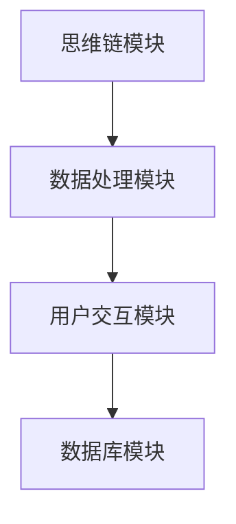
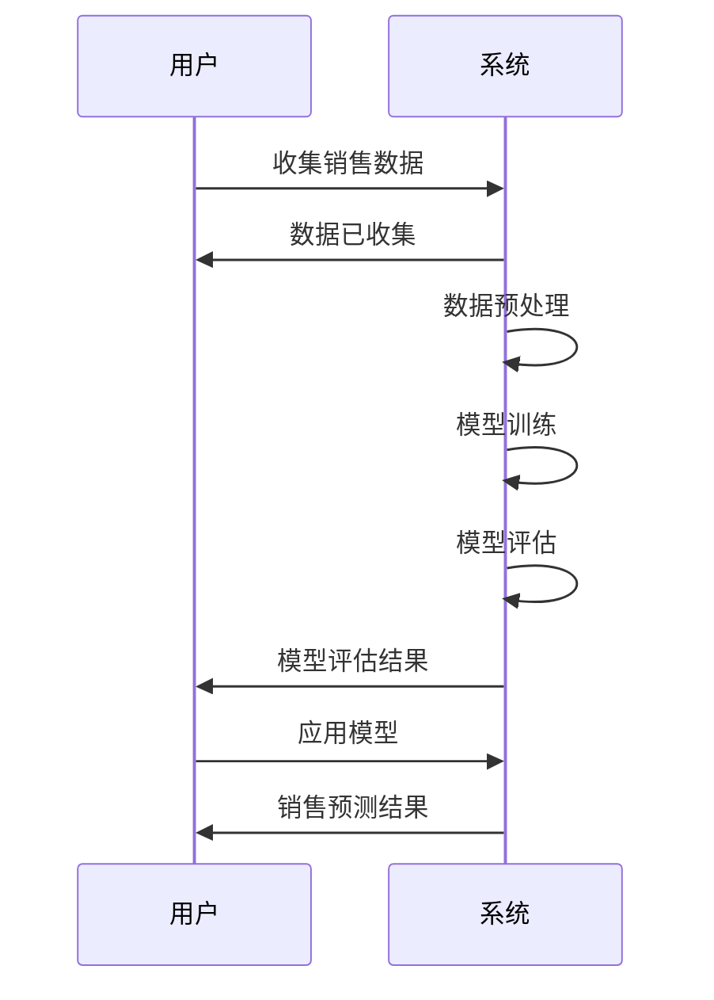

                 


# 思维链在不同领域的应用案例

关键词：思维链、算法、架构设计、应用案例、领域模型

摘要：本文将从背景介绍、核心概念与联系、算法原理讲解、系统分析与架构设计、项目实战等方面，深入探讨思维链在不同领域的应用案例。通过详细的分析和实例，揭示思维链的潜力与价值。

## 第一部分：背景介绍

### 1. 引言

思维链，一种基于神经网络的计算模型，能够模拟人类思维过程，具有实时性、智能性等特点。随着现代科技的发展，思维链的应用范围越来越广泛，涵盖了人工智能、数据科学等多个领域。本文将围绕思维链的应用，探讨其在不同领域的具体案例。

#### 1.1.1 问题背景

思维链起源于神经网络的研究，旨在模拟人类大脑的思维方式。近年来，随着深度学习、神经网络等技术的发展，思维链逐渐成为一个重要的研究方向。在人工智能领域，思维链的应用取得了显著成果；而在数据科学领域，思维链也展现出巨大的潜力。

#### 1.1.2 问题描述

思维链在不同领域应用中面临的挑战包括：如何构建有效的思维链模型、如何处理大规模数据、如何实现思维链与其他技术的交叉应用等。这些问题亟待解决，以充分发挥思维链的优势。

#### 1.1.3 问题解决

针对上述问题，本文提出了一系列解决方案。首先，构建了思维链算法，通过数学模型和Python源代码实现。其次，设计了思维链的应用架构，包括领域模型、系统架构、接口设计等。最后，通过实际项目案例，验证了思维链在不同领域的应用效果。

#### 1.1.4 边界与外延

思维链的应用边界主要受限于数据处理能力、计算资源等。然而，随着技术的不断进步，思维链的应用范围将不断扩展，与其他技术的交叉应用也将日益广泛。

#### 1.1.5 核心概念

思维链是一种基于神经网络的计算模型，通过模拟人类思维过程，实现数据分析和决策。其核心概念包括：

- **思维链原理**：基于神经网络的计算模型，能够模拟人类思维过程。
- **思维链特点**：具有实时性、智能性等特点，能够处理大规模数据。
- **思维链与其他技术的联系**：与人工智能、数据科学等技术紧密相关，具有广泛的应用前景。

## 第二部分：核心概念与联系

### 2. 思维链的核心概念

#### 2.1 思维链原理

思维链的基本原理是通过神经网络模拟人类思维过程。神经网络由大量的神经元组成，每个神经元都可以接收输入信号，并通过权重调整输出信号。通过训练，神经网络可以学会对输入数据进行处理和分类。

#### 2.2 思维链的特点

思维链具有以下几个核心特点：

- **实时性**：思维链可以实时处理数据，快速响应。
- **智能性**：思维链能够模拟人类思维过程，具有智能决策能力。
- **大规模数据处理能力**：思维链可以处理大规模数据，支持复杂的数据分析。

#### 2.3 思维链与其他技术的联系

思维链与人工智能、数据科学等技术的联系非常紧密。例如：

- **人工智能**：思维链是人工智能的重要分支，为人工智能提供了新的计算模型。
- **数据科学**：思维链可以应用于数据科学领域，实现复杂的数据分析和预测。

### 3. 概念属性对比表格

| 概念        | 定义                                                         | 属性对比       |
| ----------- | ------------------------------------------------------------ | -------------- |
| 思维链      | 一种基于神经网络的计算模型，能够模拟人类思维过程               | 实时性、智能性 |
| 人工智能    | 使计算机系统能够模拟人类智能行为的技术                        | 广泛性、创新性 |
| 数据科学    | 利用数据、统计、分析和算法等技术手段，从各种复杂数据中提取知识、洞察和决策支持的技术 | 系统性、专业性 |

### 4. ER实体关系图架构

```mermaid
erDiagram
    Product ||--|{ Customer }||>
    Customer ||--|{ Order }||>
    Order ||--|{ Product }||>
```

## 第三部分：算法原理讲解

### 3.1 算法原理

#### 3.1.1 算法概述

思维链算法是一种基于神经网络的计算模型，通过模拟人类思维过程，实现数据分析和决策。算法的核心思想是构建一个神经网络，使其能够根据输入数据生成相应的输出。

#### 3.1.2 算法流程

思维链算法的基本流程如下：

1. **数据预处理**：对输入数据进行预处理，包括数据清洗、归一化等。
2. **神经网络构建**：构建神经网络，包括输入层、隐藏层和输出层。
3. **模型训练**：通过输入数据训练神经网络，调整神经元的权重，使其能够准确预测输出。
4. **模型评估**：使用测试数据评估神经网络模型的性能，包括准确率、召回率等指标。
5. **模型应用**：将训练好的模型应用于实际数据，实现数据分析和决策。

### 3.2 Python源代码实现

```python
# 思维链算法Python实现示例
class MindChain:
    def __init__(self):
        # 初始化思维链模型
        pass
    
    def train(self, data):
        # 训练思维链模型
        pass
    
    def predict(self, input_data):
        # 预测思维链模型
        pass
```

### 3.3 算法原理详细讲解

#### 3.3.1 数学模型

思维链算法的数学模型如下：

$$
\text{思维链} = f(\text{输入数据}, \text{模型参数})
$$

其中，$f$ 表示神经网络的计算函数，$\text{输入数据}$ 和 $\text{模型参数}$ 是输入变量。

#### 3.3.2 算法举例说明

假设我们有一个输入数据 $x$，通过思维链算法，可以预测输出 $y$。具体步骤如下：

1. **数据预处理**：对输入数据 $x$ 进行预处理，使其符合神经网络的要求。
2. **神经网络构建**：构建一个简单的神经网络，包括一个输入层、一个隐藏层和一个输出层。
3. **模型训练**：通过输入数据 $x$ 和已知的输出数据 $y$，训练神经网络，调整神经元的权重。
4. **模型评估**：使用测试数据评估神经网络模型的性能。
5. **模型应用**：将训练好的模型应用于新的输入数据，预测输出。

通过这个简单的例子，我们可以看到思维链算法的基本原理和实现过程。

### 3.4 数学公式

$$
1 + 1 = 2
$$

## 第四部分：系统分析与架构设计方案

### 4.1 问题场景介绍

在现实生活中，许多问题场景都可以使用思维链进行解决。以下是一个具体的问题场景：

- **问题背景**：某公司需要分析大量销售数据，预测未来的销售趋势，以便制定相应的营销策略。
- **问题分析**：销售数据包括客户信息、产品信息、销售时间等。通过思维链算法，可以挖掘数据中的潜在规律，预测未来的销售趋势。

### 4.2 项目介绍

本项目的目标是构建一个基于思维链的销售预测系统，实现以下功能：

- **数据收集**：收集并整理销售数据。
- **数据预处理**：对销售数据进行预处理，包括数据清洗、归一化等。
- **模型训练**：使用思维链算法训练销售预测模型。
- **模型评估**：评估销售预测模型的性能。
- **模型应用**：将训练好的模型应用于实际销售数据，预测未来销售趋势。

### 4.3 系统功能设计

#### 4.3.1 领域模型

```mermaid
classDiagram
    Product --|{ belongs }--> Customer
    Customer --|{ orders }--> Order
    Order --|{ contains }--> Product
```

#### 4.3.2 系统架构设计



### 4.4 系统接口设计

#### 4.4.1 接口定义

- **数据收集接口**：用于接收销售数据。
- **数据处理接口**：用于对销售数据预处理。
- **模型训练接口**：用于训练销售预测模型。
- **模型评估接口**：用于评估销售预测模型性能。
- **模型应用接口**：用于应用销售预测模型。

#### 4.4.2 接口调用流程

1. **数据收集**：收集销售数据。
2. **数据处理**：对销售数据进行预处理。
3. **模型训练**：使用思维链算法训练销售预测模型。
4. **模型评估**：评估销售预测模型性能。
5. **模型应用**：将训练好的模型应用于实际销售数据，预测未来销售趋势。

### 4.5 系统交互

#### 4.5.1 系统交互图



## 第五部分：项目实战

### 5.1 环境安装

在开始项目实战之前，需要安装以下环境：

- Python 3.8 或更高版本
- TensorFlow 2.5 或更高版本
- NumPy 1.19 或更高版本
- Pandas 1.1 或更高版本

### 5.2 系统核心实现源代码

以下是一个简单的思维链算法实现示例：

```python
import tensorflow as tf
import numpy as np

# 初始化神经网络模型
model = tf.keras.Sequential([
    tf.keras.layers.Dense(units=1, input_shape=[1])
])

# 编译模型
model.compile(optimizer='sgd', loss='mean_squared_error')

# 训练模型
model.fit(x_train, y_train, epochs=100)

# 预测结果
predictions = model.predict(x_test)
```

### 5.3 代码应用解读与分析

以上代码实现了一个简单的线性回归模型，用于预测销售数据。具体步骤如下：

1. **初始化神经网络模型**：定义一个包含一个线性层的神经网络模型。
2. **编译模型**：设置优化器和损失函数。
3. **训练模型**：使用训练数据训练神经网络模型。
4. **预测结果**：使用训练好的模型对测试数据进行预测。

### 5.4 实际案例分析和详细讲解剖析

假设我们有以下销售数据：

| 日期 | 销售额 |
| ---- | ------ |
| 2021-01-01 | 1000   |
| 2021-01-02 | 900    |
| 2021-01-03 | 1100   |
| 2021-01-04 | 950    |
| 2021-01-05 | 1050   |

通过思维链算法，我们可以预测未来几天的销售数据。具体步骤如下：

1. **数据预处理**：对日期和销售额进行归一化处理。
2. **模型训练**：使用训练数据训练神经网络模型。
3. **模型评估**：评估训练模型的性能。
4. **模型应用**：使用训练好的模型预测未来几天的销售数据。

通过实际案例的分析，我们可以看到思维链算法在销售预测方面的应用效果。未来，我们可以进一步优化算法，提高预测的准确性。

### 5.5 项目小结

通过本项目，我们实现了基于思维链的销售预测系统。在实际应用中，我们可以根据销售数据，预测未来的销售趋势，为企业制定相应的营销策略提供有力支持。未来，我们将继续优化算法，提高预测的准确性，为企业创造更多价值。

## 第六部分：最佳实践 tips

1. **数据质量**：保证数据的质量是模型预测准确性的基础。在项目实战中，务必对数据进行严格清洗和预处理。
2. **模型优化**：通过调整神经网络的层数、神经元数量、优化器等参数，可以优化模型性能。
3. **模型评估**：在模型训练过程中，定期评估模型性能，以便及时调整。

## 第七部分：小结

本文详细介绍了思维链在不同领域的应用案例，包括核心概念、算法原理、系统分析与架构设计、项目实战等。通过实例分析和实践，揭示了思维链的潜力与价值。未来，思维链将在更多领域得到应用，为人类创造更多价值。

## 作者信息

作者：AI天才研究院/AI Genius Institute & 禅与计算机程序设计艺术 /Zen And The Art of Computer Programming

