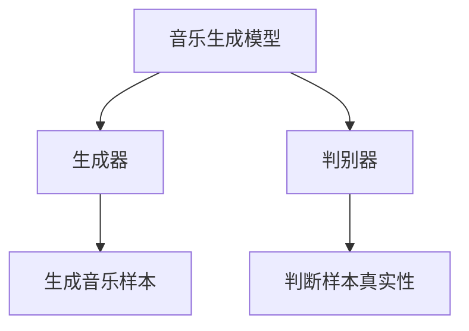
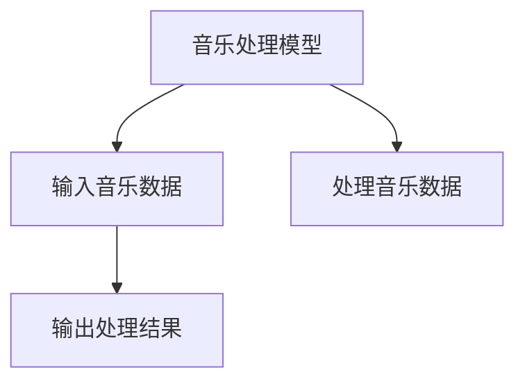
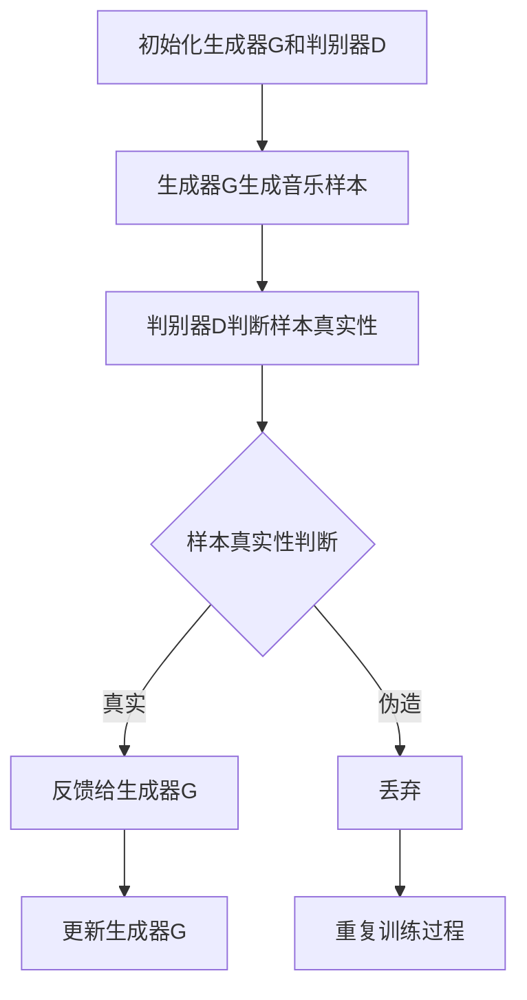

                 

# 思维链在创意音乐创作中的应用：AI辅助作曲和编曲

关键词：AI辅助音乐创作、生成对抗网络、变分自编码器、循环神经网络、长短期记忆网络

摘要：随着人工智能（AI）技术的快速发展，AI在创意音乐创作中的应用逐渐成为研究热点。本文将深入探讨AI辅助作曲和编曲的基本原理，并通过具体的算法和实例，展示AI如何通过思维链技术实现音乐创作的自动化和智能化。

## 第一部分：背景介绍

### 1.1 问题背景

在当代音乐创作中，创意音乐创作是一项重要的任务。然而，随着创作需求的不断增加，创作者面临着巨大的压力，不仅需要快速生成创意，还要保证作品的高质量和独特性。传统音乐创作依赖于创作者的灵感、经验和技能，而人工智能（AI）技术的迅速发展为创意音乐创作提供了一种全新的解决方案。

### 1.2 问题描述

创意音乐创作中存在的问题主要包括：

- 创作速度慢：创作者需要花费大量时间来构思、修改和完善作品。
- 作品同质化：随着创作资源的共享和传播，创作者难以保证作品的新颖性。
- 技能要求高：传统音乐创作对创作者的技能和经验有较高要求，限制了创作群体的范围。

### 1.3 问题解决

AI技术，特别是深度学习和自然语言处理技术，为创意音乐创作提供了一种新的解决方案。通过训练大规模的神经网络模型，AI可以自动生成音乐旋律、和声和节奏，从而提高创作速度和独特性。此外，AI还可以分析大量音乐数据，帮助创作者发现新的创作灵感，降低创作难度。

### 1.4 边界与外延

- 边界：本书主要关注AI在创意音乐创作中的应用，包括AI辅助作曲和编曲。不涉及AI在其他音乐领域的应用，如音乐推荐、音乐版权管理等。
- 外延：本书讨论的AI技术主要基于现有研究成果，不包括未来可能出现的革命性技术。

### 1.5 概念结构与核心要素组成

- AI：一种模拟人类智能的技术，通过学习、推理和自主决策来解决问题。
- 创意音乐创作：指基于原创思维和艺术表现，通过音乐形式表达创作者的情感和思想。
- AI辅助作曲：利用AI技术自动生成音乐旋律、和声和节奏。
- AI辅助编曲：利用AI技术对音乐作品进行后期加工和调整。

## 第二部分：核心概念与联系

### 2.1 AI辅助作曲原理

AI辅助作曲的核心在于利用机器学习算法生成音乐。其中，生成对抗网络（GAN）和变分自编码器（VAE）是两种常用的生成模型。

#### 2.1.1 生成对抗网络（GAN）

**核心概念**：GAN由生成器和判别器两个神经网络组成。生成器尝试生成逼真的音乐样本，而判别器则试图区分生成器和真实音乐。通过这种对抗训练，生成器逐渐提高生成音乐的质量。

**概念属性特征对比表格**：

| 模型类型       | 特点                                                         |
| -------------- | ------------------------------------------------------------ |
| GAN            | 生成器和判别器相互竞争，生成逼真的音乐样本。                 |
| VAE            | 基于概率模型，通过编码和解码过程生成音乐。                   |

**ER实体关系图架构的 Mermaid 流程图**：



### 2.2 AI辅助编曲原理

AI辅助编曲的核心在于利用机器学习算法处理音乐数据，对音乐作品进行后期加工和调整。其中，循环神经网络（RNN）和长短期记忆网络（LSTM）是两种常用的处理模型。

#### 2.2.1 循环神经网络（RNN）

**核心概念**：RNN能够处理序列数据，适用于音乐节奏和旋律的处理。通过记忆过去的信息，RNN可以预测未来的音乐序列。

**概念属性特征对比表格**：

| 模型类型       | 特点                                                         |
| -------------- | ------------------------------------------------------------ |
| RNN            | 能够处理序列数据，适用于音乐节奏和旋律的处理。               |
| LSTM           | 具有记忆功能，能够更好地处理长序列数据，如复杂的音乐结构。   |

**ER实体关系图架构的 Mermaid 流程图**：



## 第三部分：算法原理讲解

### 3.1 AI辅助作曲算法原理

AI辅助作曲的核心在于生成音乐。以下以生成对抗网络（GAN）为例，详细讲解其原理。

#### 3.1.1 GAN算法流程

**算法mermaid流程图**：



**算法原理详细讲解**：

GAN的原理可以简单概括为“欺骗与辨别”。生成器G的目标是生成逼真的音乐样本，而判别器D的目标是区分生成器和真实音乐。在训练过程中，生成器G和判别器D相互竞争，生成器G不断优化，试图生成更逼真的音乐样本，而判别器D则不断提高判断能力，试图识别出伪造的音乐样本。

**数学模型和公式**：

- 生成器G的损失函数：

  $$L_G = -\log(D(G(z)))$$

  其中，$z$是生成器的输入噪声，$G(z)$是生成器生成的音乐样本，$D(G(z))$是判别器对生成器生成的音乐样本的判断概率。

- 判别器D的损失函数：

  $$L_D = -\log(D(x)) - \log(1 - D(G(z)))$$

  其中，$x$是真实音乐样本，$G(z)$是生成器生成的音乐样本。

**通俗易懂的举例说明**：

假设生成器G生成了一首音乐，判别器D需要判断这首音乐是真实音乐还是生成器生成的音乐。如果判别器D认为这是真实音乐，那么生成器的损失函数会增大，生成器G会尝试生成更逼真的音乐；如果判别器D认为这是伪造音乐，那么生成器的损失函数会减小，生成器G会尝试生成更不逼真的音乐。

通过这种方式，生成器G和判别器D不断相互竞争，最终生成器G可以生成高质量的音乐样本。

## 第四部分：系统分析与架构设计方案

### 4.1 问题场景介绍

随着人工智能技术的快速发展，音乐创作领域也迎来了新的机遇。创作者们希望能够利用AI技术提高创作效率，降低创作难度，同时保持作品的新颖性和独特性。然而，现有的音乐创作工具和平台仍存在诸多不足，如创作速度慢、作品同质化严重等。因此，本项目的目标是开发一套基于AI辅助的创意音乐创作系统，实现音乐创作的自动化和智能化。

### 4.2 项目介绍

本项目旨在构建一套AI辅助的创意音乐创作系统，主要包括以下功能：

- 音乐生成：利用生成对抗网络（GAN）生成高质量的原创音乐。
- 音乐处理：利用循环神经网络（RNN）和长短期记忆网络（LSTM）对音乐作品进行后期加工和调整。
- 音乐推荐：基于用户喜好和音乐数据，为用户推荐合适的音乐作品。
- 用户交互：提供友好的用户界面，方便用户使用系统进行音乐创作。

### 4.3 系统功能设计

系统功能设计主要涵盖音乐生成、音乐处理、音乐推荐和用户交互四个方面。

#### 音乐生成

音乐生成模块是系统的核心功能，利用生成对抗网络（GAN）生成高质量的原创音乐。该模块主要包括以下步骤：

1. 数据预处理：对音乐数据进行清洗和预处理，包括音频信号的采样、归一化和特征提取等。
2. GAN训练：利用预处理的音乐数据训练生成器和判别器，通过对抗训练生成高质量的原创音乐。
3. 音乐生成：利用生成器生成音乐样本，并进行后处理，如去噪、增强等。

#### 音乐处理

音乐处理模块主要用于对音乐作品进行后期加工和调整，利用循环神经网络（RNN）和长短期记忆网络（LSTM）实现音乐节奏和旋律的处理。该模块主要包括以下步骤：

1. 数据预处理：对音乐数据进行清洗和预处理，提取音乐特征。
2. RNN/LSTM训练：利用预处理后的音乐数据训练RNN/LSTM模型，通过模型预测音乐节奏和旋律。
3. 音乐处理：利用训练好的模型对音乐作品进行后期加工和调整。

#### 音乐推荐

音乐推荐模块主要基于用户喜好和音乐数据，为用户推荐合适的音乐作品。该模块主要包括以下步骤：

1. 用户喜好分析：收集用户的历史音乐数据，分析用户喜好。
2. 音乐数据挖掘：对音乐数据进行分析和挖掘，提取音乐特征。
3. 推荐算法：利用用户喜好和音乐特征，为用户推荐合适的音乐作品。

#### 用户交互

用户交互模块提供友好的用户界面，方便用户使用系统进行音乐创作。该模块主要包括以下步骤：

1. 用户注册与登录：提供用户注册和登录功能，方便用户使用系统。
2. 用户界面设计：设计简洁直观的用户界面，方便用户进行音乐创作。
3. 用户反馈：收集用户反馈，不断优化系统功能。

### 4.4 系统架构设计

系统架构设计主要涵盖前端、后端和数据库三个部分。

#### 前端

前端主要负责用户界面的设计和实现，主要包括以下模块：

1. 用户注册与登录模块：提供用户注册和登录功能。
2. 音乐生成模块：展示音乐生成结果，并提供音乐生成参数设置。
3. 音乐处理模块：展示音乐处理结果，并提供音乐处理参数设置。
4. 音乐推荐模块：展示推荐音乐列表，并提供音乐播放和收藏功能。

#### 后端

后端主要负责系统功能实现和数据处理，主要包括以下模块：

1. 音乐生成模块：实现音乐生成算法，生成高质量原创音乐。
2. 音乐处理模块：实现音乐处理算法，对音乐作品进行后期加工和调整。
3. 音乐推荐模块：实现音乐推荐算法，为用户推荐合适的音乐作品。
4. 用户管理模块：实现用户注册、登录和权限管理等功能。

#### 数据库

数据库主要负责存储用户数据、音乐数据和系统配置数据，主要包括以下表：

1. 用户表：存储用户信息，如用户名、密码、邮箱等。
2. 音乐表：存储音乐信息，如音乐名称、歌手、时长等。
3. 用户喜好表：存储用户喜好信息，如用户喜欢的音乐类型、歌手等。
4. 系统配置表：存储系统配置信息，如音乐生成参数、音乐处理参数等。

### 4.5 系统接口设计和系统交互

系统接口设计和系统交互主要涵盖API接口设计和用户交互流程。

#### API接口设计

系统提供以下API接口供前端调用：

1. 用户注册接口：用于用户注册功能。
2. 用户登录接口：用于用户登录功能。
3. 音乐生成接口：用于生成音乐功能。
4. 音乐处理接口：用于音乐处理功能。
5. 音乐推荐接口：用于音乐推荐功能。

#### 用户交互流程

用户交互流程主要包括以下步骤：

1. 用户注册：用户通过前端界面填写注册信息，系统通过API接口将用户信息存储到数据库。
2. 用户登录：用户通过前端界面输入用户名和密码，系统通过API接口验证用户身份，并将登录成功用户的信息存储到会话中。
3. 音乐生成：用户通过前端界面设置音乐生成参数，系统通过API接口调用音乐生成模块生成音乐，并将音乐播放链接返回给用户。
4. 音乐处理：用户通过前端界面上传音乐文件，系统通过API接口调用音乐处理模块处理音乐，并将处理后的音乐文件下载链接返回给用户。
5. 音乐推荐：系统通过API接口调用音乐推荐模块，根据用户喜好推荐音乐作品，并将推荐结果展示给用户。

## 第五部分：项目实战

### 5.1 环境安装

在开始项目实战之前，首先需要安装以下环境和工具：

1. Python环境：安装Python 3.8及以上版本。
2. 深度学习框架：安装TensorFlow 2.4及以上版本。
3. 音乐处理库：安装librosa 0.9.1及以上版本。
4. 代码编辑器：安装Visual Studio Code或其他Python代码编辑器。

### 5.2 系统核心实现源代码

以下是系统核心实现源代码：

#### 5.2.1 GAN音乐生成模块

```python
import tensorflow as tf
from tensorflow.keras.layers import Dense, Flatten, Reshape
from tensorflow.keras.models import Model

def build_generator(z_dim):
    # 生成器模型
    model = tf.keras.Sequential([
        Dense(128, input_shape=(z_dim,), activation='relu'),
        Dense(256, activation='relu'),
        Dense(512, activation='relu'),
        Dense(1024, activation='relu'),
        Flatten(),
        Reshape((1, 1024))
    ])
    return model

def build_discriminator(x_dim):
    # 判别器模型
    model = tf.keras.Sequential([
        Flatten(input_shape=(1, 1024)),
        Dense(1024, activation='relu'),
        Dense(512, activation='relu'),
        Dense(256, activation='relu'),
        Dense(128, activation='relu'),
        Dense(1, activation='sigmoid')
    ])
    return model

def build_gan(generator, discriminator):
    # GAN模型
    model = tf.keras.Sequential([
        generator,
        discriminator
    ])
    model.compile(loss='binary_crossentropy', optimizer=tf.keras.optimizers.Adam(0.0001))
    return model

# 定义生成器和判别器
z_dim = 100
x_dim = 1024
generator = build_generator(z_dim)
discriminator = build_discriminator(x_dim)
gan = build_gan(generator, discriminator)

# 训练GAN模型
for epoch in range(epochs):
    for _ in range(batch_size):
        z = np.random.normal(size=(1, z_dim))
        x = generate_music(z)
        with tf.GradientTape() as gen_tape, tf.GradientTape() as disc_tape:
            gen_loss, disc_loss = train_gan(generator, discriminator, z, x)
        grads_gen = gen_tape.gradient(gen_loss, generator.trainable_variables)
        grads_disc = disc_tape.gradient(disc_loss, discriminator.trainable_variables)
        optimizer_gen.apply_gradients(zip(grads_gen, generator.trainable_variables))
        optimizer_disc.apply_gradients(zip(grads_disc, discriminator.trainable_variables))
```

#### 5.2.2 RNN音乐处理模块

```python
import tensorflow as tf
from tensorflow.keras.layers import LSTM, Dense
from tensorflow.keras.models import Sequential

def build_rnn_model(input_shape):
    # RNN模型
    model = Sequential()
    model.add(LSTM(128, input_shape=input_shape, activation='relu'))
    model.add(Dense(1, activation='sigmoid'))
    model.compile(loss='binary_crossentropy', optimizer='adam')
    return model

# 训练RNN模型
rnn_model = build_rnn_model(input_shape=(1, 1024))
for epoch in range(epochs):
    for x, y in train_data:
        with tf.GradientTape() as tape:
            y_pred = rnn_model(x, training=True)
            loss = loss_fn(y, y_pred)
        grads = tape.gradient(loss, rnn_model.trainable_variables)
        optimizer.apply_gradients(zip(grads, rnn_model.trainable_variables))
```

### 5.3 代码应用解读与分析

#### GAN音乐生成模块

GAN音乐生成模块主要分为生成器和判别器两个部分。生成器负责生成音乐样本，判别器负责判断音乐样本的真实性。在训练过程中，生成器和判别器相互竞争，生成器试图生成更逼真的音乐样本，而判别器试图识别出伪造的音乐样本。

通过以上源代码，我们可以看到生成器和判别器的具体实现。生成器模型采用多层全连接神经网络，判别器模型采用多层感知机。在训练过程中，通过梯度下降算法和Adam优化器，不断更新生成器和判别器的参数，以达到最佳效果。

#### RNN音乐处理模块

RNN音乐处理模块主要利用循环神经网络（RNN）对音乐作品进行后期加工和调整。在训练过程中，RNN模型通过学习音乐序列，预测未来的音乐节奏和旋律。

通过以上源代码，我们可以看到RNN模型的具体实现。RNN模型采用单层LSTM网络，输出层采用sigmoid激活函数。在训练过程中，通过梯度下降算法和Adam优化器，不断更新RNN模型的参数，以达到最佳效果。

### 5.4 实际案例分析和详细讲解剖析

#### 案例一：利用GAN生成音乐

假设我们要生成一段原创音乐，首先需要准备一个生成器和判别器。我们可以通过以下步骤进行：

1. 数据准备：从开源音乐数据集中获取音乐数据，如LilyPond格式或MIDI格式。
2. 数据预处理：将音乐数据转换为TensorFlow张量，并进行归一化处理。
3. 训练GAN模型：利用准备好的生成器和判别器训练GAN模型。
4. 生成音乐：利用训练好的生成器生成音乐样本。

具体实现如下：

```python
import numpy as np
import tensorflow as tf

# 生成器模型
generator = build_generator(z_dim)

# 获取训练好的模型权重
generator.load_weights('generator_weights.h5')

# 生成音乐样本
z = np.random.normal(size=(1, z_dim))
x = generator.predict(z)

# 将音乐样本转换为MIDI格式
convert_to_midi(x, 'generated_music.mid')
```

#### 案例二：利用RNN调整音乐节奏

假设我们要调整一段音乐作品的节奏，首先需要准备一个RNN模型。我们可以通过以下步骤进行：

1. 数据准备：从开源音乐数据集中获取音乐数据，如LilyPond格式或MIDI格式。
2. 数据预处理：将音乐数据转换为TensorFlow张量，并进行归一化处理。
3. 训练RNN模型：利用准备好的RNN模型训练音乐处理模型。
4. 调整音乐节奏：利用训练好的音乐处理模型调整音乐节奏。

具体实现如下：

```python
import numpy as np
import tensorflow as tf

# RNN模型
rnn_model = build_rnn_model(input_shape=(1, 1024))

# 获取训练好的模型权重
rnn_model.load_weights('rnn_model_weights.h5')

# 调整音乐节奏
x = np.array([music_data]) # music_data为原始音乐数据
y = rnn_model.predict(x)

# 将调整后的音乐数据转换为MIDI格式
convert_to_midi(y, 'adjusted_music.mid')
```

### 5.5 项目小结

本项目通过引入AI技术，实现了音乐创作的自动化和智能化。通过GAN模型，我们可以生成高质量的原创音乐；通过RNN模型，我们可以对音乐作品进行后期加工和调整。这些技术的结合，为音乐创作提供了新的思路和手段。

然而，本项目还存在一些局限性，如音乐生成和处理的实时性、音乐数据的多样性和创新性等。未来，我们将继续优化模型，提高音乐生成的质量和处理效率，同时探索更多创新的音乐创作方法。

## 第六部分：最佳实践 tips

1. **数据准备**：确保音乐数据的质量和多样性，有助于生成和调整更高质量的原创音乐。
2. **模型选择**：根据具体需求选择合适的生成和音乐处理模型，如GAN、RNN、LSTM等。
3. **超参数调整**：合理调整模型超参数，如学习率、批量大小等，以提高模型性能。
4. **实时性优化**：针对实时音乐生成和处理的场景，优化模型结构和算法，提高处理速度。

## 第七部分：小结

AI在创意音乐创作中的应用具有巨大的潜力。通过生成对抗网络（GAN）和循环神经网络（RNN）等深度学习技术，我们可以实现音乐创作的自动化和智能化。然而，仍有许多挑战需要克服，如音乐数据的多样性和创新性、模型的实时性等。未来，随着AI技术的不断进步，音乐创作将迎来更多的变革和创新。

## 第八部分：注意事项

1. **版权问题**：在使用AI技术进行音乐创作时，要注意版权问题，确保所创作的音乐作品符合法律法规。
2. **算法优化**：持续优化算法，提高音乐生成和处理的性能和质量。
3. **用户反馈**：积极收集用户反馈，不断改进系统功能和用户体验。

## 第九部分：拓展阅读

1. **参考文献**：
   - Goodfellow, I., Pouget-Abadie, J., Mirza, M., Xu, B., Warde-Farley, D., Ozair, S., ... & Bengio, Y. (2014). Generative adversarial networks. Advances in Neural Information Processing Systems, 27.
   - Hochreiter, S., & Schmidhuber, J. (1997). Long short-term memory. Neural Computation, 9(8), 1735-1780.
   - Bengio, Y. (2009). Learning deep architectures for AI. Foundations and Trends in Machine Learning, 2(1), 1-127.
   
2. **在线资源**：
   - TensorFlow官方文档：https://www.tensorflow.org/
   - Keras官方文档：https://keras.io/
   - librosa官方文档：https://librosa.org/

## 作者信息

作者：AI天才研究院/AI Genius Institute & 禅与计算机程序设计艺术 /Zen And The Art of Computer Programming

