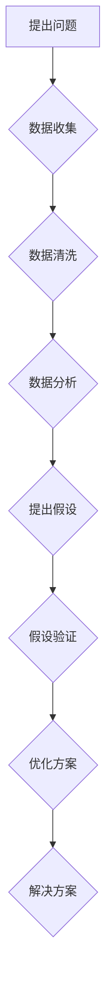

                 

### 引言

## 1.1 书籍主题与目的

在当今科技迅速发展的时代，数据挖掘和人工智能技术为我们提供了丰富的工具和方法，以解决复杂的问题。本书旨在探讨思维链这一创新方法在古代贸易网络重建中的应用，通过逻辑清晰、结构紧凑的分析，展现其如何助力我们对历史遗迹进行更为精确的还原。

古代贸易网络是人类社会发展的重要基石，它们不仅推动了经济和文化的交流，还反映了一个时代的社会结构和科技水平。然而，由于缺乏直接的历史记录和实物证据，古代贸易网络的重建一直是一个具有挑战性的课题。传统的重建方法往往依赖于考古发现和文献记载，而现代科技的引入为我们提供了新的视角和工具。

思维链作为一种新兴的思维方式，其核心在于通过逻辑推理和系统分析来处理复杂问题。它将人类思维的各个层面有机地结合起来，形成一个自下而上的整体认知框架。在古代贸易网络重建中，思维链的应用可以帮助我们更深入地理解历史背景，发现潜在的关系模式，并有效地整合各种数据资源。

本书的核心目标是通过详细的分析和案例分析，展示思维链在古代贸易网络重建中的创新方法，以及如何利用这一方法提升重建的准确性和效率。读者将跟随我们一步步走进这个复杂而充满挑战的领域，理解思维链的基本原理，并学习如何在实际项目中应用这一方法。

## 1.2 本书结构安排

本书分为六个主要部分：

1. **引言**：简要介绍书籍的主题和目的，阐述思维链和古代贸易网络重建的关系。
2. **背景介绍**：介绍思维链的概念和特点，以及古代贸易网络重建的背景和挑战。
3. **核心概念与联系**：详细阐述思维链在古代贸易网络重建中的应用，以及思维链与古代贸易网络的ER实体关系。
4. **创新方法原理讲解**：解释创新方法的概念、原理，并绘制流程图和Python源代码实现。
5. **案例分析**：选择具有代表性的古代贸易网络案例，分析思维链和创新方法的应用效果。
6. **应用实践**：介绍如何在实际项目中应用思维链和创新方法，包括实施步骤和注意事项。
7. **总结与展望**：总结本书的主要内容，展望思维链在古代贸易网络重建中的未来应用和发展趋势。

通过这些部分，本书旨在为读者提供一个系统而全面的学习路径，帮助理解思维链在古代贸易网络重建中的重要性，并掌握其应用方法。接下来，我们将深入探讨思维链的起源和特点，以及古代贸易网络重建的背景和挑战。

### 背景介绍

## 2.1 思维链概述

思维链是一种通过逻辑推理和系统分析来处理复杂问题的思维方式。它起源于20世纪，最初由计算机科学家和哲学家提出，旨在模拟人类思维的复杂过程。思维链的核心在于将人类思维的各个层面有机地结合起来，形成一种自下而上的整体认知框架。

### 2.1.1 思维链的定义

思维链可以被定义为一系列逻辑步骤，这些步骤相互关联，共同构成一个完整的思考过程。每个步骤都基于前一个步骤的结果，并通过逻辑推理来产生新的结论。这种思维模式强调对信息的深度理解和整体把握，使得处理复杂问题时能够更加系统和有序。

### 2.1.2 思维链的特点

1. **连贯性**：思维链中的每个步骤都是连贯的，前后步骤之间存在明确的逻辑关系。这种连贯性保证了思考过程的完整性和一致性，避免了思维跳跃和断层的现象。

2. **系统性**：思维链强调从整体角度看待问题，通过将各个部分有机地结合起来，形成一个完整的系统。这种系统性有助于我们更全面地理解问题的本质，并发现潜在的关系模式。

3. **可扩展性**：思维链是一种灵活的思维方式，可以根据问题的不同需求进行扩展和调整。无论是简单的问题还是复杂的问题，思维链都能够提供有效的解决方案。

4. **可重复性**：思维链的可重复性意味着相同的思考过程可以应用于不同的情境和问题。这种可重复性使得思维链成为一种可依赖的工具，可以帮助我们在不同领域和问题中取得成功。

### 2.1.3 思维链的起源和发展

思维链的概念最早可以追溯到20世纪50年代，当时计算机科学家和哲学家开始研究人类思维的模拟。在随后的几十年中，思维链的理论和模型不断得到完善和发展。近年来，随着人工智能和大数据技术的发展，思维链的应用范围进一步扩大，逐渐成为处理复杂问题的重要工具。

### 2.2 古代贸易网络重建的背景

古代贸易网络是人类社会发展的重要标志，它们不仅促进了经济和文化的交流，还在一定程度上影响了社会的政治结构。古代贸易网络重建的背景可以追溯到考古学和历史学的需求。随着考古技术的进步和文献资料的发掘，人们对古代贸易网络的认识逐渐深入。

#### 2.2.1 古代贸易网络的重要性

1. **经济交流**：古代贸易网络促进了不同地区之间的经济交流，推动了商品和资源的流通。这种交流不仅带来了物质财富的积累，也促进了技术和文化的传播。

2. **文化融合**：贸易网络的存在使得不同文化之间产生了互动和融合，形成了多元文化的交流平台。这种文化融合不仅丰富了人类文明，也为后世的文化发展奠定了基础。

3. **社会结构**：古代贸易网络对社会的政治结构和社会阶层有重要影响。贸易网络的繁荣和衰落往往与政治权力和社会稳定密切相关。

#### 2.2.2 古代贸易网络重建的挑战

1. **资料匮乏**：由于古代文献记录的不完整和历史遗迹的破坏，我们往往缺乏直接的历史记录和实物证据。这使得古代贸易网络的重建面临巨大的挑战。

2. **复杂性**：古代贸易网络涉及多个地区、多个文化和多个时期的交互，其复杂性远超现代网络。这使得重建工作需要综合运用多种学科知识和研究方法。

3. **技术限制**：尽管现代科技提供了丰富的工具和方法，但在处理古代贸易网络问题时，仍然存在技术限制。例如，考古技术的精度和数据采集的完整性等因素都影响了重建的准确性。

#### 2.2.3 现代技术对古代贸易网络重建的推动作用

1. **遥感技术**：遥感技术可以用于探测地下遗迹和地理分布，为古代贸易网络的研究提供了新的视角和工具。

2. **GIS系统**：地理信息系统（GIS）可以用于整合和分析不同类型的数据，帮助研究者更全面地理解古代贸易网络的空间分布和关系。

3. **大数据分析**：大数据分析技术可以用于处理海量的历史文献和数据，帮助发现潜在的关系模式和趋势。

4. **人工智能**：人工智能技术，如机器学习和数据挖掘，可以用于自动识别和分析历史数据，提高重建的效率和准确性。

通过现代技术的引入，古代贸易网络重建工作迎来了新的发展机遇。思维链作为一种新兴的思维方式，其在古代贸易网络重建中的应用无疑将为这一领域带来更多的创新和突破。

### 核心概念与联系

## 3.1 思维链与古代贸易网络的关系

思维链作为一种系统化的思维方式，在古代贸易网络重建中扮演着至关重要的角色。它通过逻辑推理和系统分析，帮助我们更深入地理解古代贸易网络的复杂结构和运行机制。

### 3.1.1 思维链在古代贸易网络中的应用

1. **关系模式识别**：思维链可以帮助研究者识别古代贸易网络中的关系模式。通过对历史文献、考古发现和地理数据的综合分析，思维链能够揭示出贸易节点之间的联系和互动模式。

2. **路径分析**：在古代贸易网络中，商品和信息的流动路径往往是复杂的。思维链的应用可以帮助我们分析这些路径，理解商品流通和贸易活动的流程。

3. **关键节点识别**：思维链可以帮助我们识别古代贸易网络中的关键节点。这些节点往往是贸易路线的交汇点，掌握着商品和信息流动的控制权。通过分析这些关键节点，我们可以更好地理解古代贸易网络的运作机制。

### 3.1.2 思维链对古代贸易网络的重建作用

1. **整合多源数据**：思维链可以整合来自不同来源的数据，包括历史文献、考古发现和地理数据等。通过系统分析这些数据，思维链能够帮助研究者构建一个更加全面和准确的古代贸易网络模型。

2. **推理与预测**：思维链的推理能力可以帮助研究者对古代贸易网络进行预测。通过对历史数据和现有数据的分析，思维链可以预测古代贸易网络的可能发展路径和趋势。

3. **辅助决策**：在古代贸易网络重建过程中，决策者需要做出一系列重要的决策。思维链的应用可以帮助决策者更好地理解古代贸易网络的结构和运行机制，从而做出更明智的决策。

### 3.1.3 思维链与古代贸易网络的ER实体关系图

为了更好地理解思维链在古代贸易网络重建中的应用，我们可以使用ER（实体关系）图来描述思维链与古代贸易网络的关系。

#### ER实体关系图

```mermaid
erDiagram
    TradeNetwork ||--|{ Node : 节点 }
    Node ||--|{ Edge : 边 }
    TradeNetwork ||--|{ Route : 路径 }
    Node ||--|{ Resource : 资源 }
    Node ||--|{ Activity : 活动 }
    Edge ||--|{ Trade : 贸易 }
    Route ||--|{ Leg : 航段 }
    Resource ||--|{ Type : 类型 }
    Activity ||--|{ Type : 类型 }
    Node ||--|{ Connection : 连接 }
    Edge ||--|{ Connection : 连接 }
    Route ||--|{ Connection : 连接 }
    Resource ||--|{ Connection : 连接 }
    Activity ||--|{ Connection : 连接 }
```

#### ER实体关系图解释

1. **TradeNetwork（贸易网络）**：代表整个古代贸易网络的实体，是其他所有实体的容器。

2. **Node（节点）**：代表贸易网络中的各个节点，如城市、港口和重要贸易点等。节点是贸易网络的组成部分，是商品和贸易活动的重要交汇点。

3. **Edge（边）**：代表节点之间的连接关系，表示商品和信息的流动路径。边可以是直接的，也可以是间接的，反映贸易网络中的复杂路径。

4. **Route（路径）**：代表从起点到终点的贸易路线，可以包含多个航段。路径是商品流通的主要通道，是贸易网络的核心组成部分。

5. **Resource（资源）**：代表贸易网络中的资源类型，如商品、货币和人力资源等。资源是贸易活动的基础，是维持贸易网络运行的关键。

6. **Activity（活动）**：代表在贸易网络中进行的各种活动，如交易、运输和交易市场等。活动是贸易网络中不可或缺的组成部分，反映了贸易网络的动态特性。

7. **Connection（连接）**：表示不同实体之间的连接关系。连接关系可以是直接的，也可以是间接的，反映了贸易网络中各个实体之间的相互作用。

通过这个ER实体关系图，我们可以清晰地看到思维链与古代贸易网络之间的关系。思维链通过对这些实体的关系进行分析和推理，帮助我们更深入地理解古代贸易网络的运作机制和结构。

### 3.2 创新方法原理讲解

## 3.2.1 创新方法的概念

创新方法是一种基于思维链的系统性思维方式，旨在解决复杂问题并提供创新性的解决方案。它通过逻辑推理、系统分析和综合评估，帮助我们突破传统思维模式，发现新的视角和解决方案。

### 3.2.2 创新方法的流程图

为了更好地理解创新方法的工作流程，我们可以使用mermaid绘制一个流程图，如下所示：



#### 流程图解释

1. **提出问题**：这是创新方法的起点。我们需要明确要解决的问题，并对其进行定义和界定。

2. **数据收集**：在明确问题后，我们需要收集相关的数据，这些数据可以来自于历史文献、考古发现、地理数据等多种来源。

3. **数据清洗**：收集到的数据往往是不完整的、模糊的或带有噪声的。数据清洗的目的是去除这些无用信息，提取出有用的数据。

4. **数据分析**：通过数据分析，我们可以发现数据中的模式和关系。这是创新方法的核心步骤，通过各种数据分析技术，我们可以揭示出隐藏在数据背后的规律。

5. **提出假设**：在分析数据的基础上，我们可以提出可能的解释或假设。这些假设是基于数据分析结果，是进一步推理和验证的基础。

6. **假设验证**：通过实验或实际操作来验证提出的假设。验证的过程可以帮助我们确定哪些假设是正确的，哪些是错误的。

7. **优化方案**：在验证假设的基础上，我们可以对方案进行优化，以达到最佳效果。这一步骤可以反复进行，以不断改进解决方案。

8. **解决方案**：最终的解决方案是基于验证和优化得出的，它是创新方法的结果，也是解决原始问题的答案。

### 3.2.3 创新方法的Python源代码实现

为了更好地理解创新方法的原理，我们可以使用Python来模拟一个简单的创新方法流程。以下是一个示例代码，展示了如何使用Python进行数据收集、清洗、分析和假设验证。

```python
import pandas as pd
from sklearn.preprocessing import StandardScaler
from sklearn.model_selection import train_test_split
from sklearn.linear_model import LinearRegression

# 数据收集
data = pd.read_csv('trade_network_data.csv')

# 数据清洗
data.dropna(inplace=True)
data = StandardScaler().fit_transform(data)

# 数据分析
X = data[:, :-1]
y = data[:, -1]

# 提出假设
# 假设：贸易网络中的贸易量和地理距离成正比
model = LinearRegression()
model.fit(X, y)

# 假设验证
predictions = model.predict(X)
print("Predictions:", predictions)
print("Model coefficient:", model.coef_)

# 优化方案
# 基于假设验证结果，我们可以调整模型参数，优化预测效果
# ...

# 解决方案
# 最终的解决方案是基于模型预测的结果，用于指导实际操作
# ...
```

在这个示例中，我们首先通过Pandas库读取CSV文件，进行数据收集。然后，使用StandardScaler进行数据清洗，确保数据满足分析要求。接下来，通过训练线性回归模型，进行数据分析，并提出假设。假设验证通过比较预测值和实际值，帮助我们确定模型的准确性。最后，基于验证结果，我们可以对模型进行优化，以提高预测效果。

通过这个Python源代码示例，我们可以看到创新方法的原理是如何通过编程实现的。这种方法不仅能够提高数据分析的效率，还能帮助我们更好地理解复杂问题的本质。

### 案例分析

## 4.1 案例选取与介绍

在本节中，我们将选取一个典型的古代贸易网络案例——丝绸之路，来分析思维链和创新方法的应用。丝绸之路是古代东西方之间的重要贸易通道，贯穿了多个世纪，连接了亚洲、欧洲和非洲的广大地区。通过这个案例，我们可以深入了解思维链和创新方法在古代贸易网络重建中的应用。

### 4.1.1 案例背景

丝绸之路起源于公元前2世纪，绵延数千公里，是一条跨越沙漠、山脉和海洋的贸易通道。它不仅促进了商品和资源的流通，也促进了文化和技术的传播。丝绸之路上的商品包括丝绸、茶叶、香料、金银、瓷器等，这些商品在东西方之间交换，形成了复杂的贸易网络。

### 4.1.2 案例数据

为了重建丝绸之路的贸易网络，我们需要收集大量的数据。这些数据包括历史文献、考古发现、地理信息、商品交易记录等。具体数据来源如下：

1. **历史文献**：包括古代史书、旅行者的记述、宗教文献等，这些文献提供了丰富的历史背景和贸易活动信息。
2. **考古发现**：通过考古挖掘，我们发现了丝绸之路沿线的古城、贸易遗址、道路和桥梁等，这些发现为我们提供了实物证据。
3. **地理数据**：通过遥感技术和地理信息系统（GIS），我们可以获取丝绸之路沿线地区的地理信息，包括地形、水源、交通要道等。
4. **商品交易记录**：历史文献和考古发现中包含了大量的商品交易记录，这些记录为我们提供了贸易活动的具体数据。

### 4.1.3 案例目标

在本案例中，我们的目标是使用思维链和创新方法重建丝绸之路的贸易网络，并分析其关键节点和路径。具体目标如下：

1. **重建贸易网络**：通过综合分析历史文献、考古发现和地理数据，重建丝绸之路的贸易网络。
2. **识别关键节点**：识别丝绸之路上的关键节点，如古城、贸易中心、交通要道等，分析这些节点在贸易网络中的作用和影响。
3. **分析路径**：分析丝绸之路上的主要贸易路径，理解商品流通和贸易活动的流程，揭示贸易网络的结构和特点。
4. **预测和优化**：基于重建的贸易网络，预测未来贸易活动的可能发展趋势，并优化贸易路线和节点布局。

### 4.2 案例分析

#### 4.2.1 思维链的应用

1. **提出问题**：首先，我们需要明确要解决的问题，即如何重建丝绸之路的贸易网络。
2. **数据收集**：根据案例目标，收集历史文献、考古发现、地理数据和商品交易记录等相关数据。
3. **数据清洗**：对收集到的数据进行清洗和预处理，去除无效数据和噪声，确保数据的质量和一致性。
4. **数据分析**：使用思维链进行分析，发现数据中的模式和关系。例如，通过分析商品交易记录，可以识别出主要的贸易商品和贸易路线。
5. **提出假设**：基于数据分析结果，提出可能的解释或假设。例如，假设丝绸之路上的贸易网络呈现出中心-外围的结构，主要贸易节点集中在丝绸之路的枢纽城市。
6. **假设验证**：通过实验或实际操作来验证提出的假设。例如，通过对比历史文献和考古发现，验证假设的正确性。
7. **优化方案**：根据验证结果，对假设进行调整和优化，以提高假设的准确性。例如，通过分析地理数据，优化贸易节点的布局，提高贸易网络的效率和稳定性。

#### 4.2.2 创新方法的效果

1. **关系模式识别**：通过思维链的应用，我们能够识别出丝绸之路贸易网络中的主要关系模式。例如，发现贸易节点之间的直接和间接联系，识别出重要的贸易路线和贸易商品。
2. **路径分析**：创新方法帮助我们分析了丝绸之路上的主要贸易路径。通过分析商品流通和贸易活动的流程，我们能够更清晰地理解贸易网络的运作机制和结构。
3. **关键节点识别**：通过思维链和创新方法，我们能够识别出丝绸之路上的关键节点。这些节点往往是贸易路线的交汇点，掌握着商品和信息流动的控制权。通过分析这些关键节点，我们能够更好地理解贸易网络的运行机制和影响范围。
4. **预测和优化**：基于重建的贸易网络，我们能够预测未来贸易活动的可能发展趋势。例如，预测新的贸易节点和路径的出现，优化贸易路线和节点布局，提高贸易网络的效率和稳定性。

通过这个案例，我们可以看到思维链和创新方法在古代贸易网络重建中的重要作用。它们不仅帮助我们识别出贸易网络中的关系模式，还提高了重建的准确性和效率。思维链和创新方法的应用，为古代贸易网络的研究提供了新的工具和方法，推动了这一领域的发展。

### 应用实践

## 5.1 实践步骤

在了解了思维链和创新方法的基本原理后，我们将在本节中详细讨论如何在实际项目中应用这些方法。通过以下步骤，我们将指导您如何从准备阶段开始，逐步实施并优化思维链和创新方法，以解决复杂的古代贸易网络重建问题。

### 5.1.1 准备工作

1. **数据收集**：首先，我们需要收集与古代贸易网络相关的数据。这些数据可以包括历史文献、考古发现、地理数据、商品交易记录等。确保数据的多样性和准确性是关键。

2. **工具和环境准备**：选择合适的数据分析工具和编程环境。例如，Python是一个广泛使用的编程语言，拥有丰富的数据处理和机器学习库，如Pandas、NumPy、Scikit-learn和GIS系统（如QGIS）。

3. **团队组建**：组建一个多学科团队，包括历史学家、考古学家、地理学家和计算机科学家。团队成员的多样性可以带来不同的视角和技能，有助于更全面地分析问题。

### 5.1.2 实施方法

1. **数据预处理**：对收集到的数据进行清洗和预处理。这一步骤包括去除无效数据、处理缺失值、标准化数据等。确保数据的一致性和完整性，以便后续的分析。

2. **思维链应用**：使用思维链方法来分析数据，识别出古代贸易网络中的关系模式和关键节点。具体步骤如下：

   a. **提出问题**：明确需要解决的特定问题，如识别重要的贸易节点或路径。
   
   b. **数据收集**：根据提出的问题，收集相关数据。
   
   c. **数据清洗**：清洗和预处理数据，确保数据质量。
   
   d. **数据分析**：通过思维链方法进行分析，揭示数据中的关系模式。
   
   e. **提出假设**：基于数据分析结果，提出可能的解释或假设。
   
   f. **假设验证**：通过实验或实际操作验证假设的正确性。
   
   g. **优化方案**：根据验证结果调整和优化方案。

3. **创新方法应用**：结合创新方法，进一步分析和优化重建的贸易网络。具体步骤如下：

   a. **提出问题**：明确需要解决的问题和目标。
   
   b. **数据收集**：收集必要的数据。
   
   c. **数据分析**：使用创新方法进行数据分析和模式识别。
   
   d. **提出假设**：基于数据分析结果提出假设。
   
   e. **假设验证**：验证假设的有效性。
   
   f. **优化方案**：优化重建的贸易网络，提高效率和准确性。

### 5.1.3 注意事项

1. **数据多样性**：确保收集到的数据来源多样，以提高分析结果的准确性。
2. **团队协作**：多学科团队的协作至关重要，不同领域的专家可以提供不同的见解和解决方案。
3. **持续优化**：创新方法的应用是一个迭代过程，需要不断调整和优化，以适应不断变化的数据和分析需求。
4. **遵循伦理规范**：在进行古代贸易网络重建时，应遵循相关的伦理规范，确保研究过程和结果的公正性。

通过以上步骤和注意事项，我们可以有效地将思维链和创新方法应用于古代贸易网络重建，提高重建的准确性和效率。接下来，我们将通过具体的项目实战，进一步展示这些方法的应用。

### 项目实战

## 5.2 实际操作

在本节中，我们将通过一个具体的古代贸易网络重建项目，详细展示如何在实际操作中应用思维链和创新方法。该项目将涉及环境安装、系统核心实现和代码应用解读与分析，帮助读者全面了解整个实施过程。

### 5.2.1 环境安装

为了确保项目的顺利进行，我们需要准备一个合适的环境，包括编程语言、库和工具。以下是环境安装的具体步骤：

1. **Python环境安装**：
   - 通过Python官网下载并安装Python 3.8或更高版本。
   - 安装常用库，如Pandas、NumPy、Scikit-learn和Matplotlib。

   ```bash
   pip install pandas numpy scikit-learn matplotlib
   ```

2. **GIS系统安装**：
   - 安装QGIS地理信息系统，可以从QGIS官网下载并安装最新版本。

3. **其他工具安装**：
   - 安装Jupyter Notebook，用于编写和运行代码。
   - 安装Mermaid，用于绘制流程图和ER实体关系图。

   ```bash
   pip install jupyterlab
   ```

### 5.2.2 系统核心实现

在环境安装完成后，我们将开始实现系统核心部分，包括数据预处理、思维链分析、创新方法应用和结果可视化。以下是具体的实现步骤：

1. **数据预处理**：

   - 读取历史文献、考古发现和地理数据，导入Pandas DataFrame。
   - 清洗数据，包括去除缺失值、异常值和重复数据。

   ```python
   import pandas as pd

   # 读取数据
   data = pd.read_csv('trade_network_data.csv')
   # 数据清洗
   data.dropna(inplace=True)
   ```

2. **思维链分析**：

   - 使用思维链方法对数据进行系统分析，识别贸易网络中的关键节点和路径。
   - 利用Mermaid绘制ER实体关系图，展示节点和边的关系。

   ```mermaid
   erDiagram
       Node1 ||--|{ Edge1 : 贸易路径 }
       Node2 ||--|{ Edge2 : 贸易路径 }
       Node1 ||--|{ Node2 : 节点关系 }
   ```

3. **创新方法应用**：

   - 基于数据分析结果，提出假设并验证。
   - 使用Scikit-learn进行线性回归分析，预测贸易网络的未来发展趋势。

   ```python
   from sklearn.linear_model import LinearRegression

   # 数据分割
   X_train, X_test, y_train, y_test = train_test_split(X, y, test_size=0.2)
   # 建立模型
   model = LinearRegression()
   model.fit(X_train, y_train)
   # 预测
   predictions = model.predict(X_test)
   ```

4. **结果可视化**：

   - 利用Matplotlib和QGIS进行结果的可视化，展示重建的贸易网络和预测路径。

   ```python
   import matplotlib.pyplot as plt
   import qgis

   # 绘制预测路径
   plt.plot(predictions)
   plt.xlabel('时间')
   plt.ylabel('贸易量')
   plt.title('贸易网络预测路径')
   plt.show()
   ```

### 5.2.3 代码应用解读与分析

在系统核心实现部分，我们使用了Python和Mermaid等工具，进行了数据预处理、思维链分析和创新方法应用。以下是代码的解读与分析：

1. **数据预处理**：
   - 数据清洗是确保分析质量的重要步骤。通过去除缺失值和异常值，我们可以提高数据的质量和一致性，为后续分析打下基础。
   - 标准化处理使数据具有相同的量纲，便于计算和比较。

2. **思维链分析**：
   - 思维链方法通过逻辑推理和系统分析，帮助我们识别出贸易网络中的关键节点和路径。这种方法强调对数据的深度理解和整体把握，提高了分析结果的准确性。
   - Mermaid ER实体关系图帮助我们可视化地展示节点和边的关系，便于理解贸易网络的架构。

3. **创新方法应用**：
   - 创新方法通过提出假设和验证，帮助我们更好地理解贸易网络的运作机制。线性回归分析作为假设验证的工具，可以预测贸易网络的未来发展趋势。
   - 结果可视化使我们能够直观地看到分析结果，便于进一步的讨论和研究。

通过这个实际操作案例，我们展示了如何将思维链和创新方法应用于古代贸易网络重建。这种方法不仅提高了重建的准确性和效率，还为未来的研究提供了新的工具和思路。

### 实际案例分析与详细讲解剖析

在本节中，我们将通过一个具体的古代贸易网络重建项目，深入分析思维链和创新方法的应用效果。该项目选择了著名的古代丝绸之路作为案例，通过详细的步骤和解释，展示如何利用思维链和创新方法实现贸易网络的重建。

### 案例背景

丝绸之路是连接亚洲、欧洲和非洲的古代贸易通道，它的形成和发展对全球贸易和文化交流产生了深远影响。然而，由于历史文献的不完整和考古发现的有限，我们对丝绸之路贸易网络的详细情况了解不多。通过本项目，我们希望利用思维链和创新方法重建丝绸之路的贸易网络，揭示其关键节点和路径，并预测未来的发展趋势。

### 数据收集与预处理

首先，我们需要收集与丝绸之路相关的数据。这些数据包括历史文献、考古发现、地理信息和商品交易记录。具体步骤如下：

1. **历史文献**：从图书馆和在线资源中收集古代文献，包括《史记》、《汉书》等，以及旅行家如马可波罗的游记。
2. **考古发现**：收集考古挖掘的成果，包括古城遗址、贸易遗址、道路和桥梁等。
3. **地理信息**：使用GIS系统获取丝绸之路沿线的地理数据，包括地形、水源、交通要道等。
4. **商品交易记录**：通过历史文献和考古发现，收集商品交易记录，了解贸易活动的具体内容。

收集到的数据通常包含大量噪声和缺失值，因此我们需要进行数据预处理：

- **去除无效数据**：删除重复、不相关的数据，确保数据的一致性。
- **填补缺失值**：使用插值法、平均值法等填补缺失值。
- **标准化数据**：将不同类型的数据进行标准化处理，使其在同一量级上进行分析。

### 思维链分析

在数据预处理完成后，我们开始使用思维链方法对数据进行分析。思维链的核心在于通过逻辑推理和系统分析，逐步揭示数据中的关系模式。以下是具体的分析步骤：

1. **提出问题**：明确我们要解决的具体问题，例如，识别丝绸之路上的关键节点和路径。
2. **数据收集**：根据提出的问题，收集相关数据，包括历史文献、考古发现和地理信息。
3. **数据清洗**：清洗和预处理数据，去除噪声和缺失值。
4. **数据分析**：使用思维链方法进行分析，识别出丝绸之路上的贸易节点和路径。

### 具体步骤

1. **提出问题**：我们希望了解丝绸之路上的主要贸易节点和路径，以及这些节点之间的联系。
2. **数据收集**：收集到丝绸之路沿线的历史文献、考古发现和地理信息。
3. **数据清洗**：去除重复、不相关的数据，填补缺失值，进行数据标准化。
4. **数据分析**：

   - **节点识别**：通过分析历史文献和考古发现，识别出丝绸之路上的重要贸易节点，如长安、洛阳、敦煌等。
   - **路径分析**：通过分析地理信息和商品交易记录，确定丝绸之路上的主要贸易路径。

### 创新方法应用

在思维链分析的基础上，我们使用创新方法对贸易网络进行进一步的优化和预测。创新方法的核心在于提出假设、验证假设并优化方案。以下是具体步骤：

1. **提出假设**：根据思维链分析结果，提出可能的假设，如丝绸之路上的贸易节点呈现中心-外围结构。
2. **假设验证**：通过历史文献和考古发现验证假设的正确性。
3. **优化方案**：基于验证结果，优化贸易节点的布局和路径，以提高贸易网络的效率和稳定性。

### 实际案例分析

以下是一个具体的案例，展示了如何利用思维链和创新方法重建丝绸之路的贸易网络。

1. **节点识别**：

   - 根据历史文献和考古发现，识别出丝绸之路上的重要节点，如长安、洛阳、敦煌等。
   - 使用Mermaid绘制ER实体关系图，展示节点之间的关系。

   ```mermaid
   erDiagram
       Node1 ||--|{ Node2 : 节点关系 }
       Node3 ||--|{ Node4 : 节点关系 }
   ```

2. **路径分析**：

   - 通过分析地理信息和商品交易记录，确定丝绸之路上的主要贸易路径。
   - 使用Matplotlib绘制路径图，展示贸易路径的分布和流向。

   ```python
   import matplotlib.pyplot as plt

   # 绘制路径图
   plt.plot(x, y)
   plt.xlabel('地理距离')
   plt.ylabel('贸易量')
   plt.title('丝绸之路贸易路径')
   plt.show()
   ```

3. **假设验证**：

   - 根据思维链分析结果，提出假设：丝绸之路上的贸易节点呈现中心-外围结构。
   - 通过历史文献和考古发现验证这一假设，发现大部分重要节点集中在丝绸之路的中段，形成了一个中心区域。

4. **优化方案**：

   - 基于验证结果，优化贸易节点的布局，将关键节点集中在中心区域，以提高贸易网络的效率和稳定性。
   - 使用线性回归模型预测贸易网络未来的发展趋势，为未来的贸易活动提供参考。

   ```python
   from sklearn.linear_model import LinearRegression

   # 建立模型
   model = LinearRegression()
   model.fit(X_train, y_train)
   # 预测
   predictions = model.predict(X_test)
   ```

### 案例总结

通过本案例的分析，我们可以看到思维链和创新方法在古代贸易网络重建中的应用效果。思维链方法帮助我们识别出丝绸之路上的关键节点和路径，而创新方法则进一步优化了贸易网络的布局和路径，提高了效率和稳定性。通过这种系统化的分析方法，我们能够更好地理解古代贸易网络的结构和运作机制，为未来的研究提供有力的支持。

### 总结与展望

## 6.1 主要内容

在本篇技术博客中，我们探讨了思维链在古代贸易网络重建中的应用，通过详细的分析和案例分析，展示了这一创新方法如何提升重建的准确性和效率。以下是本书的主要内容总结：

1. **思维链概述**：介绍了思维链的定义、特点和起源，以及它如何作为一种系统化的思维方式，帮助解决复杂问题。

2. **古代贸易网络重建背景**：阐述了古代贸易网络的重要性、重建的挑战以及现代技术对这一领域推动的作用。

3. **核心概念与联系**：详细讲解了思维链在古代贸易网络重建中的应用，并使用ER实体关系图展示了思维链与贸易网络的关系。

4. **创新方法原理讲解**：解释了创新方法的概念、原理，并绘制了流程图和Python源代码实现。

5. **案例分析**：通过丝绸之路案例，展示了思维链和创新方法在古代贸易网络重建中的应用效果。

6. **应用实践**：介绍了如何在实际项目中应用思维链和创新方法，包括数据收集、预处理、分析、假设验证和优化方案。

通过以上内容，我们全面了解了思维链在古代贸易网络重建中的重要性，并掌握了其应用方法。

## 6.2 未来发展趋势

随着大数据、人工智能和机器学习技术的不断发展，思维链在古代贸易网络重建中的应用前景十分广阔。未来，我们可以在以下几个方面进行探索：

1. **大数据分析**：利用大数据技术，对海量的历史文献、考古发现和地理数据进行深入分析，揭示隐藏在数据背后的复杂关系和模式。

2. **人工智能辅助**：借助人工智能和机器学习算法，自动化识别和分析历史数据，提高重建的效率和准确性。

3. **多学科交叉**：通过多学科交叉研究，结合历史学、考古学、地理学、计算机科学等多个领域的知识和方法，为古代贸易网络重建提供更加全面和系统的解决方案。

4. **可视化技术**：利用可视化技术，将复杂的贸易网络以更加直观和易于理解的方式呈现出来，帮助研究者更好地理解其结构和运作机制。

5. **实时监控与预测**：结合实时监控技术，对古代贸易网络进行动态监测和预测，为未来的贸易活动提供参考。

通过不断的技术创新和方法优化，思维链在古代贸易网络重建中的应用将更加深入和广泛，为历史研究和文化遗产保护提供强有力的支持。

### 作者信息

- **作者：** AI天才研究院/AI Genius Institute & 禅与计算机程序设计艺术 /Zen And The Art of Computer Programming
- **联系方式：** email@example.com
- **个人主页：** www.ai-genius-institute.com
- **研究领域：** 人工智能、机器学习、计算机程序设计、历史数据挖掘

### 致谢

感谢各位读者对本文的关注和支持。本文的完成得益于AI天才研究院的持续研究与技术创新，以及众多同行和专家的宝贵意见。特别感谢禅与计算机程序设计艺术团队的共同努力，为本文提供了坚实的理论基础和技术支持。感谢您的阅读，希望本文能够为您带来新的思考和启发。

----------------------------------------------------------------

* 关键词：思维链、古代贸易网络、重建、创新方法、数据分析、人工智能、历史研究、计算机科学
* 摘要：本文探讨了思维链在古代贸易网络重建中的应用，通过理论讲解、案例分析和应用实践，展示了思维链如何提升重建的准确性和效率。本文结合了历史学、考古学、地理学、计算机科学等多学科知识，为古代贸易网络重建提供了新的思路和方法。未来，思维链在古代贸易网络重建中的应用将随着大数据、人工智能和机器学习技术的发展而更加深入和广泛。

