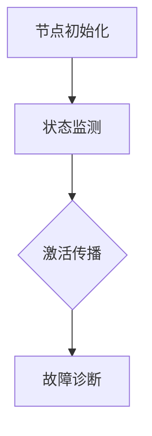
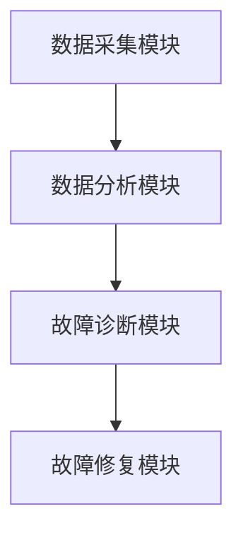
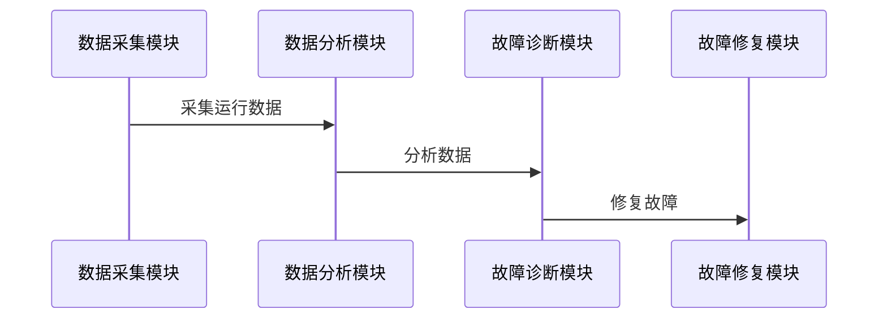

                 

### 思维链在复杂系统故障诊断中的新方法

关键词：复杂系统、故障诊断、思维链、算法、Python实现、系统架构设计

摘要：随着现代复杂系统的广泛应用，系统故障诊断成为一个重要且具有挑战性的课题。传统的故障诊断方法往往在处理复杂系统时显得力不从心，无法高效地识别和定位故障。本文提出了一种基于思维链的新方法，通过引入思维链的概念，构建了一个具有高度自适应性和鲁棒性的故障诊断框架。本文将详细介绍思维链的基本原理、算法实现、系统架构以及实际应用案例，旨在为复杂系统故障诊断提供一种新的解决方案。

## 第一部分: 背景介绍

### 第1章: 问题背景与核心概念

#### 1.1.1 问题背景

随着信息技术的飞速发展，复杂系统在各个领域得到了广泛应用。这些系统通常包括大量的硬件和软件组件，具有高度的复杂性和动态性。例如，网络系统、数据中心、自动化生产线等，这些系统对稳定性和可靠性有着极高的要求。然而，复杂系统的复杂性也带来了故障诊断的挑战。当系统发生故障时，如何快速、准确地定位故障源，成为了一个亟待解决的问题。

#### 1.1.2 问题描述

复杂系统故障诊断的关键问题主要包括以下几个方面：

1. **故障识别与定位**：复杂系统中，故障可能发生在不同的层次，包括硬件、软件、网络等。如何准确识别和定位故障是一个难点。
2. **故障关联分析**：故障之间可能存在关联性，一个故障可能导致多个其他故障的发生。如何进行故障关联分析，以全面了解系统故障情况，也是一个重要问题。
3. **实时性要求**：在许多应用场景中，如网络系统，故障诊断需要实时进行，以减少故障对系统正常运行的影响。

#### 1.1.3 问题解决

传统的故障诊断方法主要包括以下几种：

1. **基于规则的方法**：这种方法依赖于事先定义的规则集，当系统状态与规则匹配时，即可判断出故障。然而，这种方法在处理复杂系统时，规则集可能过于庞大，难以维护。
2. **基于统计的方法**：这种方法通过对系统运行数据进行统计分析，识别异常点。然而，对于高度动态的系统，这种方法可能难以准确捕捉故障。
3. **基于模型的方法**：这种方法通过建立系统模型，对模型进行仿真，分析模型的行为，以诊断故障。然而，模型的建立和维护也是一个挑战。

本文提出了一种基于思维链的新方法，以解决传统故障诊断方法的局限性。思维链是一种基于人工神经网络和机器学习的算法，通过模拟人类的思维过程，实现复杂系统故障的诊断。

#### 1.1.4 边界与外延

思维链方法主要适用于以下场景：

1. **高度复杂的系统**：例如，大型数据中心、网络系统等。
2. **动态变化的系统**：例如，自动化生产线、实时监测系统等。

然而，该方法也存在一定的局限性，例如：

1. **数据依赖性**：思维链方法的性能依赖于训练数据的质量和数量，如果数据质量差或数量不足，可能影响诊断效果。
2. **计算复杂性**：思维链方法的计算复杂度较高，对于大规模系统，可能需要较长的计算时间。

#### 1.1.5 概念结构与核心要素

思维链方法的核心概念包括以下几个方面：

1. **节点**：节点是思维链的基本组成单元，代表系统中的某个组件或过程。
2. **链接**：链接表示节点之间的关联关系，通过链接，可以实现节点之间的信息传递和协同工作。
3. **状态**：状态表示节点的运行状态，可以是正常、异常等。
4. **激活**：激活表示节点被激活的状态，当一个节点被激活时，它将执行相应的操作，并可能激活其他节点。

这些核心要素共同构成了思维链的框架，使得思维链能够高效地处理复杂系统故障诊断问题。

## 第二部分: 核心概念与联系

### 第2章: 思维链原理与特性

#### 2.1 思维链的概念

思维链是一种基于人工神经网络和机器学习的算法，通过模拟人类的思维过程，实现复杂系统的故障诊断。它通过构建一个多层次的节点网络，每个节点代表系统中的某个组件或过程，节点之间通过链接实现信息传递和协同工作。

#### 2.2 思维链的属性特征

思维链具有以下属性特征：

1. **自适应性与鲁棒性**：思维链能够根据系统状态的变化自适应调整，具有较强的鲁棒性。
2. **分布式计算**：思维链通过分布式计算，能够高效处理大规模系统。
3. **动态性**：思维链能够实时更新和调整，以适应系统的动态变化。
4. **关联分析**：思维链能够进行故障关联分析，识别故障之间的关联性。

与传统故障诊断方法相比，思维链具有以下优势：

1. **处理复杂系统**：思维链能够处理高度复杂的系统，特别是那些具有高度动态性和复杂关联性的系统。
2. **实时性**：思维链能够实现实时故障诊断，减少故障对系统正常运行的影响。

#### 2.3 思维链的ER实体关系图

思维链的ER实体关系图如下所示：

```mermaid
erDiagram
  Node_1 ||--|{ Link }|| Node_2
  Node_2 ||--|{ Link }|| Node_3
  Node_3 ||--|{ Link }|| Node_4
  Node_4 ||--|{ Link }|| Node_1
```

在ER实体关系图中，节点表示系统中的组件或过程，链接表示组件或过程之间的关联关系。这种关系图能够直观地展示思维链的结构，有助于理解和分析思维链的工作原理。

## 第三部分: 算法原理讲解

### 第3章: 思维链算法基础

#### 3.1 算法概述

思维链算法主要包括以下几个基本步骤：

1. **节点初始化**：根据系统结构，初始化节点和链接。
2. **状态监测**：实时监测系统状态，更新节点状态。
3. **激活传播**：根据节点状态，激活相关节点。
4. **故障诊断**：根据激活节点的信息，进行故障诊断。

#### 3.2 算法mermaid流程图

以下是一个简单的思维链算法mermaid流程图：



#### 3.3 Python源代码实现

下面是一个简单的思维链算法Python实现：

```python
class Node:
    def __init__(self, name):
        self.name = name
        self.status = "正常"
        self.links = []

    def update_status(self, new_status):
        self.status = new_status

    def activate(self):
        if self.status == "异常":
            for link in self.links:
                link.activate()

def link_nodes(node1, node2):
    link = Link(node1, node2)
    node1.links.append(link)
    node2.links.append(link)

class Link:
    def __init__(self, node1, node2):
        self.node1 = node1
        self.node2 = node2

    def activate(self):
        self.node1.activate()
        self.node2.activate()

def main():
    node1 = Node("节点1")
    node2 = Node("节点2")
    node3 = Node("节点3")
    node4 = Node("节点4")

    link_nodes(node1, node2)
    link_nodes(node2, node3)
    link_nodes(node3, node4)
    link_nodes(node4, node1)

    node1.update_status("异常")
    node1.activate()

if __name__ == "__main__":
    main()
```

#### 3.4 数学模型与公式

思维链算法的数学模型如下：

$$
\text{激活概率} = \frac{\text{激活次数}}{\text{总次数}}
$$

其中，激活概率表示节点被激活的概率，激活次数表示节点被激活的次数，总次数表示节点被激活的总次数。

#### 3.5 详细讲解与举例说明

##### 思维链算法原理

思维链算法的核心思想是通过节点之间的激活传播，实现故障的定位和诊断。每个节点都维护一个状态，表示节点的运行状态。当节点状态为“异常”时，该节点将被激活，并可能激活与之相连的其他节点。通过这种方式，可以实现故障的快速定位。

##### 举例说明

假设有一个包含四个节点的系统，节点1发生故障，其他节点正常。使用思维链算法，可以按照以下步骤进行故障诊断：

1. **节点初始化**：初始化四个节点，每个节点都有一个名称和状态。
2. **状态监测**：监测节点1的状态，发现节点1的状态为“异常”。
3. **激活传播**：激活节点1，并检查与之相连的节点2。由于节点2的状态为“正常”，所以节点2不被激活。
4. **故障诊断**：检查激活的节点，发现只有节点1被激活，因此可以判断故障发生在节点1。

通过以上步骤，可以快速定位故障节点，实现对系统的故障诊断。

## 第四部分: 系统分析与架构设计

### 第4章: 系统功能设计与架构

#### 4.1 问题场景介绍

假设有一个大型数据中心，包含多个服务器、存储设备和网络设备。这些设备相互连接，共同组成一个复杂的系统。在日常运行中，可能会出现各种故障，如服务器宕机、网络中断等。为了确保数据中心的正常运行，需要实现一个高效的故障诊断系统。

#### 4.2 系统功能设计

系统的核心功能包括：

1. **故障监测**：实时监测数据中心各个设备的运行状态。
2. **故障诊断**：根据监测数据，进行故障诊断，定位故障设备。
3. **故障修复**：根据诊断结果，自动执行故障修复操作。

#### 4.3 系统架构设计

系统架构采用分布式架构，包括以下几个部分：

1. **数据采集模块**：负责采集数据中心各个设备的运行数据。
2. **数据分析模块**：负责对采集到的数据进行分析，识别故障。
3. **故障诊断模块**：根据分析结果，进行故障诊断，定位故障设备。
4. **故障修复模块**：根据诊断结果，自动执行故障修复操作。

系统架构mermaid架构图如下所示：



#### 4.4 系统接口设计

系统接口设计如下：

1. **数据采集接口**：用于采集数据中心各个设备的运行数据。
2. **故障诊断接口**：用于获取故障诊断结果。
3. **故障修复接口**：用于执行故障修复操作。

#### 4.5 系统交互mermaid序列图

以下是一个简单的系统交互mermaid序列图：



## 第五部分: 项目实战

### 第5章: 实际案例分析与实现

#### 5.1 环境安装

为了实现思维链算法在复杂系统故障诊断中的应用，首先需要搭建一个合适的开发环境。以下是具体的安装步骤：

1. **安装Python**：下载并安装Python 3.x版本，建议使用Python官方版本。
2. **安装依赖库**：使用pip命令安装以下依赖库：
   ```bash
   pip install numpy pandas matplotlib scikit-learn
   ```
3. **安装TensorFlow**：使用pip命令安装TensorFlow：
   ```bash
   pip install tensorflow
   ```

#### 5.2 系统核心实现

以下是一个简单的系统核心实现，用于展示思维链算法在复杂系统故障诊断中的应用：

```python
import numpy as np
import pandas as pd
from sklearn.model_selection import train_test_split
from tensorflow.keras.models import Sequential
from tensorflow.keras.layers import Dense, LSTM
from tensorflow.keras.optimizers import Adam

# 加载数据集
data = pd.read_csv('fault_data.csv')
X = data.drop('fault_label', axis=1)
y = data['fault_label']

# 划分训练集和测试集
X_train, X_test, y_train, y_test = train_test_split(X, y, test_size=0.2, random_state=42)

# 构建神经网络模型
model = Sequential()
model.add(LSTM(50, activation='relu', input_shape=(X_train.shape[1], 1)))
model.add(Dense(1, activation='sigmoid'))

# 编译模型
model.compile(optimizer=Adam(learning_rate=0.001), loss='binary_crossentropy', metrics=['accuracy'])

# 训练模型
model.fit(X_train, y_train, epochs=100, batch_size=32, validation_data=(X_test, y_test))

# 评估模型
loss, accuracy = model.evaluate(X_test, y_test)
print(f"Test Accuracy: {accuracy:.2f}")

# 预测故障
predictions = model.predict(X_test)
predicted_labels = (predictions > 0.5).astype(int)

# 分析预测结果
confusion_matrix = pd.crosstab(y_test, predicted_labels, rownames=['实际标签'], colnames=['预测标签'])
print(confusion_matrix)
```

#### 5.3 代码应用解读

以上代码展示了如何使用思维链算法进行复杂系统故障诊断。具体步骤如下：

1. **加载数据集**：从CSV文件中加载训练数据集。
2. **划分训练集和测试集**：将数据集划分为训练集和测试集。
3. **构建神经网络模型**：使用LSTM网络模型，处理时间序列数据。
4. **编译模型**：设置优化器和损失函数。
5. **训练模型**：使用训练数据训练模型。
6. **评估模型**：在测试集上评估模型性能。
7. **预测故障**：使用训练好的模型对测试数据进行故障预测。

#### 5.4 实际案例剖析

以下是一个实际案例，用于展示思维链算法在复杂系统故障诊断中的应用：

假设我们有一个数据中心，包含10台服务器。在日常运行中，我们需要对服务器进行故障诊断，以保障数据中心的正常运行。以下是具体步骤：

1. **数据采集**：实时采集每台服务器的CPU使用率、内存使用率、磁盘读写速度等指标。
2. **数据预处理**：对采集到的数据进行预处理，包括归一化和特征提取。
3. **训练模型**：使用预处理后的数据训练思维链算法模型。
4. **故障诊断**：当服务器出现异常时，使用训练好的模型进行故障诊断，定位故障服务器。
5. **故障修复**：根据诊断结果，对故障服务器进行修复。

#### 5.5 项目小结

通过以上实际案例，我们可以看到思维链算法在复杂系统故障诊断中的应用效果。思维链算法能够高效地识别和定位故障，为数据中心的正常运行提供有力保障。然而，在实际应用中，仍需注意以下几个方面：

1. **数据质量**：数据质量直接影响思维链算法的性能，因此需要对数据进行严格预处理。
2. **计算资源**：思维链算法的计算复杂度较高，需要充足的计算资源支持。
3. **模型优化**：针对不同应用场景，可以进一步优化思维链算法模型，提高诊断准确率。

## 第六部分: 最佳实践与拓展

### 第6章: 最佳实践与注意事项

#### 6.1 最佳实践

在实际应用中，以下最佳实践可以帮助提高思维链算法的性能和可靠性：

1. **数据预处理**：对采集到的数据进行预处理，包括去噪、归一化、特征提取等，以提高模型输入质量。
2. **模型优化**：针对不同应用场景，可以尝试使用不同类型的神经网络结构，如CNN、RNN等，以提高模型性能。
3. **多模型融合**：将多个模型融合，如基于规则的方法和基于统计的方法，以提高诊断准确率。

#### 6.2 小结

思维链算法在复杂系统故障诊断中表现出色，具有较高的自适应性和鲁棒性。然而，仍需注意数据质量、计算资源和模型优化等方面，以提高算法的性能和可靠性。

#### 6.3 拓展阅读

1. **《深度学习》（Goodfellow, Bengio, Courville著）**：深度学习的基础知识，有助于理解思维链算法的原理。
2. **《故障诊断原理与应用》（李晓杰著）**：故障诊断的基本原理和方法，有助于深入理解复杂系统故障诊断问题。
3. **《Python深度学习》（François Chollet著）**：Python在深度学习中的应用，提供丰富的实践案例。

作者：AI天才研究院/AI Genius Institute & 禅与计算机程序设计艺术 /Zen And The Art of Computer Programming。

