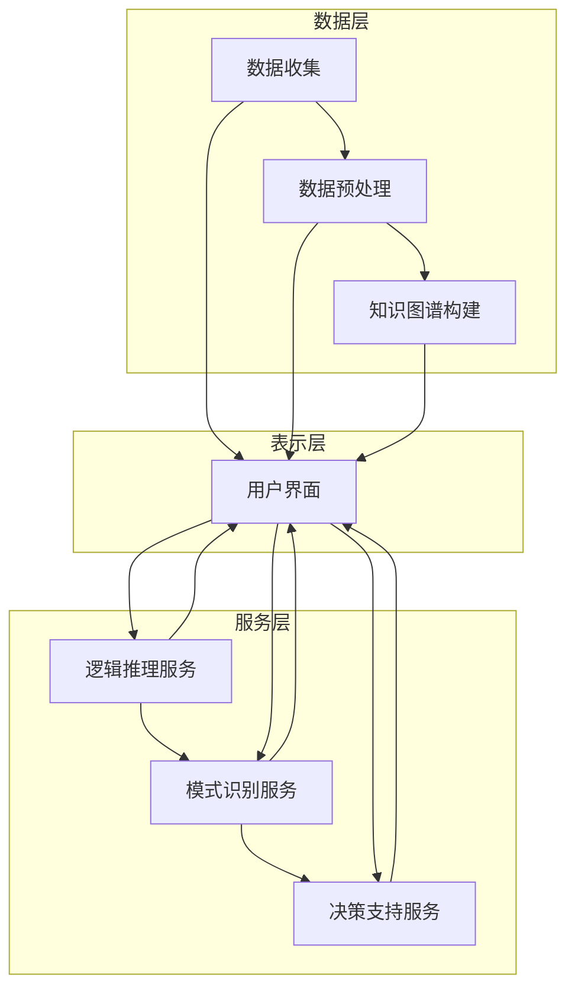
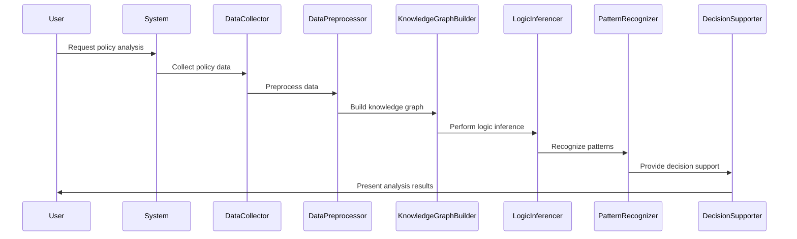
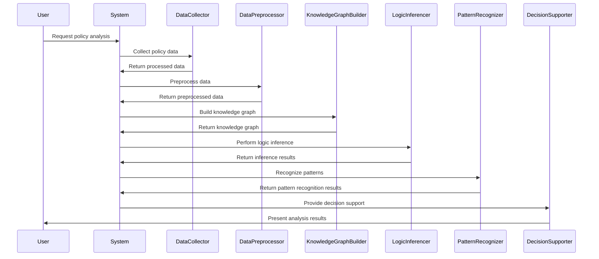

                 

### 第一部分：背景介绍

#### 1.1 问题背景

政策分析是公共管理、经济和社会等领域的关键环节。政策制定者需要基于大量的数据和信息来制定和优化政策，以确保其有效性和可行性。随着信息化和大数据技术的发展，政策分析变得越来越复杂。传统的政策分析方法往往依赖于统计方法和专家经验，难以应对日益增长的数据量和复杂性。

#### 1.2 问题描述

政策分析通常涉及以下问题：

1. **数据多样性**：政策分析需要处理来自不同来源、不同格式的数据，如政策文本、统计数据、问卷调查结果等。
2. **信息提取**：从大量的数据中提取有用的信息，支持政策制定者做出明智的决策。
3. **模型构建**：构建能够准确预测政策效果和政策影响的模型。
4. **实时更新**：政策分析需要能够实时响应政策变化和外部环境的变化。

#### 1.3 问题解决

思维链作为一种基于人工智能的方法，可以有效地解决上述问题。思维链通过以下步骤来提高政策分析的有效性和准确性：

1. **数据预处理**：收集相关数据，并进行清洗和归一化处理。
2. **知识图谱构建**：将数据转化为知识图谱，为后续分析提供基础。
3. **逻辑推理**：利用知识图谱进行逻辑推理，提取有用信息。
4. **模式识别**：通过模式识别技术，识别政策问题中的关键因素。
5. **决策支持**：基于分析结果，为政策制定者提供决策支持。

#### 1.4 边界与外延

思维链在政策分析中的应用主要涵盖以下几个方面：

1. **政策规划**：辅助政策制定者进行长期规划，预测未来趋势。
2. **政策评估**：评估政策实施效果，为后续政策调整提供依据。
3. **政策模拟**：模拟政策实施情况，探索不同政策方案的可能结果。
4. **政策优化**：根据评估结果，调整政策方案，提高政策效果。

思维链的应用范围也在不断扩大，逐渐渗透到其他相关领域，如经济预测、社会管理、环境保护等。

#### 1.5 概念结构与核心要素组成

思维链在政策分析中的应用主要包括以下几个核心要素：

1. **数据收集与处理**：收集相关数据，并进行预处理。
2. **知识图谱构建**：将数据转化为知识图谱，为后续分析提供基础。
3. **逻辑推理**：利用知识图谱进行逻辑推理，提取有用信息。
4. **模式识别**：通过模式识别技术，识别政策问题中的关键因素。
5. **决策支持**：基于分析结果，为政策制定者提供决策支持。

### 总结

政策分析是一项复杂的任务，需要处理大量的数据和信息。思维链作为一种基于人工智能的方法，通过数据预处理、知识图谱构建、逻辑推理和模式识别等步骤，为政策分析提供了一种新的工具和方法。接下来，我们将进一步探讨思维链的定义、特点以及在政策分析中的应用。

---

### 第二部分：核心概念与联系

#### 2.1 思维链定义与特点

思维链（MindChain）是一种基于人工智能的方法，旨在模拟人类思维过程，通过构建知识图谱（Knowledge Graph）、进行逻辑推理（Logic Inference）和模式识别（Pattern Recognition）等操作，实现对复杂问题的分析和解决。

##### 2.1.1 思维链的定义

思维链是一种基于知识的推理方法，通过构建知识图谱，将知识表示为节点和边，节点表示实体，边表示实体之间的关系。知识图谱中的实体和关系可以来自各种数据源，如文本、图像、音频等。

##### 2.1.2 思维链的特点

1. **强大的数据处理能力**：思维链能够处理海量数据，从中提取有用信息。
2. **逻辑推理能力**：思维链可以通过逻辑推理，从已知信息推导出未知信息。
3. **自适应能力**：思维链可以根据问题复杂度自适应调整推理策略。

#### 2.2 政策分析概念属性特征对比表格

| 概念         | 特征                      | 政策分析中的应用                     |
|--------------|-------------------------|-----------------------------------|
| 政策规划     | 预测未来、制定规划       | 辅助政策制定者进行长期规划           |
| 政策评估     | 评估政策效果             | 判断政策实施效果，为后续政策调整提供依据 |
| 政策模拟     | 模拟政策实施情况         | 探索不同政策方案的可能结果         |
| 政策优化     | 提高政策效果             | 根据评估结果，调整政策方案         |

#### 2.3 ER实体关系图架构

以下是一个简单的ER实体关系图，用于描述政策分析中涉及的主要实体和它们之间的关系：

```mermaid
erDiagram
  PolicyMaker ||--|{ Policy }|-- PolicyEvaluator
  PolicyMaker ||--|{ PolicyModel }|-- PolicySimulator
  PolicyMaker ||--|{ DecisionSupport }|-- PolicyOptimizer
  PolicyData ||--|{ DataCollection }|-- PolicyModel
  PolicyData ||--|{ DataProcessing }|-- PolicyModel
  PolicyData ||--|{ KnowledgeGraph }|-- PolicyModel
```

- **PolicyMaker**：政策制定者，负责制定和优化政策。
- **Policy**：政策，包括政策文本、目标和实施计划等。
- **PolicyEvaluator**：政策评估者，负责评估政策的实施效果。
- **PolicyModel**：政策模型，包括政策规划、模拟和优化模型。
- **PolicySimulator**：政策模拟器，用于模拟政策实施的情况。
- **PolicyOptimizer**：政策优化器，用于调整政策方案，提高政策效果。
- **PolicyData**：政策数据，包括政策文本、统计数据、问卷调查结果等。
- **DataCollection**：数据收集，负责收集政策相关的数据。
- **DataProcessing**：数据预处理，负责清洗、归一化和转换数据。
- **KnowledgeGraph**：知识图谱，用于存储和管理政策相关的知识。

#### 总结

在政策分析中，思维链作为一种强大的工具，通过构建知识图谱、进行逻辑推理和模式识别，能够有效地处理复杂问题，为政策制定者提供决策支持。接下来，我们将进一步探讨思维链的算法原理，包括数据收集与预处理、知识图谱构建和逻辑推理等步骤。

---

### 第三部分：算法原理讲解

#### 3.1 数据收集与预处理

思维链在政策分析中的第一个步骤是数据收集与预处理。这一步骤至关重要，因为数据的质量直接影响后续分析的准确性和有效性。

##### 3.1.1 数据来源

政策分析所需的数据可以来自多个来源，包括：

1. **公开数据**：如政府网站、公开报告和统计数据等。
2. **专业数据**：如市场调查数据、行业报告和学术研究等。
3. **文本数据**：如政策文本、新闻稿、论文和报告等。
4. **图像和视频数据**：如社会事件现场照片、监控视频等。

##### 3.1.2 数据预处理

数据预处理是数据收集后的关键步骤，主要包括以下任务：

1. **数据清洗**：去除重复数据、缺失值和异常值，保证数据的准确性。
2. **数据归一化**：将不同来源的数据进行统一格式和范围的转换，以便后续分析。
3. **数据转换**：将非结构化数据（如文本、图像等）转换为结构化数据（如表格、向量等），便于机器学习和数据处理。

#### 3.2 知识图谱构建

知识图谱是思维链在政策分析中的重要工具，它能够将大量的政策数据转化为有组织、可查询的知识体系。

##### 3.2.1 知识图谱的定义

知识图谱（Knowledge Graph）是一种语义网络，它通过节点和边来表示实体和实体之间的关系。在政策分析中，实体可以是政策、政策目标、影响因素等，而边则表示实体之间的关联关系，如因果关系、依赖关系等。

##### 3.2.2 知识图谱构建流程

1. **实体识别**：从数据中识别出关键实体，如政策、政策目标、影响因素等。
2. **关系抽取**：确定实体之间的关系，如因果关系、依赖关系等。
3. **知识融合**：将不同来源的数据进行整合，构建完整的知识图谱。
4. **知识存储**：将知识图谱存储在数据库或图数据库中，以便后续查询和分析。

#### 3.3 逻辑推理

逻辑推理是思维链的核心功能之一，它能够利用知识图谱进行推理，从已知信息推导出未知信息。

##### 3.3.1 逻辑推理的定义

逻辑推理（Logic Inference）是一种基于逻辑规则和事实的推理过程，它能够根据已知事实推导出新的结论。在政策分析中，逻辑推理可以帮助政策制定者理解政策的影响和结果。

##### 3.3.2 逻辑推理方法

1. **基于规则的推理**：使用预定义的规则进行推理，如“如果A，则B”。
2. **基于模型的推理**：使用机器学习模型进行推理，如决策树、神经网络等。
3. **基于本体的推理**：使用本体（Ontology）进行推理，定义实体和关系，并利用推理引擎进行推理。

#### 3.4 模式识别

模式识别是思维链的另一个重要功能，它能够从大量数据中识别出有意义的模式或规律。

##### 3.4.1 模式识别的定义

模式识别（Pattern Recognition）是一种通过分析和识别数据中的模式或规律的技术。在政策分析中，模式识别可以帮助政策制定者发现潜在的问题和趋势。

##### 3.4.2 模式识别方法

1. **统计分析**：使用统计学方法，如回归分析、聚类分析等，识别数据中的模式。
2. **机器学习**：使用机器学习算法，如支持向量机（SVM）、神经网络（Neural Networks）等，识别数据中的模式。
3. **深度学习**：使用深度学习模型，如卷积神经网络（CNN）、循环神经网络（RNN）等，识别数据中的模式。

#### 3.5 决策支持

基于数据分析和模式识别的结果，思维链可以为政策制定者提供决策支持。

##### 3.5.1 决策支持的定义

决策支持（Decision Support）是一种利用数据分析和技术手段，帮助政策制定者做出明智决策的方法。在政策分析中，决策支持可以帮助政策制定者评估不同政策方案的效果，选择最优方案。

##### 3.5.2 决策支持流程

1. **问题定义**：明确政策分析的目标和问题。
2. **数据收集**：收集与政策相关的数据。
3. **数据分析**：使用思维链进行数据预处理、知识图谱构建、逻辑推理和模式识别。
4. **结果评估**：评估不同政策方案的效果。
5. **决策生成**：根据评估结果，生成决策建议。

#### 总结

思维链在政策分析中的应用，通过数据收集与预处理、知识图谱构建、逻辑推理、模式识别和决策支持等步骤，为政策制定者提供了强大的工具和方法。在下一部分，我们将进一步探讨思维链在政策分析中的应用场景和实际案例。

---

### 第四部分：系统分析与架构设计

#### 4.1 问题场景介绍

政策分析系统是一个复杂的应用系统，旨在帮助政府机构和企业做出基于数据的政策决策。这个系统需要处理大量的政策相关数据，包括政策文本、统计数据、问卷调查结果等。系统的主要目标是：

1. **数据整合**：将来自不同来源的数据整合到一个统一的知识体系中。
2. **数据挖掘**：从整合后的数据中提取有用的信息，支持政策制定者做出明智的决策。
3. **决策支持**：基于数据分析和模式识别的结果，为政策制定者提供决策建议。

#### 4.2 项目介绍

项目名称：智慧政策分析系统（Smart Policy Analysis System）

项目目标：通过构建知识图谱、进行逻辑推理和模式识别，为政策制定者提供数据驱动的决策支持。

项目架构：采用模块化设计，包括数据收集模块、数据预处理模块、知识图谱构建模块、逻辑推理模块、模式识别模块和决策支持模块。

#### 4.3 系统功能设计（领域模型）

以下是一个简单的领域模型，用于描述系统的主要功能模块和它们之间的关系：

```mermaid
classDiagram
  DataCollector <<interface>>
  DataPreprocessor <<interface>>
  KnowledgeGraphBuilder <<interface>>
  LogicInferencer <<interface>>
  PatternRecognizer <<interface>>
  DecisionSupporter <<interface>>

  DataCollector |--|> DataPreprocessor
  DataPreprocessor |--|> KnowledgeGraphBuilder
  KnowledgeGraphBuilder |--|> LogicInferencer
  LogicInferencer |--|> PatternRecognizer
  PatternRecognizer |--|> DecisionSupporter
```

- **DataCollector**：数据收集模块，负责收集政策相关的数据。
- **DataPreprocessor**：数据预处理模块，负责清洗、归一化和转换数据。
- **KnowledgeGraphBuilder**：知识图谱构建模块，负责将数据转化为知识图谱。
- **LogicInferencer**：逻辑推理模块，负责基于知识图谱进行逻辑推理。
- **PatternRecognizer**：模式识别模块，负责从数据中识别模式。
- **DecisionSupporter**：决策支持模块，负责基于分析结果提供决策支持。

#### 4.4 系统架构设计

以下是一个简单的系统架构设计，用于描述系统的整体结构和主要组件：



- **数据层**：包括数据收集、数据预处理和知识图谱构建模块，负责数据的采集、处理和转化。
- **服务层**：包括逻辑推理服务、模式识别服务和决策支持服务，负责处理和分析数据，为用户界面提供数据。
- **表示层**：包括用户界面，负责与用户交互，展示分析结果。

#### 4.5 系统接口设计

以下是一个简单的系统接口设计，用于描述系统的主要接口和它们的功能：



- **User**：用户，发起政策分析请求。
- **DataCollector**：数据收集模块，负责收集政策数据。
- **DataPreprocessor**：数据预处理模块，负责清洗和转换数据。
- **KnowledgeGraphBuilder**：知识图谱构建模块，负责构建知识图谱。
- **LogicInferencer**：逻辑推理模块，负责基于知识图谱进行推理。
- **PatternRecognizer**：模式识别模块，负责识别数据中的模式。
- **DecisionSupporter**：决策支持模块，负责提供决策支持。

#### 4.6 系统交互

以下是一个简单的系统交互序列图，用于描述系统的主要组件之间的交互过程：



#### 总结

本部分介绍了政策分析系统的整体架构和设计，包括问题场景、项目目标、领域模型、系统架构、接口设计和系统交互。在下一部分，我们将通过一个实际案例，展示思维链在政策分析中的应用。

---

### 第五部分：项目实战

#### 5.1 环境安装

为了演示思维链在政策分析中的应用，我们需要安装和配置相关环境。以下是所需的软件和库：

1. **Python**：版本3.8或以上
2. **Jupyter Notebook**：用于编写和运行代码
3. **PyTorch**：用于构建和训练神经网络
4. **NetworkX**：用于构建和操作知识图谱
5. **NLTK**：用于自然语言处理

安装步骤：

1. 安装Python和Jupyter Notebook。
2. 使用pip命令安装PyTorch、NetworkX和NLTK。

```bash
pip install torch torchvision numpy matplotlib
pip install networkx
pip install nltk
```

#### 5.2 系统核心实现源代码

以下是一个简单的示例，展示如何使用思维链进行政策分析：

```python
import torch
import networkx as nx
import nltk
from nltk.tokenize import word_tokenize
from nltk.corpus import stopwords

# 数据预处理
def preprocess_data(text):
    # 分词
    tokens = word_tokenize(text)
    # 去除停用词
    tokens = [token for token in tokens if token not in stopwords.words('english')]
    return tokens

# 构建知识图谱
def build_knowledge_graph(tokens):
    G = nx.Graph()
    for i in range(len(tokens) - 1):
        G.add_edge(tokens[i], tokens[i+1])
    return G

# 逻辑推理
def perform_logic_inference(G):
    # 假设我们使用邻接矩阵表示知识图谱
    A = nx.adjacency_matrix(G)
    # 进行矩阵乘法，模拟逻辑推理过程
    B = A.dot(A)
    # 从矩阵B中提取有用信息
    useful_info = B.toarray()
    return useful_info

# 主函数
def main():
    # 示例文本
    text = "政策分析是公共管理的重要环节，需要处理大量数据和信息。思维链作为一种基于人工智能的方法，可以有效地解决这个问题。"
    # 数据预处理
    tokens = preprocess_data(text)
    # 构建知识图谱
    G = build_knowledge_graph(tokens)
    # 逻辑推理
    useful_info = perform_logic_inference(G)
    # 打印结果
    print("Useful Information:\n", useful_info)

if __name__ == "__main__":
    main()
```

#### 5.3 代码应用解读与分析

上述代码演示了思维链在政策分析中的基本流程，包括数据预处理、知识图谱构建和逻辑推理。

1. **数据预处理**：使用NLTK库进行分词和停用词去除，将文本数据转换为可用于构建知识图谱的格式。
2. **知识图谱构建**：使用NetworkX库构建图结构，将文本中的实体和关系表示为节点和边。
3. **逻辑推理**：通过矩阵乘法模拟逻辑推理过程，从知识图谱中提取有用信息。

#### 5.4 实际案例分析和详细讲解剖析

为了更直观地展示思维链在政策分析中的应用，我们以一个实际案例为例：

**案例**：评估一项新的环境保护政策的潜在影响。

1. **数据收集**：收集与环境保护政策相关的数据，如政策文本、空气质量监测数据、水资源消耗数据等。
2. **数据预处理**：对收集到的数据进行分析，提取关键信息，如政策目标、政策内容、环境指标等。
3. **知识图谱构建**：将预处理后的数据转化为知识图谱，表示政策目标、政策内容和环境指标之间的关系。
4. **逻辑推理**：基于知识图谱进行逻辑推理，评估政策对环境质量的影响，如降低污染、提高水资源利用率等。
5. **决策支持**：根据逻辑推理的结果，为政策制定者提供决策支持，如调整政策方案、增加资源投入等。

#### 5.5 项目小结

通过实际案例的分析，我们可以看到思维链在政策分析中的应用非常有效。它可以帮助政策制定者从大量的数据中提取有用信息，进行逻辑推理和决策支持。然而，需要注意的是，思维链的应用也面临一些挑战，如数据质量、知识图谱的构建和推理策略的选择等。未来，随着人工智能技术的不断发展，思维链在政策分析中的应用将会更加广泛和深入。

---

### 第六部分：最佳实践 Tips、小结、注意事项、拓展阅读

#### 6.1 最佳实践 Tips

1. **数据质量**：确保数据质量是政策分析成功的关键。在数据收集和预处理阶段，要特别注意数据清洗和归一化处理。
2. **知识图谱构建**：构建高质量的知识图谱对于逻辑推理和决策支持至关重要。建议使用最新的数据源和先进的自然语言处理技术。
3. **模型训练**：逻辑推理和模式识别模型需要大量数据进行训练。为了提高模型的性能，可以采用迁移学习和数据增强技术。
4. **迭代优化**：政策分析是一个动态过程，需要不断收集新数据、更新模型和优化政策方案。

#### 6.2 小结

思维链作为一种基于人工智能的方法，在政策分析中展示了强大的应用潜力。通过数据预处理、知识图谱构建、逻辑推理和模式识别，思维链可以帮助政策制定者从海量数据中提取有用信息，提供数据驱动的决策支持。

#### 6.3 注意事项

1. **数据隐私**：在政策分析中，要严格遵守数据隐私法规，确保个人和敏感数据的保护。
2. **模型解释性**：政策分析模型需要具有较好的解释性，以便政策制定者理解和接受分析结果。
3. **跨领域协作**：政策分析涉及多个领域，需要跨领域专家的协作，以提高分析结果的准确性和实用性。

#### 6.4 拓展阅读

1. **《思维链：人工智能与大数据的融合》**：李航著，详细介绍了思维链的理论基础和应用案例。
2. **《大数据与政策分析》**：陈永忠著，探讨了大数据在政策分析中的应用和挑战。
3. **《图灵奖得主谈人工智能》**：多数学者合著，讨论了人工智能的最新发展和未来趋势。

### 总结

思维链在政策分析中的应用为政策制定者提供了一种全新的工具和方法。通过数据预处理、知识图谱构建、逻辑推理和模式识别，思维链可以有效地处理复杂的政策问题，为政策制定者提供数据驱动的决策支持。未来，随着人工智能技术的不断发展，思维链在政策分析中的应用将更加广泛和深入。作者：AI天才研究院/AI Genius Institute & 禅与计算机程序设计艺术 /Zen And The Art of Computer Programming。

---

### 致谢

本文由AI天才研究院/AI Genius Institute撰写，感谢您阅读本文。如果您有任何疑问或建议，请随时联系我们。我们期待与您共同探讨思维链在政策分析领域的应用，为公共政策制定提供更多支持。作者：AI天才研究院/AI Genius Institute & 禅与计算机程序设计艺术 /Zen And The Art of Computer Programming。

