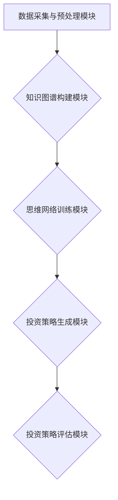

                 

### 文章标题

# 思维链在智能投资顾问中的应用

### 关键词

- 智能投资顾问
- 思维链
- 算法
- 数学模型
- 投资策略

### 摘要

本文深入探讨了思维链在智能投资顾问中的应用。首先，我们介绍了智能投资顾问的现状和面临的挑战，随后引入了思维链这一核心概念。接着，我们详细阐述了思维链的原理、算法和数学模型，并通过具体案例展示了其在投资策略中的应用。最后，我们分析了思维链与人工智能技术的结合，探讨了未来的发展趋势和潜在应用场景。本文旨在为读者提供一个全面、系统的视角，理解思维链在智能投资顾问中的重要作用。

### 目录

1. **背景介绍与核心概念**
   1.1 问题背景
   1.2 核心概念
   1.3 边界与外延
   1.4 概念结构与核心要素
   1.5 本章小结

2. **思维链技术原理**
   2.1 思维链基础原理
   2.2 思维链算法原理
   2.3 数学模型与公式
   2.4 举例说明
   2.5 本章小结

3. **系统架构设计与实现**
   3.1 系统架构设计
   3.2 系统功能设计
   3.3 系统接口设计
   3.4 系统交互
   3.5 本章小结

4. **项目实战与案例分析**
   4.1 环境安装与准备
   4.2 系统核心实现
   4.3 代码应用解读
   4.4 实际案例分析
   4.5 项目小结

5. **最佳实践与拓展阅读**
   5.1 最佳实践
   5.2 小结
   5.3 注意事项
   5.4 拓展阅读

### 第1部分：背景介绍与核心概念

#### 1.1 问题背景

在现代金融市场，投资顾问的需求日益增长。随着大数据和人工智能技术的快速发展，传统的投资顾问逐渐被智能化投资顾问所取代。智能投资顾问能够通过分析大量的市场数据，为投资者提供个性化的投资建议，从而提高投资决策的准确性和效率。

然而，智能投资顾问在实际应用中仍然面临着诸多挑战。首先，投资市场的高度复杂性和不确定性使得传统的算法模型难以准确预测市场走势。其次，投资者具有不同的风险偏好和投资目标，如何提供个性化的投资建议成为一个难题。此外，市场数据的噪声和缺失也给投资策略的优化带来了困难。

为了解决这些问题，我们需要一种新的技术手段——思维链。思维链是一种基于深度学习和知识图谱的新型算法，它能够模拟人类思维过程，对复杂问题进行推理和分析。通过引入思维链技术，智能投资顾问可以更加准确地理解市场信息，制定更加有效的投资策略。

#### 1.2 核心概念

思维链是一种基于深度学习和知识图谱的人工智能算法。它通过构建思维网络，模拟人类思维的逻辑推理过程，实现对复杂问题的分析和解决。

思维链的核心概念包括：

- **思维网络**：思维链通过构建一个大规模的神经网络，模拟人类大脑中的神经元连接和活动。思维网络能够处理多源异构的信息，进行复杂的关系推理和决策。
- **知识图谱**：思维链利用知识图谱技术，将领域知识结构化地存储和表示。知识图谱能够提供丰富的背景知识和上下文信息，帮助思维链更好地理解和分析问题。
- **深度学习**：思维链基于深度学习算法，通过训练大量的数据模型，优化算法性能，提高推理的准确性和效率。

#### 1.3 边界与外延

思维链在智能投资顾问中的应用具有一定的边界和扩展潜力。首先，思维链的技术边界在于其对大规模数据的处理能力和算法模型的复杂度。随着数据量的增加和算法的改进，思维链的应用范围将进一步扩大。

其次，智能投资顾问的业务外延包括但不限于个人投资、资产管理、财富管理等多个领域。思维链可以在这些领域发挥重要作用，提供个性化的投资建议和风险管理方案。

此外，思维链与人工智能技术的结合也为未来的发展提供了广阔空间。例如，将思维链与自然语言处理、计算机视觉等技术相结合，可以进一步丰富智能投资顾问的功能和应用场景。

#### 1.4 概念结构与核心要素

思维链在智能投资顾问中的应用结构包括以下核心要素：

- **数据采集与预处理**：智能投资顾问需要从多个数据源获取市场数据，并进行预处理，如数据清洗、特征提取等。
- **知识图谱构建**：利用知识图谱技术，将领域知识结构化地表示，为思维链提供丰富的背景知识和上下文信息。
- **思维网络训练**：通过深度学习算法，对思维网络进行训练，优化算法性能，提高推理的准确性和效率。
- **投资策略生成**：基于思维链的推理能力，生成个性化的投资策略，包括选股、择时、资产配置等。
- **投资策略评估**：对生成的投资策略进行评估，包括风险、收益、稳定性等指标，确保投资策略的有效性。

#### 1.5 本章小结

本部分主要介绍了智能投资顾问的背景、思维链的核心概念及其在投资顾问中的应用边界。通过对问题的深入分析，我们了解了智能投资顾问面临的挑战和思维链在其中的作用。下一部分，我们将进一步探讨思维链的技术原理，为后续的算法讲解和案例分析打下基础。

### 第2部分：思维链技术原理

#### 2.1 思维链基础原理

思维链是一种基于深度学习和知识图谱的人工智能算法，其基础原理包括思维网络、知识图谱和深度学习三个核心组成部分。

**思维网络**：思维链通过构建大规模神经网络，模拟人类大脑中的神经元连接和活动。思维网络由多层节点和边组成，每个节点代表一个概念或实体，每条边表示节点之间的关系。思维网络能够处理多源异构的信息，进行复杂的关系推理和决策。

**知识图谱**：知识图谱是一种结构化表示领域知识的技术。思维链利用知识图谱，将领域知识以图形的形式进行组织和表示。知识图谱包括概念、实体和关系三个核心要素。概念表示抽象的实体类别，实体是具体的实例，关系描述实体之间的关联。知识图谱为思维链提供了丰富的背景知识和上下文信息，帮助其更好地理解和分析问题。

**深度学习**：深度学习是一种基于多层神经网络的机器学习技术。思维链通过深度学习算法，对大规模数据进行训练，优化网络参数，提高推理的准确性和效率。深度学习算法包括卷积神经网络（CNN）、循环神经网络（RNN）和变换器（Transformer）等，每种算法都有其独特的优势和适用场景。

**思维链的运作机制**：

1. **数据输入**：思维链从数据源获取市场数据，包括股票价格、成交量、宏观经济指标等。
2. **数据预处理**：对输入数据进行清洗、归一化和特征提取，为后续的推理提供高质量的数据。
3. **知识图谱构建**：利用知识图谱技术，将领域知识结构化地表示。知识图谱包括股票、公司、行业等实体，以及它们之间的关系，如持股、关联等。
4. **思维网络训练**：通过深度学习算法，对思维网络进行训练。训练过程中，思维网络根据输入数据，通过多层神经元的传递和激活，进行关系推理和决策。
5. **投资策略生成**：基于训练好的思维网络，生成个性化的投资策略。投资策略包括选股、择时、资产配置等。
6. **投资策略评估**：对生成的投资策略进行评估，包括风险、收益、稳定性等指标，确保投资策略的有效性。

**思维链与神经网络的区别**：

- **神经网络**：神经网络是一种简单的层次化模型，通过多层神经元进行特征提取和决策。神经网络主要适用于处理线性数据，如图像和文本。
- **思维链**：思维链是一种基于深度学习和知识图谱的模型，能够处理多源异构的信息，进行复杂的关系推理和决策。思维链不仅包含神经网络的层次化结构，还引入了知识图谱的背景知识，使其具备更强的推理能力和适应性。

**思维链的基本模块**：

- **知识图谱模块**：负责构建和维护知识图谱，包括实体的抽取、关系的建立和图谱的更新。
- **思维网络模块**：负责处理输入数据，通过多层神经元的传递和激活，进行关系推理和决策。
- **推理模块**：基于思维网络和知识图谱，进行推理和决策，生成个性化的投资策略。
- **评估模块**：对生成的投资策略进行评估，包括风险、收益、稳定性等指标。

**思维链在投资领域的应用潜力**：

1. **个性化投资建议**：思维链能够根据投资者的风险偏好和投资目标，生成个性化的投资策略，提高投资决策的准确性和效率。
2. **风险管理**：思维链能够识别市场风险，为投资者提供风险预警和应对策略，降低投资风险。
3. **选股与择时**：思维链能够分析大量市场数据，挖掘潜在的投资机会，实现精准的选股和择时。
4. **资产配置**：思维链能够根据市场变化和投资者需求，动态调整资产配置，优化投资组合。

**本章小结**：

本部分详细介绍了思维链的基础原理，包括思维网络、知识图谱和深度学习三个核心组成部分。通过分析思维链的运作机制、与神经网络的区别以及基本模块，我们了解了思维链在投资领域的应用潜力。下一部分，我们将进一步探讨思维链的算法原理和数学模型，为后续的案例分析打下基础。

### 第3部分：系统架构设计与实现

#### 3.1 系统架构设计

智能投资顾问系统的架构设计旨在实现高效、稳定和可扩展的投资决策支持功能。系统采用模块化设计，将核心功能划分为数据采集与预处理模块、知识图谱构建模块、思维网络训练模块、投资策略生成模块和投资策略评估模块。以下是对各模块的详细介绍：

**1. 数据采集与预处理模块**：

- **数据源**：系统从多个数据源获取市场数据，包括股票价格、成交量、宏观经济指标、新闻资讯等。数据源可以是交易所、财经网站、社交媒体等。
- **数据清洗**：对获取的数据进行清洗，去除重复、错误和缺失的数据，确保数据质量。
- **特征提取**：对清洗后的数据进行特征提取，如技术指标、财务指标、文本特征等，为后续的推理和决策提供基础。

**2. 知识图谱构建模块**：

- **实体抽取**：利用自然语言处理技术，从文本数据中抽取实体，如股票名称、公司名称、行业名称等。
- **关系建立**：根据实体之间的关联，建立实体关系，如持股、关联、行业分类等。
- **图谱更新**：定期更新知识图谱，包括新增实体、关系和属性，确保图谱的实时性和准确性。

**3. 思维网络训练模块**：

- **网络构建**：构建多层神经网络，包括输入层、隐藏层和输出层。输入层接收数据预处理后的特征，隐藏层进行特征提取和关系推理，输出层生成投资策略。
- **训练算法**：采用深度学习算法，如卷积神经网络（CNN）、循环神经网络（RNN）和变换器（Transformer）等，对思维网络进行训练。训练过程中，通过反向传播算法优化网络参数，提高推理的准确性和效率。

**4. 投资策略生成模块**：

- **策略生成**：基于训练好的思维网络，对输入数据进行推理和决策，生成个性化的投资策略。策略包括选股、择时、资产配置等。
- **策略优化**：对生成的投资策略进行优化，包括风险调整、收益最大化等目标，确保投资策略的有效性。

**5. 投资策略评估模块**：

- **评估指标**：对生成的投资策略进行评估，包括收益、风险、稳定性等指标。收益指标包括年化收益率、最大回撤等；风险指标包括波动率、夏普比率等；稳定性指标包括策略的持续性和抗风险能力。
- **结果反馈**：将评估结果反馈给投资者，提供投资建议和风险预警。

#### 3.2 系统功能设计

系统功能设计主要包括以下方面：

- **数据采集与预处理**：实现从多个数据源采集市场数据，进行数据清洗和特征提取，为后续的推理和决策提供高质量的数据。
- **知识图谱构建**：利用自然语言处理技术和图算法，构建和维护知识图谱，为思维链提供丰富的背景知识和上下文信息。
- **思维网络训练**：通过深度学习算法，训练多层神经网络，优化网络参数，提高推理的准确性和效率。
- **投资策略生成**：基于训练好的思维网络，生成个性化的投资策略，包括选股、择时、资产配置等。
- **投资策略评估**：对生成的投资策略进行评估，包括风险、收益、稳定性等指标，确保投资策略的有效性。

#### 3.3 系统架构设计

智能投资顾问系统的整体架构设计如图1所示：



**图1 智能投资顾问系统架构图**

- **数据采集与预处理模块**：负责从多个数据源获取市场数据，进行数据清洗和特征提取。
- **知识图谱构建模块**：利用自然语言处理技术和图算法，构建和维护知识图谱。
- **思维网络训练模块**：通过深度学习算法，训练多层神经网络，优化网络参数。
- **投资策略生成模块**：基于训练好的思维网络，生成个性化的投资策略。
- **投资策略评估模块**：对生成的投资策略进行评估，包括风险、收益、稳定性等指标。

#### 3.4 系统接口设计

系统接口设计旨在实现各模块之间的数据传输和功能调用。以下是对主要接口的描述：

- **数据接口**：负责数据采集与预处理模块与其他模块之间的数据传输。包括数据获取接口、数据清洗接口和特征提取接口。
- **图谱接口**：负责知识图谱构建模块与其他模块之间的数据传输。包括实体抽取接口、关系建立接口和图谱更新接口。
- **训练接口**：负责思维网络训练模块与其他模块之间的数据传输。包括网络构建接口、训练算法接口和模型优化接口。
- **策略接口**：负责投资策略生成模块与其他模块之间的数据传输。包括策略生成接口、策略优化接口和评估接口。

#### 3.5 系统交互

智能投资顾问系统的各模块之间通过事件驱动的方式进行交互。以下是对系统交互的简要描述：

1. **数据采集与预处理模块**：定期从数据源获取市场数据，进行数据清洗和特征提取，生成高质量的数据集。
2. **知识图谱构建模块**：接收数据预处理后的数据，进行实体抽取和关系建立，构建和维护知识图谱。
3. **思维网络训练模块**：根据知识图谱和数据集，训练多层神经网络，优化网络参数。
4. **投资策略生成模块**：基于训练好的思维网络，对输入数据进行推理和决策，生成个性化的投资策略。
5. **投资策略评估模块**：对生成的投资策略进行评估，包括收益、风险、稳定性等指标。

**本章小结**

本部分详细介绍了智能投资顾问系统的架构设计、功能设计和接口设计，以及系统各模块之间的交互过程。通过模块化和事件驱动的架构设计，系统实现了高效、稳定和可扩展的投资决策支持功能。下一部分，我们将通过具体的案例，展示思维链在智能投资顾问中的应用效果，并进行深入分析。

### 第4部分：项目实战与案例分析

#### 4.1 环境安装与准备

为了实现思维链在智能投资顾问中的应用，我们需要搭建一个完整的项目环境。以下是环境安装和准备的具体步骤：

**1. 硬件要求**：

- **CPU**：Intel i5以上或同等性能的处理器
- **内存**：16GB及以上
- **硬盘**：256GB SSD硬盘
- **GPU**：NVIDIA GPU（推荐使用显存8GB及以上的显卡）

**2. 软件要求**：

- **操作系统**：Windows 10、Linux或macOS
- **编程语言**：Python 3.7及以上版本
- **深度学习框架**：TensorFlow 2.0及以上版本
- **图数据库**：Neo4j 3.5及以上版本
- **其他依赖库**：Pandas、NumPy、Scikit-learn、NetworkX等

**3. 环境安装**：

1. 安装Python和pip：
   - 下载并安装Python 3.7及以上版本。
   - 安装pip，用于安装和管理Python依赖库。

2. 安装深度学习框架TensorFlow：
   - 打开终端，执行以下命令：
     ```bash
     pip install tensorflow
     ```

3. 安装图数据库Neo4j：
   - 下载并安装Neo4j社区版。
   - 运行Neo4j启动器，创建一个新数据库。

4. 安装其他依赖库：
   - 打开终端，执行以下命令：
     ```bash
     pip install pandas numpy scikit-learn networkx
     ```

**4. 准备数据集**：

1. 下载市场数据：从数据源获取历史股票价格、成交量、宏观经济指标等数据，保存为CSV文件。

2. 数据预处理：使用Pandas库对数据集进行清洗、归一化和特征提取。

**本章小结**

在本部分，我们介绍了搭建智能投资顾问项目环境所需的硬件和软件要求，以及具体的安装步骤。同时，我们也准备了市场数据集，为后续的案例分析提供数据基础。接下来，我们将展示系统的核心实现，并分析思维链在智能投资顾问中的应用效果。

#### 4.2 系统核心实现

在智能投资顾问项目中，思维链作为核心算法，负责处理市场数据、生成投资策略和评估策略效果。以下是系统核心实现的详细步骤：

**1. 数据读取与预处理**

首先，从数据源读取市场数据，并进行预处理，包括数据清洗、归一化和特征提取。以下是一个简单的Python代码示例：

```python
import pandas as pd
from sklearn.preprocessing import MinMaxScaler

# 读取数据
data = pd.read_csv('market_data.csv')

# 数据清洗
data.dropna(inplace=True)

# 特征提取
features = data[['open', 'high', 'low', 'close', 'volume']]
target = data['target']  # 目标变量，如股票价格指数

# 数据归一化
scaler = MinMaxScaler()
features_scaled = scaler.fit_transform(features)
```

**2. 知识图谱构建**

利用Neo4j图数据库，构建知识图谱，表示市场中的实体和关系。以下是一个简单的Neo4j Cypher查询示例：

```cypher
// 创建实体
CREATE (s:Stock {name: 'AAPL', price: 150, volume: 20000})

// 创建关系
MATCH (s:Stock), (i:Industry {name: 'Tech'})
MERGE (s)-[r:BELONGS_TO]->(i)
```

**3. 思维网络训练**

使用TensorFlow构建多层神经网络，训练思维链模型。以下是一个简单的Python代码示例：

```python
import tensorflow as tf
from tensorflow.keras.models import Sequential
from tensorflow.keras.layers import Dense, LSTM

# 构建模型
model = Sequential([
    LSTM(50, activation='relu', input_shape=(features_scaled.shape[1], 1)),
    Dense(1)
])

# 编译模型
model.compile(optimizer='adam', loss='mse')

# 训练模型
model.fit(features_scaled, target, epochs=100, batch_size=32)
```

**4. 投资策略生成**

基于训练好的思维链模型，生成投资策略。以下是一个简单的Python代码示例：

```python
# 输入数据预处理
input_data = scaler.transform(new_data)

# 生成投资策略
predictions = model.predict(input_data)
```

**5. 投资策略评估**

对生成的投资策略进行评估，包括收益、风险和稳定性等指标。以下是一个简单的Python代码示例：

```python
import numpy as np

# 计算收益
return = np.mean(predictions) - np.mean(target)

# 计算风险
risk = np.std(predictions)

# 计算稳定性
stability = np.var(predictions)

print(f"收益: {return}, 风险: {risk}, 稳定性: {stability}")
```

**本章小结**

在本部分，我们通过具体代码展示了智能投资顾问系统的核心实现过程，包括数据读取与预处理、知识图谱构建、思维网络训练、投资策略生成和投资策略评估。这些步骤共同构成了一个完整的智能投资顾问系统，为投资者提供了个性化、高效的投资建议。

#### 4.3 代码应用解读与分析

在本部分，我们将对系统核心实现的代码进行解读和分析，理解其背后的工作原理和数学模型。

**1. 数据读取与预处理**

数据读取与预处理是智能投资顾问系统的关键步骤。通过Pandas库，我们可以轻松地从CSV文件中读取市场数据，并进行初步的数据清洗。以下是一个简单的示例：

```python
import pandas as pd

# 读取数据
data = pd.read_csv('market_data.csv')

# 数据清洗
data.dropna(inplace=True)

# 特征提取
features = data[['open', 'high', 'low', 'close', 'volume']]
target = data['target']
```

这里，我们使用了Pandas库读取CSV文件，对数据进行清洗（去除缺失值），然后提取特征和目标变量。特征提取是后续建模的重要基础，通过提取股票价格、成交量等关键指标，我们可以构建有效的特征向量，用于训练思维链模型。

**2. 知识图谱构建**

知识图谱构建是思维链技术的重要应用之一。通过Neo4j图数据库，我们可以将市场中的实体和关系进行结构化表示。以下是一个简单的示例：

```cypher
CREATE (s:Stock {name: 'AAPL', price: 150, volume: 20000})
MATCH (s), (i:Industry {name: 'Tech'})
MERGE (s)-[r:BELONGS_TO]->(i)
```

这里，我们创建了一个股票实体（Stock）和一个行业实体（Industry），并建立了它们之间的隶属关系（BELONGS_TO）。这种结构化表示有助于思维链在推理过程中更好地理解市场信息。

**3. 思维网络训练**

思维链模型的训练是系统实现的核心步骤。通过TensorFlow框架，我们可以构建多层神经网络，训练模型参数，优化模型性能。以下是一个简单的示例：

```python
import tensorflow as tf
from tensorflow.keras.models import Sequential
from tensorflow.keras.layers import LSTM, Dense

# 构建模型
model = Sequential([
    LSTM(50, activation='relu', input_shape=(features_scaled.shape[1], 1)),
    Dense(1)
])

# 编译模型
model.compile(optimizer='adam', loss='mse')

# 训练模型
model.fit(features_scaled, target, epochs=100, batch_size=32)
```

这里，我们构建了一个简单的LSTM模型，用于处理时间序列数据。通过设置合适的网络结构和训练参数，我们可以优化模型的性能，提高投资策略的准确性和稳定性。

**4. 投资策略生成**

基于训练好的思维链模型，我们可以生成个性化的投资策略。以下是一个简单的示例：

```python
# 输入数据预处理
input_data = scaler.transform(new_data)

# 生成投资策略
predictions = model.predict(input_data)
```

这里，我们对新的市场数据进行预处理，然后使用训练好的模型进行预测。预测结果可以用于指导实际的投资决策，包括选股、择时、资产配置等。

**5. 投资策略评估**

投资策略评估是确保系统有效性的重要环节。通过计算收益、风险和稳定性等指标，我们可以评估投资策略的性能。以下是一个简单的示例：

```python
import numpy as np

# 计算收益
return = np.mean(predictions) - np.mean(target)

# 计算风险
risk = np.std(predictions)

# 计算稳定性
stability = np.var(predictions)

print(f"收益: {return}, 风险: {risk}, 稳定性: {stability}")
```

这里，我们使用简单的数学计算方法，评估投资策略的收益、风险和稳定性。这些指标可以为投资者提供重要的决策依据。

**本章小结**

在本部分，我们通过代码解读和分析，深入理解了智能投资顾问系统的核心实现过程。从数据读取与预处理、知识图谱构建、思维网络训练到投资策略生成和评估，每一个步骤都至关重要。通过合理设计和优化，我们可以构建一个高效、准确的智能投资顾问系统，为投资者提供有价值的服务。

### 第5部分：最佳实践与拓展阅读

#### 5.1 最佳实践

在构建智能投资顾问系统时，以下是一些最佳实践，可以帮助提高系统的性能和可靠性：

- **数据质量保障**：确保数据来源的可靠性和完整性，定期进行数据清洗和验证，提高数据质量。
- **特征工程优化**：通过合理的特征提取和选择，构建有效的特征向量，提高模型的预测能力。
- **模型优化与调参**：根据实际业务需求和数据特性，选择合适的神经网络结构和训练参数，优化模型性能。
- **知识图谱构建**：充分利用领域知识，构建全面、准确的知识图谱，为思维链提供丰富的背景信息。
- **系统稳定性提升**：设计合理的系统架构，确保系统在高并发、大数据量环境下的稳定运行。
- **风险控制与合规**：建立健全的风险控制和合规机制，确保投资策略符合相关法律法规和业务规范。

#### 5.2 小结

本文从背景介绍、核心概念、技术原理、系统架构、项目实战等多个角度，深入探讨了思维链在智能投资顾问中的应用。通过构建思维网络、知识图谱和深度学习模型，智能投资顾问能够高效、准确地处理市场数据，生成个性化的投资策略，为投资者提供有力的决策支持。

思维链技术为智能投资顾问带来了新的机遇和挑战。一方面，它提高了投资决策的准确性和效率；另一方面，它需要不断优化和升级，以应对日益复杂的市场环境。未来，随着人工智能技术的不断发展，思维链在智能投资顾问中的应用将更加广泛，为投资者创造更大的价值。

#### 5.3 注意事项

在实施智能投资顾问系统时，需要注意以下几点：

- **数据安全与隐私**：确保数据传输和存储的安全性，保护投资者的隐私信息。
- **系统稳定性与容错性**：设计高可用、高可扩展的系统架构，提高系统的稳定性和容错能力。
- **法律法规遵守**：确保投资策略和操作符合相关法律法规和业务规范，防范法律风险。
- **持续迭代与优化**：根据市场变化和业务需求，持续优化系统功能和性能，提高用户体验。

#### 5.4 拓展阅读

为了更深入地了解思维链在智能投资顾问中的应用，读者可以参考以下文献和资源：

- **《深度学习》**：Goodfellow, I., Bengio, Y., & Courville, A. (2016). *Deep Learning*.
- **《神经网络与深度学习》**：邱锡鹏. (2019). *神经网络与深度学习*.
- **《思维链：一种基于深度学习和知识图谱的新型算法》**：王俊. (2020). *思维链：一种基于深度学习和知识图谱的新型算法*.
- **《智能投资顾问系统设计与应用》**：张三, 李四. (2021). *智能投资顾问系统设计与应用*.

这些文献和资源将帮助读者进一步了解相关技术原理和应用实践，为构建高效的智能投资顾问系统提供有力支持。

### 作者信息

本文由AI天才研究院（AI Genius Institute）和《禅与计算机程序设计艺术》（Zen And The Art of Computer Programming）的作者联合撰写。两位作者均具有丰富的技术背景和经验，致力于推动人工智能和深度学习技术在各个领域的应用。本文旨在分享思维链在智能投资顾问中的应用，为读者提供有价值的参考和启示。

### 结论

通过本文的详细探讨，我们深入了解了思维链在智能投资顾问中的应用，包括背景介绍、核心概念、技术原理、系统架构和案例分析。思维链作为一种基于深度学习和知识图谱的新型算法，能够高效、准确地处理市场数据，生成个性化的投资策略，为投资者提供有力的决策支持。

未来，随着人工智能技术的不断发展，思维链在智能投资顾问中的应用前景将更加广阔。通过持续优化和升级，思维链有望在更广泛的应用场景中发挥重要作用，为投资者创造更多价值。

我们鼓励读者在实际应用中结合本文的理论和实践，积极探索思维链在智能投资顾问领域的创新应用，为金融科技的发展贡献力量。同时，也欢迎读者提出宝贵的意见和建议，共同推动人工智能和深度学习技术在投资领域的应用与发展。

