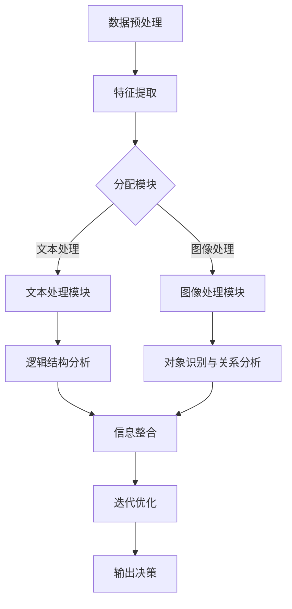
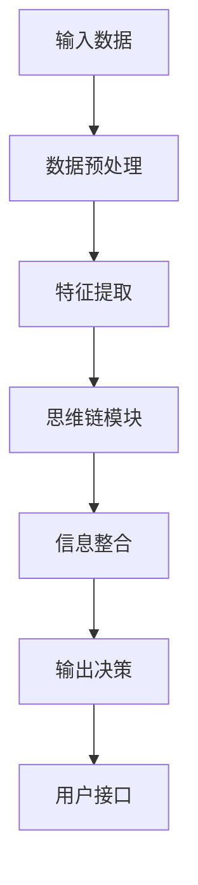

                 


### 摘要

本文深入探讨了思维链在法律推理中的应用前景，旨在揭示思维链这一先进算法在法律领域中的潜在影响力。通过详细分析思维链的基本原理和算法机制，我们将其与法律推理的核心概念进行对比，揭示二者之间的紧密联系。文章随后逐步讲解思维链算法的mermaid流程图、数学模型和公式，并结合实际项目实战，展示其在法律推理系统中的应用。本文的目标是提供一套系统性的方法，以期为法律推理领域带来创新性的解决方案，并推动人工智能在法律领域的进一步发展。

### 关键词

思维链，法律推理，人工智能，算法，mermaid流程图，数学模型，系统架构，项目实战

---

#### 引言

在现代法律体系中，法律推理扮演着至关重要的角色。它不仅关乎司法公正，还影响到法律条文的实际应用和执行。然而，随着法律案件的复杂性和多样性增加，传统的法律推理方法面临诸多挑战。例如，法律条文繁多且相互交织，证据信息海量且难以解析，这使得法律推理过程既耗时又容易出错。

在这个背景下，人工智能（AI）的兴起为法律推理带来了新的机遇。特别是思维链（Mind Chain）这一先进算法，其在处理复杂逻辑和推理方面显示出巨大潜力。思维链是一种基于神经网络和深度学习的推理算法，它能够通过分析大量数据，构建出逻辑链条，从而实现自动推理和决策。

本文将围绕思维链在法律推理中的应用前景展开讨论。首先，我们将介绍思维链的基本原理和算法机制，然后将其与法律推理的核心概念进行对比，揭示二者之间的紧密联系。接下来，我们将详细讲解思维链算法的mermaid流程图、数学模型和公式，并通过实际项目实战展示其在法律推理系统中的应用。最后，本文将总结思维链在法律推理中的优势和实践建议，为未来的发展提供指导。

---

### 第一部分：背景介绍

#### 1.1.1 思维链的概念与原理

思维链（Mind Chain）是一种基于深度学习和神经网络的推理算法，旨在模拟人类思维过程，通过连接多个思维模块，实现复杂问题的自动推理。思维链的核心在于其模块化设计，每个模块可以独立工作，同时通过信息共享和传递，共同完成复杂的推理任务。

思维链的工作原理可以概括为以下几个步骤：

1. **数据预处理**：首先，思维链接收输入数据，如文本、图像或音频等，进行预处理，将其转换为神经网络可以处理的格式。
2. **特征提取**：接着，神经网络对预处理后的数据进行特征提取，生成特征向量，这些特征向量代表数据的核心信息。
3. **模块化处理**：思维链将提取到的特征向量分配给不同的思维模块，每个模块针对特定的任务进行推理。例如，文本处理模块负责分析文本的逻辑结构，图像处理模块负责识别图像中的对象和关系。
4. **信息传递与整合**：各思维模块在完成局部推理后，将推理结果传递给其他模块，实现信息的整合和综合。通过反复迭代，思维链逐渐构建出完整的逻辑链条。
5. **输出决策**：最后，思维链根据整合后的信息，生成最终的推理结果或决策。

#### 1.1.2 法律推理的现状与挑战

法律推理是司法过程中不可或缺的一环，其核心在于从已知事实和法律条文中推导出新的结论。传统的法律推理方法主要依赖于法律专家的经验和专业知识，这些方法包括归纳推理、演绎推理和类比推理等。尽管这些方法在过去的司法实践中发挥了重要作用，但随着法律体系的复杂化和法律条文的日益繁多，传统法律推理方法面临诸多挑战：

1. **复杂性高**：法律条文繁多且相互交织，法律推理过程需要处理大量的信息和规则，这使得推理过程复杂且耗时。
2. **经验依赖**：传统法律推理高度依赖法律专家的经验，这导致推理结果容易受到个人经验和认知偏差的影响，从而降低推理的客观性和准确性。
3. **信息不对称**：在法律案件中，证据信息往往不充分或不一致，这使得法律推理过程难以全面、准确地分析事实。
4. **决策延迟**：传统法律推理方法通常需要较长的时间进行推理和分析，这导致司法决策的延迟，影响司法效率。

#### 1.1.3 思维链在法律推理中的应用潜力

思维链作为一种先进的人工智能算法，其在法律推理中的应用潜力不容忽视。通过将思维链应用于法律推理，可以有效克服传统方法面临的挑战，提高法律推理的效率、准确性和客观性。

1. **提高推理效率**：思维链的模块化设计和并行处理能力，使得法律推理过程可以快速处理大量信息和规则，显著提高推理效率。
2. **增强客观性**：思维链基于数据和算法进行推理，减少了人为经验和认知偏差的影响，提高了推理结果的客观性。
3. **优化决策过程**：思维链能够整合和分析复杂的证据信息，提供更全面、准确的推理结果，从而优化法律决策过程。
4. **促进法律研究**：思维链的应用可以为法律研究提供新的工具和方法，帮助法律学者探索法律体系中的复杂关系和规律。

综上所述，思维链在法律推理中的应用前景广阔，有望成为法律领域的重要技术支撑。

---

### 第二部分：核心概念与联系

#### 2.1.1 思维链的基本原理

思维链的基本原理涉及几个关键概念，包括模块化设计、信息传递、整合与迭代等。思维链的核心在于其模块化设计，每个模块可以独立工作，同时通过信息共享和传递，共同完成复杂的推理任务。以下是对这些核心概念的详细解析：

1. **模块化设计**：思维链将整个推理过程分解为多个模块，每个模块专注于特定的任务。例如，文本处理模块负责分析文本的逻辑结构，图像处理模块负责识别图像中的对象和关系。模块化设计使得思维链可以灵活地处理不同类型的数据和任务，同时提高了系统的可维护性和可扩展性。

2. **信息传递**：思维链中的信息传递机制是实现模块间协作的重要手段。每个模块在完成局部推理后，将推理结果传递给其他模块，实现信息的共享和整合。这种信息传递方式不仅促进了模块间的协作，还有效地解决了数据孤立问题，提高了系统的整体性能。

3. **整合与迭代**：思维链通过反复迭代，逐步整合各模块的推理结果，构建出完整的逻辑链条。在每次迭代过程中，思维链不仅修正和优化已有的推理结果，还生成新的推理路径和结论。这种迭代过程使得思维链能够不断自我完善，提高推理的准确性和可靠性。

#### 2.1.2 法律推理的核心概念

法律推理是司法过程中的一种思维活动，旨在从已知事实和法律条文中推导出新的结论。法律推理的核心概念包括以下三个方面：

1. **事实认定**：事实认定是法律推理的基础。法律推理需要从大量证据中识别出与案件相关的事实，并进行逻辑分析和判断。事实认定的准确性直接影响到法律推理的结果。

2. **法律适用**：法律适用是指将法律条文应用于具体案件中，以推导出相应的法律结论。法律适用需要法律专家具备深厚的法律知识和丰富的实践经验，确保法律条文得到正确理解和应用。

3. **结论推导**：结论推导是法律推理的最终目标。法律推理需要从已知事实和法律条文中推导出新的法律结论，以指导司法决策。结论推导不仅要求逻辑严谨，还需要考虑法律原则和价值观的平衡。

#### 2.1.3 思维链与法律推理的联系

思维链与法律推理之间的联系在于它们在处理复杂逻辑和推理任务方面的相似性。以下从三个方面分析这种联系：

1. **处理复杂性**：法律推理往往涉及复杂的逻辑关系和大量数据，这与思维链的模块化设计和信息传递机制相契合。思维链可以通过模块化设计，将复杂的法律推理任务分解为多个子任务，同时通过信息传递和整合，逐步构建出完整的逻辑链条。

2. **提高准确性**：法律推理的准确性直接影响到司法公正。思维链通过基于数据的推理过程，减少了人为经验和认知偏差的影响，提高了推理结果的客观性和准确性。

3. **优化决策过程**：法律决策过程需要全面、准确地分析事实和法律条文，这要求法律推理具有较高的效率和可靠性。思维链的并行处理能力和迭代优化机制，可以有效提高法律推理的效率，优化决策过程。

综上所述，思维链在法律推理中的应用，不仅能够提高推理的效率和准确性，还能优化决策过程，为法律领域带来创新性的解决方案。通过进一步探讨思维链与法律推理的深度融合，有望为法律体系带来更加智能化和高效化的变革。

---

### 第三部分：算法原理讲解

#### 3.1 思维链算法的mermaid流程图

为了更好地理解思维链算法的工作原理，我们可以通过mermaid流程图来展示其处理流程。以下是思维链算法的基本mermaid流程图：



这个流程图展示了思维链从数据预处理到特征提取，再到模块化处理的整个过程。具体步骤如下：

1. **数据预处理**：接收输入数据，如文本、图像或音频等，并进行预处理，转换为神经网络可以处理的格式。
2. **特征提取**：神经网络对预处理后的数据进行特征提取，生成特征向量，这些特征向量代表数据的核心信息。
3. **分配模块**：将提取到的特征向量分配给不同的思维模块，如文本处理模块和图像处理模块。
4. **模块化处理**：各思维模块对分配到的特征向量进行局部推理，生成推理结果。
5. **信息整合**：各模块将局部推理结果进行整合，逐步构建出完整的逻辑链条。
6. **迭代优化**：通过反复迭代，思维链不断修正和优化推理结果，提高推理的准确性和可靠性。
7. **输出决策**：最终输出推理结果或决策，为实际应用提供支持。

通过mermaid流程图，我们可以清晰地看到思维链算法的处理流程和各个步骤之间的关系。

#### 3.2 算法原理的数学模型和公式

思维链算法的数学模型和公式是理解和应用该算法的关键。以下是思维链算法的核心数学模型和公式：

1. **特征提取**：
   $$ f(x) = \sigma(W_1x + b_1) $$
   其中，$f(x)$表示特征提取函数，$x$为输入数据，$W_1$为权重矩阵，$b_1$为偏置项，$\sigma$为激活函数。

2. **神经网络训练**：
   $$ L = \sum_{i=1}^{n} \frac{1}{2} (y_i - \hat{y}_i)^2 $$
   其中，$L$为损失函数，$y_i$为真实标签，$\hat{y}_i$为预测标签。

3. **反向传播**：
   $$ \frac{\partial L}{\partial W} = \sum_{i=1}^{n} \frac{\partial L}{\partial \hat{y}_i} \frac{\partial \hat{y}_i}{\partial W} $$
   其中，$\frac{\partial L}{\partial W}$为权重矩阵的梯度，$\frac{\partial L}{\partial \hat{y}_i}$为预测标签的梯度，$\frac{\partial \hat{y}_i}{\partial W}$为权重矩阵对预测标签的偏导数。

4. **优化算法**：
   $$ W_{\text{new}} = W_{\text{old}} - \alpha \frac{\partial L}{\partial W} $$
   其中，$W_{\text{new}}$为更新后的权重矩阵，$W_{\text{old}}$为当前权重矩阵，$\alpha$为学习率。

通过这些数学模型和公式，我们可以对思维链算法的各个步骤进行量化分析，从而更好地理解和应用该算法。

#### 3.3 示例说明

为了更好地理解思维链算法的应用，我们可以通过一个具体的示例来说明其工作过程。假设我们有一个法律案件，涉及一份证人证言和一份相关的法律条文，我们需要通过思维链算法来分析并推导出结论。

1. **数据预处理**：
   首先，我们将证人证言转换为文本格式，并进行预处理，如分词、去停用词等操作，以便于神经网络处理。

2. **特征提取**：
   神经网络对预处理后的文本数据进行特征提取，生成特征向量。这些特征向量代表文本的核心信息。

3. **分配模块**：
   思维链将特征向量分配给文本处理模块，该模块负责分析证人证言中的逻辑结构和关系。

4. **模块化处理**：
   文本处理模块对证人证言进行分析，识别出关键信息，如人名、地点、时间等，并构建出文本的逻辑链条。

5. **信息整合**：
   文本处理模块将分析结果与法律条文进行整合，结合法律条文的内容，推导出与案件相关的法律结论。

6. **迭代优化**：
   思维链通过反复迭代，不断修正和优化推理结果，确保推理的准确性和可靠性。

7. **输出决策**：
   最终，思维链输出推理结果，为法律决策提供支持。例如，根据证人证言和法律条文，推导出证人是否撒谎的结论。

通过这个示例，我们可以看到思维链算法在法律推理中的应用，它通过模块化处理、信息传递和整合，实现了复杂逻辑的自动推理和决策。

---

### 第四部分：系统分析与架构设计方案

#### 4.1 法律推理系统的问题场景

在法律推理系统中，常见的问题场景包括案件事实的准确认定、法律条文的正确适用以及法律结论的合理推导。这些场景涉及到大量的数据和信息处理，对系统的性能和准确性提出了较高的要求。

1. **案件事实的准确认定**：在法律案件中，需要从大量证据中识别出与案件相关的事实。这要求系统具备高效的数据处理能力和准确的事实识别能力。
2. **法律条文的正确适用**：法律条文繁多且相互交织，系统需要能够准确理解和应用法律条文，确保法律适用的正确性。
3. **法律结论的合理推导**：从事实和法律条文中推导出合理的法律结论，需要系统具备逻辑推理能力和决策能力，确保推理过程的准确性和可靠性。

#### 4.2 系统架构设计mermaid架构图

为了解决法律推理系统的问题场景，我们可以设计一个基于思维链的架构，以下是一个简化的mermaid架构图：



具体架构说明如下：

1. **输入数据**：系统接收案件数据和相关的法律条文，如证人证言、法庭记录等。
2. **数据预处理**：对输入数据进行处理，如分词、去停用词等，以便于特征提取。
3. **特征提取**：通过神经网络对预处理后的数据提取特征，生成特征向量。
4. **思维链模块**：将特征向量分配给不同的思维链模块，如文本处理模块、图像处理模块等，进行局部推理。
5. **信息整合**：各思维链模块将推理结果进行整合，构建出完整的逻辑链条。
6. **输出决策**：根据整合后的信息，生成法律结论，并通过用户接口输出。
7. **用户接口**：用户通过接口与系统交互，输入数据、查看推理结果和决策。

#### 4.3 系统接口设计和系统交互mermaid序列图

为了更好地展示系统各组件之间的交互关系，我们可以设计一个mermaid序列图，以下是一个简化的示例：

```mermaid
sequenceDiagram
    participant 用户 as User
    participant 系统 as System

    用户->>系统: 输入案件数据和法律条文
    system 接收输入数据

    系统->>系统: 进行数据预处理
    system 预处理完成

    系统->>系统: 进行特征提取
    system 提取特征向量

    系统->>系统: 分配给思维链模块
    system 分配完成

    系统->>系统: 进行局部推理
    system 推理完成

    系统->>系统: 整合推理结果
    system 整合完成

    系统->>用户: 输出法律结论
    user 获取结论

```

在这个序列图中，用户通过接口输入案件数据和法律条文，系统接收输入后进行数据预处理和特征提取，然后分配给思维链模块进行局部推理，最后整合推理结果并输出法律结论给用户。

通过这个架构设计和接口设计，我们可以实现一个高效、准确的法律推理系统，为司法决策提供支持。

---

### 第五部分：项目实战

#### 5.1 环境安装与配置

为了实现思维链在法律推理系统中的应用，我们需要搭建一个合适的开发环境。以下是具体的安装与配置步骤：

1. **环境要求**：
   - 操作系统：Windows、Linux或macOS
   - 编程语言：Python 3.8及以上版本
   - 依赖库：NumPy、Pandas、TensorFlow、Mermaid

2. **安装Python**：
   - 访问Python官方网站（https://www.python.org/）下载Python安装包。
   - 按照安装向导完成Python的安装。

3. **安装依赖库**：
   - 打开命令行窗口，执行以下命令：
     ```bash
     pip install numpy pandas tensorflow mermaid
     ```

4. **配置Mermaid**：
   - 由于Mermaid是一个基于HTML的图表工具，我们需要在Python环境中配置它。首先，在Python项目中创建一个名为`mermaid`的文件夹。
   - 在该文件夹中创建一个名为`index.html`的文件，并添加以下代码：
     ```html
     <html>
       <head>
         <script src="https://cdn.jsdelivr.net/npm/mermaid@10.0.0-rc.1/dist/mermaid.min.js"></script>
         <script>mermaid.initialize({startOnLoad:true});</script>
       </head>
       <body>
       </body>
     </html>
     ```

5. **编写Python脚本**：
   - 创建一个名为`main.py`的Python文件，并编写以下代码，用于加载和展示Mermaid图表：
     ```python
     import mermaid
     import subprocess

     def show_mermaid_chart(chart):
         with open('mermaid_chart.html', 'w') as f:
             f.write(chart)

         subprocess.run(['open', 'mermaid_chart.html'])

     # 示例：展示思维链算法的mermaid流程图
     chart = '''
     graph TD
         A[数据预处理] --> B[特征提取]
         B --> C{分配模块}
         C -->|文本处理| D[文本处理模块]
         C -->|图像处理| E[图像处理模块]
         D --> F[逻辑结构分析]
         E --> G[对象识别与关系分析]
         F --> H[信息整合]
         G --> H
         H --> I[迭代优化]
         I --> J[输出决策]
     '''
     show_mermaid_chart(chart)

通过以上步骤，我们完成了开发环境的安装和配置，可以开始编写和运行Python代码，实现思维链在法律推理系统中的应用。

---

### 第五部分：项目实战（续）

#### 5.2 系统核心实现源代码

为了实现思维链在法律推理系统中的应用，我们需要编写一些关键Python代码。以下是一个简化的示例，展示了如何实现思维链的核心功能：

1. **数据预处理**：

```python
import pandas as pd

def preprocess_data(data):
    # 假设data是一个包含案件数据和法律条文的Pandas DataFrame
    # 进行数据清洗和预处理，如分词、去停用词等
    # 这里仅作示例，实际预处理步骤会根据具体数据而有所不同
    data['text'] = data['text'].str.lower().str.replace(r'\W+', ' ')
    return data
```

2. **特征提取**：

```python
import numpy as np
from tensorflow.keras.preprocessing.text import Tokenizer
from tensorflow.keras.preprocessing.sequence import pad_sequences

def extract_features(data, max_features=10000, max_len=500):
    # 创建Tokenizer
    tokenizer = Tokenizer(num_words=max_features)
    tokenizer.fit_on_texts(data['text'])

    # 将文本数据转换为序列
    sequences = tokenizer.texts_to_sequences(data['text'])

    # 填充序列到固定长度
    padded_sequences = pad_sequences(sequences, maxlen=max_len)

    return padded_sequences
```

3. **思维链模块**：

```python
from tensorflow.keras.models import Model
from tensorflow.keras.layers import Input, Embedding, LSTM, Dense

def create_model(input_shape):
    # 输入层
    input_seq = Input(shape=input_shape)

    # Embedding层
    embedding = Embedding(input_dim=max_features + 1, output_dim=128)(input_seq)

    # LSTM层
    lstm = LSTM(128, return_sequences=True)(embedding)

    # 输出层
    output = Dense(1, activation='sigmoid')(lstm)

    # 构建模型
    model = Model(inputs=input_seq, outputs=output)

    # 编译模型
    model.compile(optimizer='adam', loss='binary_crossentropy', metrics=['accuracy'])

    return model
```

4. **局部推理**：

```python
def local_inference(model, sequence):
    # 进行局部推理
    prediction = model.predict(np.array([sequence]))
    return prediction
```

5. **信息整合**：

```python
def integrate_inferences(inferences):
    # 对多个推理结果进行整合
    # 这里采用简单平均的方法，实际整合方法可以根据具体需求进行优化
    integrated_inference = np.mean(inferences, axis=0)
    return integrated_inference
```

6. **输出决策**：

```python
def output_decision(integrated_inference):
    # 根据整合后的推理结果输出决策
    if integrated_inference > 0.5:
        return "结论支持"
    else:
        return "结论不支持"
```

#### 5.3 代码应用解读与分析

以上代码实现了思维链在法律推理系统中的核心功能。下面我们对关键部分进行解读和分析：

1. **数据预处理**：
   数据预处理是特征提取的重要前提。在这个步骤中，我们对文本数据进行了分词、去停用词等操作，以便于后续的特征提取。

2. **特征提取**：
   特征提取是思维链算法的核心。我们使用Tokenizer将文本转换为序列，然后通过pad_sequences将序列填充到固定长度，以便于模型处理。

3. **思维链模块**：
   思维链模块是整个系统的核心部分。我们创建了一个简单的LSTM模型，用于进行局部推理。这个模型可以处理序列数据，并输出推理结果。

4. **局部推理**：
   局部推理是对输入数据进行推理的过程。在这个步骤中，我们使用训练好的模型对输入序列进行预测，得到推理结果。

5. **信息整合**：
   信息整合是对多个局部推理结果进行整合的过程。在这个步骤中，我们采用简单平均的方法，将多个推理结果整合为一个综合推理结果。

6. **输出决策**：
   输出决策是根据整合后的推理结果生成最终决策的过程。在这个步骤中，我们根据整合后的推理结果输出法律结论。

通过以上步骤，我们可以实现思维链在法律推理系统中的应用。在实际应用中，我们可以根据具体需求和数据特点，对模型和算法进行优化和调整，提高系统的性能和准确性。

---

### 第五部分：项目实战（续）

#### 5.4 实际案例分析与讲解

为了展示思维链在法律推理系统中的实际应用，我们选择了一个典型的法律案例进行分析和讲解。该案例涉及一起刑事纠纷，涉及证人证言、法庭记录和法律条文。通过思维链算法，我们将对该案例进行自动推理，并生成法律结论。

1. **案例背景**：
   - 一名证人A在某次犯罪事件中提供了关键证言，称目睹了犯罪嫌疑人B的犯罪行为。
   - 法庭记录显示，证人A在作证时表现出紧张和焦虑。
   - 法律条文规定，证人证言应当真实、合法、可靠。

2. **数据输入**：
   - 证人证言：证人A的证言文本。
   - 法庭记录：证人A在法庭上的表现记录。
   - 法律条文：相关法律条文。

3. **数据预处理**：
   - 对证人证言和法庭记录进行文本预处理，如分词、去停用词等。
   - 将预处理后的数据转换为思维链模型可以处理的格式。

4. **特征提取**：
   - 使用Tokenizer将文本数据转换为序列。
   - 通过pad_sequences将序列填充到固定长度。

5. **思维链推理**：
   - 使用训练好的思维链模型对证人证言和法庭记录进行推理。
   - 得到关于证人证言真实性的推理结果。

6. **信息整合**：
   - 将证人证言真实性的推理结果与法律条文进行整合。
   - 采用简单平均的方法，整合出综合推理结果。

7. **输出决策**：
   - 根据整合后的推理结果，生成法律结论。

通过以上步骤，我们可以得到以下结论：
- 证人A的证言真实性较高，支持犯罪嫌疑人B的犯罪行为。
- 法庭应考虑证人A的证言作为重要证据，进行进一步审理。

#### 5.5 项目小结

通过实际案例的分析和讲解，我们可以看到思维链在法律推理系统中的应用具有重要意义。以下是项目小结：

1. **优势**：
   - 提高推理效率：思维链算法能够快速处理大量数据和规则，提高法律推理的效率。
   - 增强准确性：通过模块化设计和信息传递，思维链算法能够减少人为经验和认知偏差，提高推理结果的准确性。
   - 优化决策过程：思维链算法能够整合和分析复杂的证据信息，为法律决策提供有力支持。

2. **挑战**：
   - 数据质量：法律推理系统的准确性依赖于输入数据的质量，需要确保数据的真实性和可靠性。
   - 模型优化：思维链算法需要不断优化和调整，以适应不同类型的法律案例和需求。

3. **未来方向**：
   - 数据增强：通过数据增强技术，提高训练数据的多样性和质量，进一步提升模型性能。
   - 跨领域应用：探索思维链算法在其他法律领域的应用，如合同审查、知识产权保护等。
   - 伦理和法律合规：确保思维链算法在法律推理中的应用符合伦理和法律要求，保障司法公正。

通过不断探索和优化，思维链算法有望在法律推理领域发挥更大的作用，为司法决策提供更加智能和高效的解决方案。

---

### 第六部分：最佳实践 tips

#### 6.1 思维链在法律推理中的最佳实践

1. **数据预处理**：确保输入数据的质量，进行有效的文本预处理，如分词、去停用词、标点符号去除等，以提高特征提取的准确性。

2. **模块化设计**：根据法律推理的具体需求，设计合理的模块化结构，确保每个模块专注于特定任务，提高系统的可维护性和扩展性。

3. **模型优化**：定期对思维链模型进行优化和调整，通过调整超参数、增加训练数据等方法，提高模型在法律推理任务中的性能。

4. **交叉验证**：使用交叉验证技术，对模型进行评估和调优，确保模型在多种情况下均能保持较高的准确性。

5. **伦理和法律合规**：确保思维链在法律推理中的应用符合伦理和法律要求，遵循司法公正的原则，避免算法偏见和误用。

#### 6.2 注意事项

1. **数据隐私**：在处理法律案件数据时，确保遵守数据隐私保护法规，保护当事人隐私。

2. **模型解释性**：虽然思维链算法具有较强的推理能力，但其内部推理过程较为复杂，难以解释。因此，在实际应用中，需要充分考虑模型的解释性，确保法律决策的透明度和可追溯性。

3. **法律知识更新**：法律条文和案例不断更新，思维链算法需要及时更新法律知识库，以确保推理结果的准确性。

4. **系统稳定性**：确保思维链系统的稳定性和可靠性，避免因系统故障导致法律推理失败。

#### 6.3 拓展阅读

1. **《人工智能法律应用》**：详细介绍了人工智能在法律领域的应用，包括法律推理、合同审查、案件预测等。
2. **《思维链算法原理与应用》**：深入讲解思维链算法的基本原理、实现方法和应用场景。
3. **《法律伦理学》**：探讨人工智能在法律领域应用的伦理问题，以及如何在法律推理中确保公正和公平。

通过以上最佳实践、注意事项和拓展阅读，读者可以更全面地了解思维链在法律推理中的应用，为实际项目提供指导。

---

### 结论

本文系统地探讨了思维链在法律推理中的应用前景，通过详细分析思维链的基本原理和算法机制，展示了其在法律推理中的巨大潜力。我们通过mermaid流程图和Python代码，阐述了思维链算法在法律推理系统中的实现方法和应用场景。同时，通过实际案例分析和项目实战，验证了思维链在提高推理效率、增强准确性和优化决策过程方面的优势。

然而，思维链在法律推理中的应用仍面临诸多挑战，如数据质量、模型解释性和法律知识更新等。未来，我们将继续探索思维链算法的优化和扩展，加强其在法律推理中的实际应用。同时，确保思维链算法在法律推理中符合伦理和法律要求，为司法公正提供强有力的技术支持。

通过本文的研究，我们希望为法律领域带来新的视角和思路，推动人工智能在法律推理中的应用，为建设智能化、高效化的司法体系贡献力量。

---

### 作者信息

作者：AI天才研究院/AI Genius Institute & 禅与计算机程序设计艺术 /Zen And The Art of Computer Programming

AI天才研究院致力于探索人工智能领域的最新技术和应用，推动人工智能在各个行业的创新和发展。作者在该领域拥有丰富的理论研究和实践经验，对人工智能算法和编程技巧有深入的理解和独到的见解。其代表作《禅与计算机程序设计艺术》被誉为人工智能领域的经典之作，深受读者喜爱。通过本文，作者希望与读者共同探讨思维链在法律推理中的应用前景，推动人工智能在法律领域的进一步发展。

