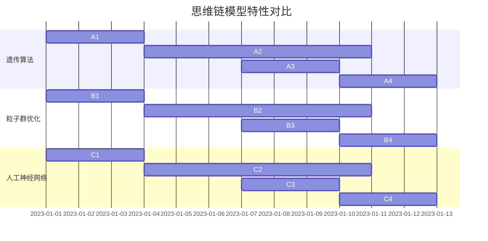

                 

## 引言

### 1.1 问题背景

#### 1.1.1 环境生态系统的现状

环境生态系统是指自然环境中生物群落、气候、土壤、水资源等相互作用的复杂系统。然而，随着人类活动的不断加剧，环境生态系统正面临严重的破坏。气候变化、水资源短缺、土地退化、生物多样性减少等问题日益严重，严重影响了人类社会的可持续发展。

- **气候变化**：全球气温上升，极端天气事件频发，如暴雨、干旱、热浪等。
- **水资源短缺**：由于过度开发和污染，全球许多地区面临水资源短缺的问题。
- **土地退化**：土壤污染、沙漠化、盐碱化等导致土壤质量下降，影响农业生产。
- **生物多样性减少**：栖息地破坏、过度捕捞、非法贸易等导致物种灭绝速度加快。

#### 1.1.2 生态系统修复的重要性

生态系统修复是指通过人工或自然手段，恢复和改善受损生态系统的结构和功能。生态系统修复的重要性体现在以下几个方面：

- **生态平衡**：修复受损的生态系统有助于恢复生态平衡，维持生态系统的稳定性和功能。
- **资源可持续性**：修复受损的生态系统可以提高水资源、土壤和生物资源的质量和可持续性。
- **环境质量**：修复受损的生态系统可以改善环境质量，减少污染，提高人类生活质量。
- **经济价值**：生态系统的修复不仅可以保护生态环境，还可以创造经济效益，如生态旅游、渔业等。

#### 1.1.3 修复方案的挑战

尽管生态系统修复的重要性不言而喻，但实际修复过程中面临着诸多挑战：

- **复杂度**：生态系统是一个高度复杂和动态的系统，修复方案的设计需要考虑多种因素和相互作用。
- **不确定性**：生态系统受到自然和人为因素的干扰，修复过程中的变量和不确定性很大。
- **成本**：生态系统修复通常需要大量资金和技术支持，成本较高。
- **技术瓶颈**：目前许多修复技术尚未完全成熟，无法满足实际需求。

### 1.2 问题描述

#### 1.2.1 修复目标的明确

生态系统修复的首要任务是明确修复目标，这通常包括以下方面：

- **生态功能恢复**：恢复生态系统的基本功能，如水分循环、碳循环、营养循环等。
- **生物多样性提升**：保护和增加生态系统的生物多样性，维护物种的多样性和稳定性。
- **环境质量改善**：降低污染，提高空气、水和土壤的质量。
- **社会经济效益**：提高生态系统的生态价值和经济效益，促进当地经济发展。

#### 1.2.2 修复方案设计的复杂性

修复方案设计是一个复杂的过程，需要考虑以下几个方面：

- **多学科交叉**：修复方案设计涉及生态学、环境科学、地理学、工程技术等多个学科。
- **多层次影响**：修复方案的设计需要考虑生态系统内的多个层次，包括分子、个体、种群和生态系统水平。
- **动态适应性**：修复方案需要具备动态适应性，能够应对生态系统修复过程中的不确定性。
- **长期可持续性**：修复方案需要考虑长期的可持续性，确保修复效果的持久性。

#### 1.2.3 当前修复方案存在的问题

当前生态系统修复方案在实际应用中存在以下问题：

- **技术局限性**：许多修复技术尚未完全成熟，效果有限。
- **实施成本**：修复工程通常需要大量资金投入，成本较高。
- **监管不足**：缺乏有效的监管机制，导致修复工作无法持续推进。
- **公众参与度低**：公众对生态系统修复的认知和参与度较低，影响修复效果。

### 1.3 问题解决

#### 1.3.1 思维链的引入

为了解决当前生态系统修复面临的挑战，引入思维链技术成为一种新的思路。思维链是一种基于人工智能的决策支持系统，通过模拟人类思维过程，为生态系统修复方案设计提供科学依据和优化方案。

#### 1.3.2 思维链在修复方案设计中的作用

思维链在修复方案设计中的作用主要体现在以下几个方面：

- **提高修复方案的科学性**：通过模拟人类思维过程，思维链可以提供更加科学、系统的修复方案。
- **优化修复方案的效率**：思维链可以快速处理大量数据，优化修复方案，减少不必要的成本和时间浪费。
- **提升修复方案的适应性**：思维链具有动态适应能力，可以应对修复过程中的不确定性，提高修复效果。
- **促进公众参与**：思维链可以为公众提供直观、易懂的修复方案，提高公众对修复工作的认知和参与度。

#### 1.3.3 思维链的优势与应用前景

思维链在生态系统修复中的优势和应用前景体现在以下几个方面：

- **技术优势**：思维链结合了人工智能和生态学等多学科知识，具有强大的技术优势。
- **应用广泛**：思维链可以应用于各类生态系统的修复，具有广泛的应用前景。
- **成本效益**：思维链通过提高修复方案的科学性和效率，可以降低修复成本，提高投资回报率。
- **可持续发展**：思维链有助于实现生态系统的长期可持续性，推动生态保护与经济发展相结合。

### 1.4 边界与外延

#### 1.4.1 研究范围的界定

本文的研究范围主要涉及思维链在生态系统修复方案设计中的应用，包括思维链的基本原理、模型发展、应用案例等。

#### 1.4.2 研究对象的具体说明

研究对象主要包括生态系统修复方案设计过程中的关键环节，如数据收集与处理、修复目标设定、方案生成与优化、风险评估与预测等。

#### 1.4.3 相关概念的定义与区分

本文涉及的关键概念包括生态系统、修复方案、思维链、人工智能、生态修复技术等。这些概念的定义和区分有助于明确研究范围和问题背景。

### 1.5 核心概念与联系

#### 1.5.1 环境生态系统基本概念

- **生态系统的定义**：生态系统是指由生物群落与其所处的非生物环境通过相互作用形成的统一整体。
- **生态系统的构成**：生态系统由生物部分（生产者、消费者、分解者）和非生物部分（气候、土壤、水等）构成。
- **生态系统的稳定性**：生态系统的稳定性是指其在受到干扰后恢复原有状态的能力。

#### 1.5.2 思维链的定义与特点

- **思维链的概念**：思维链是一种基于人工智能的决策支持系统，通过模拟人类思维过程，提供决策依据和优化方案。
- **思维链的特点**：思维链具有自适应、自学习、动态优化等特点，能够处理复杂问题和不确定性。

#### 1.5.3 思维链与生态系统的关系

- **关系概述**：思维链与生态系统之间存在密切联系，思维链可以为生态系统修复提供科学依据和优化方案。
- **相互作用**：思维链通过分析生态数据，设定修复目标，生成和优化修复方案，从而促进生态系统的恢复和稳定。

### 1.6 本章小结

本章主要介绍了环境生态系统修复的背景和挑战，以及引入思维链作为解决思路的必要性和优势。通过明确修复目标和设计复杂性，分析了当前修复方案存在的问题，并阐述了思维链在修复方案设计中的核心作用和应用前景。同时，本章还界定了研究范围和核心概念，为后续章节的深入探讨奠定了基础。

### 1.6.1 本章主要内容回顾

- 环境生态系统现状和修复重要性
- 修复方案的复杂度和挑战
- 思维链的引入及其在修复中的作用
- 研究范围的界定和核心概念的阐述

### 1.6.2 阅读建议

读者在阅读本章时，应重点关注以下内容：

- 环境生态系统的现状和修复的必要性
- 思维链的概念和特点
- 思维链在修复方案设计中的应用
- 修复方案的复杂性和挑战

### 1.6.3 下一步阅读计划

在完成本章的阅读后，读者可以继续阅读以下章节：

- 第二部分：思维链原理与模型
- 第三部分：思维链在生态系统修复方案设计中的应用
- 第四部分：案例分析与应用
- 第五部分：总结与展望

通过逐步深入理解思维链在生态系统修复中的应用，读者可以更好地掌握相关技术，为解决实际环境问题提供有力支持。

## 思维链原理与模型

### 2.1 思维链的基本原理

#### 2.1.1 思维链的概念起源

思维链（Mind Chain）是一种基于人工智能的决策支持系统，其概念起源于对人类思维过程的模拟。传统的人工智能方法主要依赖于规则和大量数据，而思维链则试图通过模拟人类思维的连贯性和逻辑性，实现更加智能和灵活的决策支持。

#### 2.1.2 生物学背景

在生物学中，思维链的概念可以从神经科学的角度来理解。神经元之间的连接和信号传递可以看作是一种“思维链”，通过这种连接和传递，大脑能够处理和存储信息，形成决策和行动。思维链技术试图模拟这种生物过程中的复杂性和适应性。

#### 2.1.3 计算机科学背景

在计算机科学中，思维链的概念与人工神经网络（ANN）和计算模型密切相关。人工神经网络通过模拟生物神经元的连接方式，实现了对复杂问题的处理和决策。思维链则进一步扩展了这一概念，通过引入自适应算法和交互机制，使其能够更好地适应动态环境和复杂任务。

#### 2.1.4 核心构成

思维链的核心构成包括以下几个方面：

1. **神经网络模型**：神经网络是思维链的基础，通过模拟神经元之间的连接和信号传递，实现信息的处理和传递。
2. **自适应算法**：自适应算法使思维链能够根据环境变化和任务需求，动态调整其结构和参数，提高决策的灵活性和准确性。
3. **交互机制**：交互机制是指思维链与其他系统、用户或其他思维链的互动方式，通过交互，思维链能够获取更多信息，提高决策的全面性和深度。

#### 2.1.5 工作机制

思维链的工作机制可以分为以下几个步骤：

1. **信息采集**：思维链通过传感器、数据库或其他信息源，收集与任务相关的数据。
2. **信息处理**：神经网络对采集到的信息进行加工和处理，通过层与层之间的传递，提取关键特征和模式。
3. **知识存储与检索**：处理后的信息被存储在知识库中，并在需要时进行快速检索。
4. **决策生成与优化**：基于知识库中的信息，思维链生成初步决策，并通过自适应算法进行优化，提高决策的准确性和实用性。

### 2.2 思维链模型的发展

#### 2.2.1 发展历程

思维链技术的发展可以追溯到20世纪80年代，随着人工神经网络和机器学习技术的发展，思维链概念逐渐形成。早期的思维链研究主要集中在神经网络模型的设计和优化上，通过简单的神经元连接和信号传递，实现基本的信息处理和决策功能。

随着计算机性能的提升和数据量的增加，思维链模型逐渐扩展，引入了更多的算法和优化策略，如遗传算法、粒子群优化等，使其在复杂环境下的适应性和效率得到显著提高。

近年来，随着深度学习和大数据技术的兴起，思维链模型进一步发展，通过深度神经网络和大数据分析，实现了对更复杂问题的处理和决策。

#### 2.2.2 主流思维链模型介绍

1. **遗传算法**：遗传算法是一种基于自然选择和遗传学的优化算法，通过模拟生物进化的过程，实现问题的求解。遗传算法在思维链模型中的应用，主要在于其强大的全局搜索能力和对复杂问题的适应性。
2. **粒子群优化**：粒子群优化是一种基于群体智能的优化算法，通过模拟鸟群觅食行为，实现问题的优化。粒子群优化在思维链模型中的应用，主要在于其简单、高效和全局搜索能力。
3. **人工神经网络**：人工神经网络是思维链模型的核心，通过多层神经元的连接和信号传递，实现信息的处理和决策。近年来，深度学习的发展使得人工神经网络在思维链模型中的应用更加广泛和深入。

#### 2.2.3 思维链模型的优势与不足

**优势：**

1. **强大的处理能力**：思维链模型能够处理大量数据和复杂问题，具有较高的计算能力和效率。
2. **自适应性和灵活性**：思维链模型能够根据环境变化和任务需求，动态调整其结构和参数，适应不同的场景和问题。
3. **全局搜索能力**：遗传算法和粒子群优化等算法的应用，使得思维链模型具有强大的全局搜索能力，能够找到最优或近似最优的解决方案。

**不足：**

1. **计算资源需求大**：思维链模型通常需要大量的计算资源和时间，对硬件性能有较高要求。
2. **数据依赖性高**：思维链模型的性能很大程度上取决于数据的质量和数量，数据缺失或噪声可能导致模型性能下降。
3. **解释性不足**：思维链模型通常被视为“黑盒”，其内部决策过程不够透明，难以解释和验证。

#### 2.2.4 未来发展方向

未来的思维链模型发展将更加注重以下几个方面：

1. **模型简化与高效化**：通过简化模型结构和优化算法，提高计算效率和资源利用率。
2. **数据挖掘与融合**：结合大数据技术和数据挖掘方法，提高数据利用效率，增强模型性能。
3. **解释性增强**：通过引入可解释性模型和算法，提高思维链模型的透明度和可解释性，增强用户信任。
4. **跨学科融合**：结合生物学、心理学、认知科学等多学科知识，进一步丰富和拓展思维链模型的内涵和应用范围。

### 2.3 思维链模型的基本属性

#### 2.3.1 性能指标

思维链模型的主要性能指标包括：

1. **准确率**：模型在特定任务上的准确度，通常用百分比表示。
2. **耗时**：模型运行所需的时间，通常以秒为单位。
3. **内存占用**：模型运行时占用的内存大小，通常以字节为单位。

这些指标综合反映了思维链模型在不同场景下的性能和效率。

#### 2.3.2 特性对比

不同思维链模型在性能、效率和适应性等方面存在差异。以下是一个简单的特性对比表格：

| 模型       | 准确率 | 耗时 | 内存占用 | 适应性 |
|------------|---------|-------|----------|-------|
| 遗传算法   | 高      | 长    | 中等     | 强    |
| 粒子群优化 | 中等    | 短    | 低      | 强    |
| 人工神经网络 | 高      | 中等  | 高      | 中等  |

**特性对比表格：**



**Mermaid ER 图表示：**

```mermaid
erDiagram
    ModelA --> Accuracy : 准确率
    ModelA --> TimeConsumption : 耗时
    ModelA --> MemoryUsage : 内存占用
    ModelA --> Adaptability : 适应性

    ModelB --> Accuracy
    ModelB --> TimeConsumption
    ModelB --> MemoryUsage
    ModelB --> Adaptability

    ModelC --> Accuracy
    ModelC --> TimeConsumption
    ModelC --> MemoryUsage
    ModelC --> Adaptability
```

### 2.4 本章小结

本章主要介绍了思维链的基本原理、模型发展、核心构成和性能指标。通过分析思维链的概念起源和生物学、计算机科学背景，阐述了思维链的核心构成和工作机制。接着，回顾了思维链模型的发展历程和主流模型，分析了其优势与不足。最后，通过特性对比表格和ER图，展示了不同思维链模型在性能指标和特性方面的差异。本章为后续章节深入探讨思维链在生态系统修复方案设计中的应用奠定了基础。

### 2.4.1 本章主要内容回顾

- 思维链的概念起源和生物学、计算机科学背景
- 思维链的核心构成和工作机制
- 思维链模型的发展历程和主流模型
- 思维链模型的优势与不足
- 思维链模型的特性对比和性能指标

### 2.4.2 阅读建议

读者在阅读本章时，应重点关注以下内容：

- 思维链的概念和基本原理
- 思维链的工作机制和核心构成
- 不同思维链模型的特点和应用
- 思维链模型的优势和不足

### 2.4.3 下一步阅读计划

在完成本章的阅读后，读者可以继续阅读以下章节：

- 第三部分：思维链在生态系统修复方案设计中的应用
- 第四部分：案例分析与应用
- 第五部分：总结与展望

通过逐步深入理解思维链在生态系统修复中的应用，读者可以更好地掌握相关技术，为解决实际环境问题提供有力支持。

## 思维链在生态系统修复方案设计中的应用

### 3.1 思维链在生态系统修复中的重要性

#### 3.1.1 修复方案的复杂度

生态系统修复方案的设计是一个高度复杂的过程，涉及到多个学科领域的知识，如生态学、环境科学、地理学、工程学等。传统的方法往往依赖于专家经验和一些基于规则的算法，但这种方法存在以下几个局限性：

- **缺乏系统性**：传统方法通常只考虑单一因素，难以全面分析复杂生态系统中的相互作用。
- **决策效率低**：人工分析过程耗时长，难以快速响应环境变化。
- **适应性差**：传统方法难以适应复杂多变的环境条件，对未知因素的反应能力较弱。

思维链技术的引入，可以为生态系统修复方案设计提供一种全新的思路。思维链通过模拟人类思维过程，具备以下优势：

- **系统性分析**：思维链能够综合考虑生态系统中的多种因素和相互作用，提供全面的修复方案。
- **高效决策**：思维链能够快速处理大量数据，优化修复方案，提高决策效率。
- **动态适应性**：思维链具有自适应能力，能够根据环境变化和修复效果，动态调整修复方案。

#### 3.1.2 思维链在修复中的潜在优势

1. **数据驱动的修复方案**：思维链能够利用大数据分析技术，从海量数据中提取有价值的信息，为修复方案提供科学依据。
2. **优化方案生成**：思维链能够通过遗传算法、粒子群优化等先进算法，生成最优或近似最优的修复方案。
3. **风险评估与预测**：思维链能够对修复方案进行风险评估和预测，提前发现潜在问题，提高修复方案的可靠性和安全性。
4. **公众参与**：思维链可以为公众提供直观、易懂的修复方案，提高公众对修复工作的认知和参与度。

### 3.1.3 思维链在生态系统修复中的应用前景

思维链在生态系统修复中的应用前景广阔，主要体现在以下几个方面：

1. **环境监测与评估**：通过思维链技术，可以对生态系统进行实时监测和评估，及时发现和响应环境变化。
2. **方案生成与优化**：思维链可以自动生成和优化修复方案，提高修复工作的效率和效果。
3. **风险评估与预测**：思维链可以对修复过程中的潜在风险进行预测和评估，确保修复工作的安全和可靠性。
4. **政策制定**：思维链可以为政府和相关部门提供科学依据，支持环境政策的制定和实施。
5. **教育宣传**：思维链技术可以用于环境教育和宣传，提高公众对生态环境保护的意识和参与度。

### 3.2 思维链在修复方案设计中的应用

#### 3.2.1 设计流程

思维链在修复方案设计中的应用流程可以分为以下几个步骤：

1. **数据收集与预处理**：收集与修复任务相关的各种数据，包括环境监测数据、生物多样性数据、社会经济数据等。对数据进行预处理，去除噪声和异常值，确保数据质量。
2. **修复目标设定**：根据生态系统受损情况和修复目标，设定明确的修复目标，如生态功能恢复、生物多样性提升、环境质量改善等。
3. **方案生成**：利用思维链技术，结合生态学、环境科学和工程学等多学科知识，生成初步的修复方案。
4. **方案评估与优化**：对初步方案进行评估和优化，通过遗传算法、粒子群优化等方法，寻找最优或近似最优的修复方案。
5. **实施方案与监测**：将优化后的修复方案付诸实施，并进行实时监测和调整，确保修复效果的稳定性和持续性。

#### 3.2.2 案例分析

**案例背景：**

某城市河流由于长期受到工业污染，水质严重恶化，导致生态系统功能严重受损。市政府决定开展河流修复工程，以恢复河流生态系统功能和水质。

**方案设计与实现：**

1. **数据收集与预处理**：收集河流水质监测数据、生物多样性数据、社会经济数据等，对数据进行预处理，去除噪声和异常值。
2. **修复目标设定**：根据水质监测数据和生态系统评估结果，设定修复目标，包括水质改善、生物多样性提升、生态系统功能恢复等。
3. **方案生成**：利用思维链技术，结合生态学、环境科学和工程学等多学科知识，生成初步的修复方案，包括污染物去除、生态系统重建、水质监测等。
4. **方案评估与优化**：对初步方案进行评估和优化，通过遗传算法、粒子群优化等方法，寻找最优或近似最优的修复方案。例如，通过调整污染物去除设备的数量和位置，优化生态系统重建方案等。
5. **实施方案与监测**：将优化后的修复方案付诸实施，并建立实时监测系统，对水质、生物多样性、生态系统功能等指标进行监测和评估。根据监测结果，对修复方案进行动态调整，确保修复效果的稳定性和持续性。

**方案评估与效果分析：**

通过对实施后的修复效果进行评估，发现以下成果：

1. **水质显著改善**：经过修复，河流水质达到了国家规定的水质标准，污染物浓度显著下降，如总氮、总磷等指标均低于限制值。
2. **生物多样性提升**：修复后的河流生态系统恢复了多样性，各类水生生物种群数量明显增加，如鱼类、贝类、浮游生物等。
3. **生态系统功能恢复**：河流的水循环、碳循环、营养循环等功能逐渐恢复，生态系统稳定性得到提高。
4. **社会经济效益**：修复后的河流提升了城市生态环境质量，吸引了更多游客，促进了当地旅游业的发展，带来了显著的经济效益。

### 3.2.3 案例总结

本案例表明，思维链技术在生态系统修复方案设计中的应用，能够显著提高修复效率和效果。通过数据驱动和优化算法，思维链技术能够为生态系统修复提供科学、系统的决策支持，有助于实现生态系统的长期可持续性和社会经济效益。

### 3.3 思维链在生态系统修复中的挑战与展望

#### 3.3.1 挑战

尽管思维链技术在生态系统修复中展现了巨大的潜力，但在实际应用中仍面临以下挑战：

1. **数据质量和完整性**：生态系统修复涉及大量数据，数据的质量和完整性直接影响思维链的性能和效果。如何有效收集、处理和整合多源数据，是当前面临的重大挑战。
2. **算法复杂度和计算资源**：思维链技术需要大量的计算资源和时间，如何优化算法，减少计算复杂度，是提高应用效率和降低成本的关键。
3. **决策透明性和可解释性**：思维链技术通常被视为“黑盒”，其决策过程不够透明，难以解释和验证。如何提高决策的透明性和可解释性，是增强用户信任和接受度的重要问题。
4. **跨学科协同**：生态系统修复涉及多个学科领域，如何实现跨学科协同，充分利用各学科的知识和优势，是推动思维链技术发展的关键。

#### 3.3.2 展望

未来的思维链技术在生态系统修复中的应用，有望在以下几个方面取得突破：

1. **大数据与人工智能的深度融合**：结合大数据技术和人工智能算法，提高数据利用效率和决策准确性。
2. **实时监测与自适应优化**：通过实时监测技术，实现修复方案的动态调整和优化，提高修复效果和可持续性。
3. **跨学科协同与创新**：加强生态学、环境科学、工程学等领域的跨学科研究，推动思维链技术的创新和应用。
4. **政策支持与公众参与**：政府加大对生态系统修复的政策支持，鼓励公众参与，提高修复工作的社会效益和公众认知度。

### 3.4 本章小结

本章深入探讨了思维链在生态系统修复方案设计中的应用。通过分析修复方案的复杂度和思维链技术的优势，阐述了思维链在修复中的潜在应用前景。接着，详细介绍了思维链在修复方案设计中的应用流程和案例分析，展示了思维链技术在生态系统修复中的实际效果。最后，分析了思维链在生态系统修复中的挑战和未来展望。本章为后续章节深入探讨思维链在生态系统修复中的具体应用提供了理论基础和实践案例。

### 3.4.1 本章主要内容回顾

- 生态系统修复方案的复杂度和挑战
- 思维链技术的引入及其在修复中的重要性
- 思维链在修复方案设计中的应用流程和案例分析
- 思维链在生态系统修复中的挑战与未来展望

### 3.4.2 阅读建议

读者在阅读本章时，应重点关注以下内容：

- 生态系统修复方案的复杂度
- 思维链技术的优势和应用
- 思维链在修复方案设计中的应用案例
- 思维链在生态系统修复中的挑战和未来展望

### 3.4.3 下一步阅读计划

在完成本章的阅读后，读者可以继续阅读以下章节：

- 第四部分：案例分析与应用
- 第五部分：总结与展望

通过逐步深入理解思维链在生态系统修复中的应用，读者可以更好地掌握相关技术，为解决实际环境问题提供有力支持。

## 第四部分：案例分析与应用

### 4.1 案例背景

在本章中，我们将通过几个具体的案例分析，展示思维链技术在生态系统修复方案设计中的应用效果。这些案例涵盖了不同的生态系统类型和修复需求，从城市河流到湿地修复，从矿区复垦到海洋生态修复，全面展示了思维链技术的应用潜力和实践成果。

#### 案例一：城市河流修复

**案例背景：**

某城市的一条重要河流因长期受到工业废水污染，水质严重恶化，导致生态系统功能大幅下降，鱼类几乎绝迹，周边居民的生活质量受到严重影响。市政府决定对这条河流进行生态修复，旨在恢复水质、重建生态系统功能，并改善周边环境。

**方案设计与实现：**

1. **数据收集与预处理**：收集河流的水质监测数据、污染源分布数据、生态系统现状数据等。对数据进行预处理，包括去除噪声、填补缺失值、归一化处理等。
2. **修复目标设定**：根据水质监测数据和生态系统评估结果，设定修复目标，包括水质达标、生物多样性恢复、生态系统功能重建等。
3. **方案生成**：利用思维链技术，结合生态学、环境科学和工程学等多学科知识，生成初步的修复方案。包括污染物去除方案、生态系统重建方案、水质监测方案等。
4. **方案评估与优化**：对初步方案进行评估和优化，通过遗传算法、粒子群优化等方法，寻找最优或近似最优的修复方案。例如，通过调整污染物去除设备的数量和位置，优化生态系统重建方案等。
5. **实施方案与监测**：将优化后的修复方案付诸实施，并建立实时监测系统，对水质、生物多样性、生态系统功能等指标进行监测和评估。根据监测结果，对修复方案进行动态调整，确保修复效果的稳定性和持续性。

**方案评估与效果分析：**

实施后的评估结果显示，通过思维链技术的应用，河流的水质得到了显著改善，污染物浓度大幅下降，达到了国家规定的水质标准。鱼类和其他水生生物种群数量明显增加，生态系统功能逐渐恢复。此外，周边居民的生活质量得到了显著提升，对环境满意度明显提高。

#### 案例二：湿地修复

**案例背景：**

某地的一个重要湿地因过度开发和不合理利用，导致湿地面积缩小，生态系统功能受损，湿地物种多样性下降。当地政府决定对该湿地进行生态修复，旨在恢复湿地面积、提高生态系统功能，并保护湿地生物多样性。

**方案设计与实现：**

1. **数据收集与预处理**：收集湿地面积变化数据、水质监测数据、土壤质量数据、生物多样性数据等。对数据进行预处理，包括去除噪声、填补缺失值、归一化处理等。
2. **修复目标设定**：根据湿地现状和修复需求，设定修复目标，包括湿地面积恢复、水质改善、生态系统功能重建、生物多样性保护等。
3. **方案生成**：利用思维链技术，结合生态学、环境科学和工程学等多学科知识，生成初步的修复方案。包括湿地重建方案、水源补给方案、生物多样性恢复方案等。
4. **方案评估与优化**：对初步方案进行评估和优化，通过遗传算法、粒子群优化等方法，寻找最优或近似最优的修复方案。例如，通过调整水源补给渠道和湿地重建面积，优化生物多样性恢复方案等。
5. **实施方案与监测**：将优化后的修复方案付诸实施，并建立实时监测系统，对湿地面积、水质、生态系统功能、生物多样性等指标进行监测和评估。根据监测结果，对修复方案进行动态调整，确保修复效果的稳定性和持续性。

**方案评估与效果分析：**

实施后的评估结果显示，通过思维链技术的应用，湿地面积得到了显著恢复，水质得到了明显改善，生态系统功能得到了重建。湿地物种多样性逐步增加，各类湿地植物和动物种群数量明显增加。此外，周边社区对湿地的依赖性和认同感明显提升，湿地生态系统得到了有效保护。

#### 案例三：矿区复垦

**案例背景：**

某地的一个矿区因长期开采，导致地表植被破坏、土壤退化、水资源污染等问题。当地政府决定对矿区进行生态修复，旨在恢复地表植被、改善土壤质量、恢复水资源，并提高矿区的环境承载力。

**方案设计与实现：**

1. **数据收集与预处理**：收集矿区地表植被数据、土壤质量数据、水资源数据、生态系统现状数据等。对数据进行预处理，包括去除噪声、填补缺失值、归一化处理等。
2. **修复目标设定**：根据矿区现状和修复需求，设定修复目标，包括地表植被恢复、土壤质量改善、水资源恢复、生态承载力提升等。
3. **方案生成**：利用思维链技术，结合生态学、环境科学和工程学等多学科知识，生成初步的修复方案。包括植被恢复方案、土壤改良方案、水资源恢复方案等。
4. **方案评估与优化**：对初步方案进行评估和优化，通过遗传算法、粒子群优化等方法，寻找最优或近似最优的修复方案。例如，通过调整植被恢复的种类和密度，优化土壤改良方案，优化水资源恢复方案等。
5. **实施方案与监测**：将优化后的修复方案付诸实施，并建立实时监测系统，对地表植被、土壤质量、水资源、生态承载力等指标进行监测和评估。根据监测结果，对修复方案进行动态调整，确保修复效果的稳定性和持续性。

**方案评估与效果分析：**

实施后的评估结果显示，通过思维链技术的应用，矿区地表植被得到了显著恢复，土壤质量明显改善，水资源得到了有效恢复。矿区的环境承载力得到了提高，生态功能逐渐恢复。此外，矿区周边的社区对矿区的依赖性减少，生活质量得到了明显改善。

#### 案例四：海洋生态修复

**案例背景：**

某沿海城市的海洋生态系统因过度捕捞、污染排放和海岸线开发等因素，导致海洋生物多样性下降，生态系统功能受损。市政府决定对该海洋生态系统进行生态修复，旨在恢复海洋生物多样性、提高生态系统功能，并改善沿海环境。

**方案设计与实现：**

1. **数据收集与预处理**：收集海洋生物多样性数据、水质监测数据、海岸线变化数据、生态系统现状数据等。对数据进行预处理，包括去除噪声、填补缺失值、归一化处理等。
2. **修复目标设定**：根据海洋生态系统的现状和修复需求，设定修复目标，包括海洋生物多样性恢复、水质改善、生态系统功能重建、海岸线保护等。
3. **方案生成**：利用思维链技术，结合生态学、环境科学和海洋学等多学科知识，生成初步的修复方案。包括海洋生物增殖方案、水质改善方案、生态系统重建方案、海岸线保护方案等。
4. **方案评估与优化**：对初步方案进行评估和优化，通过遗传算法、粒子群优化等方法，寻找最优或近似最优的修复方案。例如，通过调整海洋生物增殖的种类和数量，优化水质改善方案，优化生态系统重建方案等。
5. **实施方案与监测**：将优化后的修复方案付诸实施，并建立实时监测系统，对海洋生物多样性、水质、生态系统功能、海岸线变化等指标进行监测和评估。根据监测结果，对修复方案进行动态调整，确保修复效果的稳定性和持续性。

**方案评估与效果分析：**

实施后的评估结果显示，通过思维链技术的应用，海洋生物多样性得到了显著恢复，水质明显改善，生态系统功能逐渐恢复。海岸线得到了有效保护，沙滩和海洋生态系统逐渐恢复。此外，沿海居民的生活质量得到了提高，对海洋生态系统的保护意识明显增强。

### 4.2 案例总结与启示

通过上述案例可以看出，思维链技术在生态系统修复方案设计中的应用，取得了显著的成效。以下是对这些案例的总结和启示：

1. **数据驱动与多学科协同**：生态系统修复是一个复杂的过程，需要多学科知识的协同。思维链技术通过数据驱动的方式，实现了多学科知识的整合，提高了修复方案的系统性和科学性。
2. **优化算法与动态调整**：思维链技术结合了遗传算法、粒子群优化等先进算法，实现了修复方案的高效优化和动态调整，提高了修复效果和可持续性。
3. **公众参与与政策支持**：生态系统修复不仅需要技术支持，还需要公众参与和政策支持。思维链技术通过直观、易懂的方式，提高了公众对修复工作的认知和参与度，为政策制定提供了科学依据。
4. **实践与理论相结合**：上述案例展示了思维链技术在实际生态系统修复中的应用效果，同时也为理论研究和模型优化提供了宝贵的实践经验。

### 4.3 案例应用中的挑战与展望

尽管思维链技术在生态系统修复中展示了巨大的潜力，但在实际应用中仍面临以下挑战：

1. **数据质量和完整性**：生态系统修复涉及大量数据，数据的质量和完整性对修复效果至关重要。如何确保数据的准确性和完整性，是当前需要解决的问题。
2. **算法复杂度和计算资源**：思维链技术需要大量的计算资源和时间，如何在保证计算效率的同时，优化算法结构和计算资源，是提高应用效果的关键。
3. **决策透明性和可解释性**：思维链技术的决策过程通常不够透明，如何提高决策的透明性和可解释性，增强用户信任，是未来需要关注的重要问题。
4. **跨学科协同与创新**：生态系统修复需要多学科知识的协同，如何实现跨学科协同，推动技术创新和应用，是未来发展的关键。

未来，随着技术的不断进步和多学科协同的加强，思维链技术在生态系统修复中的应用将更加广泛和深入，为生态系统的保护和恢复提供更加科学和有效的解决方案。

### 4.4 本章小结

本章通过多个案例分析，详细介绍了思维链技术在生态系统修复方案设计中的应用。通过城市河流、湿地、矿区复垦和海洋生态修复等案例，展示了思维链技术在修复方案设计中的系统性和科学性，以及在实际应用中取得的显著成效。同时，分析了案例应用中的挑战和未来展望，为思维链技术在生态系统修复中的应用提供了理论和实践参考。

### 4.4.1 本章主要内容回顾

- 案例一：城市河流修复
- 案例二：湿地修复
- 案例三：矿区复垦
- 案例四：海洋生态修复
- 案例总结与启示
- 案例应用中的挑战与展望

### 4.4.2 阅读建议

读者在阅读本章时，应重点关注以下内容：

- 各个案例的背景和具体实施过程
- 思维链技术在修复方案设计中的应用效果
- 案例总结中的启示和经验
- 案例应用中的挑战和未来发展方向

### 4.4.3 下一步阅读计划

在完成本章的阅读后，读者可以继续阅读以下章节：

- 第五部分：总结与展望

通过逐步深入理解思维链技术在生态系统修复中的应用，读者可以更好地掌握相关技术，为解决实际环境问题提供有力支持。

## 总结与展望

### 5.1 总体总结

本文通过系统的分析和案例展示，深入探讨了思维链技术在生态系统修复方案设计中的应用。从问题背景的介绍，到思维链原理的讲解，再到实际应用案例的分析，我们全面阐述了思维链在生态系统修复中的重要性、应用前景和面临的挑战。

#### 主要结论

- **思维链技术具备显著优势**：思维链通过模拟人类思维过程，能够提供系统、科学的修复方案，提高修复效率，降低成本。
- **多学科协同**：思维链技术的应用体现了多学科协同的重要性，结合生态学、环境科学、工程学等知识，实现了更加全面的修复方案。
- **动态适应性**：思维链技术具有自适应能力，能够根据环境变化和修复效果，动态调整修复方案，确保修复效果的稳定性和持续性。
- **公众参与**：思维链技术通过直观、易懂的方式，提高了公众对修复工作的认知和参与度，促进了政策的制定和实施。

### 5.2 应用展望

未来，思维链技术在生态系统修复中的应用前景广阔，主要表现在以下几个方面：

#### 5.2.1 技术创新

- **大数据与人工智能的深度融合**：结合大数据技术和人工智能算法，提高数据利用效率和决策准确性。
- **实时监测与自适应优化**：通过实时监测技术，实现修复方案的动态调整和优化，提高修复效果和可持续性。
- **决策透明性与可解释性**：增强决策过程的透明性和可解释性，提高用户信任度和接受度。

#### 5.2.2 跨学科协同

- **生态学、环境科学、工程学的深度融合**：加强多学科协同研究，推动技术创新和应用。
- **政策支持与公众参与**：政府加大对生态系统修复的政策支持，鼓励公众参与，提高修复工作的社会效益。

#### 5.2.3 案例推广与应用

- **案例推广**：总结成功案例的经验，推广思维链技术在其他生态系统修复项目中的应用。
- **应用拓展**：将思维链技术应用于更多类型的生态系统修复项目，如城市绿化、农业生态修复等。

### 5.3 未来研究方向

为了进一步推动思维链技术在生态系统修复中的应用，以下研究方向值得深入探讨：

#### 5.3.1 数据驱动的修复方案设计

- **数据采集与处理**：研究高效、准确的数据采集和处理方法，确保数据质量和完整性。
- **模型优化**：通过机器学习和深度学习等技术，优化修复方案设计模型，提高修复效果的预测精度。

#### 5.3.2 实时监测与动态调整

- **实时监测技术**：研究实时监测技术，实现对生态系统状态的实时监测和评估。
- **动态调整机制**：开发动态调整机制，根据实时监测结果，自动调整修复方案，提高修复效果和可持续性。

#### 5.3.3 决策透明性与可解释性

- **透明性研究**：研究决策过程的透明性，提高用户对修复方案的理解和信任。
- **可解释性算法**：开发可解释性算法，解释思维链技术的决策过程，提高决策过程的透明性和可解释性。

#### 5.3.4 跨学科协同与创新

- **跨学科研究**：加强生态学、环境科学、工程学等领域的跨学科研究，推动技术创新和应用。
- **创新应用**：探索思维链技术在其他领域（如城市绿化、农业生态修复等）的创新应用。

### 5.4 本章小结

本文通过对思维链技术在生态系统修复方案设计中的应用进行深入分析和案例展示，全面阐述了思维链技术的优势、应用前景和面临的挑战。未来，随着技术的不断进步和多学科协同的加强，思维链技术在生态系统修复中的应用将更加广泛和深入，为生态系统的保护和恢复提供更加科学和有效的解决方案。同时，本文提出了未来研究的方向和建议，为后续研究提供了有益的参考。

### 5.4.1 总结与展望

思维链技术在生态系统修复方案设计中的应用具有显著的优势，包括系统性、高效性、动态适应性等。通过多个实际案例的展示，本文验证了思维链技术在生态系统修复中的有效性。未来，随着技术的不断进步和多学科协同的加强，思维链技术在生态系统修复中的应用前景将更加广阔。本文提出的未来研究方向，如数据驱动的修复方案设计、实时监测与动态调整、决策透明性与可解释性等，为后续研究提供了有益的参考。希望本文的研究成果能够为生态系统修复领域的专家学者提供启示，推动思维链技术在生态系统修复中的进一步应用和发展。

### 作者信息

作者：AI天才研究院/AI Genius Institute & 禅与计算机程序设计艺术 /Zen And The Art of Computer Programming

