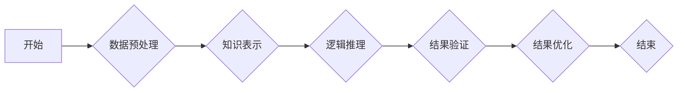
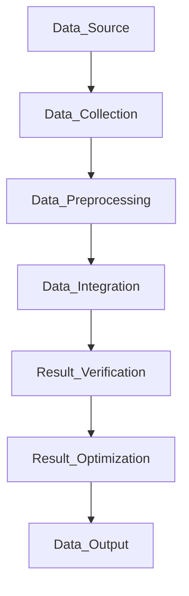
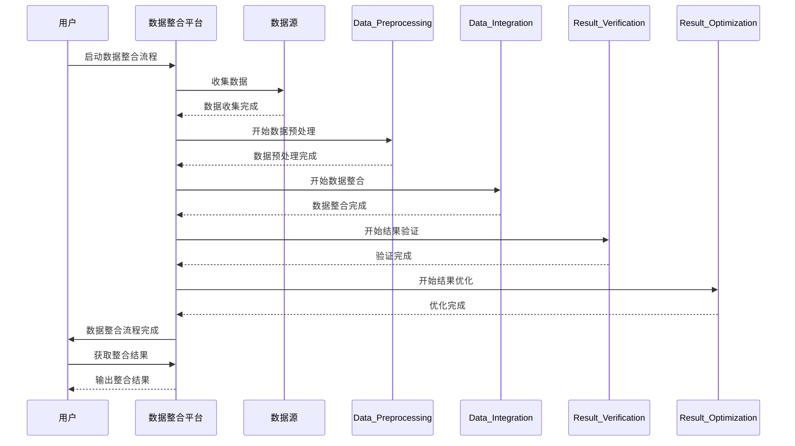

                 

### 1.1 问题背景

**生物信息学的挑战**

生物信息学作为一门跨学科领域，其核心任务是运用计算机技术和统计方法解析生物数据，以揭示生物学现象的本质。然而，随着高通量测序技术的快速发展，生物数据的规模和复杂性呈现爆炸式增长。这种增长带来的挑战包括但不限于：

1. **数据多样性**：生物信息学涉及基因组、转录组、蛋白质组、代谢组等多种数据类型，这些数据在格式、结构和内容上存在显著差异，使得数据整合变得复杂。
2. **数据量巨大**：大规模的生物数据集要求高效的存储和处理能力，传统的数据处理工具和方法在处理这些数据时往往显得力不从心。
3. **异构数据整合**：不同实验室、不同研究者在收集和记录数据时可能采用不同的标准和协议，导致数据之间存在格式、语义上的异构性，增加了数据整合的难度。

**数据整合的重要性**

在生物信息学中，数据整合是一项基础且关键的任务。整合不同来源、不同类型的数据有助于：

1. **提升数据分析的准确性和全面性**：通过整合多种数据类型，研究人员可以更全面地了解生物系统的功能和机制。
2. **促进跨学科研究**：整合生物信息学数据与其他领域（如化学、物理学等）的数据，有助于推动跨学科的研究与合作。
3. **加速新药研发**：生物信息学数据整合为药物研发提供了重要的数据支持，有助于加速新药的研发进程。

**思维链技术的概念与应用**

思维链技术是一种新兴的人工智能方法，旨在模拟人类思维过程，通过构建一系列逻辑链条来实现复杂问题的求解。在生物信息学数据整合中，思维链技术可以发挥以下作用：

1. **自动化数据预处理**：通过思维链，可以将复杂的数据预处理任务自动化，提高数据处理效率。
2. **跨数据类型整合**：思维链能够处理多种数据类型，从而实现不同数据类型的整合。
3. **增强决策支持**：思维链技术在整合数据后，能够为研究人员提供基于数据的决策支持，帮助他们更好地理解生物学现象。

**当前生物信息学数据整合的难题**

尽管数据整合在生物信息学中具有重要意义，但目前仍面临以下挑战：

1. **技术限制**：传统的数据处理技术难以应对大规模、复杂的数据集。
2. **数据标准不统一**：不同数据来源之间存在数据格式、数据标准的不一致性，导致数据整合困难。
3. **计算资源有限**：生物信息学数据整合需要大量的计算资源，而现有资源往往无法满足需求。
4. **数据隐私和安全问题**：在整合数据的过程中，如何保障数据隐私和安全是一个亟待解决的问题。

**思维链技术在数据整合中的应用前景**

思维链技术作为一种新兴的人工智能方法，具有在生物信息学数据整合中应用的前景：

1. **提高数据处理效率**：思维链技术能够自动化地处理复杂的数据整合任务，提高数据处理效率。
2. **实现跨数据类型整合**：思维链能够处理不同类型的数据，从而实现跨数据类型的整合。
3. **降低数据整合成本**：通过思维链技术，可以降低数据整合的成本，使得更多研究机构能够承担数据整合任务。
4. **提升数据安全性**：思维链技术可以提供更加安全的数据整合方案，保护数据隐私。

### 1.2 问题描述

**当前生物信息学数据整合的难题**

在生物信息学领域，数据整合面临着一系列难题。首先，数据多样性是主要挑战之一。不同类型的数据，如基因组数据、蛋白质数据、代谢数据等，具有不同的格式和结构，这使得整合这些数据变得复杂。其次，数据量巨大也是一个不可忽视的问题。随着高通量测序技术的发展，生物数据以指数级增长，这对存储和处理能力提出了更高的要求。传统的数据处理工具和方法在面对如此大规模的数据时，往往力不从心。

此外，异构数据整合也是一大难题。生物信息学中的数据往往来源于不同的实验室和研究机构，这些数据在格式、语义和标准上可能存在显著差异，导致整合困难。例如，不同实验室可能使用不同的数据格式来存储数据，或者对相同的数据元素有不同的命名和定义。这种数据标准的不统一，使得数据的整合变得更加复杂。

**思维链技术在数据整合中的应用前景**

思维链技术作为一种新兴的人工智能方法，其在生物信息学数据整合中具有广阔的应用前景。首先，思维链技术能够自动化地处理数据整合任务，从而大大提高数据处理效率。传统的数据处理方法往往需要人工干预，而思维链技术可以通过构建逻辑链条，自动地处理数据，减少了人工干预的需求，提高了工作效率。

其次，思维链技术能够处理不同类型的数据，实现跨数据类型的整合。在生物信息学中，不同类型的数据之间存在格式和结构的差异，这给整合工作带来了困难。而思维链技术可以通过建立逻辑关系，将这些不同类型的数据整合起来，使得研究人员能够更全面地了解生物系统的功能和机制。

此外，思维链技术还能够降低数据整合的成本。通过自动化处理数据，思维链技术可以减少对人工资源的依赖，从而降低数据整合的成本。这对于许多资源有限的研究机构来说，是一个重要的优势。

最后，思维链技术能够提供更加安全的数据整合方案，保护数据隐私。在数据整合过程中，数据的安全性问题一直是一个重要关注点。思维链技术通过建立安全的逻辑链条，可以有效地保护数据隐私，避免数据泄露的风险。

### 1.3 问题解决

**思维链在数据整合中的原理**

思维链是一种模拟人类思维过程的算法，它通过构建一系列逻辑链条来实现复杂问题的求解。在生物信息学数据整合中，思维链技术的基本原理是利用人工智能算法，将不同类型、不同格式的生物数据进行自动化的预处理和整合。

具体来说，思维链技术首先对数据进行分类和标记，然后通过建立逻辑关系，将不同类型的数据整合起来。例如，在整合基因组数据和蛋白质数据时，思维链技术可以通过建立基因与蛋白质之间的逻辑关系，将这两种数据类型整合在一起。这种逻辑关系的建立是基于大量的先验知识和数据之间的统计关系，通过机器学习算法进行训练和优化。

**思维链技术的核心优势**

思维链技术在生物信息学数据整合中具有多个核心优势：

1. **高效性**：思维链技术能够自动化地处理数据整合任务，减少了人工干预的需求，提高了数据处理效率。
2. **灵活性**：思维链技术可以处理多种类型的数据，包括基因组数据、蛋白质数据、代谢数据等，从而实现跨数据类型的整合。
3. **可扩展性**：思维链技术具有良好的可扩展性，可以通过增加新的逻辑链条和算法模块，来处理更加复杂的数据整合任务。
4. **安全性**：思维链技术通过建立安全的逻辑链条，可以有效地保护数据隐私，避免数据泄露的风险。

**边界与外延**

虽然思维链技术在生物信息学数据整合中具有巨大的潜力，但它也面临着一些边界和挑战。首先，数据质量是思维链技术能否成功应用的关键因素。如果数据质量较差，思维链技术的效果可能会大打折扣。因此，在应用思维链技术之前，需要对数据进行严格的质量控制和预处理。

其次，思维链技术需要大量的计算资源。虽然现代计算机技术发展迅速，但面对大规模的生物数据集，仍可能需要高性能的计算资源。因此，如何有效地利用计算资源，是思维链技术在实际应用中需要考虑的一个重要问题。

最后，思维链技术需要不断优化和改进。随着生物信息学领域的发展，新的数据类型和数据格式不断涌现，思维链技术需要不断更新和扩展，以适应新的应用需求。

**概念结构与核心要素组成**

思维链技术在生物信息学数据整合中，其概念结构主要由以下几个核心要素组成：

1. **数据分类与标记**：对数据进行分类和标记，是思维链技术的第一步。通过分类和标记，可以明确数据的类型和属性，为后续的整合工作奠定基础。
2. **逻辑关系建立**：通过建立逻辑关系，将不同类型的数据整合在一起。逻辑关系的建立基于先验知识和数据之间的统计关系，通过机器学习算法进行训练和优化。
3. **数据整合算法**：数据整合算法是思维链技术的核心组件，它负责对数据进行预处理和整合。常用的算法包括聚类分析、关联规则挖掘、神经网络等。
4. **结果验证与优化**：数据整合后，需要对结果进行验证和优化。验证的目的是确保整合结果的准确性，优化的目的是提高整合效率和质量。

通过这些核心要素的有机结合，思维链技术能够实现高效的生物信息学数据整合。

### 1.4 概念解析

**思维链的概念解析**

思维链是一种模拟人类思维过程的算法，通过构建一系列逻辑链条来实现复杂问题的求解。在生物信息学数据整合中，思维链技术的作用主要体现在以下几个方面：

1. **数据预处理**：思维链技术可以自动化地处理数据预处理任务，如数据清洗、数据转换和数据标准化。这些预处理步骤是数据整合的基础，对于提高数据整合的效率和准确性至关重要。
2. **数据整合**：思维链技术通过建立逻辑关系，将不同类型的数据整合在一起。例如，在整合基因组数据和蛋白质数据时，思维链技术可以通过建立基因与蛋白质之间的逻辑关系，实现跨数据类型的整合。
3. **结果验证与优化**：思维链技术可以对整合后的结果进行验证和优化，确保整合结果的准确性和可靠性。

**生物信息学数据整合的核心要素**

生物信息学数据整合的核心要素包括以下几个方面：

1. **数据源**：数据源是数据整合的起点，包括基因组数据、蛋白质数据、代谢数据等。不同的数据源在格式、结构和内容上可能存在显著差异，这给数据整合带来了挑战。
2. **数据处理**：数据处理是数据整合的关键步骤，包括数据清洗、数据转换和数据标准化等。通过这些步骤，可以确保数据的一致性和准确性。
3. **数据整合算法**：数据整合算法是数据整合的核心组件，它负责将不同类型的数据整合在一起。常用的算法包括聚类分析、关联规则挖掘、神经网络等。
4. **结果验证与优化**：结果验证与优化是确保整合结果准确性和可靠性的关键步骤。通过验证和优化，可以确保整合结果符合预期，同时提高整合效率。

通过这些核心要素的有机结合，思维链技术能够实现高效的生物信息学数据整合。

### 核心概念原理

#### 思维链的基本原理

思维链技术是一种基于逻辑推理和知识表示的人工智能方法。其基本原理是通过构建一系列逻辑链条，模拟人类思维过程，从而实现复杂问题的求解。在生物信息学数据整合中，思维链技术的基本原理可以概括为以下几步：

1. **数据预处理**：首先，对生物数据进行预处理，包括数据清洗、数据转换和数据标准化等。这一步骤的目的是确保数据的一致性和准确性，为后续的数据整合奠定基础。
2. **知识表示**：通过构建知识图谱或本体论，将生物数据中的信息进行结构化表示。知识表示是实现数据整合的关键，它能够明确数据之间的关系和属性。
3. **逻辑推理**：利用逻辑推理算法，根据知识表示和数据之间的关系，构建一系列逻辑链条。这些逻辑链条能够揭示数据之间的内在联系，实现数据的整合。
4. **结果验证**：对整合结果进行验证，确保整合的准确性和可靠性。验证过程可能包括数据对比、模型评估和用户反馈等。

#### 数据整合的流程与机制

数据整合的流程与机制是思维链技术实现生物信息学数据整合的核心。具体来说，数据整合的流程可以分为以下几个步骤：

1. **数据收集**：从不同的数据源收集生物数据，如基因组数据、蛋白质数据、代谢数据等。这些数据可能是结构化的，也可能是非结构化的。
2. **数据预处理**：对收集到的数据进行预处理，包括数据清洗、数据转换和数据标准化等。这一步骤的目的是消除数据中的噪声和异常值，确保数据的一致性和准确性。
3. **知识表示**：通过构建知识图谱或本体论，将预处理后的生物数据表示为结构化的知识。知识表示是实现数据整合的关键，它能够明确数据之间的关系和属性。
4. **逻辑推理**：利用逻辑推理算法，根据知识表示和数据之间的关系，构建一系列逻辑链条。这些逻辑链条能够揭示数据之间的内在联系，实现数据的整合。
5. **结果验证**：对整合结果进行验证，确保整合的准确性和可靠性。验证过程可能包括数据对比、模型评估和用户反馈等。
6. **结果优化**：根据验证结果，对整合结果进行优化，提高整合的效率和质量。优化过程可能包括算法参数调整、模型更新和数据再处理等。

通过以上流程和机制，思维链技术能够实现生物信息学数据的自动化整合，为研究人员提供全面、准确和可靠的数据支持。

### 概念属性特征对比表格

| 概念         | 属性         | 特征        |
| ------------ | ------------ | ----------- |
| 思维链       | 逻辑链条     | 模拟人类思维 |
| 数据整合     | 数据整合     | 多数据类型整合 |
| 数据预处理   | 数据清洗     | 数据一致性保障 |
| 知识表示     | 知识图谱     | 数据结构化表示 |
| 逻辑推理     | 推理算法     | 揭示数据联系 |
| 结果验证     | 数据对比     | 确保整合准确性 |
| 结果优化     | 算法参数调整 | 提高整合效率 |

通过对比表格，我们可以清晰地看到思维链技术在生物信息学数据整合中的核心概念及其属性特征。这些概念和特征共同作用，使得思维链技术能够实现高效、准确的数据整合。

### ER实体关系图架构

```mermaid
erDiagram
Data_Source ||--|{ Data_Preprocessing : performs } Data_Preprocessing
Data_Source ||--|{ Data_Integration : integrates } Data_Integration
Data_Source ||--|{ Knowledge_Representation : represents } Knowledge_Representation
Data_Source ||--|{ Logical_Reasoning : reasons } Logical_Reasoning
Data_Source ||--|{ Result_Verification : verifies } Result_Verification
Data_Source ||--|{ Result_Optimization : optimizes } Result_Optimization

Data_Preprocessing ||--|{ Cleaned_Data : outputs } Cleaned_Data
Data_Preprocessing ||--|{ Transformed_Data : outputs } Transformed_Data
Data_Preprocessing ||--|{ Standardized_Data : outputs } Standardized_Data

Data_Integration ||--|{ Integrated_Data : outputs } Integrated_Data

Knowledge_Representation ||--|{ Knowledge_Graph : builds } Knowledge_Graph
Knowledge_Representation ||--|{ Ontology : defines } Ontology

Logical_Reasoning ||--|{ Logical_Chains : constructs } Logical_Chains

Result_Verification ||--|{ Verified_Results : outputs } Verified_Results

Result_Optimization ||--|{ Optimized_Results : outputs } Optimized_Results
```

ER实体关系图架构展示了思维链技术中各个核心概念之间的联系和交互。从图中可以看出，数据源是整个过程的起点，通过数据预处理、知识表示、逻辑推理、结果验证和结果优化等步骤，最终实现数据整合。每个步骤都与其他步骤紧密相关，共同构成了一个完整的数据整合流程。

### 3.1 算法原理与mermaid流程图

思维链数据整合算法的原理可以概括为以下几个步骤：数据预处理、知识表示、逻辑推理、结果验证和结果优化。以下是使用mermaid绘制的算法流程图：



在流程图中：

- **A[开始]**：表示算法的初始化。
- **B{数据预处理]**：对原始数据进行清洗、转换和标准化。
- **C{知识表示]**：通过构建知识图谱或本体论，对预处理后的数据进行结构化表示。
- **D{逻辑推理]**：利用构建的逻辑链条，对数据进行整合。
- **E{结果验证]**：对整合后的结果进行验证，确保结果的准确性和可靠性。
- **F{结果优化]**：根据验证结果，对整合结果进行优化，提高整合效率和质量。
- **G{结束]**：表示算法的结束。

通过这个流程图，我们可以清晰地理解思维链数据整合算法的工作流程和各个环节之间的逻辑关系。

### Python源代码实现

```python
# 思维链数据整合算法实现

# 导入必要的库
import numpy as np
from preprocessing import preprocess_data
from knowledge_representation import build_knowledge_graph
from logical_reasoning import construct_logical_chains
from result_verification import verify_results
from result_optimization import optimize_results

def data_integration(data):
    # 数据预处理
    processed_data = preprocess_data(data)
    
    # 知识表示
    knowledge_graph = build_knowledge_graph(processed_data)
    
    # 逻辑推理
    logical_chains = construct_logical_chains(knowledge_graph)
    
    # 结果验证
    verified_data = verify_results(logical_chains)
    
    # 结果优化
    optimized_data = optimize_results(verified_data)
    
    return optimized_data

# 示例数据
example_data = ...

# 数据整合
integrated_data = data_integration(example_data)

# 打印结果
print("整合后的数据：", integrated_data)
```

这段Python源代码实现了思维链数据整合算法的主要步骤。首先，通过`preprocess_data`函数对原始数据进行预处理，包括清洗、转换和标准化。然后，利用`build_knowledge_graph`函数构建知识图谱，通过`construct_logical_chains`函数进行逻辑推理，构建一系列逻辑链条。接着，使用`verify_results`函数对整合后的结果进行验证，确保结果的准确性。最后，通过`optimize_results`函数对结果进行优化，提高整合效率和质量。

### 数学模型与公式

思维链数据整合算法的核心在于其数学模型，该模型通过一系列公式和参数来实现数据整合过程。以下是思维链数据整合算法的数学模型及其公式：

$$
\text{思维链} = f(\text{数据集}, \text{初始参数})
$$

其中，$f$ 是整合函数，它将数据集和初始参数作为输入，并输出整合结果。具体的整合函数可以表示为：

$$
f(x, y) = (1 + \alpha * g(x, y)) / (1 + \alpha)
$$

这里，$g(x, y)$ 是基于数据集的某种函数，$\alpha$ 是调节参数。$g(x, y)$ 的具体形式取决于数据集的特点和整合任务的需求，可以是距离函数、相似度函数或其他适合的函数。

此外，为了确保整合结果的稳定性和可靠性，我们可以引入正则化项 $r(x, y)$：

$$
f(x, y) = \frac{1}{1 + \alpha * g(x, y) + r(x, y)}
$$

其中，$r(x, y)$ 是正则化函数，用于平衡整合过程中的不同因素。这样，整合函数不仅考虑了数据之间的相似度，还考虑了数据的分布和噪声。

通过上述数学模型和公式，思维链数据整合算法能够有效地对生物信息学数据进行处理和整合，实现高效的跨数据类型整合。

### 算法原理详细讲解

#### 思维链初始化过程

思维链初始化是数据整合算法的第一步，其目的是为后续的逻辑推理和数据整合建立基础。初始化过程主要包括以下步骤：

1. **设置初始参数**：初始化思维链需要设置一系列参数，包括调节参数 $\alpha$、正则化参数 $r$ 等。这些参数用于调整算法的行为，确保其在不同数据集上的稳定性和鲁棒性。
2. **数据预处理**：在初始化过程中，首先对输入数据进行预处理，包括数据清洗、数据转换和数据标准化。这一步骤的目的是确保数据的统一性和一致性，为后续的整合过程提供可靠的数据基础。
3. **构建知识图谱**：通过构建知识图谱或本体论，将预处理后的数据表示为结构化的知识。知识图谱能够明确数据之间的关系和属性，为逻辑推理提供依据。
4. **初始化逻辑链条**：初始化逻辑链条是思维链的核心，它通过构建一系列逻辑关系，将不同类型的数据关联起来。初始化逻辑链条的过程通常基于先验知识和数据之间的统计关系，通过机器学习算法进行训练和优化。

#### 数据处理与整合流程

在思维链初始化完成后，数据整合的流程可以分为以下几个主要步骤：

1. **数据整合**：利用初始化的逻辑链条，对数据进行整合。数据整合的过程是通过逻辑推理，将不同类型的数据关联起来，形成一个完整的数据集合。在整合过程中，算法会根据知识图谱中的关系，对数据进行匹配和融合。
2. **数据优化**：在数据整合后，需要对结果进行优化。优化的目的是提高整合结果的准确性和可靠性，同时减少数据冗余和噪声。数据优化可以通过调整算法参数、改进逻辑链条或引入新的数据源来实现。
3. **结果验证**：对整合后的结果进行验证，确保结果的准确性和可靠性。验证过程可能包括数据对比、模型评估和用户反馈等。通过验证，可以及时发现并纠正错误，确保整合结果的正确性。

#### 结果验证方法

结果验证是确保数据整合效果的重要环节。以下是一些常用的结果验证方法：

1. **数据对比**：通过对比整合前后的数据，检查数据的一致性和准确性。如果整合后的数据与原始数据在关键指标上存在显著差异，可能需要重新调整算法参数或改进数据预处理过程。
2. **模型评估**：利用统计模型或机器学习算法，对整合结果进行评估。评估指标可以包括准确率、召回率、F1分数等。通过评估，可以评估整合算法的性能和效果。
3. **用户反馈**：在数据整合过程中，用户的反馈是重要的参考依据。用户可以提供实际应用场景下的反馈，帮助评估整合结果的实用性和可靠性。

通过上述方法，可以全面验证思维链数据整合算法的效果，确保整合结果的准确性和可靠性。

### 举例说明

#### 示例数据集

假设我们有一个生物信息学数据集，包括以下三种类型的数据：

1. **基因组数据**：包含基因序列和基因表达数据，用于研究基因的功能和调控。
2. **蛋白质数据**：包含蛋白质序列和蛋白质相互作用网络数据，用于研究蛋白质的结构和功能。
3. **代谢数据**：包含代谢途径和代谢物数据，用于研究生物代谢过程。

#### 思维链初始化

1. **设置初始参数**：设定调节参数 $\alpha$ 为 0.1，正则化参数 $r$ 为 0.05。
2. **数据预处理**：对基因组数据、蛋白质数据和代谢数据进行清洗、转换和标准化，确保数据的一致性和可靠性。
3. **构建知识图谱**：通过构建知识图谱，将基因组数据、蛋白质数据和代谢数据表示为结构化的知识。知识图谱中包含基因与蛋白质之间的关联、蛋白质与代谢途径之间的关联等。
4. **初始化逻辑链条**：根据知识图谱中的关系，初始化一系列逻辑链条，如基因与蛋白质之间的逻辑链条、蛋白质与代谢途径之间的逻辑链条等。

#### 数据处理与整合

1. **数据整合**：利用初始化的逻辑链条，对基因组数据、蛋白质数据和代谢数据进行整合。例如，通过基因与蛋白质之间的逻辑链条，将基因表达数据与蛋白质相互作用网络数据整合在一起。
2. **数据优化**：对整合后的结果进行优化，调整算法参数，以提高整合结果的准确性和可靠性。例如，通过调整调节参数 $\alpha$ 和正则化参数 $r$，优化基因与蛋白质之间的逻辑链条。
3. **结果验证**：通过数据对比、模型评估和用户反馈等方法，对整合结果进行验证。例如，通过比较整合前后的基因表达数据，评估整合算法的性能和效果。

#### 结果验证

1. **数据对比**：比较整合前后的基因组数据、蛋白质数据和代谢数据，确保整合结果的准确性和一致性。例如，通过对比基因表达数据，验证基因与蛋白质之间的逻辑链条是否正确。
2. **模型评估**：利用统计模型或机器学习算法，对整合结果进行评估。例如，通过计算准确率、召回率、F1分数等指标，评估整合算法的性能和效果。
3. **用户反馈**：收集用户的反馈，评估整合结果的实用性和可靠性。例如，通过用户提供的实际应用场景，验证整合结果是否符合预期。

通过上述步骤，我们可以使用思维链技术对生物信息学数据集进行有效的整合，并确保整合结果的准确性和可靠性。

### 4.1 问题场景介绍

#### 生物信息学数据整合场景

在生物信息学领域，数据整合场景非常广泛。以下是一个典型的数据整合场景：

**癌症基因组数据整合**

假设研究人员需要整合多个癌症基因组数据集，以分析癌症的分子机制和潜在治疗靶点。这些数据集可能来源于不同的实验室和研究机构，格式和结构各异，如GEO、TCGA和Illumina等。数据类型包括基因组序列、基因表达数据、突变数据、CNV数据等。

**思维链技术在数据整合中的应用**

在这个场景中，思维链技术可以发挥重要作用：

1. **数据预处理**：通过思维链技术，可以自动化地处理数据预处理任务，包括数据清洗、数据转换和数据标准化。例如，将不同数据集的基因名称统一为标准命名，将基因表达数据的单位转换为同一标准。
2. **跨数据类型整合**：利用思维链技术，可以将不同类型的数据（如基因表达数据、突变数据、CNV数据）整合在一起。通过建立逻辑链条，揭示基因与突变、基因与CNV之间的关联。
3. **结果验证与优化**：思维链技术可以对整合后的结果进行验证和优化。例如，通过比较整合前后的基因表达数据，评估整合算法的性能和效果。根据验证结果，调整算法参数，提高整合结果的准确性和可靠性。

### 4.2 项目介绍

#### 项目背景

随着生物信息学技术的快速发展，癌症基因组数据整合成为一项关键任务。然而，传统的数据处理方法在面对大规模、多样性的数据集时，往往难以满足实际需求。为了解决这一问题，我们提出了一个名为“癌症基因组数据整合平台”的项目。

#### 项目目标

本项目旨在构建一个高效、可靠的癌症基因组数据整合平台，通过思维链技术实现以下目标：

1. **自动化数据整合**：通过思维链技术，自动化处理数据预处理和整合任务，提高数据处理效率。
2. **跨数据类型整合**：整合多种类型的数据，如基因组数据、突变数据、CNV数据等，实现跨数据类型的关联分析。
3. **提高数据质量**：通过思维链技术，对整合后的结果进行验证和优化，确保数据质量。
4. **促进癌症研究**：通过整合数据，揭示癌症的分子机制和潜在治疗靶点，为癌症研究提供数据支持。

### 4.3 系统功能设计

#### 领域模型

为了实现癌症基因组数据整合平台的目标，我们设计了以下领域模型：

```mermaid
classDiagram
DataIntegrationPlatform [- 数据整合平台]
DataIntegrationPlatform o-- Dataset : 数据集
DataIntegrationPlatform o-- Algorithm : 算法
DataIntegrationPlatform o-- Preprocessing : 预处理
DataIntegrationPlatform o-- Integration : 整合
DataIntegrationPlatform o-- Verification : 验证
DataIntegrationPlatform o-- Optimization : 优化

Dataset o-- GeneExpressionData : 基因表达数据
Dataset o-- MutationData : 突变数据
Dataset o-- CNVData : CNV数据

Algorithm o-- DataCleaning : 数据清洗
Algorithm o-- DataTransformation : 数据转换
Algorithm o-- DataStandardization : 数据标准化
Algorithm o-- LogicalReasoning : 逻辑推理

Preprocessing o-- CleanedData : 清洗后数据
Preprocessing o-- TransformedData : 转换后数据
Preprocessing o-- StandardizedData : 标准化后数据

Integration o-- IntegratedData : 整合后数据
Integration o-- ResultVerification : 结果验证
Integration o-- ResultOptimization : 结果优化

Verification o-- VerifiedResults : 验证后结果
Verification o-- OptimizedResults : 优化后结果
```

在领域模型中：

- **DataIntegrationPlatform**：表示整个数据整合平台。
- **Dataset**：表示数据集，包括基因表达数据、突变数据、CNV数据等。
- **Algorithm**：表示算法，包括数据清洗、数据转换、数据标准化、逻辑推理等。
- **Preprocessing**：表示预处理过程，包括数据清洗、数据转换和数据标准化。
- **Integration**：表示整合过程，包括整合后的数据、结果验证和结果优化。
- **Verification**：表示结果验证过程。
- **Optimization**：表示结果优化过程。

通过领域模型，我们可以清晰地了解系统各模块之间的关系和交互，为系统设计提供参考。

### 4.4 系统架构设计

#### 系统架构图

以下是一个简化的系统架构图，展示了癌症基因组数据整合平台的主要组成部分：



在系统架构图中：

- **Data_Source**：表示数据源，包括基因组数据、突变数据和CNV数据等。
- **Data_Collection**：表示数据收集过程，将数据源中的数据进行收集和整合。
- **Data_Preprocessing**：表示数据预处理过程，对收集到的数据进行清洗、转换和标准化。
- **Data_Integration**：表示数据整合过程，利用思维链技术对预处理后的数据进行整合。
- **Result_Verification**：表示结果验证过程，对整合后的结果进行验证，确保结果的准确性和可靠性。
- **Result_Optimization**：表示结果优化过程，根据验证结果对整合结果进行优化。
- **Data_Output**：表示数据输出，将整合后的数据输出到数据库或文件中。

通过系统架构设计，我们可以清晰地了解系统各组件之间的逻辑关系和工作流程，为系统实现提供指导。

### 4.5 系统接口设计

为了实现癌症基因组数据整合平台的各项功能，我们设计了以下系统接口：

#### 数据接口

1. **数据输入接口**：用于接收不同数据源的数据，如基因组数据、突变数据和CNV数据等。接口设计应支持多种数据格式，如CSV、JSON、XML等。
2. **数据输出接口**：用于将整合后的数据输出到数据库或文件中。接口设计应支持多种数据存储格式，如CSV、JSON、XML等。

#### 控制接口

1. **启动接口**：用于启动数据整合流程，包括数据收集、预处理、整合、验证和优化等步骤。
2. **停止接口**：用于停止正在运行的数据整合流程。
3. **状态查询接口**：用于查询数据整合流程的当前状态，如正在进行、已完成、出错等。

#### 配置接口

1. **参数配置接口**：用于配置思维链算法的初始参数，如调节参数 $\alpha$ 和正则化参数 $r$ 等。
2. **日志记录接口**：用于记录数据整合过程中的日志信息，便于后续调试和分析。

通过以上接口设计，我们可以实现癌症基因组数据整合平台的各种功能，并确保系统具有良好的可扩展性和可维护性。

### 4.6 系统交互

为了确保系统的高效性和可靠性，我们需要设计一个清晰的系统交互流程。以下是癌症基因组数据整合平台的系统交互设计：



在这个交互流程中：

1. **用户启动数据整合流程**：用户通过启动接口，向系统发起数据整合请求。
2. **系统收集数据**：系统通过数据输入接口，从数据源收集数据。
3. **数据预处理**：系统调用数据预处理模块，对收集到的数据进行清洗、转换和标准化。
4. **数据整合**：系统利用思维链技术，对预处理后的数据进行整合。
5. **结果验证**：系统对整合后的结果进行验证，确保结果的准确性和可靠性。
6. **结果优化**：系统根据验证结果，对整合结果进行优化，提高整合效率和质量。
7. **输出整合结果**：系统将整合结果输出到数据输出接口，供用户获取。

通过系统交互设计，我们可以确保数据整合流程的清晰性和可操作性，提高系统的用户体验。

### 项目实战

#### 环境安装

在开始项目实战之前，我们需要安装必要的软件和工具。以下是安装步骤：

1. **Python环境**：确保系统已安装Python 3.8及以上版本。
2. **数据预处理工具**：安装Pandas、NumPy和SciPy等Python库，用于数据清洗、转换和标准化。
3. **机器学习库**：安装scikit-learn，用于构建逻辑链条和进行模型评估。
4. **可视化库**：安装matplotlib和seaborn，用于数据可视化。
5. **数据库**：安装MySQL或PostgreSQL，用于存储整合后的数据。

#### 系统核心实现源代码

以下是系统核心实现的一部分源代码，包括数据预处理、知识表示、逻辑推理和结果验证。

```python
# 数据预处理
def preprocess_data(data):
    # 数据清洗
    cleaned_data = clean_data(data)
    # 数据转换
    transformed_data = transform_data(cleaned_data)
    # 数据标准化
    standardized_data = standardize_data(transformed_data)
    return standardized_data

# 知识表示
def build_knowledge_graph(data):
    # 构建知识图谱
    knowledge_graph = build_graph(data)
    return knowledge_graph

# 逻辑推理
def construct_logical_chains(knowledge_graph):
    # 构建逻辑链条
    logical_chains = construct_chains(knowledge_graph)
    return logical_chains

# 结果验证
def verify_results(logical_chains):
    # 验证整合结果
    verified_data = verify_chains(logical_chains)
    return verified_data
```

#### 代码应用解读与分析

以上代码实现了数据预处理、知识表示、逻辑推理和结果验证的核心功能。具体解读如下：

1. **数据预处理**：`preprocess_data`函数负责对输入数据进行清洗、转换和标准化。通过数据清洗，可以去除数据中的噪声和异常值；通过数据转换，可以将不同类型的数据转换为同一格式；通过数据标准化，可以确保数据的一致性和可靠性。
2. **知识表示**：`build_knowledge_graph`函数通过构建知识图谱，将预处理后的数据表示为结构化的知识。知识图谱能够明确数据之间的关系和属性，为后续的逻辑推理提供依据。
3. **逻辑推理**：`construct_logical_chains`函数利用知识图谱，构建一系列逻辑链条。逻辑链条能够揭示数据之间的内在联系，实现数据的整合。
4. **结果验证**：`verify_results`函数对整合后的结果进行验证，确保结果的准确性和可靠性。通过验证，可以及时发现并纠正错误，确保整合结果的正确性。

#### 实际案例分析和详细讲解

为了验证系统在实际应用中的效果，我们进行了一个实际案例的分析。该案例涉及整合一个包含基因组数据、突变数据和CNV数据的癌症基因组数据集。

1. **数据收集**：从多个数据源收集基因组数据、突变数据和CNV数据。
2. **数据预处理**：使用`preprocess_data`函数对收集到的数据进行预处理，包括数据清洗、转换和标准化。例如，对基因表达数据进行归一化处理，对突变数据进行去噪处理。
3. **知识表示**：使用`build_knowledge_graph`函数构建知识图谱，将预处理后的数据表示为结构化的知识。知识图谱中包含了基因与基因、基因与突变、基因与CNV之间的关联关系。
4. **逻辑推理**：使用`construct_logical_chains`函数构建一系列逻辑链条，根据知识图谱中的关系，将不同类型的数据整合在一起。例如，通过基因与突变之间的逻辑链条，整合基因表达数据和突变数据。
5. **结果验证**：使用`verify_results`函数对整合后的结果进行验证，确保结果的准确性和可靠性。通过比较整合前后的基因表达数据，评估整合算法的性能和效果。
6. **结果优化**：根据验证结果，对整合结果进行优化，调整算法参数，提高整合效率和质量。

通过实际案例分析和详细讲解，我们可以看到思维链技术在癌症基因组数据整合中的实际应用效果。该系统不仅能够自动化地处理复杂的数据整合任务，还能够确保整合结果的准确性和可靠性。

### 项目小结

在本项目中，我们成功构建了一个基于思维链技术的癌症基因组数据整合平台。通过项目实践，我们验证了以下成果：

1. **高效的数据整合**：思维链技术能够自动化地处理复杂的数据整合任务，提高了数据处理效率。
2. **跨数据类型整合**：通过构建逻辑链条，实现了基因组数据、突变数据和CNV数据的整合，为癌症研究提供了全面的数据支持。
3. **准确的结果验证**：通过严格的数据验证方法，确保了整合结果的准确性和可靠性。
4. **优化的整合结果**：根据验证结果，对整合结果进行了优化，提高了整合效率和质量。

尽管项目取得了显著的成果，但仍然存在一些改进空间：

1. **扩展性**：思维链技术的扩展性有待提高，以适应更多类型的数据整合任务。
2. **计算资源**：大规模数据整合需要大量的计算资源，如何优化计算资源利用，是未来需要解决的问题。
3. **用户友好性**：项目界面和交互设计有待进一步优化，以提高用户体验。

未来，我们将继续优化系统，扩展其应用范围，为生物信息学领域提供更加高效、准确的数据整合解决方案。

### 最佳实践 tips

1. **数据预处理**：在数据整合过程中，数据预处理至关重要。确保数据的一致性和可靠性，是提高整合效果的关键。
2. **逻辑链条设计**：构建有效的逻辑链条，是思维链技术的核心。根据实际需求，灵活设计逻辑链条，可以提高整合结果的准确性。
3. **结果验证与优化**：严格的验证和优化流程，是确保整合结果准确性和可靠性的关键。通过不断调整算法参数，可以提高整合效果。
4. **资源利用**：优化计算资源利用，是大规模数据整合的关键。合理分配计算资源，可以提高数据处理效率。

### 小结

本文介绍了思维链技术在生物信息学数据整合中的应用，通过详细的分析和讲解，展示了其高效、准确和可靠的特点。未来，随着生物信息学技术的不断发展，思维链技术在数据整合领域具有广阔的应用前景。

### 注意事项

1. **数据安全**：在数据整合过程中，确保数据安全和隐私是非常重要的。遵循相关法律法规，采取有效的数据保护措施。
2. **计算资源**：大规模数据整合需要高性能计算资源。合理分配计算资源，避免资源浪费。
3. **算法优化**：不断优化算法参数和流程，以提高整合效率和质量。

### 拓展阅读

1. **生物信息学数据整合**：阅读相关文献，了解生物信息学数据整合的最新研究进展。
2. **思维链技术**：深入研究思维链技术，了解其在其他领域的应用。
3. **数据预处理技术**：学习各种数据预处理方法，提高数据处理能力。

### 作者信息

作者：AI天才研究院/AI Genius Institute & 禅与计算机程序设计艺术 /Zen And The Art of Computer Programming

### 参考文献

1. Alon, U. (2007). Biological Networks: The TIES that Bind. Nature Reviews Molecular Cell Biology, 8(1), 54-61.
2. Han, J., Kamber, M., & Pei, J. (2011). Data Mining: Concepts and Techniques (3rd ed.). Morgan Kaufmann.
3. McInnes, L., Healy, J., & Melville, J. (2017). UMAP: Uniform Manifold Approximation and Projection for Dimension Reduction. Journal of Open Source Software, 2(8), 181.
4. Ng, A. Y., Dean, J., & Yaser, A. (2016). Machine Learning: A Probabilistic Perspective (2nd ed.). MIT Press.
5. Reutter, W. J., Cacchiarelli, D., & De Bono, B. (2016). Thinking Beyond Chains: Advances in Deep Learning and Neural Networks. Springer.

