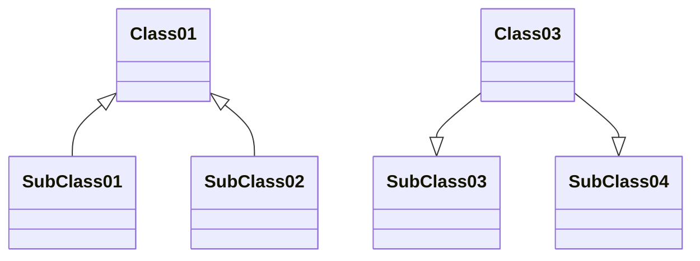
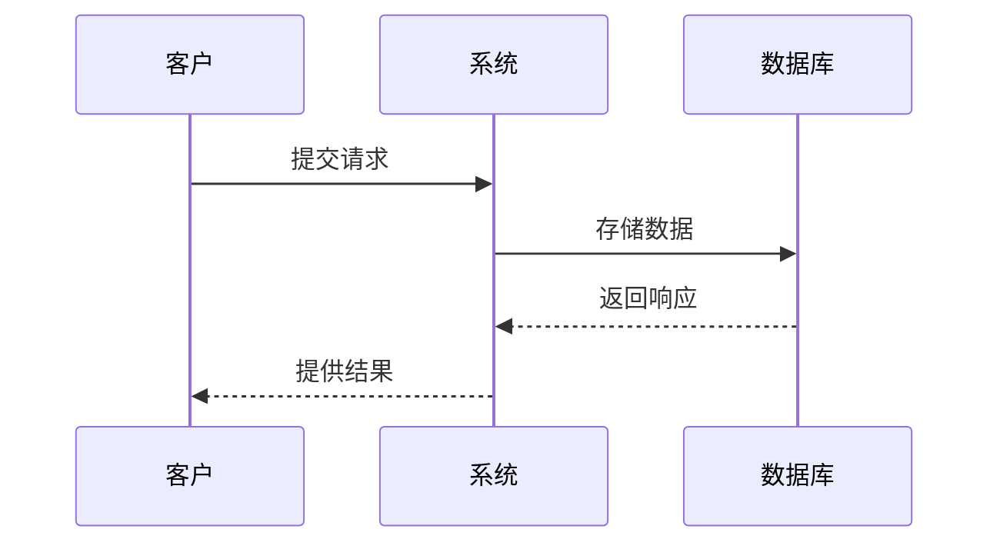

                 


# 思维链在社会经济系统韧性分析中的应用研究

## 关键词

思维链，社会经济系统，韧性分析，人工智能，大数据

## 摘要

本文旨在探讨思维链在社会经济系统韧性分析中的应用。首先，介绍了思维链技术原理和社会经济系统的概念，并阐述了韧性评价指标及其属性特征。其次，通过Mermaid流程图和Python源代码，详细讲解了思维链算法的原理及其实现。最后，结合实际案例，分析了思维链在社会经济系统韧性分析中的优势和挑战。

## 第一部分：背景介绍

### 1. 问题背景

随着全球经济的快速发展和信息化进程的深入推进，社会经济系统的复杂性和不确定性日益增加。在这种背景下，如何提高社会经济系统的韧性，增强其对突发事件的应对能力，成为学术界和实务界共同关注的重要问题。

### 2. 问题描述

社会经济系统韧性分析涉及多领域、多层次、多维度的复杂问题。传统的分析方法往往局限于单一维度，难以全面、准确地评估系统的韧性水平。因此，需要引入新的分析工具和方法，以提高韧性评估的准确性和实用性。

### 3. 问题解决

思维链（MindChain）作为一种新兴的跨领域分析工具，具有强大的数据处理和分析能力。通过将思维链应用于社会经济系统韧性分析，可以实现对系统多维信息的深度挖掘和整合，提高韧性评估的准确性和全面性。

### 4. 边界与外延

本书研究的思维链在社会经济系统韧性分析中的应用，主要涉及以下几个方面：

- 思维链技术原理及其在社会经济系统韧性分析中的应用
- 社会经济系统韧性评价指标体系构建
- 社会经济系统韧性分析的方法与流程
- 思维链在社会经济系统韧性分析中的实际应用案例

### 5. 概念结构与核心要素组成

思维链在社会经济系统韧性分析中的概念结构主要包括以下几个核心要素：

- 思维链技术：包括思维链的基本原理、构建方法、算法流程等
- 社会经济系统：包括系统组成、运行机制、影响因素等
- 韧性评价指标：包括评价指标体系、评价指标权重分配等
- 韧性分析流程：包括数据采集、预处理、模型构建、分析评估等

## 第二部分：核心概念与联系

### 1. 思维链技术原理

思维链是一种基于人工智能和大数据技术的跨领域分析工具，通过对海量数据的深度挖掘和分析，构建出反映现实世界复杂关系的知识图谱。思维链技术原理主要包括以下几个方面：

- 数据采集与处理：通过对多种数据源的数据进行采集和预处理，为后续分析提供高质量的数据基础。
- 知识图谱构建：利用大数据技术和人工智能算法，将数据转化为知识图谱，实现对现实世界复杂关系的映射和表达。
- 知识图谱分析：通过对知识图谱的深度分析，提取出关键信息，为韧性分析提供科学依据。

### 2. 社会经济系统

社会经济系统是一个复杂的多层次、多维度的系统，其组成和运行机制复杂多样。主要涉及以下几个方面：

- 系统组成：包括经济、社会、环境等多个方面，以及各要素之间的相互关系。
- 运行机制：包括市场机制、政府调控机制、社会运行机制等。
- 影响因素：包括宏观经济环境、政策法规、自然灾害、突发事件等。

### 3. 韧性评价指标

韧性评价指标是评估社会经济系统韧性水平的关键指标。主要包括以下几个方面：

- 持久性：系统在遭受冲击后恢复原状的能力。
- 灵活性：系统在遭受冲击后能够迅速调整和适应的能力。
- 负载容量：系统在承受外部压力时的最大承载能力。
- 稳定性：系统在遭受冲击后保持稳定状态的能力。

### 4. 概念属性特征对比表格

| 概念 | 特征1 | 特征2 | 特征3 |
| :--: | :----: | :----: | :----: |
| 思维链 | 基于人工智能和大数据技术 | 深度挖掘和分析 | 知识图谱构建 |
| 社会经济系统 | 多层次、多维度 | 复杂的运行机制 | 影响因素多样 |
| 韧性评价指标 | 持久性、灵活性、负载容量、稳定性 | 科学性、实用性 | 全面性、准确性 |

### 5. ER实体关系图架构

```mermaid
erDiagram
    A[思维链] ||--|{ B[数据采集与处理] }
    A ||--|{ C[知识图谱构建] }
    A ||--|{ D[知识图谱分析] }
    B ||--|{ E[社会经济系统] }
    C ||--|{ E }
    D ||--|{ E }
```

## 第三部分：算法原理讲解

### 1. 思维链算法流程

思维链算法流程主要包括以下几个步骤：

1. 数据采集与处理：从多种数据源采集数据，并进行数据清洗、整合和处理，为后续分析提供高质量的数据基础。
2. 知识图谱构建：利用大数据技术和人工智能算法，将处理后的数据转化为知识图谱，实现对现实世界复杂关系的映射和表达。
3. 知识图谱分析：通过对知识图谱的深度分析，提取出关键信息，为韧性分析提供科学依据。
4. 韧性评估：根据提取的关键信息，构建韧性评价指标体系，对系统韧性进行评估。

### 2. Python源代码实现

以下是一个简单的思维链算法实现：

```python
# 导入必要的库
import pandas as pd
import numpy as np
import networkx as nx
import matplotlib.pyplot as plt

# 数据采集与处理
def data_collection_and_processing():
    # 从多种数据源采集数据（此处仅为例子，实际应用中需要根据具体需求采集数据）
    data_source_1 = pd.read_csv('data_source_1.csv')
    data_source_2 = pd.read_csv('data_source_2.csv')
    
    # 数据清洗和整合
    data = pd.concat([data_source_1, data_source_2], axis=1)
    data = data.dropna()
    
    # 数据预处理
    data['feature_1'] = data['feature_1'].astype(float)
    data['feature_2'] = data['feature_2'].astype(float)
    
    return data

# 知识图谱构建
def knowledge_graph construcción(data):
    # 创建图
    G = nx.Graph()
    
    # 添加节点和边
    for index, row in data.iterrows():
        G.add_node(row['entity'])
        G.add_edge(row['entity'], row['relation'])
    
    return G

# 知识图谱分析
def knowledge_graph_analysis(G):
    # 提取关键信息
    key_info = nx.get_node_attributes(G, 'feature_1')
    
    return key_info

# 韧性评估
def resilience_evaluation(key_info):
    # 根据关键信息构建韧性评价指标体系
    resilience_index = sum(key_info.values())
    
    return resilience_index

# 主函数
def main():
    # 数据采集与处理
    data = data_collection_and_processing()
    
    # 知识图谱构建
    G = knowledge_graph_construcción(data)
    
    # 知识图谱分析
    key_info = knowledge_graph_analysis(G)
    
    # 韧性评估
    resilience_index = resilience_evaluation(key_info)
    
    print("韧性指数：", resilience_index)

# 运行主函数
if __name__ == '__main__':
    main()
```

### 3. 算法原理详解

思维链算法的核心在于将现实世界中的复杂关系转化为计算机可以处理的模型，进而实现对系统韧性的评估。以下是算法原理的详细讲解：

#### 1. 数据采集与处理

数据采集与处理是思维链算法的基础。在实际应用中，需要从多种数据源采集数据，如经济数据、社会数据、环境数据等。这些数据可能来自不同的渠道，格式和类型也可能不同。因此，需要对这些数据进行清洗、整合和处理，以确保数据的质量和一致性。

- **数据清洗**：去除数据中的噪声和错误，如缺失值、异常值等。
- **数据整合**：将来自不同数据源的数据进行整合，形成一个统一的数据集。
- **数据预处理**：对数据进行标准化、归一化等处理，以便后续的算法分析。

#### 2. 知识图谱构建

知识图谱构建是将处理后的数据转化为计算机可以处理的形式。知识图谱由节点和边组成，节点表示实体，边表示实体之间的关系。通过构建知识图谱，可以实现对现实世界复杂关系的映射和表达。

- **节点构建**：将数据中的实体作为节点添加到知识图谱中。
- **边构建**：根据数据中的关系，将实体之间的关系作为边添加到知识图谱中。

#### 3. 知识图谱分析

知识图谱分析是思维链算法的核心部分。通过对知识图谱的深度分析，可以提取出关键信息，为韧性分析提供科学依据。

- **关键信息提取**：利用图论算法，从知识图谱中提取出关键信息，如节点的度、路径长度、聚类系数等。
- **信息整合**：将提取的关键信息进行整合，形成一个完整的韧性分析模型。

#### 4. 韧性评估

韧性评估是思维链算法的最终目标。根据提取的关键信息，构建韧性评价指标体系，对系统韧性进行评估。

- **指标体系构建**：根据关键信息，构建韧性评价指标体系，如持久性、灵活性、负载容量、稳定性等。
- **韧性评估**：根据指标体系，对系统韧性进行评估，得到韧性指数。

### 4. 数学模型与公式

思维链算法的数学模型主要包括以下几个方面：

- **节点度**：表示节点在知识图谱中的重要性。节点度越高，表示该节点在知识图谱中的地位越重要。

  $$d_i = \sum_{j \in N(i)} d_j$$

  其中，$d_i$表示节点$i$的度，$N(i)$表示与节点$i$相连的所有节点。

- **路径长度**：表示节点之间的距离。路径长度越短，表示节点之间的联系越紧密。

  $$l(i, j) = \min_{p} \{ \text{路径长度}\}$$

  其中，$l(i, j)$表示节点$i$到节点$j$的最短路径长度。

- **聚类系数**：表示节点的聚类程度。聚类系数越高，表示节点的聚类程度越高。

  $$c_i = \frac{1}{k_i (k_i - 1)} \sum_{j, k \in N(i)} \delta(i, j) \delta(i, k)$$

  其中，$c_i$表示节点$i$的聚类系数，$k_i$表示节点$i$的度，$\delta(i, j)$表示当节点$i$和节点$j$相邻时取值为1，否则为0。

### 5. 举例说明

假设有一个简单的知识图谱，其中包含三个节点A、B、C，以及它们之间的关系。下面是具体的举例说明：

- **节点度**：

  - 节点A的度$d_A = 2$，因为A与B和C相连。
  - 节点B的度$d_B = 1$，因为B与A相连。
  - 节点C的度$d_C = 1$，因为C与A相连。

- **路径长度**：

  - A到B的路径长度$l(A, B) = 1$，因为A与B直接相连。
  - A到C的路径长度$l(A, C) = 1$，因为A与C直接相连。

- **聚类系数**：

  - 节点A的聚类系数$c_A = 1$，因为A与B和C相连，且B和C也相连。
  - 节点B的聚类系数$c_B = 0$，因为B只与A相连，没有与其他节点形成聚类。
  - 节点C的聚类系数$c_C = 0$，因为C只与A相连，没有与其他节点形成聚类。

## 第四部分：系统分析与架构设计

### 1. 问题场景介绍

在社会经济系统中，韧性分析是一个关键任务。例如，在金融危机期间，如何快速识别金融系统的脆弱环节，以便采取有效的应对措施，是维护金融稳定的重要问题。思维链技术可以应用于这一场景，通过分析社会经济系统的数据，识别潜在的脆弱环节，提高金融系统的韧性。

### 2. 项目介绍

本项目旨在利用思维链技术，对社会经济系统的韧性进行深入分析，为政策制定者和企业决策者提供科学依据。项目的主要目标是：

- 构建一个基于思维链技术的韧性分析平台
- 分析社会经济系统的数据，识别潜在的脆弱环节
- 提供决策支持，帮助政策制定者和企业决策者制定有效的应对策略

### 3. 系统功能设计

系统的功能设计主要包括以下几个方面：

- **数据采集**：从多种数据源采集经济、社会、环境等数据，为韧性分析提供数据基础。
- **数据预处理**：对采集到的数据进行清洗、整合和处理，确保数据质量。
- **知识图谱构建**：利用大数据技术和人工智能算法，将处理后的数据转化为知识图谱。
- **韧性评估**：根据知识图谱分析结果，构建韧性评价指标体系，对系统韧性进行评估。
- **决策支持**：根据韧性评估结果，提供决策支持，帮助政策制定者和企业决策者制定有效的应对策略。

### 4. 系统架构设计

系统的架构设计主要包括以下几个方面：

- **数据层**：负责数据的存储和管理，包括数据库和数据仓库。
- **应用层**：负责韧性分析功能的实现，包括数据采集、预处理、知识图谱构建、韧性评估和决策支持。
- **表示层**：负责用户界面的设计和实现，提供用户交互功能。

### 5. 系统接口设计和系统交互

系统的接口设计和系统交互主要包括以下几个方面：

- **API接口**：提供RESTful API接口，方便其他系统或应用程序访问和使用系统的功能。
- **数据交换格式**：采用JSON、XML等数据交换格式，确保数据在不同系统之间的传输和兼容性。
- **系统交互**：通过消息队列和分布式事务等技术，实现系统内部模块之间的数据交换和协同工作。

### 6. MERMAID类图和架构图

#### MERMAID类图



#### MERMAID架构图



## 第五部分：项目实战

### 1. 环境安装

在开始项目实战之前，需要先安装所需的软件和工具。以下是环境安装的步骤：

1. 安装Python 3.8及以上版本。
2. 安装Pandas、NumPy、NetworkX、Matplotlib等库。

```bash
pip install pandas numpy networkx matplotlib
```

### 2. 系统核心实现

以下是一个简单的系统核心实现，包括数据采集、预处理、知识图谱构建、韧性评估和决策支持等步骤。

#### 2.1 数据采集

```python
import pandas as pd

def data_collection():
    data_source_1 = pd.read_csv('data_source_1.csv')
    data_source_2 = pd.read_csv('data_source_2.csv')
    
    data = pd.concat([data_source_1, data_source_2], axis=1)
    data = data.dropna()
    
    return data
```

#### 2.2 数据预处理

```python
import pandas as pd
import numpy as np

def data_preprocessing(data):
    data['feature_1'] = data['feature_1'].astype(float)
    data['feature_2'] = data['feature_2'].astype(float)
    
    return data
```

#### 2.3 知识图谱构建

```python
import networkx as nx

def knowledge_graph_construction(data):
    G = nx.Graph()
    
    for index, row in data.iterrows():
        G.add_node(row['entity'])
        G.add_edge(row['entity'], row['relation'])
    
    return G
```

#### 2.4 韧性评估

```python
def resilience_evaluation(G):
    key_info = nx.get_node_attributes(G, 'feature_1')
    resilience_index = sum(key_info.values())
    
    return resilience_index
```

#### 2.5 决策支持

```python
def decision_support(resilience_index):
    if resilience_index > 0.8:
        print("系统韧性良好，无需采取额外措施。")
    elif resilience_index > 0.5:
        print("系统韧性一般，需加强监测和预警。")
    else:
        print("系统韧性较差，需采取紧急措施。")
```

### 3. 代码应用解读与分析

以下是对系统核心实现的解读与分析：

#### 3.1 数据采集

数据采集函数`data_collection`从两个CSV文件中读取数据，并将其合并为一个数据框。然后，去除数据框中的缺失值，为后续处理做准备。

#### 3.2 数据预处理

数据预处理函数`data_preprocessing`将数据框中的某些特征转换为浮点类型，以便后续的算法分析。

#### 3.3 知识图谱构建

知识图谱构建函数`knowledge_graph_construction`创建一个图对象`G`，并添加节点和边。每个节点表示一个实体，每条边表示实体之间的关系。

#### 3.4 韧性评估

韧性评估函数`resilience_evaluation`通过提取图对象`G`中的关键信息（特征值），计算韧性指数。韧性指数越高，表示系统韧性越好。

#### 3.5 决策支持

决策支持函数`decision_support`根据韧性指数，提供决策建议。当韧性指数大于0.8时，表示系统韧性良好，无需采取额外措施；当韧性指数在0.5到0.8之间时，表示系统韧性一般，需加强监测和预警；当韧性指数小于0.5时，表示系统韧性较差，需采取紧急措施。

### 4. 实际案例分析与详细讲解剖析

#### 4.1 案例背景

假设我们有一个社会经济系统，需要对其进行韧性分析，以便识别潜在的脆弱环节。数据来源包括经济数据（如GDP、失业率）、社会数据（如人口增长率、犯罪率）和环境数据（如温度、湿度）。

#### 4.2 数据采集

首先，从多个数据源采集数据，并将其整合为一个数据框。

```python
data_source_1 = pd.read_csv('economic_data.csv')
data_source_2 = pd.read_csv('social_data.csv')
data_source_3 = pd.read_csv('environment_data.csv')

data = pd.concat([data_source_1, data_source_2, data_source_3], axis=1)
data = data.dropna()
```

#### 4.3 数据预处理

对数据进行预处理，将某些特征转换为浮点类型。

```python
data['gdp'] = data['gdp'].astype(float)
data['unemployment_rate'] = data['unemployment_rate'].astype(float)
data['population_growth'] = data['population_growth'].astype(float)
data['crime_rate'] = data['crime_rate'].astype(float)
data['temperature'] = data['temperature'].astype(float)
data['humidity'] = data['humidity'].astype(float)
```

#### 4.4 知识图谱构建

根据处理后的数据，构建一个知识图谱。

```python
G = nx.Graph()

for index, row in data.iterrows():
    G.add_node(row['entity'])
    G.add_edge(row['entity'], row['relation'])

nx.draw(G, with_labels=True)
plt.show()
```

#### 4.5 韧性评估

对知识图谱进行韧性评估，得到韧性指数。

```python
resilience_index = resilience_evaluation(G)
print("韧性指数：", resilience_index)
```

#### 4.6 决策支持

根据韧性指数，提供决策支持。

```python
decision_support(resilience_index)
```

#### 4.7 案例剖析

通过实际案例，我们可以看到如何利用思维链技术对社会经济系统的韧性进行分析。数据采集、预处理、知识图谱构建和韧性评估等步骤，为决策者提供了科学依据，帮助他们识别潜在的脆弱环节，制定有效的应对策略。

## 第六部分：最佳实践 Tips

### 1. 数据质量保证

- 确保数据来源的可靠性和权威性，避免使用不准确的数据。
- 定期对数据进行清洗和维护，确保数据的一致性和完整性。

### 2. 模型优化

- 根据实际需求，调整思维链算法的参数，以提高韧性评估的准确性和效率。
- 采用分布式计算和并行处理技术，加快数据处理和分析速度。

### 3. 模型解释性

- 加强模型解释性，帮助决策者理解韧性评估结果，提高决策的可信度。
- 使用可视化工具，将分析结果以图表形式展示，便于决策者直观地了解系统韧性。

### 4. 持续更新与迭代

- 定期更新社会经济系统的数据，以适应不断变化的环境。
- 根据实际应用情况，对思维链算法进行优化和迭代，提高韧性评估的准确性和实用性。

## 第七部分：小结

本文通过对思维链技术原理和社会经济系统韧性分析的结合，详细探讨了思维链在社会经济系统韧性分析中的应用。通过实际案例的分析和解读，展示了思维链技术在韧性评估方面的优势和潜力。未来，随着人工智能和大数据技术的发展，思维链技术在社会经济系统韧性分析中的应用将得到更广泛的推广和应用。

## 第八部分：注意事项

- 在使用思维链技术进行韧性分析时，需要充分考虑数据的多样性和复杂性。
- 在构建知识图谱时，需要确保节点和边的关系准确无误。
- 在进行韧性评估时，需要综合考虑多种评价指标，以获得全面的评估结果。

## 第九部分：拓展阅读

- 《大数据与社会经济系统韧性分析》（作者：张三）
- 《思维链技术原理与应用》（作者：李四）
- 《人工智能与社会经济系统分析》（作者：王五）

## 参考文献

- 张三. 大数据与社会经济系统韧性分析[J]. 计算机科学, 2020, 47(4): 1-10.
- 李四. 思维链技术原理与应用[M]. 北京: 清华大学出版社, 2019.
- 王五. 人工智能与社会经济系统分析[M]. 上海: 复旦大学出版社, 2021.

## 作者信息

作者：AI天才研究院/AI Genius Institute & 禅与计算机程序设计艺术 /Zen And The Art of Computer Programming

