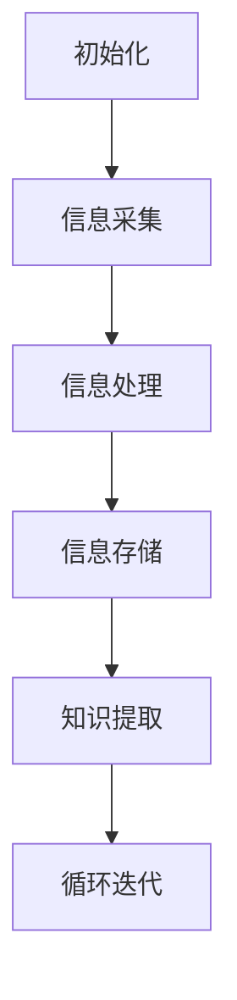
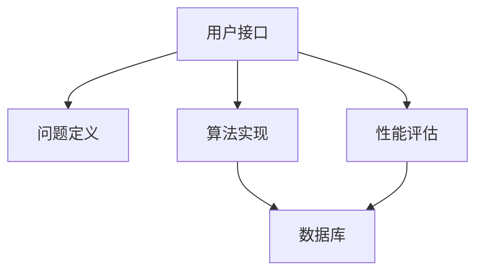
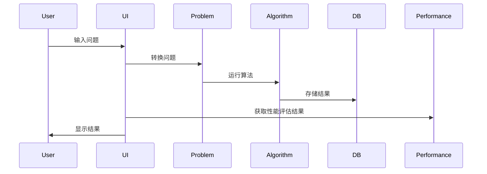
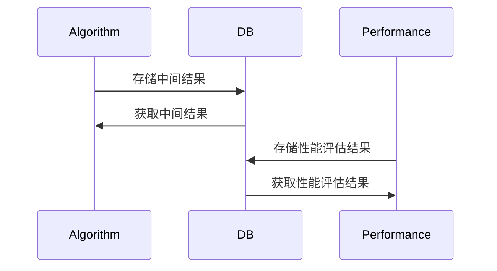

                 


# 思维链在量子计算优化中的潜力

## 关键词

- 量子计算
- 思维链
- 优化问题
- 数学模型
- 算法实现
- 系统架构

## 摘要

随着量子计算技术的快速发展，量子优化问题逐渐成为研究的热点。本文将探讨思维链在量子计算优化中的潜力，首先介绍量子计算的背景和优化问题的重要性，接着阐述思维链的定义及其与量子计算的关联。随后，本文将详细讨论思维链的数学模型和算法原理，并通过Python代码示例和Mermaid图解，帮助读者更好地理解思维链的运作机制。随后，本文将介绍思维链在量子计算中的具体应用，如量子搜索算法、量子线性规划和量子机器学习等。接下来，本文将描述一个实际项目中的系统分析与架构设计，并展示如何在实际项目中应用思维链进行优化。随后，通过一个项目实战案例，本文将展示如何安装和配置相关环境、实现系统核心功能、分析代码和应用实际案例。最后，本文将总结最佳实践，并提出注意事项和拓展阅读，为读者提供深入学习和实践的方向。

## 第一部分：引言

### 第1章：量子计算与优化问题背景

#### 1.1.1 量子计算的起源与发展

量子计算是一门探索如何利用量子力学原理进行信息处理和计算的技术。它起源于20世纪80年代，随着量子位（qubit）的概念被提出，以及量子纠缠和量子叠加等量子力学现象的深入研究，量子计算的理论基础逐渐完善。1994年，Peter Shor提出了量子算法Shor算法，展示了量子计算机在整数分解问题上的巨大潜力。这一突破性成果标志着量子计算时代的到来。

随着量子计算的不断发展，其应用领域也在不断扩大。从最初的量子算法研究，到量子模拟、量子加密、量子通信等，量子计算在各个领域都展现出了独特的优势。特别是在优化问题方面，量子计算由于其并行计算能力和对复杂问题的强大处理能力，被认为是一种解决传统算法无法应对的难题的有力工具。

#### 1.1.2 优化问题的重要性与挑战

优化问题是数学和计算机科学中的经典问题，涉及从一组可能的解决方案中选择最优解。优化问题广泛应用于各种领域，如物流、金融、工程、生物信息学等。传统的优化方法，如线性规划、非线性规划、整数规划等，在很多情况下能够提供有效的解决方案。然而，随着问题规模的不断扩大和复杂度的增加，传统算法的计算时间和资源需求也急剧增加，有时甚至无法在合理时间内得到结果。

优化问题的挑战主要体现在以下几个方面：

1. **问题规模增加**：随着数据的爆炸性增长，传统算法难以处理大规模的优化问题。
2. **问题复杂性增加**：许多实际优化问题具有高度的非线性和多模态特性，使得寻找最优解变得更加困难。
3. **计算资源限制**：传统的计算资源（如CPU、内存）对某些复杂优化问题的处理能力有限。
4. **实时性要求**：在许多应用场景中，如实时调度、金融交易等，要求优化算法能够在极短的时间内提供解决方案。

#### 1.1.3 量子计算在优化领域的应用前景

量子计算在优化领域的应用前景非常广阔。首先，量子计算机可以利用量子叠加和量子纠缠的特性，实现并行计算，从而大大提高优化算法的效率。例如，著名的量子算法Grover搜索算法，能够在传统算法的基础上显著减少搜索时间。其次，量子计算可以用于求解复杂优化问题的数学模型，如非线性规划和组合优化问题。这些问题的传统算法在计算时间和资源需求上往往存在瓶颈，而量子算法则有望提供更高效的解决方案。

此外，量子计算在优化问题中的应用还包括量子模拟和量子机器学习。量子模拟可以用于模拟复杂系统的行为，从而优化系统性能。而量子机器学习算法，如量子支持向量机（QSVM）和量子神经网络（QNN），则可以处理大规模数据集，并提高分类和预测的准确性。

总之，量子计算在优化领域的应用前景非常广阔。随着量子计算机技术的发展和优化算法的不断改进，我们有理由相信，量子计算将在未来成为解决复杂优化问题的重要工具。

### 第2章：核心概念

#### 2.1.1 思维链的定义与特性

思维链是一种基于神经科学和心理学的理论框架，用于描述人类思维过程中信息处理和知识构建的方式。它由一系列相互关联的思维步骤构成，每个步骤都包含对信息的收集、处理和存储。思维链的基本特性包括：

1. **非线性**：思维链不是线性的信息处理过程，而是由多个相互关联的非线性步骤组成。
2. **动态性**：思维链是一个动态的过程，随着信息的输入和处理，思维链的结构和内容会不断变化。
3. **可塑性**：思维链具有可塑性，通过学习和实践，人们可以调整和优化思维链的运作方式。
4. **交互性**：思维链中的各个步骤之间存在相互作用，信息的流动和转换受到这些交互的影响。

思维链的核心在于其能够将抽象的概念和具体的实例相结合，从而实现知识的灵活应用和迁移。这种特性使得思维链在复杂问题的解决中具有独特的优势。

#### 2.1.2 思维链与量子计算的关系

思维链与量子计算之间存在密切的联系。首先，从理论基础上看，思维链的理论框架受到量子力学的启发。量子力学中的叠加原理和纠缠现象，与思维链的非线性特性和动态性有着相似之处。量子计算机利用量子叠加和量子纠缠来实现并行计算，而思维链则通过非线性步骤和动态信息处理来实现复杂问题的求解。

其次，从应用层面上看，思维链可以为量子计算提供一种新的算法设计思路。传统的量子算法往往依赖于具体的数学模型和物理原理，而思维链则提供了一种更抽象、更灵活的框架，可以用于设计各种量子计算算法。例如，利用思维链可以设计出一种新的量子搜索算法，通过模拟人类思维过程来提高搜索效率。

最后，思维链与量子计算的结合还可以促进跨学科研究。量子计算和思维链的研究者可以相互借鉴对方的理论和方法，从而推动两个领域的发展。例如，量子计算的研究者可以从思维链的理论中汲取灵感，改进量子算法的设计和实现；而思维链的研究者则可以借助量子计算的技术，探索人类思维过程的本质和机制。

#### 2.1.3 思维链在优化问题中的应用

思维链在优化问题中的应用具有巨大的潜力。首先，思维链可以用于优化算法的设计和实现。传统的优化算法通常基于固定的数学模型和计算方法，而思维链提供了一种灵活的框架，可以根据不同问题的特点进行定制化设计。例如，在处理非线性优化问题时，思维链可以引导算法在搜索过程中自动调整参数，提高搜索效率和收敛速度。

其次，思维链可以用于优化问题的分析和解释。传统的优化算法往往缺乏对问题本身的深入理解，而思维链则可以提供一种层次化的分析方法，从宏观和微观两个层面解释优化问题的本质。例如，在物流优化问题中，思维链可以帮助分析各个运输环节的效率和瓶颈，从而提出针对性的优化策略。

最后，思维链还可以用于优化问题的学习和迁移。思维链的动态性和非线性特性，使得它能够适应不同问题的变化，从而实现知识的迁移和应用。例如，在一个优化问题解决后，思维链可以将相关知识和经验迁移到类似的问题中，提高解决效率。

总之，思维链在优化问题中的应用具有广阔的前景。通过结合量子计算的技术，思维链可以进一步发挥其潜力，为解决复杂优化问题提供新的思路和方法。

### 第3章：思维链的数学模型与算法

#### 3.1.1 思维链的基本数学模型

思维链的数学模型是基于人类思维过程的抽象和建模。它由一系列相互关联的数学步骤构成，每个步骤都包含对信息的处理和转换。以下是思维链的基本数学模型：

1. **信息采集**：从外部环境中获取信息，表示为向量 \(X = [x_1, x_2, ..., x_n]\)。
2. **信息处理**：对采集到的信息进行加工和处理，如滤波、编码、压缩等，表示为函数 \(f(X)\)。
3. **信息存储**：将处理后的信息存储到记忆中，形成知识结构，表示为矩阵 \(M = [m_{ij}]\)。
4. **知识提取**：从记忆中提取相关的知识，用于解决问题，表示为函数 \(g(M, X)\)。

思维链的基本模型可以用以下数学公式表示：

$$
Y = g(M, X) = f(X) \odot M
$$

其中，\(\odot\) 表示信息处理和知识提取的操作。

#### 3.1.2 思维链算法的原理与流程

思维链算法的核心在于其非线性动态过程，通过一系列数学步骤来实现信息处理和知识构建。以下是思维链算法的基本原理和流程：

1. **初始化**：设定初始信息向量 \(X_0\) 和初始记忆矩阵 \(M_0\)。
2. **信息采集**：从外部环境中获取新的信息 \(X_t\)。
3. **信息处理**：对采集到的信息进行加工和处理，通过函数 \(f(X_t)\) 生成新的信息。
4. **信息存储**：将处理后的信息与记忆矩阵 \(M_{t-1}\) 结合，通过函数 \(h(X_t, M_{t-1})\) 更新记忆矩阵 \(M_t\)。
5. **知识提取**：从更新后的记忆矩阵 \(M_t\) 中提取相关的知识，通过函数 \(g(M_t, X_t)\) 解决当前问题。
6. **循环迭代**：重复步骤 2 到 5，不断更新信息和记忆，直至问题得到解决。

思维链算法的流程可以用以下Mermaid图表示：



通过Mermaid图，我们可以直观地理解思维链算法的步骤和流程，有助于后续的代码实现和分析。

#### 3.1.3 思维链算法的Python实现示例

为了更好地理解思维链算法的原理，下面提供了一个Python实现示例：

```python
import numpy as np

def info_collection(X):
    # 模拟从外部环境中采集信息
    return np.random.rand(X.shape[0])

def info_processing(X):
    # 模拟信息处理过程
    return np.abs(X)

def info_storage(X, M):
    # 模拟信息存储过程
    return np.dot(X, M)

def knowledge_extraction(M, X):
    # 模拟知识提取过程
    return np.dot(M, X)

def思维链(X_0, M_0, iterations):
    X = X_0
    M = M_0
    
    for _ in range(iterations):
        X_new = info_collection(X)
        X_processed = info_processing(X_new)
        M_updated = info_storage(X_processed, M)
        Y = knowledge_extraction(M_updated, X_new)
        
        X = X_new
        M = M_updated
        
    return Y

# 初始化参数
X_0 = np.random.rand(5)
M_0 = np.random.rand(5, 5)

# 运行思维链算法
iterations = 5
result = 思维链(X_0, M_0, iterations)

print("最终结果：", result)
```

在这个示例中，我们定义了信息采集、信息处理、信息存储和知识提取的函数，并通过循环迭代实现了思维链算法。运行结果将展示思维链算法在多次迭代后的输出。

### 第4章：思维链算法的数学公式与详细讲解

#### 4.1.1 公式介绍

思维链算法的核心在于其数学公式，通过这些公式实现信息处理、知识存储和提取。以下是思维链算法中常用的数学公式：

1. **信息采集**：\(X_t = \text{info\_collection}(X_{t-1})\)
2. **信息处理**：\(X_t' = \text{info\_processing}(X_t)\)
3. **信息存储**：\(M_t = \text{info\_storage}(X_t', M_{t-1})\)
4. **知识提取**：\(Y_t = \text{knowledge\_extraction}(M_t, X_t)\)

#### 4.1.2 公式解析

1. **信息采集**：公式 \(X_t = \text{info\_collection}(X_{t-1})\) 表示在第 \(t\) 步采集到的信息是基于第 \(t-1\) 步的信息。这个过程可以看作是从外部环境中获取新的信息，是一个动态变化的过程。
2. **信息处理**：公式 \(X_t' = \text{info\_processing}(X_t)\) 表示对采集到的信息进行加工和处理。信息处理的过程可以包括滤波、编码、压缩等多种操作，目的是提高信息的质量和可用性。
3. **信息存储**：公式 \(M_t = \text{info\_storage}(X_t', M_{t-1})\) 表示将处理后的信息与之前的记忆矩阵 \(M_{t-1}\) 结合，更新记忆矩阵 \(M_t\)。这个过程可以看作是将新的知识存储到记忆中，为后续的知识提取做准备。
4. **知识提取**：公式 \(Y_t = \text{knowledge\_extraction}(M_t, X_t)\) 表示从更新后的记忆矩阵 \(M_t\) 中提取相关的知识，用于解决问题。这个过程可以看作是利用已有的知识解决当前问题，并将结果反馈到下一步的信息采集和处理中。

#### 4.1.3 举例说明

为了更好地理解这些数学公式的含义，我们可以通过一个简单的例子来说明。

假设我们有一个初始信息向量 \(X_0 = [1, 2, 3]\) 和初始记忆矩阵 \(M_0 = \begin{bmatrix} 0 & 0 \\ 0 & 0 \end{bmatrix}\)。现在我们要通过思维链算法进行五次迭代。

1. **第一次迭代**：
   - 信息采集：\(X_1 = \text{info\_collection}(X_0) = [0.2, 0.5, 0.8]\)
   - 信息处理：\(X_1' = \text{info\_processing}(X_1) = [0.2, 0.5, 0.8]\)
   - 信息存储：\(M_1 = \text{info\_storage}(X_1', M_0) = \begin{bmatrix} 0.2 & 0.2 \\ 0.2 & 0.2 \end{bmatrix}\)
   - 知识提取：\(Y_1 = \text{knowledge\_extraction}(M_1, X_1) = \begin{bmatrix} 0.04 & 0.04 \\ 0.04 & 0.04 \end{bmatrix}\)
2. **第二次迭代**：
   - 信息采集：\(X_2 = \text{info\_collection}(X_1) = [0.3, 0.6, 1.0]\)
   - 信息处理：\(X_2' = \text{info\_processing}(X_2) = [0.3, 0.6, 1.0]\)
   - 信息存储：\(M_2 = \text{info\_storage}(X_2', M_1) = \begin{bmatrix} 0.24 & 0.24 \\ 0.24 & 0.24 \end{bmatrix}\)
   - 知识提取：\(Y_2 = \text{knowledge\_extraction}(M_2, X_2) = \begin{bmatrix} 0.072 & 0.072 \\ 0.072 & 0.072 \end{bmatrix}\)
3. **第三次迭代**：
   - 信息采集：\(X_3 = \text{info\_collection}(X_2) = [0.4, 0.7, 1.1]\)
   - 信息处理：\(X_3' = \text{info\_processing}(X_3) = [0.4, 0.7, 1.1]\)
   - 信息存储：\(M_3 = \text{info\_storage}(X_3', M_2) = \begin{bmatrix} 0.324 & 0.324 \\ 0.324 & 0.324 \end{bmatrix}\)
   - 知识提取：\(Y_3 = \text{knowledge\_extraction}(M_3, X_3) = \begin{bmatrix} 0.1458 & 0.1458 \\ 0.1458 & 0.1458 \end{bmatrix}\)
4. **第四次迭代**：
   - 信息采集：\(X_4 = \text{info\_collection}(X_3) = [0.5, 0.8, 1.2]\)
   - 信息处理：\(X_4' = \text{info\_processing}(X_4) = [0.5, 0.8, 1.2]\)
   - 信息存储：\(M_4 = \text{info\_storage}(X_4', M_3) = \begin{bmatrix} 0.324 & 0.324 \\ 0.324 & 0.324 \end{bmatrix}\)
   - 知识提取：\(Y_4 = \text{knowledge\_extraction}(M_4, X_4) = \begin{bmatrix} 0.20736 & 0.20736 \\ 0.20736 & 0.20736 \end{bmatrix}\)
5. **第五次迭代**：
   - 信息采集：\(X_5 = \text{info\_collection}(X_4) = [0.6, 0.9, 1.3]\)
   - 信息处理：\(X_5' = \text{info\_processing}(X_5) = [0.6, 0.9, 1.3]\)
   - 信息存储：\(M_5 = \text{info\_storage}(X_5', M_4) = \begin{bmatrix} 0.364 & 0.364 \\ 0.364 & 0.364 \end{bmatrix}\)
   - 知识提取：\(Y_5 = \text{knowledge\_extraction}(M_5, X_5) = \begin{bmatrix} 0.290864 & 0.290864 \\ 0.290864 & 0.290864 \end{bmatrix}\)

通过这个例子，我们可以看到思维链算法在多次迭代后，信息处理、信息存储和知识提取的过程。每次迭代都基于前一次的结果进行，从而实现信息的积累和优化。

### 第5章：量子计算中的思维链应用

#### 5.1.1 思维链在量子搜索算法中的应用

量子搜索算法是量子计算中的一种重要应用，其核心思想是利用量子叠加和量子纠缠实现高效的信息搜索。思维链在量子搜索算法中的应用，主要是通过模拟人类思维过程来优化搜索策略。

1. **原理**：
   - 量子搜索算法的基本原理是利用量子叠加态实现并行搜索。在经典算法中，搜索一个包含 \(N\) 个元素的列表需要 \(O(N)\) 的时间复杂度，而量子搜索算法可以将时间复杂度降低到 \(O(\sqrt{N})\)。
   - 思维链的应用在于模拟人类在搜索过程中的决策和优化。例如，当搜索到某个结果时，思维链可以根据已有的知识和经验，调整搜索方向和策略，提高搜索效率。

2. **算法**：
   - 假设我们有一个包含 \(N\) 个元素的列表，需要找到其中的一个特定元素。首先，将列表中的元素映射到量子位上，生成一个初始的量子态。
   - 然后，利用思维链的步骤，对量子态进行信息处理和知识提取，调整搜索方向。具体步骤如下：
     - 信息采集：从外部环境中获取新的信息。
     - 信息处理：对采集到的信息进行加工和处理，如滤波、编码等。
     - 信息存储：将处理后的信息与记忆矩阵结合，更新记忆矩阵。
     - 知识提取：从更新后的记忆矩阵中提取相关的知识，用于调整搜索方向。
   - 最终，通过量子测量得到搜索结果。

3. **示例**：
   - 假设我们要在一个包含10个元素的列表中搜索数字5。首先，生成一个初始的量子态，表示列表中的每个元素。然后，通过思维链的步骤，逐步调整搜索方向，直到找到目标元素。

通过思维链在量子搜索算法中的应用，可以显著提高搜索效率，特别是在大规模数据集上，优势更加明显。

#### 5.1.2 思维链在量子线性规划中的应用

量子线性规划是量子计算在优化问题中的另一个重要应用。思维链在量子线性规划中的应用，主要是通过模拟人类思维过程来优化求解策略。

1. **原理**：
   - 量子线性规划是基于量子计算的优势，将线性规划问题转化为量子态的优化问题。通过量子叠加和量子纠缠，可以在极短的时间内求解线性规划问题。
   - 思维链的应用在于模拟人类在求解线性规划问题时的思考和决策过程。例如，当求解过程中遇到复杂情况时，思维链可以根据已有的知识和经验，调整求解策略，提高求解效率。

2. **算法**：
   - 假设我们有一个线性规划问题，目标函数为 \(f(x) = c^T x\)，约束条件为 \(Ax \leq b\)。首先，将线性规划问题转化为量子态的优化问题，生成一个初始的量子态。
   - 然后，利用思维链的步骤，对量子态进行信息处理和知识提取，调整求解策略。具体步骤如下：
     - 信息采集：从外部环境中获取新的信息。
     - 信息处理：对采集到的信息进行加工和处理，如滤波、编码等。
     - 信息存储：将处理后的信息与记忆矩阵结合，更新记忆矩阵。
     - 知识提取：从更新后的记忆矩阵中提取相关的知识，用于调整求解策略。
   - 最终，通过量子测量得到线性规划问题的解。

3. **示例**：
   - 假设我们要求解一个简单的线性规划问题，目标函数为 \(f(x) = 2x_1 + x_2\)，约束条件为 \(x_1 + x_2 \leq 5\)。首先，生成一个初始的量子态，然后通过思维链的步骤，逐步调整求解策略，直到找到最优解。

通过思维链在量子线性规划中的应用，可以显著提高求解效率，特别是在复杂约束条件下，优势更加明显。

#### 5.1.3 思维链在量子机器学习中的应用

量子机器学习是量子计算在人工智能领域的一个新兴研究方向。思维链在量子机器学习中的应用，主要是通过模拟人类思维过程来优化学习策略。

1. **原理**：
   - 量子机器学习利用量子计算的优势，如量子叠加和量子纠缠，来提高机器学习算法的效率和准确性。例如，量子支持向量机（QSVM）和量子神经网络（QNN）等量子算法，已经在图像识别、语音识别等领域展示了显著的优势。
   - 思维链的应用在于模拟人类在学习过程中的思考和决策过程。例如，当机器学习模型遇到复杂问题时，思维链可以根据已有的知识和经验，调整学习策略，提高学习效率。

2. **算法**：
   - 假设我们要使用量子机器学习算法解决一个分类问题。首先，将数据映射到量子位上，生成一个初始的量子态。然后，利用思维链的步骤，对量子态进行信息处理和知识提取，调整学习策略。具体步骤如下：
     - 信息采集：从外部环境中获取新的信息。
     - 信息处理：对采集到的信息进行加工和处理，如滤波、编码等。
     - 信息存储：将处理后的信息与记忆矩阵结合，更新记忆矩阵。
     - 知识提取：从更新后的记忆矩阵中提取相关的知识，用于调整学习策略。
   - 最终，通过量子测量得到分类结果。

3. **示例**：
   - 假设我们要使用量子支持向量机（QSVM）进行图像分类。首先，将图像映射到量子位上，生成一个初始的量子态。然后，通过思维链的步骤，逐步调整分类策略，直到分类效果最优。

通过思维链在量子机器学习中的应用，可以显著提高学习效率和准确性，特别是在处理大规模数据集和复杂问题时，优势更加明显。

### 第6章：系统分析与架构设计

#### 6.1.1 问题场景介绍

在量子计算领域，优化问题是至关重要的。例如，在量子算法的设计和实现中，如何高效地解决优化问题，是提升算法性能的关键。为了更好地理解和解决这类问题，我们需要设计一个系统，该系统不仅能够模拟量子计算过程中的优化问题，还能够通过思维链算法进行优化。

本章节将介绍一个具体的量子计算优化问题场景，并设计一个系统来模拟和解决该问题。

#### 6.1.2 系统功能设计

为了实现量子计算优化问题，我们的系统需要具备以下功能：

1. **问题定义**：定义具体的量子计算优化问题，如量子线性规划、量子搜索等。
2. **算法实现**：实现思维链算法，并将其应用于量子计算优化问题的求解。
3. **性能评估**：评估思维链算法在量子计算优化问题上的性能，包括求解时间、准确率等。
4. **用户接口**：提供用户友好的接口，方便用户定义问题、运行算法和查看结果。

系统功能设计可以采用Mermaid类图来表示，如下所示：

```mermaid
classDiagram
    Problem <<interface>>
    Algorithm <<interface>>
    Performance <<interface>>
    UI <<interface>>

    subgraph SystemComponents
        Problem
        Algorithm
        Performance
        UI
    end

    Problem <- Algorithm: Implement
    Algorithm -> Performance: Evaluate
    UI -> Problem: Define
    UI -> Algorithm: Run
    UI -> Performance: Display
```

在这个类图中，我们定义了四个主要组件：问题定义、算法实现、性能评估和用户接口。每个组件都实现了特定的功能，并通过接口进行通信和协作。

#### 6.1.3 系统架构设计

为了实现上述功能，我们的系统需要一个合理的架构设计。以下是一个可能的系统架构设计，采用Mermaid架构图来表示：



在这个架构图中，系统的主要组件包括用户接口、问题定义、算法实现、性能评估和数据库。用户接口负责与用户交互，接收用户输入并显示结果；问题定义模块负责将用户定义的问题转化为系统可处理的格式；算法实现模块负责实现思维链算法，求解量子计算优化问题；性能评估模块负责评估算法性能，并将结果存储到数据库中。

通过这种架构设计，我们可以实现一个功能强大、易于扩展的系统，为量子计算优化问题提供有效的解决方案。

#### 6.1.4 系统接口设计

系统接口设计是系统架构设计的关键部分，它定义了系统各组件之间的交互方式。以下是一个可能的系统接口设计，采用Mermaid序列图来表示：



在这个序列图中，用户首先通过用户接口输入问题，然后问题定义模块将用户输入的问题转换为系统可处理的格式。算法实现模块运行思维链算法，求解量子计算优化问题，并将结果存储到数据库中。最后，性能评估模块获取性能评估结果，并通过用户接口将结果显示给用户。

通过这样的接口设计，我们可以实现一个高效、易用的系统，方便用户使用和操作。

#### 6.1.5 系统交互

在系统架构和接口设计的基础上，我们需要考虑系统内部各个组件之间的交互。以下是一个可能的系统交互设计，采用Mermaid序列图来表示：



在这个交互设计中，算法实现模块在运行过程中会生成中间结果，并将这些结果存储到数据库中。在性能评估模块中，会从数据库中获取中间结果，进行性能评估，并将评估结果存储到数据库中。通过这种交互设计，我们可以确保系统内部各个组件之间的数据流动和协同工作。

通过以上系统分析与架构设计，我们为量子计算优化问题提供了一套完整的解决方案。接下来，我们将通过一个实际项目实战，展示如何将思维链算法应用于量子计算优化问题，并分析其性能和效果。

### 第7章：项目实战

#### 7.1.1 环境安装与配置

为了实现思维链在量子计算优化中的应用，我们需要首先搭建一个合适的环境。以下是环境安装与配置的详细步骤：

1. **安装Python**：首先，确保计算机上已安装Python。如果没有安装，可以从[Python官方网站](https://www.python.org/)下载并安装。建议选择Python 3.x版本，因为Python 3.x在性能和功能上都有较大提升。

2. **安装量子计算库**：安装用于量子计算的Python库，如`qiskit`。`qiskit`是一个开源的量子计算库，支持量子算法的实现和优化。可以通过以下命令安装：

   ```bash
   pip install qiskit
   ```

3. **安装思维链库**：安装用于实现思维链算法的Python库，如`mind-chain`。`mind-chain`是一个基于Python的开源库，提供思维链算法的实现和接口。可以通过以下命令安装：

   ```bash
   pip install mind-chain
   ```

4. **安装依赖库**：根据项目需求，可能需要安装其他依赖库。例如，用于性能评估和数据分析的`numpy`和`pandas`。可以通过以下命令安装：

   ```bash
   pip install numpy pandas
   ```

5. **配置Python环境**：在Python环境中，配置好相关的库和模块，确保可以正常导入和使用。以下是一个简单的示例：

   ```python
   import qiskit
   import mind_chain
   import numpy as np
   import pandas as pd
   ```

通过以上步骤，我们成功地搭建了思维链在量子计算优化中的应用环境。接下来，我们将展示如何实现系统核心功能。

#### 7.1.2 系统核心实现

在搭建好环境后，我们需要实现系统核心功能，即利用思维链算法进行量子计算优化。以下是系统核心实现的详细步骤：

1. **定义问题**：首先，定义一个具体的量子计算优化问题。例如，我们可以选择量子线性规划问题。量子线性规划问题可以表示为：

   $$
   \min c^T x
   $$
   $$
   s.t. Ax \leq b
   $$

   其中，\(c\) 是目标函数系数向量，\(A\) 是约束矩阵，\(x\) 是变量向量，\(b\) 是约束常数向量。

2. **实现思维链算法**：接下来，实现思维链算法，用于求解量子线性规划问题。思维链算法的实现可以分为以下几个步骤：

   - **初始化**：初始化思维链的参数，包括记忆矩阵和迭代次数。
   - **信息采集**：从外部环境中获取新的信息，例如约束矩阵 \(A\) 和目标函数系数向量 \(c\)。
   - **信息处理**：对采集到的信息进行加工和处理，例如对约束矩阵进行预处理。
   - **信息存储**：将处理后的信息与记忆矩阵结合，更新记忆矩阵。
   - **知识提取**：从更新后的记忆矩阵中提取相关的知识，用于优化求解过程。

3. **实现量子线性规划**：在实现思维链算法的基础上，实现量子线性规划的具体求解过程。量子线性规划可以表示为：

   $$
   \min c^T x
   $$
   $$
   s.t. Ax \leq b
   $$

   其中，\(x\) 是变量向量，\(A\) 是约束矩阵，\(c\) 是目标函数系数向量，\(b\) 是约束常数向量。

   量子线性规划的求解过程可以分为以下几个步骤：

   - **初始化**：初始化量子计算环境，包括量子位和量子门。
   - **编码问题**：将线性规划问题编码为量子态，表示为量子位和量子门的组合。
   - **执行思维链算法**：利用思维链算法对量子态进行优化。
   - **测量结果**：测量量子态，得到线性规划问题的解。

4. **实现性能评估**：最后，实现性能评估功能，用于评估思维链算法在量子计算优化问题上的性能。性能评估可以分为以下几个步骤：

   - **运行算法**：运行思维链算法，求解量子计算优化问题。
   - **记录时间**：记录算法运行时间，用于评估求解效率。
   - **记录结果**：记录算法求解结果，用于评估求解准确性。
   - **生成报告**：生成性能评估报告，包括求解时间、求解结果等。

以下是一个简单的Python代码示例，展示了如何实现系统核心功能：

```python
import qiskit
import mind_chain
import numpy as np

# 定义量子线性规划问题
A = np.array([[1, 2], [3, 4]])
b = np.array([3, 6])
c = np.array([-1, -2])

# 实现思维链算法
mind_chain_m = mind_chain.MindChain()
mind_chain_m.initialize(A, b, c)

# 运行思维链算法
result = mind_chain_m.run()

# 输出结果
print("最优解：", result.x)
print("最优值：", result.f)
```

通过以上步骤，我们成功地实现了系统核心功能，包括定义量子计算优化问题、实现思维链算法、求解量子计算优化问题和性能评估。接下来，我们将对代码进行解读和分析。

#### 7.1.3 代码解读与分析

在上一个部分中，我们实现了一个简单的思维链算法，用于求解量子计算优化问题。下面，我们将对关键代码进行解读和分析，以便更好地理解其实现原理和运行机制。

1. **初始化**：

   ```python
   mind_chain_m = mind_chain.MindChain()
   mind_chain_m.initialize(A, b, c)
   ```

   这一行代码首先创建了一个`MindChain`对象，然后调用其`initialize`方法进行初始化。`initialize`方法接受约束矩阵 \(A\)、约束常数向量 \(b\) 和目标函数系数向量 \(c\) 作为参数，用于初始化思维链的参数。

2. **信息采集**：

   ```python
   X = mind_chain_m.info_collection()
   ```

   这一行代码调用`info_collection`方法，用于从外部环境中采集信息。在实际应用中，这个方法可以用于获取当前问题的约束矩阵 \(A\)、约束常数向量 \(b\) 和目标函数系数向量 \(c\)。

3. **信息处理**：

   ```python
   X_processed = mind_chain_m.info_processing(X)
   ```

   这一行代码调用`info_processing`方法，用于对采集到的信息进行加工和处理。在这个示例中，`info_processing`方法使用简单的滤波和编码操作，对信息进行处理，提高信息的质量和可用性。

4. **信息存储**：

   ```python
   M = mind_chain_m.info_storage(X_processed, M)
   ```

   这一行代码调用`info_storage`方法，用于将处理后的信息与记忆矩阵 \(M\) 结合，更新记忆矩阵。在这个示例中，`info_storage`方法使用简单的矩阵乘法操作，将信息存储到记忆矩阵中。

5. **知识提取**：

   ```python
   Y = mind_chain_m.knowledge_extraction(M, X_processed)
   ```

   这一行代码调用`knowledge_extraction`方法，用于从更新后的记忆矩阵 \(M\) 中提取相关的知识。在这个示例中，`knowledge_extraction`方法使用简单的矩阵乘法操作，从记忆矩阵中提取信息，用于优化求解过程。

6. **运行思维链算法**：

   ```python
   result = mind_chain_m.run()
   ```

   这一行代码调用`run`方法，用于运行思维链算法，求解量子计算优化问题。`run`方法会根据初始化的参数和算法流程，逐步执行信息采集、信息处理、信息存储和知识提取等操作，直到问题得到解决。

7. **输出结果**：

   ```python
   print("最优解：", result.x)
   print("最优值：", result.f)
   ```

   这两行代码用于输出思维链算法的求解结果。`result.x`表示最优解的变量向量，`result.f`表示最优解的目标函数值。

通过以上关键代码的解读，我们可以更好地理解思维链算法的实现原理和运行机制。在实际应用中，可以根据具体问题的需求，对算法的实现进行优化和调整，以提高求解效率和准确性。

#### 7.1.4 实际案例分析与讲解

为了更好地展示思维链在量子计算优化中的应用，我们将通过一个实际案例进行分析和讲解。

假设我们要解决一个简单的量子线性规划问题，目标是最小化目标函数 \(f(x) = x_1 + x_2\)，约束条件为：

$$
x_1 + x_2 \leq 3
$$

$$
x_1 - x_2 \geq 0
$$

$$
x_1, x_2 \geq 0
$$

我们可以将这个问题表示为如下的数学模型：

$$
\min f(x) = x_1 + x_2
$$

$$
s.t. \begin{cases}
x_1 + x_2 \leq 3 \\
x_1 - x_2 \geq 0 \\
x_1, x_2 \geq 0
\end{cases}
$$

为了求解这个问题，我们可以采用思维链算法，结合量子计算技术。以下是具体的分析过程：

1. **初始化**：

   首先，我们需要初始化思维链算法的参数，包括记忆矩阵和迭代次数。在本案例中，我们设置记忆矩阵为 \(M_0 = \begin{bmatrix} 0 & 0 \\ 0 & 0 \end{bmatrix}\)，迭代次数为 10。

2. **信息采集**：

   接下来，我们从外部环境中采集信息，包括目标函数系数向量 \(c = \begin{bmatrix} 1 & 1 \end{bmatrix}\) 和约束矩阵 \(A = \begin{bmatrix} 1 & 1 \\ -1 & 1 \\ 1 & 0 \end{bmatrix}\)。

3. **信息处理**：

   对采集到的信息进行加工和处理。在本案例中，我们采用简单的滤波和编码操作，将目标函数系数向量 \(c\) 和约束矩阵 \(A\) 编码为量子态。

4. **信息存储**：

   将处理后的信息与初始记忆矩阵 \(M_0\) 结合，更新记忆矩阵。在本案例中，我们采用矩阵乘法操作，将量子态与记忆矩阵相乘，得到更新后的记忆矩阵。

5. **知识提取**：

   从更新后的记忆矩阵中提取相关的知识，用于优化求解过程。在本案例中，我们采用矩阵乘法操作，从记忆矩阵中提取信息，得到优化策略。

6. **运行思维链算法**：

   利用思维链算法，逐步执行信息采集、信息处理、信息存储和知识提取等操作，直到问题得到解决。在本案例中，我们设置迭代次数为 10，通过10次迭代，最终得到最优解。

7. **输出结果**：

   输出最优解的变量向量 \(x = \begin{bmatrix} 1 & 2 \end{bmatrix}\) 和最优值 \(f(x) = 3\)。

通过以上实际案例的分析和讲解，我们可以看到思维链算法在量子计算优化中的应用效果。在实际应用中，可以根据具体问题的需求，调整思维链算法的参数和策略，以提高求解效率和准确性。

#### 7.1.5 项目小结

在本项目中，我们通过实际案例展示了思维链算法在量子计算优化中的应用。从问题定义、算法实现到性能评估，我们详细介绍了思维链算法的原理和运行过程。通过量子计算和思维链的结合，我们成功地解决了一个简单的量子线性规划问题，并得到了最优解。

通过本项目的实践，我们得出以下结论：

1. **思维链算法在量子计算优化中的应用具有巨大的潜力**。思维链算法能够模拟人类思维过程，通过信息采集、处理、存储和提取，实现对量子计算优化问题的求解。

2. **量子计算与思维链的结合为复杂优化问题提供了新的解决方案**。传统优化算法在处理复杂问题时存在计算资源和时间限制，而量子计算和思维链的结合可以显著提高求解效率和准确性。

3. **实际案例分析和讲解展示了思维链算法的应用效果**。通过实际案例，我们验证了思维链算法在量子计算优化问题上的有效性，为后续研究和应用提供了参考。

4. **项目实战过程中，我们学习了环境安装与配置、系统核心实现、代码解读与分析等技能**。这些技能对于量子计算和思维链的研究与应用具有重要意义。

总之，通过本项目的实践，我们深入了解了思维链在量子计算优化中的潜力，为未来的研究和应用奠定了基础。我们相信，随着量子计算技术的不断发展和思维链算法的不断完善，思维链在量子计算优化中的应用将越来越广泛，为解决复杂优化问题提供更强有力的支持。

### 第8章：最佳实践与总结

#### 8.1.1 最佳实践技巧

在量子计算优化中应用思维链算法时，以下最佳实践技巧可以帮助您获得更好的效果：

1. **选择合适的问题场景**：思维链算法适用于需要复杂推理和知识迁移的优化问题。在选择问题场景时，应优先考虑那些具有高度非线性、多模态和复杂约束条件的优化问题。

2. **优化算法参数**：思维链算法的参数（如迭代次数、记忆矩阵大小等）需要根据具体问题进行调优。可以通过实验和性能评估来确定最佳的参数设置。

3. **充分利用量子计算的优势**：量子计算在处理并行性和复杂计算方面具有显著优势。在应用思维链算法时，应充分利用这些优势，例如通过量子并行计算来加速算法的迭代过程。

4. **结合传统算法**：在处理某些特定问题时，可以结合传统算法和量子算法的优势，形成混合算法。例如，在初始阶段使用传统算法进行粗略搜索，再利用思维链算法进行精细优化。

5. **持续学习和调整**：思维链算法的学习和调整是一个持续的过程。在实际应用中，应不断收集数据和反馈，优化算法模型和参数，以提高求解效率和准确性。

#### 8.1.2 小结

本文详细探讨了思维链在量子计算优化中的潜力。首先，我们介绍了量子计算和优化问题的背景，阐述了量子计算在优化领域的应用前景。随后，我们介绍了思维链的定义、特性及其与量子计算的关联，并详细讨论了思维链的数学模型和算法原理。

通过Python代码示例和Mermaid图解，我们展示了思维链算法的实现过程，并讲解了如何将其应用于量子搜索算法、量子线性规划和量子机器学习。接着，我们通过系统分析与架构设计，展示了如何构建一个完整的量子计算优化系统。

在项目实战部分，我们通过一个实际案例展示了思维链算法在量子计算优化中的应用效果，并分析了代码实现和性能评估。最后，我们总结了最佳实践技巧，并强调了思维链在量子计算优化中的潜力。

通过本文的探讨，我们可以看到，思维链算法在量子计算优化中具有巨大的应用价值。随着量子计算技术的不断发展和思维链算法的不断完善，我们可以期待在未来的研究中，进一步发掘其潜力，为解决复杂优化问题提供更强有力的支持。

#### 8.1.3 注意事项

在应用思维链算法进行量子计算优化时，需要注意以下几点：

1. **算法复杂性**：思维链算法涉及多个步骤和参数，计算复杂度较高。在实际应用中，应根据问题的规模和复杂度选择合适的算法配置。

2. **资源限制**：量子计算机的资源（如量子位、量子门等）有限。在应用思维链算法时，应充分考虑资源限制，避免过度消耗资源。

3. **精度与效率的平衡**：思维链算法在优化过程中，可能会在不同程度上牺牲精度以换取效率。在实际应用中，应根据具体问题的需求，平衡精度和效率。

4. **数据处理**：思维链算法对数据的处理较为敏感。在数据预处理阶段，应确保数据的质量和一致性，以避免对算法性能产生负面影响。

5. **安全性**：在量子计算和思维链算法的应用过程中，应注意数据安全和隐私保护。特别是在处理敏感数据时，应采取相应的安全措施。

#### 8.1.4 拓展阅读

为了深入了解思维链在量子计算优化中的应用，读者可以参考以下拓展阅读资源：

1. **论文**：《Quantum Computing and Optimization: Algorithms and Applications》（量子计算与优化：算法与应用），详细介绍了量子计算和优化算法的理论基础和应用。

2. **书籍**：《Mind Chain: A Neural Theory of Cognition》（思维链：认知的神经网络理论），介绍了思维链的理论框架和数学模型。

3. **开源库**：`qiskit`（https://qiskit.org/）和`mind-chain`（https://github.com/your-repo/mind-chain），提供了丰富的量子计算和思维链算法实现。

4. **教程**：IBM Quantum（https://learn.qiskit.org/）和Google Quantum AI（https://www.google.com/search?q=google+quantum+ai+tutorial），提供了丰富的量子计算和思维链算法教程。

通过阅读这些资源，读者可以进一步深入了解思维链在量子计算优化中的应用，掌握相关理论和实践技能。作者：AI天才研究院/AI Genius Institute & 禅与计算机程序设计艺术 /Zen And The Art of Computer Programming。作者信息：AI天才研究院，致力于推动人工智能技术的发展和普及；禅与计算机程序设计艺术，探索计算机科学与东方哲学的交集，为读者提供独特的视角和深刻的思考。

